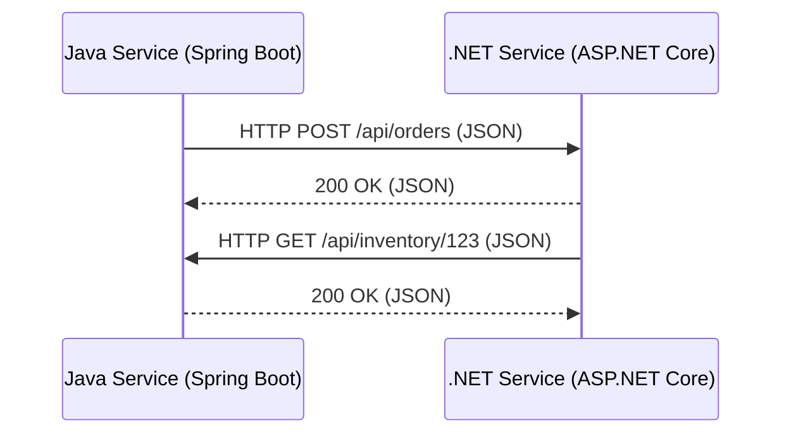
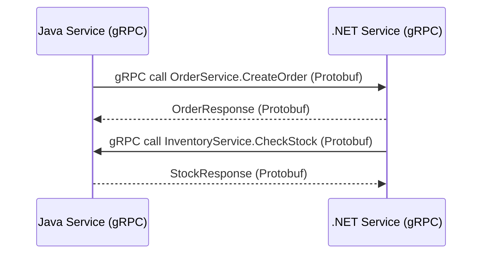
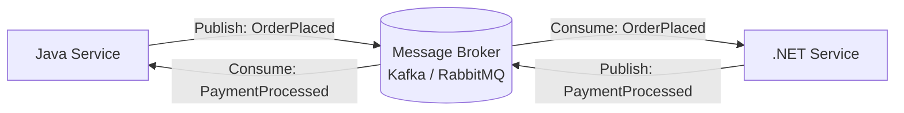
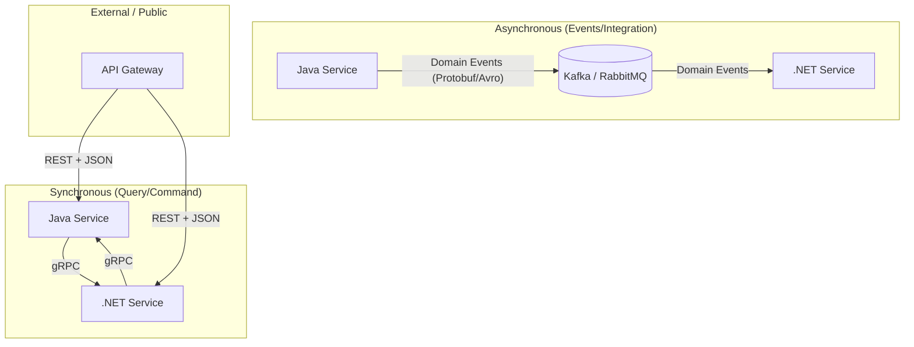

# How does a Java Microservice and .NET Microservice can talk with teach?

---

## Options Analysis

### Option A: REST (HTTP + JSON)



| Aspect | Detail |
|--------|--------|
| **Protocol** | HTTP/1.1 or HTTP/2 |
| **Serialization** | JSON (text-based, human-readable) |
| **Java tooling** | Spring Boot `RestTemplate` / `WebClient`, JAX-RS, Retrofit |
| **.NET tooling** | `HttpClient`, Refit, minimal APIs |
| **Contract** | OpenAPI/Swagger spec shared between teams |
| **Pros** | Universal, debuggable, huge ecosystem, firewall-friendly |
| **Cons** | Verbose payloads, no built-in streaming, schema enforcement is opt-in |

### Option B: gRPC (HTTP/2 + Protobuf)



| Aspect | Detail |
|--------|--------|
| **Protocol** | HTTP/2 (multiplexed, bidirectional) |
| **Serialization** | Protocol Buffers (binary, compact) |
| **Java tooling** | `grpc-java`, Spring Boot gRPC starter |
| **.NET tooling** | `Grpc.AspNetCore`, `Grpc.Net.Client` (first-class support since .NET Core 3.0) |
| **Contract** | `.proto` files — **single source of truth**, code-generated for both languages |
| **Pros** | Strongly typed, compact, fast, streaming support, backward-compatible schema evolution |
| **Cons** | Not human-readable on the wire, needs HTTP/2, harder to debug without tooling |

### Option C: Async Messaging (Broker-based)



| Aspect | Detail |
|--------|--------|
| **Brokers** | Apache Kafka, RabbitMQ, Azure Service Bus, Amazon SQS/SNS |
| **Serialization** | JSON, Avro, Protobuf (your choice) |
| **Java tooling** | Spring Kafka, Spring AMQP, MassTransit (via interop) |
| **.NET tooling** | MassTransit, NServiceBus, Confluent.Kafka, RabbitMQ.Client |
| **Contract** | Schema Registry (Confluent for Avro/Protobuf) or shared JSON schema |
| **Pros** | Fully decoupled (temporal + behavioral), resilient, scalable, natural for event-driven |
| **Cons** | Eventual consistency, debugging distributed flows, broker operational overhead |

---

## Comparison

| Criterion | REST + JSON | gRPC + Protobuf | Async Messaging |
|-----------|-------------|-----------------|-----------------|
| **Latency** | Medium (~1-5ms overhead) | Low (~0.5-2ms, binary) | Variable (ms to seconds) |
| **Throughput** | Good | Excellent (10x fewer bytes on wire) | Excellent (buffered, batched) |
| **Coupling** | Temporal + behavioral | Temporal + behavioral | **Lowest** — only data contract |
| **Schema safety** | Weak (opt-in validation) | **Strong** (code-gen from `.proto`) | Medium (schema registry helps) |
| **Debugging** | Easy (curl, Postman) | Harder (needs grpcurl, Kreya) | Hardest (distributed traces needed) |
| **Streaming** | Workarounds (SSE, WebSocket) | Native (server/client/bidirectional) | Native (continuous consumption) |
| **Cross-language** | Universal | Excellent (code-gen for both) | Universal |
| **Complexity** | Low | Medium | Medium-High |

---

## Recommendation

**Use a hybrid approach** — this is what most production polyglot systems do:



| Communication | Use |
|---------------|-----|
| **gRPC** | Service-to-service sync calls (internal). Shared `.proto` files give both Java and .NET teams a typed contract with code generation. |
| **Async messaging** | Cross-context integration events. Decouples services temporally. Use Avro or Protobuf with a schema registry for contract safety. |
| **REST + JSON** | External-facing APIs (behind API gateway). Human-readable, browser-friendly, well-understood by consumers. |

### The Shared Contract Workflow (gRPC example)

```
1.  Define `order_service.proto` in a shared Git repo
2.  Java team: `protoc --java_out` → generates Java stubs
3.  .NET team: `protoc --csharp_out` → generates C# stubs  
4.  Both services implement/consume the same interface
5.  Breaking changes → new proto version → both teams update
```

This gives you **compile-time contract verification** across languages — something REST+JSON cannot provide without extra tooling.

---

## Next Steps

1. **Which communication patterns do you need?** — Request/response? Fire-and-forget? Streaming?
2. **Do you already have a message broker** in your infrastructure (Kafka, RabbitMQ)?
3. **How many cross-language service boundaries** exist today?
4. **Is there an API gateway** in front of these services?
