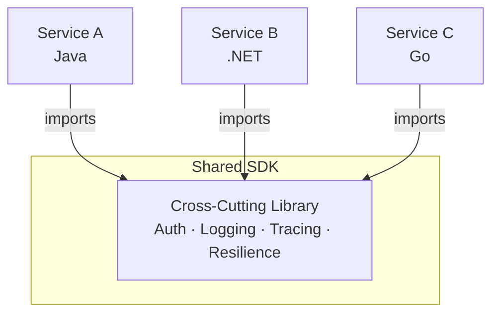
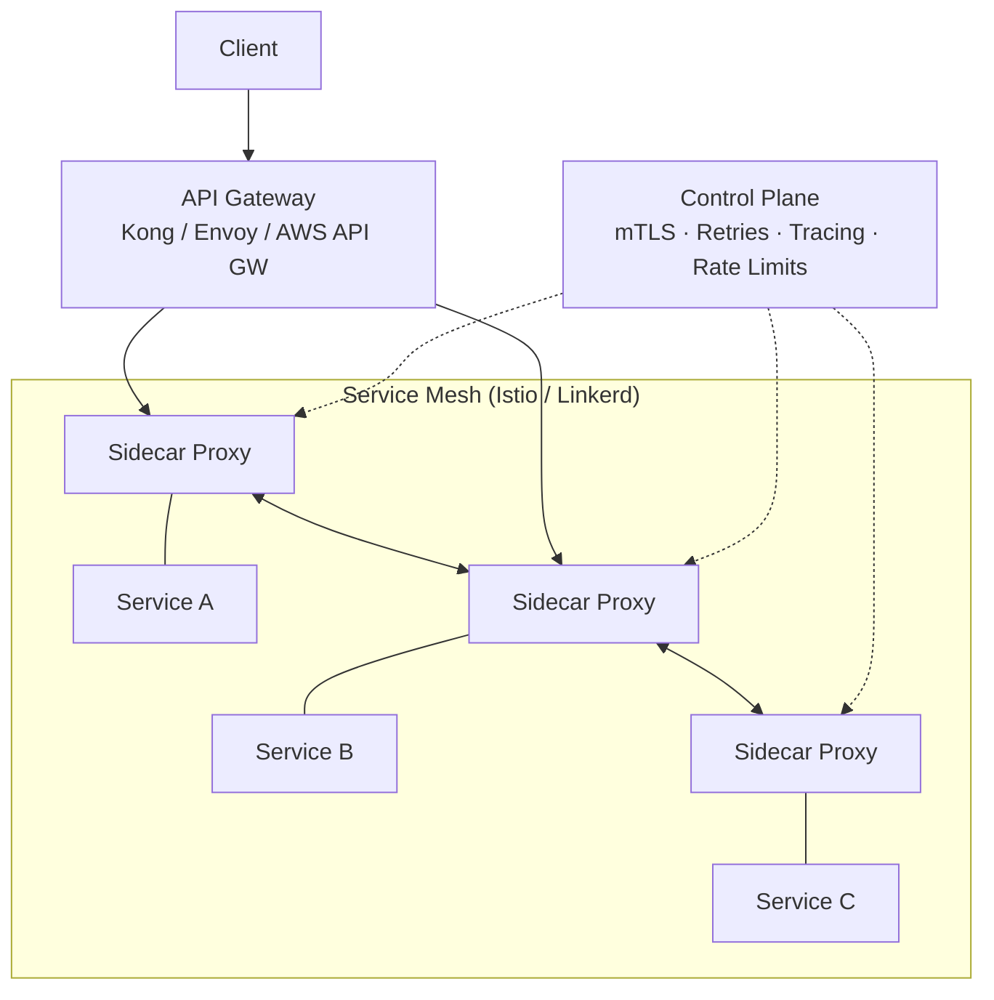
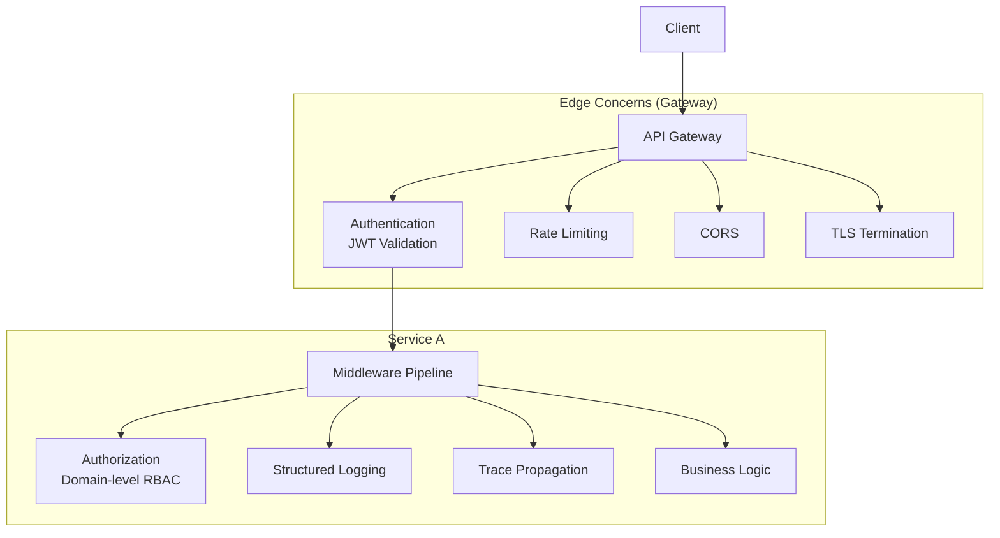
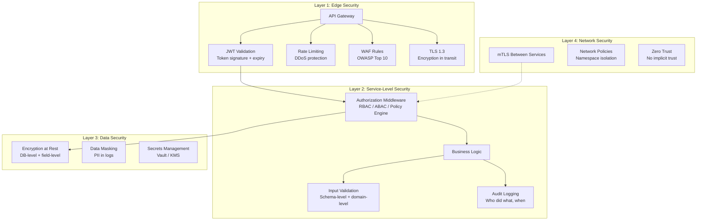
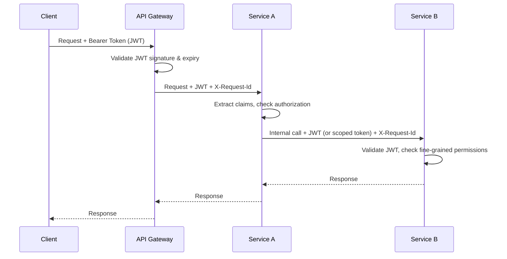

# How to handle cross-cutting concerns, such as security, in a Microservices architecture?

Cross-cutting concerns — security, logging, tracing, rate limiting, configuration — are the hardest part of microservices because they **span every service** but shouldn't be **duplicated in every service**. The architectural challenge is: how do you enforce consistency without creating coupling?

---

## 1. The Cross-Cutting Concerns Landscape

| Concern | What It Covers |
|---------|---------------|
| **Authentication & Authorization** | Who is calling? Are they allowed? |
| **Observability** | Logging, distributed tracing, metrics |
| **Resilience** | Retries, circuit breakers, timeouts, bulkheads |
| **Traffic management** | Rate limiting, throttling, load balancing |
| **Configuration** | Centralized config, feature flags, secrets |
| **Data concerns** | Encryption in transit/at rest, data masking, audit trails |

---

## 2. Options Analysis

### Option A: Shared Library / SDK Approach

Each service includes a shared library that implements the concerns.

| Criterion | Assessment |
|-----------|-----------|
| **Coupling** | High — all services depend on the library; version upgrades require redeployment |
| **Polyglot support** | Poor — must maintain one SDK per language |
| **Consistency** | Strong — if everyone uses the same version |
| **Operational cost** | Low infrastructure, high maintenance |
| **Flexibility** | Services can customize locally |

### Option B: API Gateway + Service Mesh (Infrastructure-Level)

Offload cross-cutting concerns to **infrastructure** — the application code stays clean.

| Criterion | Assessment |
|-----------|-----------|
| **Coupling** | Very low — concerns live in infrastructure, not code |
| **Polyglot support** | Excellent — sidecar is language-agnostic |
| **Consistency** | Enforced at infrastructure level — services can't bypass |
| **Operational cost** | High — must operate the mesh and gateway |
| **Flexibility** | Policy-driven configuration, no code changes |

### Option C: Hybrid (Gateway + Lightweight In-Process Middleware)

API Gateway handles **edge concerns**, in-process middleware handles **domain-aware concerns**.

| Criterion | Assessment |
|-----------|-----------|
| **Coupling** | Low — gateway owns edge; services own domain-specific policies |
| **Polyglot support** | Good — each runtime has its own middleware idiom |
| **Consistency** | Edge concerns enforced centrally; domain concerns need discipline per service |
| **Operational cost** | Medium — gateway is simpler than a full mesh |
| **Flexibility** | Best balance — coarse-grained at edge, fine-grained in-process |

---

## 3. Comparison

| Criterion | Shared Library | Gateway + Mesh | Hybrid |
|-----------|---------------|----------------|--------|
| **Coupling** | High | Very Low | Low |
| **Polyglot** | Poor | Excellent | Good |
| **Enforcement** | Opt-in | Mandatory | Edge: mandatory / Domain: opt-in |
| **Operational complexity** | Low | High | Medium |
| **Latency overhead** | None | Sidecar hop (~1ms) | Gateway hop only |
| **Team autonomy** | Low (forced upgrades) | High | High |
| **Cost** | Low | High (mesh infra) | Medium |

---

## 4. Recommendation: Hybrid Approach

Most production systems land here. Split concerns by **where they belong**:

| Layer | Concern | Implementation |
|-------|---------|---------------|
| **API Gateway** | Authentication (JWT/OAuth2 validation) | Kong, Envoy, AWS API GW, Azure APIM |
| **API Gateway** | Rate limiting, throttling | Gateway policies |
| **API Gateway** | TLS termination, CORS | Gateway config |
| **API Gateway** | Request ID injection | Custom header (e.g., `X-Request-Id`) |
| **In-Process Middleware** | Authorization (RBAC/ABAC) | Spring Security, ASP.NET Authorization |
| **In-Process Middleware** | Structured logging | SLF4J/Logback, Serilog — emit JSON with trace context |
| **In-Process Middleware** | Trace propagation | OpenTelemetry SDK (Java & .NET agents) |
| **Infrastructure** | mTLS (service-to-service encryption) | Service mesh OR cert-manager + sidecars |
| **Infrastructure** | Centralized config & secrets | Consul, Vault, AWS Secrets Manager, Azure Key Vault |
| **Infrastructure** | Metrics collection | Prometheus + OTel Collector |

---

## 5. Deep Dive: Security Specifically

Security is the most critical cross-cutting concern. Here's the layered model:

### Token Propagation Pattern

**Key decisions:**
- **Propagate the original JWT** for simplicity, or **exchange for an internal token** (token exchange / RFC 8693) if you need to scope down permissions for internal calls.
- Use **OPA (Open Policy Agent)** or a similar policy engine if authorization rules are complex and shared across services — avoids duplicating policy logic.

---

## 6. Anti-Patterns

| Anti-Pattern | Why It's Dangerous |
|--------------|-------------------|
| Each service implements its own auth | Inconsistent enforcement, easy to miss a service |
| Passing plaintext credentials between services | One compromised service leaks everything |
| Logging PII without masking | Compliance violations (GDPR, HIPAA) |
| No distributed tracing | Impossible to debug cross-service security incidents |
| Shared secrets across services | Blast radius is the entire system |
| Trusting internal network implicitly | Lateral movement after any breach |

---

## 7. Next Steps

1. **What's your current gateway?** — Already have one, or greenfield?
2. **Identity provider** — Keycloak, Auth0, Azure AD, Okta?
3. **Are you on Kubernetes?** — A service mesh becomes much more practical there.
4. **Compliance requirements?** — GDPR, HIPAA, PCI-DSS each drive specific security patterns.
5. **How many services?** — Under ~10, a gateway + middleware is plenty; 50+, a service mesh starts paying for itself.
