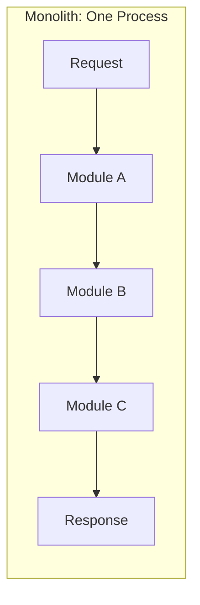
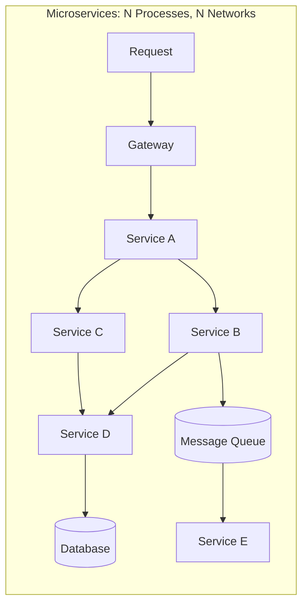
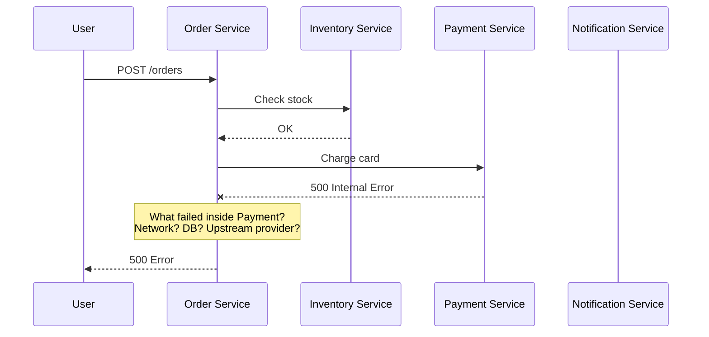
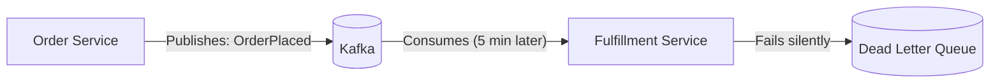
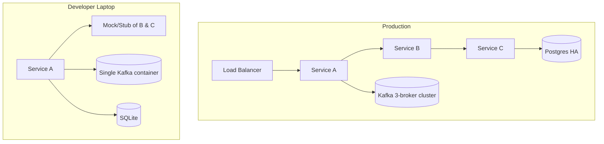
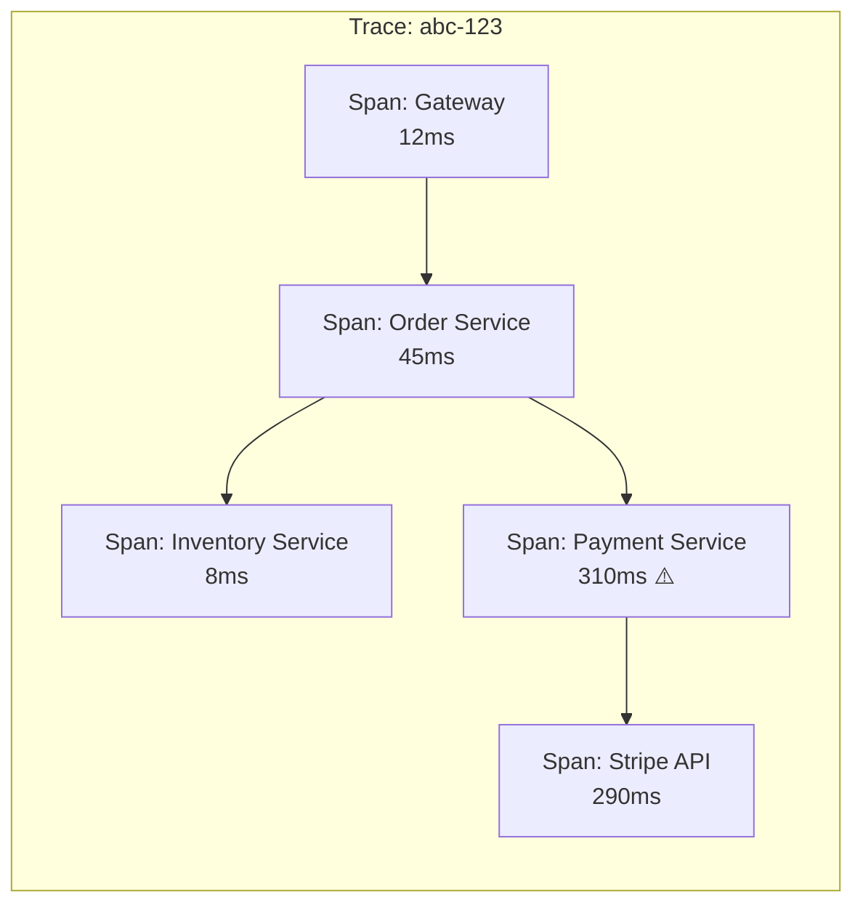
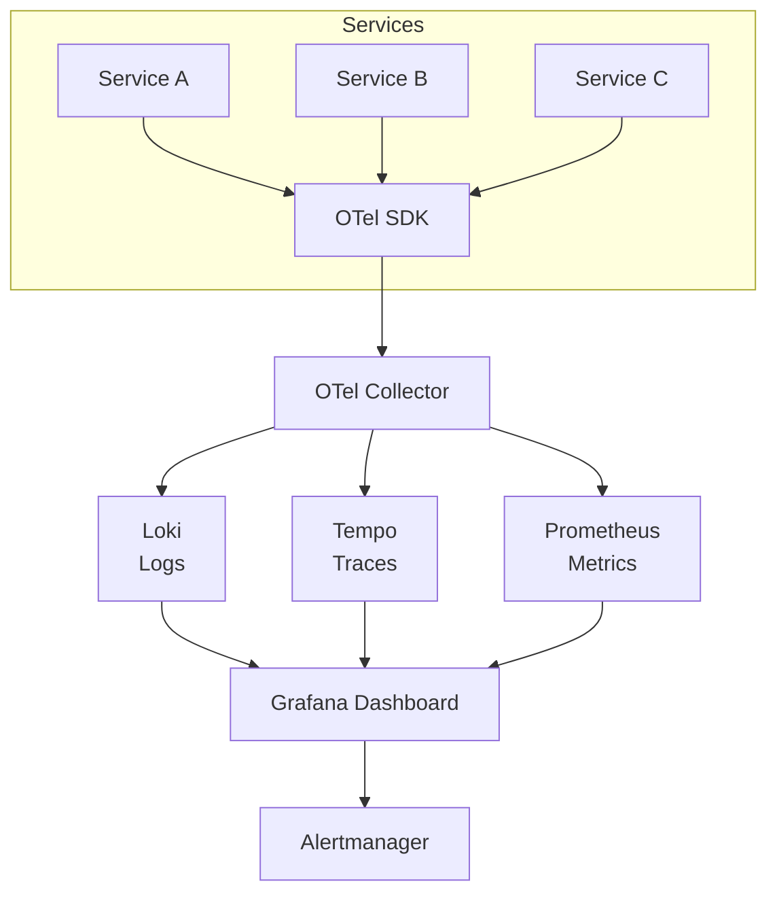

# Why debugging is so tough on Microservice Architecture?

Debugging in a monolith means attaching a debugger to one process and stepping through a call stack. In microservices, **a single user request fans out across multiple processes, networks, and data stores** — each with its own logs, failures, and timing. The debugging surface area explodes.

---

## 1. Why It's Fundamentally Harder

| Challenge | Monolith | Microservices |
|-----------|----------|---------------|
| **Call chain visibility** | Full stack trace in one process | Distributed across N services — no unified stack trace |
| **Failure location** | Exception points to exact line | Error may surface in Service D but originate in Service B |
| **Timing issues** | Deterministic in-process calls | Network latency, timeouts, retries, race conditions |
| **Log correlation** | One log file, one thread | N log streams, different formats, different clocks |
| **State inspection** | One database, one debugger | N databases, N in-flight message queues, N caches |
| **Reproducibility** | Start app, replay request | Need all N services + infra running in the right state |

---

## 2. The Seven Root Causes

### 1. Distributed Call Chains

The user sees one error. The root cause is **3 network hops deep** — and the service that failed may not even surface a useful error message.

### 2. Asynchronous Communication

- Events are processed **minutes or hours later**
- Failures land in a dead letter queue — no immediate feedback
- Temporal gap between cause and effect makes correlation hard
- **Debugging requires reasoning across time**, not just across space

### 3. Log Fragmentation

| Service | Log format | Timestamp | Timezone |
|---------|-----------|-----------|----------|
| Service A (Java) | Logback JSON | `2026-04-18T10:00:00.123Z` | UTC |
| Service B (.NET) | Serilog JSON | `2026-04-18T10:00:00.1230000+00:00` | UTC |
| Service C (Go) | Zap JSON | `1713436800.123` | Epoch |
| API Gateway | Nginx access log | `18/Apr/2026:10:00:00 +0000` | UTC |

Without a **correlation ID** flowing through all services, matching these log lines to one request is manual detective work.

### 4. Partial Failures & Degraded States

In a monolith, a function either succeeds or throws. In microservices:

| Scenario | Symptom |
|----------|---------|
| Service B is slow (not down) | Timeouts cascade upstream; looks like Service A is failing |
| Service C returns stale data from cache | Correct HTTP 200, but wrong business result |
| Message lost due to broker partition | No error anywhere — data just never arrives |
| Circuit breaker is open | Fast-fail response, but root cause is in a *different* service that recovered 5 minutes ago |

**Partial failures produce symptoms far from their root cause.**

### 5. Non-Deterministic Behavior

| Source | Impact on Debugging |
|--------|-------------------|
| Network jitter | Request works 99% of the time, fails intermittently |
| Container restarts | Ephemeral state lost mid-request |
| Message ordering | Events arrive out of order — reproducing is near-impossible |
| Auto-scaling events | New instance joins mid-saga with cold cache |
| DNS/service discovery flaps | Requests route to wrong instance briefly |

You cannot reproduce these bugs by replaying a request locally.

### 6. Local Dev Environment Mismatch

- Developers run a **subset of services** locally — mocks hide the real failures
- Docker Compose can't replicate network partitions, latency, or pod scheduling
- The bug only happens in production under real load and real concurrency

### 7. Blast Radius of Schema/Contract Changes

A producer changes a field name. The consumer silently ignores it (tolerant reader) or silently breaks. No compile-time error, no immediate exception — just **wrong data flowing silently downstream** until someone notices a business metric is off.

---

## 3. Solutions: The Observability Stack

### Option A: Logging-Centric (ELK/Loki)

| Aspect | Detail |
|--------|--------|
| **Stack** | Structured JSON logs → Fluentd/Promtail → Elasticsearch/Loki → Kibana/Grafana |
| **Correlation** | Mandatory `traceId` + `spanId` in every log line |
| **Strength** | Deep searchability, familiar to developers |
| **Weakness** | Logs alone lack causal relationships — you see *what* happened, not *why* |

### Option B: Distributed Tracing (Jaeger/Tempo/Zipkin)

| Aspect | Detail |
|--------|--------|
| **Stack** | OpenTelemetry SDK → OTel Collector → Jaeger/Tempo |
| **Correlation** | W3C Trace Context auto-propagated across HTTP/gRPC/messaging |
| **Strength** | Visualizes the full request path, shows *where* time is spent |
| **Weakness** | Sampling may miss rare failures; traces are request-scoped (miss background jobs) |

### Option C: Full Observability (Three Pillars + Events)

| Pillar | Tool | What It Answers |
|--------|------|----------------|
| **Logs** | Loki / Elasticsearch | *What happened* in detail |
| **Traces** | Jaeger / Tempo | *Where* in the call chain and *how long* |
| **Metrics** | Prometheus / Datadog | *How much* — error rates, latency percentiles, saturation |
| **Events** | Audit log / Change feed | *Why* — deployments, config changes, scaling events correlated with incidents |

---

## 4. Comparison

| Criterion | Logging Only | Tracing Only | Full Observability |
|-----------|-------------|-------------|-------------------|
| **Root cause speed** | Slow (manual correlation) | Medium (visual, but gaps) | Fast (cross-reference all signals) |
| **Cost** | Low-Medium | Low | Medium-High |
| **Setup complexity** | Low | Medium | High |
| **Coverage** | All events | Sampled requests | All events + sampled traces + aggregated metrics |
| **Debugging async flows** | Hard | Hard (traces don't span queues well) | Best (link trace IDs in messages) |

---

## 5. Recommendation: Minimum Viable Debugging Stack

| Practice | Priority | Why |
|----------|----------|-----|
| **Correlation ID in every request** | P0 | Without this, nothing else works. Propagate `traceId` via headers in sync calls and message metadata in async calls |
| **Structured JSON logging** | P0 | Queryable, parseable, indexable. Include `traceId`, `spanId`, `service`, `level` |
| **Distributed tracing (OpenTelemetry)** | P0 | Auto-instrumentation for Java (agent) and .NET (SDK) — near-zero code changes |
| **Centralized log aggregation** | P1 | Loki or Elasticsearch — search across all services by `traceId` |
| **Error tracking** | P1 | Sentry or similar — groups exceptions, shows frequency, links to traces |
| **Health checks + readiness probes** | P1 | Distinguishes "service is down" from "service is slow" |
| **Metrics dashboards (RED method)** | P2 | Rate, Errors, Duration per service — spot anomalies before they become incidents |
| **Dead letter queue monitoring** | P2 | Alert on DLQ depth — async failures are invisible without this |

---

## 6. Anti-Patterns

| Anti-Pattern | Consequence |
|--------------|------------|
| `console.log` / `System.out.println` debugging | Lost on container restart, no correlation, no structure |
| No correlation ID propagation | Cannot trace a request across any service boundary |
| Sampling 100% of traces in production | Storage cost explosion; sample at 1-10% and use tail-based sampling for errors |
| Separate observability stacks per team | Can't correlate across teams — defeats the purpose |
| Only alerting on errors, not latency | Slow services cause cascading timeouts that look like errors elsewhere |
| Not including deployment events in dashboards | "What changed?" is the first question in every incident |

---

## 7. Next Steps

1. **Do you already have observability tooling** (Prometheus, Grafana, ELK, Jaeger)?
2. **What's your deployment platform** — Kubernetes, ECS, VMs? This determines how to collect telemetry.
3. **What's your current logging approach** — structured JSON or unstructured text?
4. **How many services** are in the critical request path? That sets the tracing priority.
