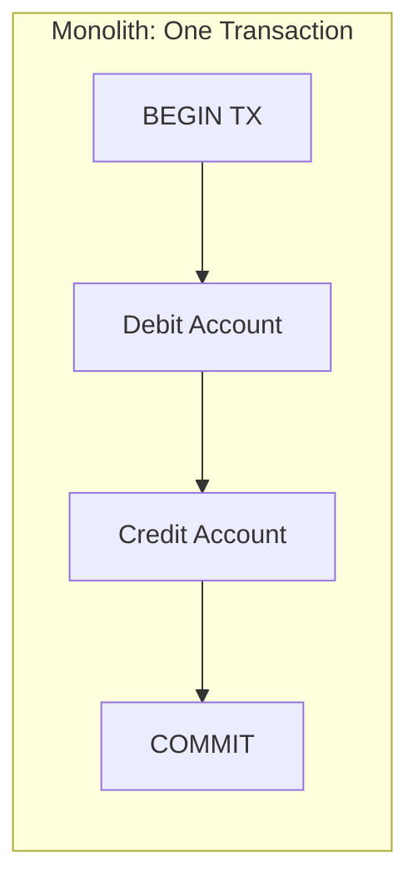
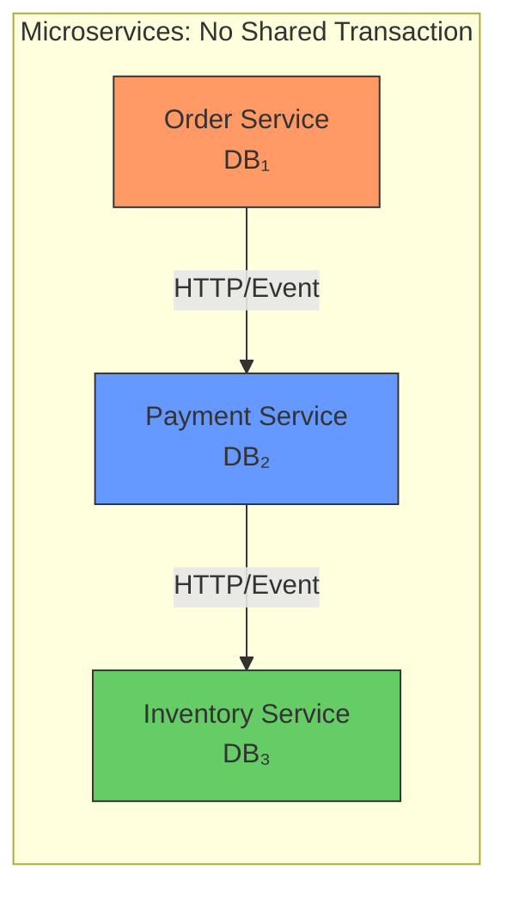
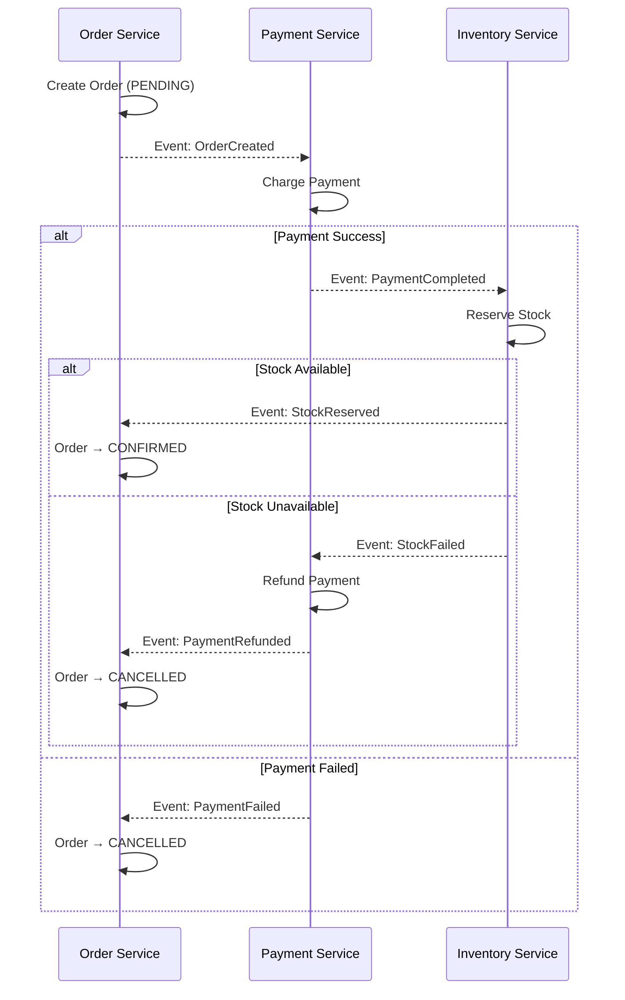
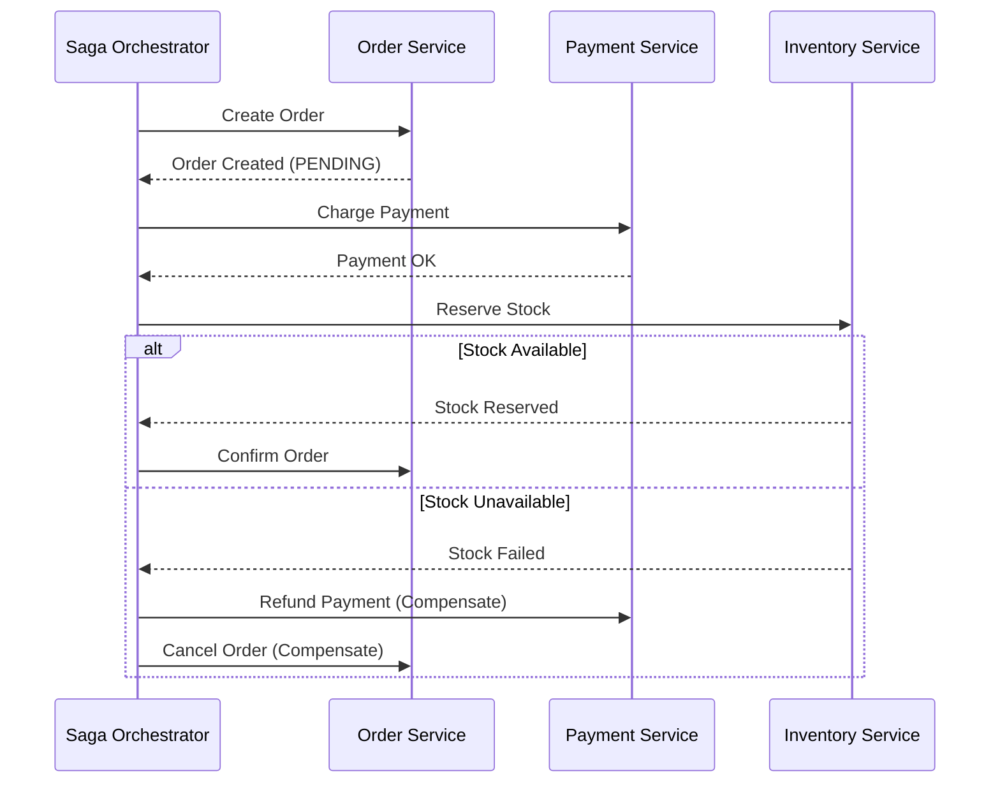
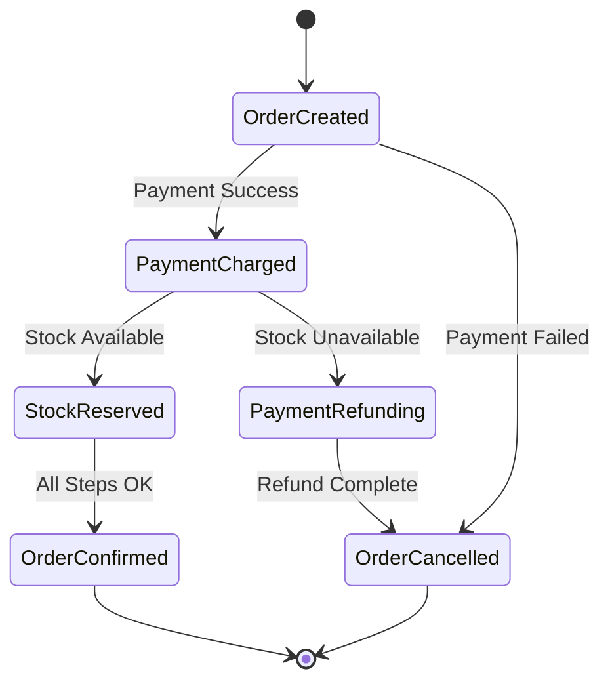
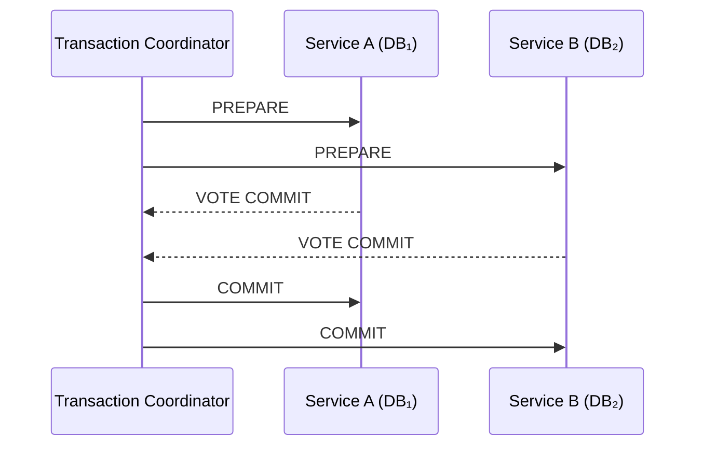
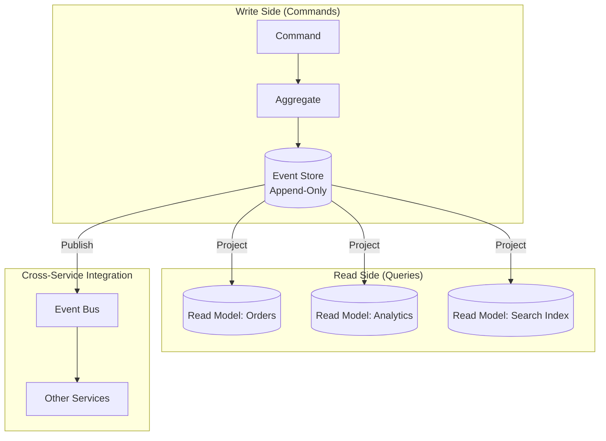
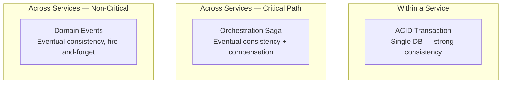
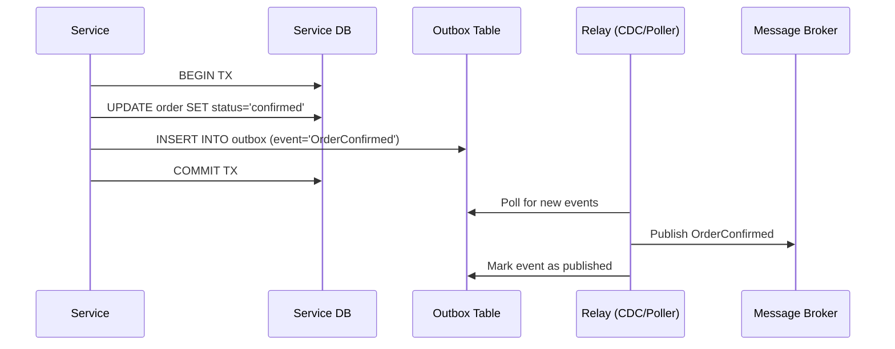

# How to handle data consistency in a Microservices architecture?

In a monolith, you wrap operations in a single ACID transaction and the database guarantees consistency. In microservices, **each service owns its database** — there is no distributed `BEGIN TRANSACTION` that spans services. Data consistency becomes an **architectural problem**, not a database problem.

The fundamental tension:

> **Strong consistency** requires coordination → reduces availability and throughput  
> **Eventual consistency** requires no coordination → requires compensating logic and tolerance for stale reads

This is the CAP/PACELC theorem in practice.

---

## 1. The Problem Space

**What can go wrong:**

| Scenario | What Happens |
|----------|-------------|
| Payment succeeds, Inventory update fails | Customer charged but order not fulfilled |
| Order created, Payment service is down | Order exists with no payment — inconsistent state |
| Event published, consumer crashes before processing | Event lost — data diverges silently |
| Two services update related data concurrently | Conflicting states, no single arbiter |

---

## 2. Consistency Models

| Model | Guarantee | Latency | Availability |
|-------|-----------|---------|--------------|
| **Strong (linearizable)** | All reads see the latest write | High (coordination required) | Lower (blocks on consensus) |
| **Eventual** | All replicas converge *eventually* | Low (no coordination) | High |
| **Causal** | Reads respect causal order of writes | Medium | Medium-High |

**PACELC implication:** Even when there's no partition (normal operation), you still trade **latency** for **consistency**. Most microservices choose eventual consistency and design around it.

---

## 3. Options Analysis

### Option A: Saga Pattern (Choreography)

Each service reacts to events and publishes its own events. No central coordinator.

| Criterion | Assessment |
|-----------|-----------|
| **Coupling** | Very low — services only know about events, not each other |
| **Complexity** | High — compensating logic scattered across services; hard to see the full flow |
| **Failure handling** | Each service must implement its own compensation (rollback) |
| **Debugging** | Hard — no single place shows saga state |
| **Scalability** | Excellent — no bottleneck coordinator |

### Option B: Saga Pattern (Orchestration)

A central **saga orchestrator** coordinates the steps and knows the compensating actions.

| Criterion | Assessment |
|-----------|-----------|
| **Coupling** | Medium — orchestrator knows all participants |
| **Complexity** | Medium — logic centralized, easier to reason about |
| **Failure handling** | Orchestrator defines the full compensation chain |
| **Debugging** | Good — saga state machine is inspectable in one place |
| **Scalability** | Orchestrator can become a bottleneck under extreme load |

### Option C: Two-Phase Commit (2PC)

Distributed transaction protocol — a coordinator asks all participants to prepare, then commit.

| Criterion | Assessment |
|-----------|-----------|
| **Coupling** | Very high — all participants block waiting for coordinator |
| **Consistency** | Strong — true ACID across services |
| **Availability** | Low — any participant or coordinator failure blocks all |
| **Latency** | High — 2 round trips minimum, lock held during prepare phase |
| **Scalability** | Poor — locks held across network, contention increases with participants |

### Option D: Event Sourcing + CQRS

Store state as a sequence of immutable events. Derive read models (projections) from the event stream.

| Criterion | Assessment |
|-----------|-----------|
| **Consistency** | Strong within aggregate, eventual across services |
| **Auditability** | Full history — can replay to any point in time |
| **Complexity** | High — event schema evolution, projection rebuilds, idempotency |
| **Debugging** | Excellent — event log is the single source of truth |
| **Scalability** | Excellent — reads and writes scale independently |

---

## 4. Comparison

| Criterion | Choreography Saga | Orchestration Saga | 2PC | Event Sourcing + CQRS |
|-----------|-------------------|-------------------|-----|----------------------|
| **Consistency** | Eventual | Eventual | Strong | Eventual (across services) |
| **Coupling** | Very Low | Medium | Very High | Low |
| **Debugging** | Hard | Good | Simple | Excellent (event replay) |
| **Latency** | Low | Low-Medium | High | Low (writes), Variable (reads) |
| **Scalability** | Excellent | Good | Poor | Excellent |
| **Complexity** | High (scattered) | Medium (centralized) | Low (but fragile) | High (infrastructure) |
| **Failure recovery** | Compensating events per service | Orchestrator handles compensation | Automatic rollback | Replay from event log |

---

## 5. Recommendation: Decision Matrix

There is no universal answer. Match the pattern to the **consistency requirement**:

| Requirement | Recommended Pattern | Example |
|-------------|-------------------|---------|
| **Must be atomic** (money, compliance) | Orchestration Saga with idempotency | Payment + Order completion |
| **Can tolerate seconds of delay** | Choreography Saga | Notification after order, analytics update |
| **Must be strongly consistent** (legacy, regulatory) | 2PC (only if < 3 participants, low throughput) | Cross-database writes in a monolith decomposition |
| **Need full audit trail + replay** | Event Sourcing + CQRS | Financial ledger, regulatory systems |
| **Read-heavy with stale tolerance** | CQRS read projections | Dashboards, search, reporting |

### The Practical Default

**Rule of thumb:** Strong consistency *within* a service boundary, eventual consistency *across* service boundaries, with sagas to manage the critical business flows.

---

## 6. Key Implementation Patterns

| Pattern | Purpose |
|---------|---------|
| **Idempotency keys** | Safely retry any operation without side effects — critical for sagas |
| **Outbox pattern** | Atomically write to DB + publish event (avoids dual-write problem) |
| **Inbox pattern** | Deduplicate incoming events at the consumer |
| **Dead letter queue** | Capture failed events for manual/automated retry |
| **Compensating transactions** | Undo the effect of a previous step (not rollback — a new forward action) |
| **Read-your-writes** | Route reads to primary after a write for session consistency |

### The Outbox Pattern (Solves Dual-Write)

This avoids the classic problem: "I wrote to my DB but the event publish failed (or vice versa)." The outbox makes event publishing **part of the same local transaction**.

---

## 7. Anti-Patterns

| Anti-Pattern | Why It Fails |
|--------------|-------------|
| **Distributed transactions across services** | Blocks all participants, doesn't scale, single point of failure |
| **Dual writes** (write to DB + publish event without outbox) | If either fails, data diverges — and it *will* fail |
| **Synchronous consistency across 5+ services** | Latency compounds, availability drops multiplicatively |
| **Ignoring idempotency** | Retries cause duplicate orders, double charges |
| **No saga state tracking** | When a saga fails mid-way, no one knows which steps completed |
| **Treating eventual consistency as a bug** | It's a design choice — build UIs and APIs that communicate "processing" states explicitly |

---

## 8. Next Steps

1. **What are your critical business flows** that require consistency across services? (e.g., order→payment→fulfillment)
2. **What message broker** are you using or considering? (Kafka offers stronger ordering guarantees; RabbitMQ is simpler for task queues)
3. **What's your tolerance for stale reads?** (seconds? minutes? — drives CQRS projection lag decisions)
4. **Do you have regulatory requirements** for auditability? (Event Sourcing becomes strongly motivated)
