# How do you ensure that Microservices are scalable and resilient?

Scalability and resilience are **different properties** that require different strategies but overlap in implementation. Systems that scale but aren't resilient collapse under partial failure. Systems that are resilient but don't scale hit capacity walls under growth.

| Property | Definition | Enemy |
|----------|-----------|-------|
| **Scalability** | Handle increasing load by adding resources without redesign | Bottlenecks, shared state, synchronous coupling |
| **Resilience** | Continue operating (possibly degraded) when components fail | Cascading failures, single points of failure, tight coupling |

---

## 1. Scalability: The Two Dimensions

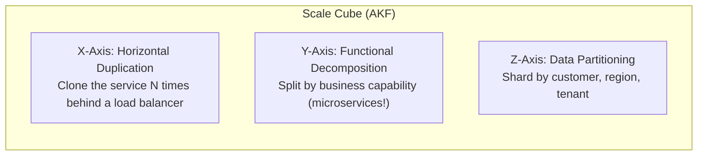

| Axis | What It Scales | Example | Limitation |
|------|---------------|---------|------------|
| **X-axis** | Throughput | 10 replicas of Order Service behind a load balancer | All replicas need access to the same data — DB becomes the bottleneck |
| **Y-axis** | Complexity / team throughput | Order Service split from Payment Service | Already done if you're in microservices |
| **Z-axis** | Data volume / multi-tenancy | Customer A → Shard 1, Customer B → Shard 2 | Cross-shard queries are expensive |

---

## 2. Scalability Patterns

### Option A: Stateless Services + Horizontal Scaling

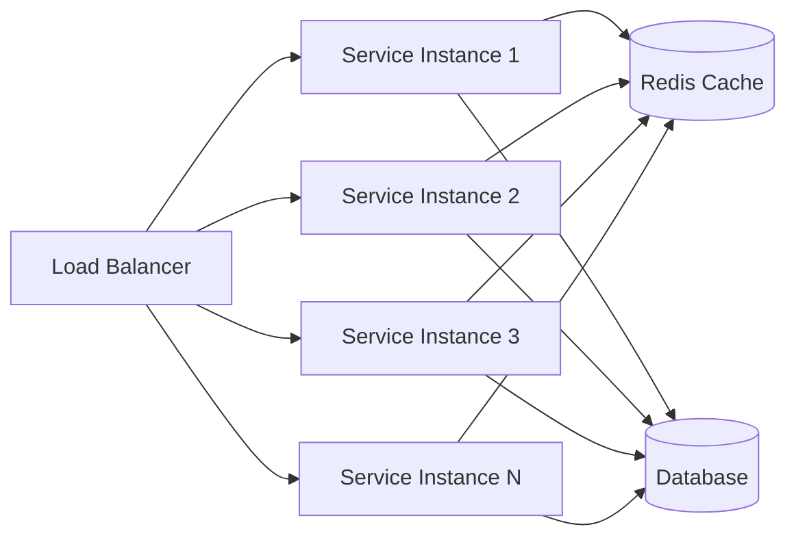

| Criterion | Detail |
|-----------|--------|
| **Principle** | No in-process state — session/state externalized to Redis, DB, or object store |
| **Scaling trigger** | CPU, memory, or request queue depth via auto-scaler (HPA in K8s) |
| **Bottleneck** | Database — solved with read replicas, connection pooling, caching |
| **Complexity** | Low — just add instances |

### Option B: CQRS — Separate Read and Write Paths

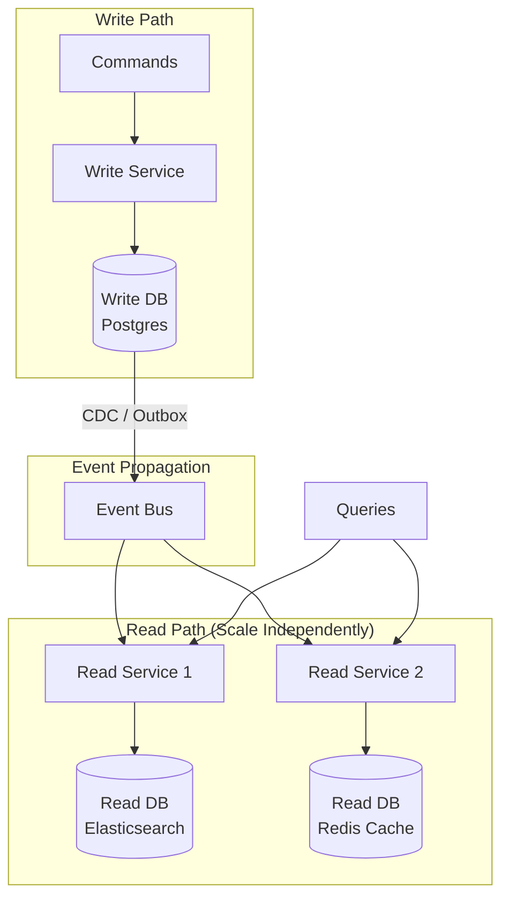

| Criterion | Detail |
|-----------|--------|
| **When** | Read:write ratio > 10:1 — most systems are read-heavy |
| **Benefit** | Scale reads and writes independently; optimize read stores for query patterns |
| **Trade-off** | Eventual consistency between write and read models; added infrastructure |

### Option C: Event-Driven with Backpressure

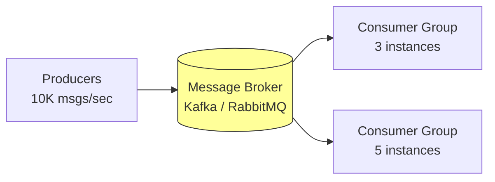

| Criterion | Detail |
|-----------|--------|
| **When** | Bursty traffic, async workloads, batch processing |
| **Benefit** | Broker absorbs spikes; consumers scale independently from producers |
| **Backpressure** | Consumer lag triggers auto-scaling; producers never overwhelmed by slow consumers |
| **Trade-off** | Eventual consistency; message ordering per partition only (Kafka) |

---

## 3. Resilience Patterns

### The Cascading Failure Problem

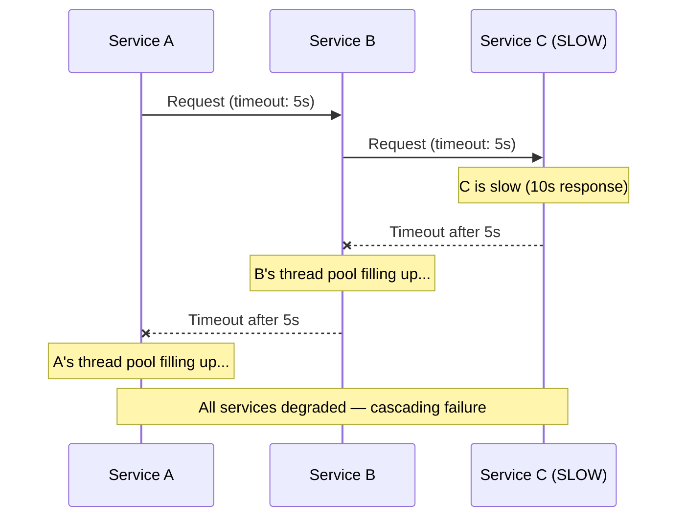

**One slow service brings down the entire chain.** Resilience patterns break this cascade.

### Pattern 1: Circuit Breaker

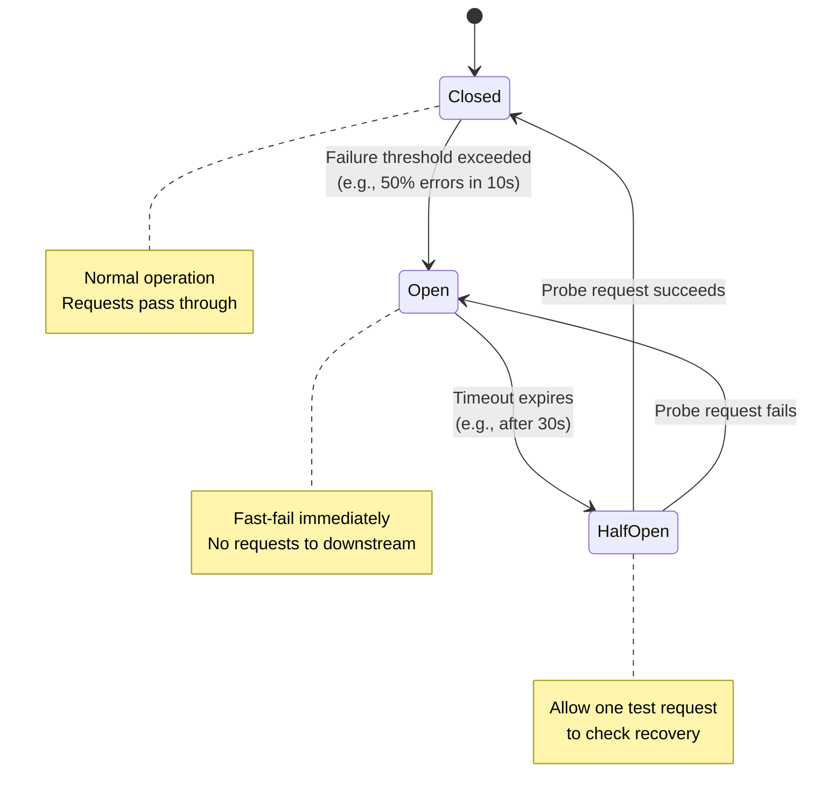

| Aspect | Detail |
|--------|--------|
| **Implementation** | Resilience4j (Java), Polly (.NET), or service mesh (Istio) |
| **Config** | Failure rate threshold, sliding window size, wait duration in open state |
| **Fallback** | Return cached data, default response, or graceful error |

### Pattern 2: Bulkhead Isolation

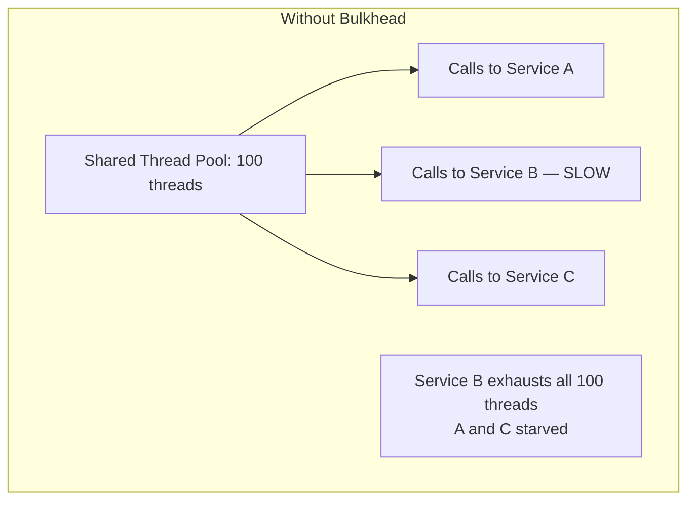

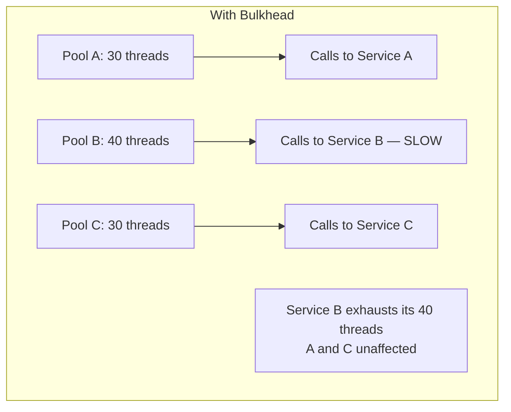

| Aspect | Detail |
|--------|--------|
| **Principle** | Isolate failure domains — one slow dependency can't saturate the entire service |
| **Types** | Thread pool isolation, semaphore isolation, process-level (sidecar) |
| **Implementation** | Resilience4j Bulkhead, Polly Bulkhead, separate connection pools per downstream |

### Pattern 3: Retry with Exponential Backoff + Jitter

```
Attempt 1: immediate
Attempt 2: wait 100ms + random(0-50ms)
Attempt 3: wait 200ms + random(0-100ms)
Attempt 4: wait 400ms + random(0-200ms)
→ Give up, trigger fallback
```

| Aspect | Detail |
|--------|--------|
| **Why jitter?** | Without jitter, all retries hit at the same instant → thundering herd |
| **Idempotency** | Only retry **idempotent** operations (GETs, operations with idempotency keys) |
| **Anti-pattern** | Retrying non-idempotent writes → duplicate orders, double charges |

### Pattern 4: Timeout Budgets

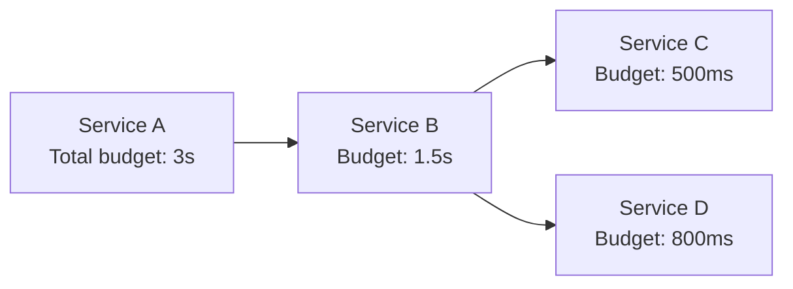

| Aspect | Detail |
|--------|--------|
| **Principle** | Propagate a **deadline** through the call chain; each service deducts its own processing time |
| **Implementation** | gRPC deadlines (built-in), custom `X-Request-Deadline` header for REST |
| **Benefit** | No service waits longer than the caller is willing to wait — prevents thread pool starvation |

### Pattern 5: Fallback Strategies

| Strategy | When | Example |
|----------|------|---------|
| **Cache fallback** | Downstream is unavailable | Serve last-known product prices from local cache |
| **Default value** | Non-critical data missing | Show "N/A" instead of failing the entire page |
| **Graceful degradation** | Feature partially unavailable | Show product listing without personalized recommendations |
| **Queue for retry** | Operation must eventually complete | Write to outbox, process when downstream recovers |

---

## 4. Infrastructure-Level Resilience

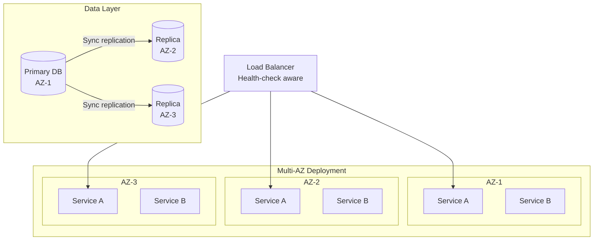

| Pattern | What It Provides |
|---------|-----------------|
| **Multi-AZ deployment** | Survives entire datacenter failures |
| **Health checks + readiness probes** | Load balancer routes away from unhealthy instances |
| **Auto-scaling (HPA / KEDA)** | Scale on CPU, memory, queue depth, custom metrics |
| **PodDisruptionBudgets (K8s)** | Ensure minimum replicas during rolling updates or node drains |
| **Database replicas** | Read scaling + failover if primary goes down |
| **Multi-region (active-active)** | Survives entire region failures; adds latency and consistency complexity |

---

## 5. Comparison: Where to Invest First

| Strategy | Impact on Scalability | Impact on Resilience | Complexity | Priority |
|----------|----------------------|---------------------|------------|----------|
| Stateless services + auto-scaling | High | Medium | Low | **P0** |
| Circuit breakers | Low | **High** | Low | **P0** |
| Timeouts on every outbound call | Low | **High** | Low | **P0** |
| Health checks + readiness probes | Medium | **High** | Low | **P0** |
| Bulkhead isolation | Low | High | Medium | **P1** |
| Retry + backoff + jitter | Low | Medium | Low | **P1** |
| CQRS (separate read/write) | **High** | Medium | Medium-High | **P1** if read-heavy |
| Event-driven async | High | High | Medium | **P1** |
| Multi-AZ deployment | Medium | **High** | Medium | **P1** |
| Data partitioning / sharding | **High** | Medium | High | **P2** |
| Multi-region active-active | **High** | **High** | Very High | **P3** |

---

## 6. The Full Picture

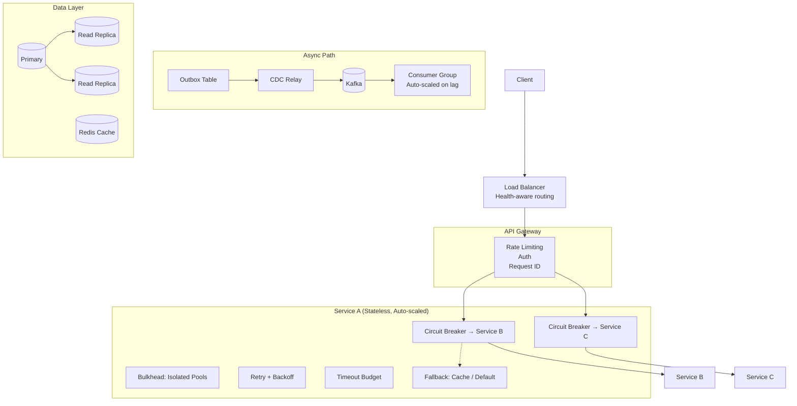

---

## 7. Anti-Patterns

| Anti-Pattern | Consequence |
|--------------|------------|
| No timeouts on outbound calls | One slow dependency locks up all threads |
| Retry storms without backoff/jitter | DDoS your own downstream service |
| Scaling vertically instead of horizontally | Single point of failure; ceiling on capacity |
| Shared in-memory state across instances | Can't scale horizontally; sticky sessions required |
| No circuit breakers | Cascading failures propagate in milliseconds |
| Health check that returns 200 always | Load balancer routes to broken instances |
| Auto-scaling on CPU only | Queue-based services need to scale on queue depth |
| Same SLA for all endpoints | Critical paths get degraded by bulk/reporting traffic |

---

## 8. Observability for Scalability & Resilience

You can't scale or recover from what you can't measure.

| Metric | Tells You | Alert Threshold |
|--------|----------|-----------------|
| **Request rate** (per service) | Traffic patterns, hotspots | Unexpected spikes (> 2× baseline) |
| **Error rate** (5xx) | Service health | > 1% of requests |
| **P99 latency** | Tail latency — the real user experience | > SLA target |
| **Circuit breaker state** | Downstream health | Any transition to OPEN |
| **Consumer lag** (Kafka) | Processing falling behind | Growing lag for > 5 min |
| **Thread pool saturation** | Bulkhead pressure | > 80% utilization |
| **Pod restart count** | OOM kills, crash loops | Any restart |

---

## 9. Next Steps

1. **What are your current scaling bottlenecks?** — CPU-bound? IO-bound? Database?
2. **What's your deployment platform?** — Kubernetes, ECS, VMs? HPA/KEDA availability matters.
3. **Have you experienced cascading failures?** — Knowing the failure mode shapes the priority.
4. **What are your SLA targets?** — 99.9% uptime? P99 < 200ms? This drives the investment level.
5. **Stateful services?** — Any services with in-memory state or sticky sessions that need refactoring?
