# How to handle service communication and data sharing in a Microservices architecture?

Service communication and data sharing are **two sides of the same coin** — how services talk determines how data flows. The architectural tension is:

> **Each service owns its data** (loose coupling) → but services need each other's data to fulfill business operations → **how do you share data without sharing databases?**

Get this wrong and you end up with either a distributed monolith (shared DB) or a chatty mess (N² API calls).

---

## 1. Communication Styles Taxonomy

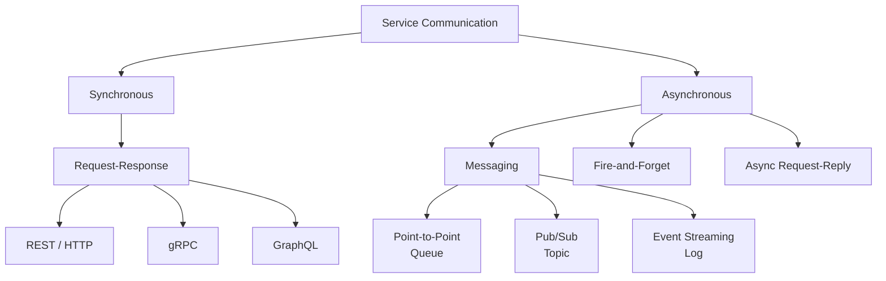

| Style | Coupling | When to Use |
|-------|---------|-------------|
| **Sync request-response** | Temporal + behavioral | Queries that need immediate answers; human-facing latency-sensitive paths |
| **Async messaging (commands)** | Behavioral only | "Do this" — task delegation; producer doesn't wait for result |
| **Async events (pub/sub)** | Data contract only | "This happened" — producer doesn't know or care about consumers |
| **Event streaming** | Data contract only | Ordered, replayable log of facts — consumers process at their own pace |

---

## 2. Synchronous Communication Patterns

### Option A: REST (HTTP + JSON)

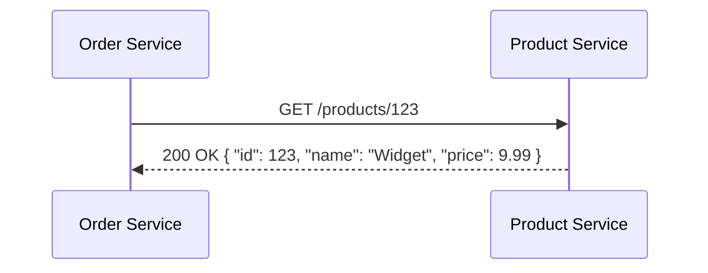

| Criterion | Assessment |
|-----------|-----------|
| **Simplicity** | Highest — universal, tooling everywhere |
| **Performance** | Medium — text serialization, HTTP/1.1 overhead |
| **Contract safety** | Weak — JSON has no schema enforcement without OpenAPI validation |
| **Streaming** | Workaround only (SSE, chunked transfer) |
| **Best for** | External APIs, BFF aggregation, CRUD operations |

### Option B: gRPC (HTTP/2 + Protobuf)

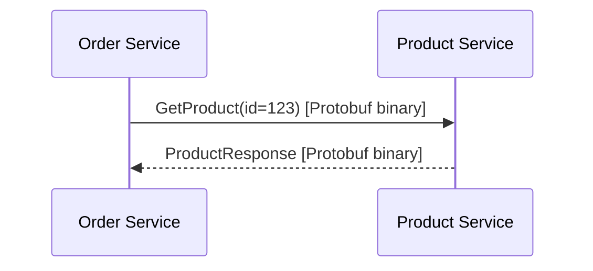

| Criterion | Assessment |
|-----------|-----------|
| **Performance** | High — binary serialization, HTTP/2 multiplexing |
| **Contract safety** | Strong — `.proto` file is the single source of truth; breaking changes detected at compile time |
| **Streaming** | Native bidirectional streaming |
| **Best for** | Internal service-to-service, high-throughput paths, polyglot environments |

### Option C: GraphQL (Federation)

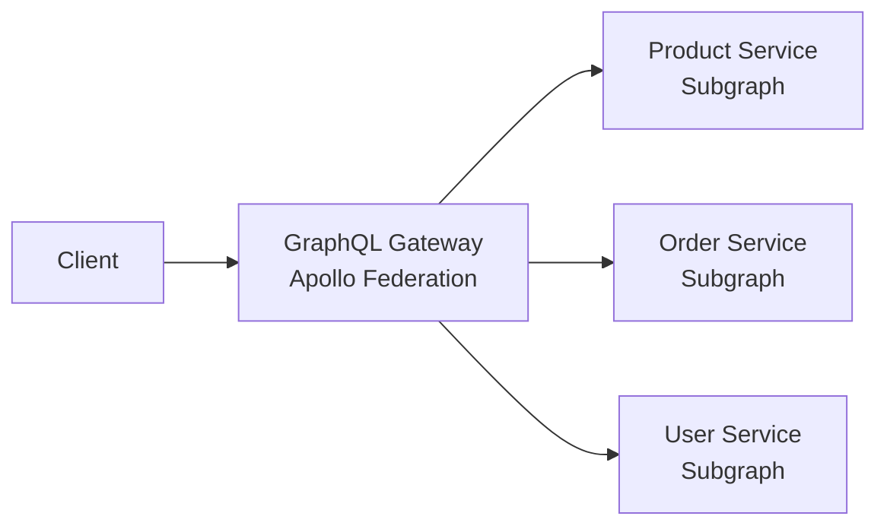

| Criterion | Assessment |
|-----------|-----------|
| **Flexibility** | Client defines the shape of the response — no over/under-fetching |
| **Coupling** | Medium — gateway stitches schemas; services must expose GraphQL subgraphs |
| **Performance** | Risk of N+1 queries if resolvers aren't optimized; requires DataLoader pattern |
| **Best for** | BFF layer for complex UIs that aggregate from multiple services |

### Sync Comparison

| Criterion | REST | gRPC | GraphQL Federation |
|-----------|------|------|-------------------|
| **Latency** | Medium | Low | Variable (depends on query complexity) |
| **Payload size** | Large (JSON text) | Small (Protobuf binary) | Medium (JSON, but only requested fields) |
| **Contract enforcement** | Opt-in (OpenAPI) | Built-in (`.proto`) | Built-in (schema) |
| **Browser support** | Native | Needs grpc-web proxy | Native |
| **Polyglot** | Universal | Excellent (code-gen) | Good (subgraph per language) |
| **Fan-out aggregation** | Manual (BFF code) | Manual | Built-in (federation) |

---

## 3. Asynchronous Communication Patterns

### Pattern 1: Event Notification ("Something happened")

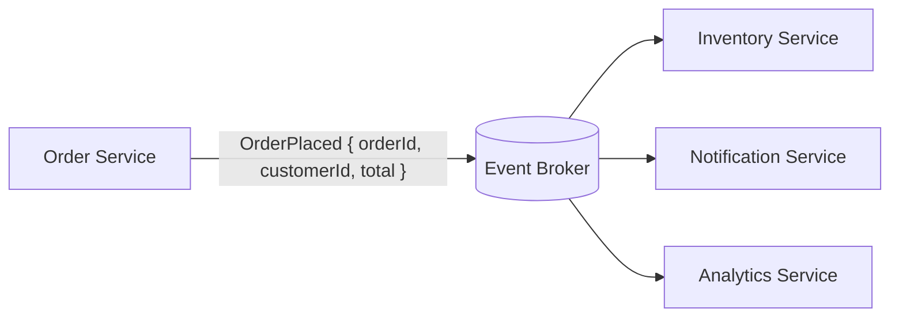

- Producer publishes a **fact** — doesn't know who consumes it
- Minimal data in the event — just enough to identify what happened
- Consumers may need to **call back** for full details

| Aspect | Detail |
|--------|--------|
| **Coupling** | Lowest — producer is completely unaware of consumers |
| **Data freshness** | Eventual — consumers react asynchronously |
| **Risk** | Consumers calling back for details creates hidden sync coupling |

### Pattern 2: Event-Carried State Transfer ("Here's the data you need")

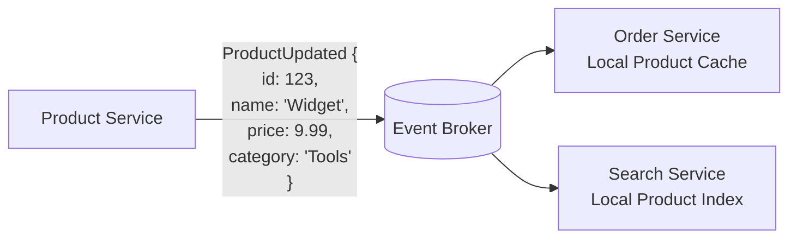

- Producer includes the **full relevant data** in the event
- Consumers build **local read-optimized copies** — no callback needed
- Eliminates runtime dependency between services

| Aspect | Detail |
|--------|--------|
| **Coupling** | Data contract only — no runtime calls between services |
| **Data freshness** | Eventual — local copies lag behind the source |
| **Trade-off** | Data duplication; events grow larger; schema evolution matters |
| **Best for** | Eliminating sync calls for reference data (products, users, catalogs) |

### Pattern 3: Command Message ("Do this for me")

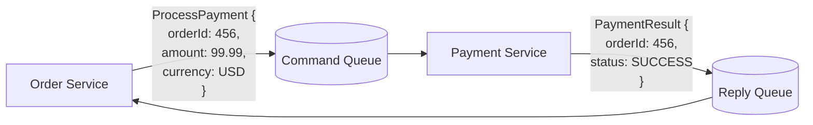

| Aspect | Detail |
|--------|--------|
| **Coupling** | Behavioral — sender knows the receiver's capability |
| **Reliability** | Guaranteed delivery via queue; survives receiver downtime |
| **Pattern** | Async request-reply — decouples the caller temporally |
| **Best for** | Task delegation where the result is needed eventually (not immediately) |

### Pattern 4: Event Streaming (Log-based)

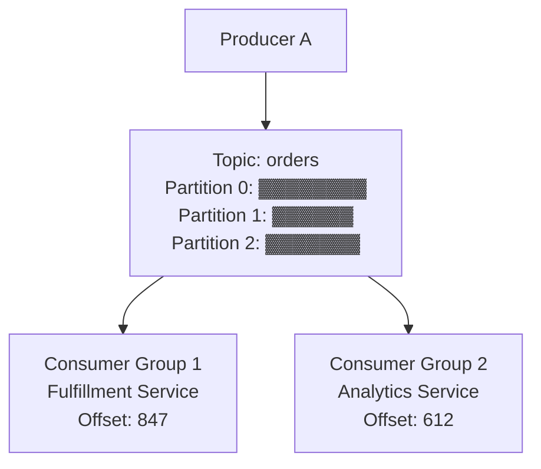

| Aspect | Detail |
|--------|--------|
| **Ordering** | Per-partition ordering guaranteed (Kafka) |
| **Replay** | Consumers can rewind and reprocess — powerful for rebuilding state |
| **Retention** | Events retained for days/weeks — acts as a buffer and audit log |
| **Best for** | High-throughput event pipelines, event sourcing, audit requirements |

---

## 4. Data Sharing Strategies

This is where most teams struggle. The rules:

> 1. **Each service owns its data** — no shared databases  
> 2. **Data that needs to be queried locally should be replicated via events**  
> 3. **Data that needs to be aggregated is composed at query time or via projections**

### Strategy A: API Composition (Query-Time Aggregation)

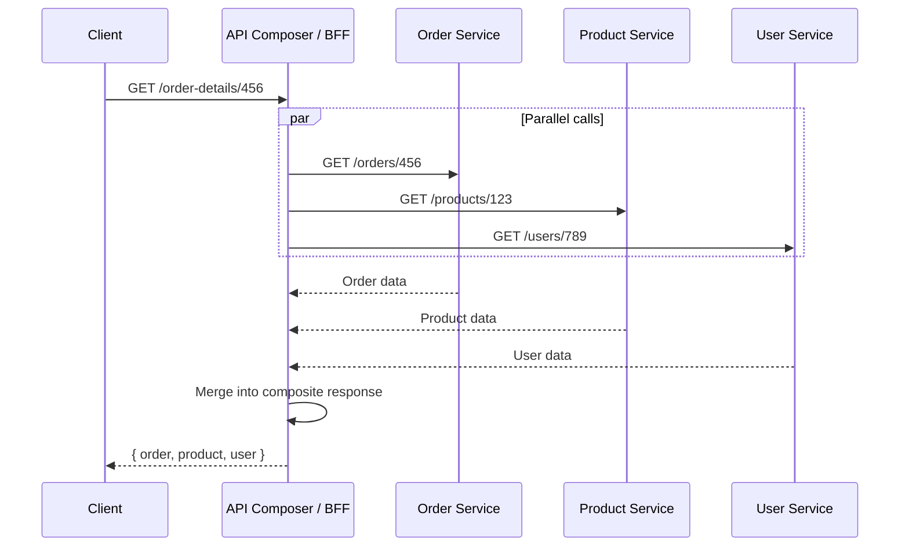

| Criterion | Assessment |
|-----------|-----------|
| **Data freshness** | Real-time — always queries the source |
| **Latency** | Sum of parallel calls + merge overhead |
| **Availability** | Reduced — failure of any downstream partially breaks the response |
| **Complexity** | Medium — need to handle partial failures (fallbacks) |
| **Best for** | Infrequent queries; data that must be fresh; simple aggregations |

### Strategy B: Data Replication via Events (CQRS Projections)

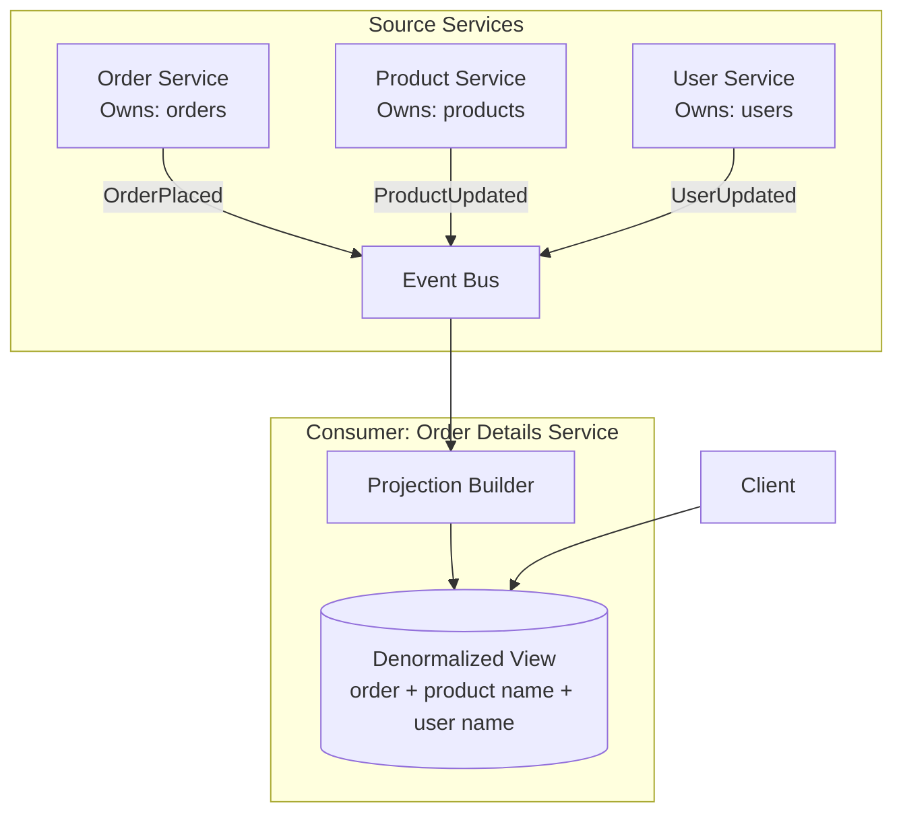

| Criterion | Assessment |
|-----------|-----------|
| **Data freshness** | Eventual — projection lags behind source by ms to seconds |
| **Latency** | Very low — single local read from denormalized store |
| **Availability** | High — no runtime dependency on other services |
| **Complexity** | High — maintain projections, handle event ordering, rebuild logic |
| **Best for** | High-read-volume queries, dashboards, search, precomputed views |

### Strategy C: Shared Reference Data via Events

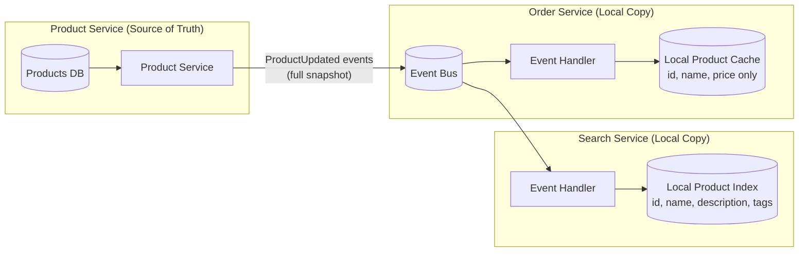

Each consumer keeps **only the fields it needs** — not a full copy.

| Criterion | Assessment |
|-----------|-----------|
| **Runtime coupling** | Zero — each service is self-sufficient after initial sync |
| **Staleness** | Seconds to minutes — acceptable for reference data (product names, user profiles) |
| **Storage cost** | Minimal — only relevant fields replicated |
| **Best for** | Reference/lookup data that changes infrequently (catalogs, user profiles, config) |

---

## 5. Comparison: Data Sharing Strategies

| Criterion | API Composition | Event-Driven Replication | Shared Reference Data |
|-----------|----------------|-------------------------|----------------------|
| **Freshness** | Real-time | Eventual (ms-sec) | Eventual (sec-min) |
| **Read latency** | High (fan-out) | Very low (local) | Very low (local) |
| **Runtime coupling** | High (call dependencies) | None | None |
| **Write complexity** | None (reads only) | High (projections, ordering) | Medium (event handlers) |
| **Availability** | Lower (depends on all sources) | Higher (self-contained) | Higher (self-contained) |
| **Data volume** | Low (no duplication) | Medium-High (denormalized copies) | Low (subset of fields) |

---

## 6. The Integration Architecture

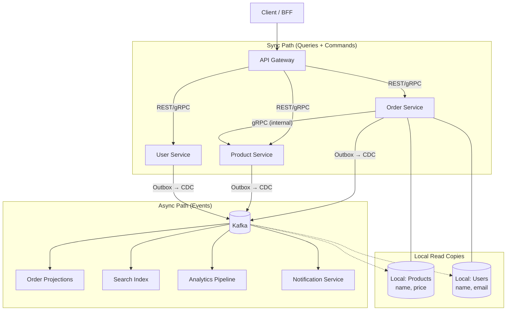

---

## 7. Decision Matrix: Which Pattern for Which Scenario

| Scenario | Communication | Data Sharing | Why |
|----------|--------------|-------------|-----|
| **User views order details** | Sync (BFF → services) or local projection | API Composition or CQRS Projection | Fresh data needed for display; projection preferred if high traffic |
| **Order placed → reserve inventory** | Async event (Saga) | Event notification | Critical flow; eventual consistency + compensation |
| **Product price changed → update order display** | Async event | Event-carried state transfer | Reference data; staleness of seconds is acceptable |
| **Search across all products** | Sync query to Search Service | Replicated index (Elasticsearch) | Full-text search needs denormalized index |
| **Real-time analytics dashboard** | Event streaming | Stream processing (Kafka Streams / Flink) | Continuous aggregation over event stream |
| **Mobile app needs composite view** | Sync via BFF | BFF aggregates + caches | Mobile needs optimized payload; BFF merges |
| **Nightly reporting** | Batch | Data lake / warehouse (ETL from events) | No real-time requirement; optimize for throughput |

---

## 8. Anti-Patterns

| Anti-Pattern | Why It Fails |
|--------------|-------------|
| **Shared database** | Hidden coupling; schema change in one service breaks another; no independent deployment |
| **Direct DB reads across services** | Same as shared DB — bypasses the owning service's business rules |
| **Chatty synchronous calls** | N+1 problem at the network level — 50 REST calls to render one page |
| **Event as RPC** | Publishing an event and then blocking until a response event arrives — sync coupling disguised as async |
| **Hub-and-spoke data service** | One "data service" that owns all the data — you've rebuilt the monolith |
| **Ignoring event ordering** | Consumer processes `OrderCancelled` before `OrderCreated` — corrupted state |
| **Unbounded event payloads** | Full entity in every event → massive broker storage and bandwidth |
| **No idempotency on consumers** | Duplicate events produce duplicate side effects (double email, double charge) |

---

## 9. Practical Checklist

```
Communication:
[ ] Default to async events for cross-service integration
[ ] Use sync calls only where latency is user-facing and freshness is critical
[ ] Define contracts explicitly (OpenAPI for REST, .proto for gRPC, schema registry for events)
[ ] Implement circuit breakers and timeouts on all sync outbound calls

Data Sharing:
[ ] Each service owns its database — no shared schemas
[ ] Use the Outbox pattern to publish events atomically with DB writes
[ ] Replicate reference data locally via events — avoid runtime call-backs
[ ] Make all event consumers idempotent (dedup by event ID)
[ ] Version your event schemas — support backward compatibility
[ ] Monitor consumer lag — stale local copies are a silent bug
```

---

## 10. Next Steps

1. **What are your highest-traffic query patterns?** — That determines whether API composition or CQRS projections are justified.
2. **What's your event broker?** — Kafka (ordered, replayable) vs. RabbitMQ (simpler, task-oriented) shapes the patterns.
3. **How much data duplication is acceptable?** — Regulatory or storage constraints affect the replication strategy.
4. **What are your freshness requirements per use case?** — "Real-time" means different things for a dashboard vs. a checkout page.
