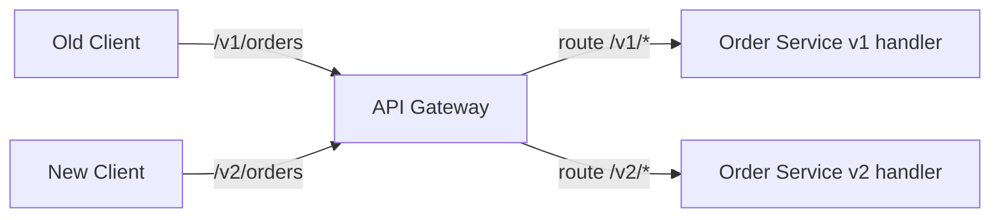
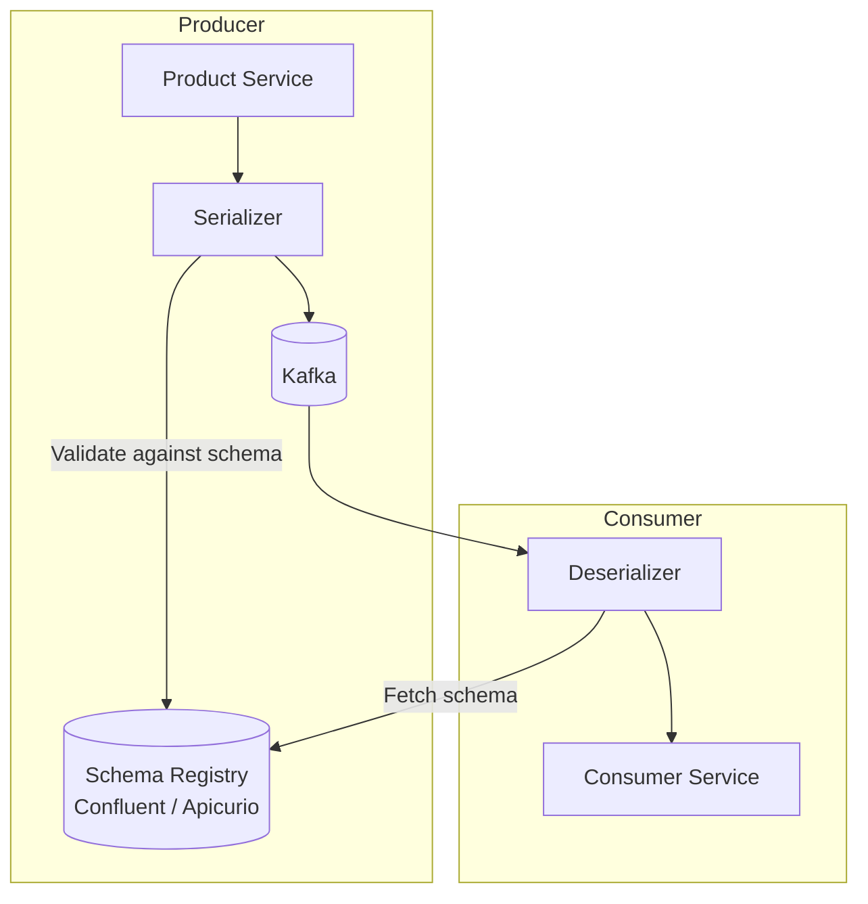
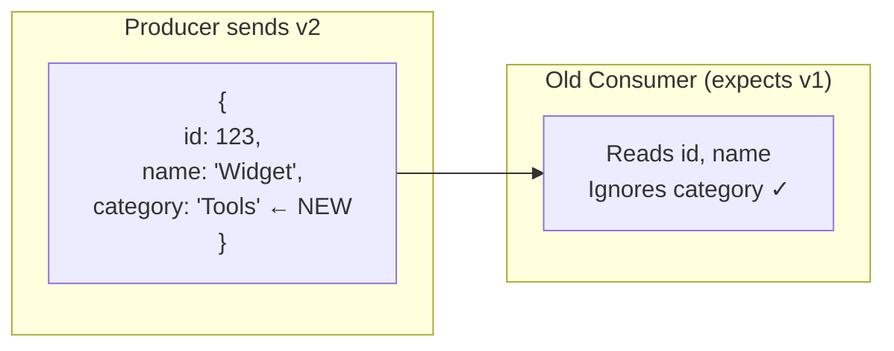
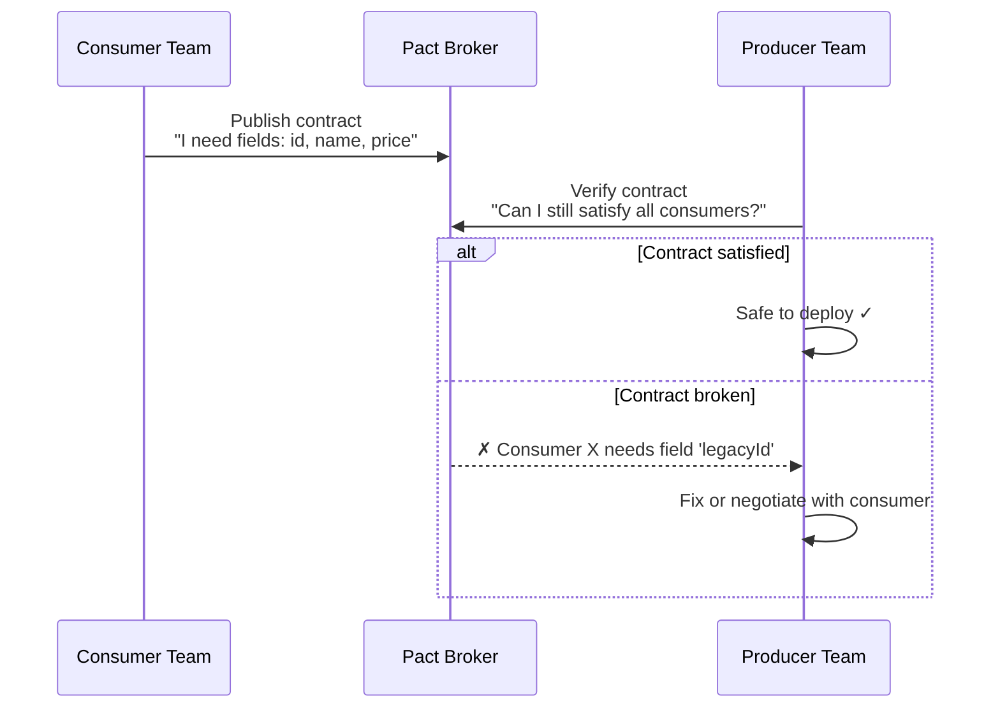
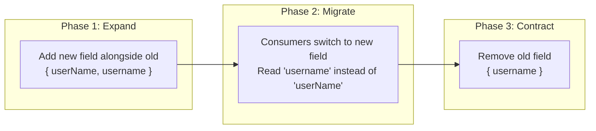
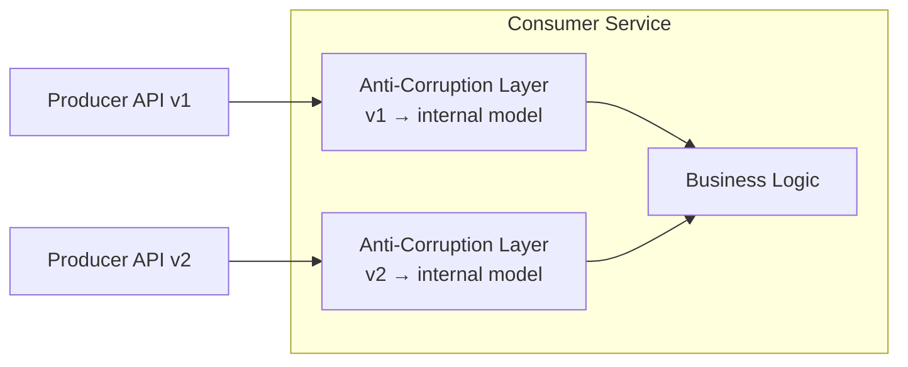
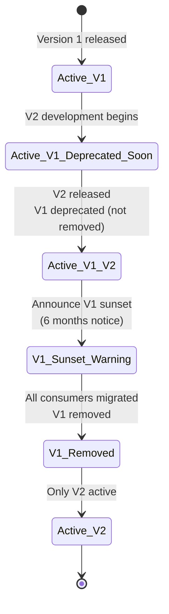

# How to handle service versioning and backward compatibility in a Microservices architecture?

In a monolith, you deploy one artifact — all consumers get the new version simultaneously. In microservices, **services deploy independently on different schedules**. The moment Service A deploys a breaking change, every consumer that hasn't updated yet breaks. Versioning and backward compatibility are what allow **independent deployment** — the core promise of microservices.

The fundamental rule:

> **You don't control when your consumers upgrade.** Design every change as if the old consumer will call you for months.

---

## 1. What Breaks — The Taxonomy of Changes

| Change Type | Example | Breaking? |
|-------------|---------|----------|
| **Add optional field to response** | New `loyaltyPoints` in User response | No |
| **Add optional field to request** | New `couponCode` in Order request | No |
| **Remove a field from response** | Drop `legacyId` | **Yes** — consumers may depend on it |
| **Rename a field** | `userName` → `username` | **Yes** — wire format changed |
| **Change field type** | `price: string` → `price: number` | **Yes** |
| **Remove an endpoint** | DELETE `/v1/reports` | **Yes** |
| **Change URL path** | `/orders` → `/purchases` | **Yes** |
| **Change error codes/format** | Different HTTP status or error body | **Yes** — consumers parse errors |
| **Change business semantics** | `status: "active"` now means something different | **Yes** — hardest to detect |
| **Add required field to request** | New `regionId` required | **Yes** — old clients don't send it |

---

## 2. Versioning Strategies for APIs

### Option A: URL Path Versioning

```
GET /v1/orders/123
GET /v2/orders/123
```



| Criterion | Assessment |
|-----------|-----------|
| **Visibility** | Excellent — version is in the URL, obvious to everyone |
| **Caching** | Clean — different URLs = different cache entries |
| **Routing** | Simple — gateway routes by path prefix |
| **Drawback** | URL changes propagate through docs, clients, bookmarks; not RESTful purists' preference |
| **Used by** | Google, Stripe, Twitter, most public APIs |

### Option B: Header Versioning

```
GET /orders/123
Accept: application/vnd.mycompany.orders.v2+json
```
or custom header:
```
GET /orders/123
X-API-Version: 2
```

| Criterion | Assessment |
|-----------|-----------|
| **URL stability** | URLs never change — same resource, different representation |
| **Caching** | Requires `Vary: Accept` or `Vary: X-API-Version` — cache complexity |
| **Discoverability** | Poor — version is hidden in headers; easy to forget |
| **Used by** | GitHub API (Accept header), Azure |

### Option C: Query Parameter Versioning

```
GET /orders/123?version=2
```

| Criterion | Assessment |
|-----------|-----------|
| **Simplicity** | Easy for clients to add |
| **Default behavior** | Can default to latest or oldest — either has risk |
| **Caching** | Different query strings = different cache entries |
| **Drawback** | Easy to forget; optional parameter makes version ambiguous |

### Option D: No Explicit Versioning — Evolutionary Design

Instead of versioning, **never break the contract**. Only make additive changes. Use the Tolerant Reader pattern.

```
v1 response: { "id": 123, "name": "Widget" }
v1+: { "id": 123, "name": "Widget", "category": "Tools" }
```

| Criterion | Assessment |
|-----------|-----------|
| **Simplicity** | No version management overhead |
| **Discipline** | Requires strict enforcement — one accidental removal breaks consumers |
| **Feasibility** | Works well for internal services; harder for public APIs with long-lived clients |
| **Used by** | Many internal microservice architectures; Netflix philosophy |

### API Versioning Comparison

| Criterion | URL Path | Header | Query Param | No Versioning |
|-----------|----------|--------|-------------|---------------|
| **Clarity** | Excellent | Poor | Medium | N/A |
| **Routing simplicity** | Simple | Complex | Simple | N/A |
| **Caching** | Clean | Complex (Vary) | Clean | Clean |
| **Client effort** | URL change | Header management | Param addition | None |
| **Maintenance cost** | Medium (N versions to maintain) | Medium | Medium | Low (but high discipline) |
| **Best for** | Public APIs, major versions | Content negotiation | Quick prototyping | Internal services |

---

## 3. Versioning for Event Schemas (Async)

This is **harder than API versioning** because events are published to a topic and consumed by N unknown consumers — you can't coordinate upgrades.

### Option A: Schema Registry (Avro / Protobuf)



| Format | Forward Compatible | Backward Compatible | Schema Evolution |
|--------|-------------------|--------------------|-----------------| 
| **Avro** | Yes (new fields have defaults) | Yes (old fields kept) | Full support via registry compatibility checks |
| **Protobuf** | Yes (unknown fields preserved) | Yes (field numbers stable) | Excellent — field IDs, not names |
| **JSON Schema** | Manual (opt-in validation) | Manual | Weak — no registry-enforced compatibility |

**Compatibility modes in Schema Registry:**

| Mode | Rule | Use When |
|------|------|----------|
| **BACKWARD** | New schema can read old data | Consumers upgrade first |
| **FORWARD** | Old schema can read new data | Producers upgrade first |
| **FULL** | Both backward and forward | Safest — either side can upgrade first |
| **NONE** | No enforcement | Development only |

### Option B: Event Envelope with Version Field

```json
{
  "eventType": "OrderPlaced",
  "version": 2,
  "timestamp": "2026-04-18T10:00:00Z",
  "data": {
    "orderId": "456",
    "customerId": "789",
    "lineItems": [...]
  }
}
```

Consumer routes by version:

```
if event.version == 1 → handleOrderPlacedV1(event.data)
if event.version == 2 → handleOrderPlacedV2(event.data)
```

| Criterion | Assessment |
|-----------|-----------|
| **Simplicity** | Easy to implement — just a field in the payload |
| **Consumer complexity** | Must handle N versions simultaneously |
| **Migration** | Can run V1 and V2 handlers in parallel, retire V1 when all producers upgrade |
| **Risk** | No compile-time safety; easy to forget a version handler |

### Option C: Topic-Per-Version

```
orders.v1  →  Old consumers
orders.v2  →  New consumers
```

| Criterion | Assessment |
|-----------|-----------|
| **Isolation** | Complete — no cross-version interference |
| **Migration** | Producer publishes to both during transition; consumers migrate at own pace |
| **Drawback** | Dual-publish complexity; topic proliferation; ordering across topics is hard |

---

## 4. Backward Compatibility Patterns

### Pattern 1: Tolerant Reader

Consumer ignores unknown fields, applies defaults for missing fields.



**Rules:**
- Never fail on unknown fields
- Apply sensible defaults for fields you expect but don't receive
- Never rely on field ordering

### Pattern 2: Consumer-Driven Contracts (Pact)



| Criterion | Assessment |
|-----------|-----------|
| **Safety** | Highest — you know *before* deployment if you'll break a consumer |
| **Overhead** | Medium — both teams must maintain contract tests |
| **Coupling** | Controlled — consumers declare needs, producers verify; no direct dependency |
| **Best for** | Critical integration points; cross-team service boundaries |

### Pattern 3: Expand-Contract Migration

A three-phase approach for breaking changes:



| Phase | Producer | Consumer | Duration |
|-------|----------|----------|----------|
| **Expand** | Publish both `userName` and `username` | Continue reading `userName` | Weeks |
| **Migrate** | Still publishing both | Switch to `username` | Weeks |
| **Contract** | Remove `userName` | Must be reading `username` | Once all consumers migrated |

This is the **safest pattern for breaking changes** — but requires coordination and patience.

### Pattern 4: Adapter / Anti-Corruption Layer



Consumer isolates its domain model from external API changes — the ACL translates. When the producer upgrades, only the ACL changes; business logic is untouched.

---

## 5. Versioning Strategy by Layer

| Layer | Strategy | Implementation |
|-------|----------|---------------|
| **Public REST APIs** | URL path versioning (`/v1/`, `/v2/`) | API Gateway routes by path prefix |
| **Internal gRPC APIs** | Protobuf field numbering + additive changes | Schema evolution rules; never reuse field numbers |
| **Event schemas** | Schema Registry (FULL compatibility mode) | Confluent Schema Registry with Avro or Protobuf |
| **Database schemas** | Expand-contract migrations | Flyway/Liquibase; never drop columns immediately |
| **Client SDKs** | Semantic versioning (semver) | Major version = breaking; minor = additive; patch = fix |

---

## 6. The Versioning Lifecycle



| Phase | Action | Duration |
|-------|--------|----------|
| **V2 released** | V1 marked deprecated in docs/headers; V2 available | Day 0 |
| **Migration period** | Both versions active; monitor V1 traffic; help consumers migrate | 3-6 months (public) / 2-4 weeks (internal) |
| **Sunset warning** | `Sunset` HTTP header or deprecation notice in events; alert remaining V1 consumers | 4-8 weeks before removal |
| **V1 removed** | Return `410 Gone` for V1; remove code | After all consumers migrated |

Use the `Deprecation` and `Sunset` HTTP headers (RFC 8594):
```
Deprecation: true
Sunset: Sat, 18 Oct 2026 00:00:00 GMT
Link: <https://api.example.com/v2/docs>; rel="successor-version"
```

---

## 7. Comparison: Overall Strategies

| Criterion | URL Versioning + Expand-Contract | Schema Registry + Tolerant Reader | Consumer-Driven Contracts |
|-----------|----------------------------------|----------------------------------|--------------------------|
| **Safety** | Medium (manual discipline) | High (registry blocks incompatible schemas) | Highest (verified before deploy) |
| **Automation** | Low | High (CI/CD schema checks) | High (Pact in CI pipeline) |
| **Overhead** | Low | Medium (registry infrastructure) | Medium (contract tests) |
| **Best for** | Public APIs | Event-driven internal services | Cross-team service boundaries |
| **Breaking change process** | 3-phase expand-contract | Schema evolution with defaults | Negotiate with consumer teams |

---

## 8. Anti-Patterns

| Anti-Pattern | Consequence |
|--------------|------------|
| **Big-bang version cutover** | Force all consumers to upgrade simultaneously — negates independent deployment |
| **Removing fields without deprecation** | Consumers break in production with no warning |
| **Versioning every tiny change** | Version proliferation; maintenance nightmare; consumers confused about which to use |
| **No version sunset policy** | Supporting V1/V2/V3/V4/V5 forever — exponential maintenance cost |
| **Semantic versioning for APIs** | Semver is for libraries, not HTTP APIs — `/v1.2.3/orders` is absurd; use major-only |
| **Reusing Protobuf field numbers** | Silent data corruption — old consumers read new data with wrong type |
| **No compatibility tests in CI** | Breaking changes discovered in production, not in the pipeline |
| **Versioning at the service level** | "Order Service v2" forces all endpoints to change — version routes/schemas, not services |

---

## 9. Practical Checklist

```
API Design:
[ ] Default to additive-only changes — no versioning needed
[ ] Only create a new version for genuinely breaking changes
[ ] Use URL path versioning for public APIs (/v1/, /v2/)
[ ] Use Protobuf field numbering for internal gRPC — never delete or reuse numbers
[ ] Implement Tolerant Reader in all consumers

Migration:
[ ] Use expand-contract for breaking changes (add → migrate → remove)
[ ] Set a published sunset timeline for deprecated versions
[ ] Monitor traffic per version — don't remove until traffic = 0
[ ] Add Deprecation + Sunset HTTP headers

Events:
[ ] Use a Schema Registry with FULL compatibility mode
[ ] All new fields must have defaults (Avro) or be optional (Protobuf)
[ ] Version the event schema, not the topic
[ ] Test schema compatibility in CI before merge

Testing:
[ ] Consumer-driven contract tests for critical cross-team boundaries (Pact)
[ ] Schema compatibility check as a CI gate (schema-registry-maven-plugin / equivalent)
[ ] Integration tests that run old consumer against new producer
```

---

## 10. Next Steps

1. **Public-facing or internal?** — Public APIs need stricter versioning and longer sunset periods.
2. **What serialization formats** are you using today? — JSON, Avro, Protobuf?
3. **Do you have a schema registry** or contract testing in your CI pipeline?
4. **How many consumers per service?** — One consumer = negotiate directly; many = you need a formal deprecation process.
5. **What's your deployment cadence?** — Daily deploys make expand-contract practical; monthly deploys make it painful.
