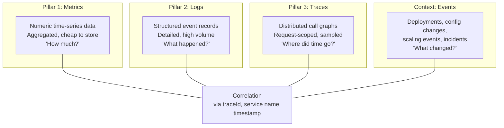
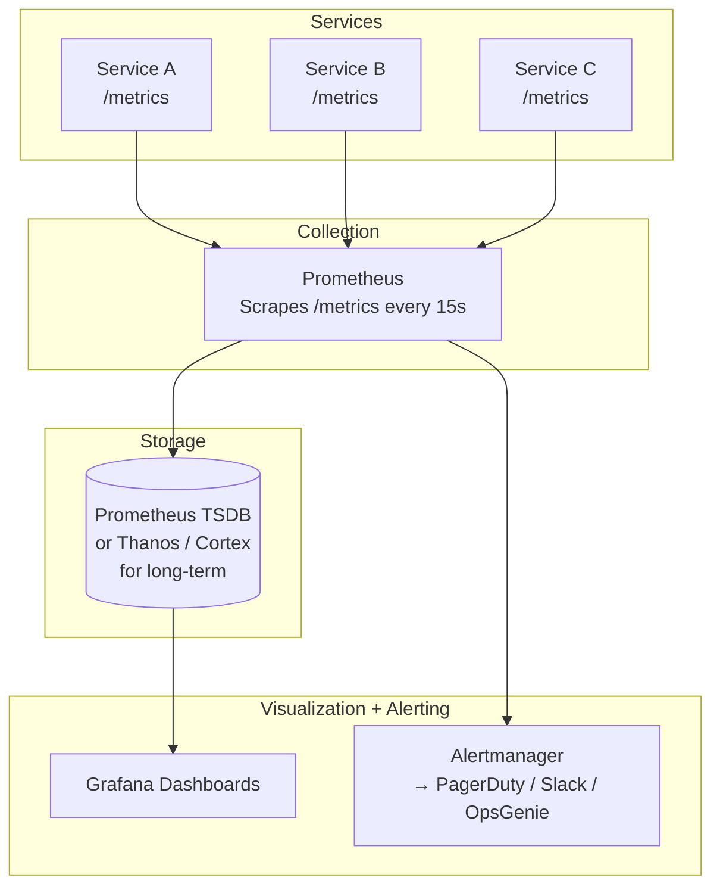
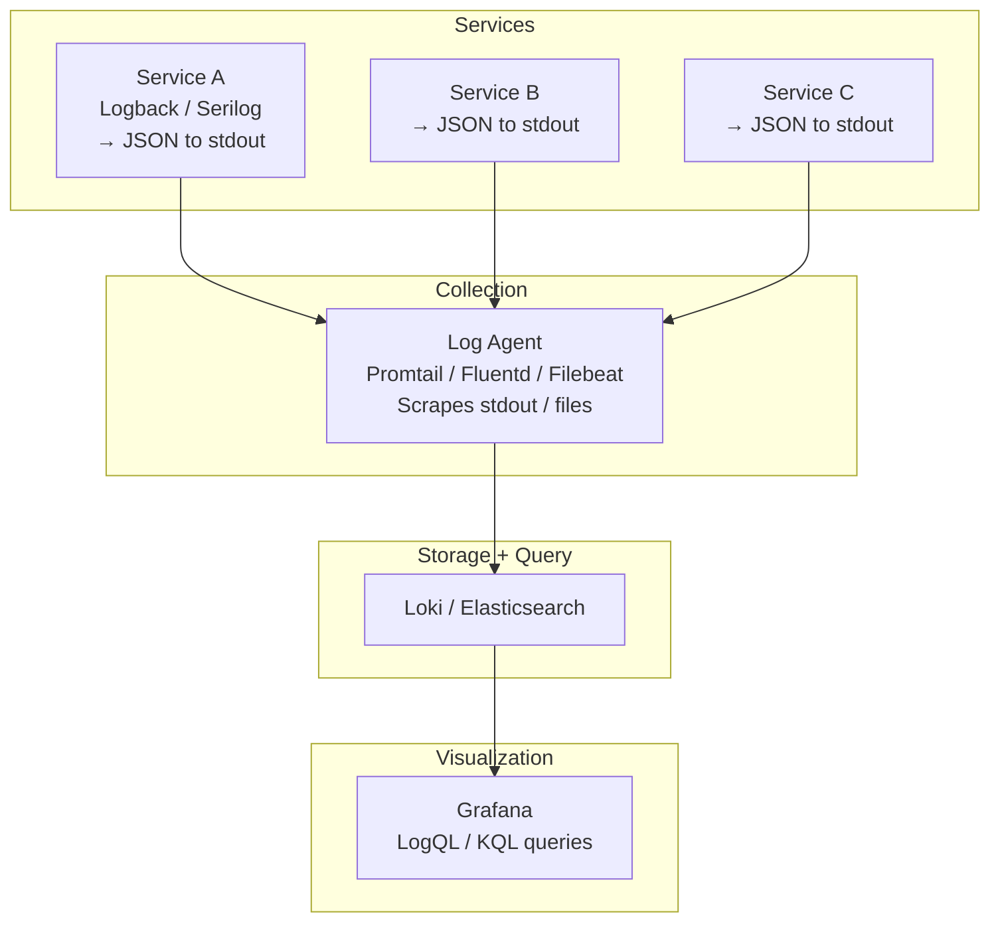
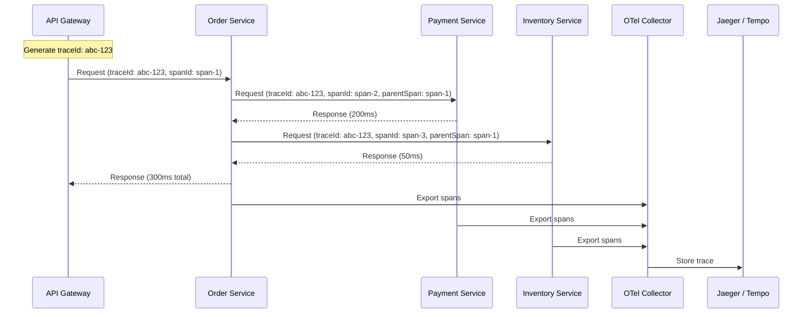
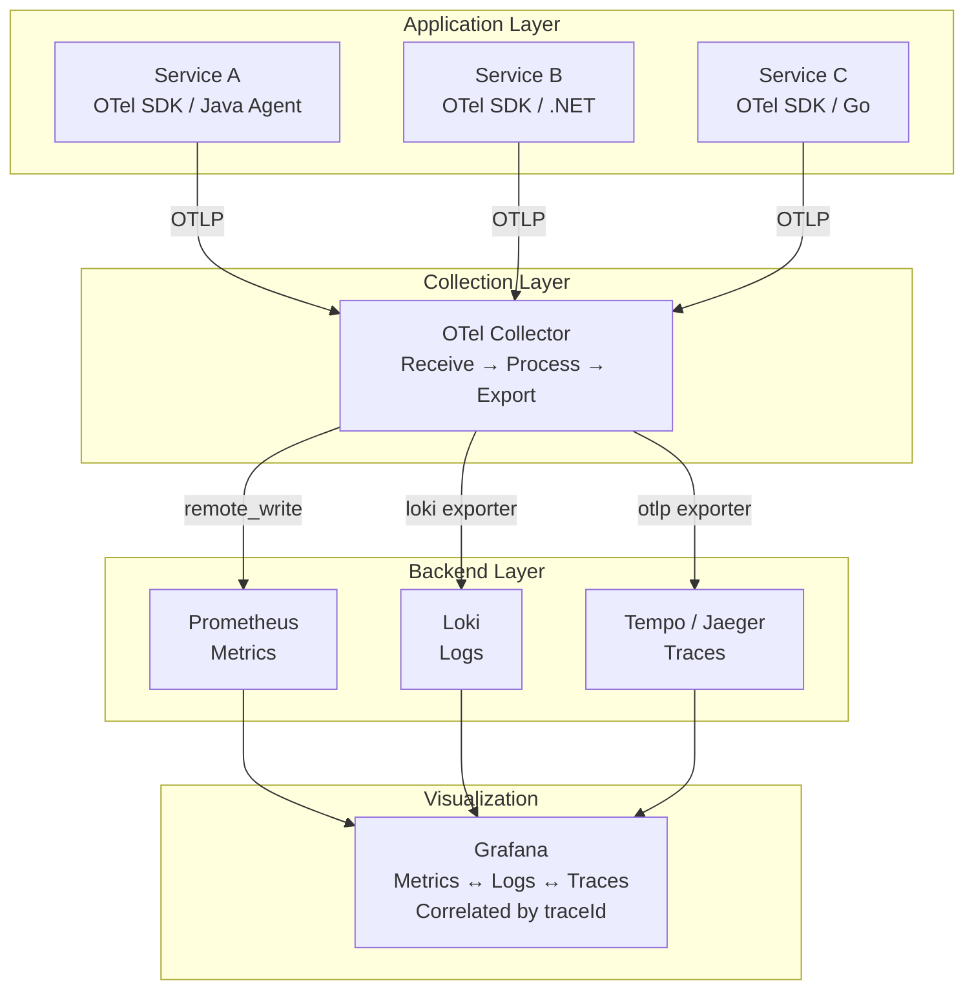
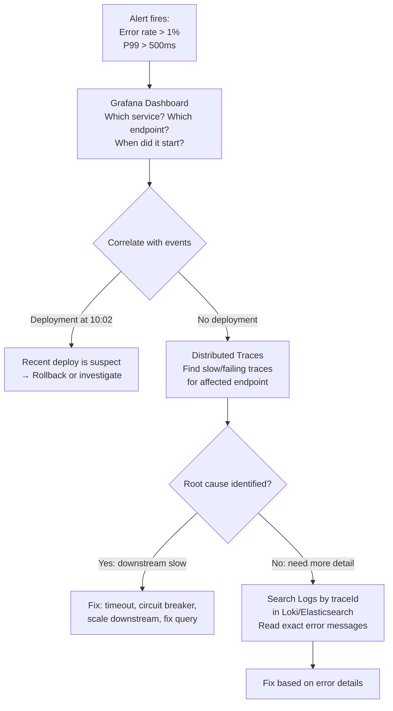
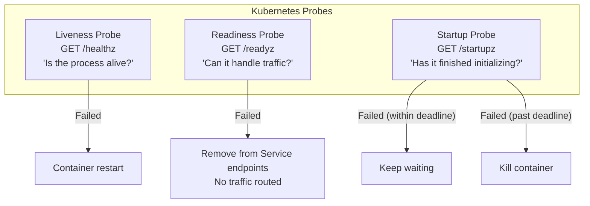
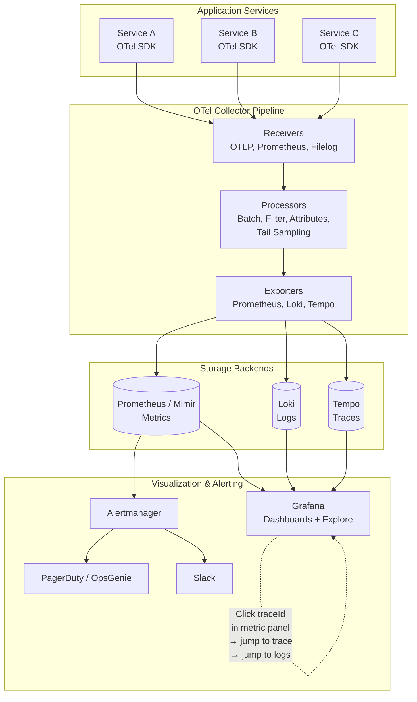

# How to monitor and troubleshoot Microservices?

Monitoring a monolith means watching one process, one log file, one database. Monitoring microservices means watching **N processes × M instances × P infrastructure components** — each with its own failure modes, latency characteristics, and log streams. The system's behavior is **emergent** — no single service's metrics tell the full story.

The architectural challenge:

> **You can't debug what you can't observe.** Observability must be designed into the architecture, not bolted on after the first outage.

---

## 1. Observability vs Monitoring

| Concept | Definition | Analogy |
|---------|-----------|---------|
| **Monitoring** | Predefined checks on known failure modes — "Is CPU > 80%?" | Dashboard with warning lights |
| **Observability** | Ability to ask *arbitrary questions* about system behavior from external outputs | X-ray machine — see inside without opening |

Monitoring tells you **something is wrong**. Observability tells you **why it's wrong** and **where in the distributed call chain**.

---

## 2. The Three Pillars + Context



| Pillar | Answers | Cardinality | Storage Cost | Example Tool |
|--------|---------|-------------|-------------|-------------|
| **Metrics** | How many errors? What's P99 latency? Is CPU saturated? | Low (aggregated counters/histograms) | Low | Prometheus, Datadog, CloudWatch |
| **Logs** | What exact error did this request produce? What were the parameters? | High (per-event) | High | Loki, Elasticsearch, Splunk |
| **Traces** | Which service was slow? What was the full call chain? | Medium (sampled per-request) | Medium | Jaeger, Tempo, Zipkin, X-Ray |
| **Events** | Was there a deployment 5 minutes before the error spike? | Low | Low | Grafana annotations, PagerDuty |

---

## 3. Metrics: What to Measure

### The RED Method (Request-scoped — for services)

| Signal | Metric | Alert When |
|--------|--------|-----------|
| **R**ate | Requests per second | Unexpected drop (service down) or spike (DDoS, retry storm) |
| **E**rrors | Error rate (5xx / total) | > 1% of requests |
| **D**uration | Latency percentiles (P50, P95, P99) | P99 > SLA target |

### The USE Method (Resource-scoped — for infrastructure)

| Signal | Metric | Alert When |
|--------|--------|-----------|
| **U**tilization | CPU %, memory %, disk I/O % | > 80% sustained |
| **S**aturation | Queue depth, thread pool usage, connection pool wait time | Growing queue = approaching limit |
| **E**rrors | Hardware errors, OOM kills, network drops | Any occurrence |

### The Four Golden Signals (Google SRE)

| Signal | What It Tells You |
|--------|------------------|
| **Latency** | How long requests take (distinguish success vs error latency) |
| **Traffic** | Demand on the system (req/sec, messages/sec) |
| **Errors** | Rate of failed requests (explicit 5xx + implicit: success but wrong content) |
| **Saturation** | How "full" the service is — how close to capacity |

### Metrics Architecture



---

## 4. Logging: Structure and Correlation

### The Problem with Unstructured Logs

```
# Useless in microservices
2026-04-18 10:00:01 ERROR Failed to process order
2026-04-18 10:00:01 INFO  Order created successfully
# Which service? Which request? Which user? Which order?
```

### Structured Logging Standard

Every log line must include:

```json
{
  "timestamp": "2026-04-18T10:00:01.234Z",
  "level": "ERROR",
  "service": "order-service",
  "instance": "order-service-7b4d9-xk2m",
  "traceId": "abc123def456",
  "spanId": "span789",
  "requestId": "req-001",
  "userId": "user-42",
  "message": "Payment processing failed",
  "error": "ConnectionTimeoutException",
  "durationMs": 5003,
  "downstream": "payment-service"
}
```

| Field | Purpose |
|-------|---------|
| `traceId` | Correlate logs across all services for one request |
| `spanId` | Identify the exact operation within the trace |
| `service` | Filter logs to one service |
| `requestId` | Business-level correlation (idempotency key, order ID) |
| `durationMs` | Spot slow operations without traces |

### Logging Architecture



### Option A: Loki (Log Aggregation)

| Criterion | Assessment |
|-----------|-----------|
| **Model** | Labels + log streams (like Prometheus for logs) |
| **Cost** | Low — indexes labels only, not full text |
| **Query** | LogQL — filter by labels, then grep/parse content |
| **Integration** | Native Grafana integration; correlates with metrics and traces |
| **Best for** | Kubernetes-native, Grafana ecosystems, cost-sensitive setups |

### Option B: Elasticsearch (ELK/EFK)

| Criterion | Assessment |
|-----------|-----------|
| **Model** | Full-text index on every field |
| **Cost** | High — indexes everything; significant storage and compute |
| **Query** | KQL / Lucene — powerful full-text search, aggregations |
| **Integration** | Kibana dashboards; cross-reference with APM |
| **Best for** | Complex search patterns, high-cardinality queries, compliance/audit |

### Log Comparison

| Criterion | Loki | Elasticsearch |
|-----------|------|---------------|
| **Indexing** | Labels only | Full text |
| **Storage cost** | Low | High (5-10× more) |
| **Query flexibility** | Good (label filter + grep) | Excellent (full-text + aggregations) |
| **Operational complexity** | Low | High (cluster management, sharding) |
| **Scale** | Excellent | Good (needs tuning at scale) |

---

## 5. Distributed Tracing: Follow the Request

### How It Works



### Trace Visualization (What You See in Jaeger/Tempo)

```
Trace: abc-123 (Total: 300ms)
├── [Gateway]      ████████████████████████████████  300ms
│   ├── [Order Service]  ██████████████████████████  260ms
│   │   ├── [Payment Service]  ████████████████      200ms  ⚠️ SLOW
│   │   │   └── [Stripe API]     ██████████████      180ms  ← Root cause
│   │   └── [Inventory Service]  ██                  50ms
```

One glance shows: **Payment Service is slow because Stripe API is slow.**

### OpenTelemetry Architecture



### Sampling Strategies

| Strategy | How | When |
|----------|-----|------|
| **Head-based (probabilistic)** | Decide at request start: sample 10% of traces | Default; good for high-traffic services |
| **Tail-based** | Collect all spans, decide *after* request completes: keep errors, slow requests, drop healthy ones | Better signal; requires OTel Collector with buffering |
| **Always-on for errors** | Sample 100% of traces that produce errors | Critical for debugging; low volume (errors are rare) |

---

## 6. Troubleshooting Workflow



### The Troubleshooting Playbook

| Step | Action | Tool |
|------|--------|------|
| 1. **Detect** | Alert fires on error rate or latency | Alertmanager → PagerDuty/Slack |
| 2. **Triage** | Which service? Which endpoint? When did it start? | Grafana RED dashboard |
| 3. **Correlate** | Any deployments, config changes, scaling events in the same window? | Grafana annotations, deploy markers |
| 4. **Trace** | Find example traces for failing/slow requests | Jaeger/Tempo — filter by service + error + duration |
| 5. **Pinpoint** | Which span in the trace is slow/failing? | Trace waterfall view |
| 6. **Detail** | Get exact error message, stack trace, request parameters | Logs filtered by `traceId` |
| 7. **Fix** | Apply fix or mitigation | Code fix, config change, rollback, scale |
| 8. **Verify** | Confirm error rate returns to baseline | Grafana dashboard |
| 9. **Document** | Postmortem: timeline, root cause, action items | Incident report |

---

## 7. Health Checks and Probes



| Probe | Checks | Failure Response |
|-------|--------|-----------------|
| **Liveness** | Process alive, not deadlocked | Restart the container |
| **Readiness** | DB connected, caches warm, dependencies reachable | Stop sending traffic; don't restart |
| **Startup** | Slow initialization complete (migrations, large cache warm-up) | Allow more time before liveness kicks in |

**Critical distinction:** A service can be **alive but not ready** (DB connection lost). Restarting won't help — removing from load balancer does.

---

## 8. Alerting Strategy

### Alert on Symptoms, Not Causes

| Bad Alert (Cause) | Good Alert (Symptom) |
|-------------------|---------------------|
| CPU > 80% | P99 latency > 500ms for order-service |
| Kafka consumer lag > 1000 | Order confirmation emails delayed > 5 minutes |
| Pod restarted | Error rate > 1% for checkout endpoint |
| Disk usage > 90% | Writes failing on order-service |

### Alert Severity Levels

| Severity | Criteria | Response | Channel |
|----------|----------|----------|---------|
| **P1 — Critical** | Revenue impact, data loss, full outage | Immediate page, all-hands | PagerDuty phone call |
| **P2 — High** | Degraded experience for significant users | Page on-call; respond in 15 min | PagerDuty + Slack |
| **P3 — Medium** | Non-critical feature degraded | Respond within 1 hour | Slack channel |
| **P4 — Low** | Anomaly, no user impact | Next business day | Email / ticket |

### Alert Fatigue Prevention

| Practice | Why |
|----------|-----|
| **Alert on SLO burn rate, not raw metrics** | "We'll breach our 99.9% SLO in 6 hours" > "Error rate > 0.5% for 5 min" |
| **Route by severity** | Don't page for P4 — use async notification |
| **Deduplicate** | Group related alerts into one incident |
| **Auto-resolve** | Clear alert when metric recovers — stale alerts erode trust |
| **Review quarterly** | Delete alerts no one acts on; tune thresholds |

---

## 9. Full Architecture — Putting It Together



The key is **cross-signal correlation**: click an error spike in metrics → see example traces → click a traceId → see the exact log lines.

---

## 10. Comparison: Observability Stack Options

| Criterion | Grafana Stack (LGTM) | ELK + Jaeger | Datadog / New Relic | AWS Native |
|-----------|---------------------|-------------|--------------------|-----------| 
| **Cost** | Low (OSS) + infra ops | Medium (Elastic licensing) | High (per-host/per-GB pricing) | Medium (per-service pricing) |
| **Setup** | Medium | High (Elastic cluster management) | Low (SaaS) | Low (managed) |
| **Correlation** | Excellent (native in Grafana) | Good (requires config) | Excellent (built-in) | Good (X-Ray + CloudWatch) |
| **Customization** | Excellent | Good | Limited | Limited |
| **Lock-in** | None (OSS, OpenTelemetry) | Low-Medium | High | High (AWS-specific) |
| **Best for** | Cost-sensitive, K8s-native, full control | Existing ELK investment, complex search needs | "Just works", team has no ops capacity | Full AWS shop |

---

## 11. Anti-Patterns

| Anti-Pattern | Consequence |
|--------------|------------|
| **No correlation ID** | Cannot connect logs/traces across services — debugging is guesswork |
| **Unstructured logs** | Can't query, can't aggregate, can't correlate — just text noise |
| **Monitoring only infrastructure, not business** | CPU is fine, but orders are failing — nobody alerted |
| **100% trace sampling in production** | Storage cost explodes; collector becomes a bottleneck |
| **Separate dashboards per team** | Can't see cross-service impact; incident response is siloed |
| **Alert on every metric** | Alert fatigue — on-call ignores all alerts, misses the real ones |
| **No runbooks linked to alerts** | Alert fires at 3 AM, on-call doesn't know what to do |
| **Logging PII in plain text** | Compliance violation (GDPR/HIPAA); security breach if logs leak |
| **No log retention policy** | Storage grows forever; or too aggressive — lose logs needed for debugging |

---

## 12. Practical Checklist

```
Instrumentation:
[ ] OpenTelemetry SDK/agent in every service (auto-instrumentation where possible)
[ ] W3C Trace Context propagated in all HTTP/gRPC headers and message metadata
[ ] Structured JSON logging to stdout with traceId, spanId, service, level
[ ] RED metrics exposed on /metrics endpoint (Prometheus format)
[ ] Health checks: /healthz (liveness), /readyz (readiness)

Collection:
[ ] OTel Collector deployed (sidecar or daemonset)
[ ] Tail-based sampling configured (keep 100% errors, sample healthy traffic)
[ ] Log agent (Promtail/Fluentd) scraping container stdout

Storage:
[ ] Metrics: Prometheus (or Mimir for long-term)
[ ] Logs: Loki (or Elasticsearch if complex search needed)
[ ] Traces: Tempo (or Jaeger)
[ ] Retention policies defined per signal

Visualization:
[ ] Service-level RED dashboard per service in Grafana
[ ] Cross-service dependency map
[ ] Trace-to-log and metric-to-trace correlation configured
[ ] Deployment annotations on dashboards

Alerting:
[ ] Alert on symptoms (latency, error rate), not causes (CPU)
[ ] SLO-based burn rate alerts for critical services
[ ] Runbook linked to every alert
[ ] Escalation policy: P1 → page, P2 → Slack, P3 → ticket
[ ] Quarterly alert review to prune/tune
```

---

## 13. Next Steps

1. **What's your current observability stack?** — Greenfield or extending existing tools?
2. **Deployment platform?** — Kubernetes, ECS, VMs? Determines collection strategy.
3. **How many services + daily log volume?** — Drives storage backend choice (Loki vs Elasticsearch).
4. **Do you have SLOs defined?** — SLO-based alerting is more effective than threshold-based.
5. **Budget constraint?** — OSS stack (Grafana LGTM) vs managed SaaS (Datadog/New Relic)?
