# How to handle deployments and rollbacks in a Microservices architecture?

In a monolith, deployment is one artifact, one process, one rollback decision. In microservices, you deploy **N services independently, each on its own cadence**, potentially dozens of times per day. The architectural challenge:

> **Every deployment is a production change.** The difference between "10 deploys/day with confidence" and "1 deploy/month with terror" is your deployment strategy and rollback capability.

The goal is **zero-downtime deployments with instant rollback** — where a bad release is detected automatically and reverted before users notice.

---

## 1. The Deployment Problem Space

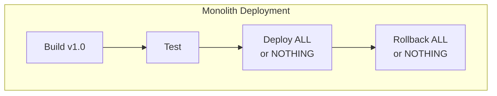

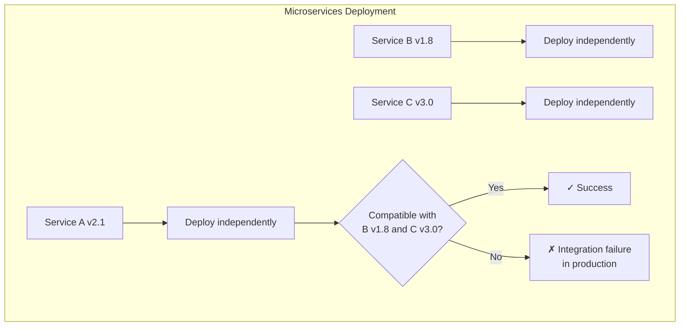

| Challenge | Why It's Hard |
|-----------|--------------|
| **Independent deployment cadence** | Service A deploys 5x/day, Service B deploys weekly — versions must be compatible |
| **N-way compatibility** | A new version of Service A must work with current *and* previous versions of its dependencies |
| **Stateful rollbacks** | Rolling back code is easy; rolling back database migrations is not |
| **Partial rollouts** | You want 5% of traffic on the new version before committing 100% |
| **Blast radius** | A bad deploy of one service shouldn't take down the entire system |

---

## 2. Deployment Strategies

### Strategy A: Rolling Update

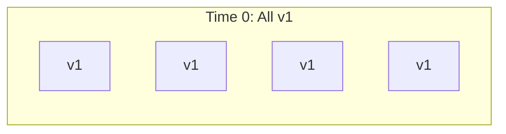
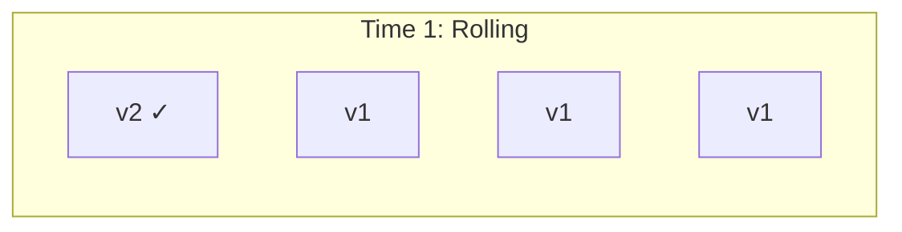
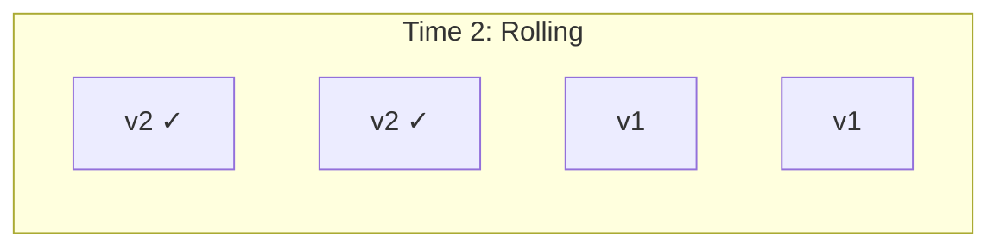
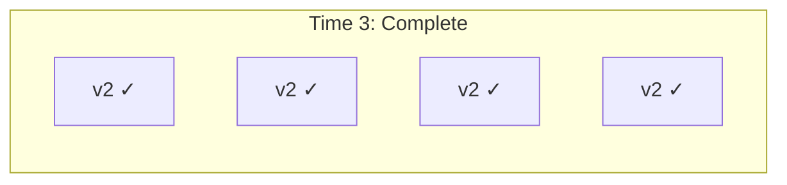

| Criterion | Assessment |
|-----------|-----------|
| **Zero downtime** | Yes — always some instances available |
| **Rollback speed** | Slow — must roll forward or reverse the rolling update |
| **Compatibility** | v1 and v2 run simultaneously during rollout — must be backward compatible |
| **Resource cost** | Low — replaces instances in-place (respects `maxSurge` / `maxUnavailable`) |
| **Complexity** | Low — Kubernetes default strategy |
| **Best for** | Standard deployments with backward-compatible changes |

**Kubernetes config:**
```yaml
strategy:
  type: RollingUpdate
  rollingUpdate:
    maxSurge: 25%
    maxUnavailable: 0     # Never reduce capacity during rollout
```

### Strategy B: Blue-Green Deployment

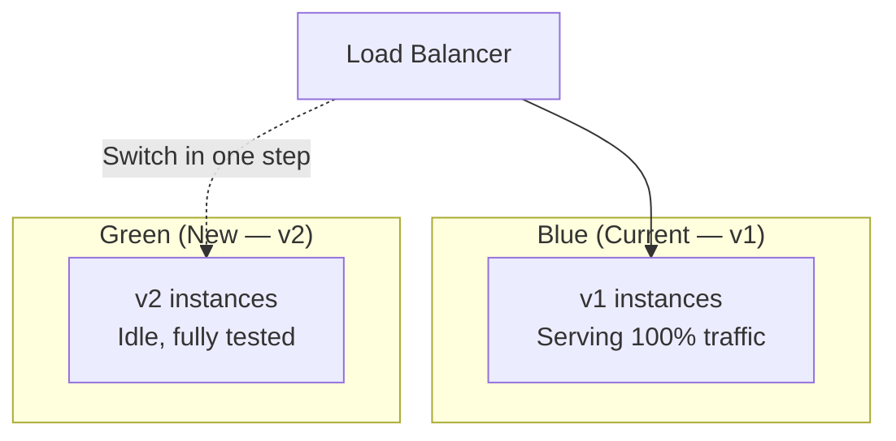

**After switch:**

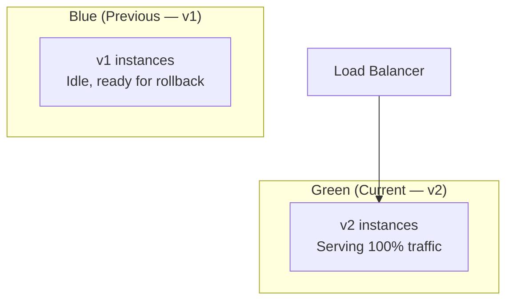

| Criterion | Assessment |
|-----------|-----------|
| **Zero downtime** | Yes — instant traffic switch |
| **Rollback speed** | Instant — switch LB back to Blue |
| **Compatibility** | v1 and v2 never serve simultaneously — no mixed-version window |
| **Resource cost** | High — double the infrastructure during deployment |
| **Complexity** | Medium — need to manage two identical environments |
| **Best for** | Critical services where instant rollback is essential; database-incompatible changes |

### Strategy C: Canary Deployment

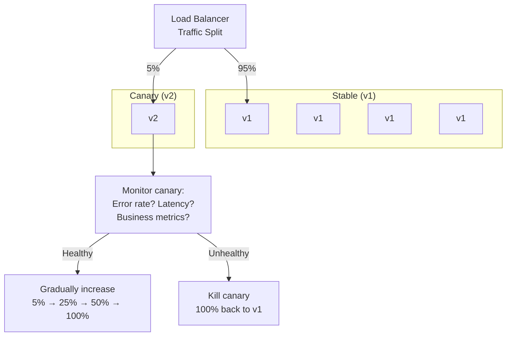

| Criterion | Assessment |
|-----------|-----------|
| **Zero downtime** | Yes |
| **Rollback speed** | Fast — kill canary instances, 100% back to stable |
| **Blast radius** | Minimal — only 5% of traffic affected by a bad release |
| **Compatibility** | v1 and v2 serve simultaneously — must be backward compatible |
| **Complexity** | Medium-High — needs traffic splitting, metrics comparison, promotion logic |
| **Best for** | High-traffic services; validating changes with real traffic before full rollout |

### Strategy D: Feature Flags (Dark Launch + Progressive Delivery)

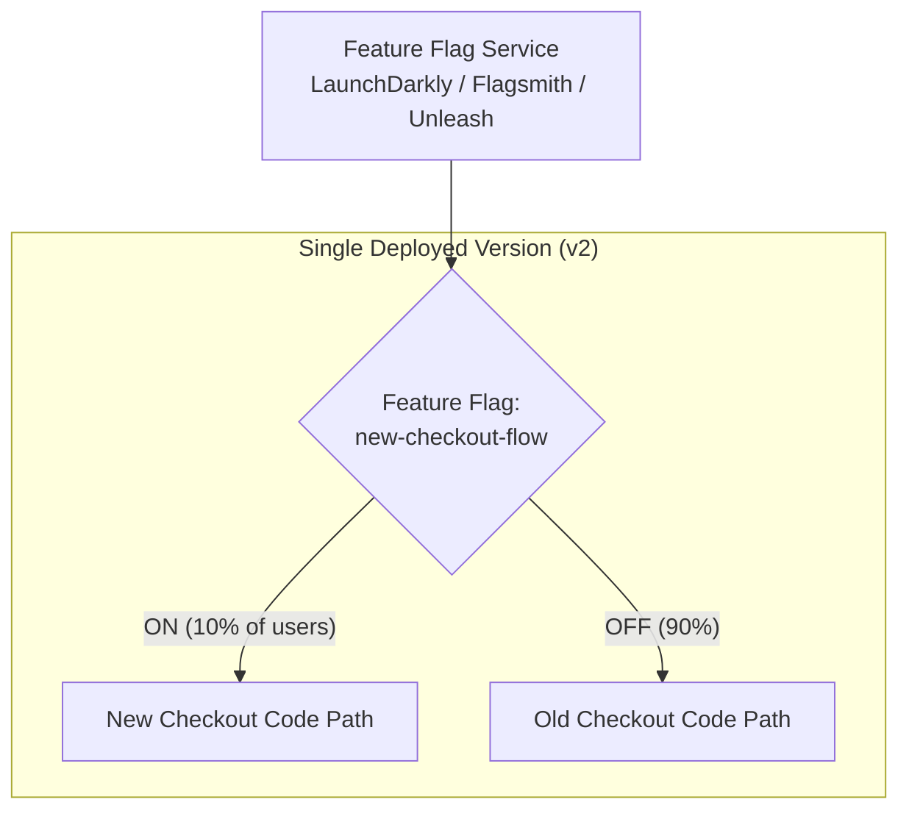

| Criterion | Assessment |
|-----------|-----------|
| **Decouples deploy from release** | Deploy code anytime; enable feature independently |
| **Rollback speed** | Instant — toggle flag off; no redeployment needed |
| **Targeting** | Granular — by user, region, percentage, account type |
| **Complexity** | Medium — flag management, cleanup of old flags, testing permutations |
| **Risk** | Flag sprawl; dead code if flags aren't cleaned up; testing complexity (2^N states) |
| **Best for** | Major feature launches; A/B testing; gradual rollout to specific cohorts |

---

## 3. Comparison

| Criterion | Rolling Update | Blue-Green | Canary | Feature Flags |
|-----------|---------------|------------|--------|--------------|
| **Rollback speed** | Minutes | Seconds | Seconds | Instant |
| **Blast radius** | Grows during rollout | All-or-nothing | Controlled (5-10%) | Controlled (per-user) |
| **Resource cost** | Low | 2× during deploy | Low (+1 canary) | None (same deploy) |
| **Mixed versions** | Yes (during rollout) | No | Yes | No (same binary) |
| **Complexity** | Low | Medium | Medium-High | Medium |
| **DB migration friendly** | Needs backward compat | Yes (separate envs) | Needs backward compat | Yes (code-level branching) |
| **Observability needed** | Basic health checks | Health check + smoke test | Advanced metrics comparison | Feature-level metrics |

---

## 4. Rollback Strategies

### The Rollback Decision Tree

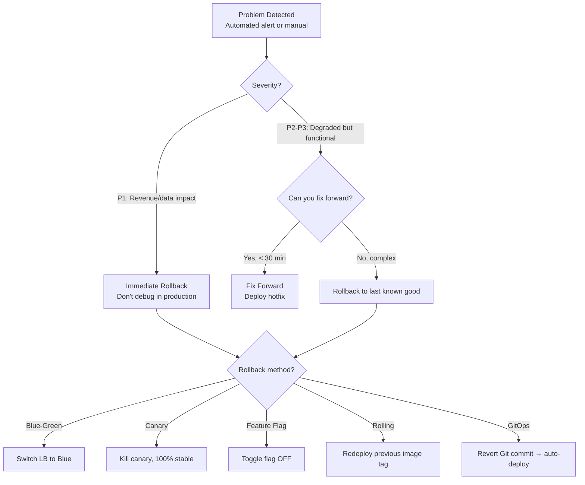

### Rollback: Code vs Data

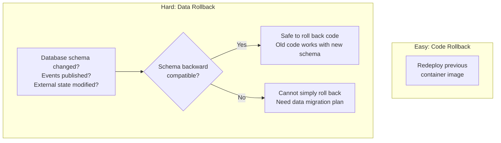

| Rollback Target | Difficulty | Strategy |
|-----------------|-----------|----------|
| **Stateless code** | Easy | Redeploy previous image |
| **Config change** | Easy | Revert config in config server / env vars |
| **Feature flag** | Trivial | Toggle off |
| **Additive DB migration** (new column) | Easy | Old code ignores new column |
| **Destructive DB migration** (dropped column) | Hard | Must restore data; use expand-contract |
| **Published events** | Very Hard | Consumers may have already processed them; need compensating events |
| **Third-party state** (payments, emails) | Cannot rollback | Must compensate (refund, retract notification) |

---

## 5. Database Migration Strategy

The #1 cause of "can't rollback" is **database migrations that break backward compatibility**.

### The Expand-Contract Pattern for Zero-Downtime Migrations

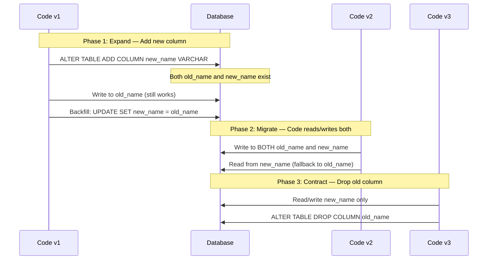

| Phase | Code Version | DB State | Rollback Safe? |
|-------|-------------|----------|---------------|
| **Expand** | v1 (unchanged) | Both columns exist | Yes — v1 ignores new column |
| **Migrate** | v2 (dual-write) | Both columns populated | Yes — roll back to v1, old column still correct |
| **Contract** | v3 (new only) | Old column dropped | **No** — cannot roll back to v1 after this |

**Rule:** Never combine code deployment and destructive migration in the same release.

---

## 6. CI/CD Pipeline Architecture

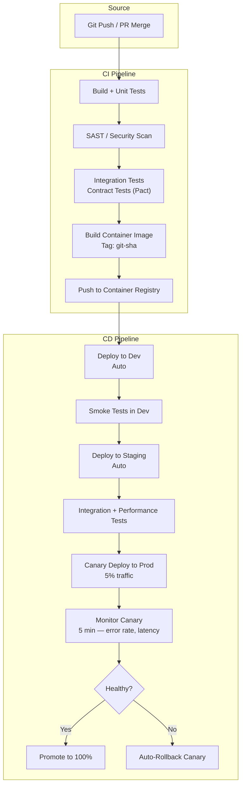

### GitOps Model (Declarative + Auditable)

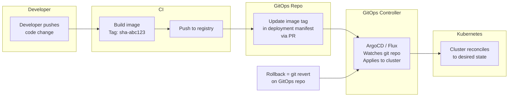

| Criterion | Imperative CD (Jenkins/GitHub Actions direct deploy) | GitOps (ArgoCD/Flux) |
|-----------|-----------------------------------------------------|---------------------|
| **Audit trail** | Build logs | Git history — every state change is a commit |
| **Rollback** | Retrigger pipeline with old tag | `git revert` — automatic reconciliation |
| **Drift detection** | Manual | Built-in — controller reconciles to git state |
| **Access control** | CD tool credentials | Git PR reviews — no direct cluster access needed |
| **Complexity** | Lower | Medium — need GitOps repo + controller |

---

## 7. Automated Rollback with Progressive Delivery

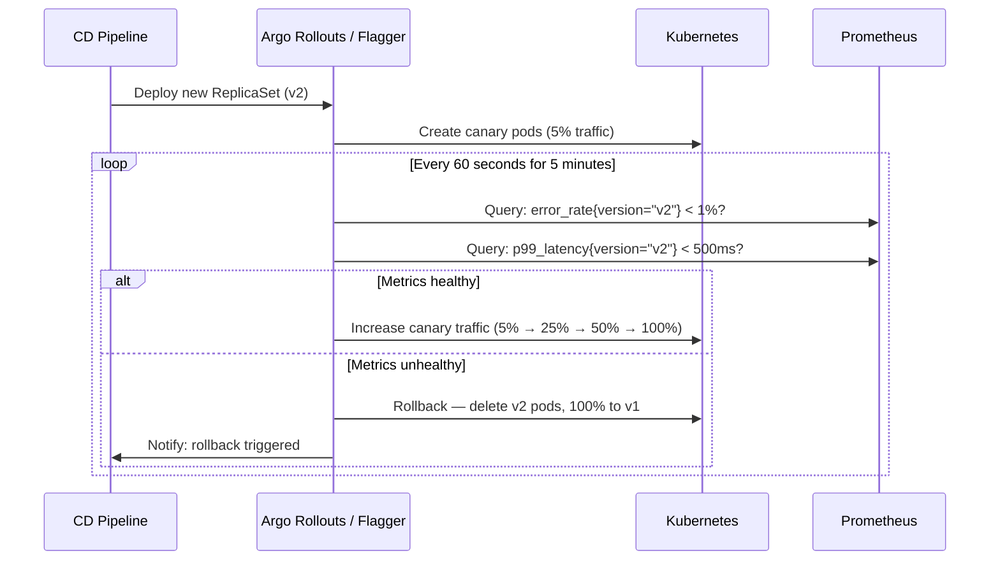

**Tools for progressive delivery:**

| Tool | Platform | Traffic Splitting | Auto-Rollback |
|------|----------|-------------------|---------------|
| **Argo Rollouts** | Kubernetes | Canary, Blue-Green, Traffic mirroring | Yes (Prometheus/Datadog analysis) |
| **Flagger** | Kubernetes + Istio/Linkerd | Canary, A/B, Blue-Green | Yes (built-in analysis) |
| **AWS CodeDeploy** | ECS, Lambda, EC2 | Canary, Linear, All-at-once | Yes (CloudWatch alarms) |
| **Istio** | Kubernetes | VirtualService weight-based routing | Manual (combine with Flagger for auto) |
| **LaunchDarkly / Flagsmith** | Any | Feature-flag based | Yes (flag kill switch) |

---

## 8. Multi-Service Deployment Coordination

When services have **cross-service dependencies**, you need deployment ordering.

### Strategy: Deploy in Dependency Order with Backward Compatibility

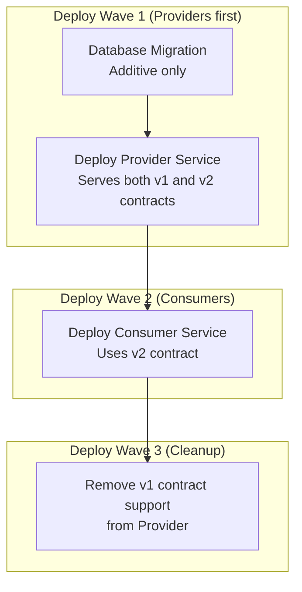

| Rule | Why |
|------|-----|
| **Providers deploy before consumers** | Consumer can't call v2 API if provider hasn't deployed it yet |
| **Provider supports N and N-1 contracts** | In case consumer rollback is needed while provider stays on v2 |
| **Never deploy consumer and provider simultaneously** | If both fail, you can't tell which caused the problem |
| **Database migrations deploy first** | Schema must be ready before code that depends on it |

---

## 9. Deployment Observability

| What to Track | Why | How |
|---------------|-----|-----|
| **Deploy frequency** | DORA metric — measure delivery velocity | CI/CD pipeline metrics |
| **Lead time for changes** | DORA metric — commit to production | Git timestamp → deploy timestamp |
| **Change failure rate** | DORA metric — % of deploys causing incidents | Incident count / deploy count |
| **Mean time to recovery** | DORA metric — how fast you fix failures | Incident timeline tracking |
| **Deploy annotations on dashboards** | Correlate performance changes with deploys | Grafana annotations from CD webhook |
| **Canary vs stable metrics comparison** | Real-time validation of new version | Side-by-side Grafana panels |

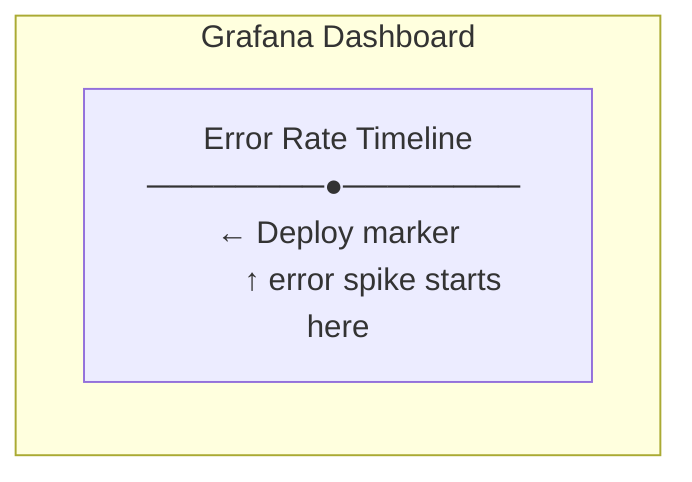

---

## 10. Anti-Patterns

| Anti-Pattern | Consequence |
|--------------|------------|
| **Manual deployments** | Inconsistent, error-prone, slow; can't do canary or auto-rollback |
| **Big-bang multi-service deploy** | All-or-nothing coordination negates independent deployment benefit |
| **Destructive DB migration + code deploy in one step** | Cannot rollback without data loss |
| **No readiness probe** | Traffic hits pods before they're ready; errors during every deploy |
| **Rollback by deploying "previous code"** | Build from source again — slow, not identical to what was running |
| **Rollback by image tag `latest`** | Mutable tags mean you don't know what's running; use immutable sha tags |
| **No deployment annotations** | "When did this start?" becomes a 20-minute investigation |
| **Canary without automated analysis** | Human watches dashboard for 10 minutes, gets distracted, promotes bad canary |
| **Feature flags never cleaned up** | Code becomes incomprehensible; testing matrix explodes |
| **Skipping staging** | "Works on my machine" meets production traffic, data, and concurrency |

---

## 11. Recommendation: Deployment Maturity Model

| Level | Strategy | Rollback | Automation | When |
|-------|----------|----------|-----------|------|
| **1 — Basic** | Rolling update + health checks | Redeploy previous image manually | CI builds image; manual CD | Starting out; < 10 services |
| **2 — Standard** | GitOps + rolling update | `git revert` → auto-reconcile | Full CI/CD pipeline; staging gate | 10-30 services; established team |
| **3 — Advanced** | Canary + automated analysis | Auto-rollback on metric breach | Progressive delivery (Argo Rollouts/Flagger) | 30+ services; high traffic; SLOs defined |
| **4 — Elite** | Canary + feature flags + chaos testing | Instant (flag toggle or auto-rollback) | Full progressive delivery + automated chaos | High-scale; mature SRE practice |

---

## 12. Practical Checklist

```
Pipeline:
[ ] Immutable container images tagged with git SHA (never :latest in prod)
[ ] CI: build → test → SAST scan → contract test → push image
[ ] CD: dev → staging → canary prod → full prod
[ ] GitOps repo for declarative cluster state (ArgoCD / Flux)

Deployment:
[ ] Zero-downtime: maxUnavailable: 0 in rolling update or use blue-green/canary
[ ] Readiness probe configured — no traffic until service is ready
[ ] Graceful shutdown: preStop hook + SIGTERM handling + connection drain
[ ] Deploy annotations on Grafana dashboards

Database:
[ ] Additive-only migrations in the same release as code
[ ] Expand-contract for breaking schema changes (separate releases)
[ ] Never drop columns in the same deploy as code that stops using them
[ ] Migration tool (Flyway/Liquibase) runs before app starts, not during

Rollback:
[ ] Previous image always available in registry (retention policy)
[ ] Rollback tested regularly — not just theoretically possible
[ ] Automated canary analysis with rollback trigger (error rate, latency)
[ ] Feature flags for major features — toggle off without redeploy
[ ] Runbook: "How to rollback Service X" documented and practiced

Observability:
[ ] DORA metrics tracked (deploy frequency, lead time, failure rate, MTTR)
[ ] Deploy events annotated on monitoring dashboards
[ ] Canary vs stable metrics side-by-side during rollout
[ ] Alerting on canary health during progressive delivery
```

---

## 13. Next Steps

1. **What's your current CI/CD tooling?** — GitHub Actions, GitLab CI, Jenkins, ArgoCD?
2. **Deployment platform?** — Kubernetes, ECS, Lambda? Determines which progressive delivery tools are available.
3. **How often do you deploy?** — Daily? Weekly? This determines where to invest first.
4. **Do you have database migrations in your pipeline?** — Flyway/Liquibase integrated?
5. **What's your current rollback process?** — Manual? Automated? Tested?
