# How to handle testing and continuous integration in a Microservices architecture?

In a monolith, testing is straightforward — start the app, hit the endpoint, assert the result. In microservices, **the system's behavior emerges from the interaction of N independent services** — each testable in isolation, but the integration surface area grows combinatorially. A test that validates Service A in isolation tells you nothing about whether Service A works with Service B v2.3 and Service C v1.8.

The architectural challenge:

> **Test confidence must scale with system complexity.** But if every test requires spinning up all 30 services, your CI pipeline takes 2 hours and nobody runs it.

The solution is a **layered testing strategy** that balances speed, cost, and confidence at each level.

---

## 1. The Testing Pyramid for Microservices

The classic testing pyramid applies, but with **new layers and different emphasis** compared to monoliths.

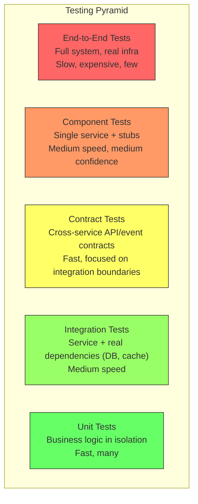

| Layer | Scope | Speed | Confidence | Count |
|-------|-------|-------|------------|-------|
| **Unit** | Single function/class, no I/O | ms | Low (internal logic only) | Hundreds |
| **Integration** | Service + real DB, cache, queue | Seconds | Medium (infra interaction) | Dozens |
| **Contract** | API/event contract between two services | ms-Seconds | High (integration boundary) | Tens per boundary |
| **Component** | Full service + stubbed dependencies | Seconds | High (service behavior) | Tens |
| **End-to-End** | Multiple services, real infra | Minutes | Highest (system behavior) | Few (critical paths only) |

---

## 2. Test Types in Detail

### Layer 1: Unit Tests

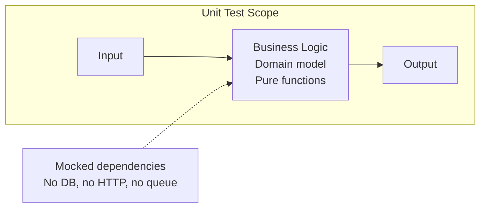

| Aspect | Detail |
|--------|--------|
| **What to test** | Domain logic, calculations, state transitions, validation rules |
| **What NOT to test** | Framework wiring, database queries, HTTP routing |
| **Speed target** | < 5 ms per test; full suite < 30 seconds |
| **Mocking** | Mock all external interfaces (repos, clients, queues) |
| **Example** | `OrderService.calculateTotal()` returns correct price with discount applied |

### Layer 2: Integration Tests

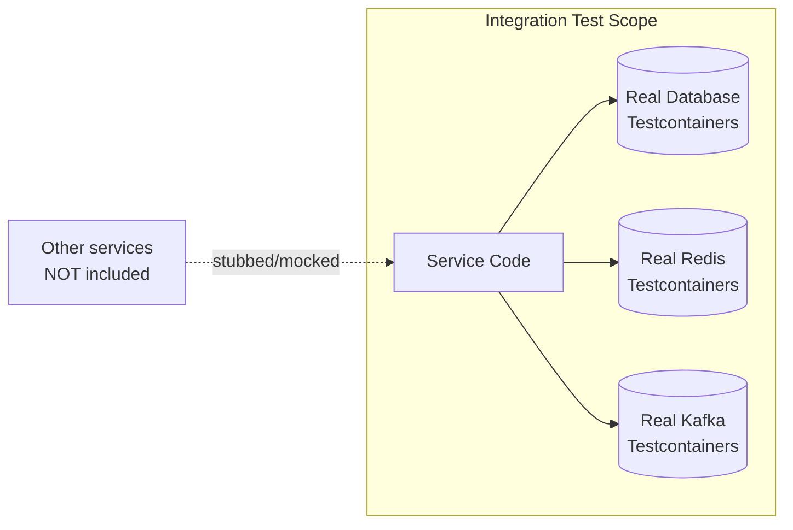

| Aspect | Detail |
|--------|--------|
| **What to test** | Repository queries against real DB, message serialization/deserialization, cache behavior |
| **Infra** | Testcontainers (Docker-based throwaway instances of Postgres, Redis, Kafka) |
| **Speed target** | < 30 seconds per test class; minute-level for full suite |
| **Key value** | Catches SQL bugs, serialization issues, schema mismatches that mocks hide |
| **Example** | `OrderRepository.findByCustomerId()` returns correct results with real Postgres |

### Layer 3: Contract Tests

This is the **most important new layer** for microservices — it tests the **integration boundary** without requiring both services to run.

#### Consumer-Driven Contracts (Pact)

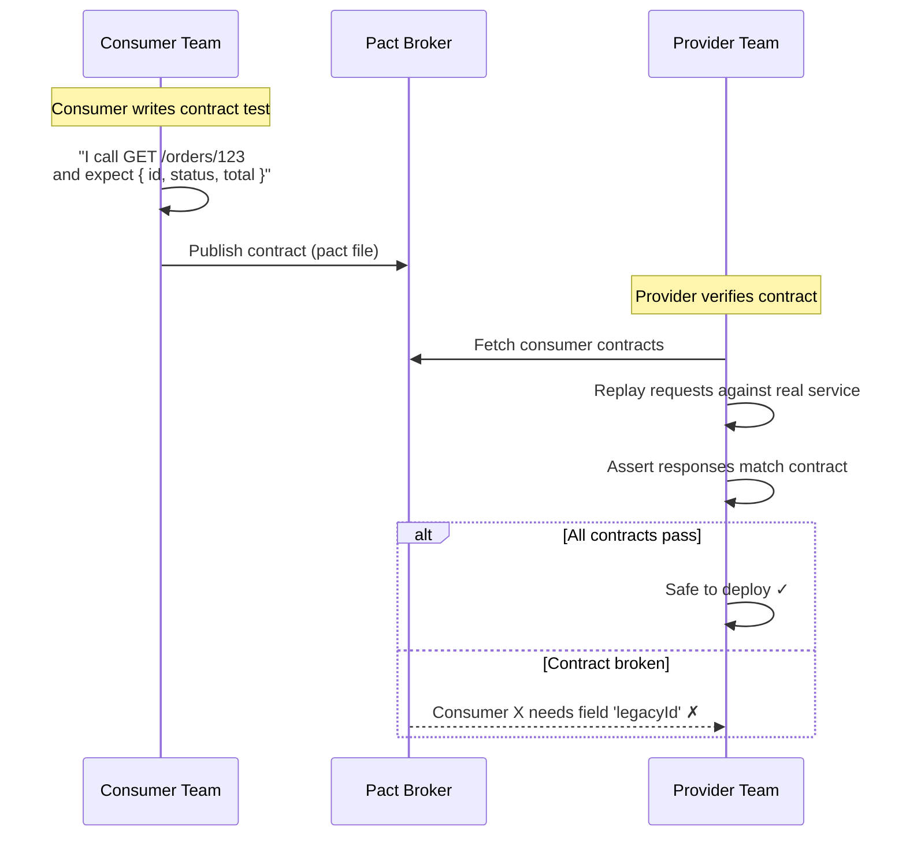

#### Provider Contract Tests (Schema validation)

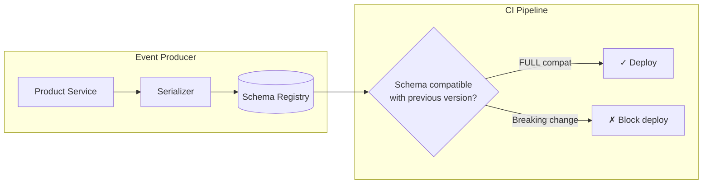

| Aspect | Consumer-Driven (Pact) | Provider Contract (Schema) |
|--------|----------------------|---------------------------|
| **Direction** | Consumer defines needs → provider verifies | Provider defines schema → registry enforces |
| **Best for** | REST/gRPC API boundaries | Event/message schemas (Avro, Protobuf) |
| **Coupling** | Consumers explicitly declare expectations | Producer-side only; consumers use Tolerant Reader |
| **Tool** | Pact, Spring Cloud Contract | Confluent Schema Registry, Apicurio |
| **Speed** | Fast — no real service needed | Fast — schema comparison only |

### Layer 4: Component Tests

Test a **single service end-to-end** with all external dependencies stubbed.

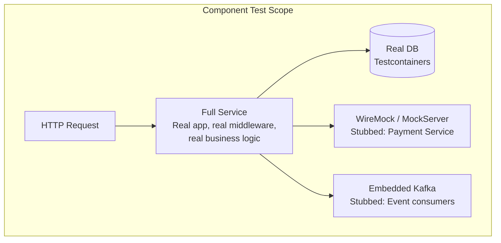

| Aspect | Detail |
|--------|--------|
| **What to test** | Full request lifecycle: HTTP → middleware → handler → DB → response |
| **Stubs** | WireMock for HTTP dependencies; embedded Kafka for async |
| **Speed** | Seconds per test (service starts once, tests share the instance) |
| **Key value** | Validates the *wiring* — serialization, middleware order, error handling, DB queries — all in one pass |
| **Example** | `POST /orders` with stubbed Payment Service returning success → verify order created in DB + event published |

### Layer 5: End-to-End (E2E) Tests

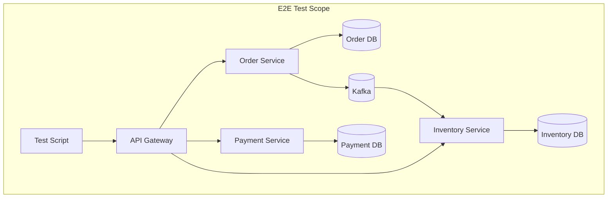

| Aspect | Detail |
|--------|--------|
| **What to test** | Critical business flows end-to-end: "Place an order, pay, reserve stock" |
| **Environment** | Staging or dedicated E2E environment with all services deployed |
| **Speed** | Minutes per test; suite may take 30-60 min |
| **Count** | **Minimal** — 5-15 tests covering critical happy paths and key failure scenarios |
| **Flakiness risk** | High — network, timing, data dependencies; invest in deterministic test data |
| **Key value** | The only test that validates the full distributed system works together |

---

## 3. Comparison: Where to Invest

| Layer | Speed | Maintenance Cost | Failure Signal | Investment Priority |
|-------|-------|-----------------|----------------|-------------------|
| **Unit** | Fastest | Low | "Logic is wrong" | P0 — foundation |
| **Integration** | Fast | Medium | "DB/cache interaction broken" | P1 — catch infra issues |
| **Contract** | Fast | Low-Medium | "Breaking change at service boundary" | **P0** — critical for microservices |
| **Component** | Medium | Medium | "Service doesn't work as a whole" | P1 — highest ROI per test |
| **E2E** | Slowest | **High** | "System doesn't work" | P2 — few critical paths only |

**The microservices-specific insight:** In a monolith, the unit→integration→E2E pyramid works. In microservices, **contract tests replace most of what E2E tests do** — at 100× less cost and 1000× more speed.

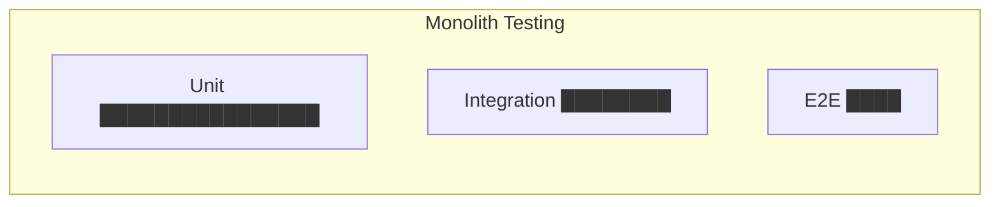

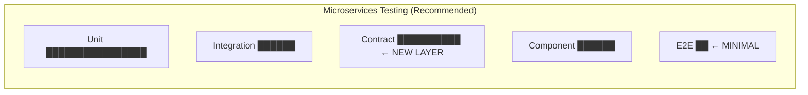

---

## 4. CI Pipeline Architecture

### Per-Service Pipeline

Each service has its **own independent CI pipeline** — this is fundamental to the independent deployment promise.

```mermaid
graph TB
    subgraph "Service A Pipeline"
        PUSH[Git Push<br/>to service-a/] --> LINT[Lint + Format Check]
        LINT --> UNIT[Unit Tests]
        UNIT --> BUILD[Build]
        BUILD --> INT[Integration Tests<br/>Testcontainers]
        INT --> CONTRACT[Contract Tests<br/>Pact verify]
        CONTRACT --> COMP[Component Tests<br/>WireMock + Testcontainers]
        COMP --> SAST[SAST / Dependency Scan]
        SAST --> IMAGE[Build Container Image<br/>tag: sha-abc123]
        IMAGE --> PUSH_REG[Push to Registry]
        PUSH_REG --> DEPLOY_DEV[Deploy to Dev]
        DEPLOY_DEV --> SMOKE[Smoke Tests in Dev]
    end
```

### Stage Gates

| Stage | Must Pass | Blocks |
|-------|-----------|--------|
| **Lint + Unit** | Code quality + logic correctness | Everything downstream |
| **Integration** | DB/cache interactions work | Component tests |
| **Contract** | No breaking changes to consumers | Image build |
| **Component** | Full service works with stubs | Image push |
| **SAST + Deps** | No critical vulnerabilities | Deployment |
| **Smoke (Dev)** | Basic health in dev environment | Staging promotion |

### Cross-Service CI: Contract Verification

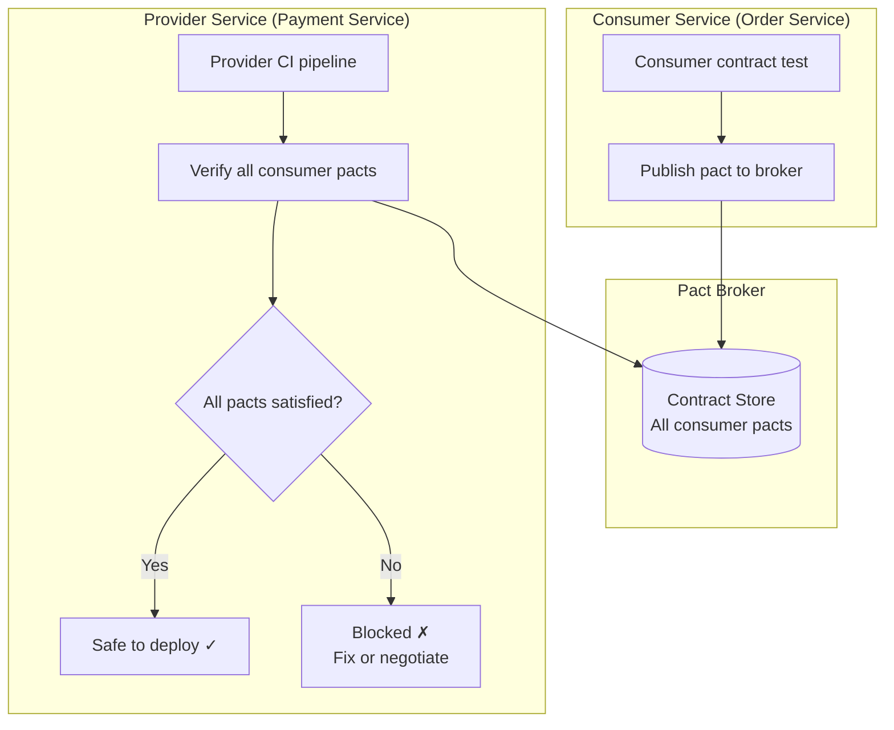

### Can-I-Deploy Check

Before deploying any service version to an environment, verify compatibility:

```
$ pact-broker can-i-deploy \
    --pacticipant order-service \
    --version sha-abc123 \
    --to production

Computer says: ✓ Yes
Reason: All contracts verified with current production versions
```

This is the CI equivalent of **pre-flight compatibility check** — blocks a deploy if it would break any consumer.

---

## 5. Repository Strategies

### Option A: Monorepo

```
/repo
├── services/
│   ├── order-service/
│   ├── payment-service/
│   └── inventory-service/
├── libs/
│   └── shared-proto/
├── contracts/
│   └── pact/
└── infra/
    └── terraform/
```

| Criterion | Assessment |
|-----------|-----------|
| **Cross-service refactoring** | Easy — one PR touches all affected services |
| **Dependency management** | Shared dependencies centrally managed |
| **CI complexity** | Must detect which services changed → trigger only their pipelines |
| **Scaling** | Large repos slow down; need build tools like Bazel, Nx, or Turborepo |
| **Used by** | Google, Meta, Uber |

### Option B: Polyrepo

```
order-service/       ← own repo, own CI pipeline
payment-service/     ← own repo, own CI pipeline
inventory-service/   ← own repo, own CI pipeline
shared-proto/        ← own repo, published as package
```

| Criterion | Assessment |
|-----------|-----------|
| **Team autonomy** | Full — each team owns their repo, CI, and release cadence |
| **Cross-service changes** | Hard — multiple PRs across repos; coordination needed |
| **CI simplicity** | Each repo = one pipeline; straightforward |
| **Dependency versioning** | Must version shared libraries; compatibility becomes explicit |
| **Used by** | Netflix, most startups scaling to microservices |

### Comparison

| Criterion | Monorepo | Polyrepo |
|-----------|----------|---------|
| **Team autonomy** | Lower (shared repo policies) | Higher (own repo, own rules) |
| **Cross-service consistency** | Easier (one linter config, one CI) | Harder (need standardization effort) |
| **Build time** | Needs affected-only detection | Each repo builds fast independently |
| **Contract management** | Contracts live alongside code | Contracts in shared repo or Pact Broker |
| **Best for** | Tight integration, shared ownership | Strong team boundaries, independent delivery |

---

## 6. Test Data Management

| Strategy | Description | Best For |
|----------|-------------|----------|
| **Fixture-based** | Predefined test data loaded before each test | Unit and component tests |
| **Factory patterns** | Generate test data programmatically (Faker, Bogus) | Integration and component tests |
| **Database snapshots** | Restore a known DB state before tests | Component tests with complex data |
| **Testcontainers** | Fresh database per test class — disposable | Integration tests — true isolation |
| **Shared staging data** | Long-lived environment with realistic data | E2E tests — but beware of test pollution |
| **Synthetic data generation** | Generate production-like data at scale | Performance tests |

### Test Isolation Pattern

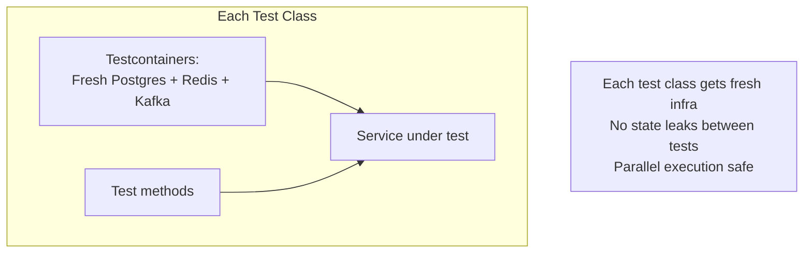

---

## 7. Handling Flaky Tests

Flaky tests are the #1 CI killer in microservices — they erode trust in the pipeline.

| Source of Flakiness | Fix |
|--------------------|-----|
| **Timing / race conditions** | Use explicit waits (Awaitility, polling assertions), not `Thread.sleep` |
| **Shared test state** | Testcontainers for fresh instances; database cleanup between tests |
| **Network-dependent tests** | WireMock for HTTP stubs; embedded brokers for messaging |
| **Port conflicts** | Random port allocation (`@SpringBootTest(webEnvironment = RANDOM_PORT)`) |
| **External service flakiness** | Never depend on real external services in CI — always stub |
| **Order-dependent tests** | Each test must be independently runnable; assert own preconditions |

### Flaky Test Policy

```
1. Flaky test detected (passed, then failed on retry without code change)
2. Auto-quarantined — moved to non-blocking suite
3. Alert sent to owning team — fix within 48 hours
4. If not fixed → deleted. No test is better than a flaky test.
```

---

## 8. Performance and Chaos Testing in CI

### Performance Testing

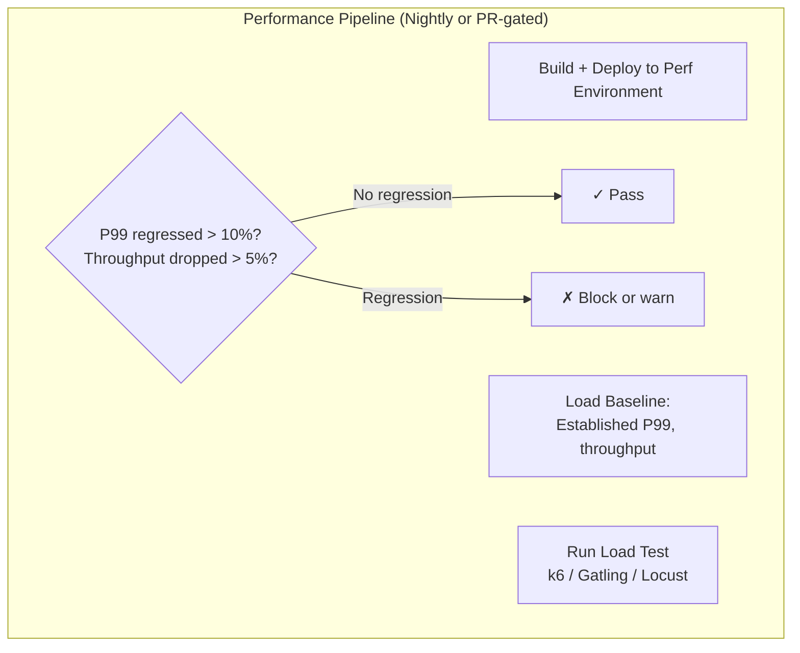

| Tool | Language | Strength |
|------|----------|----------|
| **k6** | JavaScript | Developer-friendly, CLI-first, CI-native |
| **Gatling** | Scala/Java | Rich DSL, detailed reports |
| **Locust** | Python | Distributed load generation, simple scripting |

### Chaos Testing (CI-integrated)

| Level | What to Test | Tool |
|-------|-------------|------|
| **Service level** | Inject latency, errors into dependencies during tests | Toxiproxy (in integration tests) |
| **Platform level** | Kill pods, drain nodes, network partition | Chaos Mesh, Litmus (Kubernetes) |
| **Scheduled** | Continuous chaos in staging | Gremlin, Chaos Monkey |

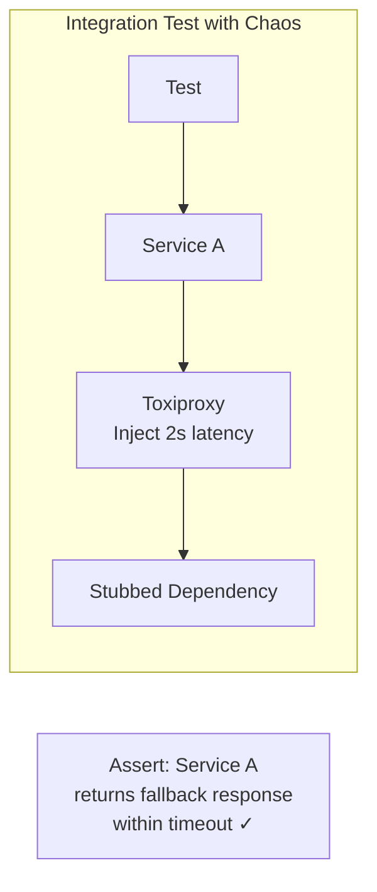

---

## 9. CI Metrics to Track

| Metric | Target | Why |
|--------|--------|-----|
| **Pipeline duration** | < 10 min (unit through component) | Longer = developers skip it or batch changes |
| **Test suite pass rate** | > 99.5% (excluding known flaky) | Below this, trust erodes → people ignore failures |
| **Flaky test count** | 0 in blocking suite | Flaky tests train developers to ignore CI |
| **Contract test coverage** | Every cross-service boundary has contracts | Uncovered boundaries = blind spots |
| **Build success rate** | > 95% | Low = broken `main` too often; gate merges better |
| **Time to feedback** | < 5 min for unit+contract | Developers context-switch after 5 min |
| **DORA: Change failure rate** | < 15% | % of deploys that cause incidents |

---

## 10. Anti-Patterns

| Anti-Pattern | Consequence |
|--------------|------------|
| **E2E tests as the primary safety net** | Slow, flaky, expensive — CI takes 2 hours; nobody waits |
| **No contract tests** | Breaking changes discovered in staging or production — days later |
| **Testing against shared staging environment** | Tests interfere with each other; non-deterministic failures |
| **Mocking everything (even the DB)** | Tests pass but queries are wrong; false confidence |
| **One pipeline for all services** | Change to Service A triggers tests for Service B through Z |
| **Skip tests for "small" changes** | Small changes cause the biggest outages |
| **Long-lived feature branches** | Merge hell; integration issues found too late |
| **No test for the sad path** | Timeout handling, circuit breaker fallback, retry behavior untested |
| **Shared mutable test data** | Tests pass in isolation, fail when run together |
| **Manual QA gate before production** | Bottleneck; defeats CI/CD; encourages batching (which increases risk) |

---

## 11. Recommendation: Testing Strategy by Maturity

| Level | Strategy | Focus |
|-------|----------|-------|
| **1 — Starting** | Unit + Integration tests per service; manual E2E | Get fast feedback on core logic; establish CI pipeline |
| **2 — Growing** | Add Contract tests (Pact); Component tests with Testcontainers and WireMock | Cover cross-service boundaries; reduce E2E dependency |
| **3 — Scaling** | Trunk-based development; can-I-deploy gates; nightly performance tests | Continuous delivery confidence; catch regressions |
| **4 — Mature** | Chaos testing in CI; automated E2E smoke suite; production testing (canary + synthetic monitoring) | Validate resilience; test in production safely |

---

## 12. Practical Checklist

```
Unit Tests:
[ ] Business logic tested without I/O — pure functions, domain models
[ ] Speed: full suite < 30 seconds
[ ] Run on every commit / PR

Integration Tests:
[ ] DB queries tested against real database (Testcontainers)
[ ] Message serialization/deserialization tested against real broker
[ ] No shared state between tests — fresh containers per test class

Contract Tests:
[ ] Consumer contracts published to Pact Broker for every API consumer
[ ] Provider verification runs in provider's CI pipeline
[ ] Event schema compatibility checked via Schema Registry in CI
[ ] `can-i-deploy` check before every production deployment

Component Tests:
[ ] Full service started with real DB + stubbed HTTP deps (WireMock)
[ ] Happy path + key failure scenarios (timeout, 5xx, slow response)
[ ] Tests run in < 2 minutes

E2E Tests:
[ ] Only critical business flows (checkout, signup, payment)
[ ] Maximum 10-15 tests
[ ] Run in dedicated environment, not shared staging
[ ] Quarantine flaky tests immediately

CI Pipeline:
[ ] Per-service pipeline; triggers only on relevant changes
[ ] Fast feedback: unit + contract tests < 5 min
[ ] Full pipeline (through component tests) < 10 min
[ ] SAST + dependency vulnerability scan in every build
[ ] Immutable image tag (git SHA) for traceability

Resilience:
[ ] Toxiproxy in integration tests for timeout/error injection
[ ] Circuit breaker fallback behavior tested
[ ] Retry + idempotency tested under failure conditions
```

---

## 13. Next Steps

1. **What's your current testing coverage?** — Unit only? Some E2E? No contracts?
2. **How many cross-service boundaries** need contract tests?
3. **What CI tool?** — GitHub Actions, GitLab CI, Jenkins? Influences pipeline design.
4. **Monorepo or polyrepo?** — Determines pipeline trigger strategy.
5. **What languages/frameworks?** — Shapes tooling choices (Pact, Testcontainers, WireMock support).
6. **Current pipeline duration?** — If > 15 min, optimization is urgent.
