# How to handle service governance and lifecycle management in a Microservices architecture?

As the number of microservices grows from 5 to 50 to 500, **organizational chaos scales faster than technical complexity**. Without governance, you get: services no one owns, APIs no one documents, dependencies no one tracks, and zombie services no one decommissions.

Governance in microservices is fundamentally different from monolith governance:

> **Monolith governance:** Centralized control. One team sets standards, reviews all code, approves all changes.  
> **Microservice governance:** Decentralized execution with shared standards. Teams move independently within agreed guardrails.

The tension:

> **Too much governance** → bureaucracy, slow delivery, negates the autonomy microservices promise  
> **Too little governance** → chaos, inconsistency, duplicated services, security gaps, orphaned infrastructure

---

## 1. What Governance Covers

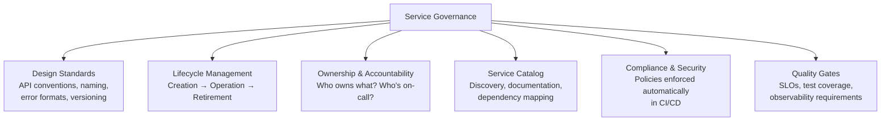

---

## 2. Service Lifecycle Stages

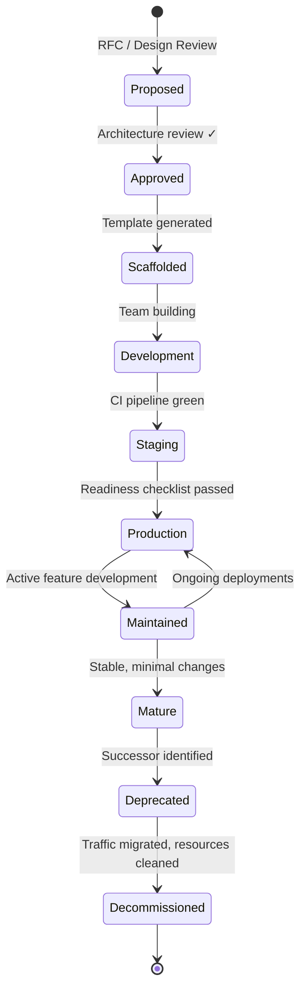

| Stage | Key Activities | Exit Criteria |
|-------|---------------|---------------|
| **Proposed** | RFC written; business justification; architecture review | Approved by architecture review (lightweight) |
| **Scaffolded** | Service generated from template; CI/CD pipeline provisioned; repo created | Template checklist passed |
| **Development** | Feature implementation; unit + contract tests; API documented | CI pipeline green; contract tests pass |
| **Staging** | Integration testing; performance baseline; security scan | Readiness checklist passed |
| **Production** | Canary deploy; monitoring verified; on-call configured | SLOs met for 2 weeks |
| **Maintained** | Active development; regular deployments; SLO tracking | Team actively owns service |
| **Mature** | Minimal changes; stable; meets SLOs consistently | Clear owner, even if low activity |
| **Deprecated** | Successor announced; consumers migrating; sunset timeline published | All consumers migrated |
| **Decommissioned** | Traffic at zero; infrastructure torn down; registry entries removed | No references to service remain |

---

## 3. Service Creation Governance

### The "Should This Be a Service?" Decision

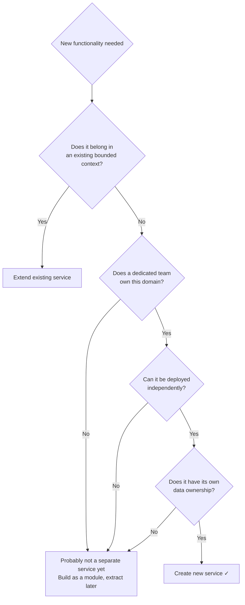

| Signal to CREATE a service | Signal to WAIT |
|---------------------------|----------------|
| Clear bounded context with own domain language | Shared data model with existing service |
| Dedicated team to own it | No clear owner; "someone will maintain it" |
| Independent deployment cadence needed | Always deploys with another service |
| Different scaling characteristics | Same traffic pattern as parent service |
| Different technology requirements | Same stack as parent |

**Anti-pattern:** Creating a service for every entity (`UserService`, `AddressService`, `PhoneService`) instead of per bounded context (`CustomerManagement`).

### Service Template / Scaffolding

Every new service starts from a **standardized template** that includes governance guardrails from day one.

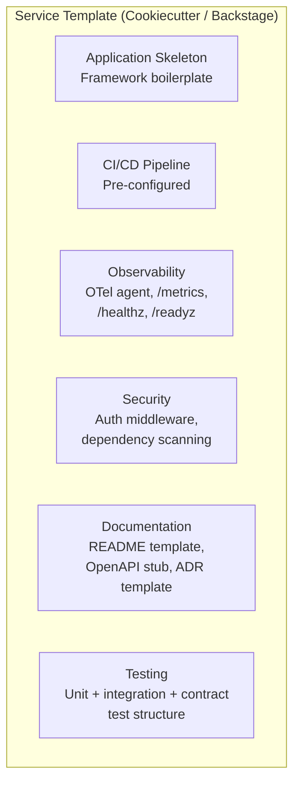

| Template Component | Why It's in the Template |
|-------------------|------------------------|
| **Health endpoints** (`/healthz`, `/readyz`) | Every service needs them; can't deploy without them |
| **Prometheus metrics** (`/metrics`) | Observability isn't optional — bake it in |
| **OpenTelemetry agent/SDK** | Distributed tracing from day one |
| **Structured logging** (JSON to stdout) | Consistent log format across all services |
| **Auth middleware** | Security is not an afterthought |
| **Dockerfile / Helm chart** | Standardized deployment from creation |
| **CI pipeline config** | No "I'll set up CI later" |
| **OpenAPI/Proto stub** | API documentation starts at scaffolding, not retroactively |
| **ADR directory** | Decisions captured from the beginning |

**Tools:** Backstage (Spotify), Cookiecutter, Yeoman, custom CLI

---

## 4. Production Readiness Checklist

No service goes to production without passing this gate. Automated where possible, reviewed where not.

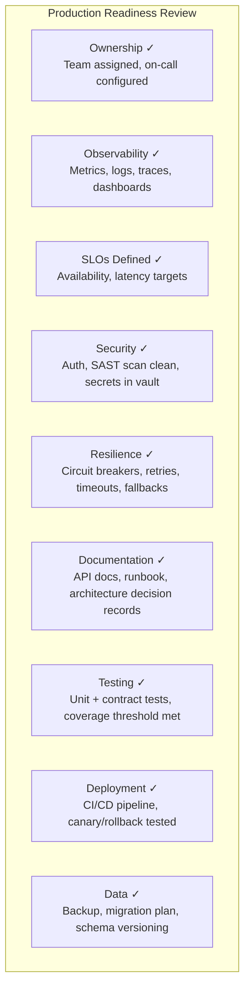

### Checklist Detail

| Category | Requirement | Automated? |
|----------|-------------|-----------|
| **Ownership** | Team identified in service catalog | Manual (Backstage) |
| **Ownership** | On-call rotation configured | Manual (PagerDuty) |
| **Ownership** | Escalation path documented | Manual |
| **Observability** | RED metrics exposed on `/metrics` | CI check |
| **Observability** | Grafana dashboard exists | CI check (dashboard-as-code) |
| **Observability** | Distributed tracing enabled (OTel) | CI check (trace ID in logs) |
| **Observability** | Log format: structured JSON with traceId | CI lint |
| **SLOs** | Availability SLO defined (e.g., 99.9%) | Manual → automated tracking |
| **SLOs** | Latency SLO defined (e.g., P99 < 200ms) | Manual → automated tracking |
| **Security** | No critical/high SAST findings | CI gate |
| **Security** | No critical dependency vulnerabilities | CI gate (Trivy/Snyk) |
| **Security** | Authentication configured | CI check |
| **Security** | Secrets in vault (not in env vars or code) | CI check |
| **Resilience** | Health check endpoints implemented | CI check |
| **Resilience** | Timeouts configured on all outbound calls | Code review / linter |
| **Resilience** | Circuit breaker on critical dependencies | Code review |
| **Resilience** | Graceful shutdown implemented | CI check |
| **Documentation** | API documented (OpenAPI / Proto) | CI check (spec file exists) |
| **Documentation** | Runbook linked in service catalog | Manual |
| **Testing** | Unit test coverage > 80% | CI gate |
| **Testing** | Contract tests for all consumed/provided APIs | Pact broker check |
| **Testing** | Integration tests with real DB | CI pipeline structure |
| **Deployment** | CI/CD pipeline functional | Pipeline exists |
| **Deployment** | Rollback tested and documented | Manual verification |
| **Data** | Database backup configured | Infra check |
| **Data** | Migration strategy (Flyway/Liquibase) | CI check |

---

## 5. Service Catalog

The service catalog is the **single source of truth** for what services exist, who owns them, and their status.

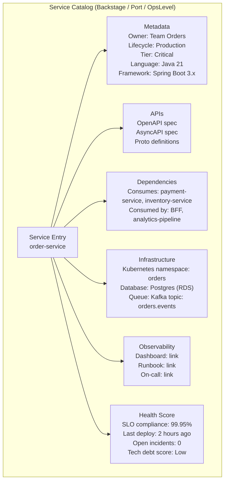

### Service Metadata (catalog-info.yaml)

```yaml
apiVersion: backstage.io/v1alpha1
kind: Component
metadata:
  name: order-service
  description: Manages order lifecycle from creation to fulfillment
  tags:
    - java
    - spring-boot
    - critical
  annotations:
    grafana/dashboard-url: https://grafana.internal/d/order-service
    pagerduty.com/service-id: PXXXXXX
    backstage.io/techdocs-ref: dir:.
spec:
  type: service
  lifecycle: production
  owner: team-orders
  system: order-management
  providesApis:
    - order-api
    - order-events-api
  consumesApis:
    - payment-api
    - inventory-api
  dependsOn:
    - resource:orders-db
    - resource:kafka-orders-topic
```

### Dependency Graph (Auto-generated)

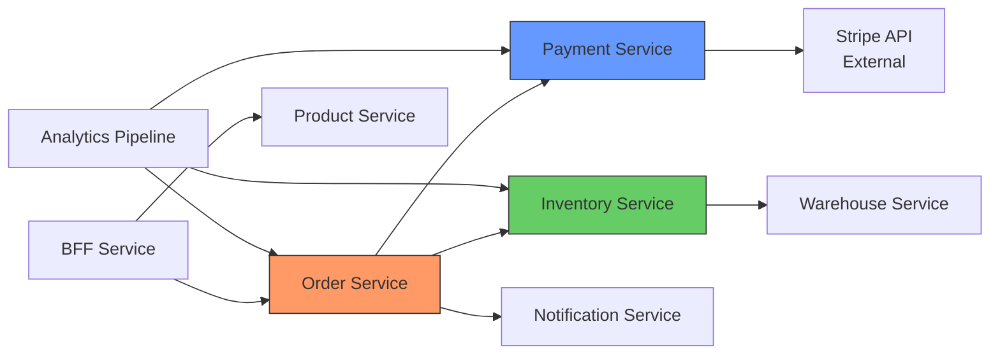

This graph answers: "If I change Order Service, who is affected?" — critical for impact analysis before any deployment.

---

## 6. Service Tiering and SLOs

Not all services are equally important. Tiering drives investment in resilience, support, and governance strictness.

| Tier | Definition | SLO Target | On-Call | Governance Strictness |
|------|-----------|------------|---------|----------------------|
| **Tier 1 — Critical** | Revenue-generating, user-facing, data integrity | 99.95% availability; P99 < 200ms | 24/7 paging | Full readiness checklist; mandatory contract tests; chaos testing |
| **Tier 2 — Important** | Internal tooling, non-critical user features | 99.9% availability; P99 < 500ms | Business hours + escalation | Standard readiness checklist; contract tests recommended |
| **Tier 3 — Supporting** | Analytics, batch jobs, internal utilities | 99% availability; best-effort latency | Best-effort support | Lightweight checklist; basic monitoring |

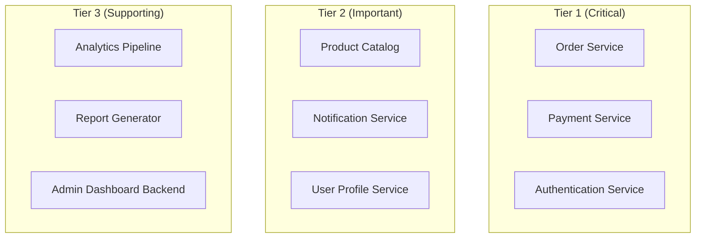

**Tier determines:** on-call expectations, test coverage requirements, deployment strategy (canary for Tier 1, rolling for Tier 3), incident response time, and budget for redundancy.

---

## 7. API Standards and Design Guidelines

Governance without **enforceable standards** is just a wiki page nobody reads. Codify standards into linters, CI gates, and templates.

| Standard | What It Covers | How to Enforce |
|----------|---------------|---------------|
| **API conventions** | REST: resource naming, HTTP methods, status codes, pagination, error format | Spectral (OpenAPI linter) in CI |
| **Error format** | Consistent error body across all services (RFC 7807 Problem Details) | Shared middleware in template |
| **Versioning** | URL path versioning for public, additive-only for internal | CI linter + contract tests |
| **Authentication** | JWT validation at gateway; service-level authorization | Template middleware + gateway policy |
| **Naming** | Service names, topic names, metric names, header names | ADR + CI lint rules |
| **Event format** | CloudEvents envelope; Avro/Protobuf payload; schema registry | Schema compatibility check in CI |
| **Documentation** | OpenAPI spec for REST; AsyncAPI for events; proto for gRPC | CI gate: spec file must exist and be valid |

### Standard Error Format (RFC 7807)

```json
{
  "type": "https://api.example.com/errors/insufficient-funds",
  "title": "Insufficient Funds",
  "status": 422,
  "detail": "Account 12345 has balance $10.00, but $25.00 is required",
  "instance": "/orders/67890",
  "traceId": "abc-123-def-456"
}
```

Every service returns errors in this format — consumers parse one structure, monitoring tools grep one pattern.

---

## 8. Governance Models

### Option A: Centralized Architecture Board

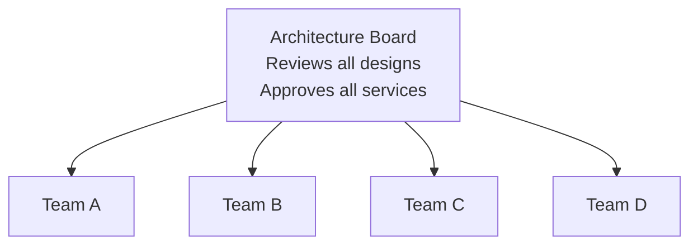

| Criterion | Assessment |
|-----------|-----------|
| **Consistency** | High — one body enforces all standards |
| **Speed** | Slow — bottleneck at the board; meetings, approval cycles |
| **Autonomy** | Low — teams can't move without approval |
| **Scalability** | Poor — board becomes overwhelmed at 50+ services |
| **Best for** | Regulated industries; early microservices adoption with junior teams |

### Option B: Decentralized with Guardrails (Preferred)

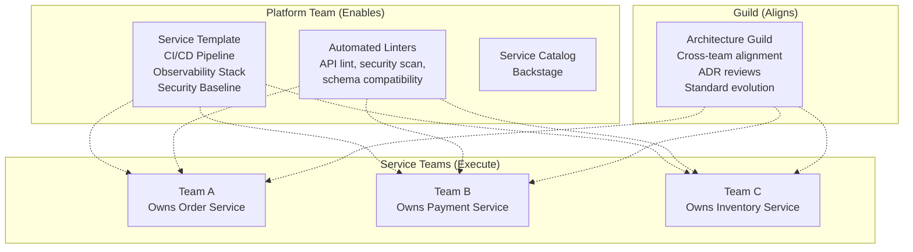

| Criterion | Assessment |
|-----------|-----------|
| **Consistency** | High — enforced by automation (linters, templates, CI gates), not meetings |
| **Speed** | Fast — teams move independently within guardrails |
| **Autonomy** | High — choose your own libraries, patterns (within standards) |
| **Scalability** | Excellent — automation scales; guild scales via rotation |
| **Best for** | Most organizations; scales from 10 to 500 services |

### Comparison

| Criterion | Centralized Board | Decentralized + Guardrails |
|-----------|------------------|---------------------------|
| **Decision speed** | Days-weeks | Minutes-hours |
| **Bottleneck risk** | High | Low |
| **Consistency** | High (manual) | High (automated) |
| **Innovation** | Low (must get approval) | High (experiment within guardrails) |
| **Compliance evidence** | Meeting minutes | CI pipeline logs, audit trail |

---

## 9. Service Deprecation and Decommissioning

The **hardest governance problem** — services never die naturally; they linger as zombie infrastructure.

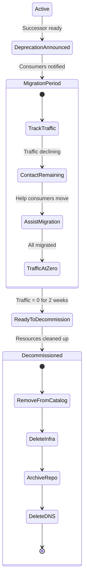

### Deprecation Playbook

| Step | Action | Timeline |
|------|--------|----------|
| 1. **Announce** | Mark as deprecated in catalog; add `Sunset` header to API; notify all consumers | Day 0 |
| 2. **Document migration path** | Publish migration guide; identify successor service | Day 0 |
| 3. **Monitor traffic** | Dashboard showing request count per consumer | Ongoing |
| 4. **Block new consumers** | Remove from service discovery for new registrations; API gateway blocks new integrations | Week 2 |
| 5. **Contact remaining consumers** | Direct outreach to teams still calling the deprecated service | Monthly |
| 6. **Set sunset date** | Hard deadline communicated 3 months in advance | 3 months before end |
| 7. **Return 410 Gone** | After sunset, respond with `410 Gone` + link to successor | Sunset date |
| 8. **Decommission** | Delete infrastructure, DNS, registry entries; archive repository | 2 weeks after 410 |

### Zombie Service Detection

Automated checks that identify services needing decommission:

| Signal | Threshold | Action |
|--------|-----------|--------|
| **No deployments** | > 6 months | Investigate — is it stable or abandoned? |
| **No commits** | > 12 months | Likely abandoned — find owner or decommission |
| **No traffic** | > 30 days | Decommission candidate |
| **No owner in catalog** | Any | Assign owner immediately or flag for decommission |
| **Failed health checks** | > 7 days unresolved | Escalate — broken and nobody noticed |
| **No on-call configured** | Any | Cannot remain in production |
| **Outdated dependencies** | Critical CVEs unpatched > 30 days | Security escalation |

---

## 10. Architecture Decision Records (ADRs)

Every significant decision is captured, not just the outcome but the **context and alternatives considered**.

```markdown
# ADR-042: Use Kafka for Order Events (not RabbitMQ)

## Status
Accepted (2026-03-15)

## Context
Order events need to be consumed by 5 services. We need ordering 
guarantees per order and the ability to replay events for rebuilding 
projections.

## Decision
Use Apache Kafka with per-orderId partitioning.

## Alternatives Considered
- **RabbitMQ**: Simpler, but no replay; no ordering beyond single queue.
- **AWS SNS+SQS**: Managed, but fan-out is eventually consistent; no replay.

## Consequences
- Must operate Kafka cluster (or use managed: Confluent/MSK)
- Teams must learn Kafka consumer group semantics
- Replay capability enables rebuilding read models without downtime
```

| ADR Practice | Why |
|-------------|-----|
| **Stored in repo** (alongside code) | Decisions travel with the code; discoverable in PR history |
| **Numbered sequentially** | Easy to reference: "See ADR-042" |
| **Immutable once accepted** | Superseded by new ADRs, not edited; preserves historical context |
| **Lightweight** | 1 page max — not a design document; just the decision and context |

---

## 11. Governance Automation Summary

| Governance Concern | Manual Approach | Automated Approach |
|-------------------|-----------------|-------------------|
| API consistency | Code review | Spectral/OpenAPI linter in CI |
| Security vulnerabilities | Periodic audit | Trivy/Snyk scan in every build |
| Schema compatibility | Review meeting | Schema Registry compatibility check in CI |
| SLO compliance | Monthly report | Prometheus + Sloth/Pyrra continuous tracking |
| Ownership tracking | Spreadsheet | Backstage `catalog-info.yaml` in every repo |
| Documentation exists | Manual checklist | CI gate: OpenAPI/AsyncAPI spec must be present and valid |
| Test coverage | Trust | CI gate: coverage threshold enforced |
| Dependency freshness | Quarterly audit | Dependabot/Renovate automated PRs |
| Zombie service detection | Tribal knowledge | Automated traffic + deploy + commit age monitoring |
| Production readiness | Meeting with checklist | Backstage Tech Insights scorecards |

---

## 12. Anti-Patterns

| Anti-Pattern | Consequence |
|--------------|------------|
| **No service catalog** | "Who owns this?" becomes a Slack question; incident response is slow |
| **Architecture board reviews every PR** | Bottleneck; teams wait weeks for approval; delivery stalls |
| **Standards in a wiki nobody reads** | Inconsistency; every service has its own error format, logging style, auth mechanism |
| **No production readiness checklist** | Services go live without monitoring, runbooks, or on-call — first incident is chaos |
| **No decommission process** | Zombie services accumulate; infrastructure cost grows; security surface expands |
| **Governance applies equally to all tiers** | Tier 3 analytics jobs go through the same review as Tier 1 payment service — waste |
| **"We'll add observability later"** | Later never comes; first outage has no data |
| **Service per developer** | 200 services for 50 engineers — no one owns anything properly |
| **No ADRs** | "Why did we choose Kafka?" — nobody remembers; decisions relitigated quarterly |

---

## 13. Practical Checklist

```
Service Creation:
[ ] Decision tree validated: "Should this be a new service?"
[ ] Service generated from standardized template
[ ] Registered in service catalog (Backstage) with owner and tier
[ ] CI/CD pipeline provisioned automatically
[ ] ADR written for key design decisions

Standards Enforcement:
[ ] API linter (Spectral) in CI for all REST APIs
[ ] Schema compatibility check in CI for all event schemas
[ ] Security scan (SAST + dependencies) in every build
[ ] Test coverage gate enforced per tier

Production Readiness:
[ ] Production readiness checklist passed before first deploy
[ ] SLOs defined and tracked (Sloth/Pyrra)
[ ] Grafana dashboard exists (dashboard-as-code)
[ ] On-call rotation configured and tested
[ ] Runbook written and linked in catalog

Ongoing Governance:
[ ] Architecture guild meets bi-weekly for alignment (not approval)
[ ] Dependency graph auto-updated in catalog
[ ] Zombie service detection runs monthly
[ ] ADRs reviewed in guild meetings
[ ] Standards evolve via RFCs, not top-down mandates

Deprecation:
[ ] Deprecation announced 3+ months before sunset
[ ] Sunset header added to API responses
[ ] Consumer traffic monitored per consumer
[ ] Hard sunset date enforced with 410 Gone
[ ] Infrastructure torn down within 2 weeks of decommission
```

---

## 14. Next Steps

1. **How many services do you have today?** — Under 10: lightweight catalog is fine. Over 30: invest in Backstage or similar.
2. **Do you have a platform team?** — They own templates, pipelines, and the service catalog.
3. **What's your biggest governance pain point?** — Inconsistent APIs? Unknown ownership? Zombie services?
4. **Regulated industry?** — HIPAA/PCI/SOX add compliance-specific governance requirements.
5. **Current documentation approach?** — ADRs? Wiki? Nothing?
