# How to handle security and access control in a Microservices architecture?

In a monolith, security is a single perimeter — one authentication check, one authorization layer, one session store. In microservices, **every service is an attack surface**, every network call is a potential interception point, and every service-to-service path needs its own trust verification.

The fundamental shift:

> **Monolith:** Secure the castle walls (perimeter). Once inside, everything is trusted.  
> **Microservices:** Zero trust. Every service verifies every request. The network is hostile — even the internal network.

The consequence of getting this wrong is not a degraded feature — it's **unauthorized data access, privilege escalation, and regulatory violations**.

---

## 1. The Threat Landscape

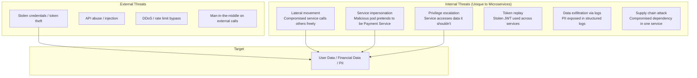

| Threat | Monolith Impact | Microservices Impact |
|--------|----------------|---------------------|
| **Compromised component** | Attacker has access to everything (one process) | Attacker has access to one service — **if** lateral movement is blocked |
| **Network interception** | Minimal (in-process calls) | High — every service-to-service call crosses the network |
| **Token theft** | One session to hijack | Token propagated across N services — blast radius grows |
| **Misconfigured auth** | One place to fix | N services × M endpoints — exponential surface area |

---

## 2. Security Architecture: Defense in Depth

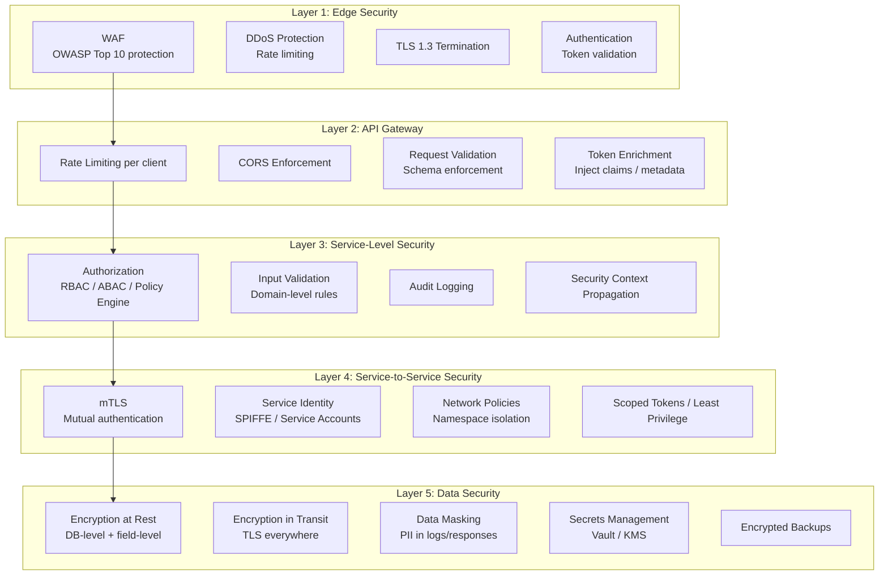

---

## 3. Authentication: "Who Are You?"

### Option A: API Gateway Authentication (Token Validation at Edge)

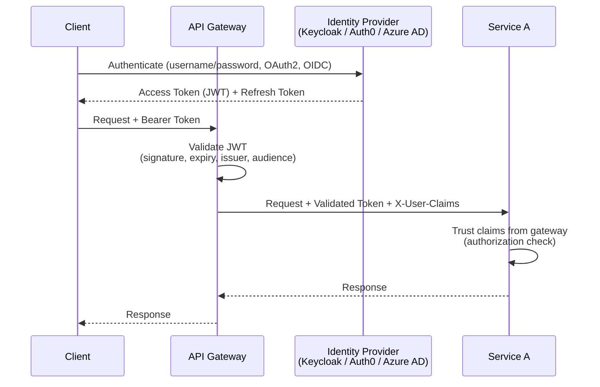

| Criterion | Assessment |
|-----------|-----------|
| **Centralization** | Token validation in one place — gateway handles it |
| **Service simplicity** | Services trust the gateway; no crypto libraries needed per service |
| **Risk** | If gateway is bypassed (misconfigured network), services have no auth |
| **Best for** | Internal services behind a trusted gateway with network policies enforced |

### Option B: Per-Service Token Validation (Zero Trust)

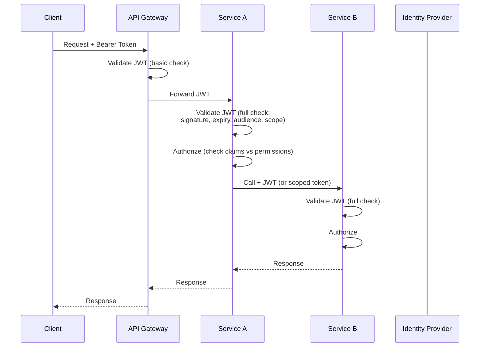

| Criterion | Assessment |
|-----------|-----------|
| **Security** | Highest — every service validates independently; network bypass doesn't matter |
| **Complexity** | Higher — every service needs JWT validation logic (shared library or sidecar) |
| **Latency** | Each service does crypto validation (cacheable; ~1ms with JWKS caching) |
| **Best for** | Zero-trust environments; services accessible from multiple entry points |

### Option C: Service Mesh Identity (mTLS + SPIFFE)

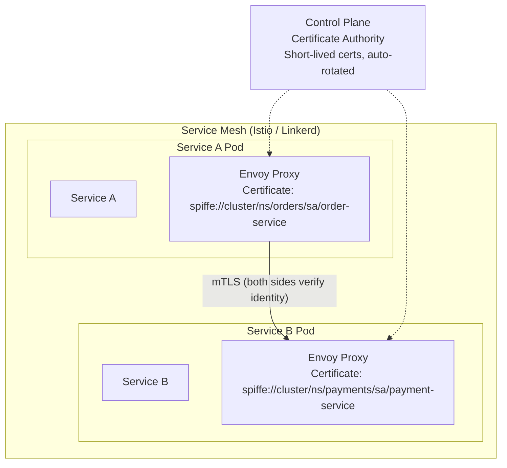

| Criterion | Assessment |
|-----------|-----------|
| **Service identity** | Cryptographic — each service has a SPIFFE identity; impersonation is impossible |
| **Encryption** | All traffic encrypted automatically — transparent to application |
| **Certificate management** | Auto-rotated by mesh; no manual cert ops |
| **Complexity** | Service mesh operational overhead |
| **Best for** | Kubernetes environments; replacing internal API keys; zero-trust network |

### Authentication Comparison

| Criterion | Gateway-Only | Per-Service Validation | Service Mesh mTLS |
|-----------|-------------|----------------------|-------------------|
| **Trust model** | Trust the gateway | Trust nothing | Cryptographic identity |
| **Bypass resistance** | Low (network misconfiguration) | High | High |
| **Implementation effort** | Low | Medium (shared library) | Medium (mesh setup) |
| **User identity** | JWT at gateway | JWT propagated | JWT + service identity |
| **Service-to-service auth** | None (implicit trust) | Token propagation | mTLS auto |
| **Best for** | Simple setups, trusted network | Multi-entry-point systems | Kubernetes-native |

---

## 4. Authorization: "Are You Allowed?"

### Option A: Service-Embedded Authorization (Local RBAC)

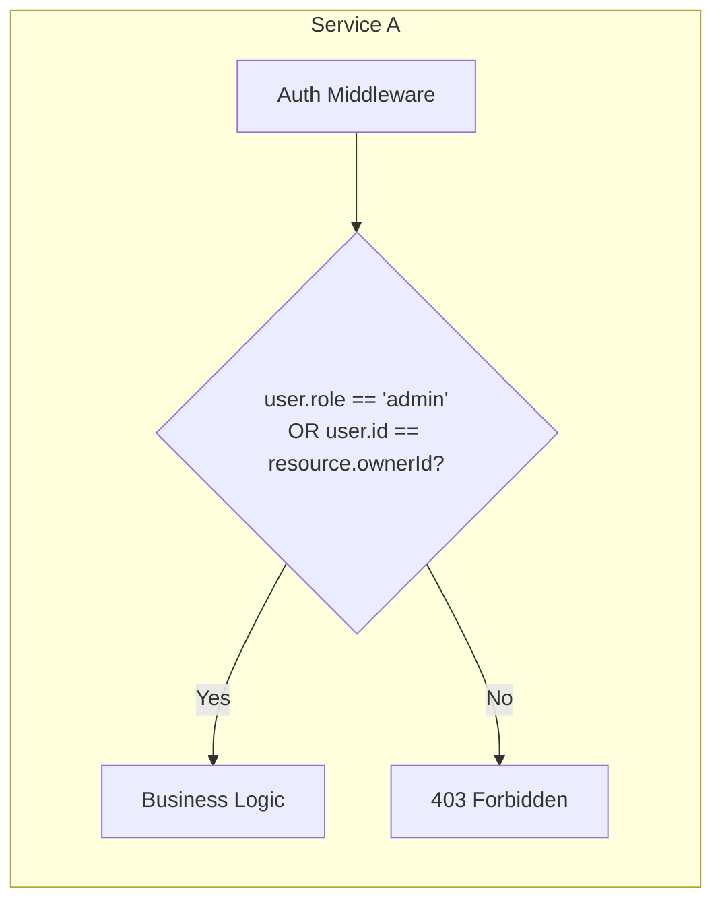

| Criterion | Assessment |
|-----------|-----------|
| **Simplicity** | Easy — role checks in middleware or decorators |
| **Flexibility** | Low — roles are coarse-grained; complex policies become spaghetti `if` statements |
| **Consistency** | Low — each service implements its own rules; easy to diverge |
| **Best for** | Simple RBAC with few roles; small service count |

### Option B: Centralized Policy Engine (OPA / Cedar / Zanzibar)

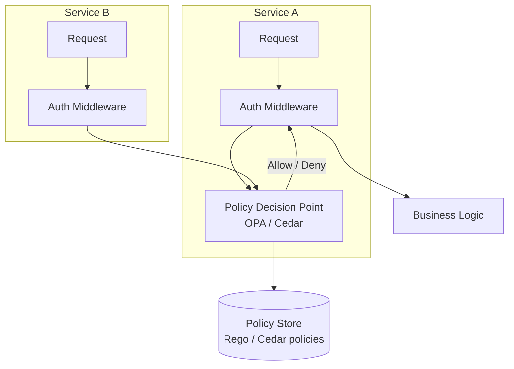

**OPA (Open Policy Agent) Example:**

```rego
# policy.rego
package order.authz

default allow = false

# Admins can do anything
allow {
    input.user.role == "admin"
}

# Users can read their own orders
allow {
    input.action == "read"
    input.resource.type == "order"
    input.resource.ownerId == input.user.id
}

# Managers can read all orders in their region
allow {
    input.action == "read"
    input.resource.type == "order"
    input.user.role == "manager"
    input.resource.region == input.user.region
}
```

| Criterion | Assessment |
|-----------|-----------|
| **Separation of concerns** | Excellent — policy is decoupled from application code; change rules without redeploying services |
| **Consistency** | High — single policy language across all services |
| **Flexibility** | High — ABAC, RBAC, ReBAC all expressible |
| **Auditability** | Excellent — policies are version-controlled; decisions are logged |
| **Latency** | Low — OPA runs as sidecar (~1ms evaluation); policies cached locally |
| **Best for** | Complex authorization; compliance requirements; multi-service consistency |

### Option C: Relationship-Based Access Control (Zanzibar / SpiceDB)

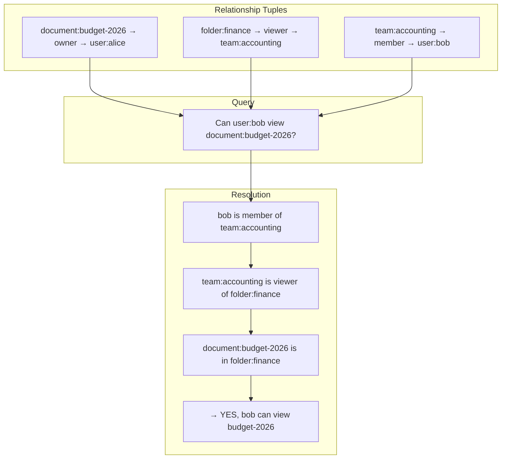

| Criterion | Assessment |
|-----------|-----------|
| **Model** | Relationships (tuples) define who has what relation to which object |
| **Flexibility** | Excellent — models Google Docs-style sharing, org hierarchies, resource inheritance |
| **Performance** | Optimized for "check" queries — sub-ms at scale |
| **Complexity** | High — modeling relationships correctly requires domain analysis |
| **Best for** | Document sharing, multi-tenant SaaS, hierarchical org permissions |
| **Implementations** | SpiceDB (OSS), Authzed, Ory Keto, AWS Verified Permissions |

### Authorization Comparison

| Criterion | Embedded RBAC | OPA / Cedar | Zanzibar / SpiceDB |
|-----------|--------------|-------------|-------------------|
| **Policy expressiveness** | Low (roles only) | High (ABAC + RBAC) | Highest (relationship graphs) |
| **Consistency across services** | Low | High | High |
| **Decoupled from code** | No | Yes | Yes |
| **Audit trail** | Manual | Built-in (decision logs) | Built-in (relationship changes) |
| **Latency** | Lowest (in-process) | Low (sidecar ~1ms) | Low (~1ms check) |
| **Operational cost** | None | Medium (policy management) | Medium-High (relationship store) |
| **Best for** | Simple apps | Enterprise, compliance | Multi-tenant, document sharing |

---

## 5. Token Strategy

### JWT Structure for Microservices

```json
{
  "header": {
    "alg": "RS256",
    "kid": "key-2026-04"
  },
  "payload": {
    "sub": "user-42",
    "iss": "https://auth.example.com",
    "aud": ["order-service", "payment-service"],
    "exp": 1713456000,
    "iat": 1713452400,
    "scope": "orders:read orders:write payments:read",
    "roles": ["customer"],
    "tenant_id": "acme-corp",
    "region": "eu-west",
    "jti": "unique-token-id-789"
  }
}
```

| Claim | Purpose |
|-------|---------|
| `sub` | User identity |
| `aud` | Which services can accept this token — reject if your service isn't listed |
| `scope` | Fine-grained permissions — what operations are allowed |
| `roles` | Coarse-grained RBAC — for simple checks |
| `tenant_id` | Multi-tenant isolation — filter all queries by tenant |
| `jti` | Token ID for revocation checking |
| `exp` | Short-lived (5-15 min) — limits blast radius of stolen tokens |

### Token Propagation Patterns

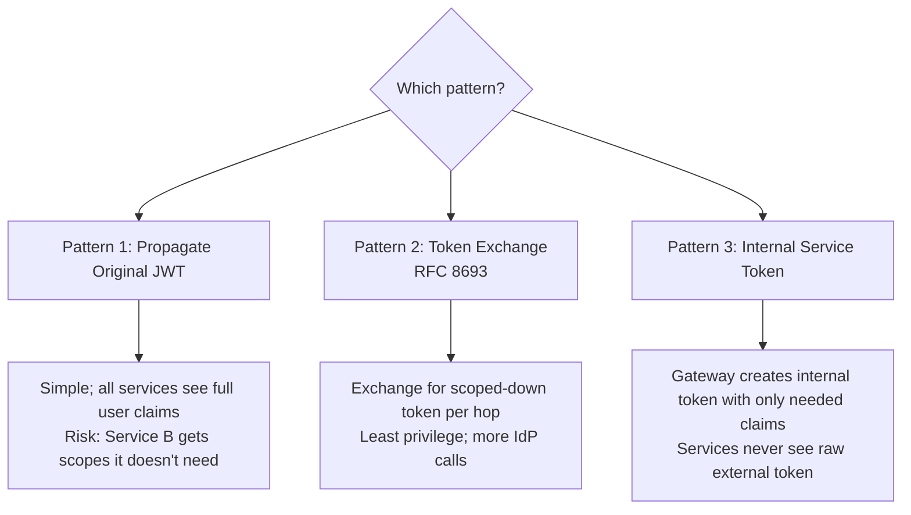

#### Pattern 1: Propagate Original JWT

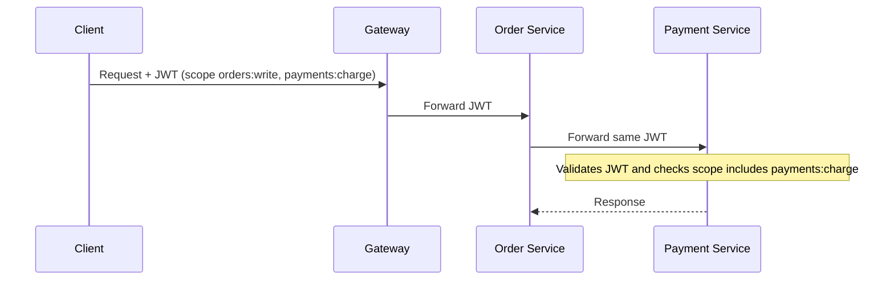

| Pros | Cons |
|------|------|
| Simple; no extra token infrastructure | Payment Service receives `orders:write` scope it doesn't need |
| No additional latency | If token is stolen at any service, full permissions are exposed |

#### Pattern 2: Token Exchange (RFC 8693)

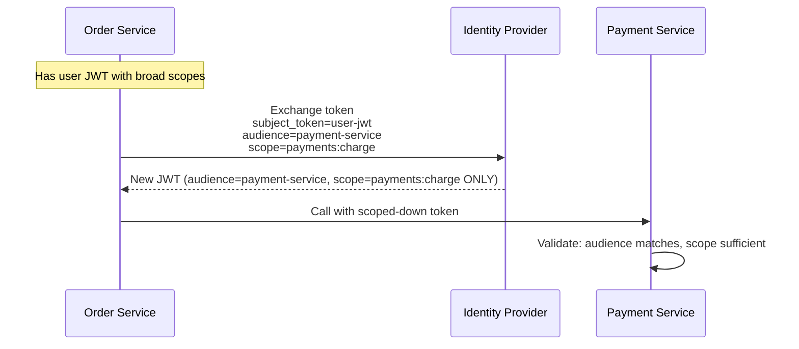

| Pros | Cons |
|------|------|
| Least privilege — each service gets only what it needs | Extra round-trip to IdP per hop (cacheable) |
| Stolen token has limited blast radius | More complex; IdP must support RFC 8693 |

#### Pattern 3: Gateway-Issued Internal Token

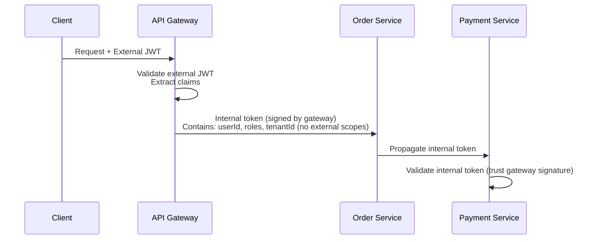

| Pros | Cons |
|------|------|
| External token never reaches internal services | Gateway signing key must be protected; becomes a trust root |
| Internal format is controlled — can be optimized | Gateway is now a security-critical component |

### Token Strategy Comparison

| Criterion | Propagate Original | Token Exchange | Gateway Internal |
|-----------|-------------------|---------------|-----------------|
| **Least privilege** | No — full scope everywhere | Yes — scoped per hop | Partial — uniform internal claims |
| **Latency** | None | +1 call per hop | None (gateway enriches) |
| **Complexity** | Lowest | Highest | Medium |
| **Blast radius** | Full token scope | Per-service scope | Internal token scope |
| **Best for** | Simple systems, low trust requirements | High-security, compliance | Enterprise gateways |

---

## 6. Service-to-Service Security

### Network Policies (Kubernetes)

```yaml
# Only allow Order Service to call Payment Service
apiVersion: networking.k8s.io/v1
kind: NetworkPolicy
metadata:
  name: payment-service-ingress
  namespace: payments
spec:
  podSelector:
    matchLabels:
      app: payment-service
  policyTypes:
    - Ingress
  ingress:
    - from:
        - namespaceSelector:
            matchLabels:
              name: orders
          podSelector:
            matchLabels:
              app: order-service
      ports:
        - protocol: TCP
          port: 8080
```

### Service-to-Service Auth Options

| Approach | Identity | Encryption | Complexity |
|----------|---------|------------|-----------|
| **mTLS (Service Mesh)** | Cryptographic certificate (SPIFFE) | Automatic (all traffic) | Medium (mesh setup) |
| **API Keys / Shared Secrets** | Pre-shared secret per service pair | Must add TLS separately | Low (but secret rotation is hard) |
| **OAuth2 Client Credentials** | Service gets its own token from IdP | Application-level | Medium |
| **Network Policies (K8s)** | IP/namespace-based (no crypto identity) | None (network-level isolation only) | Low |

**Recommendation:** mTLS via service mesh (Istio/Linkerd) for Kubernetes environments. For non-mesh environments, OAuth2 Client Credentials flow.

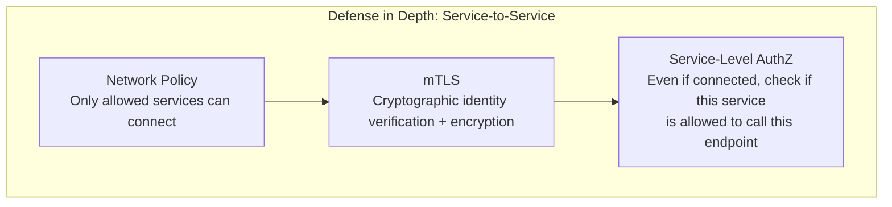

---

## 7. Multi-Tenancy Security

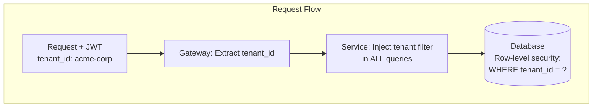

| Strategy | Isolation Level | Cost | Complexity |
|----------|----------------|------|-----------|
| **Shared DB, tenant column** | Low — application-enforced row isolation | Low | Low (but high risk of leaks if filter missed) |
| **Schema-per-tenant** | Medium — schema-level isolation | Medium | Medium |
| **Database-per-tenant** | High — full isolation | High | High (operational overhead) |
| **Cluster-per-tenant** | Highest — infrastructure isolation | Very High | Very High |

### Tenant Isolation Enforcement

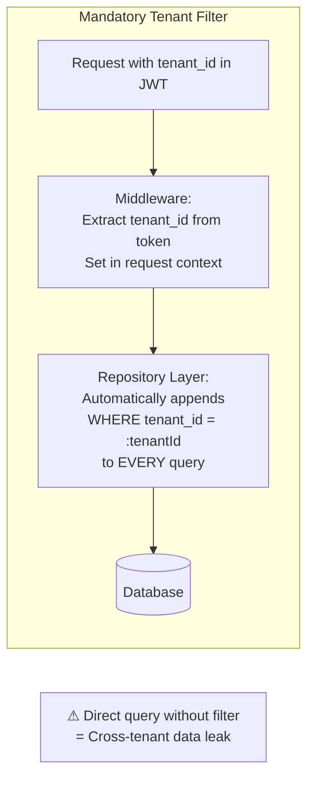

**Critical rule:** Never rely on individual developers to add `WHERE tenant_id = ?` to every query. Enforce it at the **framework/repository layer** automatically.

---

## 8. Secrets Management

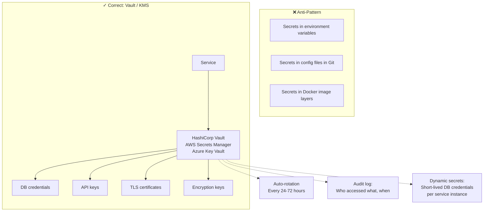

| Feature | Env Vars | Vault / KMS |
|---------|----------|-------------|
| **Rotation** | Manual redeploy | Automatic, zero-downtime |
| **Audit** | None | Full access log |
| **Blast radius** | All secrets in one env dump | Per-service access policies |
| **Dynamic secrets** | No | Yes — unique DB credentials per pod, auto-expired |
| **Encryption** | In the container's memory | Encrypted at rest, decrypted on access |

---

## 9. Input Validation and API Security

| Attack | Protection | Implementation Layer |
|--------|-----------|---------------------|
| **SQL Injection** | Parameterized queries; ORM | Service code — never concatenate SQL |
| **XSS** | Output encoding; CSP headers | Gateway + service response |
| **SSRF** | Allowlist outbound URLs; deny internal IPs | Service + network policy |
| **Mass Assignment** | DTOs with explicit fields; deny unknown fields | Service request binding |
| **Broken Object Level Auth (BOLA)** | Verify `resource.ownerId == user.id` on every request | Service authorization layer |
| **Rate Limiting** | Per-client, per-endpoint limits | API Gateway |
| **Oversized Payloads** | Request size limits | Gateway + service |
| **JWT Confusion** | Validate `alg`, `iss`, `aud`, `typ` strictly | Service auth middleware |

### BOLA — The #1 API Vulnerability (OWASP API Top 10)

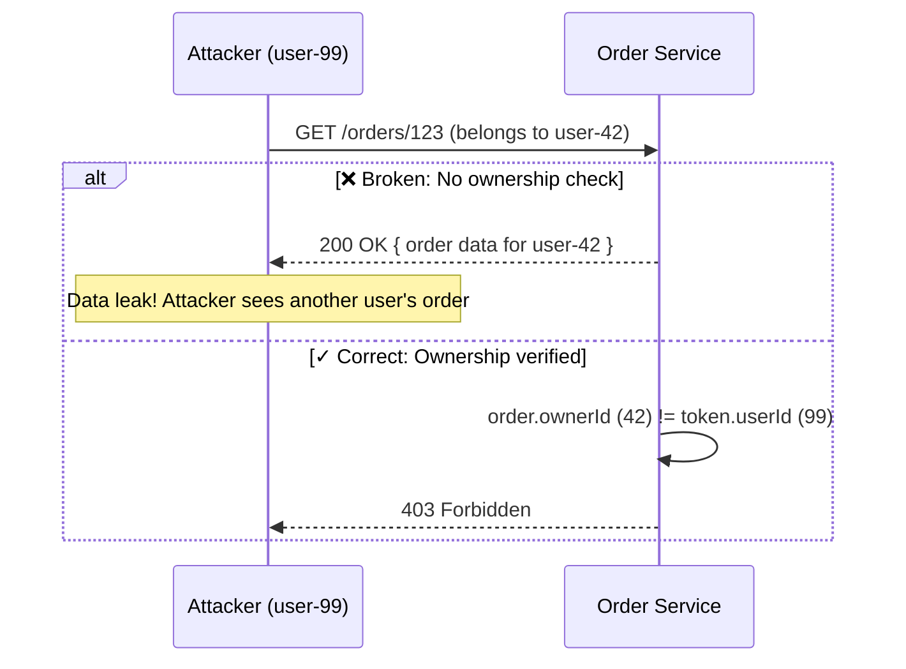

**Every endpoint that returns a resource must verify the requesting user has access to that specific resource.** Role-based checks alone are not sufficient.

---

## 10. Security Observability

| Signal | What to Monitor | Alert When |
|--------|----------------|-----------|
| **Authentication failures** | Failed login rate per IP/user | Spike > 10× baseline (brute force) |
| **Authorization denials** | 403 responses per user/service | Spike in denials for a single user (probing) |
| **Token anomalies** | Expired tokens, invalid signatures | Spike (credential theft or misconfiguration) |
| **Unusual traffic patterns** | Cross-service call graph deviations | Service A calling Service C for the first time (lateral movement?) |
| **Secrets access** | Vault access logs | Out-of-hours access; new service accessing a secret it never used before |
| **Privileged operations** | Admin API calls, config changes | Any privileged operation → audit log + alert |
| **Data exfiltration** | Unusually large responses, bulk data queries | Response size > threshold per endpoint |

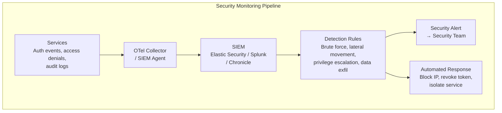

---

## 11. Full Security Architecture

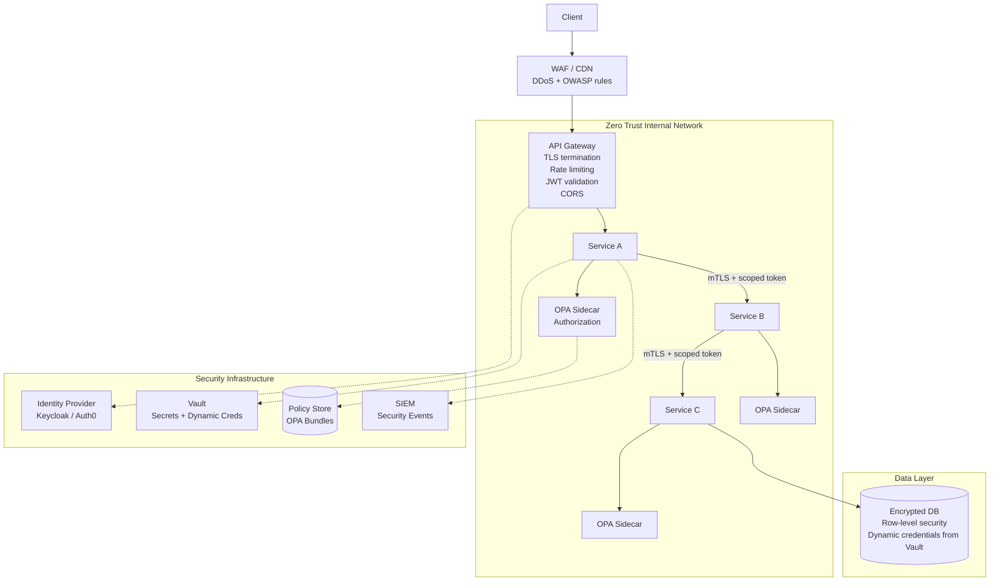

---

## 12. Comparison: Overall Strategy by Environment

| Criterion | Startup (< 10 services) | Growth (10-50 services) | Enterprise (50+ services) |
|-----------|------------------------|------------------------|--------------------------|
| **Authentication** | JWT at gateway | JWT at gateway + per-service validation | Per-service validation + token exchange |
| **Authorization** | Embedded RBAC | OPA sidecar | OPA + Zanzibar for resource-level |
| **Service-to-service** | API keys + TLS | mTLS via service mesh | mTLS + SPIFFE + network policies |
| **Secrets** | Environment variables (encrypted) | Vault with static secrets | Vault with dynamic secrets + auto-rotation |
| **Multi-tenancy** | Tenant column + app filter | Tenant column + framework enforcement | Schema or DB per tenant |
| **Monitoring** | Application logs | Centralized audit logs | SIEM + automated response |

---

## 13. Anti-Patterns

| Anti-Pattern | Consequence |
|--------------|------------|
| **Trusting the internal network** | One compromised service accesses everything — lateral movement unblocked |
| **Long-lived tokens (hours/days)** | Stolen token is valid for extended period — massive blast radius |
| **Shared service account for all services** | No per-service identity; can't audit or restrict; if leaked, everything is compromised |
| **Authorization in the API gateway only** | Gateway bypass (direct call, misconfigured service) = no authorization |
| **Hardcoded secrets in code/config** | Secrets in Git history forever; no rotation; no audit |
| **Role-only authorization (no resource check)** | BOLA — user with `customer` role reads ANY customer's data |
| **No tenant isolation in queries** | One missing `WHERE tenant_id = ?` = cross-tenant data leak |
| **Logging JWTs or passwords** | Credentials in logs = credential theft via log access |
| **No token audience validation** | Token meant for Service A accepted by Service B |
| **Security as an afterthought** | Retrofitting auth across 50 services is 10× harder than building it in from the start |

---

## 14. Practical Checklist

```
Authentication:
[ ] OAuth2/OIDC with a dedicated Identity Provider (Keycloak, Auth0, Azure AD)
[ ] Short-lived access tokens (5-15 min) + refresh tokens
[ ] JWT validation: verify signature, expiry, issuer, AND audience
[ ] Token audience (`aud`) scoped per service or service group
[ ] JWKS endpoint cached with background refresh

Authorization:
[ ] Authorization checks at EVERY service (not just the gateway)
[ ] Resource-level authorization (BOLA prevention) — not just role checks
[ ] Policy engine (OPA/Cedar) for complex rules — decouple policy from code
[ ] Least privilege: services only have access to what they need
[ ] Admin operations require separate elevated token/approval

Service-to-Service:
[ ] mTLS for all internal communication (service mesh or manual cert management)
[ ] Network policies restricting which services can communicate
[ ] Service identity (SPIFFE or service accounts) — no shared credentials
[ ] No internal service accessible from outside the cluster

Secrets:
[ ] All secrets in Vault / KMS — never in environment variables or Git
[ ] Auto-rotation for all credentials (DB passwords, API keys, certificates)
[ ] Dynamic secrets where possible (per-pod DB credentials)
[ ] Audit trail for all secret access

Data Protection:
[ ] TLS 1.3 for all traffic (external and internal)
[ ] Encryption at rest for all databases and object stores
[ ] PII masking in logs — never log tokens, passwords, or PII
[ ] Multi-tenant isolation enforced at repository/framework layer

Input Validation:
[ ] Parameterized queries (no SQL concatenation)
[ ] Request schema validation at gateway and service level
[ ] Payload size limits enforced
[ ] SSRF protection: outbound URL allowlisting

Monitoring:
[ ] Audit log for all authentication and authorization events
[ ] Alert on brute force (auth failure spikes)
[ ] Alert on authorization denial spikes (probing detection)
[ ] SIEM integration for security event correlation
[ ] Regular dependency vulnerability scanning (Trivy/Snyk)
```

---

## 15. Next Steps

1. **What's your Identity Provider?** — Keycloak, Auth0, Azure AD, Okta? Determines token format and exchange capabilities.
2. **Are you on Kubernetes?** — mTLS via service mesh and network policies become straightforward.
3. **Multi-tenant?** — Drives tenant isolation strategy and token claim design.
4. **Compliance requirements?** — GDPR, HIPAA, PCI-DSS, SOC2 each add specific security mandates.
5. **Current authorization model?** — Simple roles? Complex resource-level permissions? Hierarchical?
6. **How many external-facing APIs?** — Determines WAF and rate-limiting investment.
