# How do you data integration and data migration in a Microservices architecture?

Data integration and data migration are two distinct but interrelated challenges in microservices:

> **Data integration:** How do services that own separate databases share and combine data in ongoing operation?  
> **Data migration:** How do you move data when splitting a monolith, decomposing a service, or changing a service's data store?

Both are hard because the core microservices rule — **each service owns its data** — means there is no central database to query or migrate in one transaction. Every data movement crosses a service boundary.

---

## 1. Data Integration vs Data Migration

| Aspect | Data Integration | Data Migration |
|--------|-----------------|---------------|
| **When** | Ongoing, during normal operation | One-time (or phased) during system evolution |
| **Goal** | Services access data they don't own | Move data from old system to new system/structure |
| **Duration** | Permanent architectural pattern | Temporary project with start and end |
| **Risk** | Stale reads, eventual consistency | Data loss, inconsistency during cutover, downtime |
| **Examples** | Order Service needs product names; Analytics needs data from all services | Monolith → microservices; splitting one service into two; Postgres → DynamoDB |

---

## Part I: Data Integration

## 2. The Integration Problem

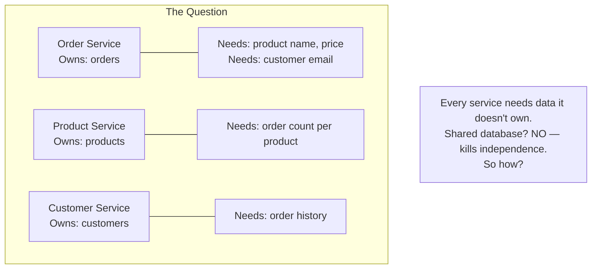

---

## 3. Integration Patterns

### Pattern 1: API Composition (Synchronous Query)

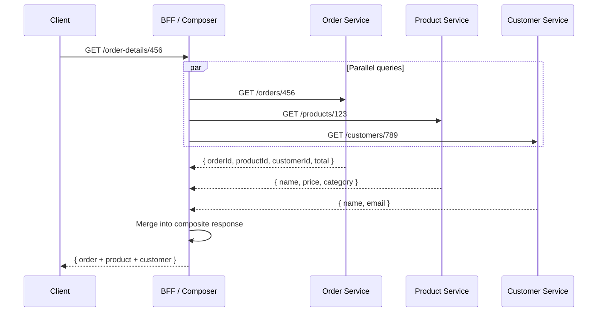

| Criterion | Assessment |
|-----------|-----------|
| **Freshness** | Real-time — always queries the source of truth |
| **Coupling** | High — runtime dependency on all participating services |
| **Latency** | Sum of slowest parallel call + merge overhead |
| **Availability** | Reduced — any service down = partial or total failure |
| **Best for** | Low-frequency queries; data that must be absolutely fresh; simple aggregations |

### Pattern 2: Event-Carried State Transfer (Async Replication)

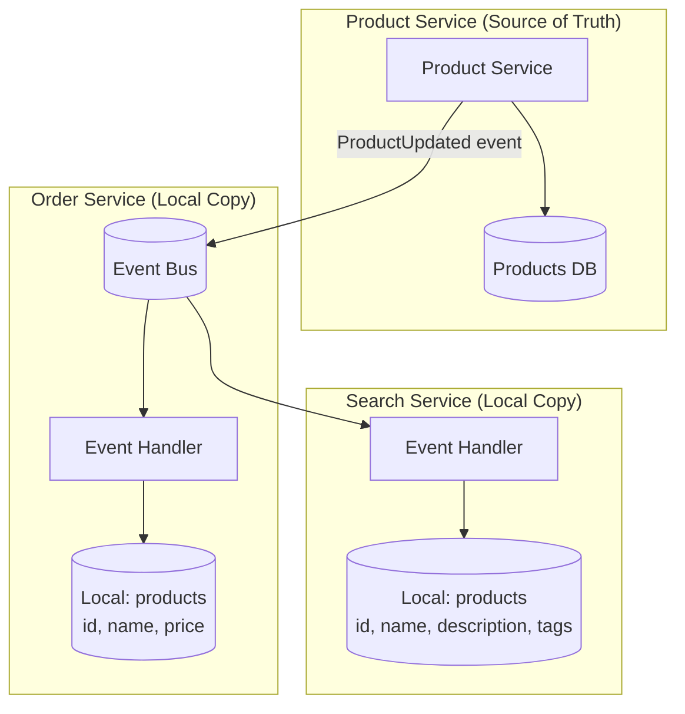

Each consumer keeps **only the fields it needs** — not a full replica.

| Criterion | Assessment |
|-----------|-----------|
| **Freshness** | Eventual (ms to seconds lag) |
| **Coupling** | None at runtime — each service is self-sufficient |
| **Availability** | High — local data survives source outage |
| **Trade-off** | Data duplication; staleness; event schema evolution |
| **Best for** | Reference data (products, users, catalogs); high-read-volume paths |

### Pattern 3: Change Data Capture (CDC)

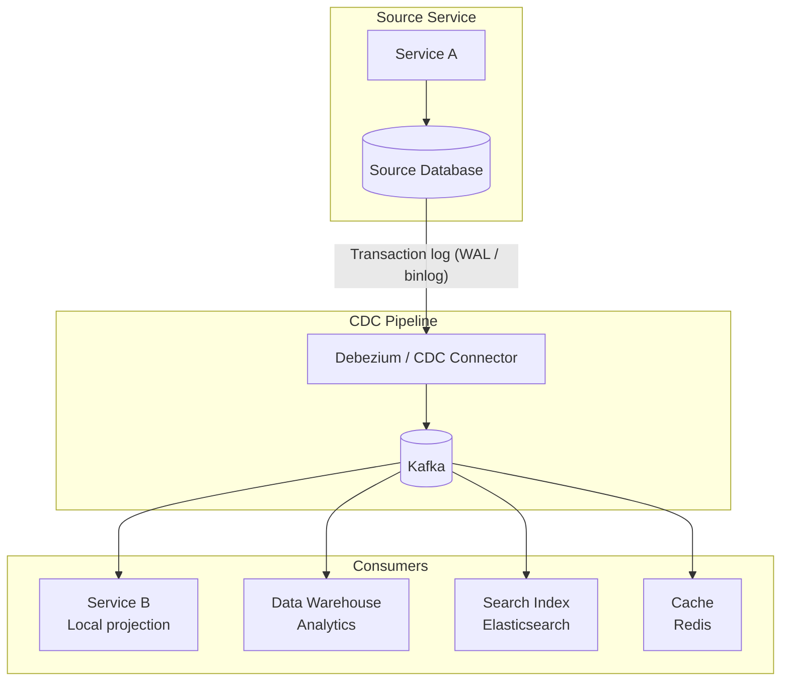

| Criterion | Assessment |
|-----------|-----------|
| **Source impact** | Zero — reads the transaction log, not the application |
| **Consistency** | Captures every committed write — no dual-write risk |
| **Latency** | Near real-time (ms to low seconds) |
| **Schema** | Exposes the source DB schema — coupling risk if not transformed |
| **Best for** | Feeding data warehouses, search indexes, caches; legacy system integration |

### Pattern 4: Data Virtualization / Federation

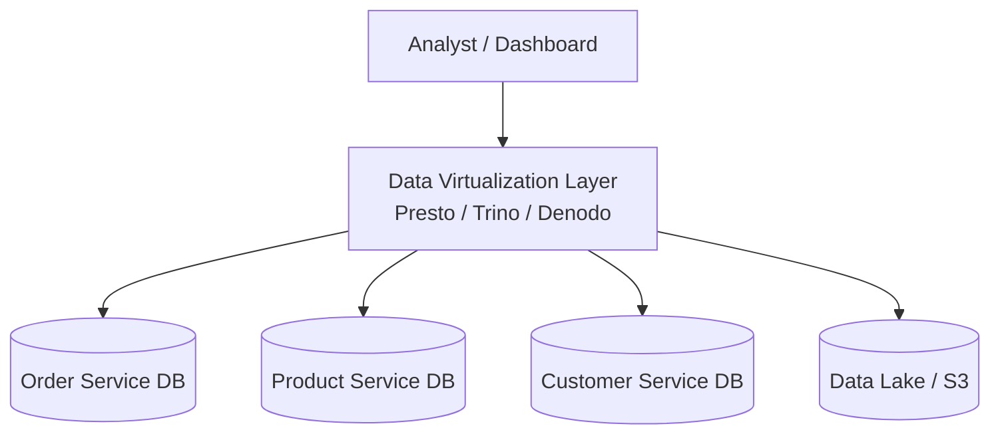

| Criterion | Assessment |
|-----------|-----------|
| **Freshness** | Real-time — queries source databases directly |
| **Coupling** | High — reads from production databases; can impact performance |
| **Use case** | Analytics, ad-hoc queries, reporting across service boundaries |
| **Risk** | Query load on production DBs; schema changes in services break queries |
| **Mitigation** | Query read replicas, not primary; use materialized views |
| **Best for** | Analytics and BI — not for service-to-service operational data |

### Pattern 5: Data Lake / Warehouse (Batch Integration)

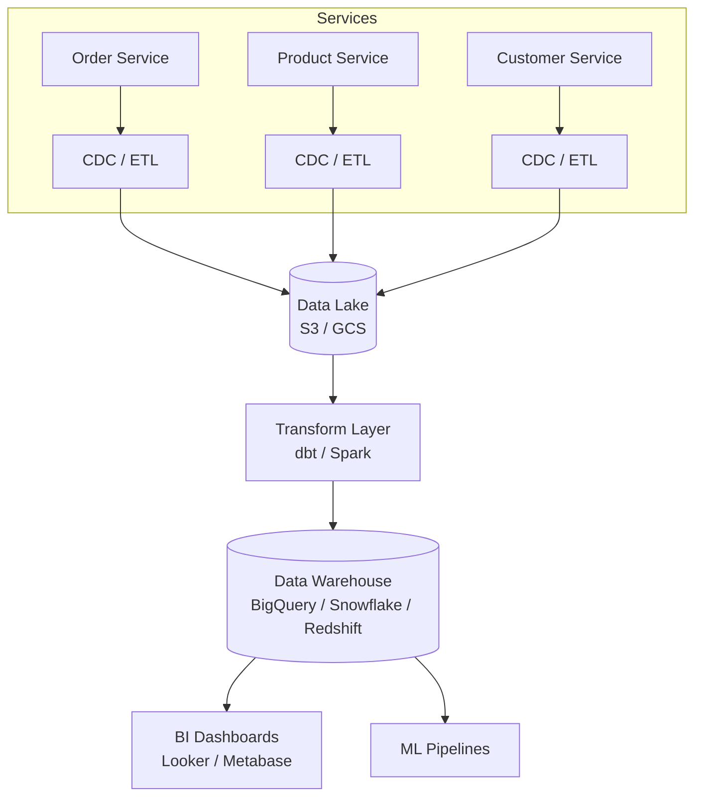

| Criterion | Assessment |
|-----------|-----------|
| **Freshness** | Minutes (streaming CDC) to hours (batch ETL) |
| **Coupling** | Low — services export to lake independently |
| **Query power** | Unlimited — cross-service joins, aggregations, historical analysis |
| **Operational cost** | Medium-High (lake + warehouse infrastructure) |
| **Best for** | Reporting, analytics, ML training, compliance audits |

---

## 4. Integration Pattern Comparison

| Criterion | API Composition | Event-Carried State | CDC | Data Virtualization | Data Lake / Warehouse |
|-----------|----------------|--------------------|----|---------------------|----------------------|
| **Freshness** | Real-time | Eventual (ms-sec) | Near real-time | Real-time | Minutes-hours |
| **Runtime coupling** | High | None | None | High (reads prod DB) | None |
| **Read latency** | High (fan-out) | Very low (local) | Very low (local) | Variable | Variable |
| **Write complexity** | None | Event handlers + projections | CDC connector setup | None | ETL pipeline |
| **Data duplication** | None | Yes (subset per consumer) | Yes | None | Yes (full copy) |
| **Cross-service joins** | Manual (in composer) | Pre-joined in projection | Consumer builds view | Native SQL joins | Native SQL joins |
| **Best for** | Live, low-frequency | High-read operational | Legacy integration, search | Analytics queries | BI, ML, compliance |

---

## 5. Integration Decision Matrix

| Scenario | Recommended Pattern | Why |
|----------|-------------------|-----|
| **Order page needs product name + customer name** | Event-Carried State Transfer | High read volume; staleness of seconds is acceptable |
| **Admin dashboard shows cross-service metrics** | Data Lake / CQRS Projection | Aggregation query; no real-time requirement |
| **Full-text search across products** | CDC → Elasticsearch | Search index needs denormalized data in near real-time |
| **Mobile app needs composite view** | API Composition (BFF) | Client needs fresh data; low frequency per user |
| **ML model training on order + product + user data** | Data Lake (S3 → Spark) | Batch processing; needs historical cross-service data |
| **Real-time fraud detection** | CDC → Stream Processing (Flink/Kafka Streams) | Needs every transaction in real-time with enrichment |
| **Monolith database needs to supply data to new services** | CDC (Debezium) | Non-invasive; no changes to monolith code |

---

## Part II: Data Migration

## 6. Migration Scenarios

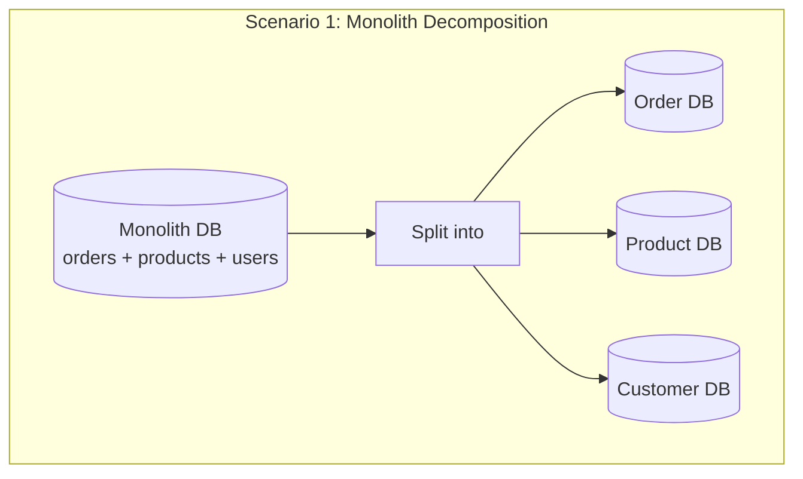

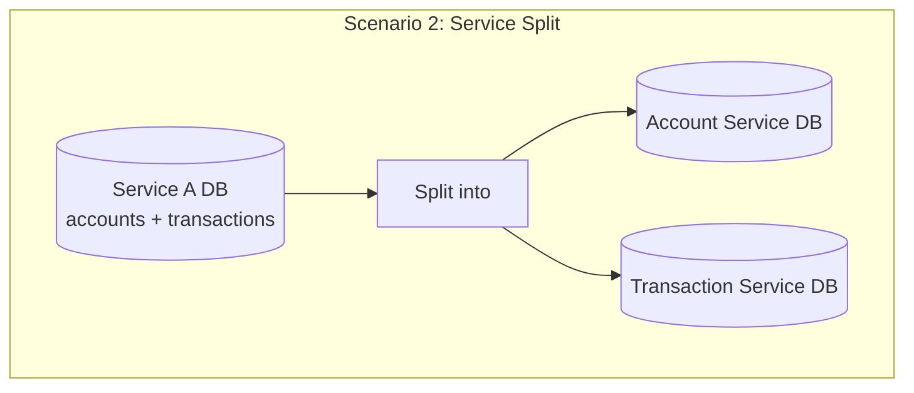

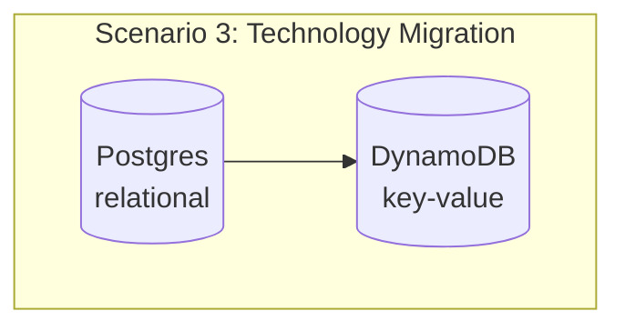

```mermaid
graph TB
    subgraph "Scenario 4: Schema Evolution"
        OLD_SCHEMA["v1: &#123; firstName, lastName &#125;"] --> NEW_SCHEMA["v2: &#123; fullName, nameComponents: &#123; first, last &#125; &#125;"]
    end
```

---

## 7. Migration Strategies

### Strategy A: Big Bang Migration

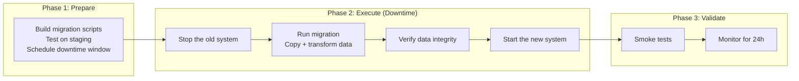

| Criterion | Assessment |
|-----------|-----------|
| **Downtime** | Required — minutes to hours depending on data volume |
| **Risk** | High — all-or-nothing; rollback requires restoring backup |
| **Complexity** | Low — straightforward script; no dual-running systems |
| **Data consistency** | Perfect — no dual-write period |
| **Best for** | Small datasets; off-hours migration acceptable; simple transformations |

### Strategy B: Strangler Fig (Incremental Migration)

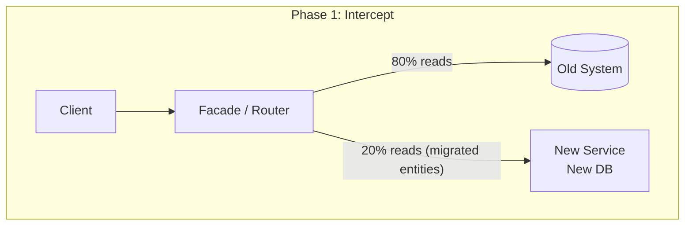

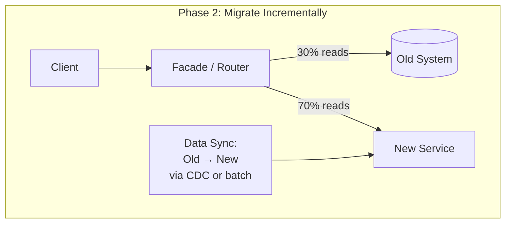

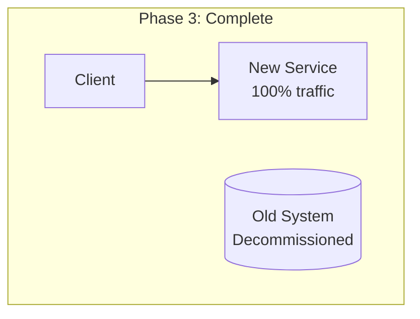

| Criterion | Assessment |
|-----------|-----------|
| **Downtime** | Zero — gradual traffic shift |
| **Risk** | Low — rollback is just routing back to the old system |
| **Complexity** | High — must keep old and new systems in sync during migration |
| **Duration** | Weeks to months depending on entity count |
| **Best for** | Monolith decomposition; large datasets; zero-downtime requirement |

### Strategy C: Parallel Run (Shadow Migration)

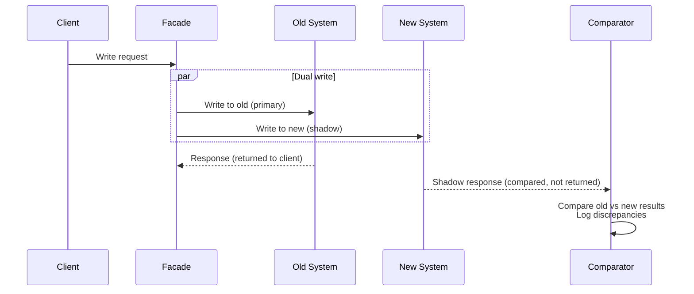

| Criterion | Assessment |
|-----------|-----------|
| **Downtime** | Zero |
| **Data validation** | Highest — every write is verified against both systems |
| **Risk** | Very low — old system remains primary until validation passes |
| **Complexity** | Very high — dual-write infrastructure; comparison logic; discrepancy resolution |
| **Cost** | High — running two systems simultaneously |
| **Best for** | High-stakes migrations (financial, regulatory); data integrity is paramount |

### Strategy D: CDC-Based Migration

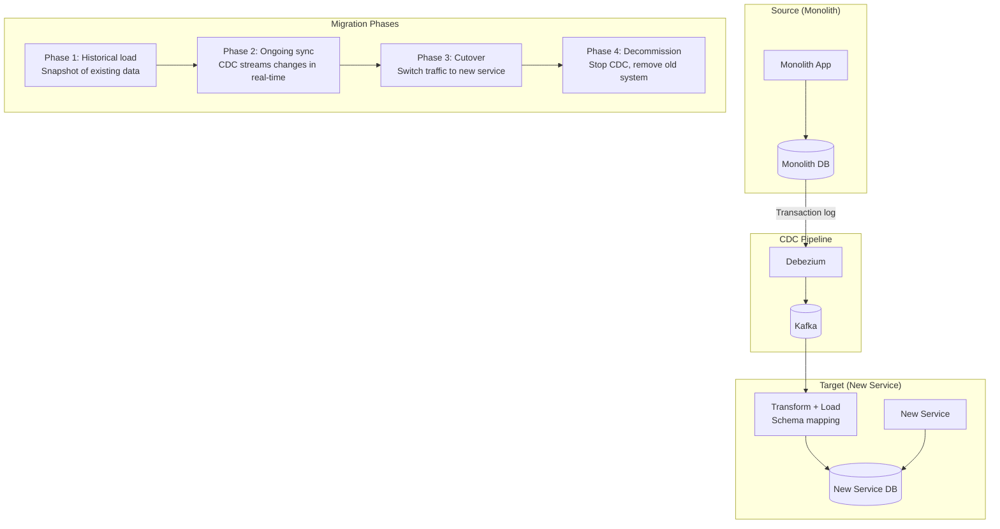

| Criterion | Assessment |
|-----------|-----------|
| **Downtime** | Zero — CDC keeps new system in sync continuously |
| **Source impact** | Minimal — reads transaction log, not the application |
| **Data lag** | Seconds — near real-time sync |
| **Cutover** | Instant — switch routing once new system is caught up and verified |
| **Rollback** | Switch back to old system; no data lost (old system still receiving writes if dual-write or reads lag is acceptable) |
| **Best for** | Large datasets; monolith decomposition; technology migration |

---

## 8. Migration Strategy Comparison

| Criterion | Big Bang | Strangler Fig | Parallel Run | CDC-Based |
|-----------|---------|---------------|-------------|-----------|
| **Downtime** | Yes (minutes-hours) | Zero | Zero | Zero |
| **Risk** | High | Low | Very Low | Low |
| **Complexity** | Low | Medium-High | Very High | Medium |
| **Duration** | Hours | Weeks-months | Weeks-months | Days-weeks |
| **Rollback** | Restore backup | Route back | Route back | Route back |
| **Data validation** | Post-migration verify | Gradual verification | Real-time comparison | Post-sync verification |
| **Best for** | Small data, off-hours OK | Monolith decomposition | Financial/regulated | Large datasets, tech migration |

---

## 9. Schema Migration Across Services

When splitting a monolith table into multiple service databases, you must **decompose the schema** and **transform the data**.

### Example: Splitting a Monolith `orders` Table

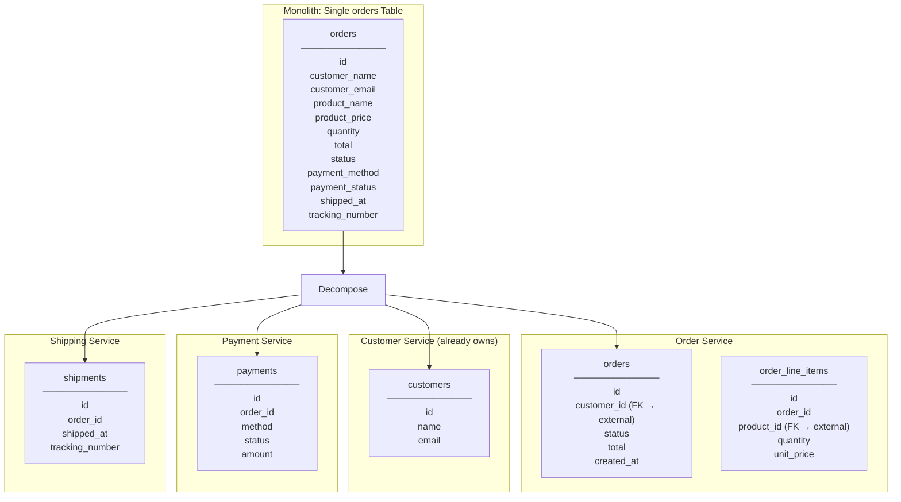

### The Transformation Pipeline

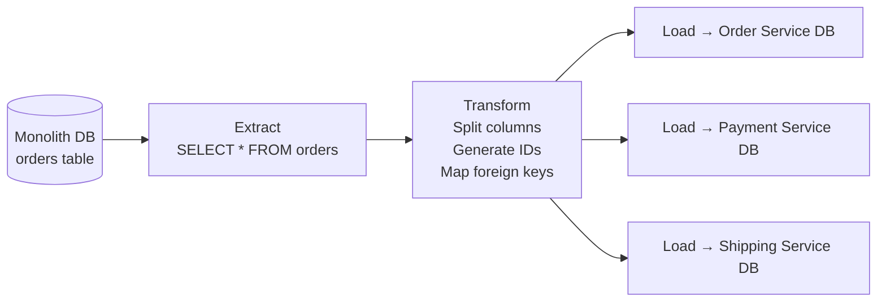

| Challenge | How to Handle |
|-----------|--------------|
| **Foreign keys become cross-service references** | Store the external ID (e.g., `customer_id`) but no DB-level FK constraint |
| **Denormalized columns** | `customer_name` in orders → becomes a reference; Order Service stores `customer_id`, fetches name via event or API |
| **Identity mapping** | Old monolith IDs → new service IDs; maintain a mapping table during migration |
| **Referential integrity** | No cross-service FK constraints; enforce in application logic + eventual consistency |

---

## 10. Data Validation During Migration

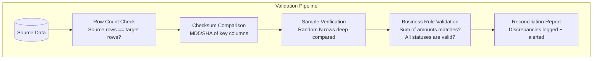

| Validation Type | What It Catches | When to Run |
|----------------|----------------|-------------|
| **Row count** | Missing or duplicate rows | After each batch / continuously for CDC |
| **Checksum** | Data corruption, truncation | After migration phase |
| **Sample deep compare** | Transformation bugs — wrong field mapping | After historical load |
| **Business invariants** | Sum of order totals, count of active users | After migration + daily reconciliation |
| **Referential integrity** | Orphaned references (order references non-existent customer) | After migration |
| **Idempotency check** | Same migration run twice doesn't duplicate data | During CDC replay |

---

## 11. Handling the Dual-Write Problem During Migration

During migration, both old and new systems may receive writes. This creates the **dual-write problem** — writes must land in both stores consistently.

### Option A: Write to Old, Sync to New (CDC)

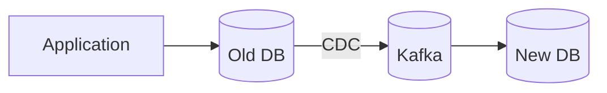

| Criterion | Assessment |
|-----------|-----------|
| **Consistency** | Strong — old DB is single source; new DB eventually consistent |
| **Risk** | Low — one write path; no divergence possible |
| **Cutover** | Wait for CDC lag = 0, then switch reads and writes to new system |

### Option B: Application-Level Dual Write

```mermaid
graph LR
    APP2[Application] --> OLD_DB2[(Old DB)]
    APP2 --> NEW_DB2[(New DB)]
```

| Criterion | Assessment |
|-----------|-----------|
| **Consistency** | Risky — if one write succeeds and the other fails, data diverges |
| **Mitigation** | Use Outbox pattern: write to old DB + outbox table atomically; relay to new DB |
| **When to use** | Only if CDC is not available for the source database |

### Option C: Feature-Flag Controlled Write Path

```mermaid
graph TD
    APP3[Application] --> FLAG{Feature Flag:<br/>use-new-db}
    FLAG -- "OFF (migration phase)" --> OLD_DB3[(Old DB)]
    FLAG -- "ON (post-cutover)" --> NEW_DB3[(New DB)]

    OLD_DB3 -- "CDC (background sync)" --> NEW_DB3
```

| Phase | Flag State | Writes To | Reads From |
|-------|-----------|-----------|-----------|
| **Pre-migration** | OFF | Old only | Old |
| **Migration (sync)** | OFF | Old only | Old (new syncing via CDC) |
| **Shadow reads** | OFF | Old only | Both (compare results) |
| **Cutover** | ON | New only | New |
| **Post-cutover** | ON | New only | New (old decommissioned) |

---

## 12. Migration from Monolith to Microservices: Step-by-Step

```mermaid
graph TB
    subgraph "Step 1: Identify Bounded Contexts"
        BC[Domain analysis → identify seams in the monolith DB]
    end

    subgraph "Step 2: Add API Facade"
        FACADE_M[Facade routes all traffic<br/>100% to monolith initially]
    end

    subgraph "Step 3: Extract First Service"
        EXT1[Extract lowest-risk bounded context<br/>Start with read-only or least-coupled domain]
    end

    subgraph "Step 4: Sync Data (CDC)"
        SYNC_M[CDC from monolith DB → new service DB<br/>New service reads from own DB]
    end

    subgraph "Step 5: Switch Reads"
        READ[Facade routes reads to new service<br/>Writes still go to monolith]
    end

    subgraph "Step 6: Switch Writes"
        WRITE["Facade routes writes to new service<br/>Reverse CDC: new service → monolith<br/>(for other monolith features still using the data)"]
    end

    subgraph "Step 7: Clean Up"
        CLEAN[Remove data from monolith DB<br/>Remove reverse sync<br/>Decommission monolith feature code]
    end

    BC --> FACADE_M --> EXT1 --> SYNC_M --> READ --> WRITE --> CLEAN
```

### Extraction Order Heuristic

| Extract First (Low Risk) | Extract Last (High Risk) |
|--------------------------|-------------------------|
| Read-heavy services (catalog, search) | Core transaction services (orders, payments) |
| Few dependencies on other domains | Highly coupled to many tables |
| Clear bounded context boundary | Shared tables with unclear ownership |
| New features (no legacy baggage) | Entangled business logic |

---

## 13. Data Migration Tooling

| Tool | Type | Strength |
|------|------|----------|
| **Debezium** | CDC (transaction log capture) | PostgreSQL, MySQL, MongoDB, SQL Server; Kafka-native |
| **AWS DMS** | Managed CDC + batch migration | Source/target agnostic; managed service |
| **Flyway / Liquibase** | Schema migration (within a service) | Version-controlled DDL; rollback support |
| **dbt** | Transform layer (ELT) | SQL-based transformations in the warehouse |
| **Apache Spark / Flink** | Large-scale data processing | Complex transformations; streaming + batch |
| **pgloader / mysqlpump** | Bulk data load | Fast for same-DB-type migrations |
| **Custom scripts** | Application-level migration | When transformations require business logic |

---

## 14. Anti-Patterns

| Anti-Pattern | Consequence |
|--------------|------------|
| **Shared database between services** | Hidden coupling; schema change in one service breaks another; no independent deployment |
| **Synchronous API calls for data integration** | N+1 problem at network level; runtime coupling; cascading failures |
| **Big-bang migration without rollback plan** | If anything goes wrong, you're restoring from backup in a panic |
| **Application-level dual write without outbox** | One write fails → data diverges silently → business inconsistency |
| **Migrating all services simultaneously** | Risk multiplied; debug surface area explodes; no isolation of problems |
| **No data validation after migration** | Missing rows, corrupted transforms discovered weeks later by users |
| **Ignoring CDC lag during cutover** | Cutover while new system is behind → queries return stale or missing data |
| **Direct DB-to-DB replication for integration** | Couples services at the schema level; source schema changes break consumers |
| **No identity mapping during decomposition** | Old IDs and new IDs don't align; cross-references break |
| **ETL as the primary integration pattern** | Batch lag too high for operational data; only suitable for analytics |

---

## 15. Recommendation Summary

### For Data Integration (Ongoing)

| Scenario | Pattern |
|----------|---------|
| **Service needs another service's reference data for reads** | Event-Carried State Transfer (local projection) |
| **BFF needs to aggregate data for UI** | API Composition (parallel calls with fallbacks) |
| **Search/analytics needs cross-service data** | CDC → Elasticsearch / Data Warehouse |
| **Real-time stream processing** | CDC → Kafka Streams / Flink |
| **Ad-hoc analytical queries** | Data Lake / Warehouse (batch or streaming ingestion) |

### For Data Migration (One-time)

| Scenario | Strategy |
|----------|---------|
| **Small dataset, downtime OK** | Big Bang (scripted migration + verification) |
| **Monolith → microservices decomposition** | Strangler Fig + CDC-based sync |
| **Large dataset, zero downtime required** | CDC-based migration (Debezium → Kafka → new service) |
| **Financial/regulated data** | Parallel Run (dual-write + compare) + CDC |
| **Technology change (Postgres → DynamoDB)** | CDC-based migration with transformation layer |

---

## 16. Practical Checklist

```
Data Integration:
[ ] Each service owns its database — NO shared schemas
[ ] Reference data replicated via events (Event-Carried State Transfer)
[ ] Consumers store only the fields they need, not full copies
[ ] Event schemas versioned with backward compatibility (Schema Registry)
[ ] CDC (Debezium) feeding search indexes / data warehouse — not direct DB queries
[ ] API Composition only for low-frequency, must-be-fresh queries
[ ] Idempotent event consumers — handle replays safely
[ ] Consumer lag monitored — stale projections are a silent bug

Data Migration:
[ ] Migration strategy chosen based on risk, data volume, and downtime tolerance
[ ] Rollback plan documented and tested before starting
[ ] Data validation pipeline: row counts, checksums, business invariants
[ ] Identity mapping table maintained during monolith decomposition
[ ] CDC preferred over application-level dual write
[ ] Feature flags control read/write path during cutover
[ ] Historical data loaded first, then CDC catches up real-time changes
[ ] Shadow read period validates new system before full cutover
[ ] Reconciliation runs daily during migration period
[ ] Post-migration: decommission old data store, remove sync, update service catalog
```

---

## 17. Next Steps

1. **What's the migration scenario?** — Monolith decomposition? Service split? Technology change?
2. **Data volume?** — GB or TB? Small can use batch; large needs CDC streaming.
3. **Downtime tolerance?** — Zero downtime changes the strategy completely.
4. **Current database technology?** — Determines CDC connector availability (Debezium supports Postgres, MySQL, MongoDB, SQL Server, Oracle).
5. **Do you have Kafka already?** — CDC pipelines are much simpler with an existing Kafka infrastructure.
6. **Regulatory constraints?** — PII handling, data residency, audit requirements affect the migration approach.
