# How to handle service composition and orchestration in a Microservices architecture?

Most business operations in microservices span **multiple services** — placing an order involves Order, Payment, Inventory, and Notification services. The architectural question is: **who coordinates the work?**

This is where two fundamentally different philosophies collide:

> **Orchestration:** A central coordinator tells each service what to do and when.  
> **Choreography:** Each service listens to events and decides independently what to do next.

Neither is universally better. The choice depends on the complexity of the workflow, failure handling needs, and how much visibility you need into the process.

---

## 1. The Composition Problem

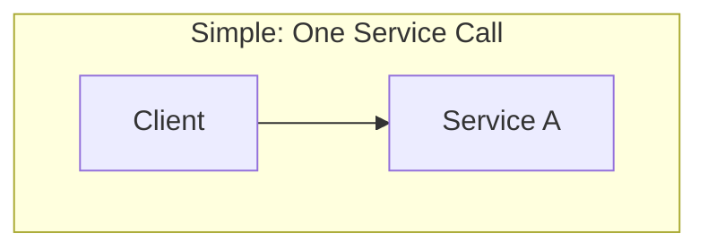

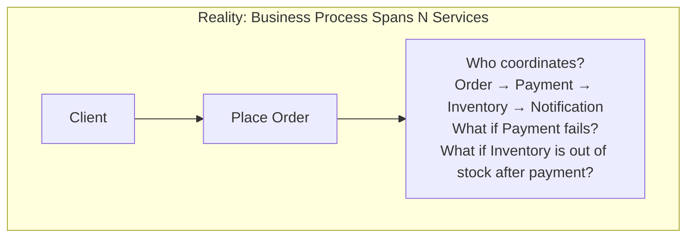

| Challenge | Why It's Hard |
|-----------|--------------|
| **Coordination** | Multiple services must execute in a specific order or in parallel |
| **Partial failure** | Step 3 of 5 fails — what happens to steps 1 and 2? |
| **Compensation** | "Undo" in distributed systems isn't rollback — it's a new forward action |
| **Visibility** | Where is this order in the process? Which step is it stuck on? |
| **Timeout** | What if a service is slow, not down? Wait forever? Retry? Skip? |
| **Concurrency** | Two simultaneous requests modify the same order — who wins? |

---

## 2. The Two Paradigms

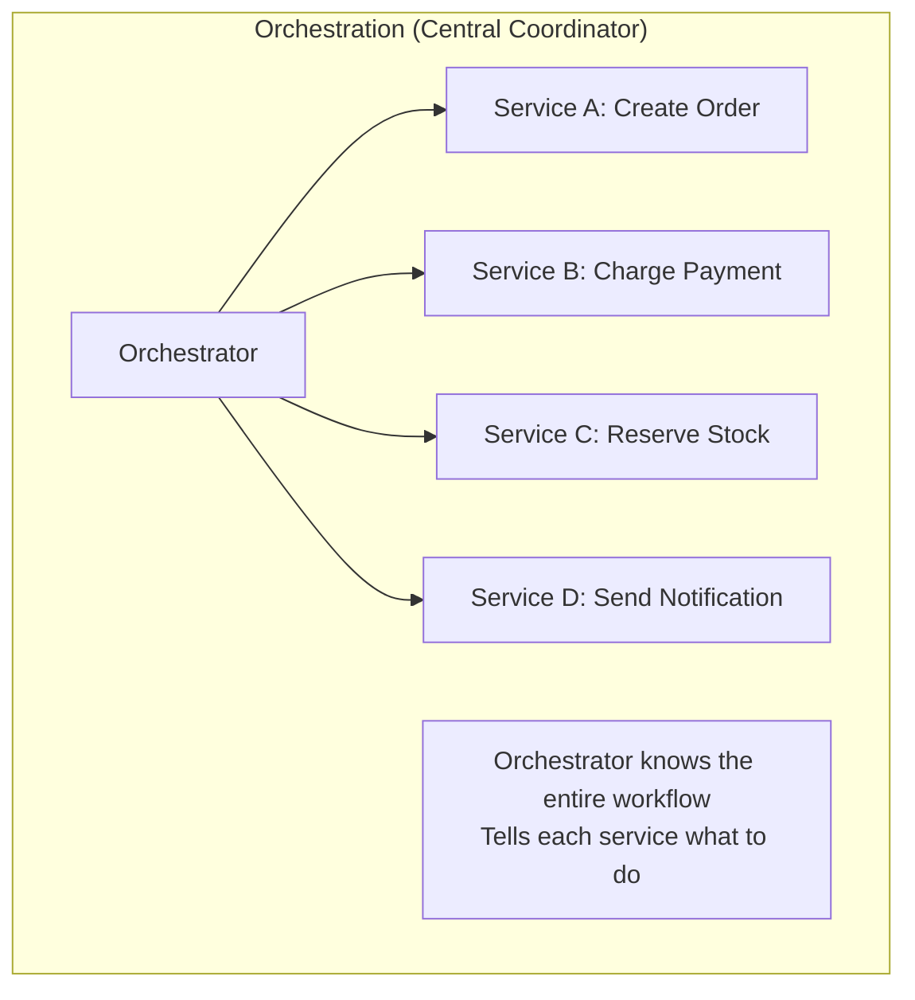

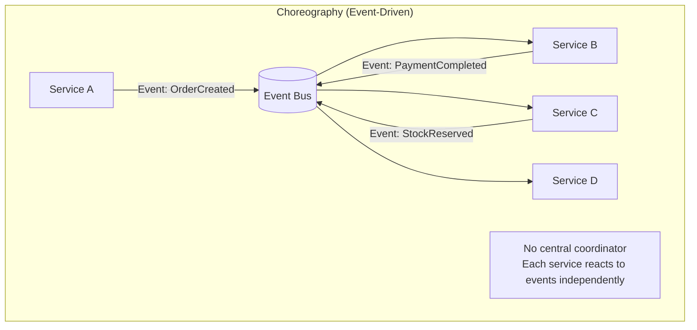

---

## 3. Choreography (Event-Driven Composition)

### How It Works

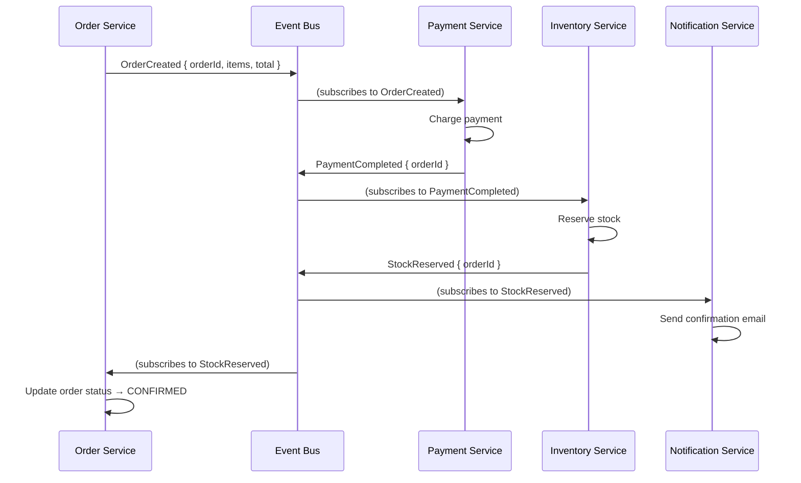

### Failure Handling in Choreography

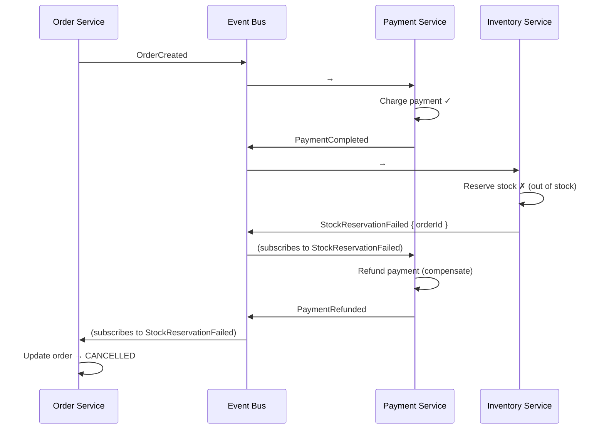

Each service knows **its own compensation** — refund if stock fails, cancel order if payment fails.

| Criterion | Assessment |
|-----------|-----------|
| **Coupling** | Very low — services know events, not each other |
| **Scalability** | Excellent — no bottleneck coordinator |
| **Visibility** | Poor — no single place shows the workflow state; must reconstruct from events |
| **Failure handling** | Distributed — each service implements its own compensation; hard to ensure completeness |
| **Adding steps** | Easy — new service subscribes to existing events; no existing code changes |
| **Debugging** | Hard — follow events across services; need distributed tracing |
| **Best for** | Simple flows (< 5 steps); loosely coupled domains; notification-style side effects |

---

## 4. Orchestration (Central Coordinator)

### How It Works

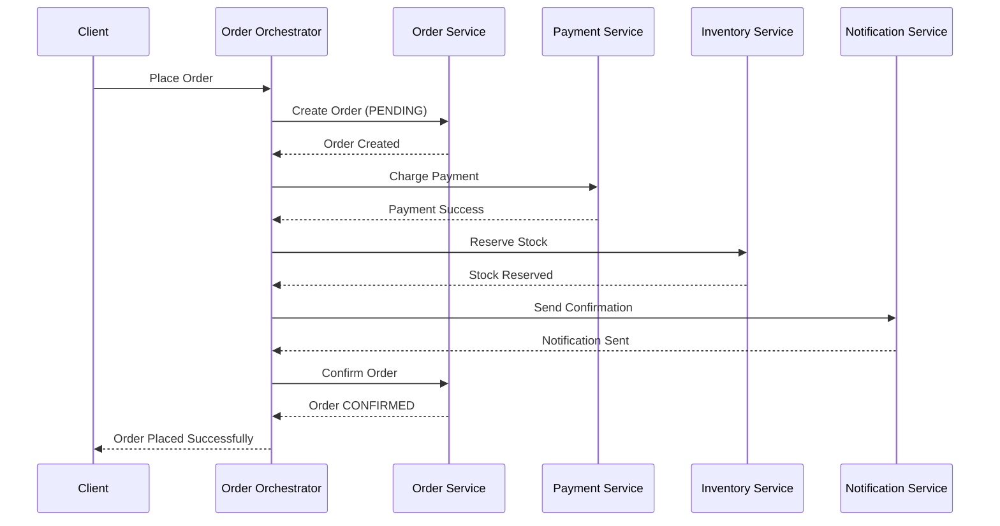

### Failure Handling in Orchestration

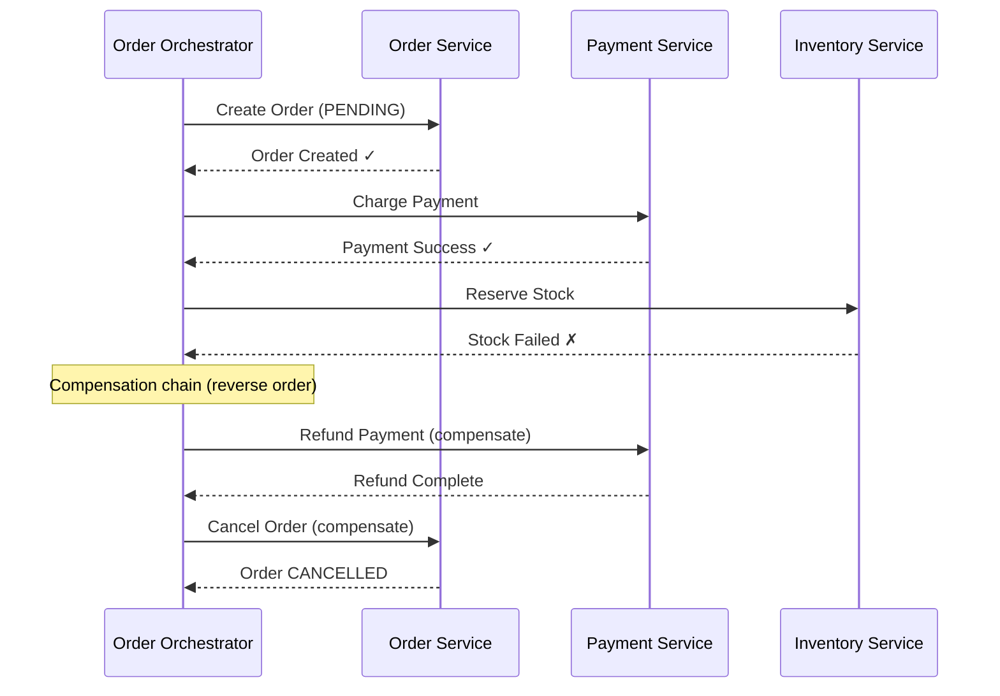

The orchestrator owns the **full compensation chain** — it knows exactly which steps completed and what to undo.

### State Machine

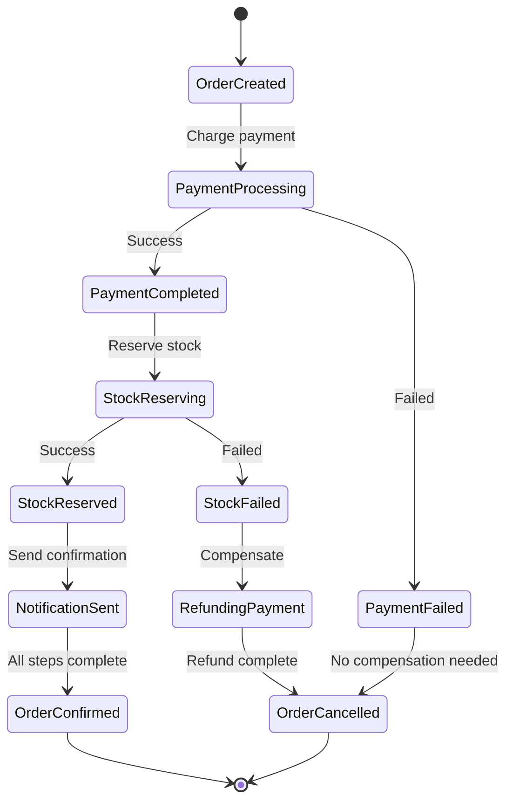

| Criterion | Assessment |
|-----------|-----------|
| **Coupling** | Medium — orchestrator knows all participants and the workflow |
| **Scalability** | Good — orchestrator can become a bottleneck under extreme load (mitigated by partitioning) |
| **Visibility** | Excellent — saga state is inspectable in one place; "where is my order?" is one query |
| **Failure handling** | Centralized — orchestrator defines the full compensation chain; easier to reason about |
| **Adding steps** | Requires modifying the orchestrator; slightly more coupling |
| **Debugging** | Good — state machine shows exactly where things are; single log stream for the saga |
| **Best for** | Complex flows (5+ steps); flows with conditional branching; strict ordering requirements |

---

## 5. Comparison

| Criterion | Choreography | Orchestration |
|-----------|-------------|---------------|
| **Coupling** | Very low (event-only) | Medium (orchestrator knows participants) |
| **Visibility** | Low (reconstruct from events) | High (saga state machine) |
| **Failure handling** | Distributed (each service compensates) | Centralized (orchestrator compensates) |
| **Complexity source** | Hidden in event flows | Visible in orchestrator code |
| **Adding services** | Easy (subscribe to events) | Moderate (modify orchestrator) |
| **Testing** | Hard (require full event flow) | Easier (test state machine transitions) |
| **Debugging** | Hard (events across N services) | Easier (single saga state) |
| **Scalability** | Excellent (no coordinator) | Good (orchestrator partitionable) |
| **Process observability** | Weak | Strong |
| **Long-running processes** | Hard (who tracks timeout?) | Natural (orchestrator manages timers) |

---

## 6. Hybrid: Orchestration Within, Choreography Between

This is the **recommended default** for most systems — use orchestration for complex bounded-context workflows and choreography for cross-context integration.

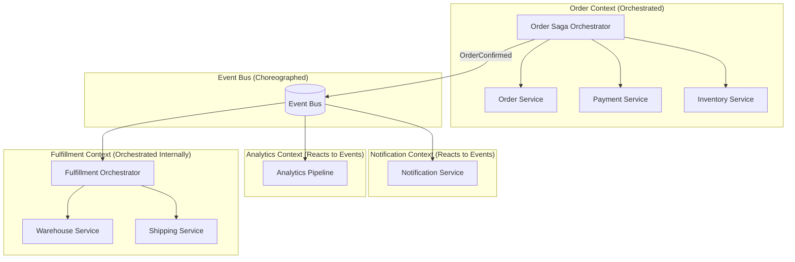

| Boundary | Pattern | Why |
|----------|---------|-----|
| **Within a bounded context** (order placement) | Orchestration | Complex workflow; needs strict ordering; compensation chain; visibility |
| **Between bounded contexts** (order → notification, analytics, fulfillment) | Choreography | Independent domains; fire-and-forget; low coupling |
| **Side effects** (email, logging, analytics) | Choreography | Producer doesn't care if or when consumer acts |

---

## 7. Orchestration Implementation Patterns

### Pattern A: Code-Based Orchestrator (Saga in Service Code)

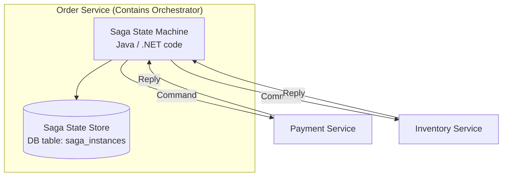

Implementation: Saga state machine runs inside the Order Service, persisting state transitions to a local table.

| Criterion | Assessment |
|-----------|-----------|
| **Complexity** | Medium — you write the state machine; libraries help (e.g., Eventuate Tram, MassTransit) |
| **Control** | Full — you define every transition, timeout, compensation in code |
| **Operational** | Low — no extra infrastructure; just a service with a state table |
| **Testing** | Good — unit test state transitions; integration test with stubs |
| **Best for** | Most teams; keeps orchestration simple and close to the domain |

### Pattern B: Workflow Engine (Temporal / Camunda / Step Functions)

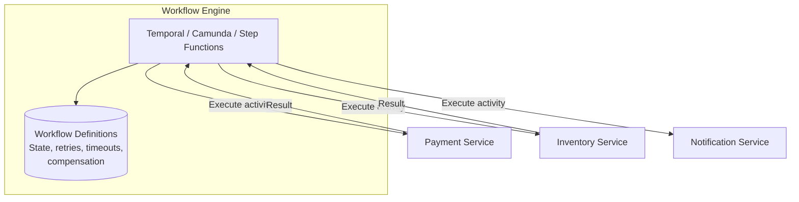

```
// Temporal Workflow (pseudocode)
@WorkflowMethod
fun placeOrder(order: Order) {
    val orderId = orderActivity.createOrder(order)  // Step 1
    
    try {
        paymentActivity.chargePayment(orderId, order.total)  // Step 2
        
        try {
            inventoryActivity.reserveStock(orderId, order.items)  // Step 3
            notificationActivity.sendConfirmation(orderId)  // Step 4
            orderActivity.confirmOrder(orderId)
        } catch (e: StockUnavailableException) {
            paymentActivity.refundPayment(orderId)  // Compensate step 2
            orderActivity.cancelOrder(orderId)
        }
    } catch (e: PaymentFailedException) {
        orderActivity.cancelOrder(orderId)  // Compensate step 1
    }
}
```

| Criterion | Assessment |
|-----------|-----------|
| **Complexity** | Low (code) — write workflows as normal code; engine handles durability, retries, state |
| **Durability** | Excellent — survives process crashes; engine replays to last checkpoint |
| **Long-running** | Built-in — workflows can run for days/weeks (human approval, batch processing) |
| **Visibility** | Excellent — engine provides UI for workflow state, history, pending activities |
| **Retries/timeouts** | Declarative — configure per activity; handled by the engine |
| **Operational** | Medium-High — must run the workflow engine cluster |
| **Best for** | Complex workflows; long-running processes; workflows with human-in-the-loop |

### Pattern C: Serverless Step Functions (AWS)

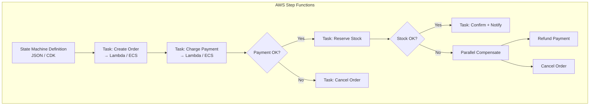

| Criterion | Assessment |
|-----------|-----------|
| **Operational cost** | Lowest — fully managed; pay per transition |
| **Lock-in** | High — AWS-specific; non-portable |
| **Visibility** | Excellent — built-in console shows execution graph |
| **Integration** | Deep — native integration with Lambda, SQS, SNS, DynamoDB, ECS |
| **Best for** | AWS-native architectures; event-driven workflows; short-to-medium duration |

---

## 8. Orchestration Tool Comparison

| Criterion | Code-Based (Eventuate/MassTransit) | Temporal | Camunda | AWS Step Functions |
|-----------|-----------------------------------|---------|---------|-------------------|
| **Infrastructure** | None (runs in service) | Temporal server cluster | Camunda engine | Managed (AWS) |
| **Workflow definition** | Code (state machine) | Code (looks like normal code) | BPMN diagram or code | JSON / ASL / CDK |
| **Durability** | Custom (saga state table) | Built-in (event sourced) | Built-in | Built-in |
| **Long-running** | Manual (timers, state checks) | Native (workflows sleep for days) | Native | Limited (1 year max for Standard) |
| **Visibility/UI** | Custom dashboard | Built-in Web UI | Built-in Cockpit | AWS Console |
| **Retries** | Custom code | Declarative per activity | Declarative | Declarative |
| **Human tasks** | Custom | Signal API | Native (user tasks) | Callback pattern |
| **Polyglot** | Per-framework | Java, Go, Python, TypeScript, .NET | Java, REST API | Any (via Lambda/HTTP) |
| **Cloud lock-in** | None | None | None | AWS |
| **Complexity** | Medium | Low-Medium | Medium (BPMN) | Low |
| **Best for** | Simple sagas, small teams | Complex durable workflows | Business process automation | AWS-native |

---

## 9. Composition Patterns Beyond Saga

### Pattern 1: API Gateway Composition (Simple Aggregation)

```mermaid
graph TB
    CLIENT[Client] --> GW[API Gateway / BFF]
    
    GW --> S1[User Service]
    GW --> S2[Order Service]
    GW --> S3[Product Service]
    
    GW --> RESPONSE["Compose response:<br/>&#123; user: ... , recentOrders: [...], recommendations: [...] &#125;"]
```

| When | How | Limitation |
|------|-----|-----------|
| Read-only aggregation for UI | Parallel calls, merge results | No transaction; no compensation needed; just data assembly |

### Pattern 2: Process Manager (Long-Running Stateful Process)

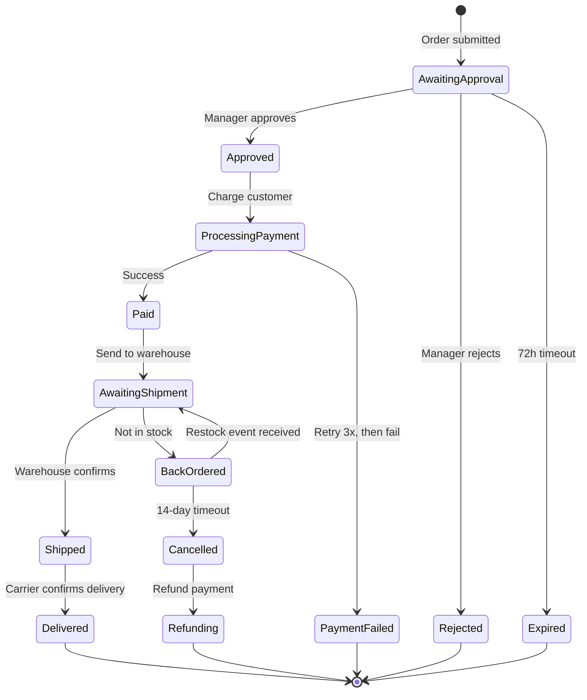

A **process manager** is an orchestrator for **long-running processes** — days, weeks, or months — with timers, human decisions, and external events.

| Aspect | Saga | Process Manager |
|--------|------|----------------|
| **Duration** | Seconds to minutes | Hours to months |
| **Human involvement** | No | Often (approval, manual steps) |
| **Timers** | Rarely | Critical (deadlines, escalations) |
| **State complexity** | Linear (step 1 → 2 → 3) | Complex (branches, loops, waits) |
| **Tool** | Code-based or lightweight | Workflow engine (Temporal, Camunda) |

### Pattern 3: Parallel Composition with Join

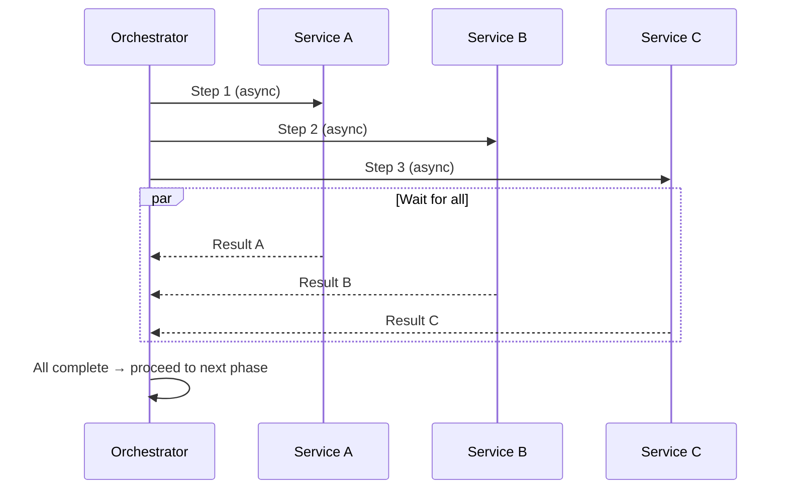

| When | Example |
|------|---------|
| Independent steps can run in parallel | Validate address, check credit, check fraud — all independent; all must pass |
| Fan-out / fan-in pattern | Enrich an order with data from 5 sources; wait for all; compose response |

### Pattern 4: Routing Slip

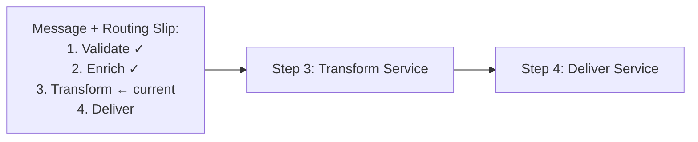

Each message carries its **own itinerary** — list of services to visit. Each service processes and forwards to the next on the slip.

| Criterion | Assessment |
|-----------|-----------|
| **Coupling** | Very low — each service just processes and forwards |
| **Flexibility** | High — different messages can have different routing slips |
| **Visibility** | Medium — slip shows progress; but no central state store |
| **Failure** | Must handle per-step; no central compensation |
| **Best for** | Pipeline processing; document workflows; ETL-like chains |

---

## 10. Compensation Design

Compensation is **not rollback** — it's a new forward action that semantically undoes the effect.

| Original Action | Compensation | Notes |
|----------------|-------------|-------|
| Create Order | Cancel Order | Set status to CANCELLED |
| Charge Payment | Refund Payment | New refund transaction; money moves back |
| Reserve Inventory | Release Inventory | Increment available count |
| Send Email | Send Correction Email | Cannot "unsend" — send a follow-up |
| Ship Package | Recall / Return Label | Physical world — may be impossible |
| Publish Event | Publish Compensating Event | Consumers must handle `OrderCancelled` after `OrderPlaced` |

### Compensation Rules

```
1. Compensate in REVERSE order of the original steps
2. Compensations must be IDEMPOTENT — safe to retry
3. Compensations can FAIL — you need compensation-of-compensation (or manual intervention)
4. Some actions are NOT compensable — design around this (e.g., don't send email until all steps pass)
5. Delay irreversible actions to the END of the saga
```

### Ordering Side Effects by Reversibility

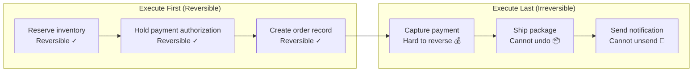

---

## 11. Handling Edge Cases

### Timeout Handling

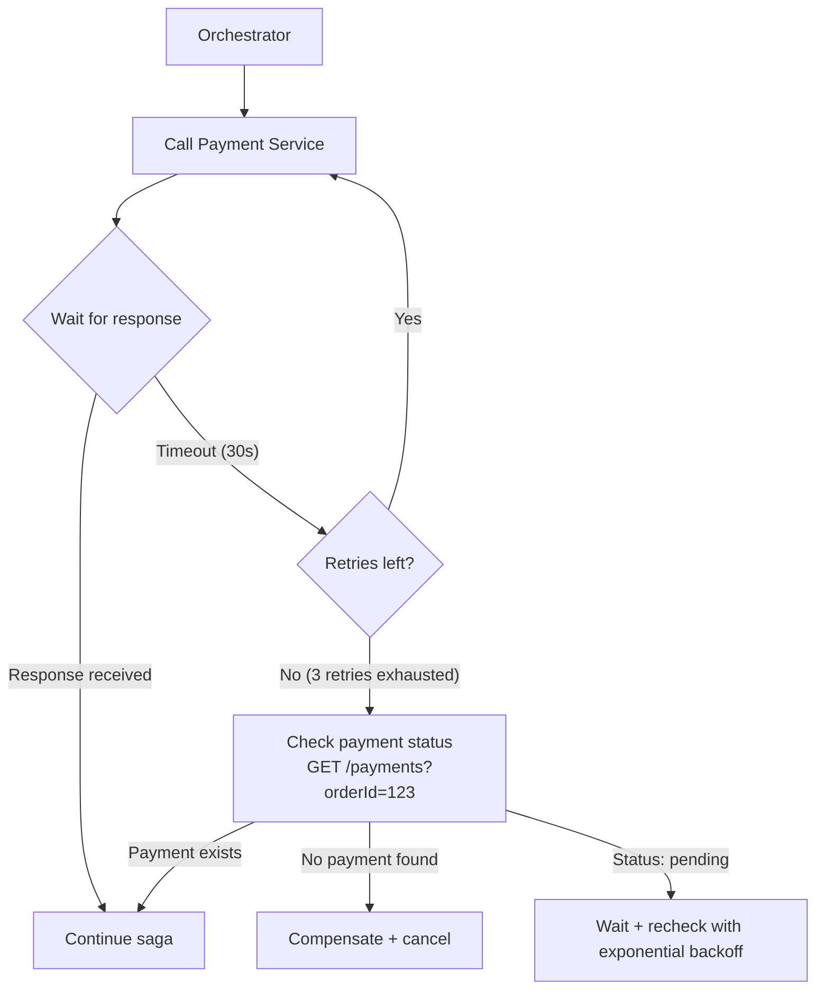

**Critical rule:** On timeout, **never assume failure**. The call may have succeeded but the response was lost. Always **query the state** before compensating.

### Duplicate Detection

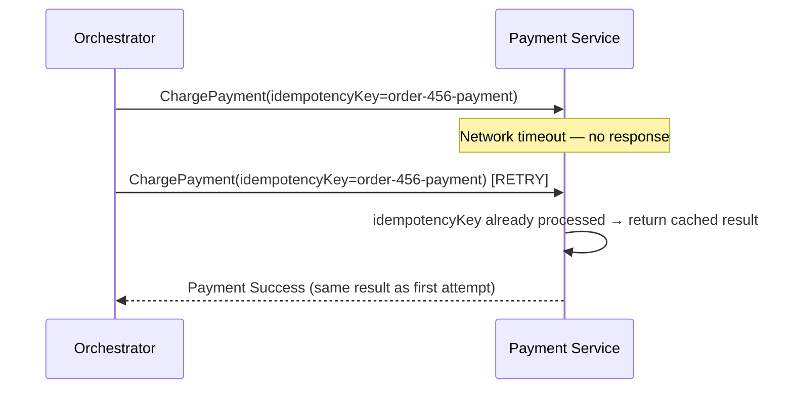

Every command must include an **idempotency key** — the receiver deduplicates by key and returns the cached result for retries.

### Concurrent Saga Instances

```mermaid
graph TD
    REQ1[Request 1: Modify Order 456] --> SAGA1[Saga Instance A]
    REQ2[Request 2: Cancel Order 456] --> SAGA2[Saga Instance B]
    
    SAGA1 --> CONFLICT{Both operating on<br/>Order 456 simultaneously}
    SAGA2 --> CONFLICT
    
    CONFLICT --> SOL1["Solution 1: Optimistic Locking<br/>Version number on order; second write fails"]
    CONFLICT --> SOL2["Solution 2: Saga Lock<br/>Only one saga per entity at a time"]
    CONFLICT --> SOL3["Solution 3: Entity Partitioning<br/>Route all Order 456 operations to same partition"]
```

---

## 12. Decision Matrix

| Scenario | Pattern | Why |
|----------|---------|-----|
| **Order placement (create → pay → reserve → confirm)** | Orchestrated Saga | Multiple steps with strict ordering; clear compensation chain; need visibility |
| **Order → send email + update analytics** | Choreography (events) | Independent side effects; producer shouldn't know about consumers |
| **Insurance claim (submit → review → approve → payout)** | Process Manager (Temporal/Camunda) | Long-running; human approval; timers; complex state |
| **Homepage aggregation (user + orders + recommendations)** | API Composition | Read-only assembly; no transactions |
| **Document processing (validate → enrich → transform → store)** | Routing Slip | Pipeline; each step is independent; different documents may need different routes |
| **Parallel checks (fraud + credit + address validation)** | Parallel Composition with Join | Independent checks; all must pass; fan-out/fan-in |
| **Microservice calling 2 downstream services** | Simple orchestration in service code | < 3 steps; no long-running state; keep it simple |

---

## 13. Anti-Patterns

| Anti-Pattern | Consequence |
|--------------|------------|
| **God orchestrator** | One orchestrator coordinates 20+ services — becomes a monolith with a message bus |
| **Synchronous orchestration chain** | Orchestrator calls services synchronously in sequence — latency = sum of all calls; one slow service blocks everything |
| **Choreography for complex flows** | 8-step business process with conditional branching via events — impossible to understand, debug, or modify |
| **No compensation logic** | Payment charged, inventory reservation fails — customer charged for nothing |
| **Compensate without idempotency** | Retry compensation → double refund |
| **Assume timeout = failure** | Call timed out → compensate → but the call actually succeeded → inconsistent state |
| **Irreversible actions early in the saga** | Send email first, then payment fails — customer got a confirmation for a failed order |
| **No saga state persistence** | Orchestrator crashes mid-saga → no one knows which steps completed |
| **Distributed monolith orchestrator** | Orchestrator has business logic from all services — services become anemic CRUD wrappers |
| **Ignoring concurrent sagas** | Two sagas modify the same entity simultaneously — lost updates, corrupted state |

---

## 14. Recommendation: Composition Strategy by Complexity

| Workflow Complexity | Steps | Duration | Pattern | Tool |
|--------------------|-------|----------|---------|------|
| **Trivial** (1-2 services) | 1-2 | Milliseconds | Direct call + error handling | None — just code |
| **Simple** (3-4 linear steps) | 3-4 | Seconds | Code-based saga in service | Eventuate Tram, MassTransit |
| **Moderate** (5+ steps, branching) | 5-10 | Seconds-minutes | Orchestrated saga + choreographed side effects | Temporal, code-based |
| **Complex** (conditional flows, parallel, human) | 10+ | Hours-months | Process Manager / Workflow Engine | Temporal, Camunda |
| **Cross-context integration** | N/A | N/A | Choreography (events) | Kafka, RabbitMQ |

---

## 15. Practical Checklist

```
Design:
[ ] Each bounded context orchestrates its own workflows internally
[ ] Cross-context integration uses choreography (domain events)
[ ] Saga state machine defined with explicit states and transitions
[ ] Compensation action identified for every forward step
[ ] Irreversible actions (email, payment capture, shipping) ordered last

Implementation:
[ ] Idempotency key on every command sent by the orchestrator
[ ] Saga state persisted durably (DB or workflow engine)
[ ] Timeouts configured per step — never wait indefinitely
[ ] On timeout: query state before compensating — never assume failure
[ ] Dead letter queue for failed saga messages
[ ] Concurrent saga protection per entity (locking or partitioning)

Observability:
[ ] Saga state queryable: "Where is Order 456 in the process?"
[ ] Metrics: saga duration, success/failure rate, step failure distribution
[ ] Alert on stuck sagas (no state transition for > threshold)
[ ] Distributed tracing spans cover the full saga lifecycle

Testing:
[ ] Unit test: every state transition in the saga state machine
[ ] Integration test: happy path end-to-end with stubs
[ ] Failure test: each step fails → verify compensation chain executes
[ ] Timeout test: downstream service is slow → verify timeout + retry + compensation
[ ] Concurrent test: two sagas on same entity → verify no corruption
```

---

## 16. Next Steps

1. **What are your critical business workflows?** — Order placement, claims processing, user onboarding?
2. **How many steps in your most complex flow?** — Determines whether code-based sagas or a workflow engine is justified.
3. **Do you have long-running processes** (human approval, scheduled steps)? — Pushes toward Temporal or Camunda.
4. **Current infrastructure?** — AWS (Step Functions native), Kubernetes (Temporal fits well), or VM-based?
5. **Team familiarity** — BPMN (Camunda)? Code-first (Temporal)? Serverless (Step Functions)?
