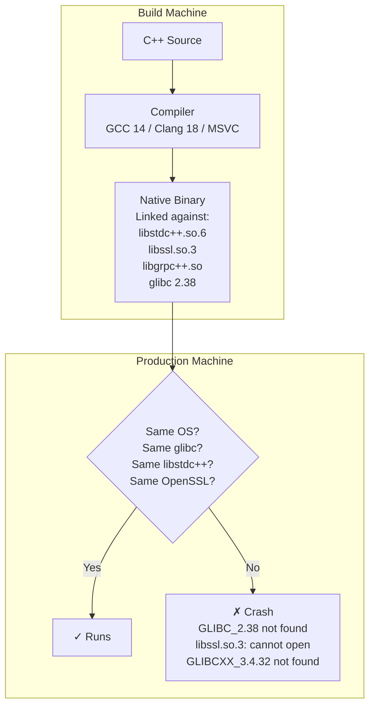
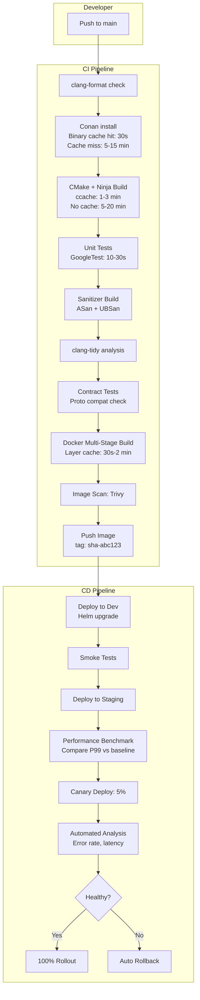

# How do you deploy your C++ Microservices?

C++ microservices have **fundamentally different deployment characteristics** than Java or .NET services. There's no JVM or CLR — you're deploying a native binary with direct OS and hardware dependencies. This changes everything about build, packaging, and runtime management.

The key differences that shape the deployment strategy:

| Aspect | Java / .NET | C++ |
|--------|------------|-----|
| **Artifact** | JAR/WAR + JVM, DLL + CLR | Native binary (ELF/PE) |
| **Runtime dependency** | JVM / CLR (portable) | OS, libc, system libraries (not portable) |
| **Startup time** | Seconds (JIT warmup) | Milliseconds (immediate) |
| **Memory footprint** | Hundreds of MB (runtime + GC) | Minimal (no runtime overhead) |
| **Build time** | Fast (incremental) | Slow (templates, linking, full rebuilds) |
| **ABI compatibility** | Stable (bytecode) | Fragile (compiler version, libstdc++, glibc) |
| **Portability** | "Write once, run anywhere" | "Build per target" |

---

## 1. The C++ Deployment Challenge



**The core problem:** A C++ binary is tied to the exact library versions present at build time. Deploy it to a machine with different versions and it won't even start.

---

## 2. Containerization: The Solution to ABI Hell

### Option A: Multi-Stage Docker Build (Recommended)

```dockerfile
# Stage 1: Build
FROM ubuntu:24.04 AS builder

RUN apt-get update && apt-get install -y \
    build-essential cmake ninja-build \
    libgrpc++-dev libprotobuf-dev protobuf-compiler-grpc \
    libssl-dev libcurl4-openssl-dev \
    && rm -rf /var/lib/apt/lists/*

WORKDIR /src
COPY . .

RUN cmake -B build -G Ninja \
    -DCMAKE_BUILD_TYPE=Release \
    -DCMAKE_INSTALL_PREFIX=/opt/service \
    && cmake --build build --parallel \
    && cmake --install build

# Stage 2: Runtime (minimal image)
FROM ubuntu:24.04 AS runtime

RUN apt-get update && apt-get install -y --no-install-recommends \
    libgrpc++1.51 libprotobuf32 \
    libssl3 libcurl4 \
    ca-certificates \
    && rm -rf /var/lib/apt/lists/*

# Non-root user
RUN groupadd -r svc && useradd -r -g svc -d /opt/service -s /sbin/nologin svc

COPY --from=builder /opt/service /opt/service

WORKDIR /opt/service
USER svc

EXPOSE 8080 9090

HEALTHCHECK --interval=10s --timeout=3s --retries=3 \
    CMD ["/opt/service/bin/healthcheck"] 

ENTRYPOINT ["/opt/service/bin/order-service"]
```

| Criterion | Assessment |
|-----------|-----------|
| **ABI stability** | Build and runtime share the same base image — libraries match perfectly |
| **Image size** | Builder stage discarded; runtime image contains only binary + runtime libs |
| **Reproducibility** | Pinned base image → identical builds every time |
| **Security** | Non-root user; minimal packages; no compiler/dev tools in production |

### Option B: Static Linking + Distroless/Scratch

```dockerfile
# Stage 1: Build with static linking
FROM ubuntu:24.04 AS builder

RUN apt-get update && apt-get install -y \
    build-essential cmake ninja-build \
    && rm -rf /var/lib/apt/lists/*

# Build dependencies from source (vcpkg / Conan) with static linkage
COPY vcpkg.json .
RUN vcpkg install --triplet x64-linux-static

WORKDIR /src
COPY . .

RUN cmake -B build -G Ninja \
    -DCMAKE_BUILD_TYPE=Release \
    -DBUILD_SHARED_LIBS=OFF \
    -DCMAKE_TOOLCHAIN_FILE=/opt/vcpkg/scripts/buildsystems/vcpkg.cmake \
    -DVCPKG_TARGET_TRIPLET=x64-linux-static \
    && cmake --build build --parallel

# Stage 2: Minimal runtime
FROM gcr.io/distroless/cc-debian12

COPY --from=builder /src/build/bin/order-service /
COPY --from=builder /etc/ssl/certs/ca-certificates.crt /etc/ssl/certs/

EXPOSE 8080
ENTRYPOINT ["/order-service"]
```

| Criterion | Assessment |
|-----------|-----------|
| **Image size** | Tiny — 10-50 MB (binary + minimal libc) vs 200-500 MB for dynamic |
| **ABI issues** | None — everything is in the binary |
| **Attack surface** | Minimal — no shell, no package manager, no extra binaries |
| **Debugging** | Harder — no shell in distroless; use debug variant or ephemeral containers |
| **Licensing** | Must check all statically linked libraries for license compatibility (LGPL requires dynamic linking) |
| **Best for** | Maximum security; minimal footprint; air-gapped environments |

### Container Strategy Comparison

| Criterion | Dynamic + Ubuntu Runtime | Static + Distroless |
|-----------|------------------------|-------------------|
| **Image size** | 200-500 MB | 10-50 MB |
| **Startup time** | ~50ms (dynamic linker) | ~10ms (no linking) |
| **Security surface** | Medium (apt packages present) | Minimal (no shell, no tools) |
| **Debugging in prod** | Easy (`docker exec` + tools) | Hard (no shell; use ephemeral sidecars) |
| **LGPL compliance** | Automatic (dynamic linking) | Requires careful audit |
| **Build complexity** | Low | Medium-High (static deps) |

---

## 3. Dependency Management

### Option A: Conan (C/C++ Package Manager)

```
# conanfile.txt
[requires]
grpc/1.62.0
protobuf/25.3
openssl/3.2.1
spdlog/1.13.0
nlohmann_json/3.11.3
prometheus-cpp/1.2.4
opentelemetry-cpp/1.14.0

[generators]
CMakeToolchain
CMakeDeps

[options]
grpc/*:shared=False
openssl/*:shared=False
```

### Option B: vcpkg (Microsoft)

```json
// vcpkg.json
{
  "name": "order-service",
  "version": "2.1.0",
  "dependencies": [
    "grpc",
    "protobuf",
    "openssl",
    "spdlog",
    "nlohmann-json",
    "prometheus-cpp",
    "opentelemetry-cpp"
  ]
}
```

### Option C: System Packages (apt/yum)

| Criterion | Conan / vcpkg | System Packages |
|-----------|---------------|----------------|
| **Version pinning** | Exact version per dependency | Whatever the distro provides |
| **Reproducibility** | High — lockfile guarantees identical builds | Low — distro updates change versions |
| **Cross-platform** | Yes | No (per-distro) |
| **Build cache** | Conan cache / vcpkg binary cache | Apt cache |
| **Best for** | Production services | Quick prototypes, CI base images |

**Recommendation:** Conan or vcpkg with lockfiles for reproducible builds. Add a **binary cache** (Artifactory, S3, or GitHub Packages) to avoid rebuilding dependencies on every CI run.

---

## 4. Build System and CI Pipeline

### CMake Project Structure

```
order-service/
├── CMakeLists.txt              # Top-level build
├── conanfile.txt               # Dependencies
├── Dockerfile                  # Multi-stage build
├── helm/                       # Kubernetes deployment
│   └── order-service/
│       ├── Chart.yaml
│       ├── values.yaml
│       └── templates/
├── proto/                      # gRPC service definitions
│   └── order_service.proto
├── src/
│   ├── main.cpp                # Entry point
│   ├── server.cpp              # gRPC server setup
│   ├── handlers/               # Request handlers
│   ├── domain/                 # Business logic
│   ├── infra/                  # DB, cache, messaging clients
│   └── observability/          # Metrics, tracing, health
├── tests/
│   ├── unit/
│   ├── integration/
│   └── contract/
└── scripts/
    └── healthcheck.cpp         # Lightweight health check binary
```

### CI Pipeline

```mermaid
graph TB
    subgraph "CI Pipeline (GitHub Actions / GitLab CI)"
        LINT[Lint<br/>clang-tidy + clang-format]
        DEPS["Install Dependencies<br/>Conan install --build=missing<br/>(binary cache hit)"]
        BUILD[CMake Build<br/>-DCMAKE_BUILD_TYPE=Release<br/>-DBUILD_TESTING=ON]
        UNIT[Unit Tests<br/>ctest / GoogleTest]
        SAN[Sanitizer Build<br/>ASan + UBSan + TSan]
        SAST[Static Analysis<br/>clang-tidy + cppcheck<br/>+ Coverity / SonarQube]
        CONTRACT[Contract Tests<br/>Pact C++ / Proto compat check]
        IMAGE[Docker Build<br/>Multi-stage]
        SCAN[Image Scan<br/>Trivy / Grype]
        PUSH[Push to Registry<br/>tag: sha-abc123]
    end

    LINT --> DEPS --> BUILD --> UNIT --> SAN --> SAST --> CONTRACT --> IMAGE --> SCAN --> PUSH
```



### C++-Specific CI Concerns

| Concern | Solution |
|---------|---------|
| **Slow builds** | Conan/vcpkg binary cache; ccache or sccache; Ninja generator; prebuilt dependency layer in Docker |
| **ABI breaks between compiler versions** | Pin compiler version in Docker base image; rebuild all deps on compiler upgrade |
| **Sanitizers** | Separate build with `-fsanitize=address,undefined,thread`; run in CI, not in production image |
| **Code coverage** | `gcov` / `llvm-cov` with `gcovr` for reports; CI gate at coverage threshold |
| **Proto/gRPC codegen** | Generate C++ stubs from `.proto` files in CMake; check generated code into repo or generate in CI |

### Docker Layer Caching for Fast Builds

```dockerfile
# Layer 1: Rarely changes — base + system deps
FROM ubuntu:24.04 AS base
RUN apt-get update && apt-get install -y build-essential cmake ninja-build

# Layer 2: Changes when dependencies change
FROM base AS deps
COPY conanfile.txt conan.lock ./
RUN conan install . --build=missing --output-folder=/deps

# Layer 3: Changes on every code change
FROM deps AS build
COPY . .
RUN cmake -B build -G Ninja \
    -DCMAKE_TOOLCHAIN_FILE=/deps/conan_toolchain.cmake \
    && cmake --build build
```

Dependencies are cached until `conanfile.txt` or `conan.lock` changes — saves minutes on every build.

---

## 5. Observability for C++ Services

Unlike Java/Python, there's no auto-instrumentation agent you just attach. C++ requires **explicit instrumentation**.

### OpenTelemetry C++ SDK

```cpp
#include <opentelemetry/trace/provider.h>
#include <opentelemetry/metrics/provider.h>
#include <opentelemetry/exporters/otlp/otlp_grpc_exporter.h>

// Initialize tracing
void initObservability() {
    auto exporter = otlp::OtlpGrpcExporterFactory::Create();
    auto processor = trace_sdk::SimpleSpanProcessorFactory::Create(std::move(exporter));
    auto provider = trace_sdk::TracerProviderFactory::Create(std::move(processor));
    trace::Provider::SetTracerProvider(std::move(provider));
}

// Use in handlers
void handleCreateOrder(const CreateOrderRequest& req) {
    auto tracer = trace::Provider::GetTracerProvider()->GetTracer("order-service");
    auto span = tracer->StartSpan("CreateOrder");
    auto scope = tracer->WithActiveSpan(span);
    
    span->SetAttribute("order.customer_id", req.customer_id());
    // ... business logic ...
    span->SetStatus(trace::StatusCode::kOk);
    span->End();
}
```

### Prometheus Metrics

```cpp
#include <prometheus/counter.h>
#include <prometheus/histogram.h>
#include <prometheus/exposer.h>

// Expose /metrics endpoint
prometheus::Exposer exposer{"0.0.0.0:9090"};
auto& registry = *std::make_shared<prometheus::Registry>();

auto& request_counter = prometheus::BuildCounter()
    .Name("order_requests_total")
    .Help("Total order requests")
    .Register(registry);

auto& latency_histogram = prometheus::BuildHistogram()
    .Name("order_request_duration_seconds")
    .Help("Request duration in seconds")
    .Register(registry);

exposer.RegisterCollectable(registry);
```

### Structured Logging (spdlog)

```cpp
#include <spdlog/spdlog.h>
#include <spdlog/sinks/stdout_color_sinks.h>

// JSON format for log aggregation
spdlog::set_pattern(R"({"timestamp":"%Y-%m-%dT%H:%M:%S.%f%z","level":"%l","service":"order-service","message":"%v"})");

// In handler — include trace context
spdlog::info(R"({{"traceId":"{}","spanId":"{}","orderId":"{}","action":"create_order"}})",
    current_span->GetContext().trace_id(),
    current_span->GetContext().span_id(),
    order_id);
```

### Health Check Binary

```cpp
// healthcheck.cpp — tiny binary for Docker HEALTHCHECK
#include <curl/curl.h>

int main() {
    CURL* curl = curl_easy_init();
    curl_easy_setopt(curl, CURLOPT_URL, "http://localhost:8080/healthz");
    curl_easy_setopt(curl, CURLOPT_TIMEOUT, 2L);
    CURLcode res = curl_easy_perform(curl);
    curl_easy_cleanup(curl);
    return (res == CURLE_OK) ? 0 : 1;
}
```

Build this as a **separate tiny binary** — much smaller than pulling `curl` into your production image.

---

## 6. Communication Frameworks for C++ Microservices

| Framework | Protocol | Strengths | Use Case |
|-----------|----------|-----------|----------|
| **gRPC (grpc++)** | HTTP/2 + Protobuf | Code-gen from `.proto`; streaming; polyglot interop | Primary service-to-service communication |
| **Boost.Beast** | HTTP/1.1, WebSocket | Low-level, high performance; header-only | Custom REST APIs; WebSocket servers |
| **cpp-httplib** | HTTP/1.1 | Header-only; simple; lightweight | Health checks, simple REST endpoints |
| **Drogon** | HTTP/1.1/2 | Full web framework; ORM; WebSocket | REST API-heavy services |
| **librdkafka** | Kafka protocol | High-performance C Kafka client; C++ wrapper | Event-driven async communication |
| **AMQP-CPP** | AMQP 0.9.1 | RabbitMQ client | Message queue integration |

**Recommendation:** gRPC for service-to-service; a lightweight HTTP library for health/metrics endpoints; librdkafka for async events.

---

## 7. Kubernetes Deployment

### Helm Chart (values.yaml)

```yaml
replicaCount: 3

image:
  repository: registry.example.com/order-service
  tag: "sha-abc123"
  pullPolicy: IfNotPresent

resources:
  requests:
    cpu: 250m
    memory: 128Mi    # C++ services use far less memory than JVM
  limits:
    cpu: "1"
    memory: 256Mi

livenessProbe:
  httpGet:
    path: /healthz
    port: 8080
  initialDelaySeconds: 2    # C++ starts in milliseconds — no JVM warmup
  periodSeconds: 10

readinessProbe:
  httpGet:
    path: /readyz
    port: 8080
  initialDelaySeconds: 2
  periodSeconds: 5

startupProbe:
  httpGet:
    path: /healthz
    port: 8080
  failureThreshold: 3
  periodSeconds: 2

service:
  type: ClusterIP
  ports:
    - name: grpc
      port: 9090
    - name: http
      port: 8080
    - name: metrics
      port: 9091

env:
  - name: OTEL_EXPORTER_OTLP_ENDPOINT
    value: "http://otel-collector:4317"
  - name: LOG_LEVEL
    value: "info"
  - name: DB_HOST
    valueFrom:
      secretKeyRef:
        name: order-service-db
        key: host
```

### C++ Advantages in Kubernetes

| Aspect | C++ | Java/JVM |
|--------|-----|----------|
| **Memory request** | 64-256 Mi | 512 Mi - 2 Gi |
| **Startup time** | < 100 ms | 5-30 s (Spring Boot) |
| **Startup probe needed** | Rarely (instant start) | Always (JVM warmup) |
| **Density per node** | High — more pods per node | Lower — JVM overhead per pod |
| **Cold start (scale-up)** | Near-instant — handles traffic immediately | Slow — pod not ready for seconds |
| **GC pauses** | None | P99 latency spikes during GC |

---

## 8. Graceful Shutdown

```cpp
#include <csignal>
#include <atomic>

std::atomic<bool> shutting_down{false};

void signalHandler(int signal) {
    spdlog::info("Received signal {}, starting graceful shutdown", signal);
    shutting_down.store(true);
}

int main() {
    std::signal(SIGTERM, signalHandler);
    std::signal(SIGINT, signalHandler);

    // Start gRPC server
    grpc::ServerBuilder builder;
    builder.AddListeningPort("0.0.0.0:9090", grpc::InsecureServerCredentials());
    builder.RegisterService(&order_service);
    auto server = builder.BuildAndStart();

    // Wait for shutdown signal
    while (!shutting_down.load()) {
        std::this_thread::sleep_for(std::chrono::milliseconds(100));
    }

    // Graceful shutdown: stop accepting new requests, drain in-flight
    spdlog::info("Draining in-flight requests...");
    auto deadline = std::chrono::system_clock::now() + std::chrono::seconds(30);
    server->Shutdown(deadline);

    spdlog::info("Shutdown complete");
    return 0;
}
```

**Kubernetes lifecycle:**
```yaml
lifecycle:
  preStop:
    exec:
      command: ["/bin/sh", "-c", "sleep 5"]  # Wait for endpoint removal propagation
terminationGracePeriodSeconds: 45
```

---

## 9. Debugging C++ Services in Production

| Technique | Tool | When |
|-----------|------|------|
| **Core dumps** | `gdb`, `lldb` | Post-mortem crash analysis |
| **Ephemeral debug container** | `kubectl debug` | Attach debug tools to running pod without modifying image |
| **Remote GDB** | `gdbserver` (debug sidecar) | Live debugging in staging (never in production traffic path) |
| **Sanitizers** | ASan, TSan, UBSan | Staging/canary only — 2-10× slowdown |
| **Profiling** | `perf`, Flamegraph | CPU bottleneck identification |
| **Heap profiling** | TCMalloc/jemalloc + profiling | Memory leak detection |
| **Distributed tracing** | Jaeger/Tempo via OTel | Cross-service latency analysis |

### Core Dump Collection in Kubernetes

```yaml
# In deployment spec
securityContext:
  capabilities:
    add: ["SYS_PTRACE"]  # Allow core dumps (staging only)

# Configure core pattern on the node
# /proc/sys/kernel/core_pattern = /tmp/cores/core.%e.%p.%t

# Mount a volume for core dumps
volumeMounts:
  - name: coredumps
    mountPath: /tmp/cores
volumes:
  - name: coredumps
    emptyDir:
      sizeLimit: 1Gi
```

---

## 10. Build and Deploy Pipeline — Full Picture



### Build Time Optimization

| Technique | Savings | How |
|-----------|---------|-----|
| **ccache / sccache** | 50-80% on incremental builds | Cache object files by content hash; share across CI runs |
| **Conan binary cache** | 5-15 min per build | Pre-built dependencies stored in Artifactory/S3 |
| **Docker layer caching** | 2-5 min | Dependencies layer cached; only code layer rebuilds |
| **Ninja generator** | 10-30% faster than Make | Parallel-aware; minimal rebuild |
| **Precompiled headers** | 10-30% compiler time | Expensive headers (Boost, Protobuf) compiled once |
| **Unity builds** | 20-50% for full rebuilds | Combine translation units; fewer linker inputs |
| **Modules (C++20)** | Future savings | Replace headers with compiled module interfaces |

---

## 11. Anti-Patterns

| Anti-Pattern | Consequence |
|--------------|------------|
| **Building on developer machine, deploying binary** | "Works on my machine" — ABI mismatch, missing libraries, wrong glibc |
| **Using `latest` distro packages without pinning** | Distro update changes OpenSSL/glibc version → binary won't start |
| **No sanitizers in CI** | Memory leaks, UB, and data races discovered in production |
| **Fat Docker image with build tools** | 2 GB image with GCC in production; slow pull; security surface |
| **Dynamic linking without matching runtime image** | `libstdc++.so.6: version GLIBCXX_3.4.32 not found` |
| **No health check binary** | Installing `curl` in a distroless image defeats the purpose |
| **JVM-sized resource requests** | Requesting 2 Gi memory for a C++ service that uses 50 Mi — wasted cluster capacity |
| **Long JVM-like startup probes** | C++ starts in ms; 30s `initialDelaySeconds` wastes time during scaling events |
| **No coredump collection** | Segfault in production → no post-mortem; bug is unreproducible |
| **Rebuilding all deps on every CI run** | 15-min builds kill developer feedback loop; use binary caches |

---

## 12. Comparison: C++ Deployment vs Java/.NET

| Aspect | C++ Microservice | Java Microservice | .NET Microservice |
|--------|-----------------|-------------------|-------------------|
| **Container image** | 10-50 MB (static) / 200 MB (dynamic) | 300-800 MB (JRE + deps) | 200-500 MB (.NET runtime + deps) |
| **Startup** | < 100 ms | 5-30 s | 1-10 s |
| **Memory baseline** | 10-50 MB | 200-500 MB | 100-300 MB |
| **Build time** | 5-20 min (cold) | 1-5 min | 1-5 min |
| **Build caching** | ccache + Conan cache | Gradle/Maven cache | NuGet cache |
| **Auto-instrumentation** | None — manual OTel SDK | Java agent (zero-code) | .NET agent (zero-code) |
| **ABI concerns** | Critical — must match libs | None (JVM bytecode) | None (CLR IL) |
| **Debugging in prod** | Core dumps + GDB | JMX, heap dumps, JFR | dotnet-dump, dotnet-trace |
| **Pods per node** | Very high density | Lower density | Medium density |
| **Cold scaling speed** | Near-instant | Slow (JVM warmup) | Fast |

---

## 13. Practical Checklist

```
Build:
[ ] Multi-stage Dockerfile: build stage + minimal runtime stage
[ ] Compiler and base image version pinned (not :latest)
[ ] Dependencies managed via Conan or vcpkg with lockfile
[ ] Binary cache for deps (Artifactory / S3) — avoid rebuild on every CI run
[ ] ccache/sccache configured in CI for incremental builds
[ ] Sanitizers (ASan, UBSan, TSan) run in CI — never ship sanitized binaries

Container:
[ ] Runtime image: Ubuntu minimal or distroless (no compiler, no dev tools)
[ ] Non-root user in Dockerfile
[ ] Static linking considered for distroless/scratch (check LGPL compliance)
[ ] Lightweight health check binary (not curl) for HEALTHCHECK
[ ] Image scanned (Trivy/Grype) before push

Observability:
[ ] OpenTelemetry C++ SDK for distributed tracing
[ ] Prometheus C++ client for /metrics endpoint
[ ] Structured JSON logging (spdlog) with traceId/spanId
[ ] Health endpoints: /healthz (liveness), /readyz (readiness)

Kubernetes:
[ ] Resource requests sized for C++ (not JVM) — 128-256 Mi memory typical
[ ] initialDelaySeconds low (2-5s) — C++ starts instantly
[ ] Graceful SIGTERM handling with connection draining
[ ] preStop hook for endpoint removal propagation
[ ] Core dump collection configured in staging

CI/CD:
[ ] Per-service pipeline with clang-format + clang-tidy + test + sanitizers
[ ] Docker layer caching for dependency layer
[ ] Immutable image tag (git SHA)
[ ] Contract tests for gRPC proto compatibility
[ ] Canary deployment with automated metric analysis
```

---

## 14. Next Steps

1. **What build system are you using?** — CMake, Bazel, Meson? Determines CI setup.
2. **What communication framework?** — gRPC, REST, Kafka? Drives dependency and proto management.
3. **Dependency management?** — Conan, vcpkg, system packages, vendored?
4. **Deployment target?** — Kubernetes, ECS, bare metal? Shapes container and orchestration strategy.
5. **How many C++ services?** — 1-2 C++ in a polyglot system, or all-C++? Influences shared tooling investment.
6. **Current build times?** — If > 10 min, caching strategy is urgent.
