# How to handle service resiliency in case of failures?

In a distributed system, failure is not exceptional — it is **constant and inevitable**. Networks partition, services crash, disks fill, dependencies slow down. The question is not "will failures happen?" but "when failure happens, does the system degrade gracefully or collapse entirely?"

The fundamental insight:

> **Availability is not about preventing failure. It's about controlling the blast radius when failure occurs.**

A resilient microservice continues serving (possibly degraded) when its dependencies fail. A non-resilient microservice propagates the failure upstream, creating a **cascading collapse**.

---

## 1. The Cascade Problem

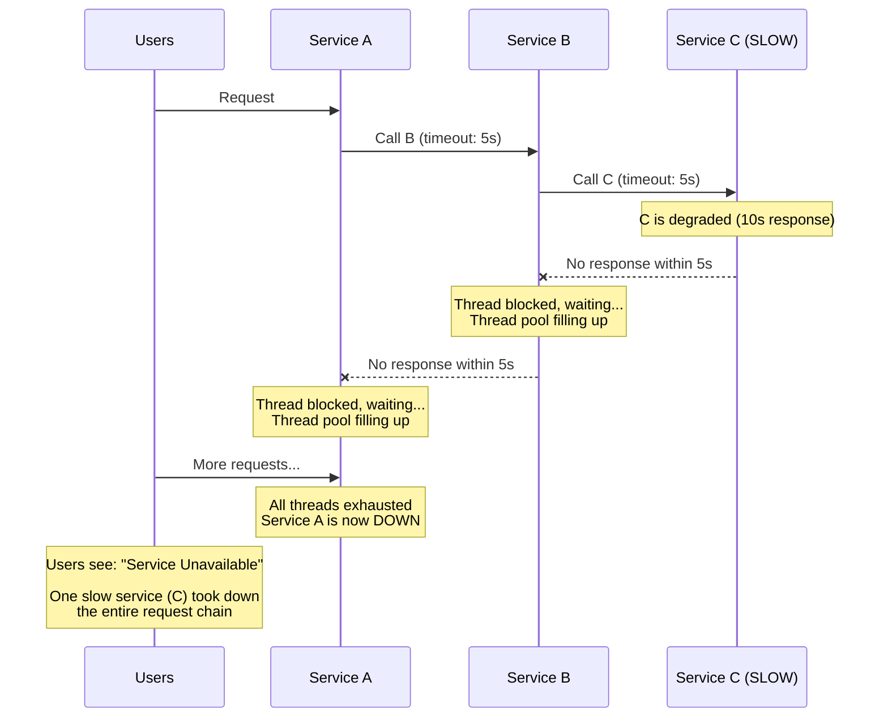
```mermaid
sequenceDiagram
    participant U as Users
    participant A as Service A
    participant B as Service B
    participant C as Service C (SLOW)

    U->>A: Request
    A->>B: Call B (timeout: 5s)
    B->>C: Call C (timeout: 5s)
    Note over C: C is degraded (10s response)
    
    C--xB: No response within 5s
    Note over B: Thread blocked, waiting...<br/>Thread pool filling up
    B--xA: No response within 5s
    Note over A: Thread blocked, waiting...<br/>Thread pool filling up

    U->>A: More requests...
    Note over A: All threads exhausted<br/>Service A is now DOWN
    Note over U: Users see: "Service Unavailable"<br/><br/>One slow service (C) took down<br/>the entire request chain
```

**One slow service** — not even a crashed service — brought down three services and blocked all users. This is a cascading failure.

---

## 2. The Resiliency Pattern Map

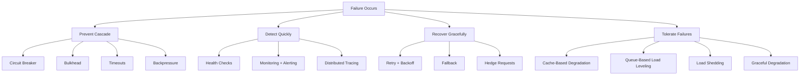
```mermaid
graph TB
    FAIL[Failure Occurs]
    
    FAIL --> PREVENT[Prevent Cascade]
    FAIL --> DETECT[Detect Quickly]
    FAIL --> RECOVER[Recover Gracefully]
    FAIL --> TOLERATE[Tolerate Failures]
    
    PREVENT --> CB[Circuit Breaker]
    PREVENT --> BH[Bulkhead]
    PREVENT --> TO[Timeouts]
    PREVENT --> BD[Backpressure]
    
    DETECT --> HC[Health Checks]
    DETECT --> MONITOR[Monitoring + Alerting]
    DETECT --> TRACE[Distributed Tracing]
    
    RECOVER --> RETRY[Retry + Backoff]
    RECOVER --> FB[Fallback]
    RECOVER --> HEDGE[Hedge Requests]
    
    TOLERATE --> CACHE_F[Cache-Based Degradation]
    TOLERATE --> QUEUE[Queue-Based Load Leveling]
    TOLERATE --> SHED[Load Shedding]
    TOLERATE --> GD[Graceful Degradation]
```

---

## 3. Pattern 1: Circuit Breaker

The circuit breaker **stops calling a failing dependency** — fail fast instead of fail slow.

### State Machine

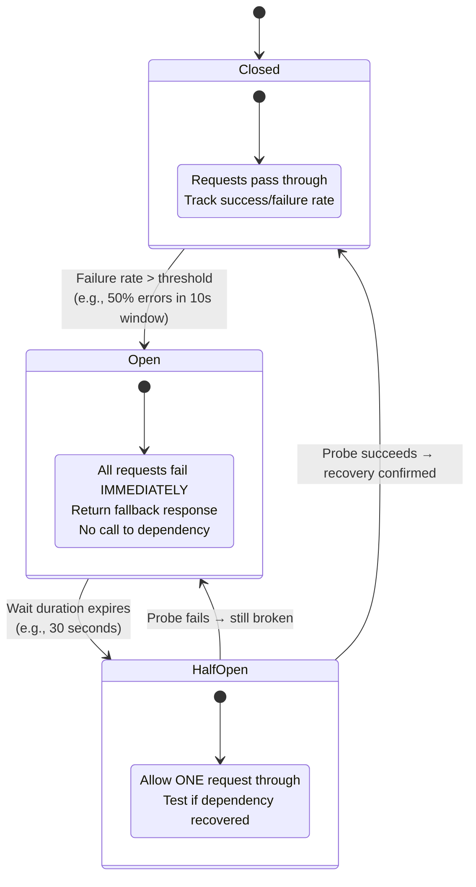
```mermaid
stateDiagram-v2
    [*] --> Closed

    Closed --> Open: Failure rate > threshold<br/>(e.g., 50% errors in 10s window)
    
    state Closed {
        [*] --> Monitoring
        Monitoring: Requests pass through<br/>Track success/failure rate
    }
    
    state Open {
        [*] --> Rejecting
        Rejecting: All requests fail IMMEDIATELY<br/>Return fallback response<br/>No call to dependency
    }
    
    Open --> HalfOpen: Wait duration expires<br/>(e.g., 30 seconds)
    
    state HalfOpen {
        [*] --> Probing
        Probing: Allow ONE request through<br/>Test if dependency recovered
    }
    
    HalfOpen --> Closed: Probe succeeds → recovery confirmed
    HalfOpen --> Open: Probe fails → still broken
```

### How It Prevents Cascading Failure

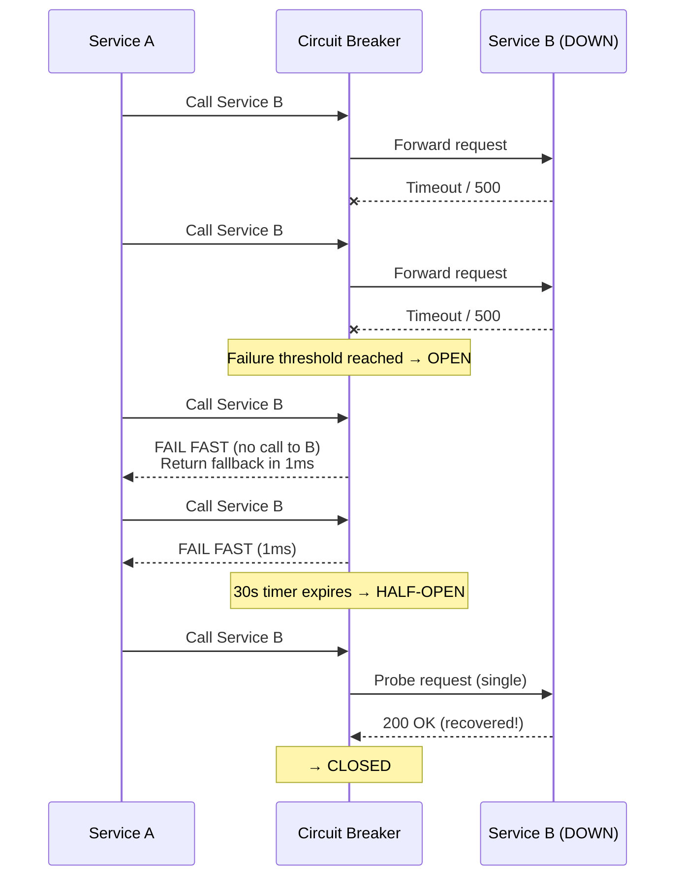
```mermaid
sequenceDiagram
    participant A as Service A
    participant CB as Circuit Breaker
    participant B as Service B (DOWN)

    A->>CB: Call Service B
    CB->>B: Forward request
    B--xCB: Timeout / 500

    A->>CB: Call Service B
    CB->>B: Forward request
    B--xCB: Timeout / 500

    Note over CB: Failure threshold reached → OPEN

    A->>CB: Call Service B
    CB-->>A: FAIL FAST (no call to B)<br/>Return fallback in 1ms

    A->>CB: Call Service B
    CB-->>A: FAIL FAST (1ms)

    Note over CB: 30s timer expires → HALF-OPEN

    A->>CB: Call Service B
    CB->>B: Probe request (single)
    B-->>CB: 200 OK (recovered!)
    Note over CB: → CLOSED
```

**Without circuit breaker:** Every request waits 5s for timeout → threads exhaust → Service A dies.  
**With circuit breaker:** After threshold, instant failure → 1ms response → Service A stays alive.

### Configuration

| Parameter | Description | Typical Value |
|-----------|------------|---------------|
| **Failure rate threshold** | % of failures to trigger open state | 50% |
| **Sliding window size** | Number of calls or time window to evaluate | 10 calls or 10 seconds |
| **Wait duration in open** | How long to wait before probing | 30-60 seconds |
| **Permitted calls in half-open** | How many probe requests to allow | 3-5 |
| **Slow call threshold** | Calls exceeding this duration count as failures | 2-5 seconds |
| **Minimum calls** | Minimum calls before evaluating failure rate | 5-10 |

### Implementation

| Language | Library | Notes |
|----------|---------|-------|
| Java | Resilience4j | Lightweight; decorator pattern; Spring Boot integration |
| .NET | Polly | Fluent API; integrates with `HttpClient` via `IHttpClientFactory` |
| C++ | Custom or service mesh | No dominant library; implement state machine or use Istio/Envoy |
| Go | gobreaker, hystrix-go | Simple implementations |
| Any | Istio / Envoy (service mesh) | Infrastructure-level; no code changes; configurable per route |

---

## 4. Pattern 2: Bulkhead Isolation

Named after ship bulkheads — if one compartment floods, the others stay dry.

### The Problem Without Bulkheads

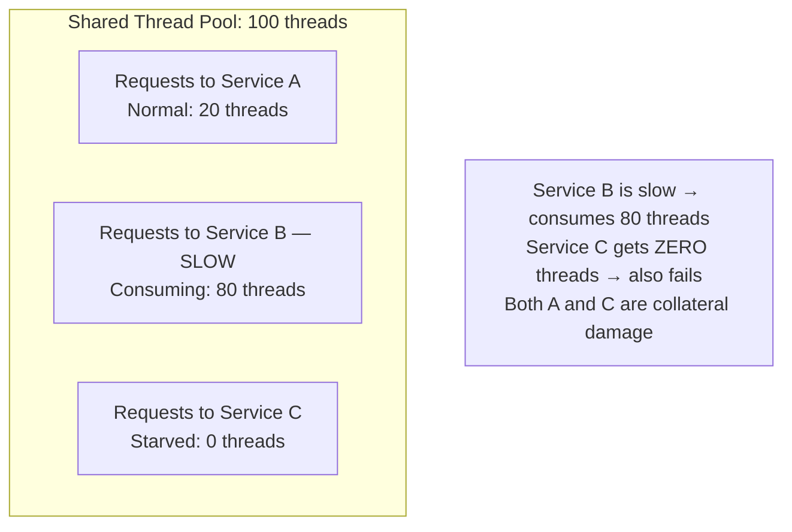
```mermaid
graph TB
    subgraph "Shared Thread Pool: 100 threads"
        REQ_A[Requests to Service A<br/>Normal: 20 threads]
        REQ_B[Requests to Service B — SLOW<br/>Consuming: 80 threads]
        REQ_C[Requests to Service C<br/>Starved: 0 threads]
    end

    NOTE["Service B is slow → consumes 80 threads<br/>Service C gets ZERO threads → also fails<br/>Both A and C are collateral damage"]
```

### With Bulkheads

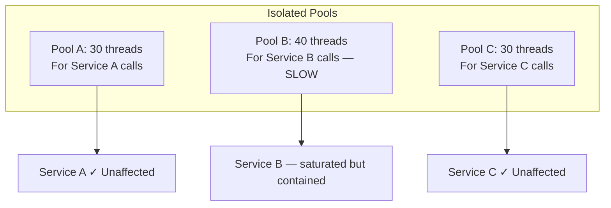
```mermaid
graph TB
    subgraph "Isolated Pools"
        POOL_A[Pool A: 30 threads<br/>For Service A calls]
        POOL_B[Pool B: 40 threads<br/>For Service B calls — SLOW]
        POOL_C[Pool C: 30 threads<br/>For Service C calls]
    end

    POOL_A --> SA[Service A ✓ Unaffected]
    POOL_B --> SB[Service B — saturated but contained]
    POOL_C --> SC[Service C ✓ Unaffected]
```

### Bulkhead Types

| Type | How It Works | Overhead | Use Case |
|------|-------------|----------|----------|
| **Thread pool isolation** | Separate thread pool per downstream | Higher (more threads) | HTTP client calls; blocking I/O |
| **Semaphore isolation** | Counter limits concurrent calls per downstream | Minimal | async/non-blocking calls; lightweight limiting |
| **Connection pool isolation** | Separate DB / HTTP connection pool per downstream | Moderate | Database connections; HTTP clients |
| **Process isolation (sidecar)** | Downstream calls routed through separate proxy process | Higher | Service mesh; complete failure isolation |

### Bulkhead + Circuit Breaker Together

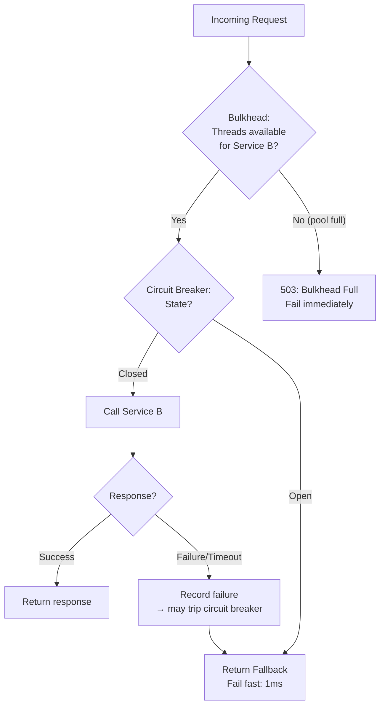
```mermaid
graph TB
    REQ[Incoming Request] --> BH{Bulkhead:<br/>Threads available<br/>for Service B?}
    BH -- "Yes" --> CB{Circuit Breaker:<br/>State?}
    BH -- "No (pool full)" --> REJECT[503: Bulkhead Full<br/>Fail immediately]
    
    CB -- "Closed" --> CALL[Call Service B]
    CB -- "Open" --> FALLBACK[Return Fallback<br/>Fail fast: 1ms]
    
    CALL --> RESULT{Response?}
    RESULT -- "Success" --> OK[Return response]
    RESULT -- "Failure/Timeout" --> RECORD[Record failure<br/>→ may trip circuit breaker]
    RECORD --> FALLBACK
```

They serve different purposes:
- **Bulkhead:** Limits *how many* concurrent calls to one dependency (prevents thread starvation)
- **Circuit breaker:** Stops calling a *failing* dependency entirely (prevents slow failure propagation)

---

## 5. Pattern 3: Timeouts (The Most Important Pattern)

Every outbound call **must have a timeout**. This is non-negotiable.

### Timeout Budget (Deadline Propagation)

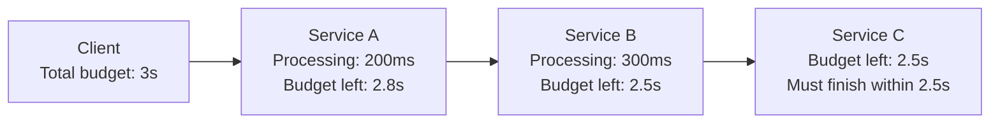
```mermaid
graph LR
    CLIENT["Client<br/>Total budget: 3s"] --> A["Service A<br/>Processing: 200ms<br/>Budget left: 2.8s"]
    A --> B["Service B<br/>Processing: 300ms<br/>Budget left: 2.5s"]
    B --> C["Service C<br/>Budget left: 2.5s<br/>Must finish within 2.5s"]
```

| Timeout Type | What It Controls | Typical Value |
|-------------|-----------------|---------------|
| **Connection timeout** | Time to establish TCP connection | 1-3 seconds |
| **Request timeout** | Time to receive full response | 2-10 seconds (depends on operation) |
| **Deadline / budget** | Total time for the entire call chain | Propagated from client; decremented at each hop |
| **Idle timeout** | Time a connection sits unused before closing | 60-120 seconds |

### gRPC Deadlines (Built-in)

```cpp
// C++ gRPC — deadline propagation is automatic
grpc::ClientContext context;
context.set_deadline(std::chrono::system_clock::now() + std::chrono::seconds(3));

auto status = stub->CreateOrder(&context, request, &response);
if (status.error_code() == grpc::StatusCode::DEADLINE_EXCEEDED) {
    // Handle timeout — do NOT retry blindly
}
```

### REST — Manual Propagation

```
// Caller → Service A
GET /orders/123
X-Request-Deadline: 2026-04-18T10:00:03.000Z    (3s from now)

// Service A → Service B (after 200ms of processing)
GET /payments/order/123
X-Request-Deadline: 2026-04-18T10:00:03.000Z    (same deadline, 2.8s left)
```

Service B checks: `if (now > deadline) return 504 immediately` — no point starting work that the caller will have abandoned.

---

## 6. Pattern 4: Retry with Exponential Backoff + Jitter

### Why Jitter Matters

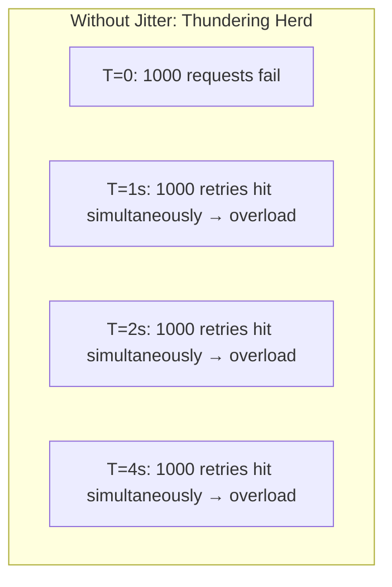
```mermaid
graph TB
    subgraph "Without Jitter: Thundering Herd"
        T1["T=0: 1000 requests fail"]
        T2["T=1s: 1000 retries hit simultaneously → overload"]
        T3["T=2s: 1000 retries hit simultaneously → overload"]
        T4["T=4s: 1000 retries hit simultaneously → overload"]
    end
```

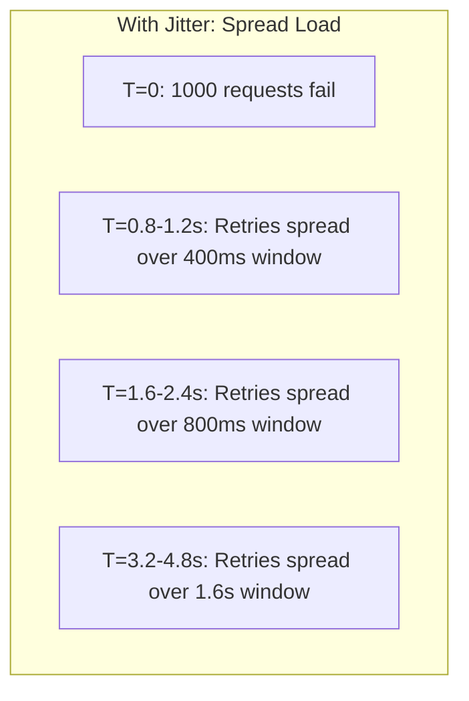
```mermaid
graph TB
    subgraph "With Jitter: Spread Load"
        J1["T=0: 1000 requests fail"]
        J2["T=0.8-1.2s: Retries spread over 400ms window"]
        J3["T=1.6-2.4s: Retries spread over 800ms window"]
        J4["T=3.2-4.8s: Retries spread over 1.6s window"]
    end
```

### Retry Strategy

```
Base delay: 100ms
Multiplier: 2x
Max delay: 10s
Max retries: 3
Jitter: ±50% of delay

Attempt 1: fail → wait 100ms ± 50ms  (50-150ms)
Attempt 2: fail → wait 200ms ± 100ms (100-300ms)
Attempt 3: fail → wait 400ms ± 200ms (200-600ms)
Attempt 4: give up → return error / fallback
```

### When to Retry — When NOT to Retry

| Retry? | Condition | Example |
|--------|-----------|---------|
| **Yes** | Transient error (network blip, 503, timeout) | Connection reset, `503 Service Unavailable` |
| **Yes** | Idempotent operation | `GET /orders/123`, `PUT` with idempotency key |
| **NO** | Client error (4xx) | `400 Bad Request`, `404 Not Found` — retrying won't help |
| **NO** | Non-idempotent without idempotency key | `POST /orders` without idempotency key → duplicate orders |
| **NO** | Circuit breaker is open | Dependency is known to be down — fail fast instead |
| **NO** | Deadline exceeded | No time left — retrying will timeout anyway |

---

## 7. Pattern 5: Fallback Strategies

When the primary path fails, what do you return instead?

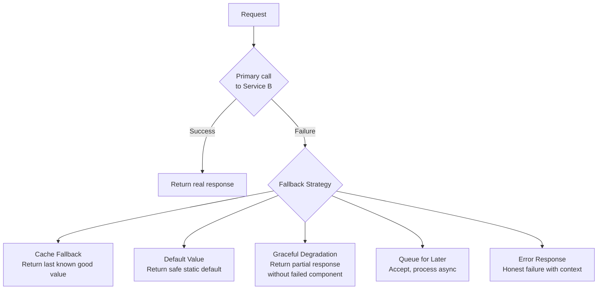
```mermaid
graph TD
    REQ[Request] --> PRIMARY{Primary call<br/>to Service B}
    PRIMARY -- "Success" --> RESPONSE[Return real response]
    PRIMARY -- "Failure" --> FB_STRATEGY{Fallback Strategy}
    
    FB_STRATEGY --> CACHE[Cache Fallback<br/>Return last known good value]
    FB_STRATEGY --> DEFAULT[Default Value<br/>Return safe static default]
    FB_STRATEGY --> DEGRADE[Graceful Degradation<br/>Return partial response<br/>without failed component]
    FB_STRATEGY --> QUEUE_FB[Queue for Later<br/>Accept, process async]
    FB_STRATEGY --> ERROR[Error Response<br/>Honest failure with context]
```

### Fallback Examples

| Service Call | Fallback | User Experience |
|-------------|----------|----------------|
| Product recommendations engine down | Return trending products (precomputed) | "You might like" still shows something |
| Price service slow | Return cached price (last 5 min) | Price may be slightly stale; acceptable |
| User profile service down | Return name + email from JWT claims | Limited profile, but page loads |
| Fraud check timeout | Accept order, queue for async fraud review | Order proceeds; fraud checked later |
| Inventory check unavailable | Show "Check availability in cart" | Deferred check; avoids blocking product page |
| Payment service down | Return 503 with clear message | Honest failure — don't pretend it worked |

### When Fallback is NOT Acceptable

| Scenario | Why No Fallback |
|----------|-----------------|
| **Payment processing** | You can't "fall back" to not charging — either charge or fail |
| **Authentication** | Fallback = bypass auth = security vulnerability |
| **Regulatory data submission** | Must succeed or fail; no approximation allowed |
| **Financial balance query** | Stale balance could authorize an over-withdrawal |

---

## 8. Pattern 6: Load Shedding

When the system is overwhelmed, **deliberately reject some requests** to protect the rest.

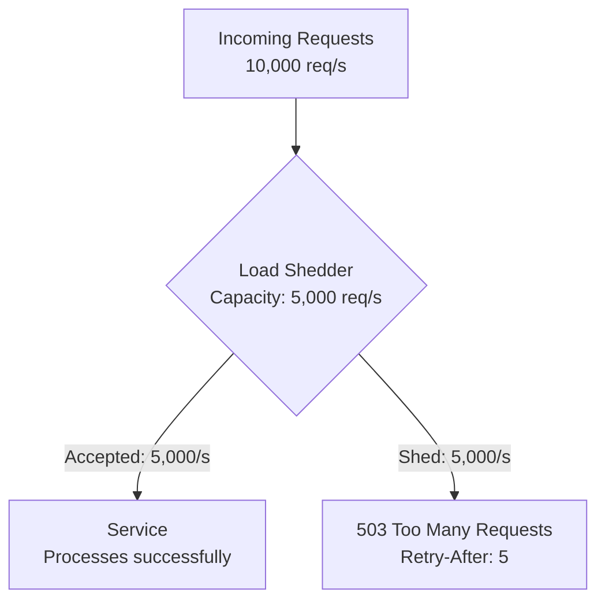
```mermaid
graph TD
    REQ2[Incoming Requests<br/>10,000 req/s] --> SHED{Load Shedder<br/>Capacity: 5,000 req/s}
    SHED -- "Accepted: 5,000/s" --> SERVICE2[Service<br/>Processes successfully]
    SHED -- "Shed: 5,000/s" --> REJECT2[503 Too Many Requests<br/>Retry-After: 5]
```

### Load Shedding Strategies

| Strategy | How It Works | Fairness |
|----------|-------------|----------|
| **Random drop** | Drop N% of incoming requests randomly | Fair — all clients equally affected |
| **Priority-based** | Accept high-priority requests; shed low-priority | Unfair but business-aligned |
| **LIFO (newest first)** | Shed the newest requests; serve the oldest (which have waited longest) | Reduces wasted work |
| **CoDel (Controlled Delay)** | Monitor queue wait time; if consistently > threshold, start shedding | Adaptive — only sheds during real congestion |
| **Client-based quotas** | Per-client limits; shed requests that exceed quota | Fair per-client; prevents one client from starving others |

### Priority-Based Shedding Example

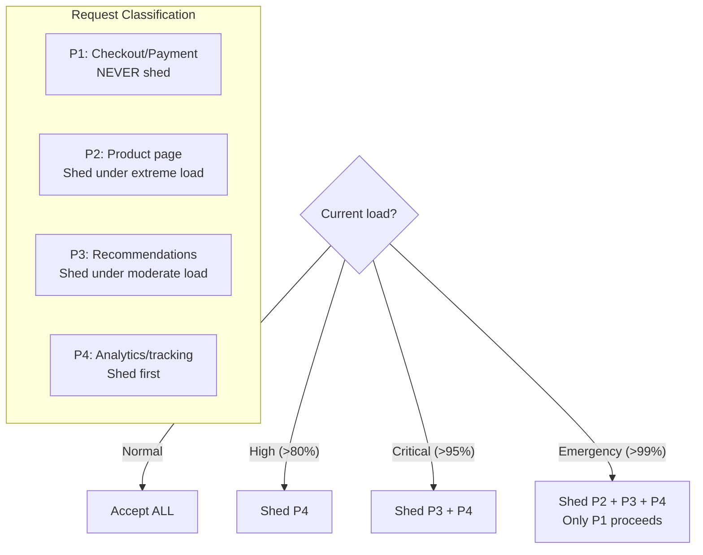
```mermaid
graph TB
    subgraph "Request Classification"
        P1["P1: Checkout/Payment<br/>NEVER shed"]
        P2["P2: Product page<br/>Shed under extreme load"]
        P3["P3: Recommendations<br/>Shed under moderate load"]
        P4["P4: Analytics/tracking<br/>Shed first"]
    end

    LOAD{Current load?}
    LOAD -- "Normal" --> ACCEPT_ALL[Accept ALL]
    LOAD -- "High (>80%)" --> SHED_P4[Shed P4]
    LOAD -- "Critical (>95%)" --> SHED_P3_P4[Shed P3 + P4]
    LOAD -- "Emergency (>99%)" --> SHED_P2_P3_P4[Shed P2 + P3 + P4<br/>Only P1 proceeds]
```

---

## 9. Pattern 7: Backpressure

Instead of shedding requests, **slow down the producer** to match the consumer's capacity.

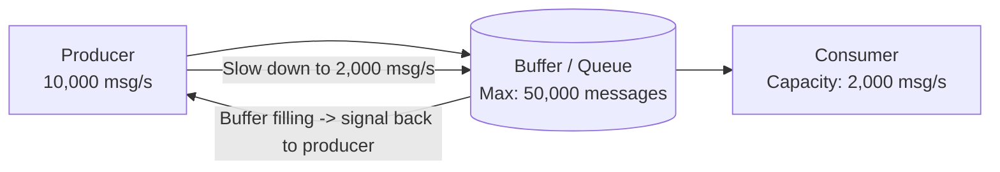
```mermaid
graph LR
    PRODUCER[Producer<br/>10,000 msg/s] --> BUFFER[(Buffer / Queue<br/>Max: 50,000 messages)]
    BUFFER --> CONSUMER[Consumer<br/>Capacity: 2,000 msg/s]
    
    BUFFER -- "Buffer filling -> signal back to producer" --> PRODUCER
    PRODUCER -- "Slow down to 2,000 msg/s" --> BUFFER
```

| Mechanism | How | When |
|-----------|-----|------|
| **Reactive Streams** | Publisher respects subscriber's `request(N)` demand | In-process async pipelines |
| **Kafka consumer lag** | Consumer processes at its own pace; lag is the buffer | Event-driven systems |
| **HTTP 429 + Retry-After** | Server tells client to slow down | REST APIs |
| **gRPC flow control** | HTTP/2 frame-level flow control | Service-to-service gRPC |
| **TCP window** | OS-level congestion control | All TCP communication |

---

## 10. Pattern 8: Hedge Requests

For **latency-sensitive** paths, send the same request to **multiple instances** and take the first response.

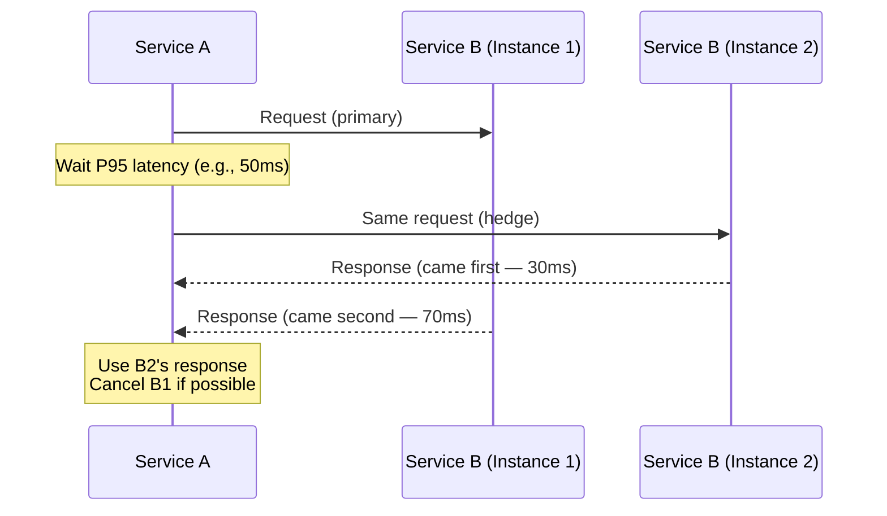
```mermaid
sequenceDiagram
    participant A as Service A
    participant B1 as Service B (Instance 1)
    participant B2 as Service B (Instance 2)

    A->>B1: Request (primary)
    Note over A: Wait P95 latency (e.g., 50ms)
    A->>B2: Same request (hedge)

    B2-->>A: Response (came first — 30ms)
    B1-->>A: Response (came second — 70ms)
    Note over A: Use B2's response<br/>Cancel B1 if possible
```

| Criterion | Assessment |
|-----------|-----------|
| **Benefit** | Dramatically reduces tail latency (P99); avoids one-slow-instance problem |
| **Cost** | Increases load by up to 2× on the downstream service |
| **When** | Only for idempotent reads; only when latency P99 >> P50 |
| **Control** | Trigger hedge only after P95 wait — most requests won't trigger it |
| **Used by** | Google (Tail at Scale paper), AWS DynamoDB internal |

---

## 11. Resiliency at the Infrastructure Level

### Multi-Instance + Health-Aware Routing

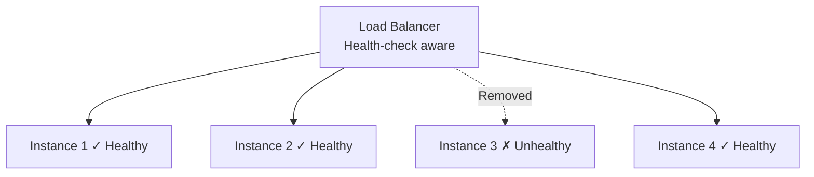
```mermaid
graph TB
    LB[Load Balancer<br/>Health-check aware]
    
    LB --> I1[Instance 1 ✓ Healthy]
    LB --> I2[Instance 2 ✓ Healthy]
    LB -. "Removed" .-> I3[Instance 3 ✗ Unhealthy]
    LB --> I4[Instance 4 ✓ Healthy]
```

### Multi-AZ Deployment

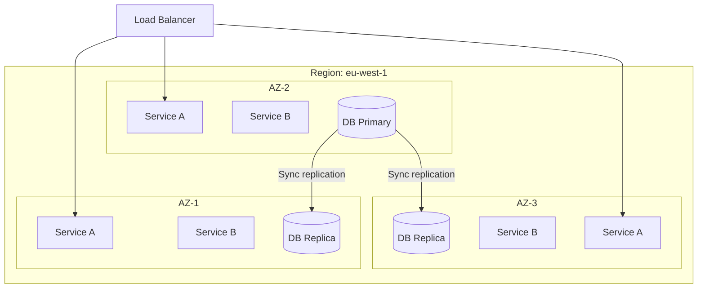
```mermaid
graph TB
    subgraph "Region: eu-west-1"
        subgraph "AZ-1"
            S1A[Service A]
            S1B[Service B]
            DB1[(DB Replica)]
        end
        subgraph "AZ-2"
            S2A[Service A]
            S2B[Service B]
            DB2[(DB Primary)]
        end
        subgraph "AZ-3"
            S3A[Service A]
            S3B[Service B]
            DB3[(DB Replica)]
        end
    end

    LB2[Load Balancer] --> S1A
    LB2 --> S2A
    LB2 --> S3A

    DB2 -- "Sync replication" --> DB1
    DB2 -- "Sync replication" --> DB3
```

| Level | Survives | Cost |
|-------|----------|------|
| **Multi-instance** | Single instance failure | Low (2-3 replicas) |
| **Multi-AZ** | Entire datacenter failure | Medium (cross-AZ traffic) |
| **Multi-region** | Entire region failure | High (data replication, latency) |

---

## 12. Queue-Based Load Leveling

Absorb traffic spikes with a queue — process at a sustainable pace.

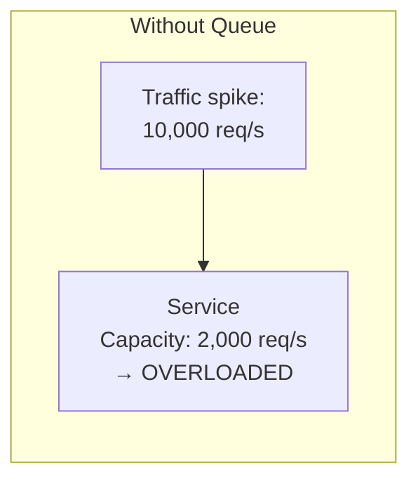
```mermaid
graph LR
    subgraph "Without Queue"
        SPIKE["Traffic spike:<br/>10,000 req/s"] --> SERVICE_D["Service<br/>Capacity: 2,000 req/s<br/>→ OVERLOADED"]
    end
```

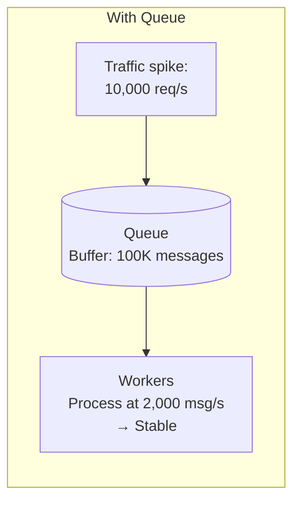
```mermaid
graph LR
    subgraph "With Queue"
        SPIKE2["Traffic spike:<br/>10,000 req/s"] --> Q[(Queue<br/>Buffer: 100K messages)]
        Q --> WORKERS["Workers<br/>Process at 2,000 msg/s<br/>→ Stable"]
    end
```

| Criterion | Assessment |
|-----------|-----------|
| **Trade-off** | Latency increases (queued) but availability is preserved |
| **Backpressure** | Queue depth is the backpressure signal — scale workers or alert if growing |
| **Best for** | Non-real-time workloads: email, notifications, report generation, bulk operations |
| **Not for** | Synchronous request-response where the user is waiting |

---

## 13. Resiliency Testing: Chaos Engineering

You can't be confident in resiliency without **testing failure in production-like environments**.

### The Chaos Hierarchy

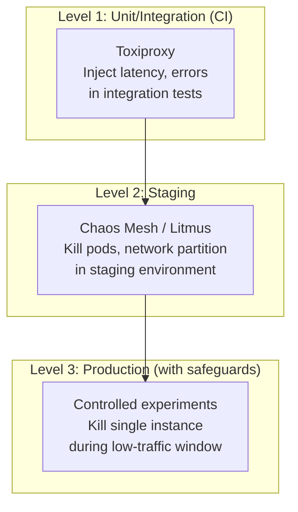
```mermaid
graph TB
    subgraph "Level 1: Unit/Integration (CI)"
        TOXI[Toxiproxy<br/>Inject latency, errors<br/>in integration tests]
    end

    subgraph "Level 2: Staging"
        CHAOS_STAGING[Chaos Mesh / Litmus<br/>Kill pods, network partition<br/>in staging environment]
    end

    subgraph "Level 3: Production (with safeguards)"
        CHAOS_PROD[Controlled experiments<br/>Kill single instance<br/>during low-traffic window]
    end

    TOXI --> CHAOS_STAGING --> CHAOS_PROD
```

### Chaos Experiments

| Experiment | What It Tests | Expected Outcome |
|-----------|---------------|-----------------|
| **Kill a service instance** | Auto-restart + health-check routing | Traffic reroutes; no user-visible error |
| **Inject 5s latency to dependency** | Timeout + circuit breaker + fallback | Fast failure; fallback response; no cascade |
| **Simulate dependency returning 500s** | Circuit breaker trips; fallback activates | Fallback served after threshold; recovery when dependency heals |
| **Fill disk on a database node** | Database failover to replica | Writes continue on new primary; brief latency spike |
| **Network partition between AZs** | Multi-AZ resilience | Traffic stays within healthy AZs |
| **Exhaust connection pool** | Bulkhead limits blast radius | Only calls to affected dependency fail; others unaffected |
| **CPU stress on one instance** | Auto-scaling / load shedding | Autoscaler adds instances; or instance removed from LB |

### Chaos in Integration Tests (Toxiproxy)

```mermaid
graph LR
    TEST[Integration Test] --> SERVICE[Service Under Test]
    SERVICE --> TOXI2[Toxiproxy<br/>Port 9090]
    TOXI2 -- "Normal" --> DEP[Dependency<br/>Port 8080]
    
    TEST -- "Configure: add 5s latency" --> TOXI2
    TEST -- "Assert: service returns fallback within timeout" --> SERVICE
```

---

## 14. Combining Patterns: The Resilient Call Stack

```mermaid
graph TD
    REQ3[Incoming Request] --> SHED2{Load Shedder<br/>Capacity OK?}
    SHED2 -- "Over capacity" --> R503[503 + Retry-After]
    SHED2 -- "OK" --> BH2{Bulkhead<br/>Threads available?}
    
    BH2 -- "Pool exhausted" --> R503_2[503 Bulkhead Full]
    BH2 -- "OK" --> CB2{Circuit Breaker<br/>State?}
    
    CB2 -- "Open" --> FALLBACK2[Return Fallback<br/>1ms]
    CB2 -- "Closed/Half-Open" --> TIMEOUT{Call with Timeout<br/>+ Deadline}
    
    TIMEOUT -- "Success" --> RESPOND[Return response]
    TIMEOUT -- "Timeout / Error" --> RETRY2{Retryable?<br/>Idempotent? Retries left?}
    
    RETRY2 -- "Yes" --> BACKOFF[Wait: backoff + jitter]
    BACKOFF --> TIMEOUT
    RETRY2 -- "No / Exhausted" --> FALLBACK3[Return Fallback<br/>or Error]
    
    FALLBACK3 --> RECORD2[Record failure<br/>→ may trip circuit breaker]
```

### Pattern Interaction Order

```
1. Load Shedding      — Reject if system is overwhelmed (protect self)
2. Bulkhead           — Isolate call to its own resource pool (protect others)
3. Circuit Breaker    — Fail fast if dependency is known-broken (protect dependency)
4. Timeout            — Don't wait forever (protect threads)
5. Retry + Backoff    — Recover from transient failures (self-healing)
6. Fallback           — Serve something useful when all else fails (protect user experience)
```

---

## 15. Comparison: Pattern Applicability

| Pattern | Protects Against | Adds Latency? | Complexity |
|---------|-----------------|---------------|-----------|
| **Timeout** | Slow dependencies; thread starvation | No (reduces latency) | Low |
| **Circuit Breaker** | Cascading failures from broken dependency | No (reduces — fail fast) | Low-Medium |
| **Bulkhead** | One dependency consuming all resources | No | Medium |
| **Retry + Backoff** | Transient failures | Yes (retry delay) | Low |
| **Fallback** | Any dependency failure | No | Low-Medium |
| **Load Shedding** | System overload | No (instant reject) | Medium |
| **Backpressure** | Producer overwhelming consumer | Yes (queuing delay) | Medium |
| **Hedge Requests** | Tail latency from slow instances | No (reduces P99) | Medium |
| **Queue-Based Leveling** | Traffic spikes | Yes (queuing delay) | Medium |

---

## 16. Implementation Matrix by Language

| Pattern | Java | .NET | C++ | Infrastructure |
|---------|------|------|-----|---------------|
| **Circuit Breaker** | Resilience4j | Polly | Custom / Envoy sidecar | Istio `DestinationRule` |
| **Bulkhead** | Resilience4j Bulkhead | Polly Bulkhead | Thread pool per client | Envoy `circuitBreakers.maxConnections` |
| **Retry** | Resilience4j / Spring Retry | Polly Retry | Custom / gRPC retry policy | Istio `VirtualService.retries` |
| **Timeout** | `HttpClient` timeout / Resilience4j | `HttpClient.Timeout` / Polly | gRPC deadline / `std::chrono` | Istio `timeout` |
| **Rate Limit** | Bucket4j / Resilience4j | AspNetCoreRateLimit | Token bucket custom | Envoy rate limit filter |
| **Fallback** | Resilience4j `.fallback()` | Polly `.Fallback()` | Custom | N/A (application-level) |

### Service Mesh Alternative (No Code Changes)

```yaml
# Istio DestinationRule — infrastructure-level resiliency
apiVersion: networking.istio.io/v1beta1
kind: DestinationRule
metadata:
  name: payment-service
spec:
  host: payment-service
  trafficPolicy:
    connectionPool:
      tcp:
        maxConnections: 100      # Bulkhead
      http:
        h2UpgradePolicy: DEFAULT
        maxRequestsPerConnection: 10
    outlierDetection:              # Circuit Breaker
      consecutive5xxErrors: 5
      interval: 10s
      baseEjectionTime: 30s
      maxEjectionPercent: 50
---
apiVersion: networking.istio.io/v1beta1
kind: VirtualService
metadata:
  name: payment-service
spec:
  hosts:
    - payment-service
  http:
    - timeout: 3s                  # Timeout
      retries:                     # Retry
        attempts: 3
        perTryTimeout: 1s
        retryOn: 5xx,reset,connect-failure
```

Resiliency applied to **all calls to payment-service** — zero application code changes.

---

## 17. Observability for Resiliency

| Metric | What It Tells You | Alert When |
|--------|------------------|-----------|
| **Circuit breaker state transitions** | Dependency health over time | Any transition to OPEN |
| **Fallback invocation rate** | How often degraded mode activates | Rising trend (dependency deteriorating) |
| **Retry rate** | Transient failure frequency | Retry rate > 10% (persistent problem, not transient) |
| **Bulkhead rejection rate** | Resource saturation per dependency | Any rejections (pool too small or dependency too slow) |
| **Timeout rate** | Dependency latency issues | > 1% of calls timing out |
| **Load shed rate** | System capacity vs demand | Any shedding (need to scale or investigate) |
| **P99 latency** | Tail latency (user-visible impact) | > SLO target |
| **Queue depth** | Backpressure pressure | Growing trend (consumer falling behind) |

```mermaid
graph LR
    subgraph "Grafana Dashboard: Resiliency Panel"
        CB_STATE["Circuit Breaker State<br/>CLOSED ✓ / OPEN ⚠️ / HALF-OPEN 🔄"]
        FB_RATE["Fallback Rate: 2.3%"]
        RETRY_RATE["Retry Rate: 0.8%"]
        BH_USAGE["Bulkhead Usage: 45/100 threads"]
        SHED_RATE["Load Shed Rate: 0%"]
    end
```

---

## 18. Anti-Patterns

| Anti-Pattern | Consequence |
|--------------|------------|
| **No timeouts on outbound calls** | One slow dependency locks up all threads → cascading failure |
| **Retry without backoff** | Thundering herd → overwhelm recovering dependency |
| **Retry non-idempotent operations** | Duplicate orders, double charges, double emails |
| **Circuit breaker with no fallback** | Fast failure is better than slow failure, but returning an error still degrades UX |
| **Same timeout for all calls** | 30s timeout for a health check; 1s timeout for a batch job — both wrong |
| **Bulkhead pools too large** | No actual isolation — all pools exhaust together |
| **Fallback that calls another service** | Fallback to Service C when Service B is down — but what if C is also affected? |
| **Load shedding without priority** | Checkout requests shed alongside analytics pings |
| **Never testing failure paths** | "We have circuit breakers" — but nobody has verified they actually work |
| **Resilience in code only, not infrastructure** | Code-level circuit breaker but no health checks → LB sends traffic to dead instances |

---

## 19. Recommendation: Minimum Viable Resiliency

| Pattern | Priority | Effort | Impact |
|---------|----------|--------|--------|
| **Timeout on every outbound call** | **P0** | Low | Prevents thread starvation — the #1 cascade cause |
| **Health checks (liveness + readiness)** | **P0** | Low | LB stops routing to broken instances |
| **Circuit breaker on critical dependencies** | **P0** | Low-Medium | Stops cascade from failed/slow dependency |
| **Retry + exponential backoff + jitter** | **P1** | Low | Self-healing for transient failures |
| **Bulkhead isolation** | **P1** | Medium | Contains blast radius per dependency |
| **Fallback for non-critical data** | **P1** | Medium | Graceful degradation instead of hard errors |
| **Graceful shutdown** | **P1** | Low | Zero dropped requests during deployments/restarts |
| **Load shedding** | **P2** | Medium | Protects system under extreme load |
| **Chaos testing** | **P2** | Medium | Validates that all the above actually work |
| **Hedge requests** | **P3** | Medium | Tail latency optimization for critical paths |

---

## 20. Practical Checklist

```
Every Outbound Call:
[ ] Timeout configured (connection + request)
[ ] Circuit breaker wrapping the call
[ ] Retry with exponential backoff + jitter (idempotent calls only)
[ ] Fallback defined (cache, default, degraded, or honest error)
[ ] Bulkhead isolation (separate thread/connection pool per dependency)

Service Level:
[ ] Health check: /healthz (liveness — process alive, not deadlocked)
[ ] Health check: /readyz (readiness — dependencies reachable, can handle traffic)
[ ] Graceful shutdown: drain in-flight requests on SIGTERM
[ ] Load shedding: reject above capacity with 503 + Retry-After
[ ] Priority classification for requests (P1-P4)

Infrastructure Level:
[ ] Multi-instance deployment (minimum 3 replicas for critical services)
[ ] Multi-AZ for production workloads
[ ] Auto-scaling configured (CPU, queue depth, custom metrics)
[ ] Health-aware load balancing (remove unhealthy instances)

Observability:
[ ] Circuit breaker state transitions tracked and alerted
[ ] Fallback invocation rate on dashboard
[ ] Timeout and retry rates monitored
[ ] SLO burn rate alerting (not just raw threshold alerts)

Testing:
[ ] Toxiproxy in integration tests: inject latency, errors, connection drops
[ ] Circuit breaker verified: trips at threshold, recovers on probe success
[ ] Fallback verified: returns meaningful data when dependency is down
[ ] Chaos experiments in staging: kill instances, inject latency
[ ] Load test verifies load shedding activates correctly
```

---

## 21. Next Steps

1. **What are your critical dependencies?** — Database? External API (Stripe, etc.)? Other services?
2. **Current failure mode?** — Have you experienced cascading failures? What triggered them?
3. **Language/framework?** — Determines library choices (Resilience4j, Polly, Istio).
4. **Are you on a service mesh?** — Moves many patterns to infrastructure level.
5. **What are your SLOs?** — 99.9% availability? P99 < 200ms? Drives how aggressively you need to implement.
6. **Do you have chaos testing today?** — If not, that's a gap worth closing early.
