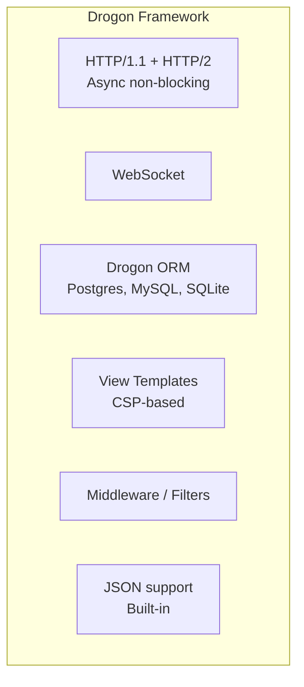
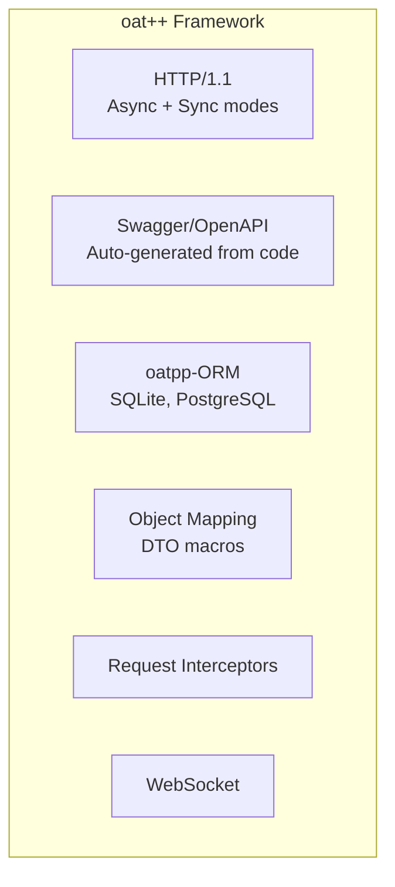
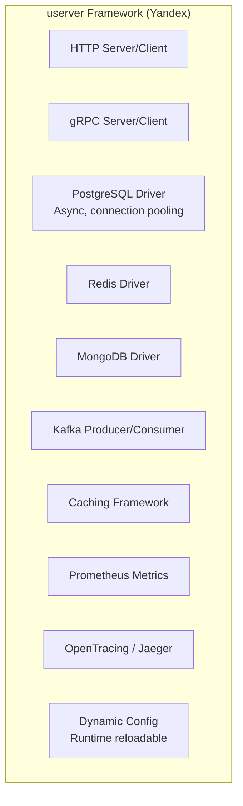
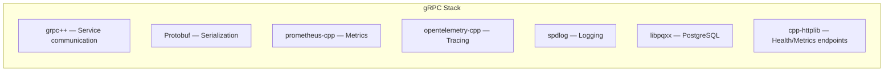
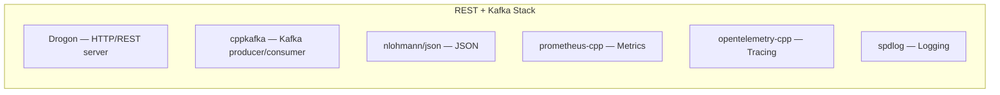
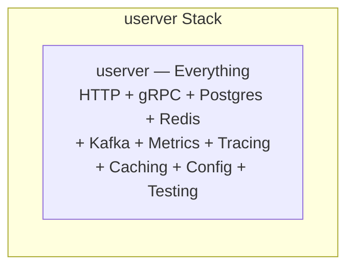
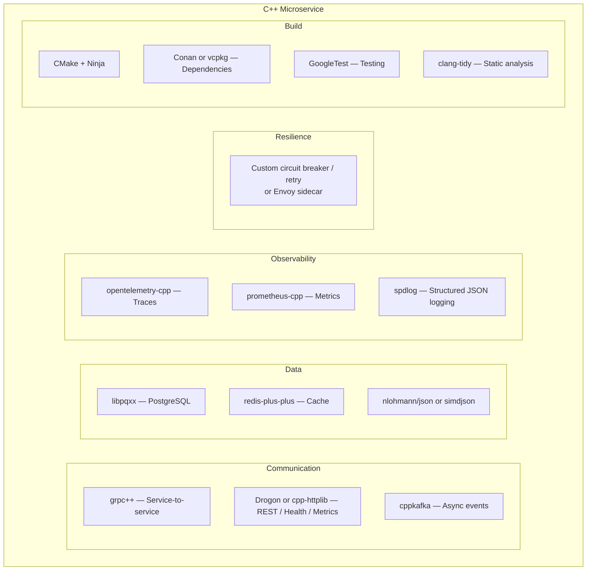

# What are C++ Frameworks you can use to create Microservices?

C++ microservice frameworks differ fundamentally from Java/Spring or .NET/ASP.NET ecosystems — there's no single dominant framework. Instead, you compose from **focused, high-performance libraries**, each excelling at one thing. The trade-off is always between **raw performance** and **developer productivity / ecosystem richness**.

The C++ microservices landscape splits into two categories: **full frameworks** (opinionated, batteries-included) and **composable libraries** (pick the best tool per concern).

---

## 1. Full Frameworks

### Framework A: Drogon



| Criterion | Assessment |
|-----------|-----------|
| **Type** | Full async web framework (like Express or Spring Boot for C++) |
| **I/O model** | Non-blocking, event-loop based (epoll/kqueue) |
| **Performance** | Top-tier — consistently in TechEmpower top 10 |
| **ORM** | Built-in (Postgres, MySQL, SQLite); coroutine-based async queries |
| **HTTP** | HTTP/1.1, HTTP/2, WebSocket, HTTPS |
| **Coroutines** | C++20 coroutines supported for async handlers |
| **Build** | CMake; vcpkg/Conan packages available |
| **Learning curve** | Medium — familiar MVC pattern; good documentation |
| **Community** | Active; 12K+ GitHub stars |
| **Best for** | REST API microservices needing a full framework with ORM and middleware |

**Example handler:**

```cpp
// Drogon controller with C++20 coroutines
#include <drogon/drogon.h>

class OrderController : public drogon::HttpController<OrderController> {
public:
    METHOD_LIST_BEGIN
    ADD_METHOD_TO(OrderController::getOrder, "/orders/{id}", Get);
    ADD_METHOD_TO(OrderController::createOrder, "/orders", Post);
    METHOD_LIST_END

    Task<> getOrder(HttpRequestPtr req,
                    std::function<void(const HttpResponsePtr&)> callback,
                    std::string id) {
        auto db = drogon::app().getDbClient();
        auto result = co_await db->execSqlCoro(
            "SELECT * FROM orders WHERE id = $1", id);

        auto resp = HttpResponse::newHttpJsonResponse(toJson(result));
        callback(resp);
    }
};
```

### Framework B: oat++ (Oatpp)



| Criterion | Assessment |
|-----------|-----------|
| **Type** | Full web framework with strong API-first design |
| **Standout feature** | **Auto-generated Swagger/OpenAPI** from C++ code — unique in the C++ ecosystem |
| **I/O model** | Async (non-blocking) and sync (simple) modes |
| **DTO system** | Macro-based DTOs with auto JSON serialization |
| **HTTP** | HTTP/1.1; HTTPS via MbedTLS or LibreSSL |
| **Build** | CMake; modular (oatpp-swagger, oatpp-postgresql, oatpp-websocket) |
| **Learning curve** | Medium — well-documented; tutorial-oriented |
| **Community** | Active; 8K+ GitHub stars |
| **Best for** | API-first microservices where Swagger docs are critical; teams coming from Java/Spring |

**Example:**

```cpp
// oat++ DTO with auto Swagger generation
#include "oatpp/macro/codegen.hpp"
#include OATPP_CODEGEN_BEGIN(DTO)

class OrderDto : public oatpp::DTO {
    DTO_INIT(OrderDto, DTO)
    DTO_FIELD(String, id);
    DTO_FIELD(String, customerId);
    DTO_FIELD(Float64, total);
    DTO_FIELD(String, status);
};

#include OATPP_CODEGEN_END(DTO)

// Controller — auto-generates OpenAPI spec
#include OATPP_CODEGEN_BEGIN(ApiController)

ENDPOINT("GET", "/orders/{id}", getOrder,
         PATH(String, id)) {
    auto order = m_orderService->getById(id);
    return createDtoResponse(Status::CODE_200, order);
}

#include OATPP_CODEGEN_END(ApiController)
```

### Framework C: userver



| Criterion | Assessment |
|-----------|-----------|
| **Type** | Production-grade microservice framework (battle-tested at Yandex scale) |
| **Standout feature** | Most complete C++ microservice framework — comparable to Spring Boot in scope |
| **I/O model** | Coroutine-based (stackful); write sync-looking code, runs async |
| **Drivers** | Built-in async drivers: PostgreSQL, Redis, MongoDB, Kafka, gRPC, HTTP |
| **Observability** | Built-in Prometheus metrics, Jaeger tracing, structured logging |
| **Testing** | Built-in test framework for unit and integration tests |
| **Build** | CMake; heavy dependency tree; Docker recommended |
| **Learning curve** | High — large framework; Yandex-style conventions |
| **Best for** | Large-scale production microservices; teams willing to invest in framework mastery |

**Example:**

```cpp
// userver HTTP handler with PostgreSQL
#include <userver/server/handlers/http_handler_json_base.hpp>
#include <userver/storages/postgres/cluster.hpp>

class OrderHandler final : public server::handlers::HttpHandlerJsonBase {
public:
    static constexpr std::string_view kName = "handler-orders";

    formats::json::Value HandleRequestJsonThrow(
        const server::http::HttpRequest& request,
        const formats::json::Value& body,
        server::request::RequestContext&) const override {

        auto id = request.GetPathArg("id");
        auto result = pg_cluster_->Execute(
            storages::postgres::ClusterHostType::kSlave,
            "SELECT id, customer_id, total, status FROM orders WHERE id = $1",
            id);

        return formats::json::ValueBuilder(result.AsSingleRow<OrderDto>()).ExtractValue();
    }

private:
    storages::postgres::ClusterPtr pg_cluster_;
};
```

---

## 2. Composable Libraries (Build Your Own Stack)

### Library A: gRPC (grpc++)

| Criterion | Assessment |
|-----------|-----------|
| **Protocol** | HTTP/2 + Protobuf |
| **Type** | RPC framework — service-to-service communication |
| **Code generation** | `.proto` → C++ stubs (server + client) |
| **Streaming** | Unary, server, client, and bidirectional streaming |
| **Ecosystem** | Massive — polyglot interop (Java, .NET, Go, Python) |
| **Async** | Completion queue (callback) or C++20 coroutines (experimental) |
| **Best for** | Internal service-to-service communication; polyglot environments |

### Library B: Boost.Beast / Boost.Asio

| Criterion | Assessment |
|-----------|-----------|
| **Type** | Low-level HTTP/WebSocket on top of Boost.Asio |
| **Control** | Maximum — you build exactly what you need |
| **Performance** | Excellent — close to raw socket performance |
| **Learning curve** | High — Asio's async model requires deep understanding |
| **Best for** | Custom protocols; extreme performance; teams comfortable with Boost |

### Library C: cpp-httplib

| Criterion | Assessment |
|-----------|-----------|
| **Type** | Single-header HTTP/HTTPS client+server |
| **Simplicity** | Maximum — ~3 lines to create an HTTP server |
| **Threading** | Thread-per-request (blocking) |
| **Performance** | Moderate — fine for non-high-throughput services |
| **Best for** | Quick REST endpoints; health checks; metrics; prototyping |

```cpp
// cpp-httplib — simplest possible HTTP service
#include "httplib.h"

int main() {
    httplib::Server svr;

    svr.Get("/healthz", [](const auto& req, auto& res) {
        res.set_content(R"({"status":"ok"})", "application/json");
    });

    svr.Get(R"(/orders/(\d+))", [](const auto& req, auto& res) {
        auto id = req.matches[1];
        // ... fetch order ...
        res.set_content(order_json, "application/json");
    });

    svr.listen("0.0.0.0", 8080);
}
```

### Library D: Crow / Crow-cpp

| Criterion | Assessment |
|-----------|-----------|
| **Type** | Flask/Express-like micro web framework |
| **Routing** | Decorator-style (like Python Flask) |
| **Middleware** | Built-in support |
| **JSON** | Built-in JSON handling |
| **Performance** | Good |
| **Best for** | REST APIs; developers coming from Python/Node wanting familiar patterns |

```cpp
// Crow — Flask-like API
#include "crow.h"

int main() {
    crow::SimpleApp app;

    CROW_ROUTE(app, "/orders/<int>")
    ([](int id) {
        crow::json::wvalue result;
        result["id"] = id;
        result["status"] = "confirmed";
        return result;
    });

    app.port(8080).multithreaded().run();
}
```

### Library E: librdkafka / cppkafka

| Criterion | Assessment |
|-----------|-----------|
| **Type** | Kafka client (C core + C++ wrapper) |
| **Performance** | Highest throughput Kafka client across all languages |
| **Features** | Producer, consumer, admin, transactions, exactly-once semantics |
| **Best for** | Event-driven microservices; high-throughput message processing |

### Library F: Pistache

| Criterion | Assessment |
|-----------|-----------|
| **Type** | REST framework built on Asio |
| **Async** | Built-in async handlers |
| **Routing** | Express-like route definitions |
| **Performance** | Good |
| **Maturity** | Less active than Drogon/oatpp |
| **Best for** | Lightweight REST APIs |

---

## 3. Supporting Libraries (Cross-Cutting Concerns)

| Concern | Library | Notes |
|---------|---------|-------|
| **Serialization (JSON)** | nlohmann/json, simdjson, rapidjson | nlohmann: easy; simdjson: fastest parser; rapidjson: fast + DOM/SAX |
| **Serialization (Binary)** | Protobuf, FlatBuffers, Cap'n Proto, MessagePack | Protobuf: standard with gRPC; FlatBuffers: zero-copy |
| **Logging** | spdlog, glog | spdlog: fast, header-optional; glog: Google's, verbose by default |
| **Metrics** | prometheus-cpp | Prometheus exposition format; counters, histograms, gauges |
| **Tracing** | opentelemetry-cpp | OTel standard; OTLP exporter; context propagation |
| **HTTP Client** | cpp-httplib, cpr, Boost.Beast | cpr: curl wrapper, simple API |
| **Database (Postgres)** | libpqxx, pqxx | Async support; connection pooling |
| **Database (General)** | SOCI, sqlpp11 | SOCI: multi-DB; sqlpp11: type-safe SQL |
| **Redis** | hiredis, redis-plus-plus | redis-plus-plus: modern C++ wrapper |
| **Config** | yaml-cpp, toml++, CLI11 | yaml-cpp: YAML parsing; CLI11: command-line args |
| **Testing** | GoogleTest, Catch2, doctest | GoogleTest: standard; Catch2: header-only; doctest: lightweight |
| **Dependency Injection** | Boost.DI, fruit | fruit: Google's compile-time DI |
| **Service Discovery** | consul-cpp (custom) | No dominant library; use DNS-based or HTTP/REST to Consul API |

---

## 4. Comparison: Full Frameworks

| Criterion | Drogon | oat++ | userver |
|-----------|--------|-------|---------|
| **Maturity** | High (since 2018) | High (since 2018) | High (Yandex production since 2018; open-sourced 2022) |
| **Performance** | Top-tier (TechEmpower) | Good | Top-tier |
| **Async model** | Event loop + C++20 coroutines | Custom async / sync | Stackful coroutines (sync-looking code) |
| **ORM** | Built-in | Built-in | Built-in (Postgres, Redis, Mongo) |
| **gRPC** | No (HTTP only) | No | Built-in |
| **Kafka** | No | No | Built-in |
| **OpenAPI/Swagger** | No (third-party) | **Built-in auto-generation** | No |
| **Observability** | Manual (add OTel/prometheus-cpp) | Manual | **Built-in** (Prometheus + Jaeger) |
| **Dynamic config** | Manual | Manual | **Built-in** (runtime reloadable) |
| **Testing framework** | Manual (GoogleTest) | Manual | **Built-in** |
| **Docker/K8s ready** | Easy | Easy | Heavier setup |
| **Documentation** | Good | Good | Good (but complex) |
| **Community** | Large (12K+ stars) | Medium (8K+ stars) | Growing (3K+ stars) |
| **C++ standard** | C++17 / C++20 | C++11+ | C++17 / C++20 |
| **Best for** | High-perf REST APIs | API-first with Swagger | Full microservice platform |

---

## 5. Comparison: Composable Stacks

### Stack 1: gRPC-Centric (Internal Services)



| Best for | Internal service-to-service; polyglot environment; high throughput |
|----------|-------------------------------------------------------------------|
| **Pros** | Strong contracts (`.proto`); polyglot interop; streaming; code-gen |
| **Cons** | No browser support without grpc-web proxy; need separate HTTP for health/metrics |

### Stack 2: REST + Event-Driven (External-Facing)



| Best for | External-facing APIs + async event processing |
|----------|-----------------------------------------------|
| **Pros** | REST for clients; Kafka for integration; Drogon's performance |
| **Cons** | More glue code than a full framework like userver |

### Stack 3: All-in-One (userver)



| Best for | Teams committing fully to C++ microservices; large-scale systems |
|----------|---------------------------------------------------------------|
| **Pros** | Everything integrated; consistent APIs; production battle-tested at Yandex |
| **Cons** | Large framework; steep learning curve; harder to mix with alternative libraries |

---

## 6. Decision Matrix

| Scenario | Recommended | Why |
|----------|------------|-----|
| **REST API, need Swagger docs** | oat++ | Only C++ framework with auto-generated OpenAPI |
| **Highest HTTP performance** | Drogon | TechEmpower top results; C++20 coroutines |
| **Full microservice platform** (Postgres + Redis + Kafka + gRPC) | userver | Most complete; built-in drivers and observability |
| **Internal service-to-service** (polyglot system) | gRPC (grpc++) | Language-neutral `.proto` contracts; streaming |
| **Minimal REST endpoint** (health, config, admin) | cpp-httplib | Single header; zero setup |
| **Flask-like developer experience** | Crow | Familiar decorator-style routing |
| **Event-driven, high-throughput message processing** | librdkafka + minimal HTTP | Best Kafka client; focus on throughput |
| **Extreme low-latency** (HFT, gaming, embedded) | Boost.Beast + custom | Maximum control; zero overhead |
| **Prototype / quick PoC** | Crow or cpp-httplib | Fastest time to "Hello World" |

---

## 7. Typical Production Stack



---

## 8. Build Integration (CMakeLists.txt Example)

```cmake
cmake_minimum_required(VERSION 3.24)
project(order-service VERSION 2.1.0 LANGUAGES CXX)

set(CMAKE_CXX_STANDARD 20)
set(CMAKE_CXX_STANDARD_REQUIRED ON)

find_package(Protobuf REQUIRED)
find_package(gRPC REQUIRED)
find_package(spdlog REQUIRED)
find_package(prometheus-cpp REQUIRED)
find_package(opentelemetry-cpp REQUIRED)
find_package(nlohmann_json REQUIRED)
find_package(libpqxx REQUIRED)
find_package(GTest REQUIRED)

# Proto generation
add_library(order_proto
    proto/order_service.proto
)
protobuf_generate(TARGET order_proto LANGUAGE cpp)
protobuf_generate(TARGET order_proto LANGUAGE grpc
    GENERATE_EXTENSIONS .grpc.pb.h .grpc.pb.cc
    PLUGIN "protoc-gen-grpc=$<TARGET_FILE:gRPC::grpc_cpp_plugin>")

# Service binary
add_executable(order-service
    src/main.cpp
    src/server.cpp
    src/handlers/order_handler.cpp
    src/domain/order_service.cpp
    src/infra/order_repository.cpp
    src/observability/metrics.cpp
    src/observability/tracing.cpp
)
target_link_libraries(order-service PRIVATE
    order_proto
    gRPC::grpc++
    spdlog::spdlog
    prometheus-cpp::pull
    opentelemetry-cpp::otel_sdk
    nlohmann_json::nlohmann_json
    libpqxx::pqxx
)

# Health check binary (lightweight)
add_executable(healthcheck src/healthcheck.cpp)
target_link_libraries(healthcheck PRIVATE httplib::httplib)

# Tests
enable_testing()
add_executable(order_tests
    tests/unit/order_service_test.cpp
    tests/unit/order_handler_test.cpp
)
target_link_libraries(order_tests PRIVATE GTest::gtest_main order_service_lib)
gtest_discover_tests(order_tests)
```

---

## 9. Anti-Patterns

| Anti-Pattern | Consequence |
|--------------|------------|
| **Building everything from scratch** | Reinventing HTTP parsing, JSON handling, connection pooling — months of work, bugs, no community support |
| **Choosing a framework for benchmarks alone** | TechEmpower #1 doesn't matter if the framework can't handle your actual needs (ORM, auth, middleware) |
| **Using Boost.Beast for a CRUD REST API** | Over-engineered; Drogon or oatpp gives you 90% less code for the same result |
| **No dependency manager** (manual vendoring) | Dependency updates become a multi-day project; security patches delayed |
| **Ignoring observability libraries** | "We'll add metrics later" → first production incident has zero data |
| **Single-threaded event loop without profiling** | One slow handler blocks all requests — need to understand the concurrency model |
| **Using C++ when Java/.NET would suffice** | C++ microservices only justified for latency, throughput, memory, or resource constraints that the JVM can't meet |

---

## 10. When C++ Microservices Make Sense

| Justified | Not Justified |
|-----------|---------------|
| **Ultra-low latency** (< 1ms P99) — HFT, gaming, real-time systems | CRUD APIs with moderate traffic |
| **High throughput** (millions of req/s per instance) | Standard business logic services |
| **Memory-constrained** (IoT, edge computing) | Cloud services with elastic scaling |
| **Compute-intensive** (video encoding, ML inference, simulation) | Data transformation pipelines |
| **Existing C++ codebase / team expertise** | Greenfield with Java/.NET/Go team |
| **Polyglot service wrapping C/C++ libraries** | Services that primarily do I/O, not compute |

---

## 11. Next Steps

1. **What's the primary communication pattern?** — REST, gRPC, Kafka, or mixed?
2. **What databases do you use?** — Postgres, Redis, MongoDB? Drives driver selection.
3. **How many C++ services?** — One in a polyglot system, or all-C++?
4. **Team's C++ experience level?** — Determines framework complexity tolerance.
5. **Performance requirements?** — If latency/throughput is the driver, it shapes whether you need Drogon-level performance or cpp-httplib simplicity suffices.
6. **Do you need OpenAPI/Swagger?** — If yes, oat++ is the clear choice.
