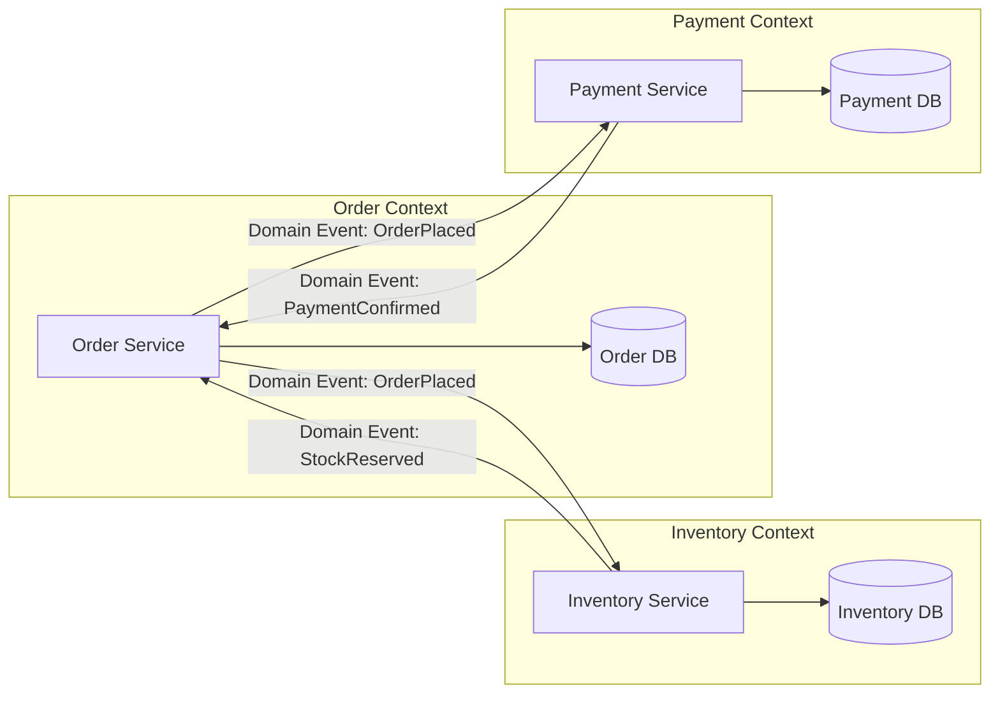

## How to ensure that Microservices are loosely coupled and highly cohesive?

---

## 1. Coupling & Cohesion: The Forces at Play

| Property | Goal | Violation Symptom |
|----------|------|-------------------|
| **Loose coupling** | Services change independently without cascading failures or coordinated deployments | One service change forces redeployment of others; runtime failure cascades |
| **High cohesion** | Each service owns a single business capability end-to-end | A feature change requires touching 3+ services; "anemic" services that just proxy calls |

---

## 2. Key Strategies (with Trade-offs)

### A. Service Boundary Design

| Approach | Description | Coupling Risk | Cohesion Risk |
|----------|-------------|---------------|---------------|
| **DDD Bounded Contexts** | Align each service to a bounded context with its own ubiquitous language and domain model | Low — explicit context maps define integration points | Low — each context owns its domain logic end-to-end |
| **Entity-per-service** | One service per database entity (e.g., `UserService`, `OrderService`) | **High** — CRUD services need each other to do anything useful | **High** — logic scatters across services for a single use case |

**Recommendation:** Use Bounded Contexts. Apply **Context Mapping** patterns (Anti-Corruption Layer, Conformist, Published Language) to define how contexts interact.



### B. Communication Style

| Approach | Coupling Level | Trade-off |
|----------|---------------|-----------|
| **Synchronous (REST/gRPC)** | Temporal + behavioral coupling — caller blocks, must know the contract | Simple to reason about; harder to scale; cascading failures via call chains |
| **Asynchronous (Events/Messages)** | Only data-contract coupling — producer doesn't know consumers | Better resilience and scalability; harder to debug; eventual consistency |
| **Choreography (event-driven)** | Each service reacts to events independently | Lowest coupling; harder to trace end-to-end flows |
| **Orchestration (saga coordinator)** | Central coordinator knows the workflow | Easier to reason about; coordinator becomes a coupling point |

**Recommendation:** Default to **async events for cross-context communication** and reserve sync calls for queries within the same bounded context or BFF (Backend-for-Frontend) aggregation.

### C. Data Ownership — Database per Service

This is non-negotiable for loose coupling:

| Pattern | Description |
|---------|-------------|
| **Database per service** | Each service owns its schema; no shared tables |
| **No shared databases** | Cross-service data access only via APIs or events |
| **Data duplication is OK** | Services maintain local read-optimized projections of data they need |

Shared databases are the #1 source of hidden coupling. The moment two services read/write the same table, you have a distributed monolith.

### D. Contract Design

| Strategy | Effect on Coupling |
|----------|-------------------|
| **Consumer-Driven Contracts (Pact)** | Consumers define what they need; producers verify compatibility |
| **Tolerant Reader pattern** | Consumers ignore unknown fields — additive changes don't break them |
| **Schema evolution (Avro/Protobuf)** | Forward/backward-compatible schemas for events |
| **API versioning** | Breaking changes get a new version; old versions sunset on a schedule |

### E. Organizational Alignment (Conway's Law)

| Approach | Effect |
|----------|--------|
| **Team-per-bounded-context** | Team owns the full stack for their context — reduces cross-team coordination |
| **Inverse Conway Maneuver** | Structure teams to produce the architecture you want |

Coupling often leaks in through **organizational seams**, not technical ones.

---

## 3. Anti-Patterns to Watch For

| Anti-Pattern | Why It Increases Coupling |
|--------------|--------------------------|
| Shared libraries with domain logic | Changes propagate to all consumers |
| Distributed monolith | Services call each other synchronously in a chain for every request |
| Shared database schemas | Schema changes require coordinated deployments |
| God service / orchestrator bloat | One service knows too much about everyone else |
| Chatty interfaces | High fan-out creates temporal coupling and latency |
| Leaking internal models in APIs | Internal changes break consumers |

---

## 4. Validation Checklist

Use this to audit your services:

```
[ ] Can this service be deployed independently without coordinating with other teams?
[ ] Does this service own its data store exclusively?
[ ] If I remove this service, do other services degrade gracefully (not crash)?
[ ] Does a single business capability change touch only 1-2 services?
[ ] Are cross-service communications async where possible?
[ ] Are API contracts versioned with backward compatibility?
[ ] Does the team owning this service have full autonomy to release?
```

If any answer is "no," you have a coupling problem to address.

---
