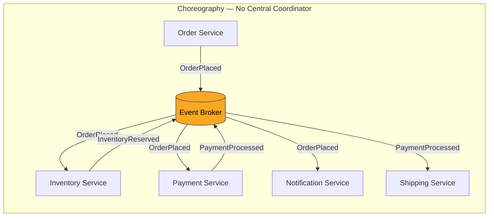
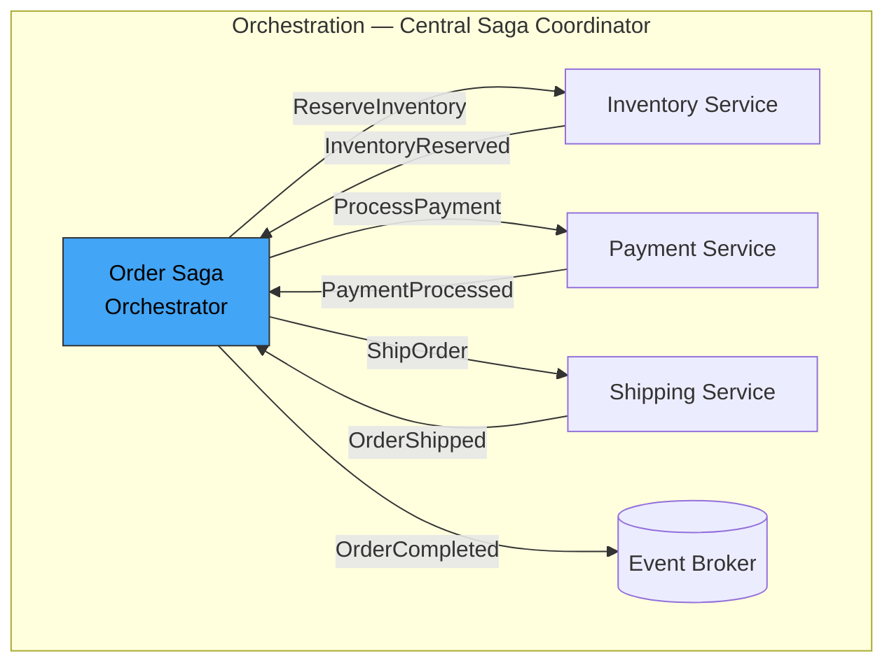
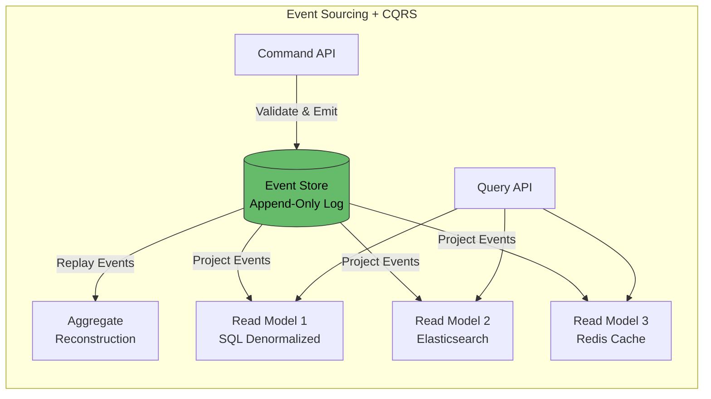
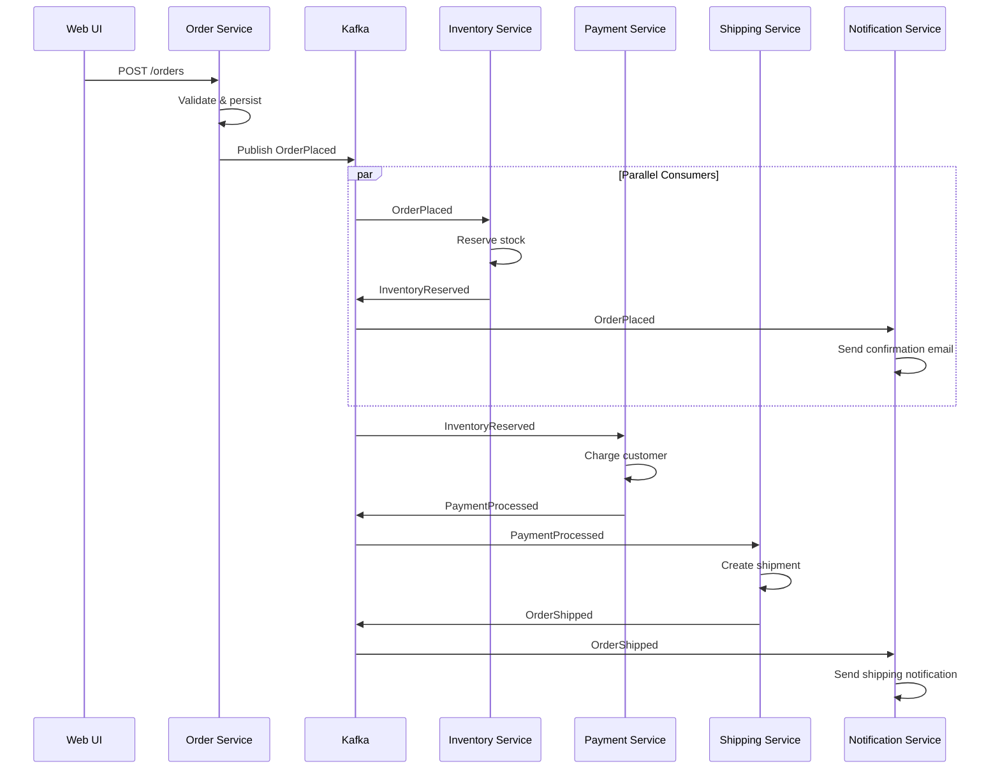
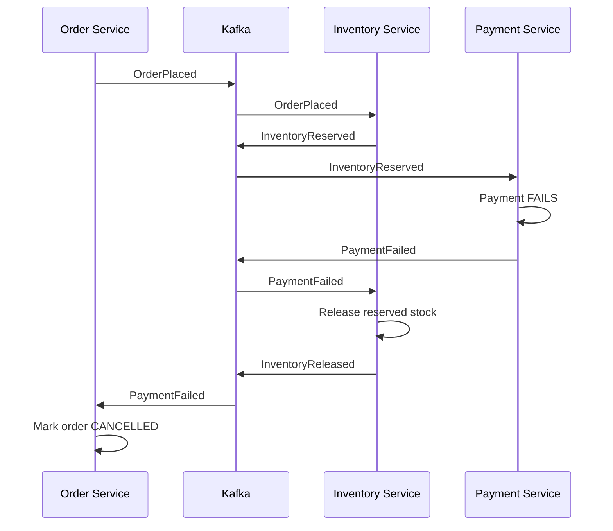
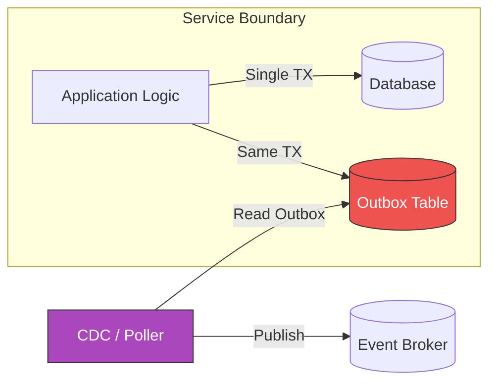
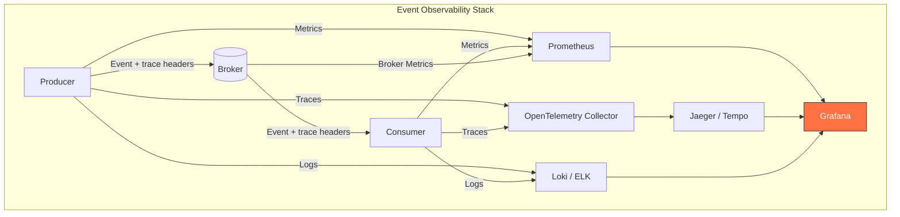

## Event-Driven Architecture (EDA) in Microservices

### Context & Assumptions

Event-Driven Architecture is a design paradigm where **state changes propagate as immutable events** through the system, decoupling producers from consumers both in time and space. In microservices, EDA replaces synchronous request-response chains with asynchronous event flows — dramatically improving loose coupling, scalability, and resilience.

---

### Core Concepts

| Concept | Definition |
|---|---|
| **Event** | An immutable fact that something happened — e.g., `OrderPlaced`, `PaymentReceived` |
| **Producer** | Service that emits events without knowledge of consumers |
| **Consumer** | Service that reacts to events without knowledge of producers |
| **Event Broker** | Infrastructure that routes events (Kafka, RabbitMQ, NATS, Pulsar) |
| **Event Schema** | Contract defining event structure (Avro, Protobuf, JSON Schema) |
| **Event Store** | Append-only log preserving full event history |

---

### Event Types

| Type | Purpose | Example |
|---|---|---|
| **Domain Event** | Business fact occurred | `OrderPlaced { orderId, items, total }` |
| **Integration Event** | Cross-service communication | `InventoryReserved { orderId, warehouseId }` |
| **Command Event** | Request to perform an action | `ShipOrder { orderId, address }` |
| **Notification Event** | Thin signal (lookup details separately) | `CustomerUpdated { customerId }` |
| **Event-Carried State Transfer** | Fat event with full state snapshot | `CustomerUpdated { customerId, name, email, address, ... }` |

---

### EDA Topology Patterns

#### 1. Simple Event Notification (Choreography)

**Pros:** Maximum decoupling, easy to add new consumers, no single point of orchestration failure.
**Cons:** Harder to trace end-to-end flows, implicit process logic scattered across services.

---

#### 2. Event-Driven Orchestration

**Pros:** Explicit workflow visibility, easier error handling and compensation.
**Cons:** Orchestrator is a coupling point, must handle its own availability.

---

#### 3. Event Sourcing + CQRS

**Pros:** Full audit trail, temporal queries, multiple optimized read models, replay capability.
**Cons:** Eventual consistency complexity, event schema evolution challenges, higher storage.

---

### Broker Comparison

| Broker | Delivery | Ordering | Replay | Throughput | Best For |
|---|---|---|---|---|---|
| **Apache Kafka** | At-least-once | Per-partition | Yes (retention) | Very High | Event streaming, event sourcing |
| **RabbitMQ** | At-least-once / exactly-once | Per-queue | No (ack deletes) | High | Task queues, RPC-style |
| **Apache Pulsar** | At-least-once / effectively-once | Per-partition | Yes (tiered storage) | Very High | Multi-tenant, geo-replication |
| **NATS JetStream** | At-least-once / exactly-once | Per-stream | Yes | Very High | Low-latency, edge/IoT |
| **AWS EventBridge** | At-least-once | No guarantee | Archive/replay | High | Serverless, SaaS integration |
| **Redis Streams** | At-least-once | Per-stream | Yes (XRANGE) | Very High | Simple event log, low infra overhead |

---

### End-to-End Event Flow (E-Commerce Example)

---

### Compensation / Failure Handling

---

### Key Design Patterns Within EDA

| Pattern | Description | When to Use |
|---|---|---|
| **Transactional Outbox** | Write event to an outbox table in the same DB transaction, then relay to broker | Guarantee at-least-once publish without 2PC |
| **Change Data Capture (CDC)** | Stream DB changes as events (Debezium) | Integrate legacy systems, zero-code event production |
| **Idempotent Consumer** | Deduplicate using event ID + idempotency key | Always — at-least-once delivery means duplicates |
| **Dead Letter Queue (DLQ)** | Park unprocessable events for investigation | Poison messages, schema mismatches |
| **Event Versioning** | Envelope with `schemaVersion`, backward-compatible evolution | Schema changes over time |
| **Competing Consumers** | Multiple instances of same service consume from shared partition/queue | Horizontal scaling of consumers |
| **Event Aggregator** | Combine multiple fine-grained events into coarse-grained summary | Reduce noise for downstream consumers |

---

### Transactional Outbox Pattern (Detail)

This guarantees **atomicity** between state change and event publication — the event is written in the same database transaction as the business data.

---

### Anti-Patterns

| Anti-Pattern | Problem | Remedy |
|---|---|---|
| **Event Soup** | Too many fine-grained events, no one understands the flow | Define bounded context events, use event storming |
| **Synchronous Disguised as Async** | Producer blocks waiting for consumer response | True fire-and-forget; use correlation IDs for tracking |
| **Missing Idempotency** | Duplicate processing on redelivery | Idempotency keys in every consumer |
| **Ignoring Schema Evolution** | Breaking consumers when event schema changes | Schema registry (Confluent, Apicurio), backward compatibility |
| **God Event** | One event carrying everything for all consumers | Split into domain-specific events per bounded context |
| **No Dead Letter Queue** | Poison messages block entire partition | Always configure DLQ with alerting |
| **Unbounded Retention** | Event store grows forever | Define retention policies, use compacted topics for state |
| **Missing Observability** | Cannot trace events across services | Correlation ID + distributed tracing (OpenTelemetry) in event headers |

---

### Observability in EDA

**Key Metrics to Monitor:**
- Event publish rate / consume rate (detect lag)
- Consumer group lag (Kafka) — critical health signal
- Event processing latency (p50, p95, p99)
- DLQ depth (alert on non-zero)
- Schema validation failure rate

---

### Practical Checklist

- [ ] Choose event granularity: domain events per bounded context
- [ ] Adopt a schema registry and enforce backward compatibility
- [ ] Implement Transactional Outbox or CDC for reliable publishing
- [ ] Make every consumer idempotent (event ID deduplication)
- [ ] Configure Dead Letter Queues with alerting
- [ ] Inject OpenTelemetry trace context into event headers
- [ ] Define retention and compaction policies per topic
- [ ] Use consumer group lag as primary health indicator
- [ ] Document event catalog (event name, schema, owner, consumers)
- [ ] Run event storming workshops to discover domain events before coding

---

### Recommendation

For most microservice architectures start with **choreography + Kafka** (or Pulsar) for integration events with the **Transactional Outbox** pattern. Add **orchestration (Saga)** only for complex multi-step business processes where compensation logic is intricate. Layer **Event Sourcing + CQRS** selectively on domains that genuinely need audit trails, temporal queries, or multiple read projections — not as a blanket strategy.

---

### Next Steps to Explore

1. **Event Storming** — collaborative workshop technique for discovering domain events
2. **Schema Registry & Contract Testing** — preventing breaking changes at the event boundary
3. **Saga patterns in depth** — choreography vs. orchestration trade-offs with compensation
4. **CQRS read-model projection strategies** — rebuilding projections, handling schema migration
5. **Exactly-once semantics** — Kafka transactions, idempotent producers, and consumer offset management