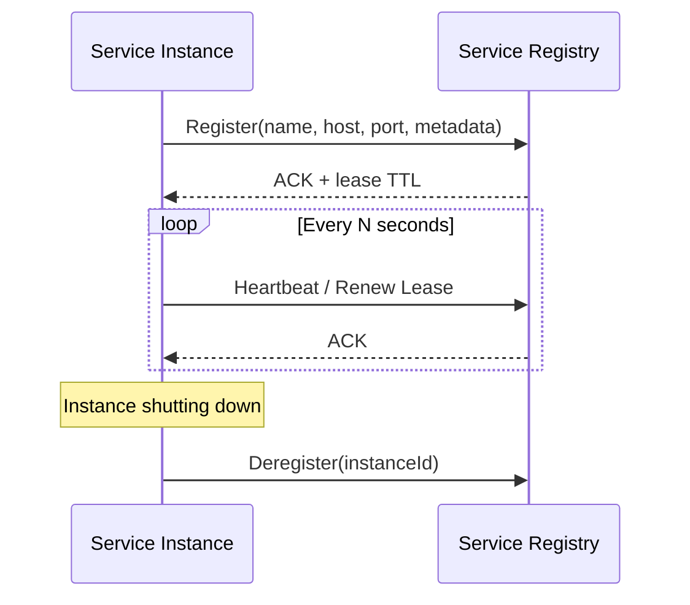
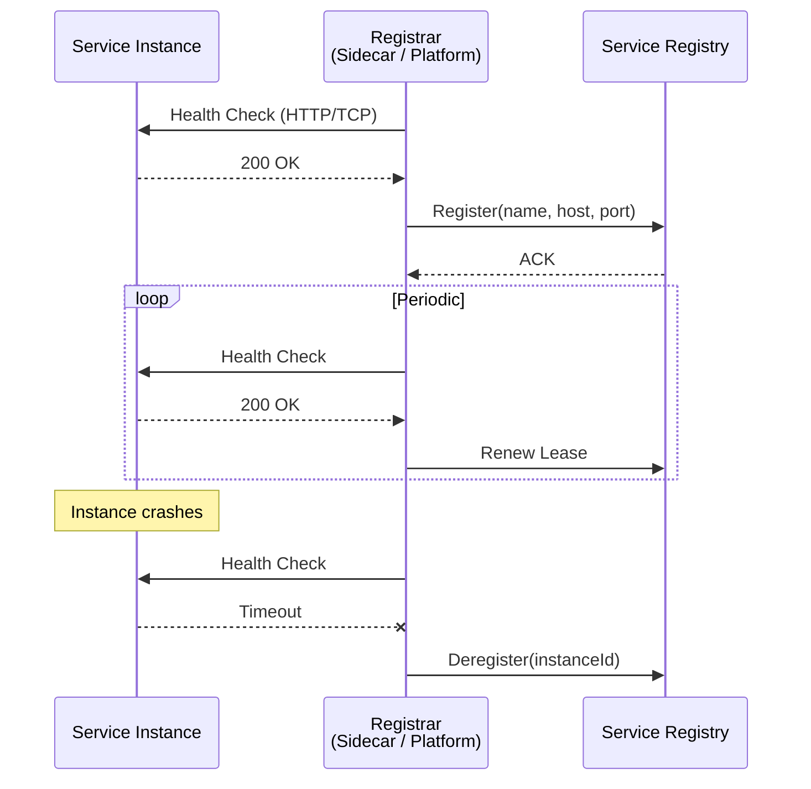
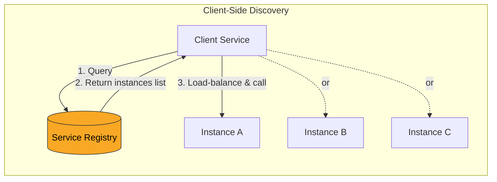
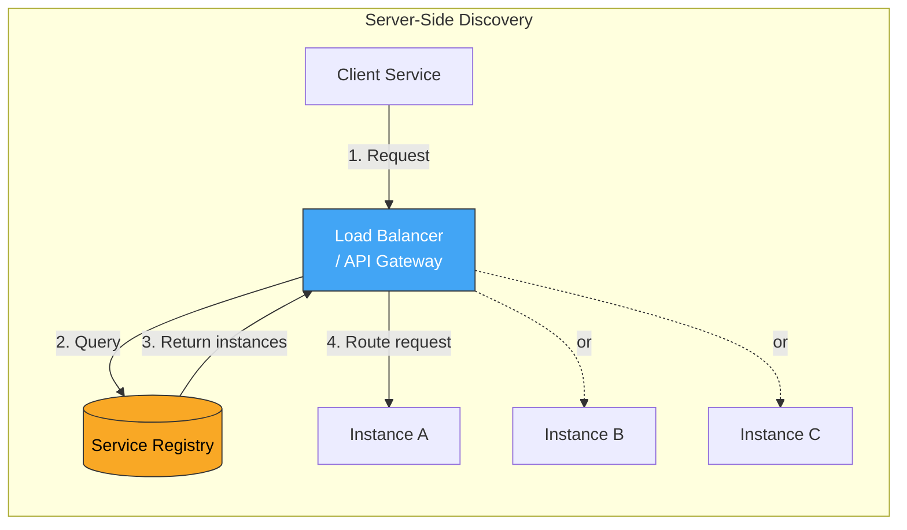
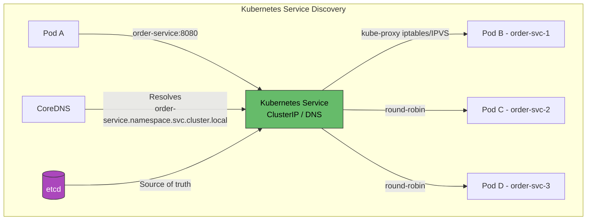
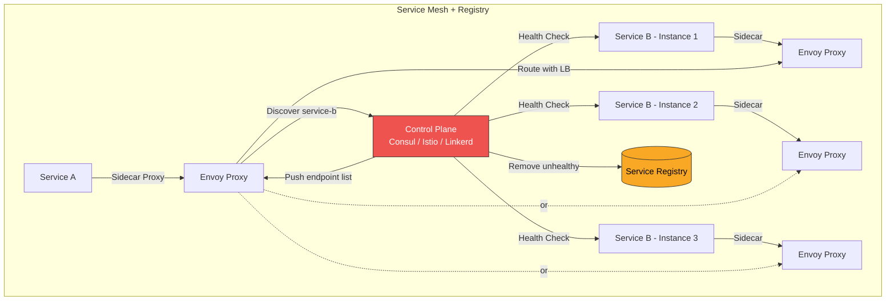
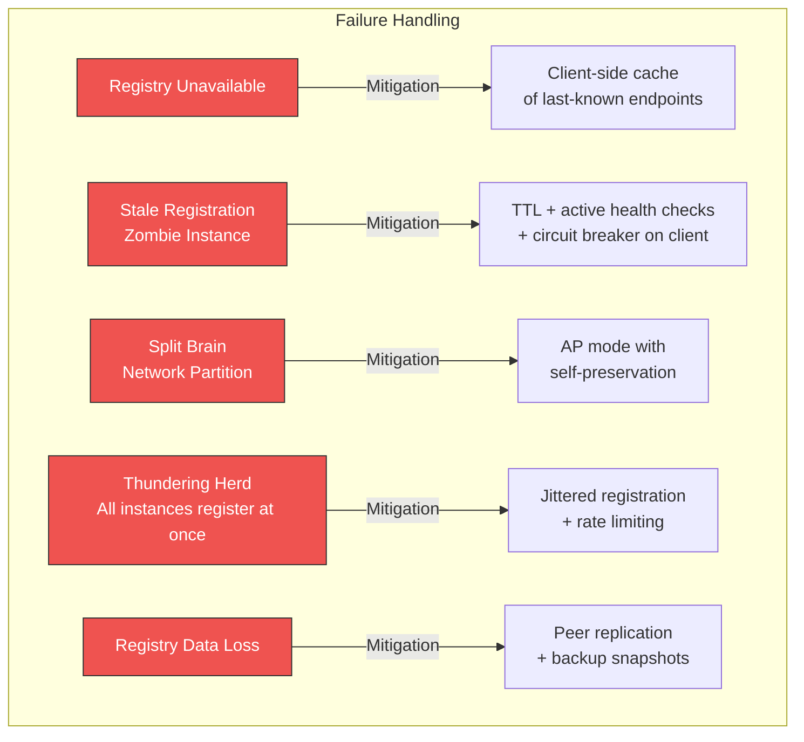
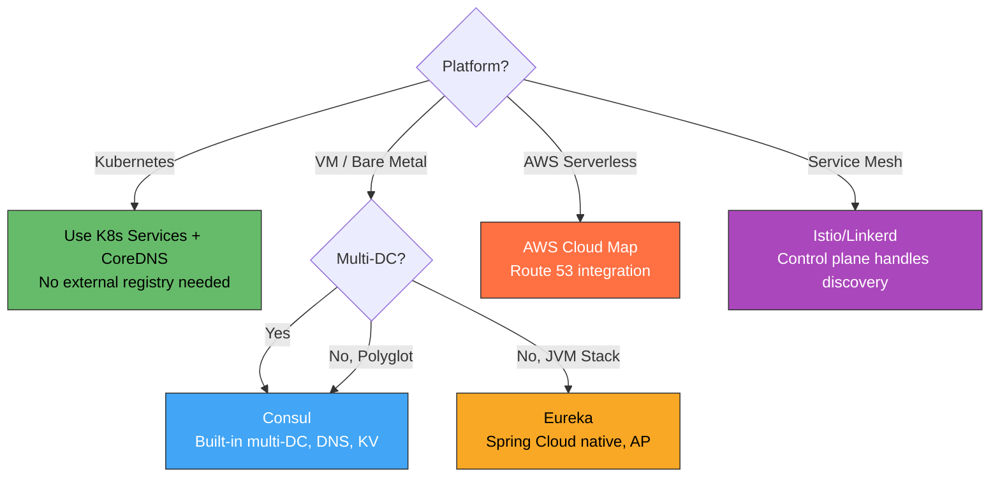

## Service Registry Pattern in Microservices Architecture

### Context & Assumptions

In a microservices architecture, services are **ephemeral** — instances spin up, scale out, move across hosts, and die constantly. Hard-coding IP addresses or hostnames is impossible. The **Service Registry** pattern provides a central (or distributed) directory where services **register themselves** and **discover each other** at runtime, enabling dynamic routing in an ever-changing topology.

---

### Core Concepts

| Concept | Definition |
|---|---|
| **Service Registry** | A database of available service instances and their network locations |
| **Service Registration** | The act of a service instance advertising itself to the registry |
| **Service Discovery** | The act of a client querying the registry to find a service instance |
| **Health Check** | Periodic probe ensuring registered instances are actually alive |
| **Service Identity** | Logical name (e.g., `order-service`) mapped to N physical instances |
| **Lease / TTL** | Time-bound registration that auto-expires if not renewed |

---

### Registration Patterns

#### 1. Self-Registration

**Pros:** Simple, no extra infrastructure.
**Cons:** Service code is coupled to the registry API; every service must implement registration logic.

---

#### 2. Third-Party Registration (Sidecar / Platform-Managed)

**Pros:** Service code is decoupled from registry; works with any language/framework.
**Cons:** Requires an external registrar (Kubernetes, Consul agent, Netflix Sidecar).

---

### Discovery Patterns

#### Client-Side Discovery

The client fetches the full list of instances and **chooses one** using a local load-balancing algorithm (round-robin, random, weighted, least-connections).

**Pros:** No intermediate proxy hop, lower latency, client can implement smart routing.
**Cons:** Client must implement discovery + load-balancing logic per language.

---

#### Server-Side Discovery

A dedicated load balancer or API gateway handles registry lookup. Clients send requests to a single well-known endpoint.

**Pros:** Client is completely decoupled from discovery; single point to add cross-cutting (TLS, auth, rate-limiting).
**Cons:** Additional network hop; load balancer is a potential bottleneck / SPOF.

---

### Kubernetes-Native Service Discovery (DNS-Based)

Kubernetes **replaces** a traditional external registry — `etcd` is the registry, `kube-proxy` handles routing, CoreDNS provides name resolution. No application-level registration needed.

---

### Service Registry Technology Comparison

| Technology | Type | Health Checks | KV Store | DNS Interface | Consensus | Best For |
|---|---|---|---|---|---|---|
| **Consul** (HashiCorp) | Dedicated registry | HTTP, TCP, gRPC, script | Yes | Yes (built-in) | Raft | Multi-DC, hybrid cloud |
| **etcd** | Distributed KV | TTL-based leases | Yes | No (use CoreDNS) | Raft | Kubernetes backbone |
| **ZooKeeper** | Coordination service | Ephemeral znodes | Yes | No | ZAB | Legacy, Kafka metadata |
| **Eureka** (Netflix) | Service registry | Client heartbeat | No | No | Peer replication (AP) | Spring Cloud / JVM |
| **Kubernetes Services** | Platform-native | Liveness/Readiness probes | No (use ConfigMap) | Yes (CoreDNS) | Raft (etcd) | K8s-native workloads |
| **Nacos** (Alibaba) | Registry + Config | HTTP heartbeat | Yes | Yes | Raft + Distro | Java/Spring Cloud Alibaba |
| **AWS Cloud Map** | Managed registry | Route 53 health checks | Attributes | Yes (Route 53) | Managed | AWS-native serverless |

---

### CAP Trade-offs in Registries

| Registry | Consistency Model | Behavior During Partition |
|---|---|---|
| **Consul** | CP (default) | Rejects writes if quorum lost; stale reads optional |
| **etcd** | CP | Rejects writes without quorum |
| **ZooKeeper** | CP | Read-only mode or unavailable |
| **Eureka** | AP | Continues serving stale data; self-preservation mode |
| **Kubernetes (etcd)** | CP | API server rejects mutations without quorum |

**Key insight:** For service discovery, **AP is often preferable** — serving slightly stale data (a recently-dead instance) is better than being completely unavailable. Eureka's design reflects this. CP registries like Consul offer a stale-read mode for the same reason.

---

### Complete Architecture: Registry with Health Checks & Load Balancing

In a **service mesh**, the sidecar proxy handles both registration and discovery transparently — application code never touches the registry.

---

### Registration Metadata & Tagging

Services register more than just host:port. Rich metadata enables intelligent routing:

| Metadata Field | Purpose | Example |
|---|---|---|
| `version` | Canary routing, blue-green | `v2.3.1` |
| `region` / `zone` | Locality-aware routing | `us-east-1a` |
| `weight` | Weighted load balancing | `80` (% of traffic) |
| `protocol` | Client protocol selection | `grpc`, `http2` |
| `tags` | Feature flags, A/B testing | `canary`, `beta` |
| `healthEndpoint` | Custom health check path | `/actuator/health` |
| `startTime` | Warm-up aware routing | `2026-04-18T10:00:00Z` |

---

### Failure Scenarios & Mitigations

---

### Anti-Patterns

| Anti-Pattern | Problem | Remedy |
|---|---|---|
| **Hard-Coded Endpoints** | Cannot scale, relocate, or failover | Use registry + DNS; never hard-code IPs |
| **No Health Checks** | Zombie instances receive traffic | Active health probes with short TTLs |
| **Registry as Config Store** | Overloading the registry with business config | Use dedicated config server (Consul KV is OK; don't abuse Eureka) |
| **No Client-Side Cache** | Registry failure = total discovery failure | Cache last-known endpoints with expiry |
| **Single Registry Instance** | SPOF for entire system | Deploy clustered (3-5 nodes, Raft quorum) |
| **Ignoring Deregistration** | Graceful shutdown doesn't clean up | Shutdown hooks + TTL expiry as safety net |
| **Tight Coupling to Registry API** | Cannot switch registry technology | Abstract behind a discovery interface / use service mesh |
| **No Locality Awareness** | Cross-region calls add latency | Register zone metadata, prefer local instances |

---

### Decision Matrix: When to Use What

---

### Practical Checklist

- [ ] Deploy registry in clustered mode (3+ nodes for quorum)
- [ ] Register with metadata: version, zone, weight, health endpoint
- [ ] Implement active health checks (not just heartbeats)
- [ ] TTL/lease on every registration — auto-expire dead instances
- [ ] Client-side cache of discovered endpoints (survive registry outage)
- [ ] Graceful shutdown hook to deregister on SIGTERM
- [ ] Jitter registration timing to avoid thundering herd on restart
- [ ] Monitor registry: node count, registration churn, health check failure rate
- [ ] Abstract discovery behind an interface (swap Consul/Eureka/K8s without code change)
- [ ] On Kubernetes: prefer native Services + DNS before adding Consul/Eureka

---

### Recommendation

**On Kubernetes** — use native Kubernetes Services with CoreDNS. The platform is already a service registry. Add a service mesh (Istio/Linkerd) only when you need advanced traffic management (canary, mTLS, retries).

**On VMs / hybrid** — use **Consul** for its built-in DNS interface, multi-datacenter federation, and health checking. It serves polyglot stacks without requiring language-specific libraries.

**Spring Cloud / JVM-only** — **Eureka** remains a solid AP choice tightly integrated with Spring Cloud. But if you're moving toward Kubernetes, prefer native discovery over Eureka.

---

### Next Steps to Explore

1. **Service Mesh deep-dive** — how Istio/Linkerd/Consul Connect make the registry invisible to application code
2. **DNS-based vs. API-based discovery** — trade-offs in caching, TTL, and staleness
3. **Multi-cluster / multi-region service discovery** — federating registries across data centers
4. **Zero-trust networking** — combining service identity from the registry with mTLS certificate issuance
5. **Graceful startup & shutdown** — readiness gates, pre-stop hooks, and connection draining