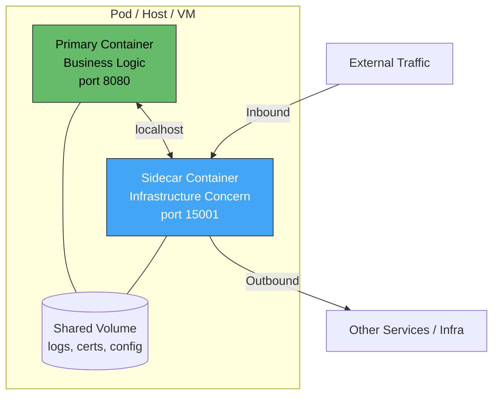
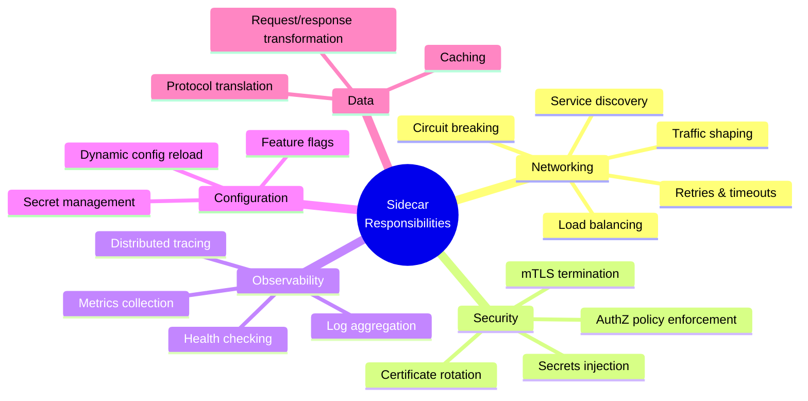
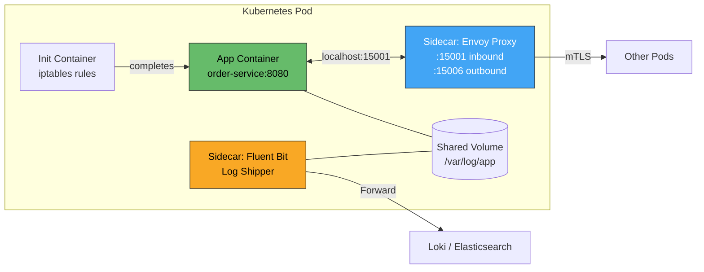
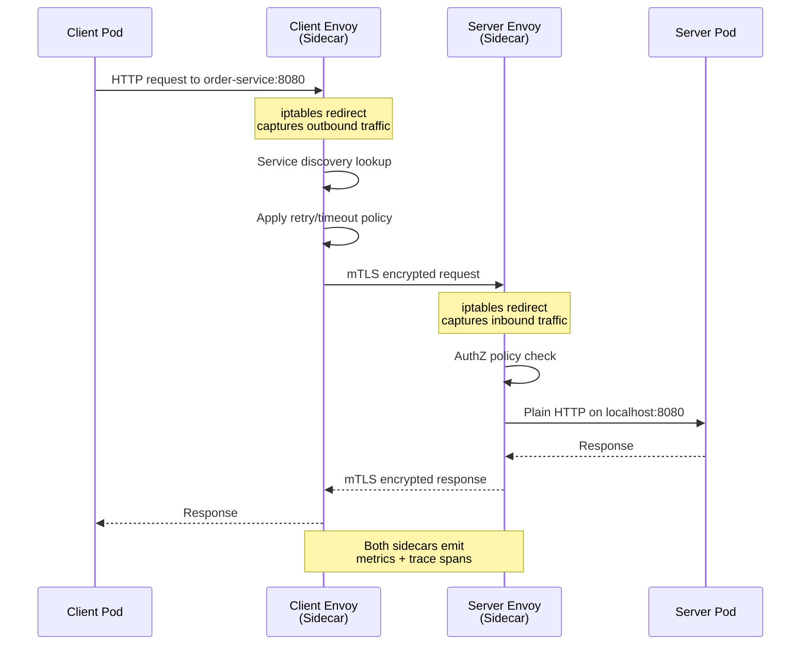
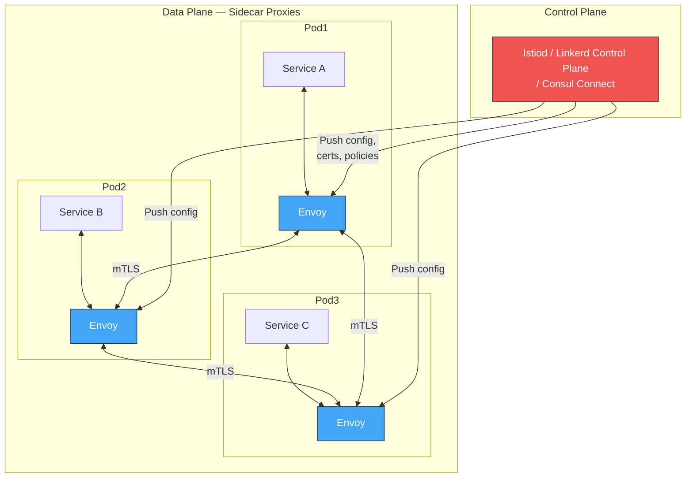
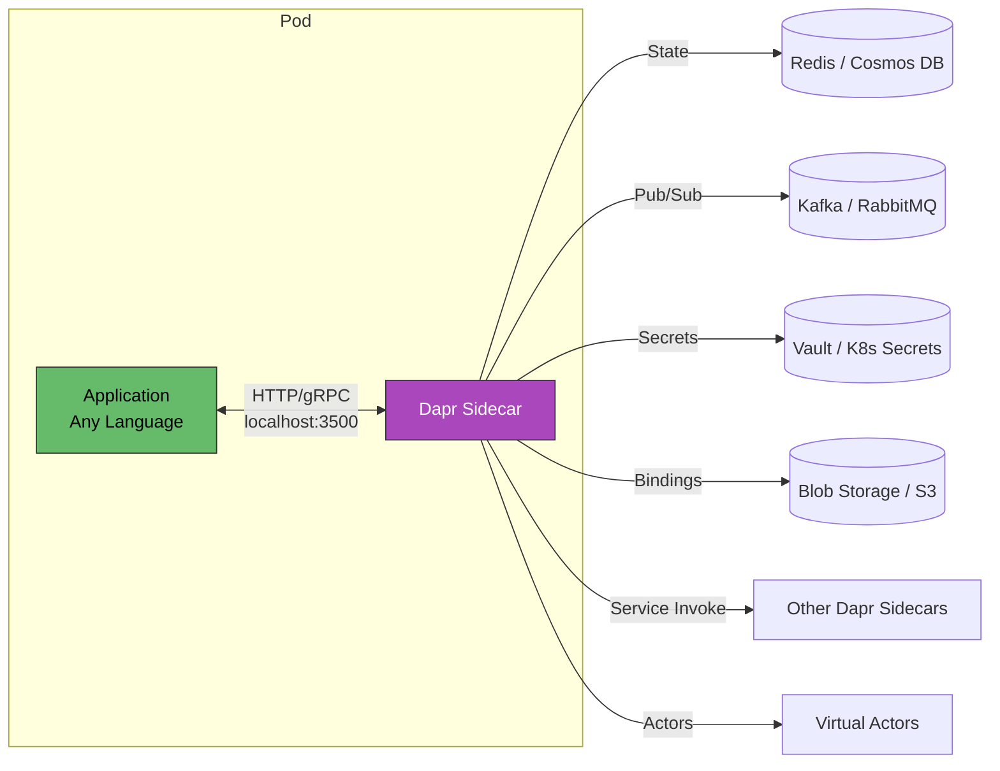
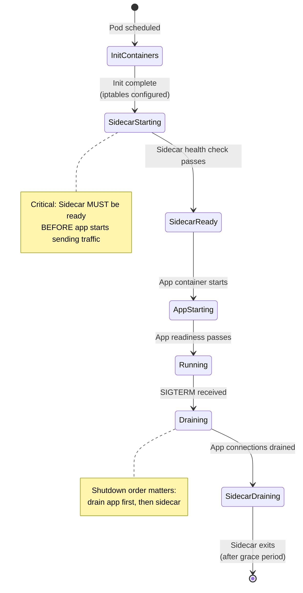
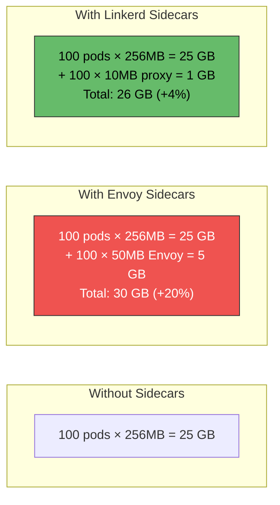
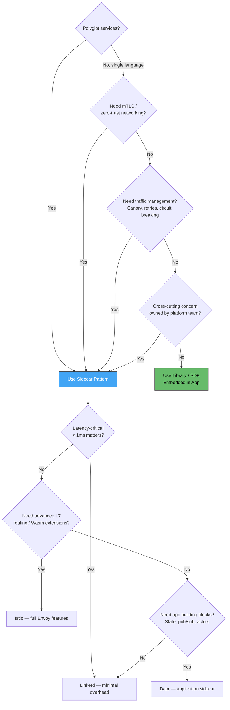

## Sidecar Pattern in Microservices Architecture

### Context & Assumptions

The Sidecar pattern deploys a **companion process alongside each service instance** — sharing the same host, pod, or VM — to handle cross-cutting concerns (networking, observability, security, configuration) **without modifying the application code**. It is the foundational building block of **service meshes** and a key enabler of polyglot microservice architectures.

The name comes from motorcycle sidecars: attached to the vehicle, sharing the journey, but functionally independent.

---

### Core Concepts

| Concept | Definition |
|---|---|
| **Primary Container** | The application service — your business logic |
| **Sidecar Container** | A co-deployed helper process handling infrastructure concerns |
| **Shared Lifecycle** | Sidecar starts and stops with the primary — same deployment unit |
| **Shared Network** | Sidecar and primary communicate over `localhost` (or shared network namespace) |
| **Shared Storage** | Optionally share volumes for log files, config, certs |
| **Transparent Proxy** | Sidecar intercepts all inbound/outbound traffic without app awareness |

---

### How It Works

The sidecar **intercepts** or **augments** traffic and data flows. The application is unaware of its presence — it communicates on `localhost` as if talking directly to the outside world.

---

### Sidecar vs. Alternatives

| Approach | Description | Pros | Cons |
|---|---|---|---|
| **Library / SDK** | Embed logic in app code (e.g., Hystrix, Resilience4j) | No extra process; low latency | Language-specific; version coupling; every team must adopt |
| **Sidecar** | Co-deployed process per instance | Language-agnostic; centrally managed; no code changes | Extra resource consumption; added latency (~1ms); operational complexity |
| **Node-Level Agent** | One agent per host (DaemonSet) | Lower resource overhead | Shared failure domain; coarser granularity |
| **Centralized Gateway** | Single proxy for all services | Simple topology | SPOF; doesn't handle east-west traffic |

---

### Common Sidecar Responsibilities

---

### Kubernetes Pod with Sidecar

**Key detail:** An **init container** sets up iptables rules to transparently redirect all inbound/outbound traffic through the Envoy sidecar — the application never knows it's being proxied.

---

### Traffic Interception Flow

---

### Service Mesh: Sidecars at Scale

The **data plane** (all sidecars) handles actual traffic. The **control plane** configures the sidecars centrally — pushing routing rules, TLS certificates, and policies without touching application code.

---

### Sidecar Technology Comparison

| Technology | Role | Protocol Support | Resource Overhead | Best For |
|---|---|---|---|---|
| **Envoy** (Istio) | L4/L7 proxy | HTTP/1.1, HTTP/2, gRPC, TCP, MongoDB, Redis | ~50MB RAM, ~0.5 vCPU | Full service mesh, advanced traffic management |
| **Linkerd2-proxy** | L4/L7 proxy | HTTP/1.1, HTTP/2, gRPC, TCP | ~10MB RAM, ultralight | Simplicity-first mesh, low overhead |
| **Consul Connect (Envoy)** | L4/L7 proxy | HTTP, gRPC, TCP | ~50MB RAM | Multi-platform (K8s + VMs), HashiCorp stack |
| **NGINX Sidecar** | L7 proxy / cache | HTTP, gRPC | ~20MB RAM | Caching, rate-limiting sidecar |
| **Fluent Bit** | Log shipper | N/A | ~5MB RAM | Log collection and forwarding |
| **Vault Agent** | Secrets injector | N/A | ~30MB RAM | Dynamic secrets, cert rotation |
| **OTel Collector** | Telemetry pipeline | OTLP, Jaeger, Zipkin, Prometheus | ~30MB RAM | Metrics/traces/logs collection |
| **Dapr** | Application runtime | HTTP, gRPC | ~20MB RAM | Portable microservice building blocks |

---

### Dapr: The Application-Level Sidecar

Dapr deserves special attention — it's a sidecar that provides **application-level building blocks**, not just networking:

| Dapr Building Block | What It Replaces |
|---|---|
| Service invocation | Service discovery + client-side LB |
| State management | Direct DB client SDK |
| Pub/Sub messaging | Kafka/RabbitMQ client libraries |
| Secrets management | Vault SDK / env variable hacks |
| Bindings | Cloud SDK integrations |
| Actors | Custom actor framework code |
| Distributed lock | ZooKeeper / Redis lock code |

---

### Sidecar Lifecycle in Kubernetes

**Startup ordering (K8s 1.28+ native sidecar support):**
- Kubernetes `SidecarContainers` feature gate (stable in 1.29) ensures sidecars start before and stop after the main container.
- Before 1.28: required init-container hacks, `postStart` hooks, or sleep-based workarounds.

---

### Resource Impact Analysis

| Metric | Envoy (Istio) | Linkerd2-proxy | Dapr |
|---|---|---|---|
| Memory per sidecar | ~50MB | ~10MB | ~20MB |
| P99 latency added | ~1-3ms | ~0.5-1ms | ~1-2ms |
| CPU overhead | ~0.5 vCPU | ~0.1 vCPU | ~0.2 vCPU |
| At 500 pods, total overhead | 25GB RAM | 5GB RAM | 10GB RAM |

---

### Anti-Patterns

| Anti-Pattern | Problem | Remedy |
|---|---|---|
| **Business Logic in Sidecar** | Sidecar becomes a service itself; tight coupling | Sidecars handle only infrastructure concerns |
| **Ignoring Startup/Shutdown Order** | App sends traffic before sidecar proxy is ready | Use K8s native sidecar containers (1.28+) or readiness gates |
| **Sidecar per Concern** | 5 sidecars per pod = resource explosion | Consolidate (Envoy handles proxy + observability; OTel collector handles metrics + traces + logs) |
| **No Resource Limits** | Sidecar consumes all node memory | Always set CPU/memory requests and limits on sidecar containers |
| **Ignoring Sidecar Upgrades** | 500 pods with outdated Envoy = security risk | Rolling sidecar injection with mesh upgrade tooling (istioctl, linkerd upgrade) |
| **Synchronous Sidecar Dependency** | App crashes if sidecar is temporarily unavailable | Retry with backoff; startup probes to gate readiness |
| **Pass-Through Without Value** | Sidecar proxies traffic but adds no policies | Justify every sidecar; if it's just forwarding, remove it |
| **Sidecar for Monolith** | Adding mesh sidecar to a monolith | Sidecars solve microservice problems; a monolith needs a different approach |

---

### Decision Framework: When to Use Sidecars

---

### Practical Checklist

- [ ] Identify which cross-cutting concerns belong in sidecars vs. application code
- [ ] Set CPU/memory requests and limits on every sidecar container
- [ ] Use Kubernetes native sidecar containers (1.28+) for correct startup/shutdown ordering
- [ ] Limit to 1-2 sidecars per pod — consolidate concerns where possible
- [ ] Monitor sidecar resource usage separately from application containers
- [ ] Automate sidecar injection (Istio webhook, Linkerd inject, Dapr annotations)
- [ ] Plan sidecar upgrade strategy — canary roll sidecars like you roll applications
- [ ] Measure added latency (p50, p99) — establish baseline before and after sidecar deployment
- [ ] Configure sidecar health checks independently from application health
- [ ] Exclude known internal traffic from sidecar interception when unnecessary (e.g., localhost metrics scrape)

---

### Recommendation

**Start with a clear separation:** sidecars own **infrastructure** (networking, security, observability), application code owns **business logic**. On Kubernetes, use **Linkerd** if you want the lightest overhead with strong defaults, **Istio** if you need advanced L7 traffic policies and Wasm extensibility, or **Dapr** if you want portable application-level building blocks (state, pub/sub) decoupled from specific infrastructure. Avoid introducing sidecars until you have **at least 5-10 services** — below that threshold, a shared library approach is simpler and sufficient.

---

### Next Steps to Explore

1. **Service mesh comparison** — Istio vs. Linkerd vs. Consul Connect: detailed feature and performance trade-offs
2. **Sidecar-less mesh (eBPF)** — Cilium's kernel-level approach eliminating the sidecar proxy entirely
3. **Dapr deep-dive** — building portable microservices with Dapr building blocks
4. **Sidecar security** — mTLS certificate rotation, SPIFFE identity, AuthZ policies
5. **Ambient mesh (Istio)** — the sidecar-less evolution using ztunnel + waypoint proxies