## Service Mesh Pattern in Microservices Architecture

### Context & Assumptions

A **Service Mesh** is a dedicated infrastructure layer that handles **service-to-service communication** transparently. It extracts networking concerns — load balancing, encryption, observability, traffic control, resilience — out of application code and into a fleet of **proxies** managed by a **control plane**. As microservice count grows past a few dozen, managing these concerns per-service becomes untenable. The service mesh makes the network **programmable, observable, and secure** without touching a single line of application code.

---

### Core Concepts

| Concept | Definition |
|---|---|
| **Data Plane** | Fleet of sidecar proxies deployed alongside every service instance, handling actual traffic |
| **Control Plane** | Centralized management that configures all data-plane proxies with routing rules, policies, and certificates |
| **East-West Traffic** | Service-to-service communication within the cluster (mesh's primary focus) |
| **North-South Traffic** | External client-to-service communication (handled by ingress gateway) |
| **mTLS** | Mutual TLS — both client and server authenticate each other; mesh automates certificate issuance and rotation |
| **SPIFFE Identity** | Cryptographic workload identity standard used by meshes for zero-trust networking |
| **Observability** | Automatic metrics, traces, and access logs from every proxy — no instrumentation needed |

---

### Architecture Overview

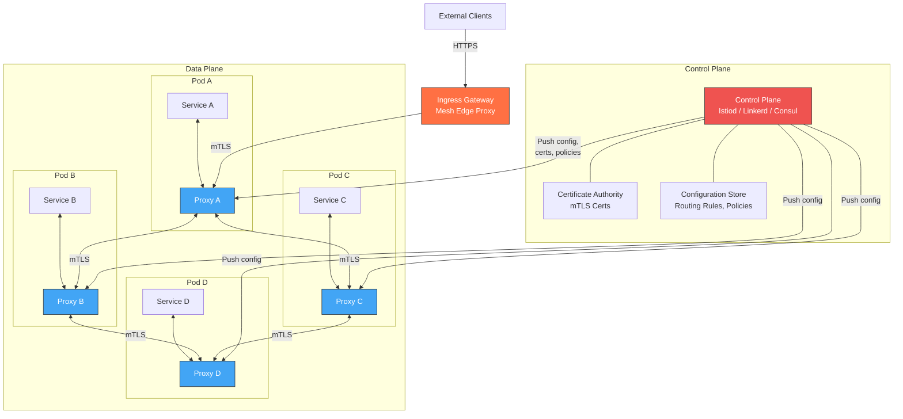

---

### What the Mesh Handles (and What It Doesn't)

| Handled by Mesh | NOT Handled by Mesh |
|---|---|
| Service-to-service encryption (mTLS) | Business logic |
| Load balancing (L4/L7) | Data model / schema design |
| Circuit breaking, retries, timeouts | Application-level transactions |
| Traffic splitting (canary, A/B) | Message queue consumer logic |
| Request-level AuthZ policies | Business validation rules |
| Automatic metrics / traces / access logs | Application-level logging content |
| Rate limiting (per-service) | API design / versioning |
| Service identity & zero-trust | User authentication (IdP integration) |

---

### Request Lifecycle Through the Mesh

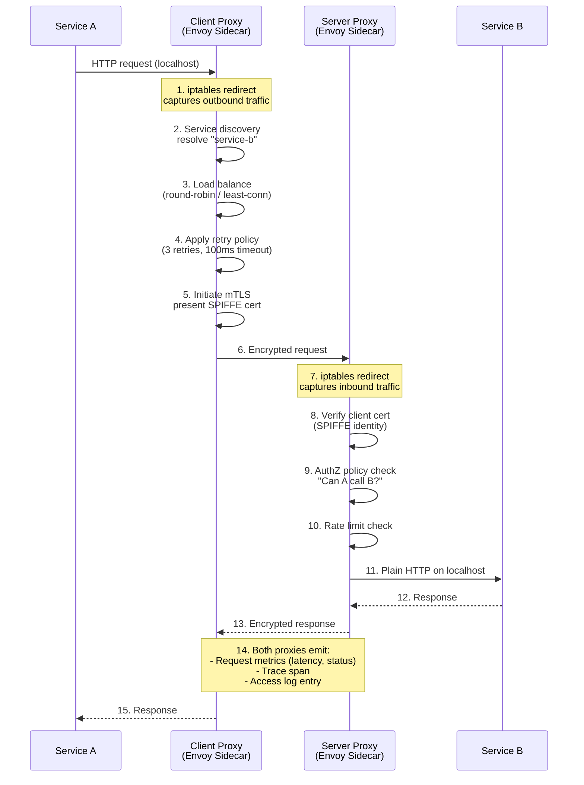

---

### Service Mesh Technology Comparison

| Feature | **Istio** | **Linkerd** | **Consul Connect** | **Cilium (eBPF)** | **AWS App Mesh** |
|---|---|---|---|---|---|
| **Proxy** | Envoy | linkerd2-proxy (Rust) | Envoy | eBPF kernel + Envoy (L7) | Envoy |
| **Control Plane** | Istiod | linkerd-control-plane | Consul server | Cilium agent | AWS managed |
| **mTLS** | Auto, SPIFFE | Auto, on by default | Auto, SPIFFE | Auto (WireGuard / IPsec) | Manual cert config |
| **L7 Policy** | Full (HTTP, gRPC headers) | Basic (routes, retries) | Intentions (allow/deny) | Full (Envoy L7 + eBPF L4) | HTTP path/header routing |
| **Traffic Splitting** | VirtualService + DestinationRule | TrafficSplit (SMI) | Splitter config | CiliumEnvoyConfig | Virtual router |
| **Observability** | Rich (Kiali, Prometheus, Jaeger) | Built-in dashboard | Consul UI | Hubble UI + Grafana | CloudWatch / X-Ray |
| **Memory per Proxy** | ~50MB (Envoy) | ~10MB (Rust proxy) | ~50MB (Envoy) | ~0MB (eBPF kernel) + Envoy for L7 | ~50MB (Envoy) |
| **Latency Added (P99)** | 1-3ms | 0.5-1ms | 1-3ms | <0.5ms (eBPF L4) | 1-3ms |
| **Multi-Cluster** | Yes (east-west gateway) | Yes (multi-cluster linking) | Yes (WAN federation) | Yes (ClusterMesh) | Yes (Cloud Map) |
| **Platform** | Kubernetes | Kubernetes | Kubernetes + VMs | Kubernetes | AWS ECS/EKS |
| **Complexity** | High | Low | Medium | Medium-High | Medium |
| **Maturity** | Very High (CNCF graduated) | High (CNCF graduated) | High | Growing rapidly | Medium |

---

### Traffic Management Capabilities

#### Canary Deployment

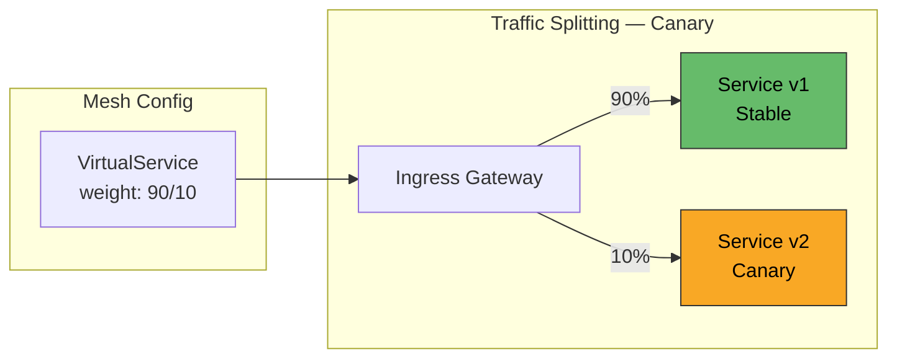

#### Header-Based Routing (A/B Testing)

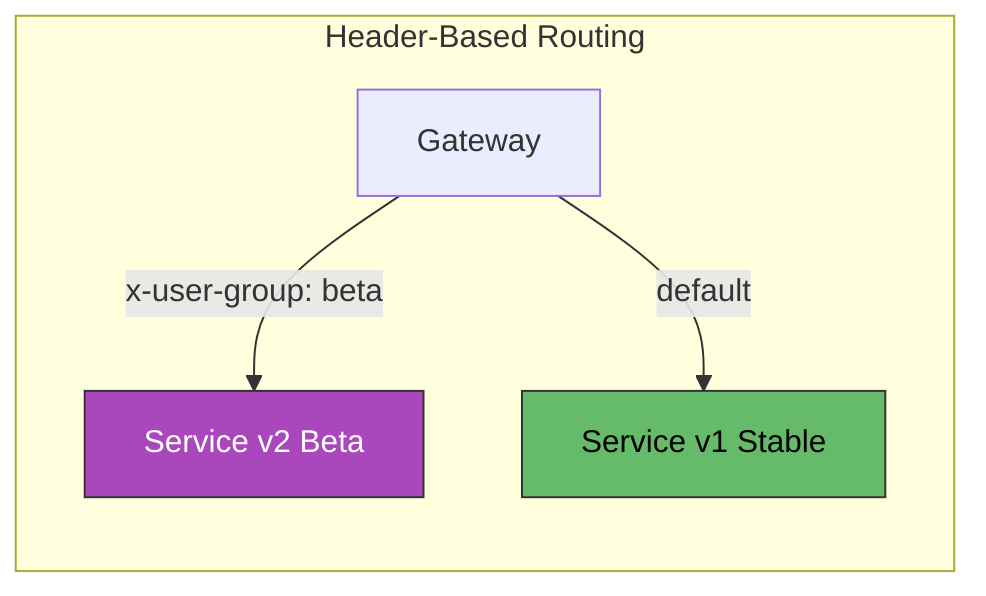

#### Fault Injection (Chaos Testing)

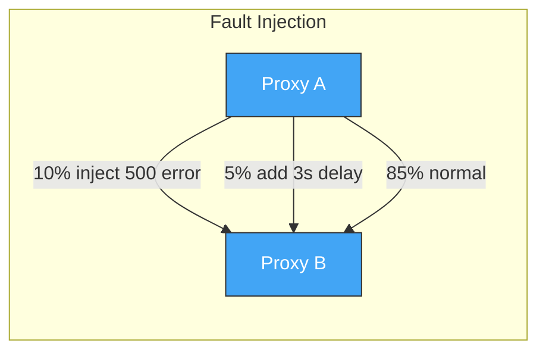

---

### Security: Zero-Trust Networking

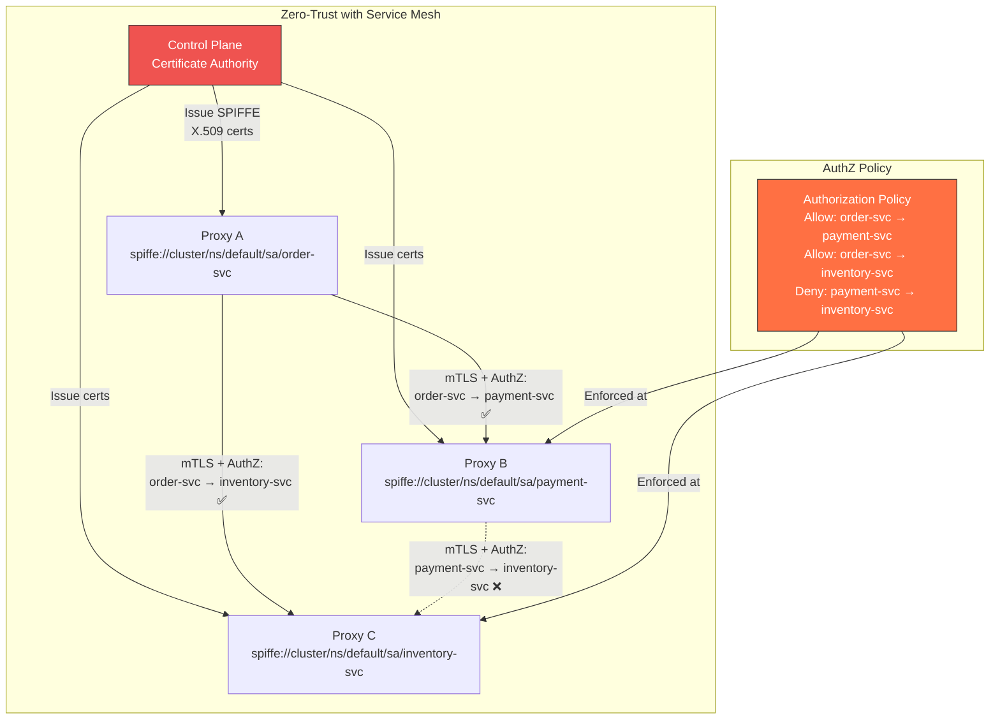

**Key Principle:** Default deny. Every service-to-service call must be **explicitly authorized** by identity-based policies — not just network ACLs.

Certificate lifecycle is fully automated:

| Phase | Who | What |
|---|---|---|
| **Issuance** | Control plane CA | Issues short-lived SPIFFE certs to each proxy at startup |
| **Rotation** | Control plane + proxy | Auto-rotates before expiry (typically every 24h) |
| **Validation** | Receiving proxy | Verifies sender's SPIFFE identity against AuthZ policy |
| **Revocation** | Control plane | Pushes updated trust bundle; short cert lifetime reduces revocation need |

---

### Observability: What You Get for Free

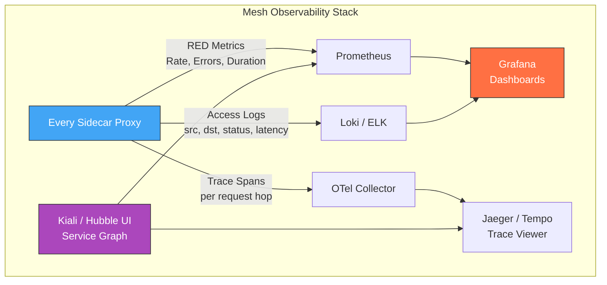

**Metrics emitted per proxy (automatic, no code changes):**

| Metric | Description |
|---|---|
| `request_total` | Request count by source, destination, status code, method |
| `request_duration_seconds` | Latency histogram (p50, p95, p99) |
| `request_size_bytes` | Request payload size |
| `response_size_bytes` | Response payload size |
| `tcp_connections_opened` | Active TCP connections |
| `tcp_sent/received_bytes` | Data transfer volume |

This gives you a **complete service dependency graph** and **golden signal metrics** (latency, traffic, errors, saturation) across every service — from day one.

---

### Resilience Features

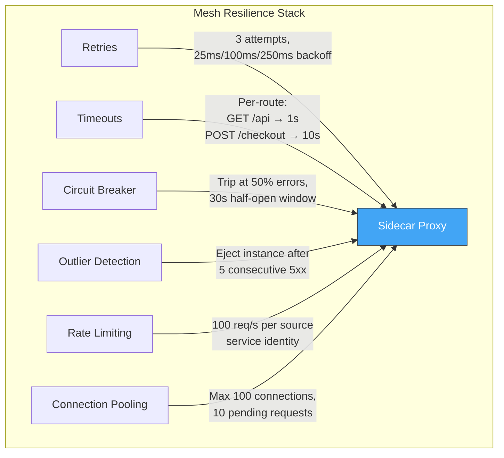

All configured **declaratively** — no library imports, no code changes:

```yaml
# Istio DestinationRule example
apiVersion: networking.istio.io/v1
kind: DestinationRule
metadata:
  name: payment-service
spec:
  host: payment-service
  trafficPolicy:
    connectionPool:
      http:
        h2UpgradePolicy: UPGRADE
        maxRequestsPerConnection: 100
    outlierDetection:
      consecutive5xxErrors: 5
      interval: 30s
      baseEjectionTime: 60s
```

---

### Sidecar vs. Sidecar-less (eBPF) Mesh

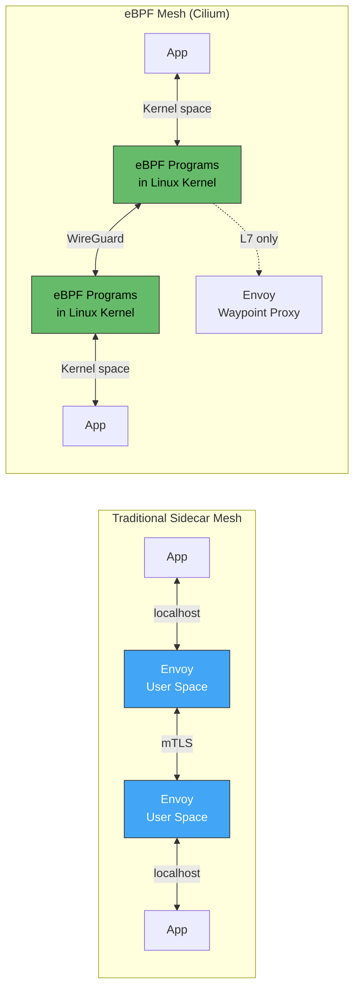

| Aspect | Sidecar (Envoy/Linkerd) | eBPF (Cilium) | Ambient (Istio) |
|---|---|---|---|
| **L4 handling** | User-space proxy | Kernel eBPF programs | ztunnel (node-level) |
| **L7 handling** | Same user-space proxy | Envoy per-node or per-service | Waypoint proxy (per-service) |
| **Memory overhead** | Per-pod (10-50MB each) | Near-zero for L4; Envoy only for L7 | ztunnel per-node; waypoint on-demand |
| **Latency** | 0.5-3ms per hop | <0.5ms (L4); ~1ms (L7) | ~0.5ms (L4); ~1ms (L7) |
| **Granularity** | Per-pod policies | Per-pod (eBPF) | Per-namespace or per-service |
| **Maturity** | Production-proven | Growing rapidly | GA in Istio 1.22+ |

---

### Multi-Cluster Mesh

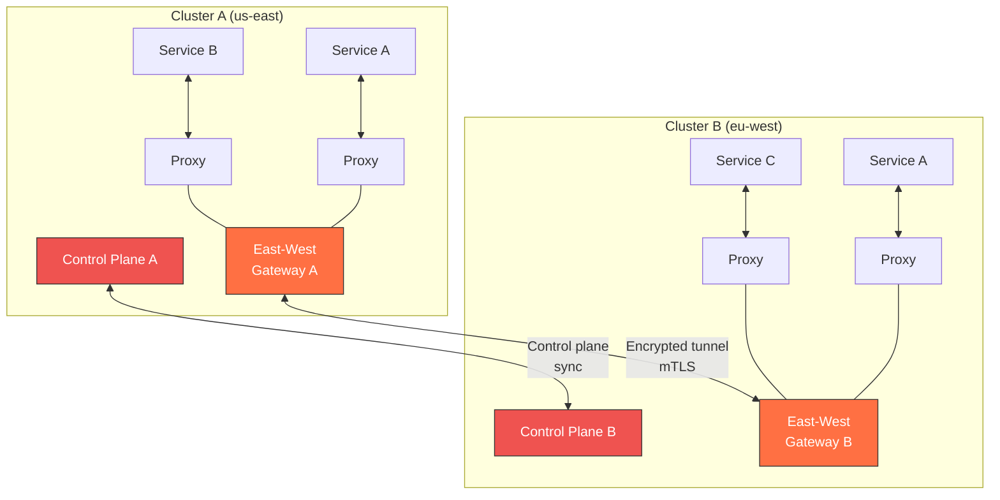

**Use cases for multi-cluster mesh:**
- Geo-distributed deployments with locality-aware routing
- Disaster recovery with failover across clusters
- Compliance requirements isolating data in specific regions
- Progressive multi-cluster migrations

---

### Anti-Patterns

| Anti-Pattern | Problem | Remedy |
|---|---|---|
| **Mesh Everything Day 1** | Massive complexity spike before teams understand the mesh | Start with observability only (permissive mTLS), add policies incrementally |
| **Ignoring Resource Overhead** | 500 Envoy sidecars ≈ 25GB RAM unplanned | Budget sidecar resources from the start; consider Linkerd or ambient mode |
| **No Gradual Rollout** | Mesh injection breaks apps with non-standard protocols | Canary mesh adoption per namespace; test with non-critical services first |
| **Relying Solely on Mesh Retries** | Mesh retries non-idempotent POST requests → duplicate orders | Mark non-idempotent routes as non-retryable; application-level idempotency still required |
| **mTLS Without AuthZ** | Encrypted but unrestricted — any service can call any service | Default-deny AuthZ policies from the start |
| **Ignoring Proxy Drain on Shutdown** | Sidecar terminates before in-flight requests complete | Configure `terminationDrainDuration`; use K8s native sidecar containers |
| **Over-Configuring Traffic Policies** | 200 VirtualService rules nobody understands | Minimal policies; centralize in GitOps; review in PR like application code |
| **Skipping Control Plane HA** | Single Istiod instance is SPOF for cert issuance and config push | Deploy 2-3 control plane replicas with leader election |

---

### Adoption Maturity Model

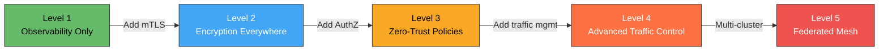

| Level | What You Enable | Effort | Risk |
|---|---|---|---|
| **L1 — Observability** | Inject sidecars in permissive mode; get metrics, traces, service graph | Low | Low |
| **L2 — mTLS** | Enable strict mTLS; all traffic encrypted | Low-Medium | Medium (breaks non-mesh clients) |
| **L3 — Zero-Trust** | AuthZ policies; default deny | Medium | High (misconfigured policies block traffic) |
| **L4 — Traffic Control** | Canary, fault injection, retries, circuit breaking | Medium | Medium (config complexity) |
| **L5 — Multi-Cluster** | Federate meshes across clusters/regions | High | High (network, DNS, cert trust) |

---

### Decision Framework

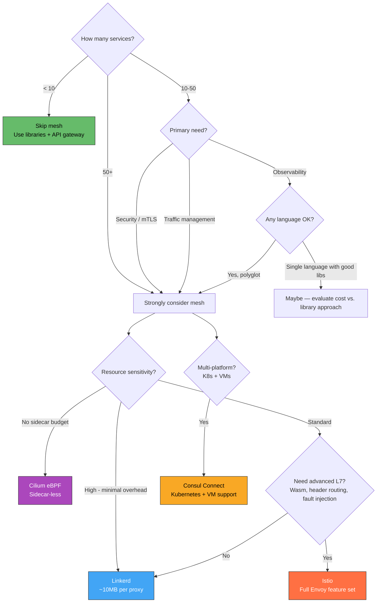

---

### Practical Checklist

- [ ] Start at Level 1: inject sidecars in permissive mode, get observability first
- [ ] Deploy control plane with HA (2-3 replicas)
- [ ] Budget sidecar resources: CPU/memory requests and limits per pod
- [ ] Enable strict mTLS per namespace, not cluster-wide flip
- [ ] Define AuthZ policies as code in Git — review like application changes
- [ ] Mark non-idempotent endpoints as non-retryable in mesh config
- [ ] Configure proxy drain duration to match application graceful shutdown
- [ ] Monitor control plane health: xDS push latency, cert issuance rate, proxy sync status
- [ ] Set up Kiali / Hubble for service dependency graph visualization
- [ ] Establish mesh upgrade runbook: canary control plane upgrade → canary data plane → full rollout
- [ ] Use namespace-level adoption: onboard one team/namespace at a time
- [ ] Test failure modes: kill control plane — data plane should continue with cached config

---

### Recommendation

**Adopt a service mesh when you cross ~10-15 services** and need at least two of: mTLS everywhere, uniform observability, or traffic management. Start with **Linkerd** for simplicity and low overhead — it handles 90% of mesh use cases (mTLS, retries, observability, traffic splits) with minimal configuration. Move to **Istio** if you need advanced L7 policies, Wasm extensibility, or Envoy's full feature set. Evaluate **Cilium** if sidecar resource overhead is a hard constraint. Always adopt **incrementally** — observability first, then encryption, then policies, then traffic control.

---

### Next Steps to Explore

1. **Istio vs. Linkerd hands-on comparison** — deploy both on same cluster with benchmark workloads
2. **eBPF and Cilium deep-dive** — sidecar-less mesh architecture and trade-offs
3. **Istio Ambient Mode** — eliminating sidecars with ztunnel + waypoint proxies
4. **Service mesh + GitOps** — managing mesh configuration with ArgoCD / Flux
5. **Multi-cluster mesh federation** — cross-region routing, failover, and shared trust domains