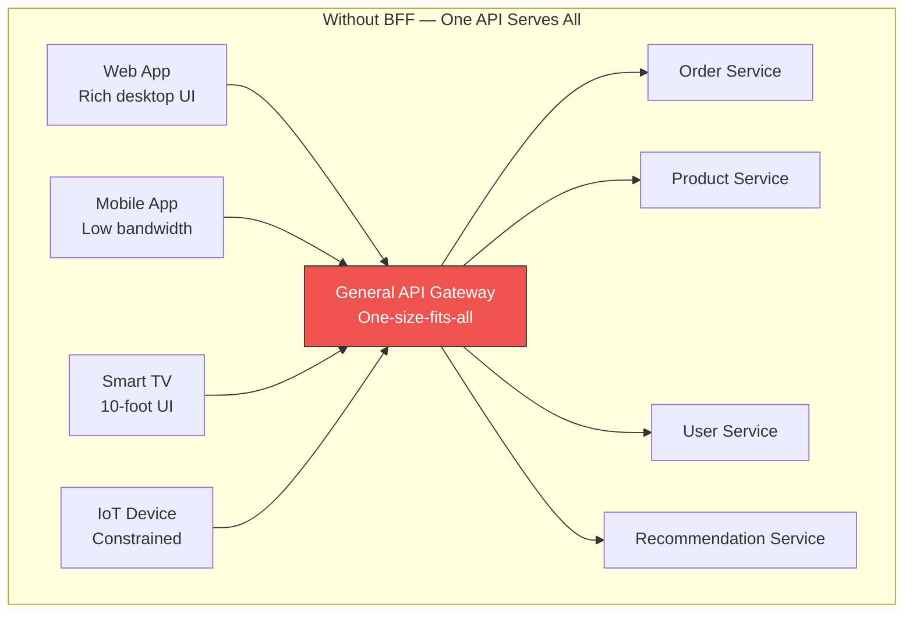
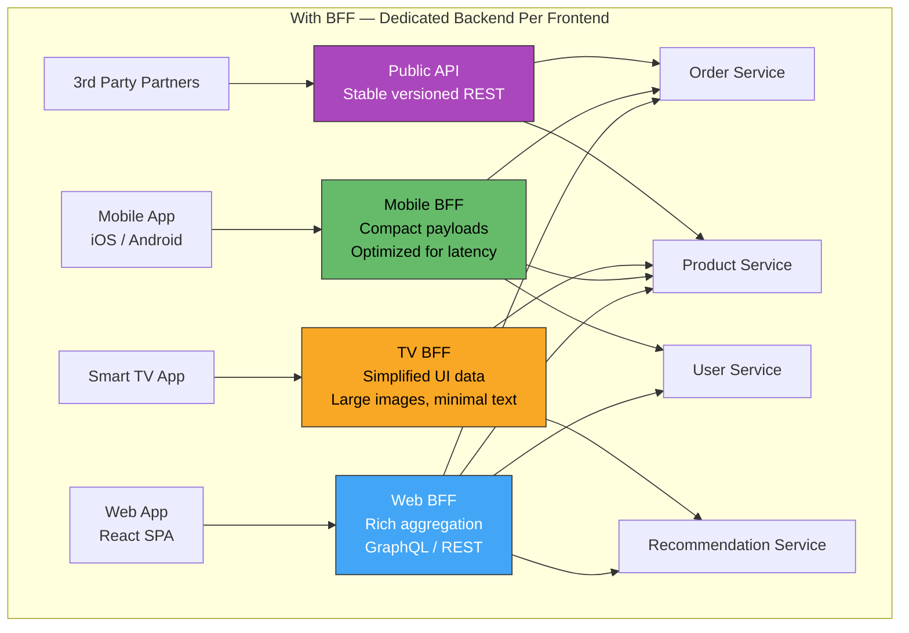
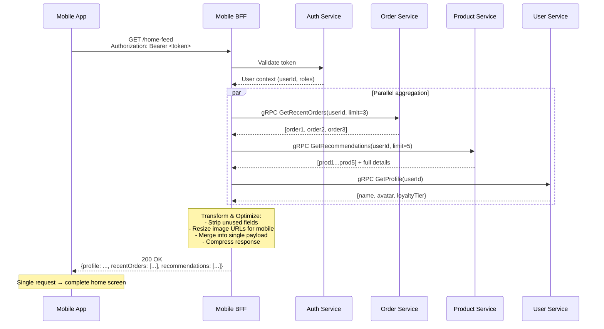
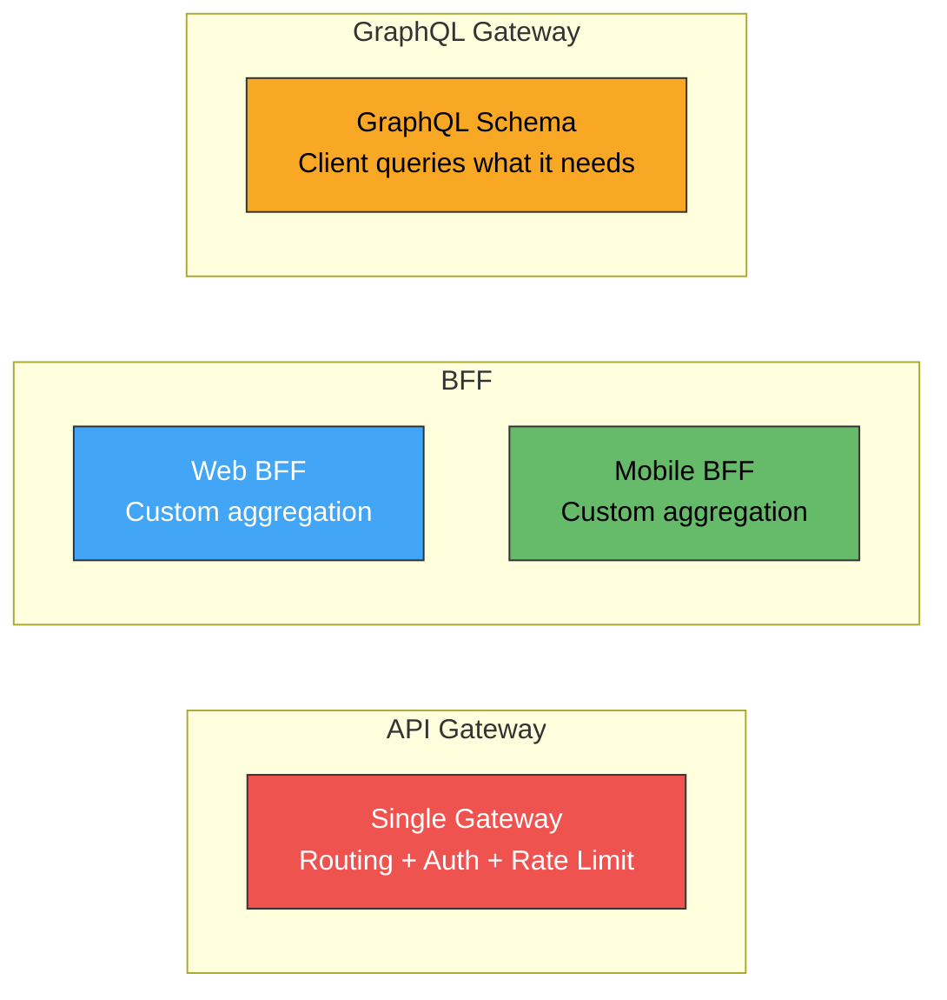
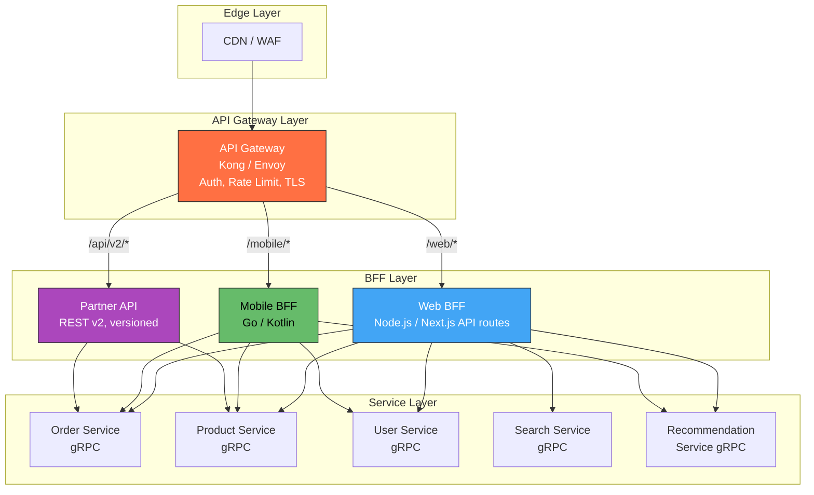
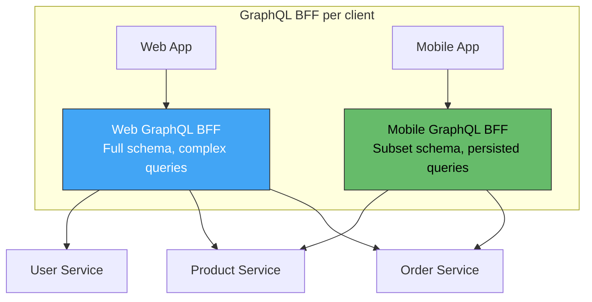
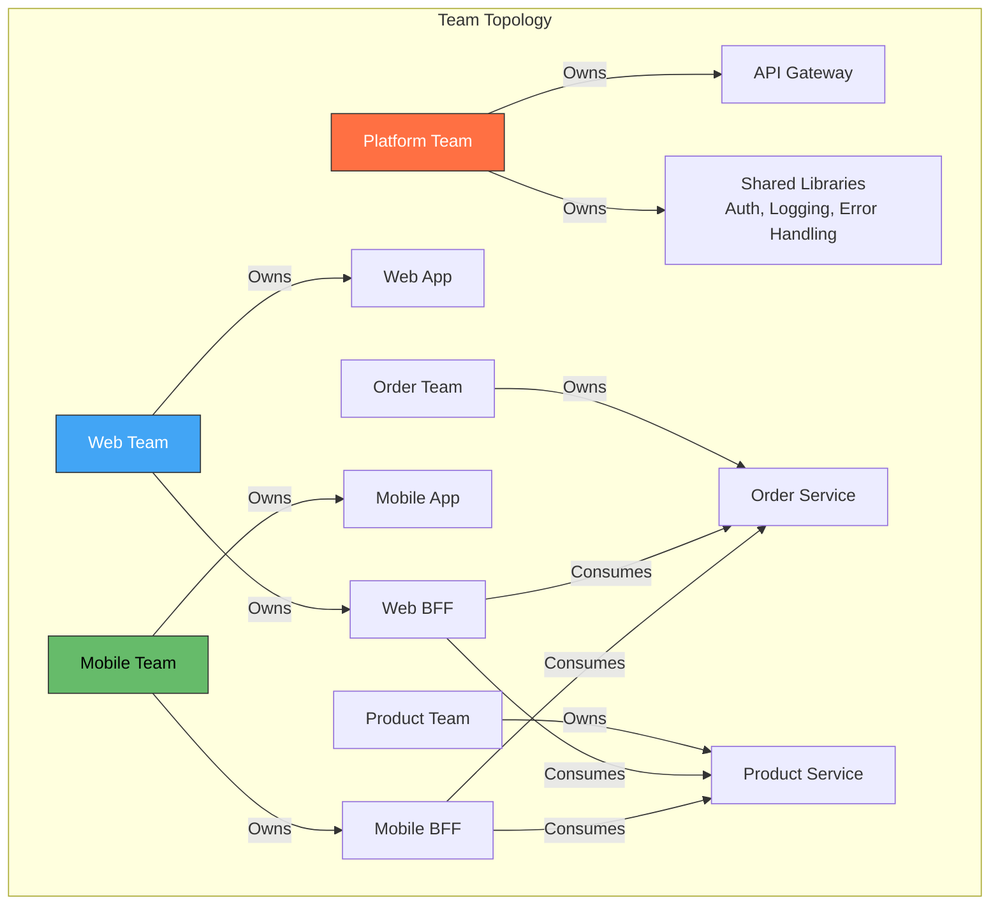
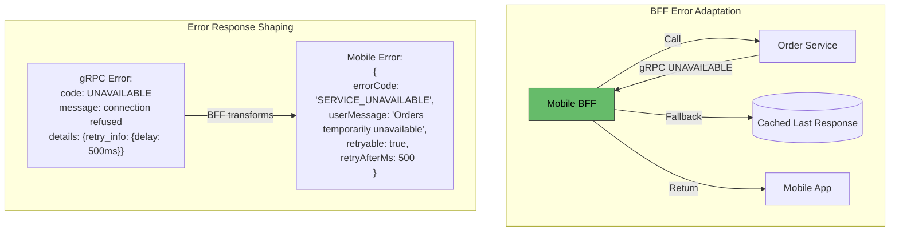
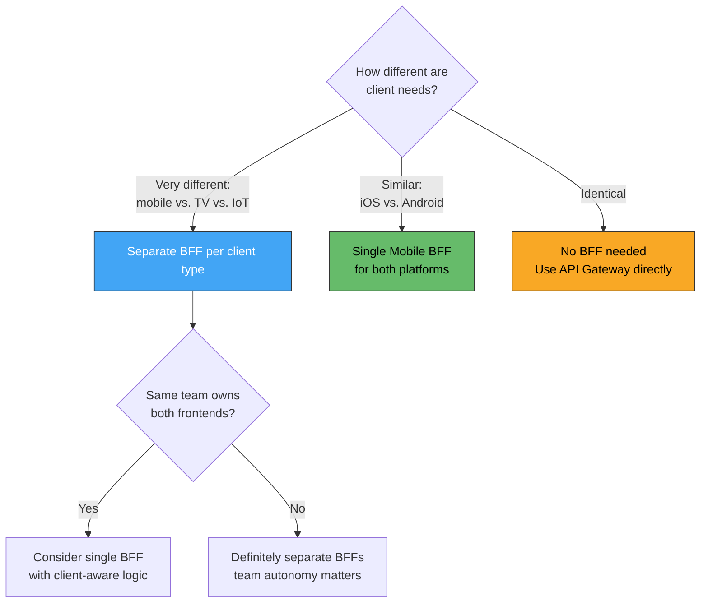

## Backend for Frontend (BFF) Pattern in Microservices Architecture

### Context & Assumptions

The **Backend for Frontend (BFF)** pattern creates a **dedicated backend service for each frontend experience** (web, mobile, IoT, third-party). Instead of forcing all clients through a single general-purpose API gateway that serves the lowest common denominator, each frontend gets a **tailored API layer** that aggregates, transforms, and optimizes data specifically for that client's needs — screen size, bandwidth, interaction model, and latency tolerance.

The pattern was popularized by Sam Newman (ThoughtBerries / Spotify) and is now standard in large-scale microservice architectures.

---

### The Problem BFF Solves

**Problems with single API:**

| Issue | Impact |
|---|---|
| Over-fetching | Mobile downloads 200 fields when it needs 15 |
| Under-fetching | Web needs 3 separate calls to render one page |
| Conflicting requirements | Mobile needs compact payloads; web needs rich nested objects |
| Deployment coupling | Mobile team's change to the API breaks the web app |
| Slowest-common-denominator | API evolves at the pace of the slowest client team |

---

### BFF Architecture

Each BFF is **owned by the frontend team** that consumes it — aligning backend API development with frontend feature velocity.

---

### Core Responsibilities of a BFF

| Responsibility | What It Does | Example |
|---|---|---|
| **Aggregation** | Combines data from multiple microservices into a single response | Product page = product + reviews + inventory + pricing |
| **Transformation** | Shapes data for the frontend's specific needs | Mobile gets 3 image sizes; web gets 6 |
| **Protocol Translation** | Bridges frontend protocol to backend protocol | REST/GraphQL → gRPC to downstream services |
| **Payload Optimization** | Minimizes payload for constrained clients | Mobile BFF strips HTML descriptions, returns markdown |
| **Authentication Facade** | Handles client-specific auth flows | Web uses OAuth PKCE; mobile uses device token |
| **Caching** | Client-aware caching strategies | TV BFF caches catalog heavily; mobile caches user-specific data |
| **Error Adaptation** | Translates backend errors to client-friendly responses | Maps gRPC status codes to mobile-friendly error objects |
| **Rate Limiting** | Per-client-type throttling | IoT BFF allows 10 req/min; web BFF allows 100 req/s |

---

### Detailed Request Flow

---

### BFF vs. API Gateway vs. GraphQL Gateway

| Aspect | API Gateway | BFF | GraphQL Gateway |
|---|---|---|---|
| **Purpose** | Cross-cutting routing, auth, rate limiting | Client-specific aggregation & transformation | Flexible querying by clients |
| **Who owns it** | Platform / infra team | Frontend team | Platform or shared team |
| **# of instances** | 1 (or 1 per region) | 1 per frontend type | 1 (federated) |
| **Data shaping** | Pass-through or minimal | Heavy transformation per client | Client-defined via query |
| **Over/Under-fetching** | Common | Eliminated by design | Eliminated by query |
| **Deployment coupling** | All clients coupled | Each client independent | Schema coupled to all |
| **Complexity** | Low | Medium (N backends to maintain) | Medium-High (schema federation) |
| **Best for** | Simple routing + auth | Divergent client needs | Uniform data model, flexible clients |

**Key insight:** These are **not mutually exclusive**. A common architecture combines an API gateway (cross-cutting) → BFF per client (aggregation) → microservices (business logic).

---

### Combined Architecture: Gateway + BFF + Services

---

### BFF Technology Choices Per Client Type

| Frontend | BFF Language | Why | Framework |
|---|---|---|---|
| **React / Vue SPA** | TypeScript (Node.js) | Same language as frontend; SSR-capable | Next.js API routes, Express, Fastify |
| **iOS / Android** | Go or Kotlin | Low latency, efficient concurrency | Ktor (Kotlin), Gin/Fiber (Go) |
| **Smart TV / Console** | Go | Simple HTTP, efficient binary payloads | Gin, Echo |
| **IoT / Embedded** | Rust or Go | Minimal resource, fast response | Actix-web (Rust), Go net/http |
| **Partner API** | Java / Kotlin | Strong typing, OpenAPI generation | Spring Boot, Quarkus |
| **Internal Admin** | Python | Rapid iteration, low traffic volume | FastAPI, Flask |

---

### BFF with GraphQL (Hybrid Approach)

| Technique | Purpose |
|---|---|
| **Persisted Queries** | Mobile sends query hash instead of full query — saves bandwidth, prevents arbitrary queries |
| **Schema Subsetting** | Mobile BFF exposes only the types/fields mobile actually uses |
| **Automatic Persisted Queries (APQ)** | Client sends hash first; BFF falls back to full query only on cache miss |
| **Query Complexity Limits** | Prevent expensive deeply-nested queries per client type |

---

### Team Ownership Model

**Key principle:** The team that builds the frontend **owns** its BFF. This eliminates cross-team coordination bottlenecks — the mobile team can evolve the mobile BFF at mobile release cadence without blocking the web team.

---

### Caching Strategies Per BFF

| BFF | Cache Strategy | TTL | Why |
|---|---|---|---|
| **Web BFF** | CDN edge cache + in-memory (Redis) | 30s-5min | Low latency for SEO-critical pages |
| **Mobile BFF** | HTTP cache headers (ETag, Cache-Control) | 5-15min | Reduce cellular data; tolerate slight staleness |
| **TV BFF** | Aggressive pre-fetch + local cache | 1-24hr | Catalog changes slowly; TV has limited bandwidth |
| **Partner API** | Response-level cache (Varnish / CDN) | 1-5min | Partners poll; protect backend from bursts |
| **IoT BFF** | Server-side cache (Redis) | 1-60min | Protect backend from thousands of polling devices |

---

### Error Handling in BFF

BFF responsibilities in error scenarios:

| Scenario | BFF Behavior |
|---|---|
| One downstream fails, others succeed | Return partial response with degraded flag |
| All downstreams fail | Return cached response or graceful error |
| Timeout on non-critical service | Omit that section, return rest of payload |
| Auth service down | Reject request with 503, client retries |
| Malformed downstream response | Log, return safe default, alert on-call |

---

### When to Split a BFF (Decision Flow)

**Rules of thumb:**
- iOS + Android → usually **one** Mobile BFF (differences are minimal)
- Web + Mobile → almost always **separate** BFFs (different payloads, auth flows, caching)
- Web + Admin Dashboard → **separate** if different teams; **shared** if same team
- Public API for partners → always **separate** (versioning, rate limiting, SLA)

---

### Anti-Patterns

| Anti-Pattern | Problem | Remedy |
|---|---|---|
| **God BFF** | BFF accumulates business logic, becomes a monolith | BFF does only aggregation + transformation; business logic stays in services |
| **Duplicated Business Logic** | Same validation/calculation in BFF and service | Single source of truth in the domain service; BFF only reshapes data |
| **BFF Calling BFF** | BFF-to-BFF chains create distributed monolith | BFFs call only downstream services, never each other |
| **Shared BFF** | One BFF serving all clients → back to the original problem | Separate BFF per divergent client type |
| **No BFF Caching** | BFF makes N downstream calls per request with no caching | Cache aggressively at BFF layer; use DataLoader-style batching |
| **Platform Team Owns BFF** | Frontend teams blocked waiting for backend changes | Frontend team owns its BFF; platform provides shared libraries |
| **Ignoring BFF in Monitoring** | BFF errors invisible; blame cascades to downstream services | Monitor BFF independently: latency, error rate, downstream call fan-out |
| **Over-BFF-ing** | BFF per page, per feature, per screen | BFF per **client type** (web, mobile, TV), not per feature |

---

### Performance Optimization Patterns

| Pattern | Description | When to Use |
|---|---|---|
| **Parallel Fan-Out** | BFF calls multiple services concurrently | Always — never sequential when calls are independent |
| **DataLoader / Batching** | Batch multiple entity lookups into single request | N+1 problem — e.g., 10 orders → 10 product lookups → 1 batched call |
| **Response Compression** | gzip / Brotli on BFF response | Mobile clients on cellular |
| **Field Filtering** | Only fetch fields the client needs from downstream | Use gRPC field masks or GraphQL selection sets |
| **Edge Caching (CDN)** | Cache BFF responses at CDN edge | Public pages, catalog data |
| **Stale-While-Revalidate** | Serve cached response while refreshing in background | Tolerable staleness (recommendations, trending) |
| **Prefetching** | BFF precomputes and caches upcoming likely requests | Pagination, next-page anticipation |

---

### Practical Checklist

- [ ] One BFF per significantly different client type (web, mobile, TV, partner)
- [ ] Frontend team owns its BFF — aligned deployment cadence
- [ ] BFF contains **zero** business logic — only aggregation, transformation, caching
- [ ] Parallel fan-out for all independent downstream calls
- [ ] DataLoader batching for entity lookups (prevent N+1)
- [ ] Client-appropriate error shaping (human-readable, retryable flags)
- [ ] Response compression (Brotli for web, gzip for mobile)
- [ ] Cache strategy per BFF — CDN for web, HTTP cache headers for mobile
- [ ] Monitor BFF independently: latency, error rate, fan-out count, cache hit ratio
- [ ] Shared library (not shared BFF) for cross-cutting auth, logging, tracing
- [ ] Contract tests between BFF and downstream services
- [ ] Circuit breaker in BFF for each downstream dependency
- [ ] Graceful degradation: return partial response when non-critical service fails

---

### Recommendation

**Use the BFF pattern when your frontends have fundamentally different needs** — which is almost always the case once you have both web and mobile. Start with **one BFF per client platform** (Web BFF, Mobile BFF), owned by the frontend team in the same language (TypeScript BFF for React frontend, Kotlin BFF for Android/iOS). Keep the BFF thin — it aggregates, transforms, and caches, but never contains business logic. Place an **API Gateway in front** of all BFFs for cross-cutting concerns (TLS, auth, rate limiting). If your clients are fairly uniform and you want maximum flexibility, consider a **GraphQL BFF** with persisted queries per client type as a middle ground.

---

### Next Steps to Explore

1. **GraphQL Federation vs. BFF** — when Apollo Federation replaces the need for separate BFFs
2. **BFF with Server-Side Rendering (SSR)** — Next.js / Nuxt.js as both BFF and rendering layer
3. **BFF performance tuning** — DataLoader, connection pooling, and response streaming
4. **Contract testing BFF-to-service boundaries** — Pact, gRPC reflection, OpenAPI diff
5. **BFF in serverless** — Lambda@Edge / Cloudflare Workers as lightweight BFF proxies at the edge