## Bulkhead Pattern in Microservices Architecture

### Context & Assumptions

The **Bulkhead pattern** isolates components into **independent compartments** so that a failure in one does not cascade and sink the entire system. The name comes from ship construction — watertight bulkhead walls divide a hull into sections, so a breach in one compartment doesn't flood the whole vessel.

In microservices, a single slow or failing dependency can **exhaust shared resources** (threads, connections, memory) and bring down unrelated functionality. The bulkhead pattern prevents this by giving each dependency or workload **its own dedicated resource pool**.

---

### The Problem Bulkhead Solves

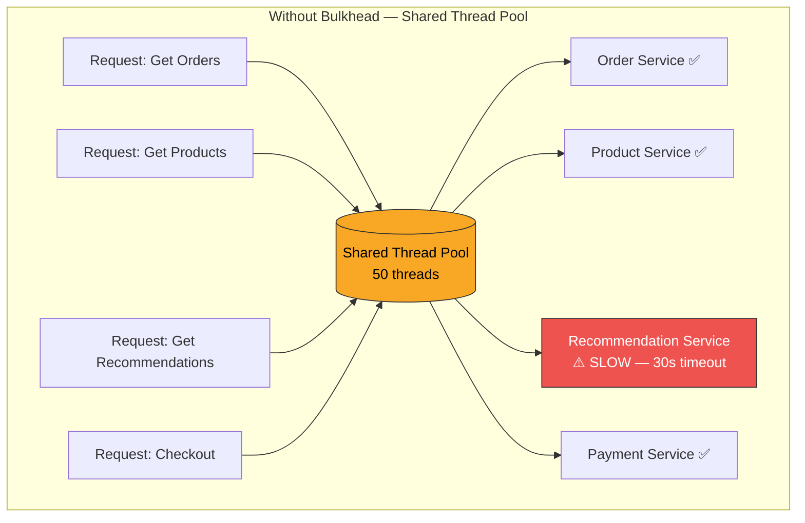

**What happens:** The slow Recommendation Service consumes all 50 threads waiting on 30s timeouts. Now orders, products, and checkout — all healthy — are **starved of threads** and fail. One bad dependency takes down the entire service.

---

### With Bulkhead — Isolated Resource Pools

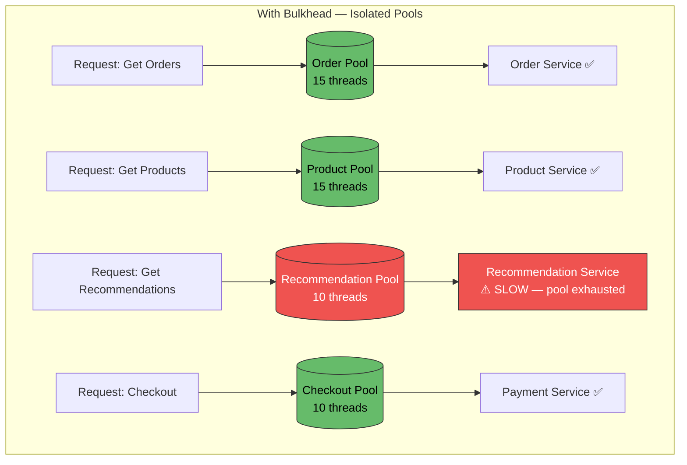

**Result:** The Recommendation pool is exhausted, but orders, products, and checkout continue operating normally. The failure is **contained** in its compartment.

---

### Types of Bulkheads

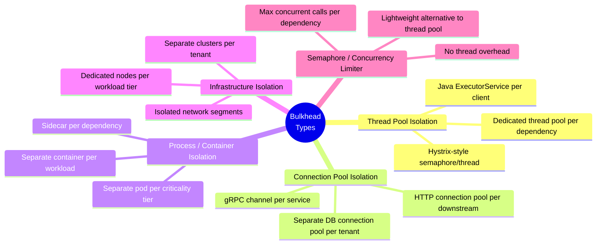

---

### Thread Pool Bulkhead (Detail)

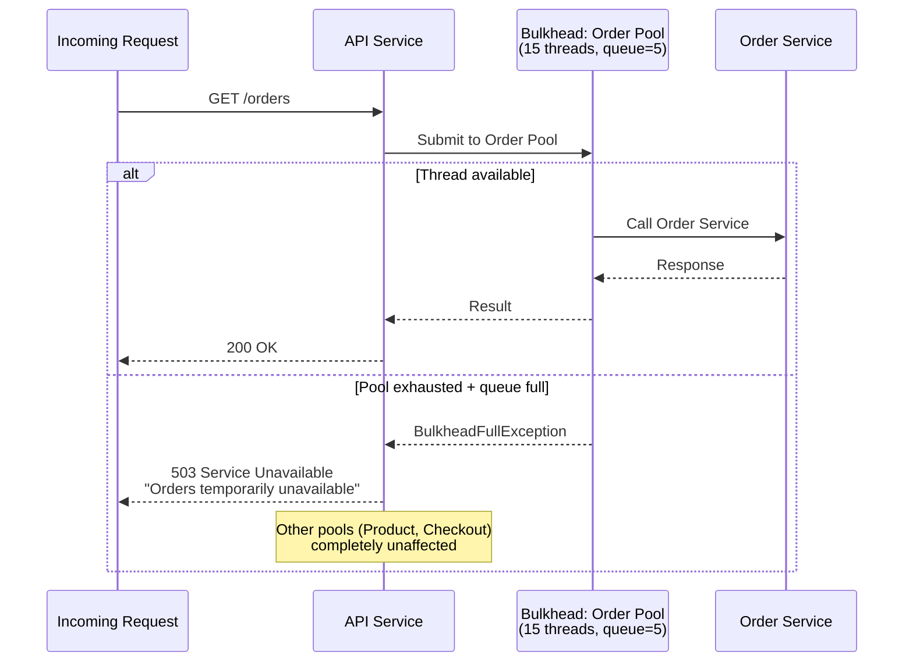

---

### Semaphore vs. Thread Pool Bulkhead

| Aspect | Thread Pool Bulkhead | Semaphore Bulkhead |
|---|---|---|
| **Mechanism** | Dedicated thread pool per dependency | Counter limiting concurrent calls |
| **Isolation** | Full — work runs on separate threads | Partial — shares caller's thread |
| **Timeout enforcement** | Thread can be interrupted on timeout | Relies on downstream timeout |
| **Overhead** | Higher (thread creation, context switching) | Very low (atomic counter) |
| **Queue support** | Yes (bounded queue before thread pool) | No queue — rejects immediately |
| **Best for** | Untrusted or slow dependencies | Fast, trusted dependencies |
| **Frameworks** | Resilience4j ThreadPoolBulkhead, Hystrix | Resilience4j SemaphoreBulkhead, Polly |

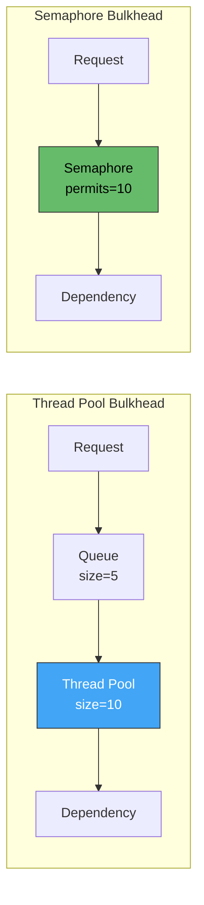

---

### Connection Pool Bulkhead

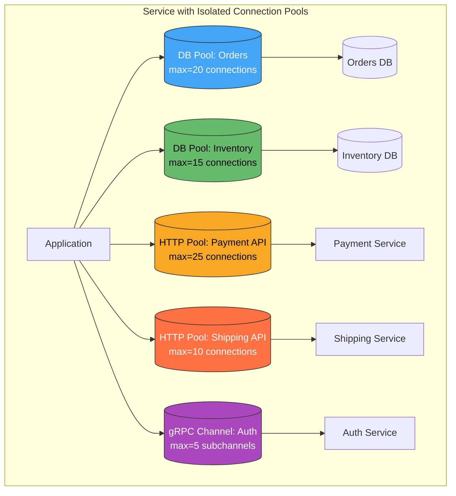

**Why this matters:** If Shipping API is slow, only the 10 shipping connections are occupied. The 20 order DB connections and 25 payment connections are untouched — those workloads continue normally.

---

### Process / Container Bulkhead (Kubernetes)

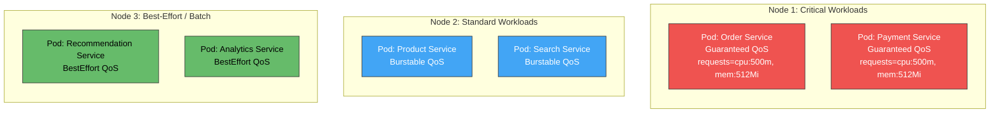

Kubernetes mechanisms for bulkheading:

| Mechanism | Bulkhead Effect |
|---|---|
| **Resource requests/limits** | Per-container CPU/memory isolation |
| **QoS classes** | Guaranteed > Burstable > BestEffort eviction priority |
| **Node taints + tolerations** | Dedicate nodes to workload tiers |
| **Namespace resource quotas** | Cap total resource consumption per namespace (team) |
| **PriorityClasses** | Critical pods preempt non-critical during resource pressure |
| **PodDisruptionBudgets** | Ensure minimum available replicas during disruption |
| **Network Policies** | Isolate network traffic between namespaces |

---

### Infrastructure-Level Bulkhead (Multi-Tenant)

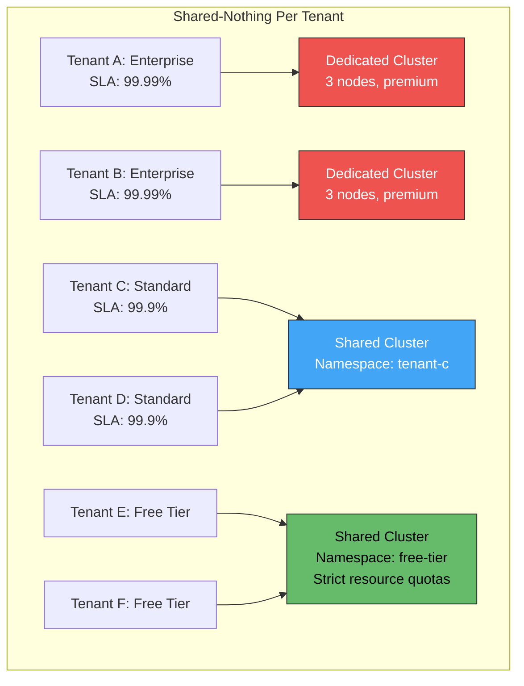

| Isolation Level | Cost | Isolation Strength | Use Case |
|---|---|---|---|
| **Shared thread/connection pool** | Lowest | Weakest | Single-tenant, low risk |
| **Per-dependency pool** | Low | Medium | Standard microservice isolation |
| **Per-tenant namespace + quotas** | Medium | Strong | Multi-tenant SaaS, standard tier |
| **Per-tenant dedicated cluster** | Highest | Complete | Enterprise, compliance, regulated |

---

### Bulkhead + Circuit Breaker + Retry (Combined Resilience)

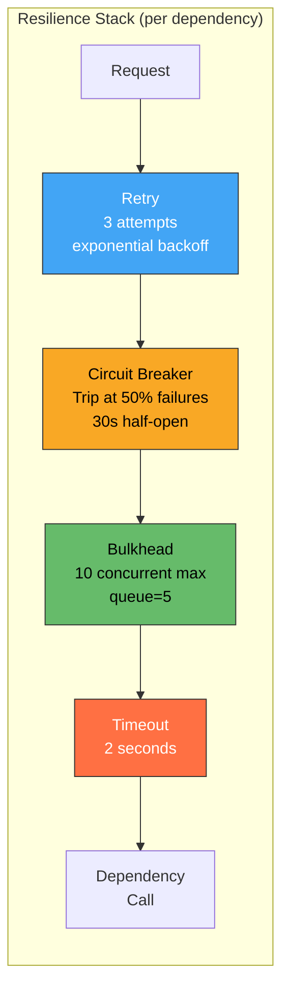

**Execution order matters (outer → inner):**

| Layer | Role | Rejects When |
|---|---|---|
| **Retry** (outermost) | Retries the entire call chain | Never rejects — retries failures |
| **Circuit Breaker** | Stops calls to known-failing dependency | Failure rate exceeds threshold |
| **Bulkhead** | Limits concurrency to this dependency | Max concurrent/queue exceeded |
| **Timeout** (innermost) | Bounds individual call duration | Call exceeds time limit |

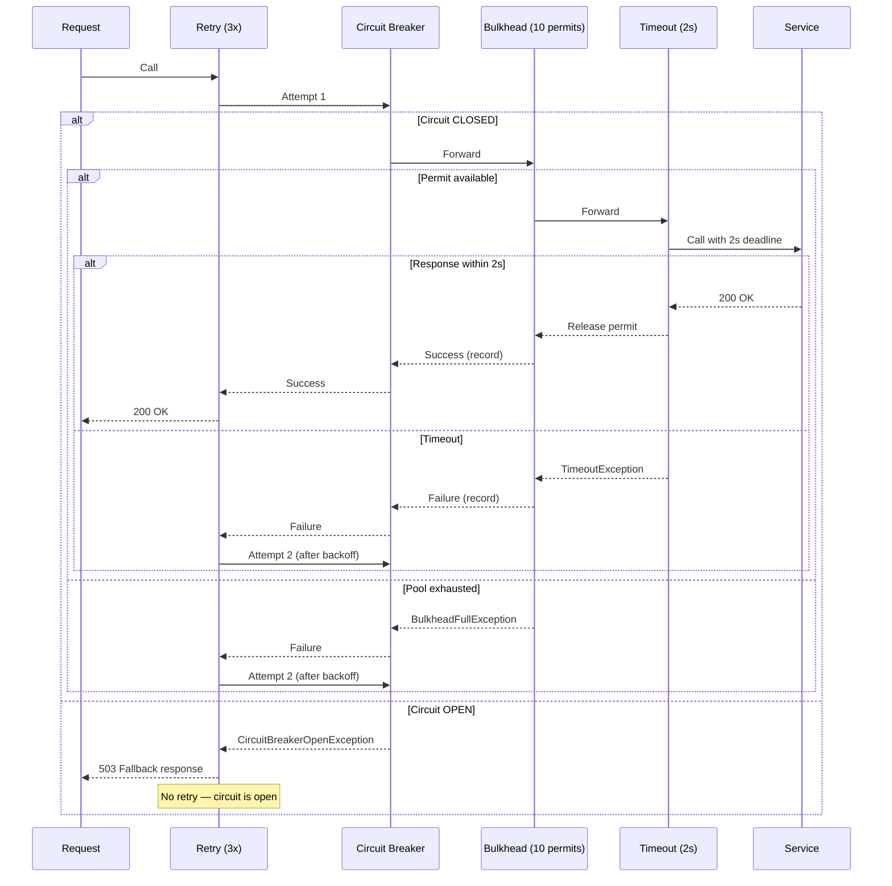

---

### Sizing Bulkheads

| Factor | Guidance |
|---|---|
| **Dependency latency (P99)** | Faster dependency → fewer threads needed for same throughput |
| **Expected throughput** | `pool_size ≥ requests_per_second × latency_seconds` |
| **Criticality** | Critical paths get larger pools; nice-to-have features get smaller |
| **Failure blast radius** | Smaller pools = smaller blast radius, but lower throughput ceiling |
| **Queue size** | Small queue (0-5) for latency-sensitive; larger for batch-tolerant |
| **Total resources** | Sum of all pools must fit within container/JVM limits |

**Formula:**

$$\text{poolSize} = \text{RPS} \times \text{P99LatencySec} \times \text{headroomFactor}$$

**Example:** 100 RPS to Payment Service, P99 = 200ms, headroom = 1.5×

$$\text{poolSize} = 100 \times 0.2 \times 1.5 = 30\ \text{threads}$$

---

### Framework Support

| Language | Library | Bulkhead Type | Configuration |
|---|---|---|---|
| **Java** | Resilience4j | ThreadPool + Semaphore | `maxConcurrentCalls`, `maxWaitDuration` |
| **Java** | Hystrix (deprecated) | ThreadPool + Semaphore | `coreSize`, `maxQueueSize` |
| **.NET** | Polly | Semaphore (Bulkhead policy) | `maxParallelization`, `maxQueuingActions` |
| **Go** | sony/gobreaker + semaphore | Manual (goroutine + channel) | Buffered channel as semaphore |
| **C++** | Custom / Folly | Manual (thread pool + semaphore) | Sized `folly::CPUThreadPoolExecutor` |
| **Rust** | tower::limit | Concurrency limiter | `ConcurrencyLimit` layer |
| **Node.js** | opossum + p-limit | Semaphore (Promise concurrency) | `concurrency` option |
| **Service Mesh** | Istio / Envoy | Connection pool per destination | `maxConnections`, `maxRequestsPerConnection` |

---

### Envoy / Istio Bulkhead (Infrastructure Level)

```yaml
# Istio DestinationRule — connection pool bulkhead
apiVersion: networking.istio.io/v1
kind: DestinationRule
metadata:
  name: payment-service
spec:
  host: payment-service
  trafficPolicy:
    connectionPool:
      tcp:
        maxConnections: 50       # Max TCP connections
        connectTimeout: 500ms
      http:
        h2UpgradePolicy: UPGRADE
        maxRequestsPerConnection: 100
        maxRetries: 3
    outlierDetection:
      consecutive5xxErrors: 3
      interval: 30s
      baseEjectionTime: 60s
```

This gives you **infrastructure-level bulkheading** without any application code — the mesh sidecar enforces connection limits per destination.

---

### Monitoring Bulkheads

| Metric | Alert Threshold | Meaning |
|---|---|---|
| `bulkhead_available_concurrent_calls` | < 20% of max | Pool nearly exhausted — scale up or dependency is slow |
| `bulkhead_rejected_calls_total` | > 0 sustained | Requests being dropped — immediate attention |
| `bulkhead_queue_depth` | > 80% of max | Approaching saturation — dependency likely degraded |
| `bulkhead_call_duration_p99` | > timeout threshold | Calls consuming pool slots too long |
| `connection_pool_active` | > 80% of max | Connection pool pressure — scale pool or dependency |

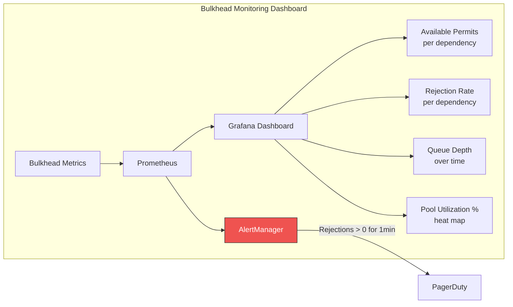

---

### Anti-Patterns

| Anti-Pattern | Problem | Remedy |
|---|---|---|
| **Global shared pool** | One slow dependency starves everything | Dedicated pool per dependency |
| **Oversized bulkheads** | Pool so large it provides no protection — can saturate the system anyway | Size pools based on actual throughput needs + headroom |
| **Undersized bulkheads** | Rejects requests under normal load | Load test to find correct pool size; monitor rejection rate |
| **No fallback on rejection** | Client gets 503 with no useful response | Return cached data, default values, or degraded experience |
| **Bulkhead without timeout** | Threads stuck forever, pool eventually exhausted | Always pair bulkhead with timeout |
| **Bulkhead without circuit breaker** | Full pool keeps trying a dead dependency | Circuit breaker trips fast; bulkhead limits concurrency |
| **Static sizing** | Pool sized for peak traffic wastes resources at low traffic | Consider adaptive sizing or auto-scaling; monitor and tune |
| **Ignoring queue behavior** | Unbounded queue → memory leak; no queue → too many rejections | Small bounded queue (< 10) for most use cases |
| **Bulkhead per feature instead of per dependency** | Same downstream via 3 different features = 3× the connection load | Bulkhead by downstream dependency, not by feature |

---

### Decision Framework

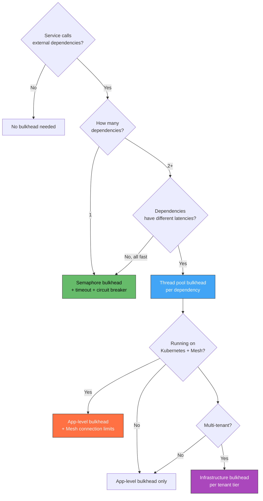

---

### Practical Checklist

- [ ] Identify every external dependency your service calls (DB, API, queue, cache)
- [ ] Assign a **dedicated bulkhead** (thread pool or semaphore) per dependency
- [ ] Size each pool: `RPS × P99_latency × 1.5 headroom`
- [ ] Always pair bulkhead with **timeout** — never let a call run unbounded
- [ ] Layer resilience: Retry → Circuit Breaker → Bulkhead → Timeout
- [ ] Define **fallback** for bulkhead rejection (cached data, default, degraded UX)
- [ ] Set bounded queue size — prefer small (0-5) for latency-sensitive workloads
- [ ] On Kubernetes: set resource requests/limits, use PriorityClasses for critical services
- [ ] On service mesh: configure `connectionPool` in DestinationRule per dependency
- [ ] Monitor: available permits, rejection rate, queue depth, pool utilization
- [ ] Alert on sustained rejections — indicates dependency degradation or pool undersizing
- [ ] Load test bulkhead configuration — verify isolation holds under dependent service failure
- [ ] For multi-tenant: resource quotas per namespace, dedicated nodes for premium tenants

---

### Recommendation

**Every microservice calling external dependencies should have bulkheads.** Start with **semaphore bulkheads** (Resilience4j, Polly) — they're lightweight and sufficient for most cases. Graduate to **thread pool bulkheads** when you have slow or unreliable dependencies where you need hard timeout enforcement via thread interruption. On Kubernetes with a service mesh, add **infrastructure-level bulkheads** (Istio `connectionPool` + resource limits) as a second line of defense. Always combine with **circuit breaker + timeout** — a bulkhead alone limits concurrency but doesn't fast-fail on broken dependencies.

---

### Next Steps to Explore

1. **Circuit Breaker + Bulkhead integration** — detailed configuration with Resilience4j / Polly
2. **Adaptive concurrency limiting** — Netflix concurrency-limits library, auto-sizing pools based on latency
3. **Multi-tenant resource isolation** — Kubernetes namespace quotas, hierarchical resource management
4. **Load shedding** — complementary pattern: reject excess load early at the edge
5. **Chaos testing bulkheads** — inject dependency failures and verify isolation holds