## Saga Pattern in Microservices Architecture

### Context & Assumptions

In a monolith, a single database transaction guarantees **ACID** properties — either all steps succeed or all roll back. In microservices, each service owns its own database. There is **no distributed transaction coordinator** that can atomically commit across multiple databases. The **Saga pattern** solves this by breaking a distributed business transaction into a sequence of **local transactions**, each with a corresponding **compensating action** that undoes its effect if a later step fails.

---

### The Problem: No ACID Across Services

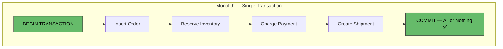

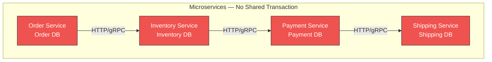

**What can go wrong without Saga:**

| Scenario | Result |
|---|---|
| Payment fails after inventory reserved | Inventory stuck in reserved state — phantom stock lock |
| Shipping fails after payment charged | Customer charged but nothing ships |
| Order service crashes mid-flow | Partial state across 4 databases — manual cleanup |
| Network partition during step 3 | Inconsistent state, no automatic recovery |

---

### What a Saga Is

A Saga is a sequence of **local transactions** $T_1, T_2, \ldots, T_n$ where:

- Each $T_i$ updates a single service's database and publishes an event/message
- Each $T_i$ has a **compensating transaction** $C_i$ that semantically undoes $T_i$  
- If $T_k$ fails, the saga executes $C_{k-1}, C_{k-2}, \ldots, C_1$ in reverse order

$$\text{Success: } T_1 \to T_2 \to T_3 \to \ldots \to T_n$$

$$\text{Failure at } T_k\text{: } T_1 \to \ldots \to T_k (\text{fail}) \to C_{k-1} \to \ldots \to C_1$$

**Key constraint:** Compensations are **semantic undo** — not rollback. You can't un-send an email or un-charge a credit card. You send a cancellation email or issue a refund.

---

### Two Saga Coordination Strategies

#### 1. Choreography (Event-Driven)

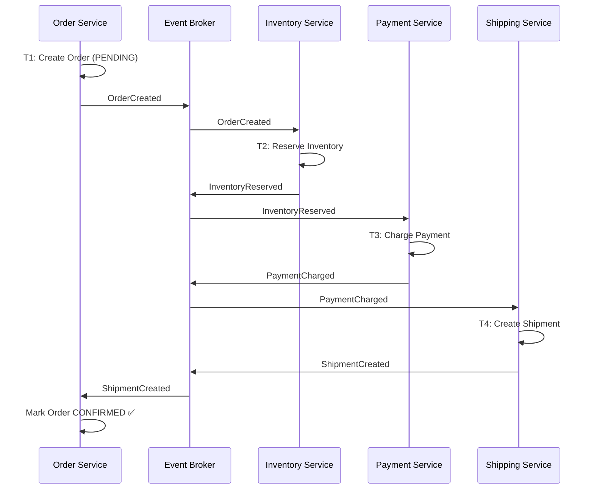

**Compensation flow (Payment fails):**

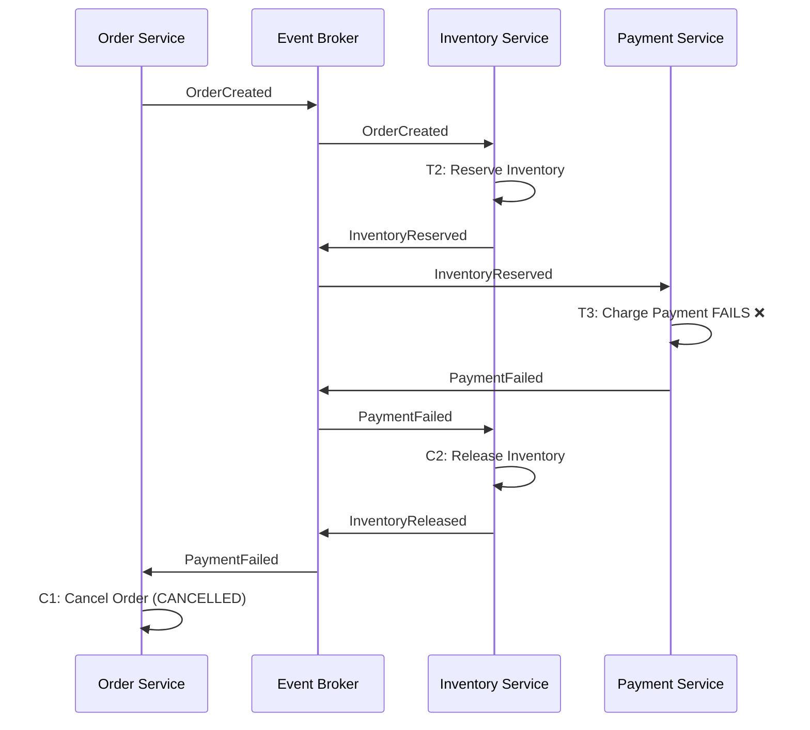

---

#### 2. Orchestration (Central Coordinator)

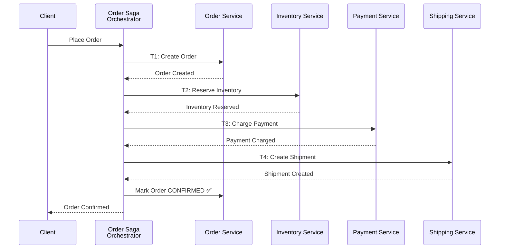

**Compensation flow (Payment fails):**

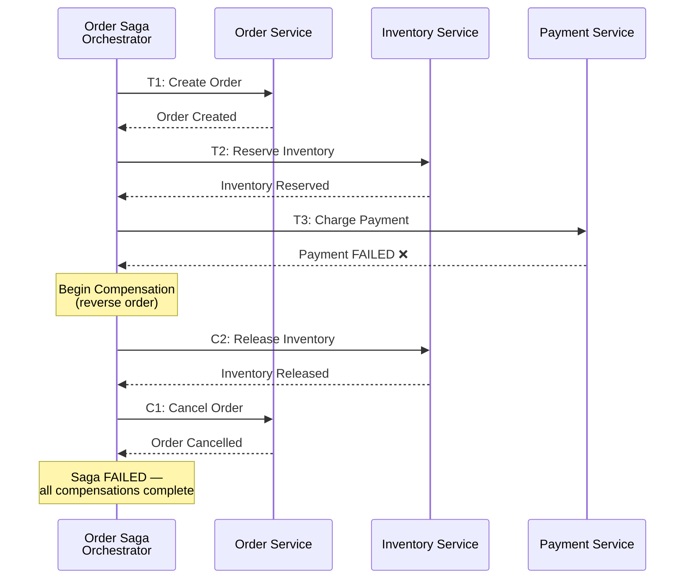

---

### Choreography vs. Orchestration

| Aspect | Choreography | Orchestration |
|---|---|---|
| **Coordination** | Implicit — services react to events | Explicit — central coordinator drives steps |
| **Coupling** | Very loose — services don't know each other | Orchestrator knows all participants |
| **Flow visibility** | Hidden in event chains — hard to trace | Explicit state machine — easy to visualize |
| **Complexity (few steps)** | Simple | Over-engineered |
| **Complexity (many steps)** | Tangled — event spaghetti | Manageable — centralized logic |
| **Adding new steps** | Add a consumer — no existing code changes | Modify orchestrator |
| **Testing** | Integration tests across event chain | Unit test the orchestrator's state machine |
| **Failure handling** | Each service must know compensations to trigger | Orchestrator handles all compensations |
| **Single point of failure** | None (distributed) | Orchestrator (must be resilient) |
| **Best for** | 2-4 step sagas, simple flows | 5+ step sagas, complex branching, conditional logic |

---

### Saga State Machine (Orchestrator)

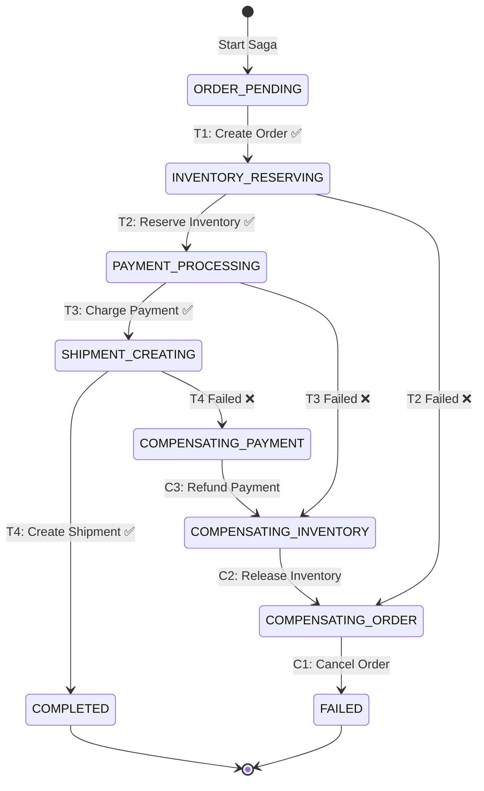

The orchestrator persists its **current state** in a database. On crash, it resumes from the last persisted state — making the saga **crash-recoverable**.

---

### Transaction & Compensation Mapping

| Step | Transaction ($T_i$) | Compensating Transaction ($C_i$) | Idempotent? |
|---|---|---|---|
| 1. Order | Create Order (status: PENDING) | Cancel Order (status: CANCELLED) | Yes (by orderId) |
| 2. Inventory | Reserve stock (decrement available) | Release stock (increment available) | Yes (by reservationId) |
| 3. Payment | Charge customer (create charge) | Refund customer (create refund) | Yes (by chargeId) |
| 4. Shipping | Create shipment label | Cancel shipment | Yes (by shipmentId) |
| 5. Notification | Send order confirmation email | Send cancellation email | Yes (by notificationId) |

**Critical insight:** Step 5 (notification) is **non-compensable** in the traditional sense — you can't un-send an email. This is a **pivot transaction** — once it executes, the saga is committed. Place non-compensable steps **last**.

---

### Semantic Lock (Isolation Concern)

Sagas lack the **I** (Isolation) of ACID. Concurrent sagas can read intermediate state.

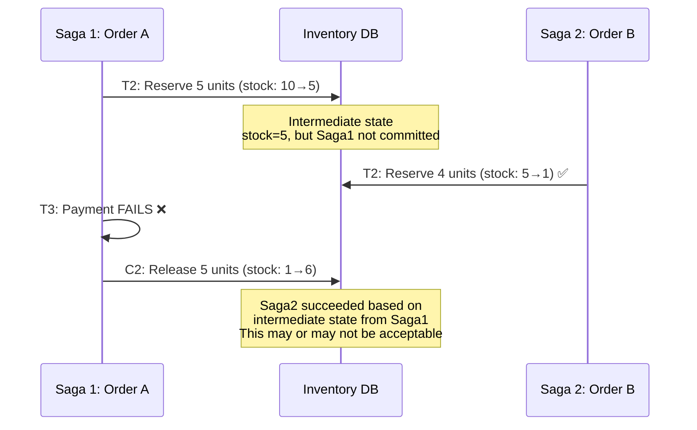

**Countermeasures for isolation:**

| Technique | Description | Trade-off |
|---|---|---|
| **Semantic Lock** | Mark resource as "PENDING" — reject conflicting operations on pending resources | Reduces availability |
| **Commutative Updates** | Design operations that work regardless of order (increment/decrement vs. set) | Not always possible |
| **Pessimistic View** | Reorder saga steps to put risky steps first | Changes business flow |
| **Reread Value** | Re-check state before compensation | Extra read, slight race window |
| **Version / ETag** | Optimistic concurrency — reject if version changed | Retry overhead |
| **By Value** | Decide strategy by business value ($10 order vs. $10K order) | Complexity |

---

### Saga Frameworks & Libraries

| Language/Platform | Framework | Type | Features |
|---|---|---|---|
| **Java** | Axon Framework | Both | Event sourcing, saga orchestration, persistence |
| **Java** | MicroProfile LRA | Orchestration | Long Running Action spec, JAX-RS annotations |
| **Java** | Eventuate Tram | Both | Saga orchestrator + choreography + transactional outbox |
| **.NET** | MassTransit | Both | State machine sagas, Automatonymous |
| **.NET** | NServiceBus | Orchestration | Built-in saga persistence, timeout management |
| **.NET** | Wolverine | Both | Saga state machine with persistence |
| **Go** | Temporal | Orchestration | Durable workflows, automatic retries + compensation |
| **Any** | Temporal.io | Orchestration | Language-agnostic, durable execution, replay |
| **Any** | Apache Camel | Both | Saga EIP, compensation support |
| **Any** | AWS Step Functions | Orchestration | Serverless state machine, error handling + compensation |

---

### Temporal: Modern Saga Orchestration

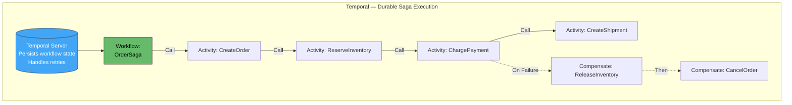

Temporal eliminates the need to hand-code state machines — the workflow function **is** the saga, and Temporal guarantees durable execution even across process crashes.

---

### Saga vs. 2PC vs. Event Sourcing

| Aspect | Saga | 2PC (Two-Phase Commit) | Event Sourcing + Process Manager |
|---|---|---|---|
| **Consistency** | Eventual | Strong (ACID) | Eventual |
| **Availability** | High | Low (coordinator blocks) | High |
| **Latency** | Sum of sequential steps | Blocked on slowest participant | Async, low per-step |
| **Scalability** | High | Low (lock contention) | Very High |
| **Complexity** | Medium-High (compensations) | Low (database handles it) | High (event store + projections) |
| **Isolation** | Weak (requires countermeasures) | Strong (database locks) | Weak-Medium |
| **Recovery** | Compensating transactions | Automatic rollback | Event replay |
| **Cross-vendor** | Yes (any service/DB) | No (requires XA-compatible DBs) | Yes |
| **Use in microservices** | ✅ Primary choice | ❌ Anti-pattern (tight coupling) | ✅ For complex domains |

---

### Failure Modes & Recovery

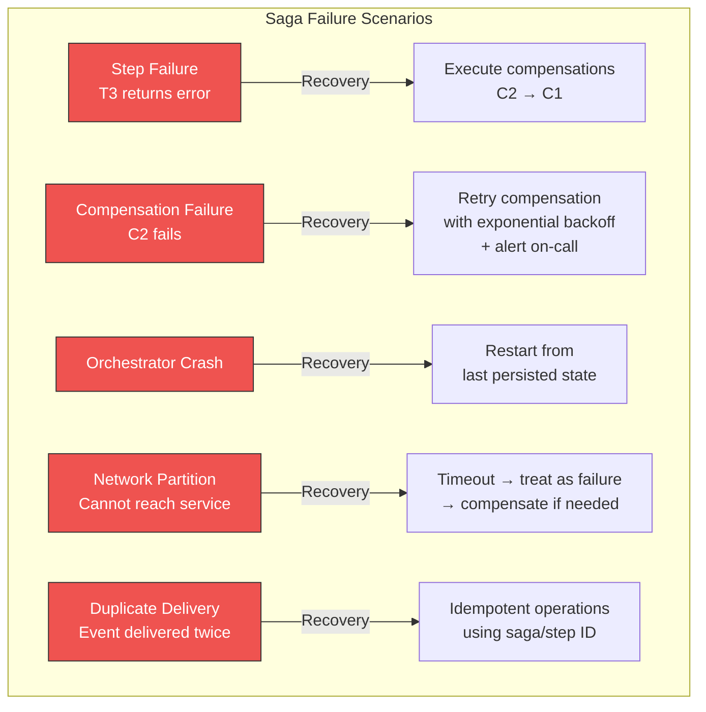

**Compensation failure is the hardest problem.** If compensation itself fails:

1. **Retry with backoff** — most compensations are transient failures
2. **Dead letter queue** — park failed compensations for manual resolution
3. **Alert on-call** — human intervention as last resort
4. **Reconciliation job** — periodic sweep to detect / fix inconsistent state

---

### Transactional Outbox + Saga (Reliable Event Publishing)

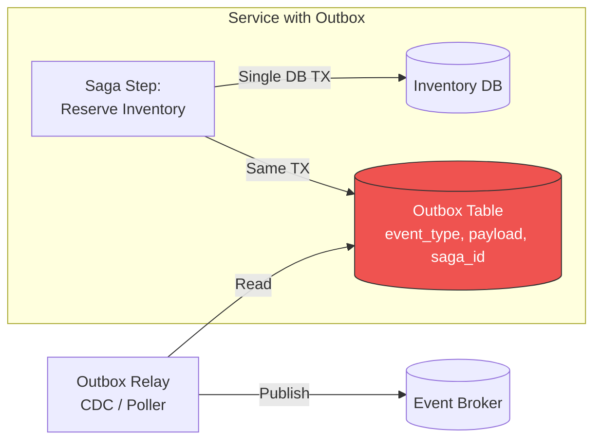

Without the outbox, a service could update its DB but fail to publish the event — leaving the saga stuck. The **Transactional Outbox** guarantees atomicity between local state change and saga event publishing.

---

### Anti-Patterns

| Anti-Pattern | Problem | Remedy |
|---|---|---|
| **No compensating transactions defined** | Failures leave permanent inconsistent state | Design compensation for every step upfront |
| **Non-idempotent steps** | Retries / duplicate events cause double-charging | Every $T_i$ and $C_i$ must be idempotent (use saga/step IDs) |
| **Synchronous orchestration** | Orchestrator blocks waiting for each step → high latency | Use async messaging; orchestrator reacts to events |
| **Compensating non-compensable actions** | Can't un-send email, un-charge in real-time | Place non-compensable steps last (pivot transaction) |
| **Using 2PC instead** | Distributing ACID locks across services kills availability | Sagas embrace eventual consistency |
| **Saga for simple flows** | 2-step saga with orchestrator is over-engineering | Use simple request-response or choreography for ≤3 steps |
| **No saga state persistence** | Orchestrator crash loses saga progress | Persist state after every step (DB, Temporal, event store) |
| **Ignoring isolation** | Concurrent sagas read dirty intermediate state | Apply semantic locks, commutative updates, or reread values |
| **God saga (20+ steps)** | Unmaintainable compensation chain | Decompose into sub-sagas or rethink bounded context boundaries |
| **No timeout on steps** | Saga stuck waiting forever on unresponsive service | Timeout + treat as failure → compensate |

---

### Decision Framework

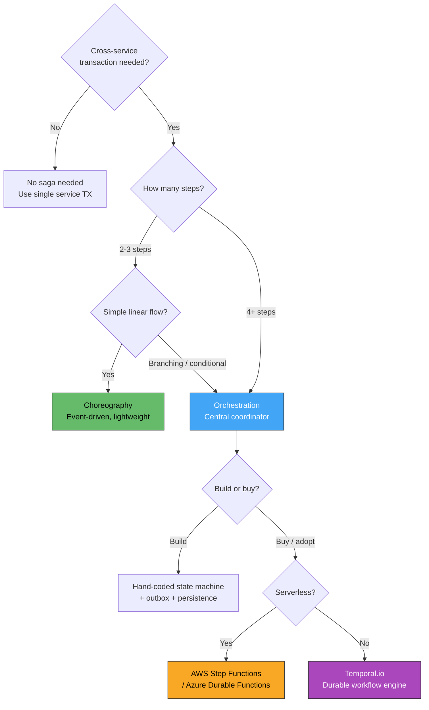

---

### Practical Checklist

- [ ] Map every cross-service business transaction into a saga with explicit steps
- [ ] Define compensating transaction ($C_i$) for every forward transaction ($T_i$)
- [ ] Make every step and compensation **idempotent** (saga ID + step ID as deduplication key)
- [ ] Place non-compensable steps (email, SMS) **last** in the saga (pivot transaction)
- [ ] Persist saga state after every step transition — survive crashes
- [ ] Use **Transactional Outbox** for reliable event publishing within each step
- [ ] Set **timeouts** on every step — stuck step → treat as failure → compensate
- [ ] Handle compensation failure: retry with backoff → DLQ → alert → manual reconciliation
- [ ] Address isolation: semantic locks on resources in PENDING state
- [ ] Monitor: saga duration, step failure rate, compensation rate, stuck sagas count
- [ ] Alert on sagas stuck in intermediate state > N minutes
- [ ] Load test concurrent sagas to validate isolation countermeasures
- [ ] For 2-3 step simple flows: prefer choreography over orchestration
- [ ] For 4+ steps or complex branching: use orchestration (Temporal, Step Functions, Axon)

---

### Recommendation

**Sagas are the primary pattern for distributed transactions in microservices** — 2PC should be avoided across service boundaries. For simple 2-3 step linear flows, **choreography** (event-driven) is lighter and more decoupled. For 4+ steps, conditional branching, or complex compensation logic, use **orchestration** with a durable workflow engine like **Temporal.io** — it eliminates the need to hand-code state machines, persistence, retries, and timeouts, and is the most robust option available today. Regardless of coordination style, every saga step must be **idempotent**, every step must have a **defined compensation**, and saga state must be **persisted** to survive failures.

---

### Next Steps to Explore

1. **Temporal.io deep-dive** — durable workflows as saga orchestrators
2. **Transactional Outbox + CDC** — reliable event publishing for saga steps
3. **Saga isolation countermeasures** — semantic locks, commutative updates, reread patterns
4. **Choreography-based saga testing** — how to integration test event chains
5. **Process Manager pattern** — orchestration variant that routes events through a state machine