## Outbox Pattern in Microservices Architecture

### Context & Assumptions

In microservices, a service frequently needs to **update its database AND publish an event** to a message broker — atomically. The problem: these are two different systems with no shared transaction. If the DB write succeeds but the event publish fails (or vice versa), the system enters an **inconsistent state** — downstream services never learn about the change, or they react to a change that was rolled back.

The **Transactional Outbox pattern** solves this by writing the event into an **outbox table** in the **same database transaction** as the business data, then a separate process reliably relays that event to the message broker.

---

### The Problem: Dual Write

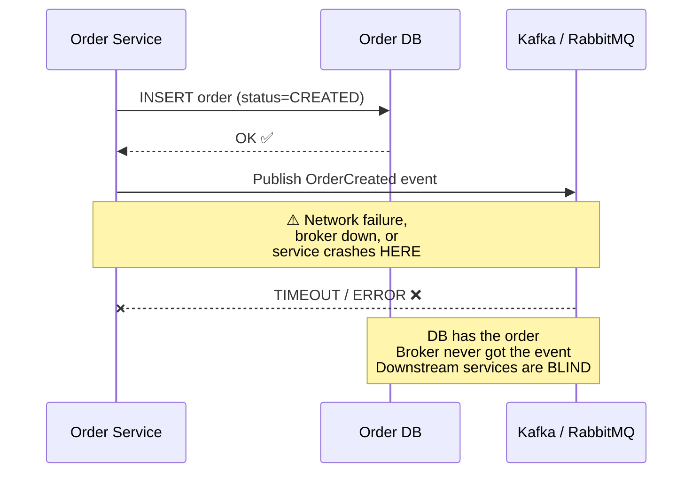

**The dual-write problem:** Writing to two separate systems (DB + broker) without a distributed transaction means one can succeed while the other fails.

| Failure Scenario | DB State | Broker State | Result |
|---|---|---|---|
| DB write succeeds, publish fails | Order exists | No event | Downstream services never know — **lost event** |
| DB write fails, publish succeeds | No order | Event published | Consumers process a phantom order — **ghost event** |
| Service crashes between DB write and publish | Order exists | No event | Same as scenario 1 — **lost event** |
| Publish succeeds, DB crashes before commit | No order | Event published | **Ghost event** — consumers react to nothing |

---

### The Solution: Transactional Outbox

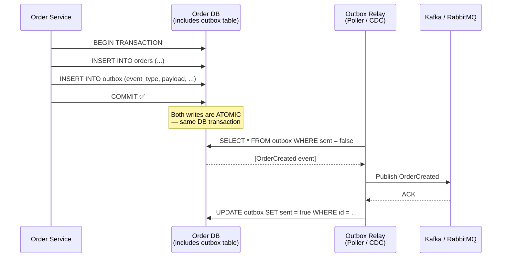

**The key insight:** By writing the event to the **same database** as the business data, in the **same transaction**, atomicity is guaranteed by the local database engine — no distributed transaction needed.

---

### Architecture Overview

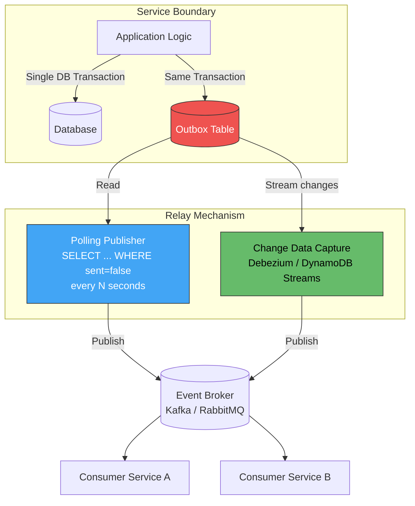

---

### Outbox Table Schema

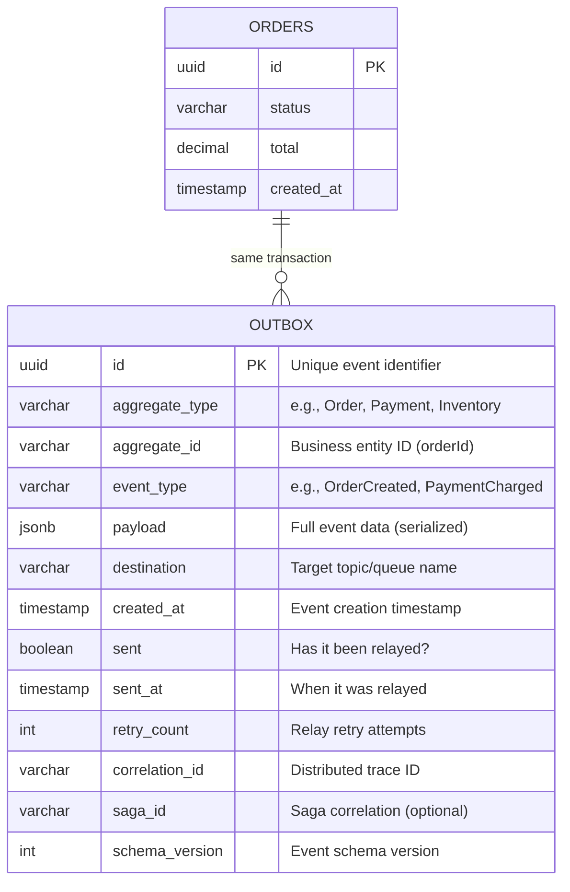

**Minimal required columns:** `id`, `aggregate_id`, `event_type`, `payload`, `created_at`, `sent`. The rest are operational enrichments.

---

### Two Relay Strategies

#### 1. Polling Publisher

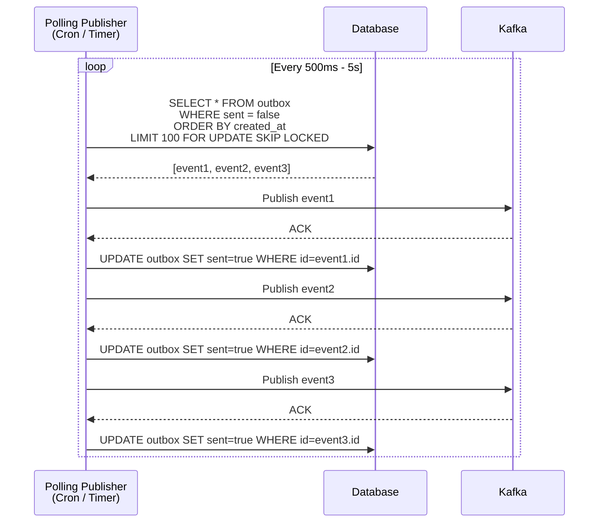

| Aspect | Detail |
|---|---|
| **Mechanism** | Periodic `SELECT` on outbox table |
| **Latency** | Polling interval (500ms–5s) |
| **Ordering** | Guaranteed by `ORDER BY created_at` |
| **Scaling** | `FOR UPDATE SKIP LOCKED` allows multiple pollers |
| **DB load** | Constant querying even when no events — index required |
| **Simplicity** | Very simple to implement |

---

#### 2. Change Data Capture (CDC)

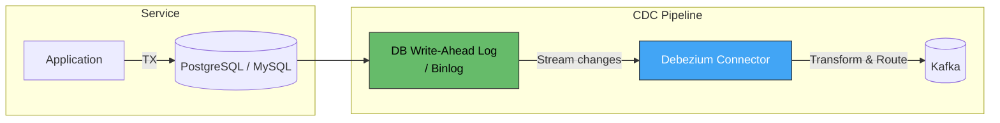

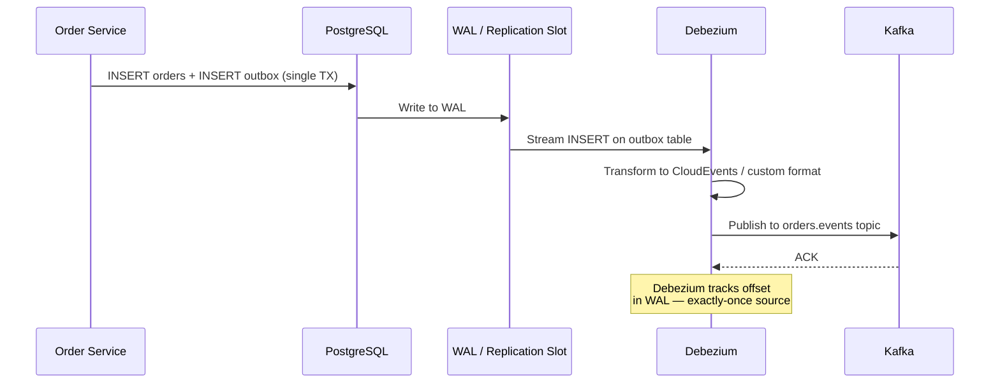

| Aspect | Detail |
|---|---|
| **Mechanism** | Reads database transaction log (WAL / binlog) |
| **Latency** | Near real-time (milliseconds) |
| **Ordering** | Preserves DB transaction order (WAL order) |
| **Scaling** | Single reader per replication slot (Debezium handles failover) |
| **DB load** | Minimal — reads log, not table |
| **Complexity** | Higher — requires Debezium, Kafka Connect, log access |

---

### Polling vs. CDC Comparison

| Factor | Polling Publisher | CDC (Debezium) |
|---|---|---|
| **Latency** | 500ms–5s (polling interval) | ~10-100ms (near real-time) |
| **DB load** | Periodic queries (needs index) | Reads WAL — minimal impact |
| **Ordering guarantee** | `ORDER BY` in query | WAL order (strongest guarantee) |
| **Implementation** | Simple timer + SQL | Debezium + Kafka Connect infrastructure |
| **Operational complexity** | Low | Medium-High (connector management) |
| **Scaling** | Multiple pollers with `SKIP LOCKED` | Single connector (active-passive failover) |
| **No outbox table needed?** | No — needs outbox table | Can read ANY table's changes (outbox optional) |
| **Cleanup** | Must delete/archive relayed rows | Can skip outbox table entirely (CDC on business tables) |
| **Best for** | Simple systems, low event volume | High volume, low-latency requirements |

---

### CDC Without Outbox Table (Direct Capture)

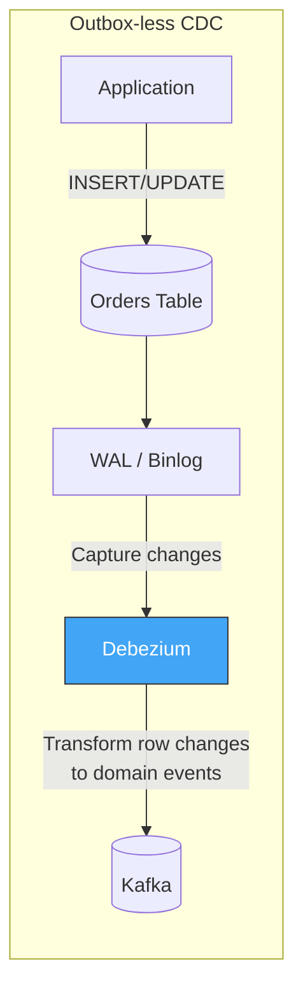

**Trade-off:** Simpler (no outbox table), but you're coupling event shape to DB schema. If your table schema changes, the "event" changes. Using an explicit outbox table **decouples** event schema from internal DB schema.

| Approach | Decoupling | Flexibility | Simplicity |
|---|---|---|---|
| Outbox table + CDC | Event schema ≠ DB schema | Full control over event payload | Medium |
| Direct table CDC | Event schema = DB row change | Limited — what's in the row | High |
| Outbox table + Polling | Event schema ≠ DB schema | Full control | Highest |

---

### Exactly-Once vs. At-Least-Once Delivery

The outbox pattern inherently provides **at-least-once** delivery. If the relay publishes but crashes before marking `sent=true`, it will re-publish on restart.

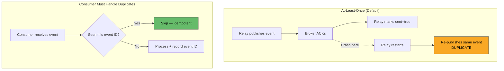

**Idempotent consumer pattern (required):**

| Technique | How It Works |
|---|---|
| **Event ID deduplication table** | Consumer stores processed event IDs; rejects duplicates |
| **Idempotency key in business logic** | `CREATE IF NOT EXISTS` or `UPSERT` semantics |
| **Kafka consumer offsets** | Commit offset only after processing (at-least-once) |
| **Exactly-once with Kafka transactions** | Debezium + Kafka transactional producer + consumer `read_committed` |

---

### Outbox in Saga Pattern

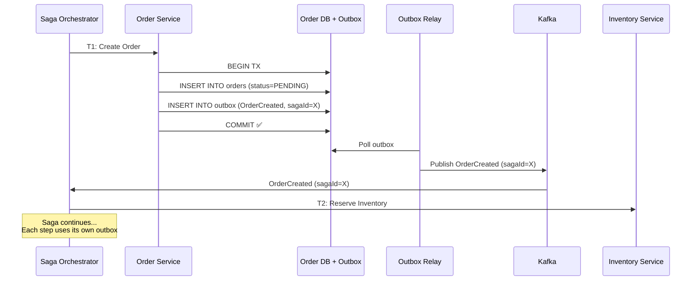

Every saga participant uses the outbox pattern to **guarantee** that saga events are published after local state changes — the outbox is the backbone of reliable saga execution.

---

### Outbox Table Lifecycle & Cleanup

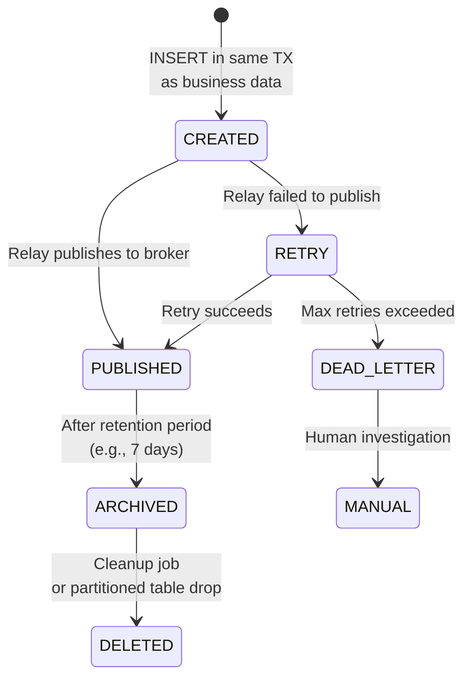

| Strategy | Mechanism | Trade-off |
|---|---|---|
| **DELETE after publish** | Relay deletes rows after ACK | Simple; loses replay capability |
| **Soft delete (sent=true)** | Mark sent, cleanup later | Allows debugging; grows table |
| **Time-partitioned table** | Partition by day/week, drop old partitions | Efficient bulk cleanup; PostgreSQL/MySQL native |
| **Separate archive table** | Move sent events to archive | Keeps outbox small; archive for audit |
| **TTL / Auto-expire** | DynamoDB TTL, Cassandra TTL | Automatic; no cleanup job needed |

**Without cleanup, the outbox table grows unbounded** — this is the most common operational issue with the pattern.

---

### Database-Specific Implementations

| Database | CDC Mechanism | Outbox Specifics |
|---|---|---|
| **PostgreSQL** | Logical replication / `pgoutput` | Debezium PostgreSQL connector; requires `wal_level=logical` |
| **MySQL** | Binlog streaming | Debezium MySQL connector; requires `binlog_format=ROW` |
| **MongoDB** | Change Streams | Debezium MongoDB connector; embedded doc or separate collection |
| **DynamoDB** | DynamoDB Streams | Lambda trigger on stream; TTL for cleanup |
| **SQL Server** | CDC (built-in) or CT | Debezium SQL Server connector |
| **Cosmos DB** | Change Feed | Azure Functions trigger; built-in mechanism |

```mermaid
graph TD
    subgraph "PostgreSQL + Debezium"
        PG[(PostgreSQL<br/>wal_level=logical)] --> SLOT[Replication Slot]
        SLOT --> DEB[Debezium<br/>PostgreSQL Connector]
        DEB --> KC[Kafka Connect]
        KC --> KAFKA[(Kafka)]
    end

    subgraph "DynamoDB + Lambda"
        DDB[(DynamoDB<br/>+ outbox items)] --> STREAM[DynamoDB Streams]
        STREAM --> LAMBDA[Lambda Function]
        LAMBDA --> SQS[(SQS / EventBridge)]
    end

    subgraph "MongoDB + Change Streams"
        MONGO[(MongoDB<br/>outbox collection)] --> CS[Change Stream]
        CS --> DEBM[Debezium<br/>MongoDB Connector]
        DEBM --> KAFKA2[(Kafka)]
    end

    style DEB fill:#42a5f5,stroke:#333,color:#fff
    style LAMBDA fill:#f9a825,stroke:#333,color:#000
    style DEBM fill:#66bb6a,stroke:#333,color:#000
```

---

### Debezium Outbox Event Router

Debezium provides a dedicated **Outbox Event Router** SMT (Single Message Transform) specifically for the outbox pattern:

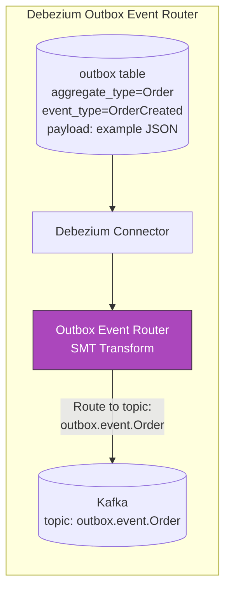

The SMT:
- Reads the outbox table insert
- Extracts `aggregate_type` → Kafka topic name
- Extracts `aggregate_id` → Kafka message key (partitioning)
- Extracts `payload` → Kafka message value
- **Deletes the outbox row** after capture (optional, via table.field.event.timestamp)

---

### Ordering Guarantees

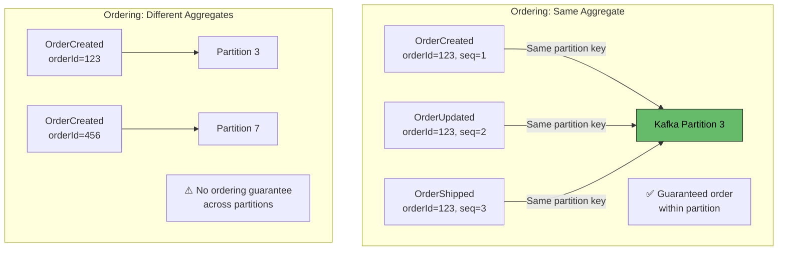

| Guarantee | Mechanism | Scope |
|---|---|---|
| **Per-aggregate ordering** | Use `aggregate_id` as Kafka partition key | Events for same entity are in same partition → ordered |
| **Cross-aggregate ordering** | Not guaranteed by Kafka partitions | Use timestamps + consumer-side reordering if needed |
| **Global ordering** | Single partition (sacrifices throughput) | Rarely needed; avoid if possible |

---

### Anti-Patterns

| Anti-Pattern | Problem | Remedy |
|---|---|---|
| **Publish-then-write** | Event sent but DB write fails → ghost event | Always write DB first (outbox in same TX), then relay |
| **No outbox cleanup** | Table grows to millions of rows → DB performance degrades | Time-partitioned table, TTL, or periodic DELETE of sent rows |
| **Large payloads in outbox** | Outbox rows with 100KB+ payloads bloat DB and WAL | Store reference/ID in outbox; consumer fetches full data from source |
| **No idempotent consumers** | At-least-once relay → duplicate processing downstream | Every consumer deduplicates by event ID |
| **Polling without index** | `WHERE sent=false` does full table scan | Create index on `(sent, created_at)` |
| **Single-threaded poller, high volume** | Poller can't keep up → growing lag | Use `SKIP LOCKED` with multiple pollers, or switch to CDC |
| **Outbox per event type** | Multiple outbox tables → operational nightmare | Single outbox table, filter by `event_type` / `aggregate_type` |
| **Business logic in relay** | Relay transforms or enriches events → coupling | Relay is a dumb pipe; all event shaping happens at write time |
| **Ignoring relay failures** | Relay crashes silently → events stuck in outbox | Monitor outbox lag (count of `sent=false` rows); alert on growth |
| **CDC without outbox table** | Couples event schema to internal DB schema | Use explicit outbox table to decouple |

---

### Monitoring & Alerting

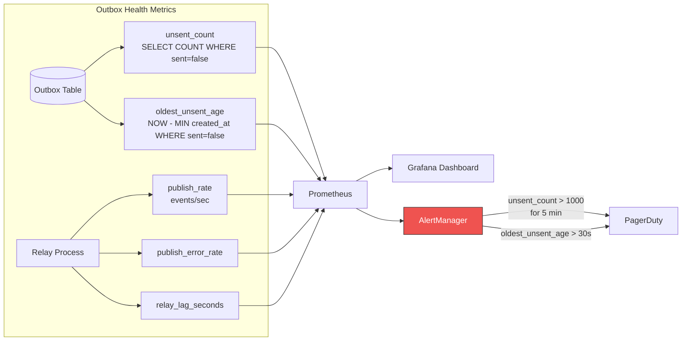

| Metric | Alert Threshold | Meaning |
|---|---|---|
| `outbox_unsent_count` | > 1000 for 5min | Relay can't keep up or is down |
| `outbox_oldest_unsent_age_seconds` | > 30s | Events are stuck — relay issue or DB lock |
| `relay_publish_error_rate` | > 0 sustained | Broker unreachable or auth issue |
| `outbox_table_row_count` | > 100K | Cleanup not running |
| `debezium_connector_status` | != RUNNING | CDC connector crashed — events not flowing |

---

### Decision Framework

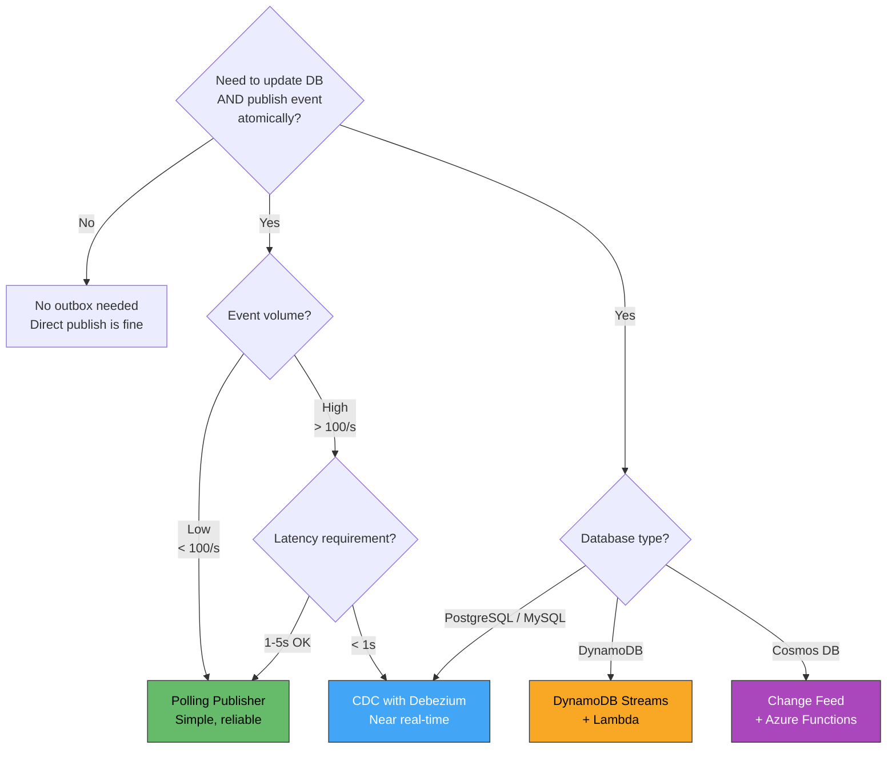

---

### Practical Checklist

- [ ] Write event to outbox table in the **same DB transaction** as business data
- [ ] Choose relay strategy: Polling (simple) or CDC/Debezium (low latency, high volume)
- [ ] Index outbox table: `CREATE INDEX ON outbox (sent, created_at)`
- [ ] Use `aggregate_id` as message key for per-entity ordering in Kafka
- [ ] Make every downstream consumer **idempotent** (dedup by event ID)
- [ ] Implement outbox cleanup: time-partitioned tables, TTL, or periodic DELETE
- [ ] Monitor: unsent count, oldest unsent age, relay error rate
- [ ] Alert on outbox lag > 30s or unsent count growing
- [ ] Keep event payloads small — store references for large data
- [ ] Relay is a dumb pipe — no business logic in the relay process
- [ ] For sagas: every participant service uses outbox for reliable event publishing
- [ ] Test failure scenarios: kill relay mid-publish → verify at-least-once + consumer idempotency
- [ ] If using Debezium: monitor connector status, configure `snapshot.mode`, set up failover

---

### Recommendation

The **Transactional Outbox is a foundational pattern** — use it whenever a microservice must update its database and notify other services reliably. For most teams, start with the **Polling Publisher** — it requires no additional infrastructure beyond your existing database, is easy to understand and debug, and handles moderate event volumes well. Move to **CDC with Debezium** when you need sub-second relay latency, handle high event volumes (>100/s), or want to eliminate polling overhead. On managed databases (DynamoDB, Cosmos DB), use their **native change stream mechanisms** instead of external CDC. Regardless of relay strategy, **every consumer must be idempotent** — at-least-once delivery is inherent to the pattern.

---

### Next Steps to Explore

1. **Debezium deep-dive** — connector configuration, offset management, schema evolution
2. **Inbox pattern** — the consumer-side counterpart to outbox for idempotent event processing
3. **Outbox + Saga integration** — how each saga step uses outbox for reliable progression
4. **Event versioning in outbox** — schema evolution strategies (Avro, Protobuf, JSON Schema)
5. **Exactly-once processing** — Kafka transactions + consumer `read_committed` isolation