## Self-Containment Pattern in Microservices Architecture

### Context & Assumptions

The **Self-Containment pattern** (also called **Self-Contained Service** or **Autonomous Service**) ensures that a microservice can fulfill its primary function **without synchronous runtime dependencies** on other services. Instead of calling another service in real time to serve a request, a self-contained service maintains a **local copy of the data it needs** — obtained through asynchronous replication, event-driven synchronization, or eventual consistency mechanisms. If every upstream dependency must be online for your service to respond, you don't have a microservice — you have a **distributed monolith**.

---

### The Problem: Runtime Coupling

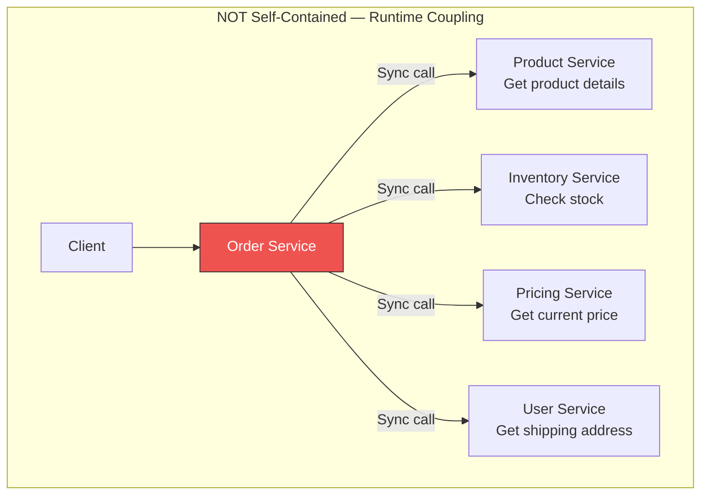

**What happens when Product Service is down?**

| Scenario | Impact |
|---|---|
| Product Service down | Order Service **cannot** display order details → 503 |
| Inventory Service slow (5s latency) | Order Service latency = **sum of all dependencies** |
| Pricing Service deploys broken version | Order Service returns **wrong prices or errors** |
| User Service at capacity | Order Service **blocked**, cannot process orders |
| Any single failure | **Cascading failure** across the entire call chain |

**Availability math:** If each dependency has 99.9% uptime and you have 4 synchronous dependencies:

$$A_{total} = 0.999^4 = 0.996 = 99.6\%$$

That's **3.5 hours of downtime per year** from dependencies alone — and this optimistically assumes failures are independent.

---

### The Solution: Self-Contained Service

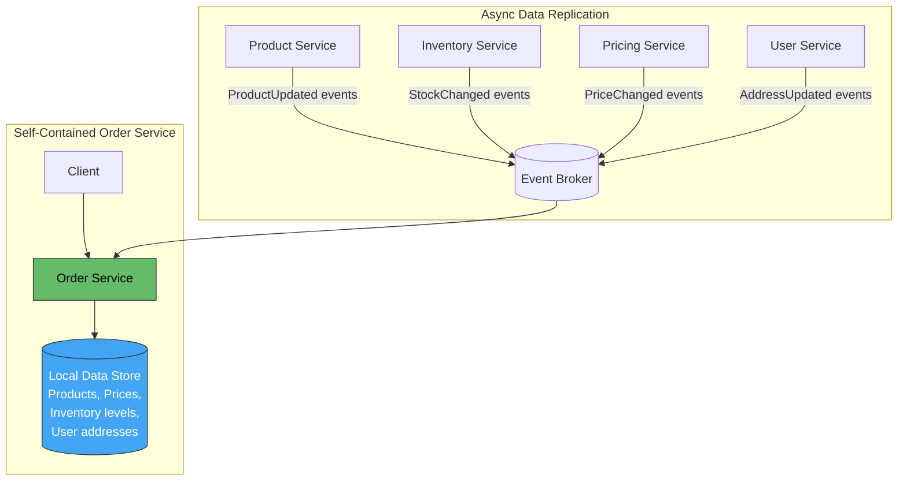

**Result:** The Order Service can fulfill requests using **only its local data**. If Product Service is down, new product updates stop flowing, but existing products remain queryable. The service is **autonomous at runtime**.

---

### Core Principles

| Principle | Description |
|---|---|
| **Runtime autonomy** | Service can handle requests without synchronous calls to other services |
| **Local data ownership** | Service owns a local projection of the data it needs |
| **Eventual consistency** | Accepts that local data may be slightly stale (seconds to minutes) |
| **Async replication** | Data flows via events, CDC, or periodic sync — never synchronous queries at request time |
| **Graceful degradation** | If replication lags, service works with last-known data, not fail |
| **Independent deployability** | Service can be deployed, scaled, and restarted without coordinating with others |

---

### Self-Containment Spectrum

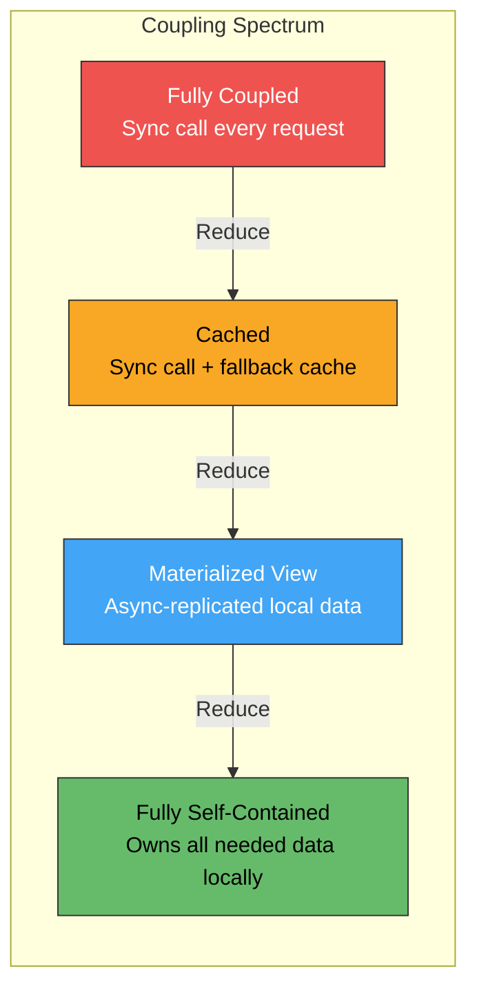

| Level | Runtime Dependency | Staleness | Availability | Complexity |
|---|---|---|---|---|
| **Sync call** | Full — cannot serve without upstream | Zero (real-time) | Lowest ($A^n$ degradation) | Lowest |
| **Sync + cache fallback** | Partial — fails on cache miss + upstream down | Configurable TTL | Medium | Low |
| **Materialized local view** | None at request time | Seconds to minutes (event lag) | High | Medium |
| **Fully self-contained** | None — owns all data | Seconds to minutes | Highest | Highest |

---

### Data Replication Strategies

```mermaid
graph TD
    subgraph "Strategy 1: Event-Carried State Transfer"
        SRC1[Source Service] -->|Fat events with<br/>full entity state| BROKER1[(Broker)]
        BROKER1 --> CONS1[Consumer Service<br/>Writes to local projection]
    end

    subgraph "Strategy 2: Event Notification + Pull"
        SRC2[Source Service] -->|Thin event:<br/>ProductUpdated id=123| BROKER2[(Broker)]
        BROKER2 --> CONS2[Consumer Service]
        CONS2 -->|Async API call:<br/>GET /products/123| SRC2
        CONS2 -->|Write to local store| LOCAL2[(Local Store)]
    end

    subgraph "Strategy 3: CDC (Change Data Capture)"
        SRC3[(Source DB)] -->|WAL / Binlog| DEB[Debezium]
        DEB --> BROKER3[(Broker)]
        BROKER3 --> CONS3[Consumer Service<br/>Writes to local projection]
    end

    style CONS1 fill:#66bb6a,stroke:#333,color:#000
    style CONS2 fill:#42a5f5,stroke:#333,color:#fff
    style CONS3 fill:#ab47bc,stroke:#333,color:#fff
```

| Strategy | Data Freshness | Payload Size | Source Coupling | Best For |
|---|---|---|---|---|
| **Event-Carried State Transfer** | Near real-time | Large (full entity) | Low — consumer never calls source | High-throughput, critical self-containment |
| **Event Notification + Pull** | Slight delay (event + API call) | Small event, full on pull | Medium — still calls source API async | Low event volume, large entity payloads |
| **CDC (Debezium)** | Near real-time | Row-change granularity | Lowest — reads DB log, no API | Legacy integration, zero-code eventing |
| **Periodic Sync (Batch)** | Minutes to hours | Full dataset | Medium — scheduled API call | Slowly-changing reference data (countries, currencies) |
| **Shared Event Store** | Real-time | Event-sourced | Low | Event-sourced architectures |

---

### Architecture: Self-Contained Order Service (Detailed)

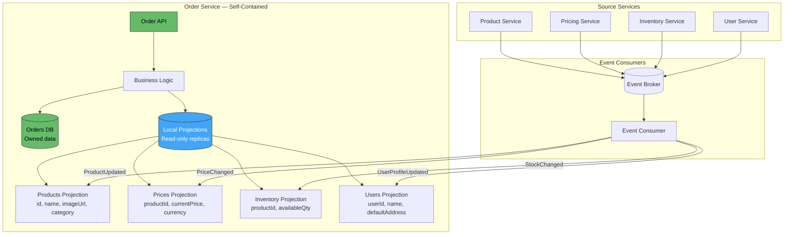

**Key distinction:** The Order Service has **two categories of data**:
1. **Owned data** (orders) — full read/write authority, authoritative source of truth
2. **Projected data** (products, prices, users) — read-only local copies, eventually consistent with source

---

### What to Replicate vs. What to Call

Not all data needs local replication. Use this decision framework:

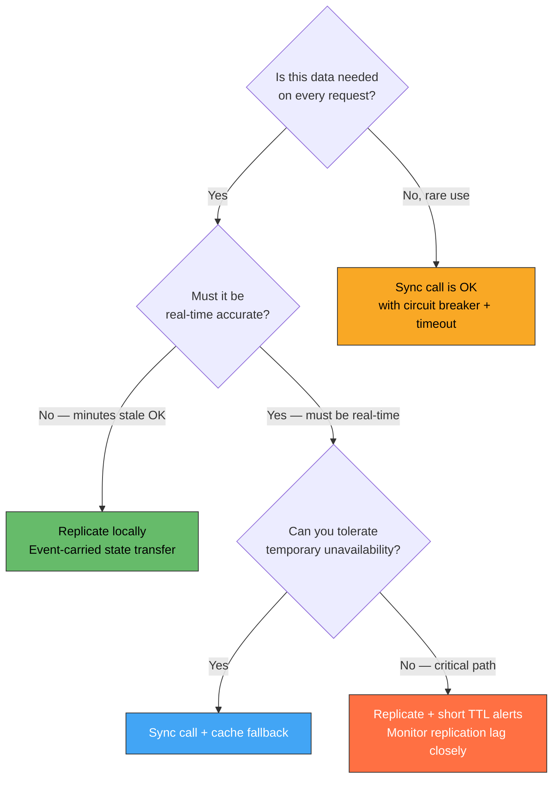

| Data | Replicate Locally? | Reason |
|---|---|---|
| Product name, description, images | ✅ Yes | Needed on every order read; rarely changes |
| Current price | ✅ Yes | Needed on order creation; changes infrequently |
| Available inventory count | ✅ Yes (approximate) | Needed for "in stock" display; exact count checked at reservation |
| User shipping address | ✅ Yes | Needed on order display; user controls changes |
| Real-time payment status | ❌ No — sync call | Changes rapidly; authoritative truth in payment system |
| Credit score / fraud signal | ❌ No — sync call | Must be real-time accurate for authorization |
| Historical exchange rates | ✅ Yes (batch sync) | Reference data; daily updates sufficient |

---

### Local Projection Storage Options

| Storage | Best For | Trade-off |
|---|---|---|
| **Same DB, separate tables** | Simple; single DB to manage | Shared DB resource contention |
| **Embedded cache (in-memory)** | Ultra-low latency reads | Lost on restart; limited size |
| **Redis / Memcached** | Fast lookups, TTL management | Extra infrastructure; no joins |
| **Separate read DB (PostgreSQL)** | Complex queries on projections | More infra; replication lag |
| **Elasticsearch** | Full-text search on projected data | Eventual consistency; index lag |
| **SQLite (embedded)** | Sidecar/edge deployments | Single-node only; no sharing |

---

### Handling Staleness

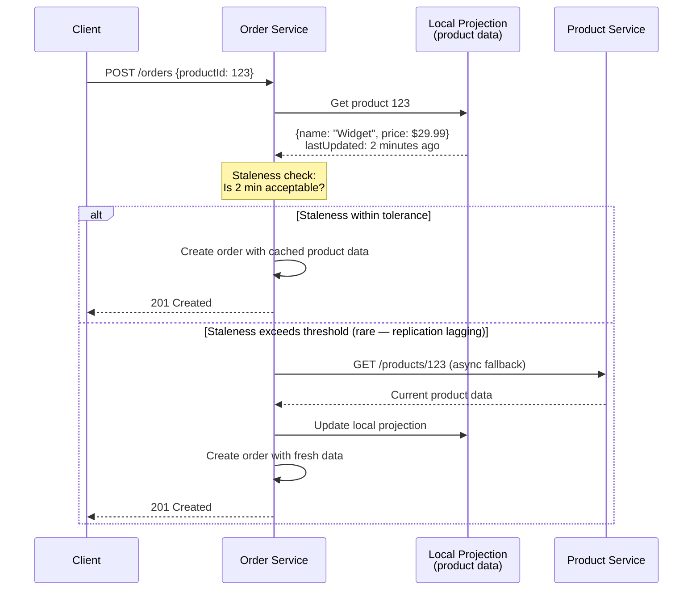

**Staleness tolerances by use case:**

| Data | Acceptable Staleness | Reason |
|---|---|---|
| Product catalog | 5-30 minutes | Rarely changes mid-session |
| Prices | 1-5 minutes | Price changes are infrequent; latching at order time |
| Inventory approximate count | 1-2 minutes | Exact count verified at reservation step |
| User profile | 10-30 minutes | User rarely changes address mid-order |
| Feature flags | 1-5 minutes | Gradual rollout; seconds don't matter |
| Security policies / permissions | 10-60 seconds | Tighter consistency for access control |

---

### Self-Containment + Saga Integration

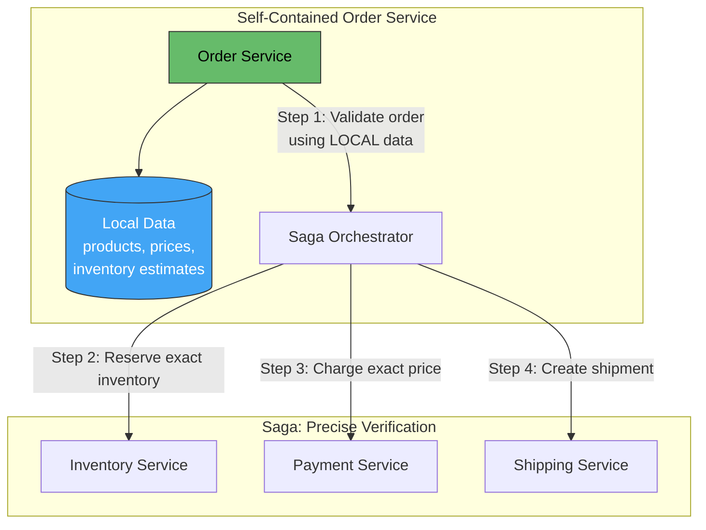

**Pattern:** Use local projections for **fast validation and display**, then use the saga for **authoritative operations** that require precise, real-time state from source services.

| Phase | Data Source | Consistency |
|---|---|---|
| Browsing / display | Local projection | Eventual — acceptable |
| Pre-validation (can I likely place this order?) | Local projection | Approximate — fast reject |
| Actual reservation / charging | Source service via saga | Strong — authoritative |

---

### Self-Containment in Different Contexts

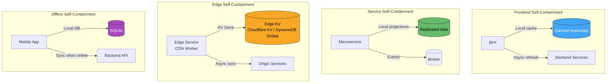

---

### Benefits & Trade-offs

| Benefit | Trade-off |
|---|---|
| **High availability** — no runtime dependency chain | **Data duplication** — same data in multiple services |
| **Low latency** — local reads, no network hop | **Eventual consistency** — stale data risk |
| **Independent deployability** — deploy without coordinating | **Replication complexity** — must build and maintain projections |
| **Fault isolation** — upstream failures don't cascade | **Storage cost** — duplicate storage across services |
| **Predictable performance** — no dependency latency variance | **Reconciliation** — must detect and handle replication lag |
| **Scalable** — each service scales independently | **Schema coupling** — event schema changes affect consumers |

---

### Anti-Patterns

| Anti-Pattern | Problem | Remedy |
|---|---|---|
| **Replicate everything** | Massive data duplication; every service stores entire domain | Replicate only what the service needs for its primary function |
| **Stale data with no awareness** | Service uses months-old projection without knowing | Monitor replication lag; set staleness thresholds; alert on lag |
| **Local data treated as authoritative** | Service makes decisions on stale projected data | Use local data for display/pre-validation; authoritative ops via saga |
| **Sync fallback on every request** | "Self-contained" service that actually calls upstream on every cache miss | Ensure local projection handles cold-start (replay from broker) |
| **No projection rebuild mechanism** | Local data gets corrupted — no way to rebuild | Replay events from broker (Kafka retention) or bootstrap API |
| **Write to projected data** | Service modifies its local copy of another service's data | Projections are read-only; only the source service writes authoritative data |
| **Ignoring schema evolution** | Source service changes event format → projection consumer breaks | Use schema registry; backward-compatible event evolution |
| **Over-containment** | Every service replicates user profiles, product catalog, pricing → 50 copies | Share through well-designed bounded contexts; not every service needs everything |

---

### Monitoring Self-Containment

| Metric | Alert Threshold | Meaning |
|---|---|---|
| `projection_replication_lag_seconds` | > 60s | Events not being consumed fast enough |
| `projection_last_update_timestamp` | > 10min stale | Replication may be broken |
| `sync_fallback_count` | > 0 sustained | Service is falling back to sync calls — not truly self-contained |
| `projection_row_count_delta` | Large divergence from source | Data loss or filtering error in consumer |
| `event_consumer_lag` | Growing | Consumer can't keep up with event volume |

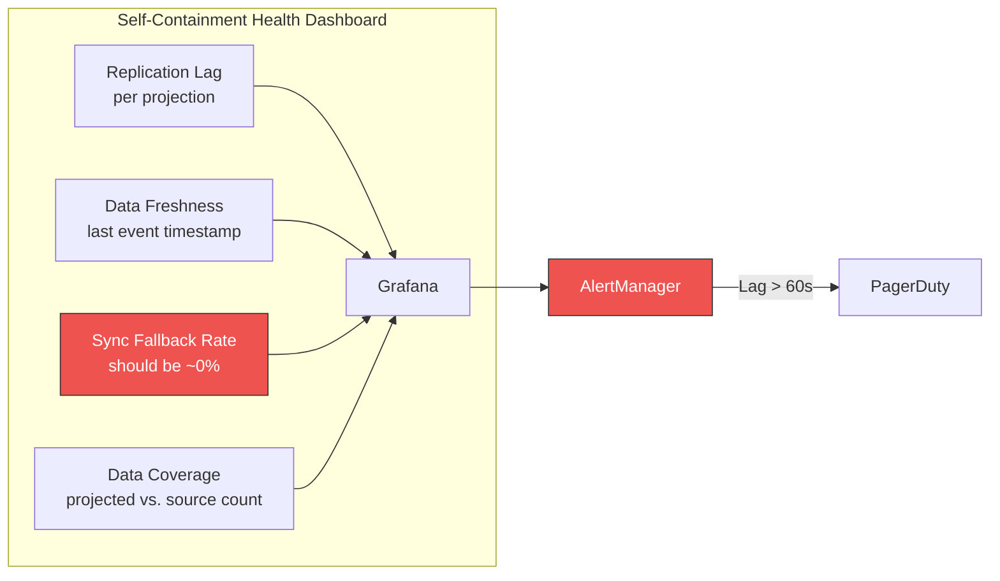

---

### Decision Framework

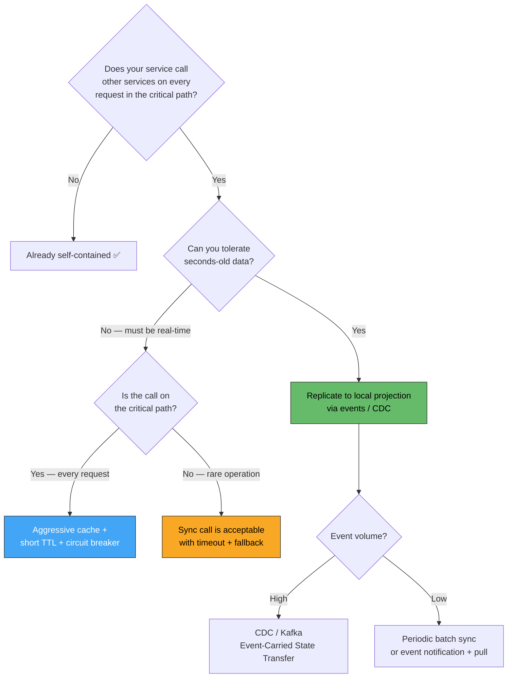

---

### Practical Checklist

- [ ] Identify all **synchronous runtime dependencies** in your service's critical path
- [ ] For each dependency, determine if data can be **replicated locally** with acceptable staleness
- [ ] Choose replication strategy: event-carried state transfer, CDC, or periodic sync
- [ ] Store projections as **read-only** local tables/caches — never write to them directly
- [ ] Implement **cold-start bootstrap** — replay events or call bulk API when projection is empty
- [ ] Monitor **replication lag** per projection — alert on staleness exceeding tolerance
- [ ] Implement **staleness-aware logic** — degrade gracefully or fall back to sync call as last resort
- [ ] Use local data for **display and pre-validation**; authoritative operations via saga/sync
- [ ] Replicate **only the fields your service needs** — not the entire upstream entity
- [ ] Plan for **projection rebuild** — idempotent consumer that can replay full event history
- [ ] Track **sync fallback rate** — non-zero sustained rate means you're not truly self-contained
- [ ] Schema registry for events — backward-compatible evolution protects consumers
- [ ] Test by **killing upstream services** — your service should continue serving requests

---

### Recommendation

**Self-containment is the architectural standard for production microservices.** If your service cannot answer its primary queries when an upstream service is down, you have a distributed monolith, not microservices. Start by **auditing synchronous dependencies** in your critical request path. For each dependency, maintain a **local read-only projection** populated by events (Kafka, CDC, or event-carried state transfer). Accept eventual consistency for display and pre-validation; use sagas for authoritative state changes. The goal is not zero runtime dependencies (impractical), but **zero synchronous dependencies on the happy path** — sync calls should only appear as rare fallbacks, background operations, or in saga steps that are already designed for failure handling.

---

### Next Steps to Explore

1. **Event-Carried State Transfer vs. Notification** — detailed trade-offs on payload size and coupling
2. **Projection rebuild strategies** — replaying event history, snapshotting, bootstrap APIs
3. **CQRS as self-containment** — separate read models as the ultimate self-contained pattern
4. **Conflict resolution** — handling divergent state when replication lags and concurrent writes occur
5. **Testing self-containment** — chaos engineering: kill upstream services, verify graceful degradation