## External Configuration Pattern in Microservices Architecture

### Context & Assumptions

The **External Configuration pattern** moves all environment-specific and operational configuration **out of the application code and deployment artifacts** into an external, centrally managed store. A single service binary runs unchanged across dev, staging, and production — behavior differences come entirely from **externally injected configuration**. This is fundamental to the Twelve-Factor App methodology (Factor III: Config) and essential in microservices where dozens of services, each with multiple instances across multiple environments, make embedded configuration unmanageable.

---

### The Problem: Embedded Configuration

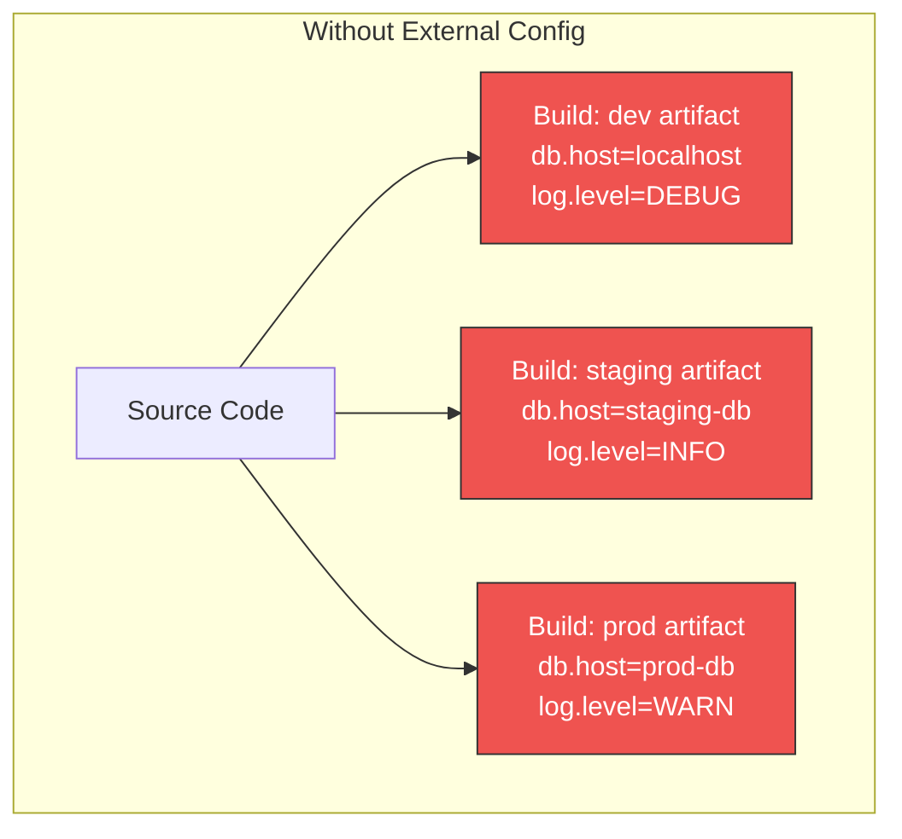

| Problem | Impact |
|---|---|
| **Config baked into artifact** | Must rebuild for every environment; dev/staging/prod are different binaries |
| **Secrets in source code** | Database passwords, API keys in Git → security breach waiting to happen |
| **Config sprawl** | 50 services × 4 environments = 200 config variants to manage |
| **No runtime changes** | Changing a feature flag or log level requires redeployment |
| **No audit trail** | Who changed what config, when? |
| **Config drift** | Staging and prod slowly diverge → "works on staging, fails in prod" |

---

### The Solution: External Configuration

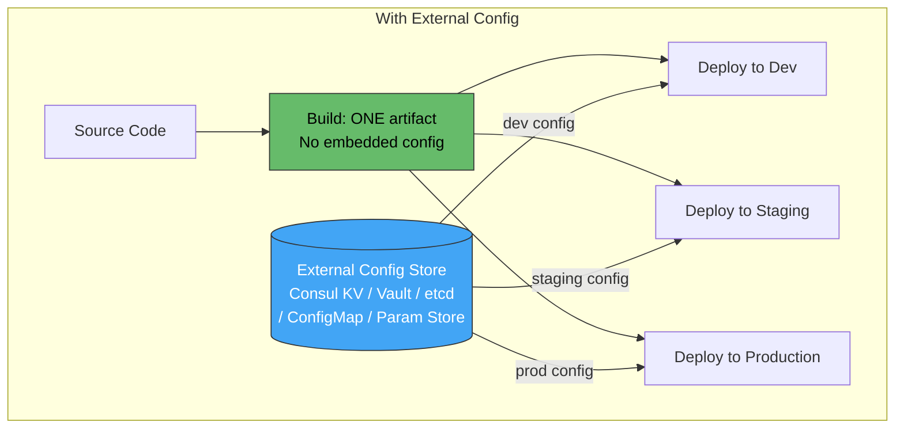

**One immutable artifact** promoted through environments. Configuration is injected at **deploy time** or **runtime** from an external source.

---

### Configuration Hierarchy

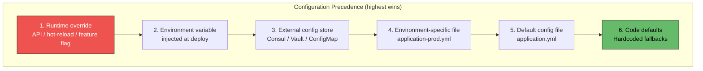

**Principle:** Defaults in code → overridden by files → overridden by external store → overridden by env vars → overridden by runtime changes. Higher layers have narrower scope but higher authority.

---

### What Belongs in External Config vs. Code

| Category | External Config ✅ | Code / Defaults ❌ → ✅ |
|---|---|---|
| **Database URLs** | `jdbc:postgresql://prod-db:5432/orders` | Connection pool defaults (`max=20`) |
| **Credentials / Secrets** | Vault / Secrets Manager | Never in code |
| **Feature flags** | `feature.new-checkout=true` | Flag evaluation logic |
| **Log level** | `log.level=WARN` | Log format, structured logging code |
| **Timeout values** | `payment.timeout-ms=3000` | Retry strategy logic |
| **Rate limits** | `api.rate-limit=100/s` | Rate limiting middleware code |
| **Service URLs** | `payment-service.url=http://...` | Service discovery logic |
| **Thread pool sizes** | `worker.pool-size=20` | Pool implementation |
| **Circuit breaker thresholds** | `cb.failure-rate=50` | Circuit breaker library |
| **Business rules** | ❌ Not usually | ✅ Business logic belongs in code |
| **Algorithms** | ❌ No | ✅ Core logic stays in code |

**Rule of thumb:** If it changes **between environments** or needs to change **without redeployment**, it's external config. If it defines **what the service does** (not how it's tuned), it's code.

---

### Configuration Injection Mechanisms

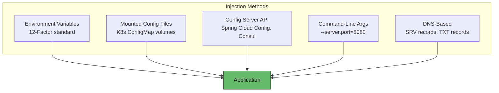

| Method | When Applied | Hot Reload? | Secret-Safe? | Best For |
|---|---|---|---|---|
| **Environment variables** | Container start | No (restart needed) | Moderate (visible in process list) | Simple key-value config, 12-Factor apps |
| **Mounted files (ConfigMap)** | Pod start (volume mount) | Yes (kubelet refresh) | No (plaintext files) | Structured config (YAML, JSON), certificates |
| **Config server API** | Runtime pull / push | Yes (watch / poll) | Yes (encrypted at rest) | Dynamic config, feature flags, centralized management |
| **Command-line args** | Process start | No | No | Override-specific values, debugging |
| **DNS/SRV** | Runtime lookup | Yes (TTL-based) | No | Service discovery endpoints |

---

### Technology Comparison

| Technology | Type | Hot Reload | Secrets | Versioning | Multi-Env | Best For |
|---|---|---|---|---|---|---|
| **Kubernetes ConfigMap** | Platform-native | Yes (volume) | No (use Secrets) | kubectl history | Namespace per env | K8s workloads, simple config |
| **Kubernetes Secrets** | Platform-native | Yes (volume) | Base64 (not encrypted by default) | kubectl history | Namespace per env | K8s secrets (with encryption at rest) |
| **HashiCorp Vault** | Dedicated secrets | Yes (agent sidecar) | Yes (encrypted, rotated) | Version history | Namespaces / paths | Secrets, dynamic credentials, PKI |
| **HashiCorp Consul KV** | Config + discovery | Yes (watch/blocking query) | No (use Vault) | No built-in | DC-aware KV paths | Key-value config, multi-DC |
| **Spring Cloud Config** | Config server | Yes (bus refresh) | Encrypt/decrypt support | Git-backed versioning | Profiles (dev, prod) | Spring Boot / JVM ecosystems |
| **AWS Systems Manager<br/>Parameter Store** | Managed KV | No (app polls) | Yes (KMS encryption) | Versioned parameters | Paths: /prod/order-svc/* | AWS-native simple config |
| **AWS Secrets Manager** | Managed secrets | Yes (rotation Lambda) | Yes (KMS, auto-rotation) | Version stages | Paths / tags | AWS-native secrets with rotation |
| **Azure App Configuration** | Managed config | Yes (SDK polling) | Key Vault references | Labels + snapshots | Labels per environment | Azure-native config + feature flags |
| **etcd** | Distributed KV | Yes (watch API) | TLS + RBAC | Revision history | Key prefixes | Low-level infrastructure config |
| **ConfigCat / LaunchDarkly** | Feature flags SaaS | Yes (streaming) | N/A | Full history | Environments built-in | Feature flags, gradual rollout |

---

### Architecture: Centralized Config in Microservices

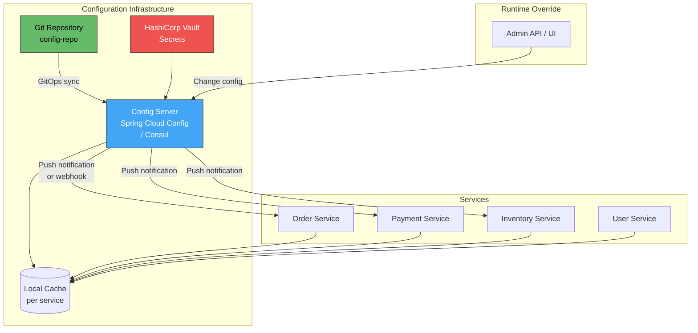

---

### Kubernetes ConfigMap + Secrets Flow

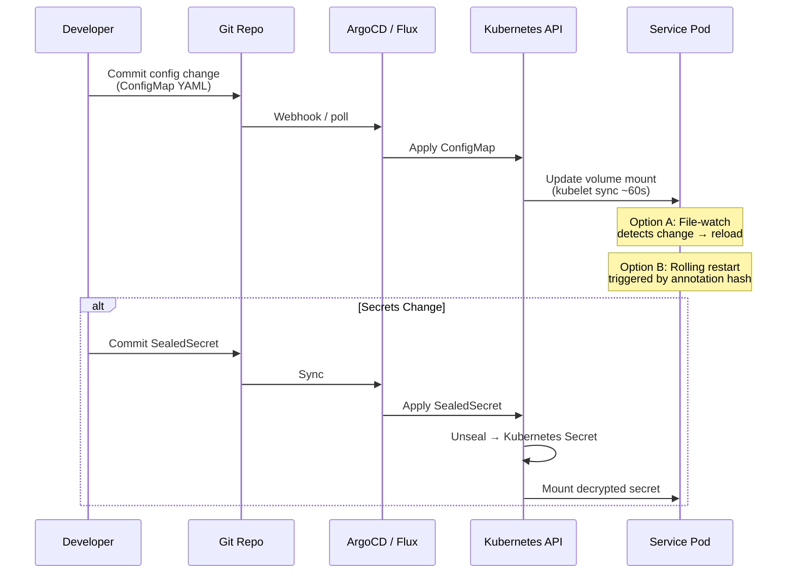

**Sealed Secrets / SOPS flow:** Secrets are encrypted in Git (using SealedSecrets or SOPS), decrypted only inside the cluster — secrets never appear in plaintext in source control.

---

### HashiCorp Vault Integration

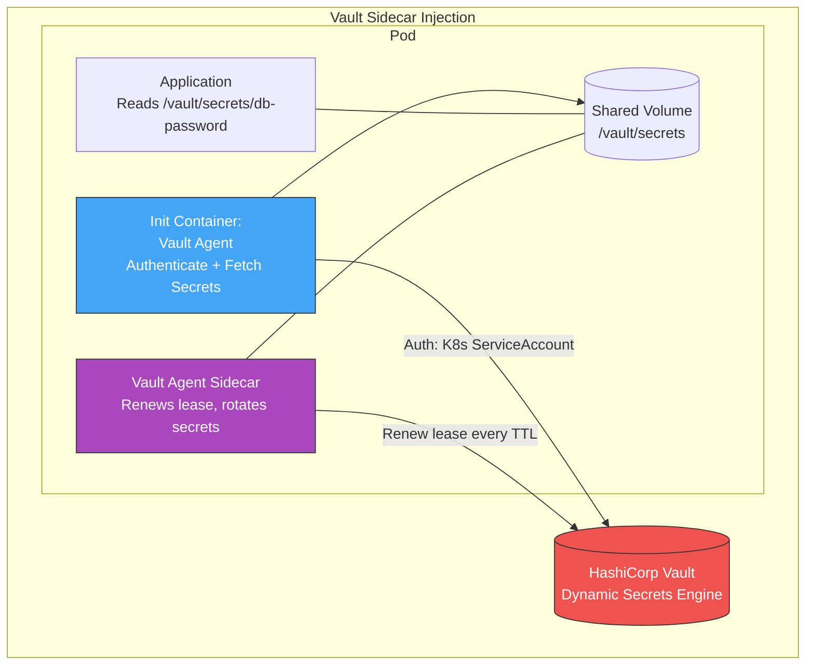

| Vault Feature | Benefit |
|---|---|
| **Dynamic secrets** | Generate unique DB credentials per pod — auto-expire |
| **Lease management** | Credentials auto-rotate; revoke compromised creds instantly |
| **K8s auth method** | Pod authenticates via ServiceAccount — no static token |
| **Audit log** | Every secret access logged — who, when, what |
| **Transit engine** | Encrypt/decrypt without ever exposing keys to application |

---

### Hot Reload Strategies

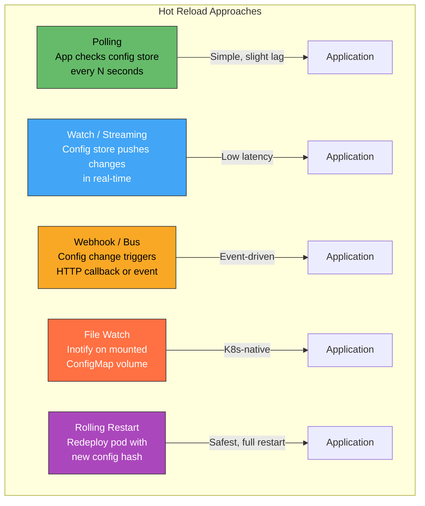

| Strategy | Latency | Complexity | Safety | Best For |
|---|---|---|---|---|
| **Polling** | Seconds (poll interval) | Low | High (controlled) | Most applications |
| **Watch / Stream** | Milliseconds | Medium | Medium | Feature flags, time-sensitive config |
| **Webhook / Bus** | Sub-second | Medium | Medium | Spring Cloud Bus, distributed refresh |
| **File watch (inotify)** | ~60s (kubelet sync) | Low | High | K8s ConfigMap-mounted config |
| **Rolling restart** | Minutes (deploy cycle) | Lowest | Highest | Critical config requiring full initialization |

**Safety concern with hot reload:** Changing a connection pool size or thread count mid-flight can cause transient errors. **Classify config as hot-reloadable vs. restart-required:**

| Hot-Reloadable ✅ | Restart Required ❌ |
|---|---|
| Log level | Database connection URL |
| Feature flags | Thread pool sizes |
| Rate limits | TLS certificates (sometimes) |
| Timeout values | Cache backend URL |
| UI text / messages | Listening port |
| Circuit breaker thresholds | JVM heap settings |

---

### Configuration Namespacing Strategy

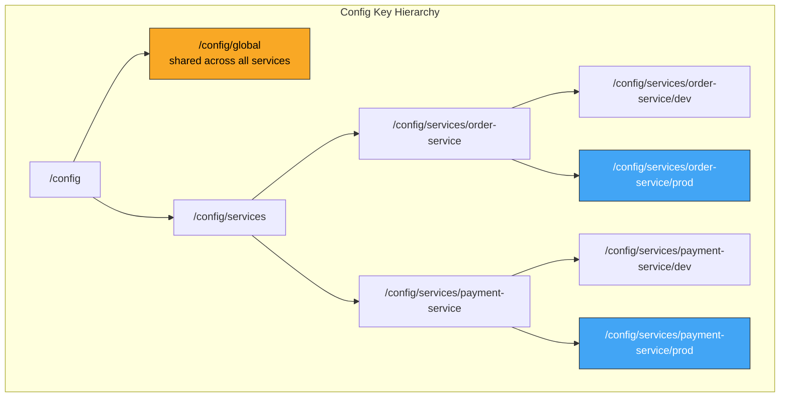

**Resolution order:** Service+env specific → service default → global → code default.

```
# Example: order-service in prod resolves "db.pool.max"
1. /config/services/order-service/prod/db.pool.max → 50   ✅ Found, use this
2. /config/services/order-service/db.pool.max → 20        (would use if #1 missing)
3. /config/global/db.pool.max → 10                         (would use if #2 missing)
4. Code default → 5                                         (would use if #3 missing)
```

---

### Secret Management Best Practices

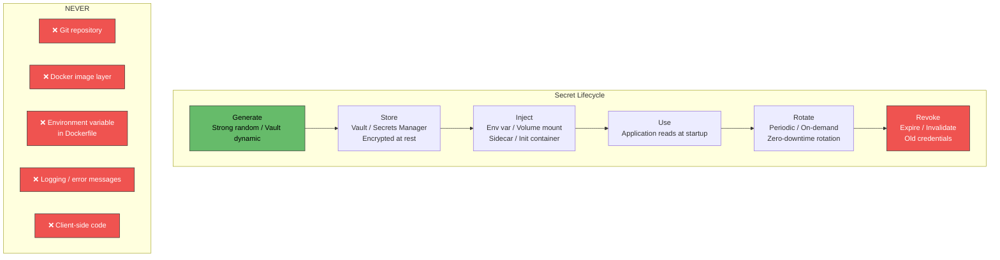

| Practice | Description |
|---|---|
| **Encrypt at rest** | Vault, AWS KMS, Azure Key Vault, K8s etcd encryption |
| **Encrypt in transit** | TLS between application and secret store |
| **Least privilege** | Each service accesses only its own secrets |
| **Short-lived credentials** | Vault dynamic secrets with TTL (e.g., 1-hour DB creds) |
| **Rotation without downtime** | Dual-credential overlap during rotation window |
| **Audit access** | Log every secret read — who, when, from where |
| **Sealed Secrets / SOPS in Git** | Encrypted secrets in Git; decrypted only in-cluster |
| **No secrets in env vars for sensitive workloads** | Prefer file mount — env vars visible in proc, crash dumps |

---

### Feature Flags as External Config

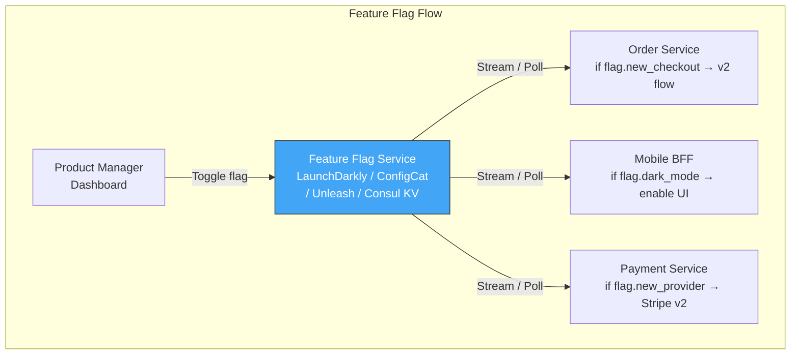

Feature flags are **the most dynamic form of external configuration** — changing runtime behavior in seconds without deployment. They extend external config beyond operational tuning into **product release management**.

---

### Anti-Patterns

| Anti-Pattern | Problem | Remedy |
|---|---|---|
| **Secrets in Git** | Credentials exposed in version history forever | Use Vault, SealedSecrets, SOPS; scan with gitleaks/truffleHog |
| **Config in Docker image** | Must rebuild image per environment | Inject at runtime via env vars, volumes, or config server |
| **Shared config store, no namespacing** | Service A's change breaks Service B | Namespace by `service/environment`; RBAC per service |
| **No defaults in code** | App crashes if any config key missing | Sensible defaults for every setting; external config overrides |
| **Hot-reload everything** | Reloading DB pool config mid-transaction → errors | Classify hot-reloadable vs. restart-required config |
| **No validation on load** | Typo in config silently breaks behavior | Validate all config at startup; fail fast on invalid values |
| **Config changes without audit** | Can't determine who changed what, when | Git-backed config (GitOps) or Vault audit log |
| **Polling too frequently** | Config store overloaded by thousands of services polling every second | Use watch/streaming; poll at 30s-60s intervals; local cache |
| **Env var sprawl** | 100+ env vars per container → unmaintainable | Group into structured config files; use config server |
| **No config rollback** | Bad config deployed → manual reversal under pressure | GitOps: `git revert` → auto-apply; config server: version rollback |

---

### Config Change Safety

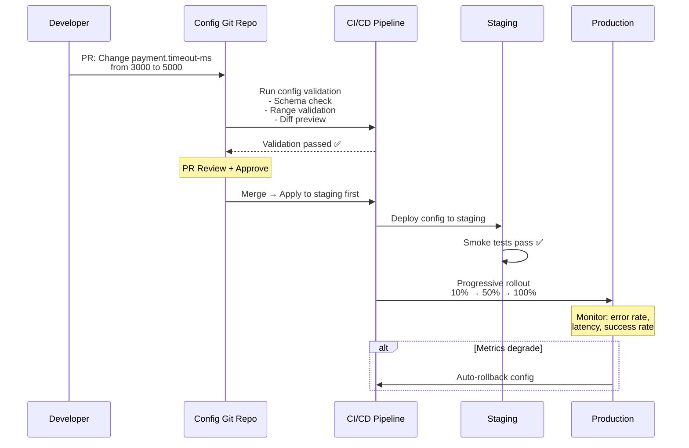

---

### Decision Framework

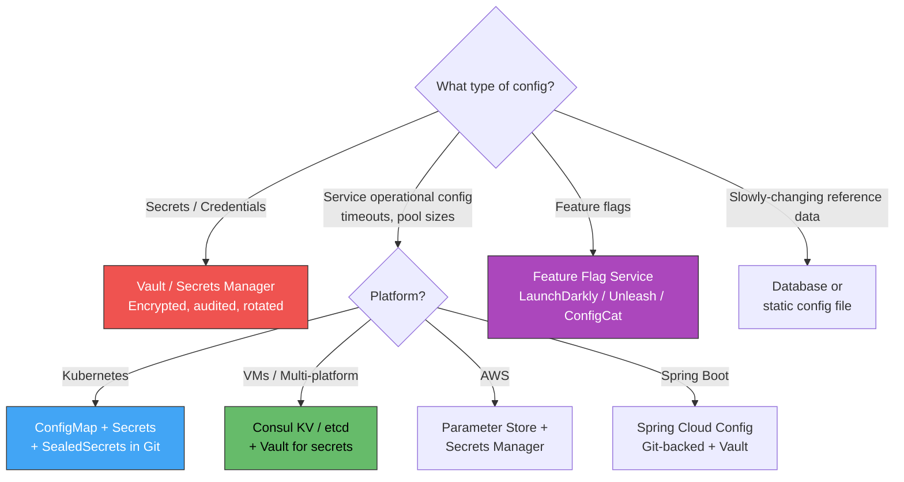

---

### Practical Checklist

- [ ] **Zero config in source code** — no connection strings, passwords, or API keys in Git
- [ ] **One artifact, all environments** — same Docker image across dev/staging/prod
- [ ] Build a **structured config hierarchy**: global → service → environment → instance
- [ ] **Validate config at startup** — fail fast with clear error messages on missing/invalid values
- [ ] **Sensible defaults in code** — external config overrides but app works without it
- [ ] **Separate secrets from config** — secrets in Vault/Secrets Manager, config in ConfigMap/Consul
- [ ] **Encrypt secrets at rest and in transit** — never plaintext in etcd, files, or Git
- [ ] **Classify hot-reloadable vs. restart-required** settings — document which is which
- [ ] **Audit all config changes** — Git history (GitOps) or Vault/Consul audit logs
- [ ] **GitOps for config** — config changes go through PR review, CI validation, progressive rollout
- [ ] **Monitor config freshness** — alert if a service is running with stale config
- [ ] **Secret rotation without downtime** — overlap window with dual credentials
- [ ] **Scan for secret leaks** — gitleaks, truffleHog in CI pipeline
- [ ] **RBAC on config store** — each service can read only its own namespace

---

### Recommendation

**On Kubernetes**, use **ConfigMaps** for non-sensitive config and **Sealed Secrets** (or external-secrets-operator syncing from Vault/AWS Secrets Manager) for credentials — all managed via **GitOps** (ArgoCD/Flux). Add **HashiCorp Vault** when you need dynamic secrets, automatic credential rotation, or multi-platform secret management beyond Kubernetes. For **feature flags**, use a dedicated service (Unleash for self-hosted, LaunchDarkly/ConfigCat for SaaS) — don't conflate feature flags with operational config. At minimum: every service should read config from **environment variables or mounted files**, have **validated defaults**, and **never contain secrets in source code or container images**.

---

### Next Steps to Explore

1. **GitOps for configuration** — ArgoCD/Flux managing ConfigMaps and secrets declaratively
2. **Dynamic secrets with Vault** — database credential rotation, PKI certificates
3. **Feature flag strategies** — canary rollout, percentage-based, user-targeting
4. **Config schema validation** — JSON Schema, CUE, or OPA for enforcing config contracts
5. **External Secrets Operator** — syncing secrets from Vault/AWS/Azure into Kubernetes Secrets