## Strangler (Fig) Pattern in Microservices Architecture

### Context & Assumptions

The **Strangler Fig pattern** (named after strangler fig trees that grow around a host tree, eventually replacing it) is an **incremental migration strategy** for replacing a legacy monolithic system with microservices — without a risky "big bang" rewrite. You build new functionality as microservices around the monolith, gradually routing traffic away from the old system to the new services, until the monolith is fully replaced and can be decommissioned.

Martin Fowler coined the term in 2004. It remains the **safest and most proven** approach for monolith-to-microservices migration.

---

### The Problem: Big Bang Rewrite

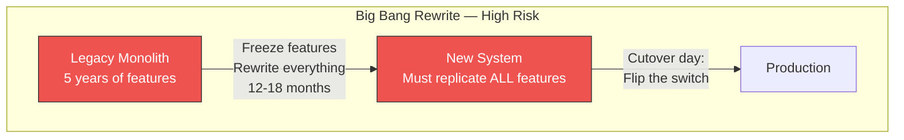

| Problem | Impact |
|---|---|
| **Feature freeze during rewrite** | Business cannot evolve for months/years |
| **Must replicate all features perfectly** | Unknown behaviors, undocumented edge cases, tribal knowledge lost |
| **All-or-nothing cutover** | One defect on launch day → rollback to old system → months wasted |
| **Team morale** | Year-long rewrite with no production value delivered |
| **Second system effect** | Over-engineering the replacement; scope creep |
| **Business context changes** | By the time rewrite is done, requirements have shifted |

**Historical failure rate of big bang rewrites: extremely high.** Netscape's browser rewrite is the canonical cautionary tale.

---

### The Solution: Strangler Fig Pattern

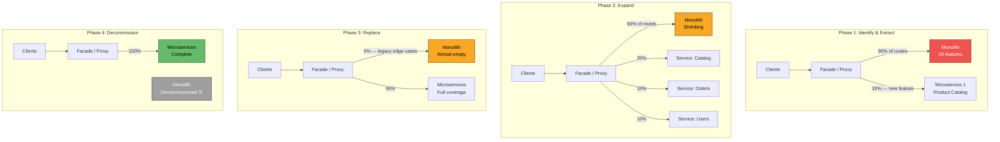

---

### Core Mechanism: The Facade / Proxy

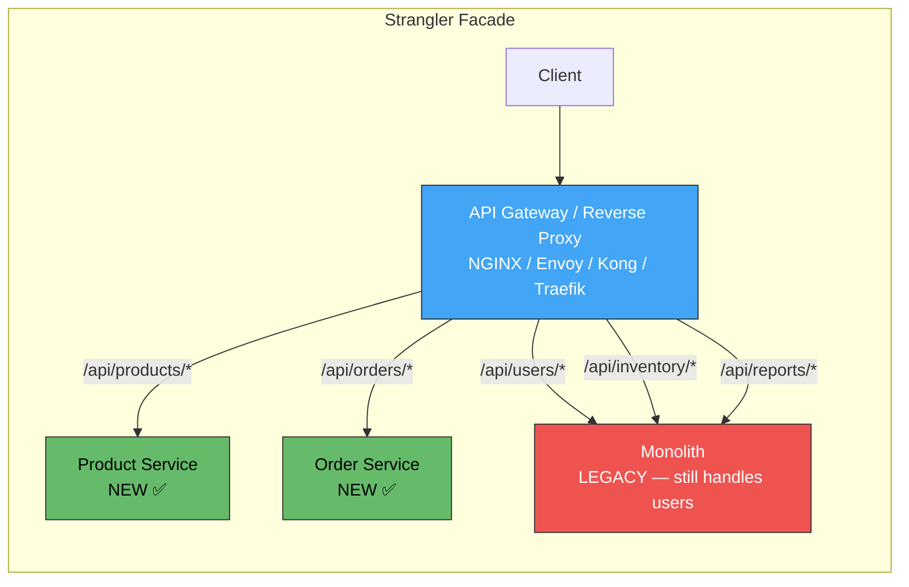

The proxy is the **strangler vine** — it intercepts all traffic and **routes** each request to either the new microservice or the legacy monolith. As more routes shift to microservices, the monolith receives less traffic until it receives none.

---

### Migration Execution Flow

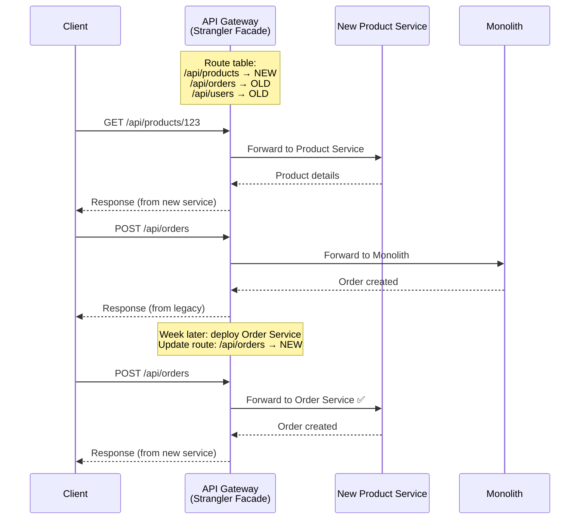

---

### Three Strangler Strategies

#### 1. Route-Based (URL/Path)

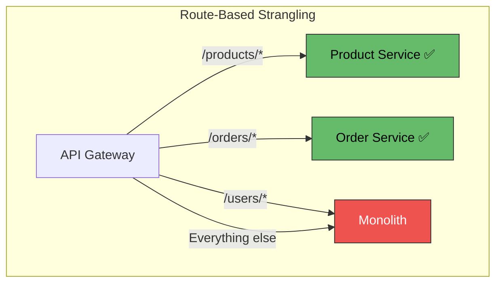

**Best when:** API routes map cleanly to bounded contexts.

#### 2. Feature-Based (Functionality)

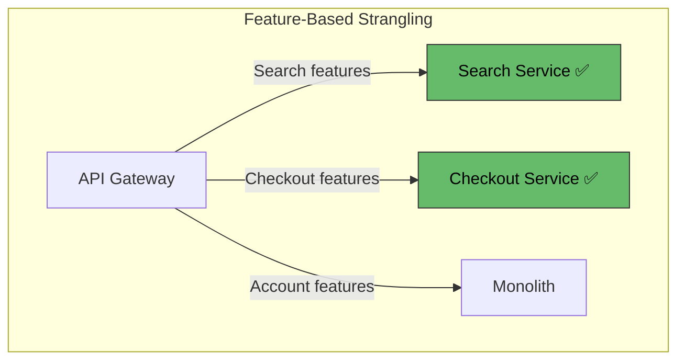

**Best when:** Features cross multiple URL paths but form a cohesive domain.

#### 3. Traffic-Based (Percentage / Canary)

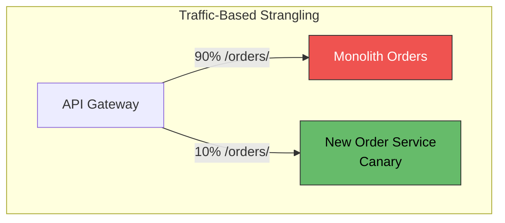

**Best when:** Validating the new service under production load before full cutover.

---

### Data Migration Strategy

This is the **hardest part** of the strangler pattern — the monolith's database contains all the data, and the new microservices need their own databases.

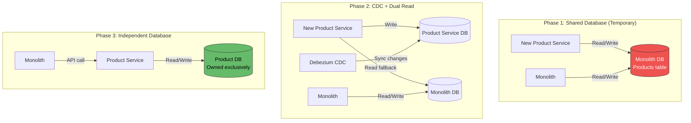

| Phase | Data Ownership | Risk | Duration |
|---|---|---|---|
| **Shared DB** | Monolith owns schema; service reads/writes same tables | Schema change breaks both | Weeks (keep as short as possible) |
| **CDC + Sync** | Service has own DB; CDC syncs from monolith | Data lag; eventual consistency | Weeks-months |
| **Database per service** | Service fully owns its data; monolith calls service API | API dependency | Target state |

---

### Data Synchronization During Migration

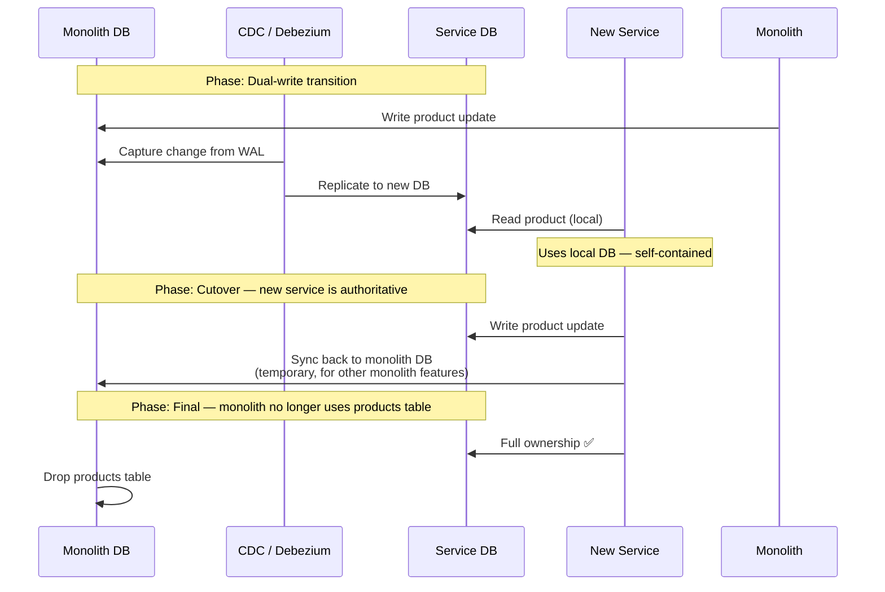

---

### Identifying What to Extract First

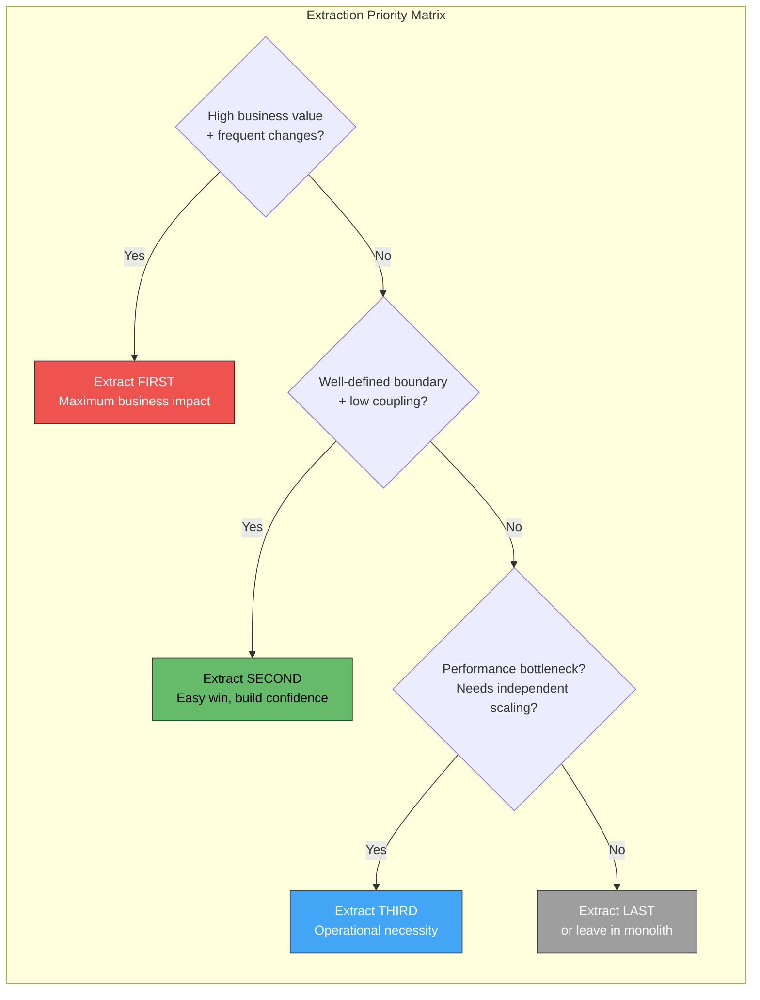

**Extraction prioritization criteria:**

| Factor | Weight | High Score (Extract First) | Low Score (Extract Later) |
|---|---|---|---|
| **Business value / change frequency** | High | Feature changes weekly | Stable for years |
| **Bounded context clarity** | High | Clear domain boundary | Deeply entangled |
| **Data coupling** | Critical | Own tables, few JOINs | Shared tables everywhere |
| **Team ownership** | Medium | Dedicated team ready | Shared across teams |
| **Scaling needs** | Medium | Needs independent scaling | Scales with monolith fine |
| **Technical debt** | Low-Medium | Code is unmaintainable | Code is acceptable |
| **External dependencies** | Low | Few external integrations | Heavily integrated |

---

### Complete Strangler Architecture

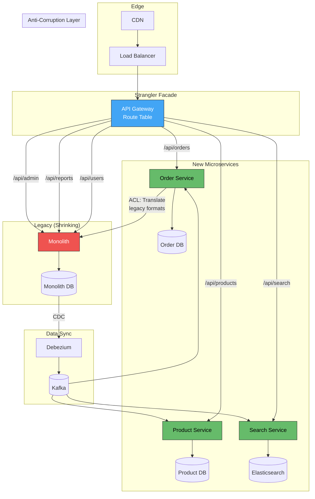

---

### Anti-Corruption Layer (ACL)

When new microservices must still communicate with the monolith, an **Anti-Corruption Layer** prevents legacy data models and idioms from leaking into the new clean domain model.

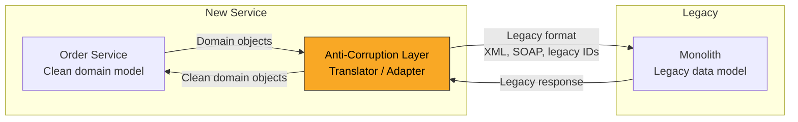

| ACL Responsibility | Example |
|---|---|
| **Data format translation** | JSON ↔ XML, REST ↔ SOAP |
| **ID mapping** | New UUID ↔ legacy integer PKs |
| **Schema mapping** | `customer.firstName` ↔ `CUST_FNAME` |
| **Error translation** | Legacy error codes → domain exceptions |
| **Protocol bridging** | gRPC → legacy HTTP/1.0 |

---

### Verification: Parallel Run (Shadow Traffic)

Before cutting over, verify the new service produces the **same results** as the monolith:

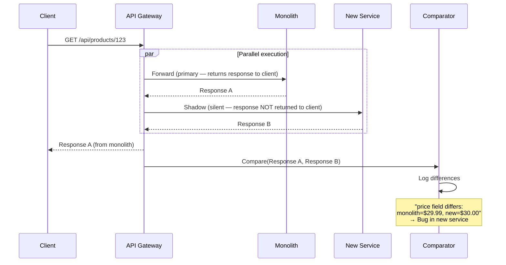

| Technique | Description | Use When |
|---|---|---|
| **Shadow traffic (dark launch)** | Send copy of production traffic to new service; discard its response | Validating read operations |
| **Parallel run with comparison** | Run both, compare results, return old response | High-stakes migration (financial) |
| **Canary with monitoring** | Route 1-5% of real traffic; monitor error rates and latency | Validating under real load |
| **Feature flag toggle** | Flip between old/new per request, user, or percentage | Instant rollback capability |

---

### Timeline: Realistic Migration Phases

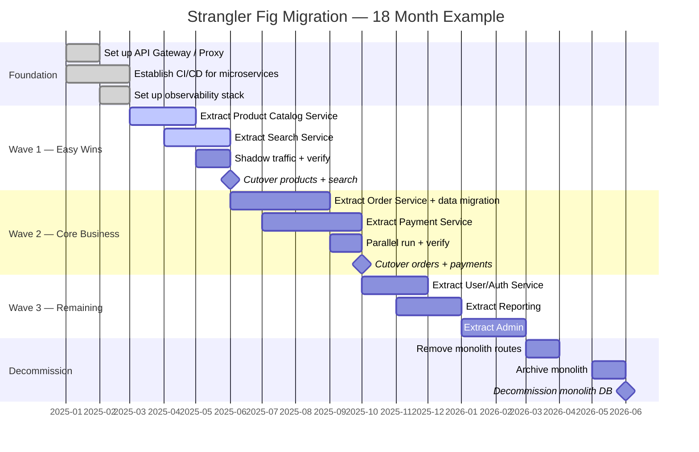

---

### Anti-Patterns

| Anti-Pattern | Problem | Remedy |
|---|---|---|
| **Extract everything at once** | Becomes a big bang rewrite in disguise | One bounded context at a time; deliver value incrementally |
| **No strangler facade** | Services added but no routing mechanism → two systems, neither complete | Set up API gateway/proxy FIRST — it's the foundation |
| **Keep the monolith DB** | All services share the monolith DB → distributed monolith | Migrate data ownership per service; use CDC for transition |
| **Never decommissioning the monolith** | "Temporary" shared state becomes permanent → two systems to maintain | Set decommission milestones; track remaining routes |
| **Extracting the hardest part first** | Team loses momentum on gnarly domain; no quick wins | Start with well-bounded, high-value, low-coupling domains |
| **No anti-corruption layer** | Legacy data model infects new services | ACL isolates legacy format; new services use clean domain model |
| **No verification (shadow/canary)** | Cutover without verifying parity → production incidents | Shadow traffic or parallel run before any cutover |
| **Feature freeze on monolith** | Business can't evolve during migration → stakeholder pressure → abort | Continue delivering features in monolith while extracting; strangler allows both |
| **Microservice calls monolith DB directly** | Hidden coupling; monolith schema change breaks service | API or event-based communication only; no shared DB access |
| **No rollback plan** | Cutover to new service fails → no way back | Feature flag in gateway to instantly revert route to monolith |

---

### Measuring Migration Progress

| Metric | How to Measure | Target |
|---|---|---|
| **Route coverage** | % of API routes handled by microservices vs. monolith | 100% microservices |
| **Traffic percentage** | % of requests going to new services vs. monolith | Increasing over time |
| **Monolith code churn** | Lines of code changed in monolith per month | Approaching zero |
| **Monolith deployment frequency** | How often monolith is deployed | Decreasing |
| **Feature delivery velocity** | Time from idea to production for extracted domains | Faster than monolith era |
| **Monolith DB table count** | Tables still accessed by monolith | Decreasing |
| **Incident rate** | Production incidents related to migrated domains | Lower than monolith era |

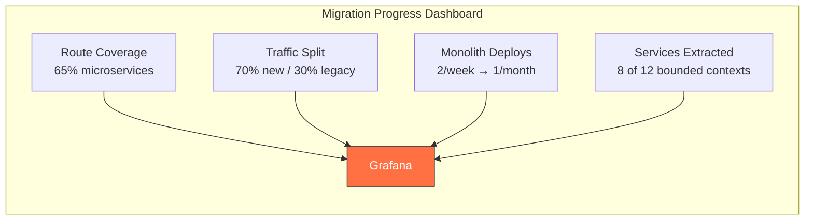

---

### Practical Checklist

- [ ] **Analyze monolith** — map bounded contexts, dependencies, data ownership
- [ ] **Set up strangler facade** (API gateway) as the first step — before any extraction
- [ ] **Start with easy wins** — well-bounded, high-value, low-coupling domains
- [ ] **Build anti-corruption layer** — isolate new services from legacy data models
- [ ] **Migrate data incrementally** — shared DB → CDC sync → independent DB
- [ ] **Verify before cutover** — shadow traffic, parallel run, or canary with comparison
- [ ] **Feature flag the route** — instantly revert to monolith if new service fails
- [ ] **Continue delivering features** in monolith during migration — no feature freeze
- [ ] **Decommission route by route** — track remaining monolith routes; set milestones
- [ ] **Monitor both systems** — compare latency, error rates, correctness between old and new
- [ ] **Communicate progress** — dashboard showing migration percentage to stakeholders
- [ ] **Plan monolith decommission date** — avoid permanent dual-system maintenance
- [ ] **Celebrate each extraction** — team morale matters during long migrations

---

### Recommendation

The Strangler Fig pattern is the **only proven safe approach** to migrating from a monolith to microservices. Never attempt a big bang rewrite. Set up the **API gateway/proxy first** — this is non-negotiable, as it's the mechanism that enables incremental routing. Extract services starting with **well-bounded, high-value contexts** (not the hardest or most entangled — save those for when the team has experience). Use **CDC (Debezium)** for data synchronization during the transition period, and always verify parity through **shadow traffic or parallel runs** before cutting over. Plan for **18-36 months** for a medium-sized monolith — this is a marathon, not a sprint. The monolith continues serving features it still owns, and each extracted service delivers immediate value.

---

### Next Steps to Explore

1. **Domain-Driven Design for decomposition** — using bounded contexts to identify extraction candidates
2. **Anti-Corruption Layer patterns** — translation, facade, adapter implementations
3. **Database decomposition strategies** — shared DB → DB per service migration in detail
4. **Shadow traffic / parallel run tooling** — Diffy, Scientist, custom comparators
5. **Organizational alignment** — team topology changes needed alongside technical migration