## Data Partitioning & Data Replication in Microservices

### Context & Assumptions

In microservices, each service owns its data (Database per Service pattern). As data volume and traffic grow, a single database instance becomes a bottleneck — for storage capacity, query throughput, or write performance. **Data partitioning** (sharding) distributes data across multiple database instances to scale horizontally. **Data replication** copies data across nodes for availability, fault tolerance, and read scalability. Together, they are the foundational strategies for building data layers that match the distributed nature of microservices.

---

### Core Concepts

| Concept | Definition |
|---|---|
| **Partitioning (Sharding)** | Splitting a dataset across multiple nodes so each node holds a subset |
| **Replication** | Copying the same data to multiple nodes for redundancy and read scaling |
| **Partition Key (Shard Key)** | The field used to determine which partition holds a given record |
| **Replica** | A copy of a partition (or full database) on another node |
| **Leader (Primary)** | The node that accepts writes for a partition |
| **Follower (Replica)** | A node that receives replicated data and serves reads |
| **Rebalancing** | Redistributing data when partitions are added or removed |
| **Consistency Model** | The guarantee about how up-to-date replicated data is |

---

## Part 1: Data Partitioning (Sharding)

### Why Partition?

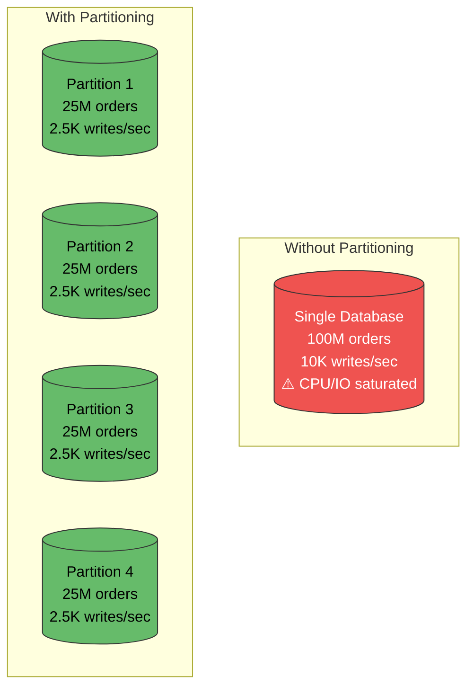

| Benefit | Description |
|---|---|
| **Write scalability** | Distribute writes across N nodes → N× throughput |
| **Storage scalability** | Each node holds 1/N of data → virtually unlimited capacity |
| **Query performance** | Smaller dataset per node → faster index scans |
| **Isolation** | One hot partition doesn't affect others |

---

### Partitioning Strategies

#### 1. Hash-Based Partitioning

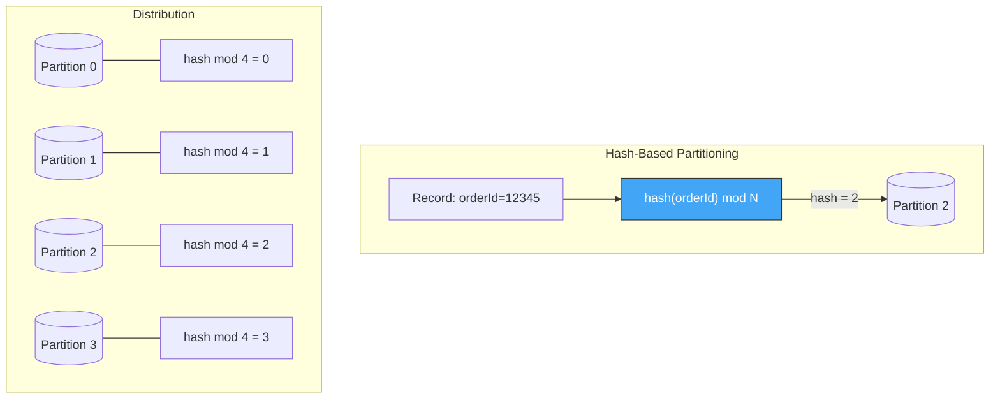

| Aspect | Detail |
|---|---|
| **Mechanism** | `partition = hash(key) % num_partitions` |
| **Distribution** | Uniform — even data spread across partitions |
| **Range queries** | ❌ Impossible — adjacent keys land on different partitions |
| **Adding partitions** | Requires rehashing all data (unless consistent hashing) |
| **Best for** | Key-value lookups, high cardinality keys (userId, orderId) |

#### 2. Range-Based Partitioning

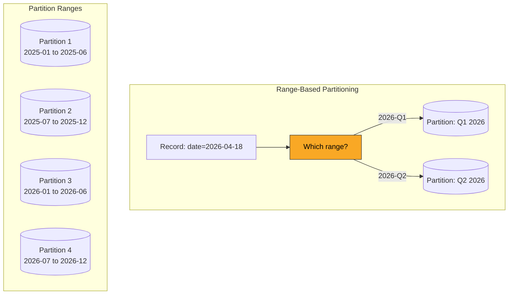

| Aspect | Detail |
|---|---|
| **Mechanism** | Key ranges mapped to partitions |
| **Distribution** | Can be skewed — hot ranges get more traffic |
| **Range queries** | ✅ Efficient — sequential keys on same partition |
| **Adding partitions** | Split a range into two — no full rehash |
| **Best for** | Time-series data, alphabetical ranges, sequential access |

#### 3. Consistent Hashing

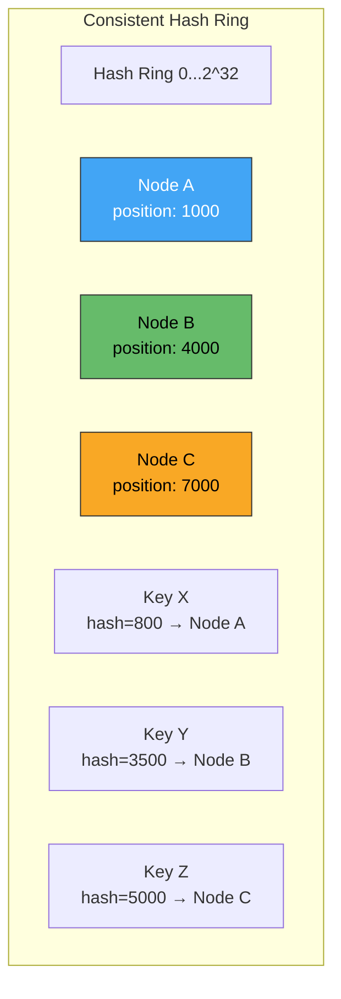

| Aspect | Detail |
|---|---|
| **Mechanism** | Nodes and keys mapped onto a ring; key goes to nearest clockwise node |
| **Adding a node** | Only ~1/N of keys remapped (minimal disruption) |
| **Removing a node** | Its keys move to next node on ring |
| **Virtual nodes** | Each physical node gets multiple positions → better uniformity |
| **Used by** | Cassandra, DynamoDB, Redis Cluster, Memcached |

#### 4. Directory-Based (Lookup Table)

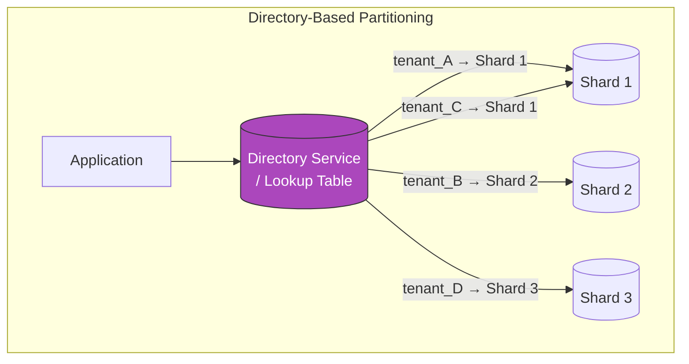

| Aspect | Detail |
|---|---|
| **Mechanism** | Explicit mapping table: key → partition |
| **Flexibility** | Full control over placement; move tenants between shards |
| **Overhead** | Lookup on every request (cache aggressively) |
| **Best for** | Multi-tenant SaaS, uneven tenant sizes, compliance (data residency) |

---

### Partitioning Strategy Comparison

| Strategy | Distribution | Range Queries | Rebalancing Cost | Hot Spots | Complexity |
|---|---|---|---|---|---|
| **Hash-based** | Uniform | ❌ No | High (full rehash) | Low | Low |
| **Consistent hashing** | Uniform (with vnodes) | ❌ No | Low (minimal remapping) | Low | Medium |
| **Range-based** | Can be skewed | ✅ Yes | Medium (split range) | High (time-based) | Medium |
| **Directory-based** | Controlled | ✅ Possible | Low (update directory) | Controlled | High |
| **Composite** | Depends | ✅ Within partition | Varies | Reduced | High |

---

### Composite Partition Key

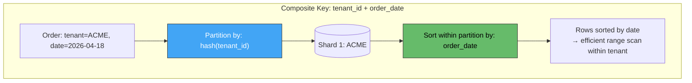

**Pattern used by:** Cassandra (partition key + clustering key), DynamoDB (partition key + sort key), CockroachDB.

This gives you **even distribution** (hash on tenant) plus **efficient range queries** (sort on date within partition).

---

### Cross-Partition Queries (The Hard Problem)

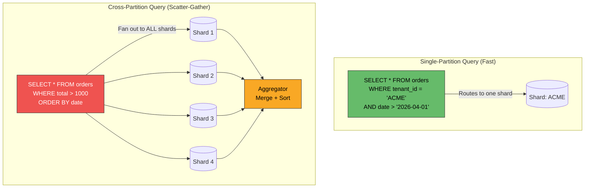

| Pattern | How It Handles Cross-Partition | Trade-off |
|---|---|---|
| **Scatter-gather** | Query all partitions, merge results | Latency = slowest partition; expensive at scale |
| **Secondary index (global)** | Separate index spanning all partitions | Index must be kept in sync; eventual consistency |
| **Materialized view / CQRS** | Pre-computed read model for cross-partition queries | Duplication; eventual consistency |
| **Search index (Elasticsearch)** | Denormalized data in search engine | Separate system to maintain |
| **Data warehouse / analytics DB** | ETL into analytical store | High latency; not for real-time |

---

### Database-Specific Partitioning

| Database | Partitioning Type | Partition Key | Automatic? | Cross-Partition Queries |
|---|---|---|---|---|
| **PostgreSQL** | Declarative (range, list, hash) | Table column | Manual DDL | Yes (query planner routes) |
| **MySQL** | Range, list, hash, key | Table column | Manual DDL | Yes (partition pruning) |
| **Cassandra** | Consistent hashing | Partition key column | Automatic | Scatter-gather (ALLOW FILTERING) |
| **DynamoDB** | Hash-based | Partition key | Automatic | Scan (expensive) or GSI |
| **MongoDB** | Range or hash | Shard key | Automatic (via mongos) | Scatter-gather via mongos |
| **CockroachDB** | Range-based (auto-split) | Primary key | Automatic | Distributed SQL (transparent) |
| **Vitess (MySQL)** | Hash or range | VIndex column | Managed | Scatter-gather via vtgate |
| **Citus (PostgreSQL)** | Hash or append | Distribution column | Managed | Distributed queries via coordinator |

---

## Part 2: Data Replication

### Why Replicate?

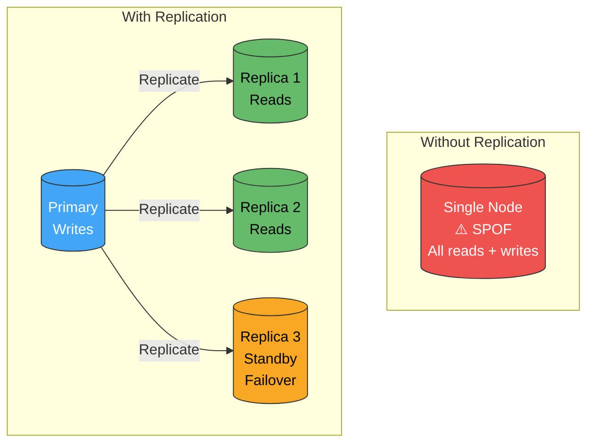

| Benefit | Description |
|---|---|
| **High availability** | Node dies → replica takes over (failover) |
| **Read scalability** | Distribute reads across N replicas → N× read throughput |
| **Geographic distribution** | Place replicas near users → lower latency |
| **Disaster recovery** | Cross-region replica survives regional outage |

---

### Replication Topologies

#### 1. Single-Leader (Primary-Replica)

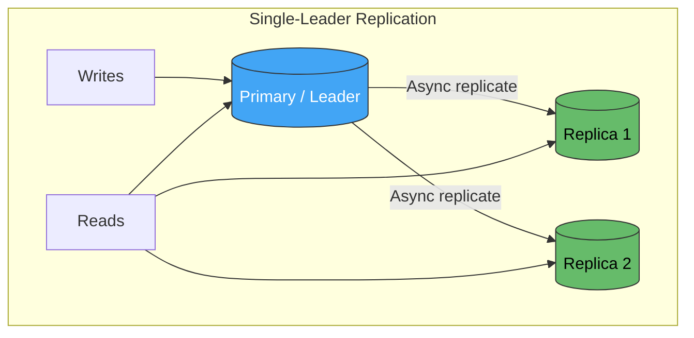

| Aspect | Detail |
|---|---|
| **Writes** | Only to leader |
| **Reads** | From any replica (may be stale) or leader (always current) |
| **Consistency** | Eventual (async) or strong (sync replicas) |
| **Failover** | Promote a replica to leader |
| **Used by** | PostgreSQL, MySQL, MongoDB (replica set), Redis |

#### 2. Multi-Leader (Active-Active)

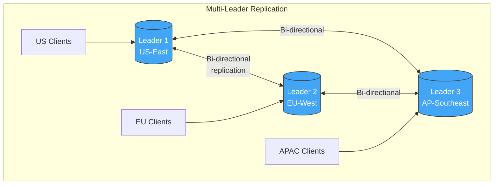

| Aspect | Detail |
|---|---|
| **Writes** | Any leader accepts writes |
| **Conflict** | Same record modified on two leaders → **conflict resolution required** |
| **Latency** | Low — writes go to local leader |
| **Complexity** | High — conflict resolution is notoriously difficult |
| **Used by** | CockroachDB, Cassandra, DynamoDB Global Tables, MySQL Group Replication |

#### 3. Leaderless (Quorum-Based)

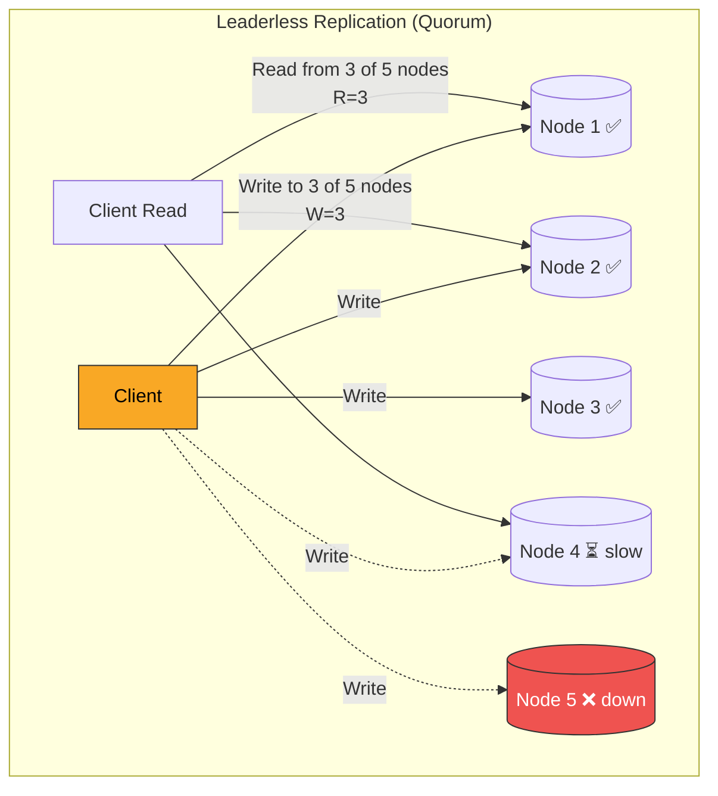

**Quorum formula:** For N replicas, write to W nodes, read from R nodes. Consistency guaranteed when:

$$W + R > N$$

| Configuration | W | R | N | Consistency | Availability |
|---|---|---|---|---|---|
| **Strong** | 3 | 3 | 5 | Strong (overlap guaranteed) | Tolerates 2 failures |
| **Write-heavy** | 1 | 5 | 5 | Eventual | Fast writes; slow reads |
| **Read-heavy** | 5 | 1 | 5 | Eventually consistent reads | Slow writes; fast reads |
| **Balanced** | 2 | 2 | 3 | Strong | Tolerates 1 failure |

**Used by:** Cassandra, DynamoDB, Riak, Voldemort.

---

### Replication Topology Comparison

| Aspect | Single-Leader | Multi-Leader | Leaderless |
|---|---|---|---|
| **Write throughput** | Limited by leader | High (any leader) | High (any node) |
| **Read consistency** | Strong from leader; eventual from replicas | Eventual across leaders | Tunable (quorum) |
| **Conflict handling** | None (single writer) | Required (LWW, CRDTs, merge) | Required (vector clocks, read repair) |
| **Failover** | Promote replica | Other leaders continue | No failover needed |
| **Geographic distribution** | Leader in one region (write latency from others) | Leader per region (low local latency) | Any node per region |
| **Complexity** | Low | High | Medium |
| **Best for** | Most OLTP workloads | Multi-region active-active | High availability, AP systems |

---

### Synchronous vs. Asynchronous Replication

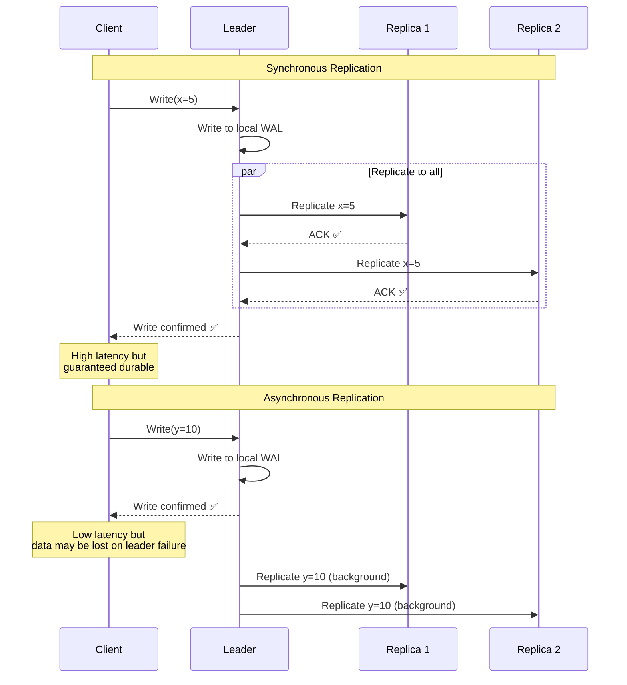

| Mode | Durability | Latency | Availability | Risk |
|---|---|---|---|---|
| **Synchronous (all)** | Highest — all nodes have data | Highest — wait for slowest replica | Lowest — blocked if any replica down | Zero data loss |
| **Semi-synchronous** | High — at least 1 replica confirmed | Medium | Medium | Minimal data loss |
| **Asynchronous** | Lower — leader only has confirmed data | Lowest | Highest | Data loss on leader failure (replication lag) |

---

### Replication Lag & Consistency Problems

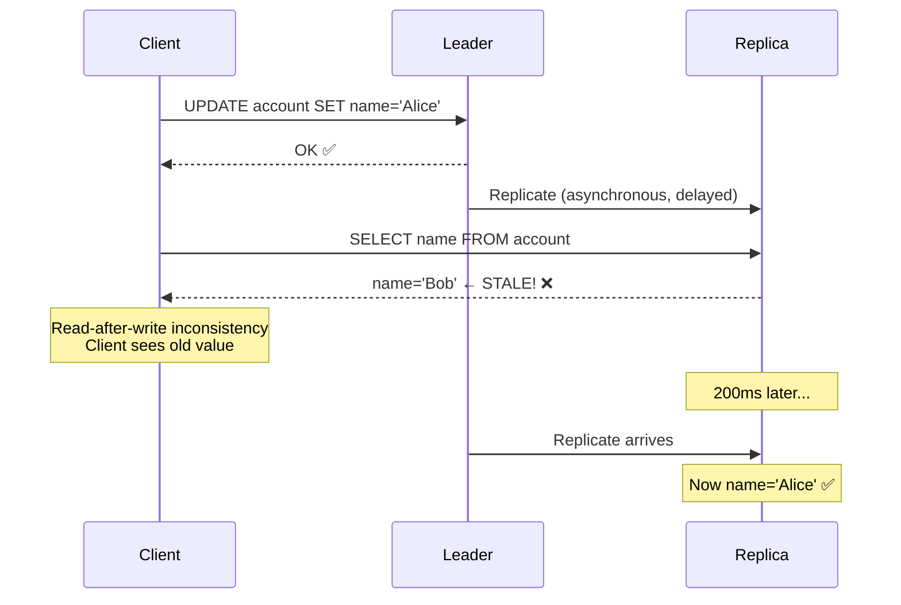

| Problem | Description | Solution |
|---|---|---|
| **Read-after-write inconsistency** | Client writes, then reads from replica before replication | Read-your-writes: route user's reads to leader for N seconds after write |
| **Monotonic read violation** | Client reads newer value, then older from different replica | Sticky sessions: pin client to one replica |
| **Causal ordering violation** | Reply appears before the message it replies to | Causal consistency tracking (vector clocks, logical timestamps) |
| **Stale reads** | Replica is seconds/minutes behind leader | Monitor replication lag; route critical reads to leader |

---

### Conflict Resolution (Multi-Leader / Leaderless)

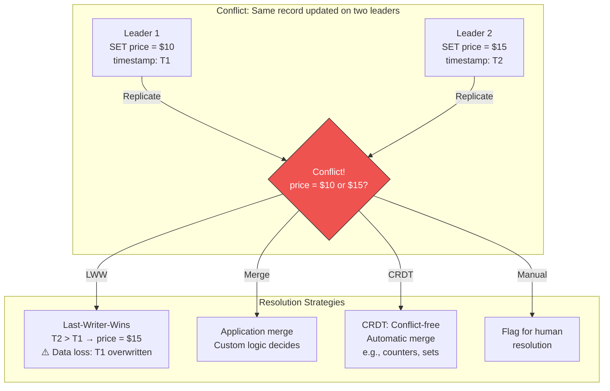

| Strategy | Mechanism | Data Loss? | Complexity | Best For |
|---|---|---|---|---|
| **Last-Writer-Wins (LWW)** | Highest timestamp wins | Yes — silent loss | Low | Non-critical, idempotent data |
| **Version vector / vector clock** | Track causal history; detect true conflicts | No — conflicts detected | High | Distributed KV stores (Riak) |
| **CRDTs** | Mathematically convergent data structures | No | Medium | Counters, sets, registers |
| **Application-level merge** | Custom business logic resolves | No — app decides | High | Domain-specific conflict rules |
| **Manual resolution** | Present both versions to user | No | Low (tech), high (UX) | Collaborative editing |

---

## Part 3: Partitioning + Replication Together

### Combined Architecture

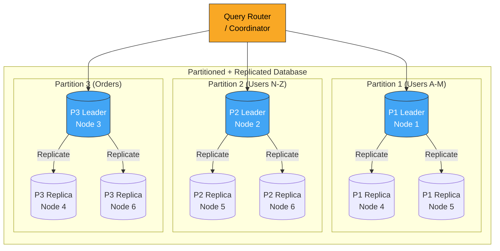

**Each partition has its own leader and replicas.** The leaders are distributed across nodes so no single node is the bottleneck. If Node 1 dies, P1 Replica on Node 4 is promoted to leader — other partitions are unaffected.

---

### Cross-Service Data Replication in Microservices

Beyond database-level replication, microservices replicate data **across service boundaries** for self-containment:

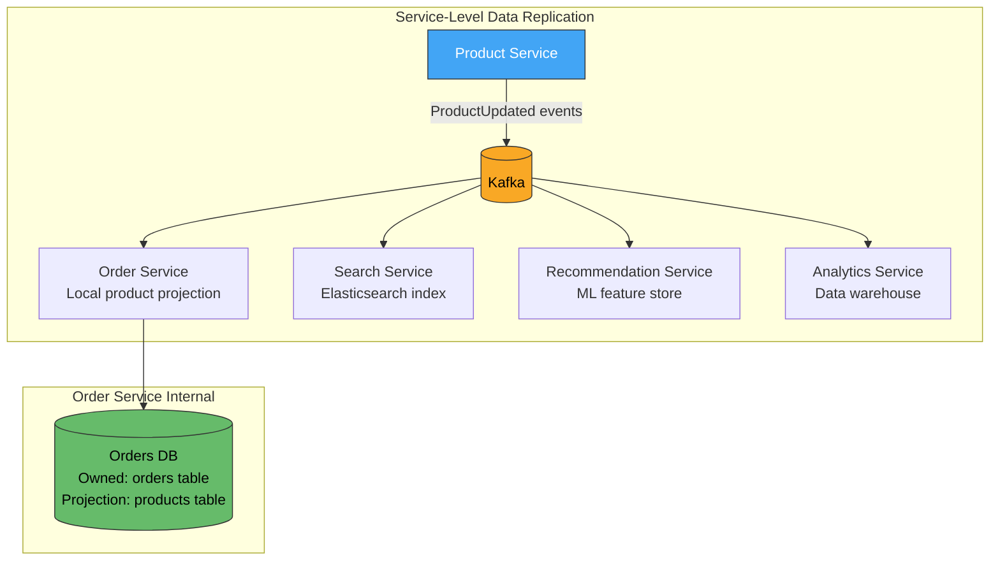

| Mechanism | Latency | Ordering | Best For |
|---|---|---|---|
| **Event-Carried State Transfer** | Near real-time | Per partition key | Service-to-service data sharing |
| **CDC (Debezium)** | Milliseconds | WAL order | DB-to-DB replication, legacy integration |
| **API Polling** | Seconds-minutes | No guarantee | Simple, low-volume reference data |
| **Shared Cache (Redis)** | Sub-millisecond reads | No guarantee | Session state, hot data |

---

### Multi-Region Partitioning + Replication

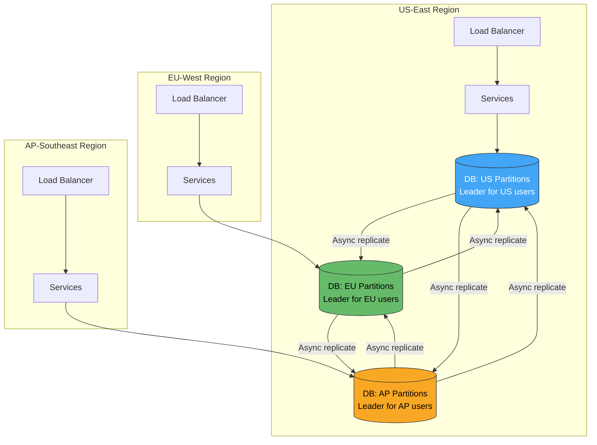

**Geo-partitioning:** Each region is the **leader** for its local users' data. Cross-region reads use local replicas. This gives low write latency (writes go to local leader) and low read latency (reads from local replica), with eventual consistency across regions.

| Pattern | Write Latency | Read Latency | Consistency | Complexity |
|---|---|---|---|---|
| **Single-region leader, global replicas** | High (remote writes) | Low (local reads) | Strong writes, eventual reads | Low |
| **Geo-partitioned leaders** | Low (local writes) | Low (local reads) | Eventual across regions | High |
| **Global consensus (Spanner/CockroachDB)** | Medium (quorum across regions) | Low (leader lease reads) | Strong (linearizable) | Very High |

---

### Partition Key Selection Guide

Choosing the right partition key is the **most critical decision** — a bad key causes hot spots, cross-partition queries, and poor scalability.

| Data Domain | Good Partition Key | Bad Partition Key | Why |
|---|---|---|---|
| **Orders** | `customer_id` | `order_date` | Date = time-series hot spot; customer = even distribution |
| **Multi-tenant SaaS** | `tenant_id` | `created_at` | Tenant isolates workloads; date skews to current |
| **Social posts** | `user_id` | `post_id` (sequential) | Sequential IDs cluster on one partition |
| **IoT telemetry** | `device_id` | `timestamp` | Timestamp = all writes to one partition |
| **E-commerce products** | `category_id` (with hash) | `product_name` | Names cluster alphabetically |
| **Chat messages** | `conversation_id` | `sender_id` | Conversation = natural query boundary |

**Rules:**
1. High cardinality (many distinct values → even distribution)
2. Matches query pattern (most queries filter by this key → single-partition access)
3. Even write distribution (no single value gets disproportionate writes)
4. Stable (doesn't change → no record migration)

---

### Anti-Patterns

| Anti-Pattern | Problem | Remedy |
|---|---|---|
| **Premature sharding** | Sharding before needed adds massive complexity | Vertical scaling + read replicas first; shard when single node capacity exceeded |
| **Sequential partition key** | Auto-increment ID → all writes to latest partition (hot spot) | Use UUID, hash, or composite key |
| **Cross-partition joins** | Queries that span all partitions negate sharding benefits | Denormalize; use CQRS read models; choose partition key aligned with query |
| **Ignoring replication lag** | Reading from replica immediately after write → stale data | Read-your-writes to leader; monitor lag; set SLOs on lag |
| **No rebalancing strategy** | Adding a partition requires reshuffling all data | Use consistent hashing; plan rebalancing tooling upfront |
| **LWW without understanding** | Last-Writer-Wins silently drops data in multi-leader | Understand conflict semantics; use CRDTs or app-level merge for important data |
| **Homogeneous replicas** | All replicas have same spec → no cost optimization | Use heterogeneous replicas: fast SSD for leader, cheaper storage for read replicas |
| **No partition monitoring** | One partition is 100× larger than others — undetected | Monitor partition size distribution; alert on skew |
| **Replicating everything cross-service** | Every service has a copy of every other service's data | Replicate only what each service needs for its primary function |
| **Synchronous replication everywhere** | All writes wait for all replicas → high latency, low availability | Semi-sync (1 confirmed replica) for durability; async for read replicas |

---

### Monitoring

| Metric | Alert Threshold | Meaning |
|---|---|---|
| `replication_lag_seconds` | > 5s sustained | Replica falling behind — may serve stale data |
| `partition_size_ratio` (max/min) | > 3:1 | Data skew — hot partition or bad partition key |
| `cross_partition_query_ratio` | > 20% of queries | Partition key misaligned with query patterns |
| `partition_write_rate_skew` | > 5:1 hottest/average | Write hot spot — rebalance or change partition key |
| `failover_time_seconds` | > 30s | Replica promotion too slow — impacts availability |
| `replication_error_rate` | > 0 | Replication pipeline broken — data divergence |

---

### Decision Framework

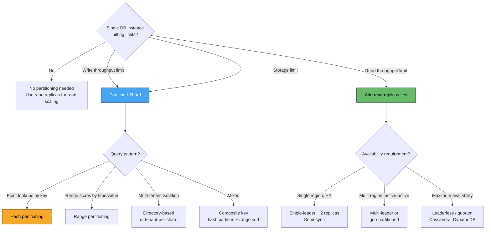

---

### Practical Checklist

**Partitioning:**
- [ ] Exhaust vertical scaling and read replicas before sharding
- [ ] Choose partition key based on **query patterns**, not just data distribution
- [ ] Verify key has **high cardinality** and **even write distribution**
- [ ] Use **consistent hashing** (or managed sharding) to simplify rebalancing
- [ ] Plan for **cross-partition queries** — CQRS read models or search indexes
- [ ] Monitor partition **size skew** and **write rate skew**
- [ ] Test rebalancing procedure before you need it in production

**Replication:**
- [ ] Use **read replicas** for read scaling (simplest, most impactful)
- [ ] Use **semi-synchronous** replication for durability without sacrificing availability
- [ ] Monitor **replication lag** — set SLO (e.g., < 1s p99)
- [ ] Implement **read-your-writes** consistency for post-write reads
- [ ] Plan **failover procedure** — automated promotion, DNS update, connection draining
- [ ] For multi-region: choose between **geo-partitioned leaders** and **global consensus** based on consistency needs
- [ ] For cross-service replication: use **event-carried state transfer** via Kafka/CDC

---

### Recommendation

**Start simple:** single database with **read replicas** handles most microservice workloads. Add partitioning only when a single node's write throughput or storage is genuinely exhausted. When you shard, choose a **partition key that matches your dominant query pattern** — this single decision determines whether sharding helps or hurts. Use **consistent hashing** (Cassandra, DynamoDB, CockroachDB) to avoid painful rebalancing. For replication, **semi-synchronous single-leader** is the right default for most OLTP workloads. Move to **multi-leader or leaderless** only for active-active multi-region or extreme availability requirements — and prepare for conflict resolution complexity. For cross-service data sharing, use **event-driven replication** (Kafka + event-carried state transfer) to keep services self-contained.

---

### Next Steps to Explore

1. **CockroachDB / Spanner** — globally distributed SQL with automatic partitioning and strong consistency
2. **Vitess / Citus** — sharding layers for MySQL / PostgreSQL
3. **CQRS read models** — purpose-built projections for cross-partition query patterns
4. **CRDTs** — conflict-free replicated data types for multi-leader / leaderless systems
5. **Chaos testing replication** — kill leaders, introduce network partitions, measure failover