## Service Partitioning & Service Scaling in Microservices Architecture

### Context & Assumptions

**Service partitioning** is about decomposing workloads within a service so that different partitions handle different subsets of traffic (by tenant, geography, feature, or load). **Service scaling** is about adjusting compute capacity — horizontally (more instances) or vertically (bigger instances) — to meet demand. Together, they determine how your microservice architecture handles growth from 10 requests/second to 100,000 requests/second without re-architecture.

These are distinct from *data partitioning* (splitting database rows across shards). Here we focus on the **compute layer** — the service instances themselves.

---

### Core Concepts

| Concept | Definition |
|---|---|
| **Horizontal Scaling (Scale Out)** | Add more service instances behind a load balancer |
| **Vertical Scaling (Scale Up)** | Give existing instances more CPU/memory |
| **Service Partitioning** | Splitting a service into partitioned subsets that handle distinct traffic slices |
| **Auto-scaling** | Automatically adjusting instance count based on metrics |
| **Load Balancing** | Distributing requests across service instances |
| **Stateless Service** | Instance holds no client state — any instance can serve any request |
| **Stateful Service** | Instance holds client/session state — requests must route to specific instance |
| **Affinity / Sticky Sessions** | Routing related requests to the same instance |

---

## Part 1: Service Scaling

### Vertical vs. Horizontal Scaling

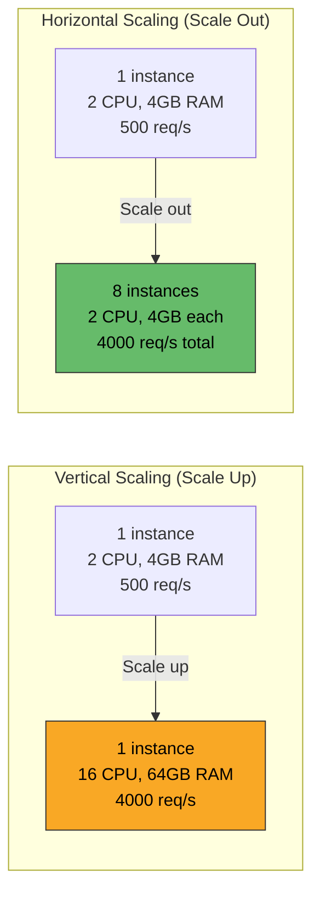

| Aspect | Vertical Scaling | Horizontal Scaling |
|---|---|---|
| **Mechanism** | Bigger machine | More machines |
| **Limit** | Hardware ceiling (largest available VM/server) | Virtually unlimited |
| **Downtime** | Usually requires restart | Zero-downtime (rolling) |
| **Cost curve** | Exponential (2× CPU ≠ 2× cost) | Linear (2× instances ≈ 2× cost) |
| **Failure blast radius** | Total — single instance dies, service is down | Partial — one instance dies, others serve |
| **State handling** | Simple — one instance | Must be stateless or use external state |
| **Complexity** | Low | Medium (load balancing, health checks, session management) |
| **Best for** | Databases, in-memory workloads, quick fix | Stateless services, web APIs, workers |

---

### Kubernetes Horizontal Pod Autoscaler (HPA)

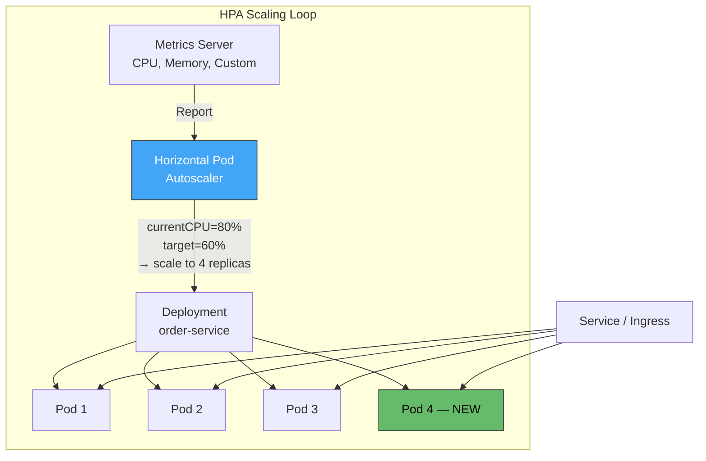

**HPA scaling formula:**

$$\text{desiredReplicas} = \lceil \text{currentReplicas} \times \frac{\text{currentMetric}}{\text{targetMetric}} \rceil$$

Example: 3 replicas at 80% CPU, target 60%:

$$\text{desired} = \lceil 3 \times \frac{80}{60} \rceil = \lceil 4.0 \rceil = 4$$

---

### Scaling Metrics

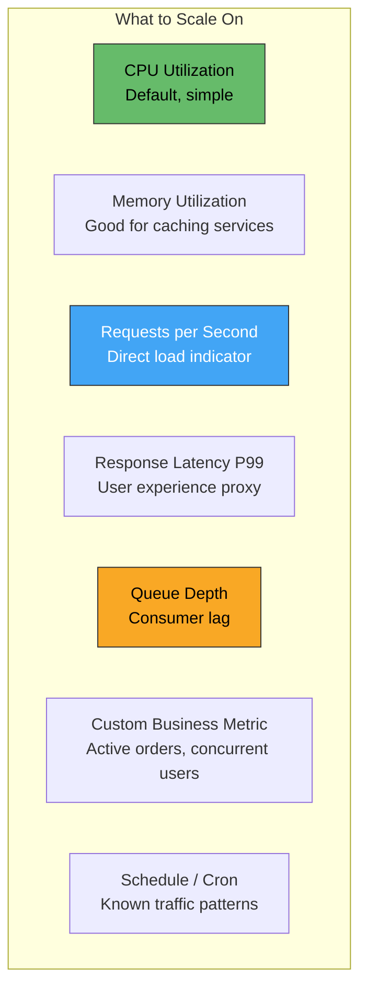

| Metric | Scaling Type | Lag | Best For |
|---|---|---|---|
| **CPU utilization** | Reactive | 30-60s | General compute-bound services |
| **Memory utilization** | Reactive | 30-60s | Caching services, JVM heap pressure |
| **Requests/second (RPS)** | Reactive | 15-30s | API services with known per-instance capacity |
| **Latency (P99, P95)** | Reactive | 30-60s | Latency-sensitive user-facing services |
| **Queue depth / consumer lag** | Reactive | 10-30s | Async workers, event consumers |
| **Custom business metric** | Reactive | Varies | Domain-specific (active sessions, cart count) |
| **Schedule-based (cron)** | Predictive | Zero | Known patterns (sale events, business hours) |
| **ML-based predictive** | Predictive | Negative (ahead of load) | Complex traffic patterns with historical data |

---

### Multi-Dimensional Autoscaling

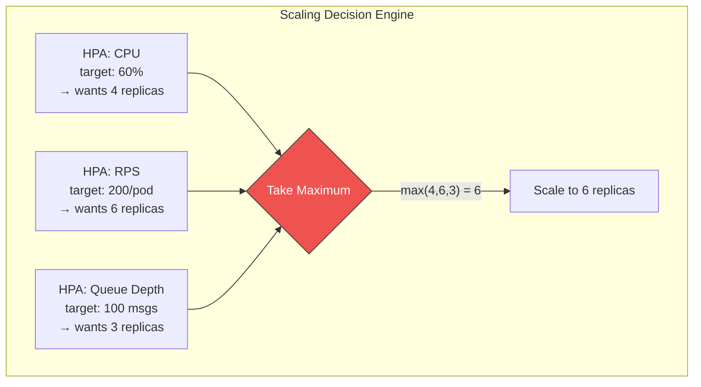

Kubernetes HPA with multiple metrics always takes the **maximum** recommended count — ensuring all SLOs are met.

---

### Vertical Pod Autoscaler (VPA)

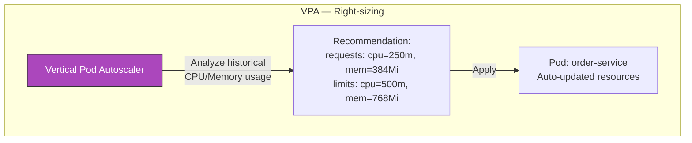

| Mode | Behavior | Disruption |
|---|---|---|
| **Off** | Recommendations only — no changes applied | None |
| **Auto** | Evicts pods and recreates with new resources | Pod restart |
| **Initial** | Sets resources only at creation time | None after start |

**Warning:** VPA and HPA generally conflict on the same metric (CPU). Use VPA for right-sizing requests/limits; HPA for replica count scaling.

---

### KEDA: Event-Driven Autoscaling

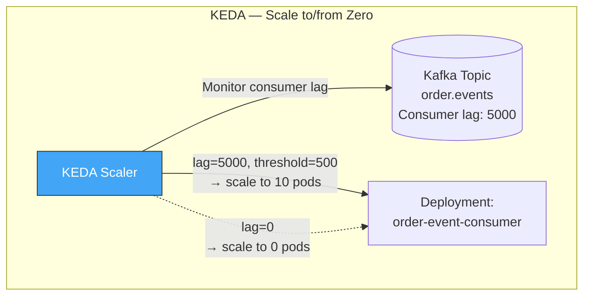

| KEDA Scaler | Source | Best For |
|---|---|---|
| Kafka | Consumer group lag | Event consumers |
| RabbitMQ | Queue length | Task workers |
| Prometheus | Custom query | Any Prometheus metric |
| Cron | Schedule | Predictive scaling |
| AWS SQS | Queue depth | AWS message processing |
| Redis | List length, stream pending | Job queues |
| HTTP | External API metric | External signals |

**Key advantage:** KEDA scales to **zero** — HPA has a minimum of 1 replica. Critical for cost optimization of event-driven workloads with intermittent traffic.

---

### Scaling Patterns by Service Type

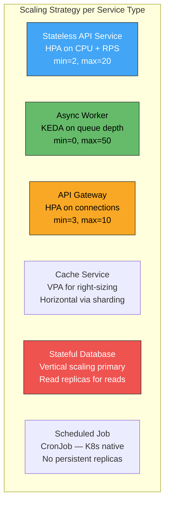

| Service Type | Primary Scaling | Metric | Min | Scale-to-Zero |
|---|---|---|---|---|
| **Stateless API** | HPA (horizontal) | CPU, RPS, latency | 2+ (HA) | No |
| **Event consumer / worker** | KEDA | Queue depth, consumer lag | 0 | Yes |
| **API Gateway** | HPA (horizontal) | Connections, RPS | 3+ (HA) | No |
| **Real-time (WebSocket)** | HPA + sticky sessions | Connections | 2+ | No |
| **Batch processor** | KEDA / CronJob | Schedule or job queue | 0 | Yes |
| **ML inference** | HPA on GPU utilization | GPU%, latency | 1+ | Yes (KEDA) |
| **Database** | Vertical + read replicas | CPU, IOPS, connections | N/A | No |

---

### Warm-up & Graceful Scaling

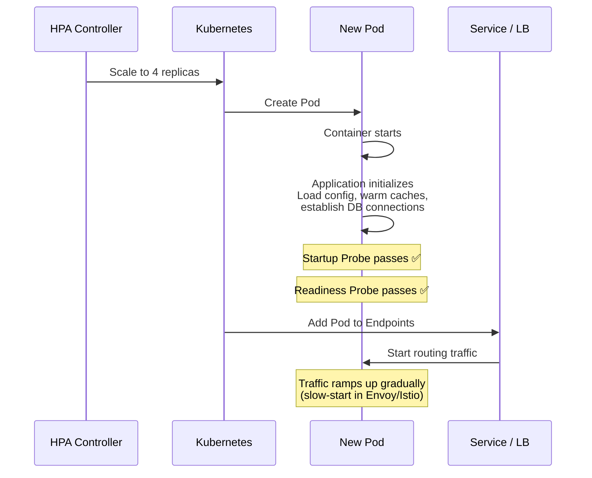

| Kubernetes Probe | Purpose in Scaling |
|---|---|
| **Startup Probe** | Wait for slow-starting apps (JVM, .NET) before liveness kicks in |
| **Readiness Probe** | Pod receives traffic only after it's ready to serve |
| **Liveness Probe** | Restart pod if it becomes unhealthy |

**Slow-start / warm-up:** Service mesh (Envoy/Istio) can gradually ramp traffic to new pods instead of immediately sending full load to a cold instance.

---

### Graceful Scale-Down

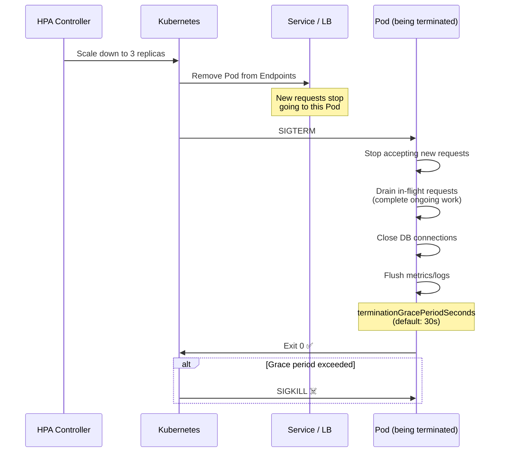

**Critical settings:**

| Setting | Purpose | Recommended |
|---|---|---|
| `terminationGracePeriodSeconds` | Time allowed for graceful shutdown | Match your longest request timeout |
| `preStop` hook | Delay before SIGTERM (allow LB to drain) | `sleep 5` to let endpoints update propagate |
| HPA `stabilizationWindowSeconds` | Prevent rapid scale down oscillation | 300s (scale-down), 0s (scale-up) |
| HPA `scaleDown.policies` | Rate limit scale-down | Max 1 pod per 60s, or 10% per minute |

---

## Part 2: Service Partitioning

### Service Partitioning Strategies

Service partitioning splits the **compute layer** so that different instances handle different subsets of work — beyond simple round-robin load balancing.

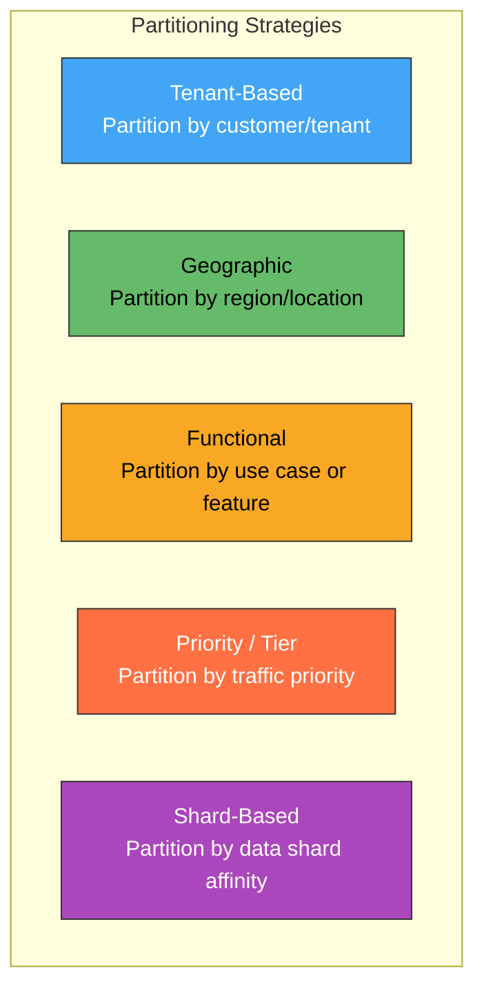

---

#### 1. Tenant-Based Partitioning

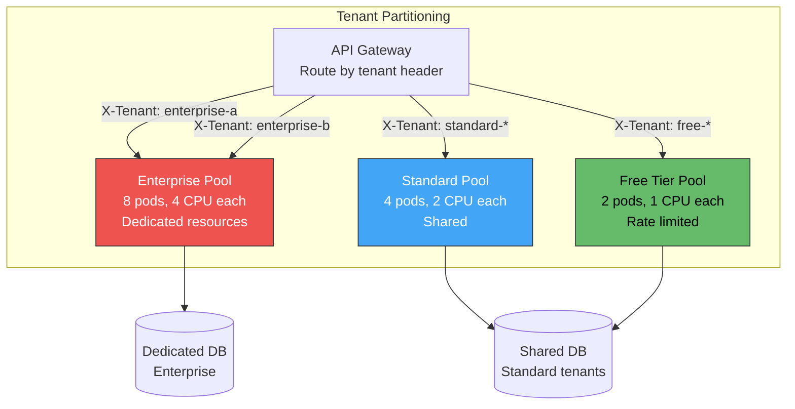

| Tenant Tier | Isolation | Resource Allocation | SLA |
|---|---|---|---|
| **Enterprise** | Dedicated pod pool + DB | Guaranteed CPU/memory, no contention | 99.99% |
| **Standard** | Shared pod pool, namespace quotas | Burstable resources | 99.9% |
| **Free** | Shared pool, strict rate limits | Best-effort, heavily throttled | 99.0% |

**Implementation:**
- Kubernetes: separate Deployments per tenant tier, with different resource requests/limits
- Service mesh (Istio): VirtualService routing by header to different destination subsets
- API Gateway (Kong/Envoy): route by tenant ID header or JWT claim

---

#### 2. Geographic Partitioning

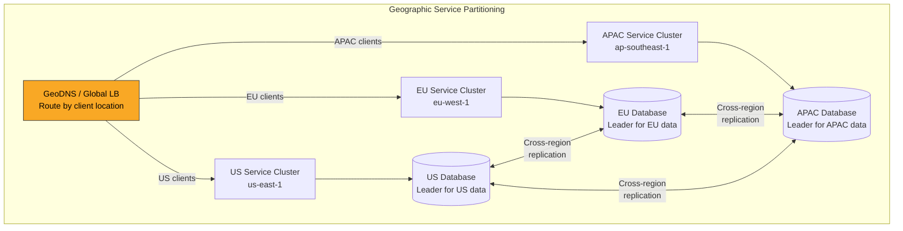

| Benefit | Trade-off |
|---|---|
| Lowest latency (serve from nearest region) | Cross-region data consistency is eventual |
| Data residency compliance (GDPR, data sovereignty) | Operational complexity of multi-region deployment |
| Blast radius isolation (regional failure) | Must handle cross-region requests (user traveling) |

---

#### 3. Functional Partitioning (Swimlanes)

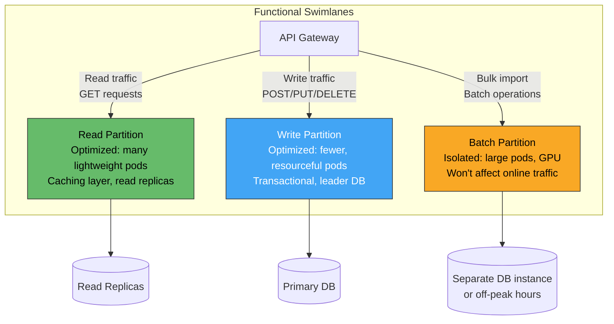

| Swimlane | Characteristics | Scaling Strategy |
|---|---|---|
| **Read path** | High throughput, cacheable, idempotent | HPA on RPS; aggressive caching |
| **Write path** | Lower throughput, transactional, sequential | HPA on CPU; queue-based buffering |
| **Batch / import** | Bursty, resource-intensive, tolerate latency | KEDA on job queue; scale-to-zero |
| **Search / analytics** | CPU-intensive, fan-out queries | HPA on latency; separate cluster |

---

#### 4. Priority-Based Partitioning (Traffic Tiers)

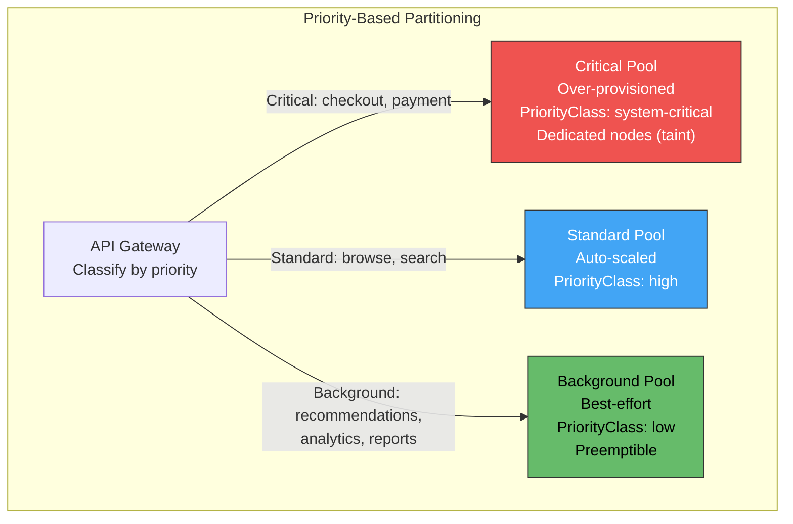

Under resource pressure, Kubernetes **preempts** low-priority pods to make room for critical ones:

| Priority Tier | Resources | Under Pressure | Pod Disruption |
|---|---|---|---|
| **Critical** | Guaranteed QoS, dedicated nodes | Protected — never preempted | PDB: minAvailable=80% |
| **Standard** | Burstable QoS | May be throttled | PDB: minAvailable=50% |
| **Background** | BestEffort QoS, spot instances | Preempted first | No PDB (can be fully evicted) |

---

#### 5. Shard-Affinity Partitioning

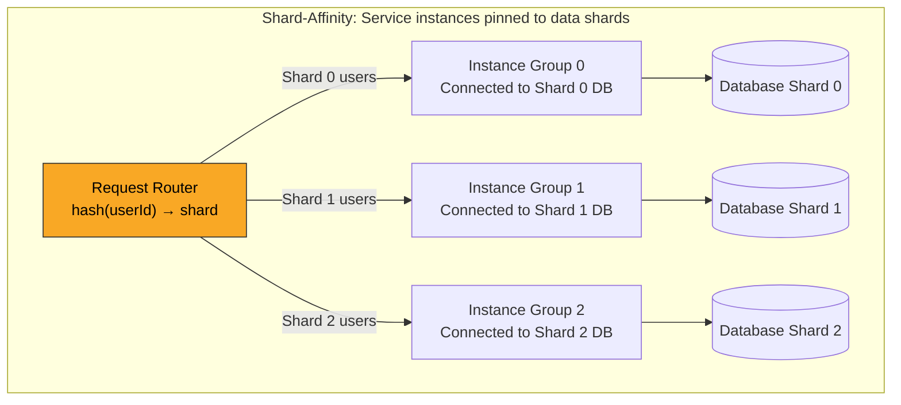

| Benefit | Trade-off |
|---|---|
| Connection pool efficiency (each instance connects to one shard) | Routing complexity |
| Better cache locality (instance caches only its shard's data) | Uneven load if shards are skewed |
| Reduced cross-shard queries | Must handle shard rebalancing at compute layer too |

---

### Load Balancing Strategies

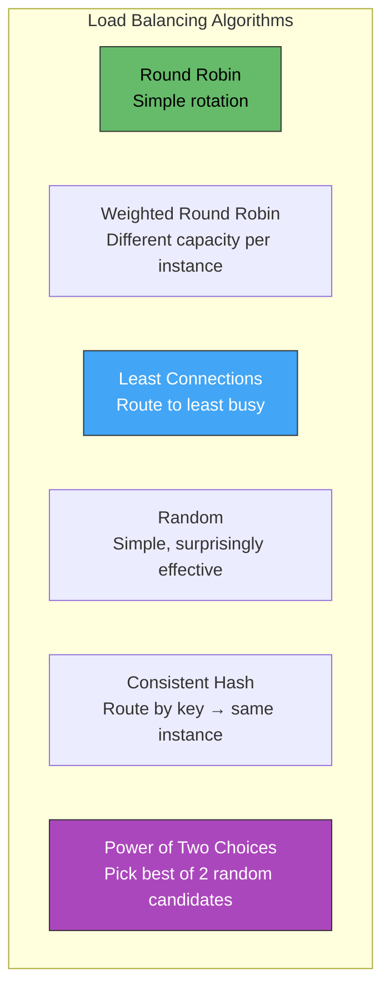

| Algorithm | When to Use | Statefulness | Hot Spot Risk |
|---|---|---|---|
| **Round Robin** | Uniform instances, stateless service | None | Low |
| **Weighted Round Robin** | Heterogeneous instances (different CPU/memory) | None | Low |
| **Least Connections** | Variable request duration | None | Low |
| **IP Hash** | Session affinity without cookies | Sticky | Medium |
| **Consistent Hash** | Cache affinity, stateful routing | Sticky | Medium |
| **Power of Two Choices** | High-throughput, latency-sensitive | None | Very Low |
| **Locality-Aware** | Multi-zone — prefer same-zone instances | None | Low |

---

### Scaling Stateful Services

Stateless services scale trivially — add instances behind a load balancer. **Stateful services require special handling:**

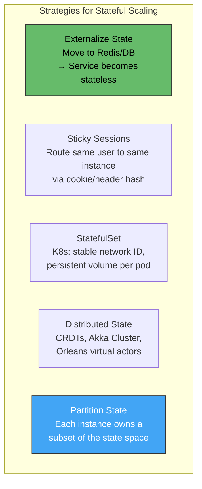

| Strategy | Complexity | Scalability | Failover | Best For |
|---|---|---|---|---|
| **Externalize state** | Low | Highest | Seamless | ✅ Default recommendation |
| **Sticky sessions** | Low | Medium | Session lost on instance death | WebSocket, short-lived sessions |
| **StatefulSet** | Medium | Medium | Volume survives, pod restart | Databases, message brokers |
| **Distributed state** | High | High | Automatic rebalancing | Real-time games, actor systems |
| **Partitioned state** | High | High | Must re-partition on failure | Event sourcing, stream processing |

---

### Cost-Optimized Scaling

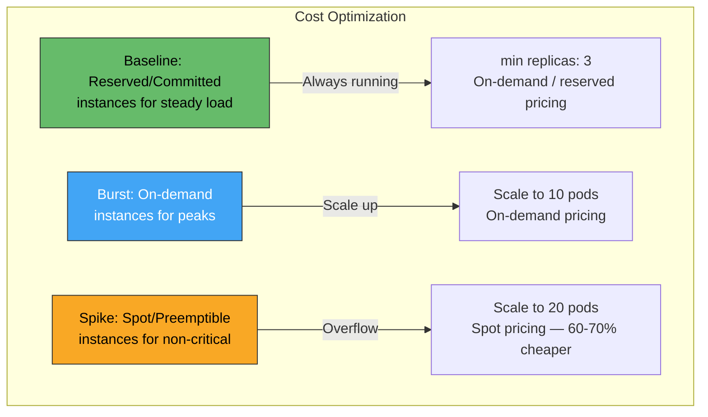

| Instance Type | Cost | Availability | Best For |
|---|---|---|---|
| **Reserved / Committed** | Lowest (1-3 year) | Guaranteed | Baseline steady-state load |
| **On-demand** | Standard | Guaranteed | Variable production workloads |
| **Spot / Preemptible** | 60-90% discount | Can be reclaimed with 2min notice | Batch, stateless overflow, dev/test |
| **Scale-to-Zero (KEDA)** | Zero when idle | Cold start latency | Event consumers, scheduled jobs |

**Mixed strategy:** Run baseline on reserved instances, burst to on-demand, overflow non-critical to spot — can reduce compute cost by 40-60%.

---

### Scaling Anti-Patterns

| Anti-Pattern | Problem | Remedy |
|---|---|---|
| **Scaling on memory with leak** | More instances just delays OOM; masks the bug | Fix the memory leak; use VPA for right-sizing |
| **Scaling CPU without profiling** | May addmore pods but bottleneck is DB or external API | Profile first; scale the bottleneck (Amdahl's Law) |
| **No max replica limit** | Runaway scaling → exhausts cluster, huge cloud bill | Always set `maxReplicas`; alert on reaching max |
| **Aggressive scale-down** | Scale down too fast → oscillation (scale up again immediately) | `stabilizationWindowSeconds: 300` on scale-down |
| **Scaling stateful services like stateless** | Data loss, split-brain, inconsistent state | Externalize state or use StatefulSet with proper PVCs |
| **Same scaling config everywhere** | Checkout service and analytics service have same HPA | Tune per service based on criticality, traffic pattern, and cost |
| **Ignoring cold start** | New pods not ready for 30s → latency spike during scale-out | Readiness probes, slow-start in mesh, pre-warm strategies |
| **No PodDisruptionBudget** | Scale-down + node maintenance → too many pods killed simultaneously | PDB: `minAvailable: 50%` or `maxUnavailable: 1` |
| **Scaling partitions unevenly** | One tenant pool has 20 pods, another is starved | Monitor per-partition utilization; auto-scale each independently |
| **Premature partitioning** | Splitting service into pools before traffic justifies it | Start with shared pool + load balancing; partition when isolation needed |

---

### Capacity Planning

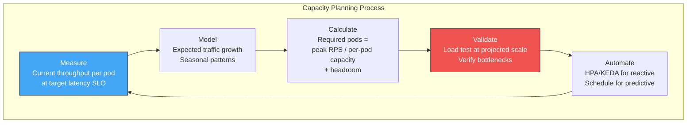

**Capacity formula:**

$$\text{minReplicas} = \left\lceil \frac{\text{peakRPS}}{\text{rpsPerPod}} \times \text{headroom} \right\rceil + \text{haBuffer}$$

Example: Peak = 5000 RPS, each pod handles 500 RPS, 1.3× headroom, 2 pods HA buffer:

$$\text{min} = \lceil \frac{5000}{500} \times 1.3 \rceil + 2 = 13 + 2 = 15 \text{ pods}$$

---

### Monitoring Scaling Health

| Metric | Alert Threshold | Meaning |
|---|---|---|
| `hpa_current_replicas / hpa_max_replicas` | > 80% | Approaching scaling ceiling |
| `pod_restart_count` | > 3 in 5min | OOM kills or crash loops during scaling |
| `pod_scheduling_latency` | > 30s | Cluster lacks capacity; need more nodes |
| `request_queue_depth` | Growing | Pods can't keep up — need to scale faster |
| `hpa_scaling_events` | > 10/hour | Oscillation — tune stabilization window |
| `pod_readiness_duration` | > 30s | Slow startup — cold-start issue |
| `cluster_node_utilization` | > 80% | Add nodes or enable cluster autoscaler |
| `spot_instance_interruptions` | > 0 | Spot instances being reclaimed — ensure graceful handling |

---

### Decision Framework

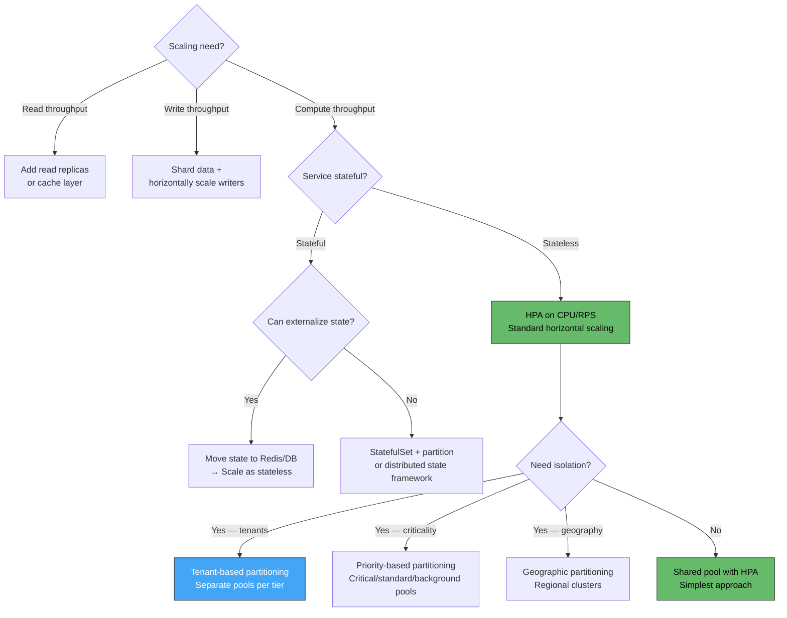

---

### Practical Checklist

**Scaling:**
- [ ] Make all API services **stateless** — externalize state to Redis, DB, or object store
- [ ] Configure **HPA** on every production Deployment — CPU + at least one business metric
- [ ] Set **`minReplicas ≥ 2`** for HA (survive single pod failure)
- [ ] Set **`maxReplicas`** with alert at 80% — prevent runaway scaling
- [ ] Use **KEDA** for event-driven workers — scale-to-zero when no messages
- [ ] Configure **PodDisruptionBudget** — prevent mass eviction during scaling/maintenance
- [ ] Set **readiness probes** — prevent routing traffic to unready pods during scale-out
- [ ] Tune **scale-down stabilization** (300s) — prevent oscillation
- [ ] Use **preStop hooks** (`sleep 5`) — allow endpoint removal to propagate before SIGTERM
- [ ] Enable **Cluster Autoscaler** — scale nodes when pods are unschedulable
- [ ] **Load test** at 2× projected peak — validate scaling behavior before production

**Partitioning:**
- [ ] Start with **shared pool** — partition only when isolation is required
- [ ] For multi-tenant SaaS: **tenant-tier partitioning** (enterprise/standard/free pools)
- [ ] For global services: **geographic partitioning** with regional clusters
- [ ] For mixed workloads: **functional swimlanes** (read/write/batch pools)
- [ ] For critical paths: **priority partitioning** with PriorityClass and dedicated nodes
- [ ] Monitor **per-partition utilization** — auto-scale each partition independently
- [ ] Set **resource quotas** per namespace to prevent one partition from starving others

---

### Recommendation

**Default to stateless horizontal scaling with HPA** — this handles 90% of microservice scaling needs. Externalize all state to managed databases or Redis. Use **CPU + RPS** as HPA metrics for API services; **KEDA + queue depth** for event consumers. Add **service partitioning** only when you need **tenant isolation** (SaaS tiers), **geographic locality** (latency/compliance), or **priority isolation** (protect checkout from analytics). Always set minimum replicas ≥ 2, maximum with an alert, and PodDisruptionBudgets. Budget for **Cluster Autoscaler** to add nodes when pod scaling demands exceed current cluster capacity. Optimize cost with a mix of reserved instances (baseline) and spot instances (burst/non-critical).

---

### Next Steps to Explore

1. **KEDA deep-dive** — event-driven autoscaling with custom scalers
2. **Cluster Autoscaler + Karpenter** — node-level scaling for pod demand
3. **Multi-cluster federation** — scaling beyond a single Kubernetes cluster
4. **Load testing for scaling validation** — k6, Locust, Gatling at production scale
5. **Cell-based architecture** — the ultimate service partitioning pattern for massive scale