## Service Orchestration & Service Choreography in Microservices

### Context & Assumptions

When multiple microservices must collaborate to fulfill a business process (e.g., placing an order involves inventory, payment, shipping, and notification), there are two fundamentally different coordination strategies: **Orchestration** (a central coordinator tells each service what to do and when) and **Choreography** (each service reacts to events and decides independently what to do next). This is the most consequential architectural decision for any multi-service workflow — it determines coupling, resilience, visibility, and how your teams operate.

---

### The Core Distinction

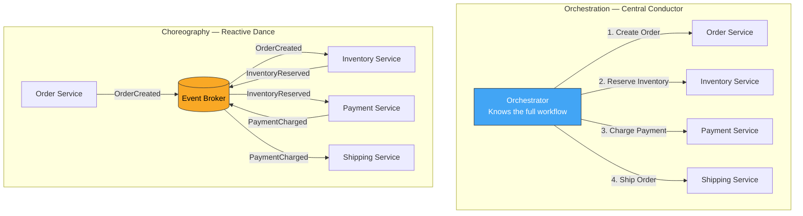
```mermaid
graph TD
    subgraph "Orchestration — Central Conductor"
        ORCH[Orchestrator<br/>Knows the full workflow] -->|"1. Create Order"| S1[Order Service]
        ORCH -->|"2. Reserve Inventory"| S2[Inventory Service]
        ORCH -->|"3. Charge Payment"| S3[Payment Service]
        ORCH -->|"4. Ship Order"| S4[Shipping Service]
    end

    subgraph "Choreography — Reactive Dance"
        C1[Order Service] -->|OrderCreated| B[(Event Broker)]
        B -->|OrderCreated| C2[Inventory Service]
        C2 -->|InventoryReserved| B
        B -->|InventoryReserved| C3[Payment Service]
        C3 -->|PaymentCharged| B
        B -->|PaymentCharged| C4[Shipping Service]
    end

    style ORCH fill:#42a5f5,stroke:#333,color:#fff
    style B fill:#f9a825,stroke:#333,color:#000
```

**Analogy:**
- **Orchestration** = Orchestra conductor: one person directs every musician, controls tempo and sequence
- **Choreography** = Jazz ensemble: each musician listens to the others and responds, no conductor needed

---

## Part 1: Orchestration

### How Orchestration Works

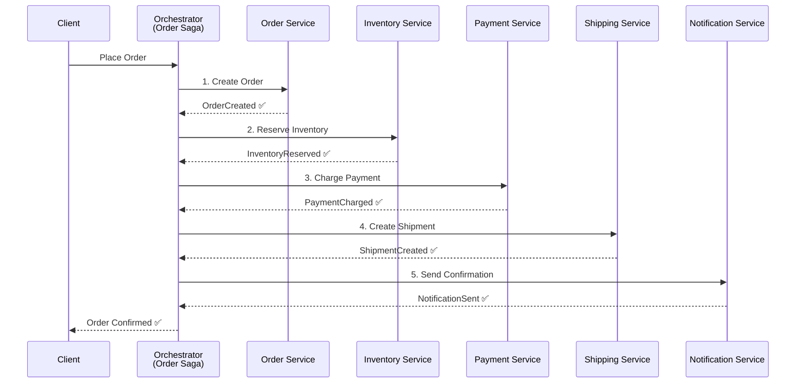
```mermaid
sequenceDiagram
    participant C as Client
    participant O as Orchestrator<br/>(Order Saga)
    participant OS as Order Service
    participant IS as Inventory Service
    participant PS as Payment Service
    participant SS as Shipping Service
    participant NS as Notification Service

    C->>O: Place Order

    O->>OS: 1. Create Order
    OS-->>O: OrderCreated ✅

    O->>IS: 2. Reserve Inventory
    IS-->>O: InventoryReserved ✅

    O->>PS: 3. Charge Payment
    PS-->>O: PaymentCharged ✅

    O->>SS: 4. Create Shipment
    SS-->>O: ShipmentCreated ✅

    O->>NS: 5. Send Confirmation
    NS-->>O: NotificationSent ✅

    O-->>C: Order Confirmed ✅
```

The orchestrator is a **state machine** that:
1. Knows the complete workflow definition
2. Calls each service in the correct order
3. Handles branching, conditions, and parallel paths
4. Manages compensations (rollback) on failure
5. Persists its state for crash recovery

---

### Orchestrator State Machine

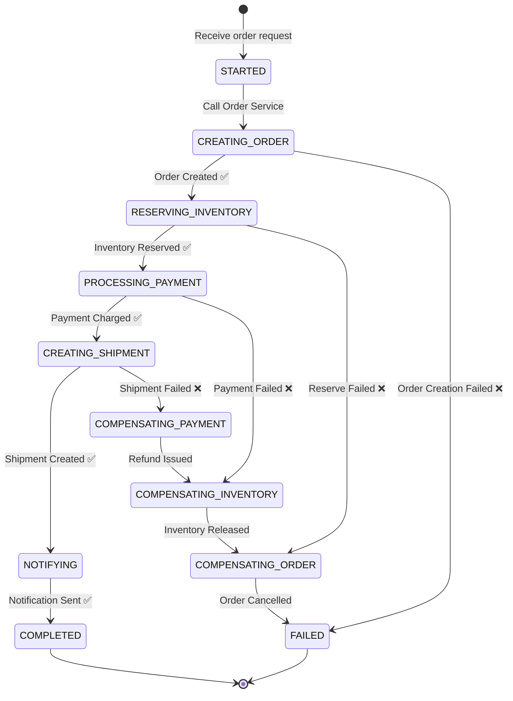
```mermaid
stateDiagram-v2
    [*] --> STARTED: Receive order request

    STARTED --> CREATING_ORDER: Call Order Service
    CREATING_ORDER --> RESERVING_INVENTORY: Order Created ✅
    CREATING_ORDER --> FAILED: Order Creation Failed ❌

    RESERVING_INVENTORY --> PROCESSING_PAYMENT: Inventory Reserved ✅
    RESERVING_INVENTORY --> COMPENSATING_ORDER: Reserve Failed ❌

    PROCESSING_PAYMENT --> CREATING_SHIPMENT: Payment Charged ✅
    PROCESSING_PAYMENT --> COMPENSATING_INVENTORY: Payment Failed ❌

    CREATING_SHIPMENT --> NOTIFYING: Shipment Created ✅
    CREATING_SHIPMENT --> COMPENSATING_PAYMENT: Shipment Failed ❌

    NOTIFYING --> COMPLETED: Notification Sent ✅

    COMPENSATING_PAYMENT --> COMPENSATING_INVENTORY: Refund Issued
    COMPENSATING_INVENTORY --> COMPENSATING_ORDER: Inventory Released
    COMPENSATING_ORDER --> FAILED: Order Cancelled

    COMPLETED --> [*]
    FAILED --> [*]
```

Every state transition is **persisted** — if the orchestrator crashes at any point, it resumes from the last persisted state.

---

### Orchestration with Parallel Steps

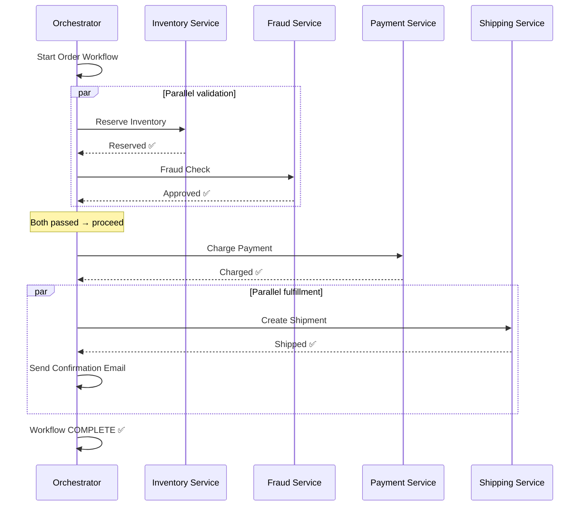
```mermaid
sequenceDiagram
    participant O as Orchestrator
    participant IS as Inventory Service
    participant FS as Fraud Service
    participant PS as Payment Service
    participant SS as Shipping Service

    O->>O: Start Order Workflow

    par Parallel validation
        O->>IS: Reserve Inventory
        IS-->>O: Reserved ✅
        O->>FS: Fraud Check
        FS-->>O: Approved ✅
    end

    Note over O: Both passed → proceed

    O->>PS: Charge Payment
    PS-->>O: Charged ✅

    par Parallel fulfillment
        O->>SS: Create Shipment
        SS-->>O: Shipped ✅
        O->>O: Send Confirmation Email
    end

    O->>O: Workflow COMPLETE ✅
```

Orchestrators excel at **parallel fan-out** — running independent steps concurrently and joining on completion, with explicit handling when one branch fails.

---

### Orchestration Technologies

| Technology | Type | Language | Key Features | Best For |
|---|---|---|---|---|
| **Temporal.io** | Durable workflow engine | Go, Java, TS, Python, .NET | Code-as-workflow, automatic retries, crash recovery | Complex business workflows |
| **AWS Step Functions** | Managed state machine | JSON (ASL) | Serverless, visual designer, built-in error handling | AWS-native, serverless |
| **Camunda** | BPMN workflow engine | Java, REST | Visual BPMN modeling, human tasks, audit | Enterprise process automation |
| **Netflix Conductor** | Workflow orchestration | Java | JSON workflow definitions, worker-based | Microservice orchestration at scale |
| **Azure Durable Functions** | Durable task framework | C#, JS, Python | Serverless, code-as-workflow | Azure-native |
| **Apache Airflow** | DAG scheduler | Python | Python DAGs, rich scheduling | Data pipelines, batch workflows |
| **Zeebe (Camunda 8)** | Cloud-native BPMN | Java, Go, REST | Horizontal scaling, event-driven BPMN | High-throughput process orchestration |

---

### Temporal.io: Modern Orchestration (Detail)

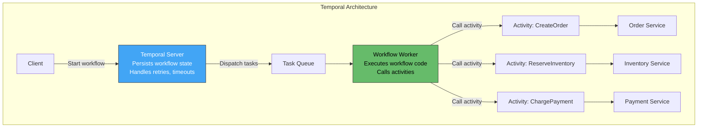
```mermaid
graph TD
    subgraph "Temporal Architecture"
        CLIENT[Client] -->|Start workflow| TS[Temporal Server<br/>Persists workflow state<br/>Handles retries, timeouts]
        TS -->|Dispatch tasks| WQ[Task Queue]
        WQ --> WORKER[Workflow Worker<br/>Executes workflow code<br/>Calls activities]
        WORKER -->|Call activity| A1[Activity: CreateOrder]
        WORKER -->|Call activity| A2[Activity: ReserveInventory]
        WORKER -->|Call activity| A3[Activity: ChargePayment]
        A1 --> OS[Order Service]
        A2 --> IS[Inventory Service]
        A3 --> PS[Payment Service]
    end

    style TS fill:#42a5f5,stroke:#333,color:#fff
    style WORKER fill:#66bb6a,stroke:#333,color:#000
```

**Why Temporal is popular:** The workflow is **ordinary code** (Go/Java/TypeScript function), not YAML or JSON. Temporal handles persistence, retries, timeouts, and crash recovery transparently — the developer writes the happy path and compensation as normal procedural code.

```
// Pseudocode — Temporal workflow
function OrderWorkflow(order):
    orderId = await CreateOrder(order)
    try:
        await ReserveInventory(orderId)
        await ChargePayment(orderId)
        await CreateShipment(orderId)
        return "COMPLETED"
    catch error:
        await CompensatePayment(orderId)   // if payment was charged
        await ReleaseInventory(orderId)     // if inventory was reserved
        await CancelOrder(orderId)
        return "FAILED"
```

---

## Part 2: Choreography

### How Choreography Works

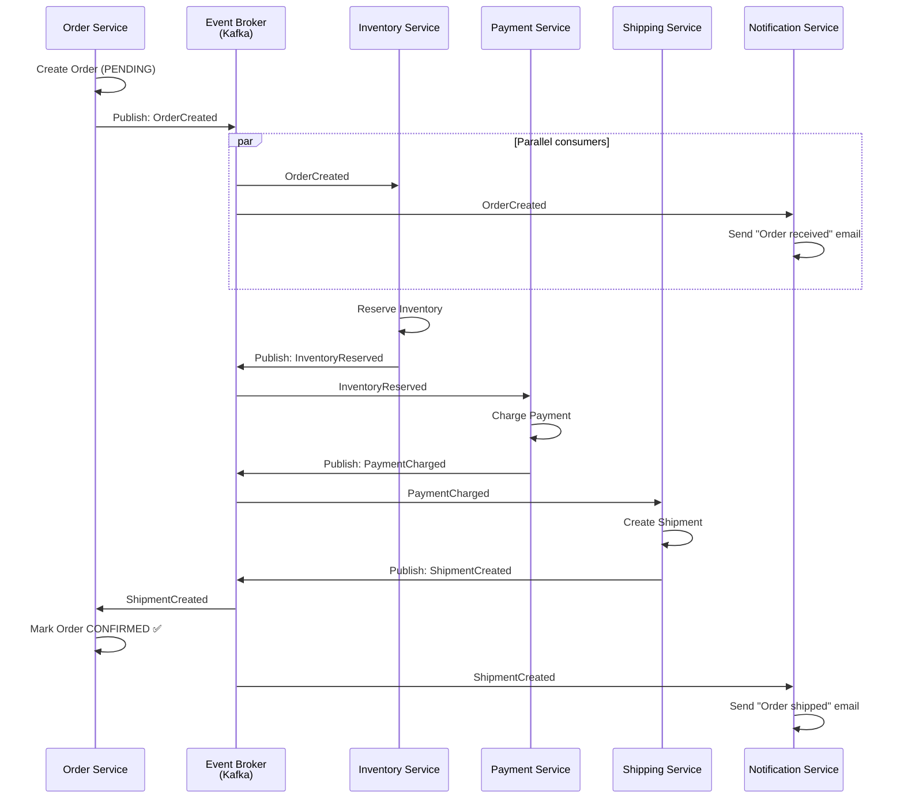
```mermaid
sequenceDiagram
    participant OS as Order Service
    participant B as Event Broker<br/>(Kafka)
    participant IS as Inventory Service
    participant PS as Payment Service
    participant SS as Shipping Service
    participant NS as Notification Service

    OS->>OS: Create Order (PENDING)
    OS->>B: Publish: OrderCreated

    par Parallel consumers
        B->>IS: OrderCreated
        B->>NS: OrderCreated
        NS->>NS: Send "Order received" email
    end

    IS->>IS: Reserve Inventory
    IS->>B: Publish: InventoryReserved

    B->>PS: InventoryReserved
    PS->>PS: Charge Payment
    PS->>B: Publish: PaymentCharged

    B->>SS: PaymentCharged
    SS->>SS: Create Shipment
    SS->>B: Publish: ShipmentCreated

    B->>OS: ShipmentCreated
    OS->>OS: Mark Order CONFIRMED ✅

    B->>NS: ShipmentCreated
    NS->>NS: Send "Order shipped" email
```

No central coordinator — each service **reacts to events** it cares about and **emits events** about what it did. The workflow emerges from the collective behavior.

---

### Choreography: Compensation Flow

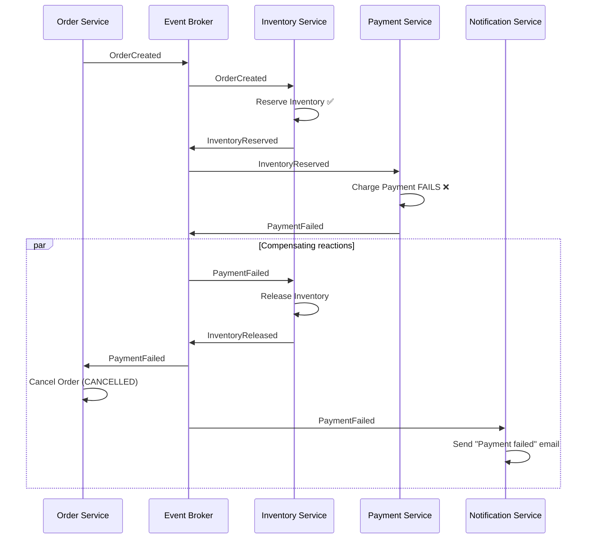
```mermaid
sequenceDiagram
    participant OS as Order Service
    participant B as Event Broker
    participant IS as Inventory Service
    participant PS as Payment Service
    participant NS as Notification Service

    OS->>B: OrderCreated
    B->>IS: OrderCreated
    IS->>IS: Reserve Inventory ✅
    IS->>B: InventoryReserved

    B->>PS: InventoryReserved
    PS->>PS: Charge Payment FAILS ❌
    PS->>B: PaymentFailed

    par Compensating reactions
        B->>IS: PaymentFailed
        IS->>IS: Release Inventory
        IS->>B: InventoryReleased

        B->>OS: PaymentFailed
        OS->>OS: Cancel Order (CANCELLED)

        B->>NS: PaymentFailed
        NS->>NS: Send "Payment failed" email
    end
```

Each service **independently** decides how to react to failure events. No coordinator is telling them to compensate — they each have internal logic: "if I see PaymentFailed and I previously reserved inventory for this order, release it."

---

### Event Flow Graph (Implicit Workflow)

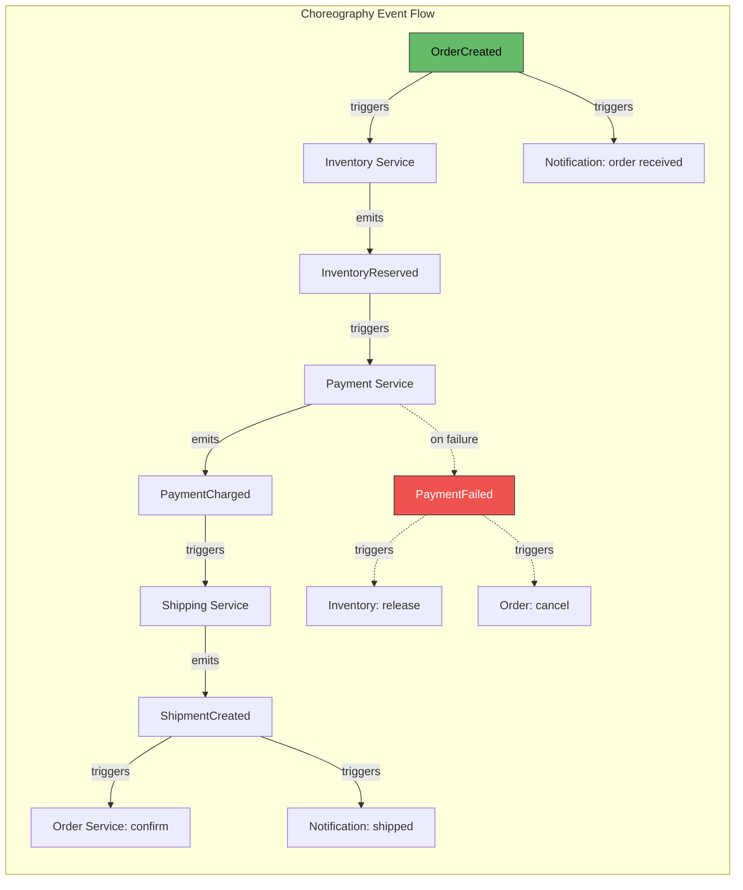
```mermaid
graph LR
    subgraph "Choreography Event Flow"
        E1[OrderCreated] -->|triggers| IS[Inventory Service]
        E1 -->|triggers| NS1[Notification: order received]
        IS -->|emits| E2[InventoryReserved]
        E2 -->|triggers| PS[Payment Service]
        PS -->|emits| E3[PaymentCharged]
        E3 -->|triggers| SS[Shipping Service]
        SS -->|emits| E4[ShipmentCreated]
        E4 -->|triggers| OS[Order Service: confirm]
        E4 -->|triggers| NS2[Notification: shipped]

        PS -.->|on failure| E5[PaymentFailed]
        E5 -.->|triggers| IS2[Inventory: release]
        E5 -.->|triggers| OS2[Order: cancel]
    end

    style E1 fill:#66bb6a,stroke:#333,color:#000
    style E5 fill:#ef5350,stroke:#333,color:#fff
```

**Key challenge:** This workflow is **implicit** — it exists as the sum of all services' event subscriptions. No single place shows the complete flow. This is manageable for simple flows but becomes "event spaghetti" in complex ones.

---

## Part 3: Head-to-Head Comparison

### Comprehensive Comparison

| Aspect | Orchestration | Choreography |
|---|---|---|
| **Control flow** | Explicit — defined in orchestrator code/config | Implicit — emerges from event subscriptions |
| **Coupling** | Orchestrator coupled to all participants | Services decoupled — know only events, not each other |
| **Visibility** | Full workflow visible in one place | Scattered across services; requires event tracing |
| **Error handling** | Centralized — orchestrator manages compensation | Distributed — each service handles its own compensation |
| **Adding a step** | Modify orchestrator | Add a consumer — no existing service changes |
| **Removing a step** | Modify orchestrator | Remove consumer — no existing service changes |
| **Conditional logic** | Natural (if/else in code) | Complex (conditional event routing or enrichment) |
| **Parallel execution** | Explicit fan-out + join | Natural (multiple consumers on same event) |
| **Testing** | Unit test the state machine | Integration tests across event chain |
| **Debugging** | Query orchestrator state | Correlate events across services via correlation ID |
| **Single point of failure** | Orchestrator (must be highly available) | None (fully distributed) |
| **Latency** | Higher (orchestrator hop per step) | Lower (direct event → reaction) |
| **Team autonomy** | Low — teams coordinate through orchestrator | High — teams own their service's event reactions |
| **Complexity (2-3 steps)** | Over-engineered | Simple and elegant |
| **Complexity (10+ steps)** | Manageable | Event spaghetti — extremely hard to reason about |

---

### Visual: When Choreography Breaks Down

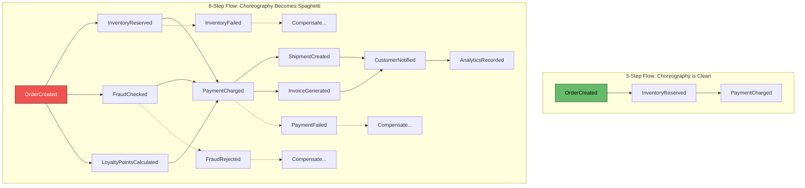
```mermaid
graph TD
    subgraph "3-Step Flow: Choreography is Clean"
        A1[OrderCreated] --> B1[InventoryReserved]
        B1 --> C1[PaymentCharged]
    end

    subgraph "8-Step Flow: Choreography Becomes Spaghetti"
        A2[OrderCreated] --> B2[InventoryReserved]
        A2 --> B3[FraudChecked]
        A2 --> B4[LoyaltyPointsCalculated]
        B2 --> C2[PaymentCharged]
        B3 --> C2
        B4 --> C2
        C2 --> D2[ShipmentCreated]
        C2 --> D3[InvoiceGenerated]
        D2 --> E2[CustomerNotified]
        D3 --> E2
        E2 --> F2[AnalyticsRecorded]
        B2 -.-> X1[InventoryFailed]
        B3 -.-> X2[FraudRejected]
        C2 -.-> X3[PaymentFailed]
        X1 -.-> Y1[Compensate...]
        X2 -.-> Y2[Compensate...]
        X3 -.-> Y3[Compensate...]
    end

    style A1 fill:#66bb6a,stroke:#333,color:#000
    style A2 fill:#ef5350,stroke:#333,color:#fff
```

The 8-step choreography has **implicit join conditions** (PaymentCharged requires both InventoryReserved AND FraudChecked AND LoyaltyPointsCalculated), compensation paths that span multiple services, and no single place to see or debug the full flow.

---

### Hybrid: Orchestration Between, Choreography Within

The most practical architecture for real systems uses **both**:

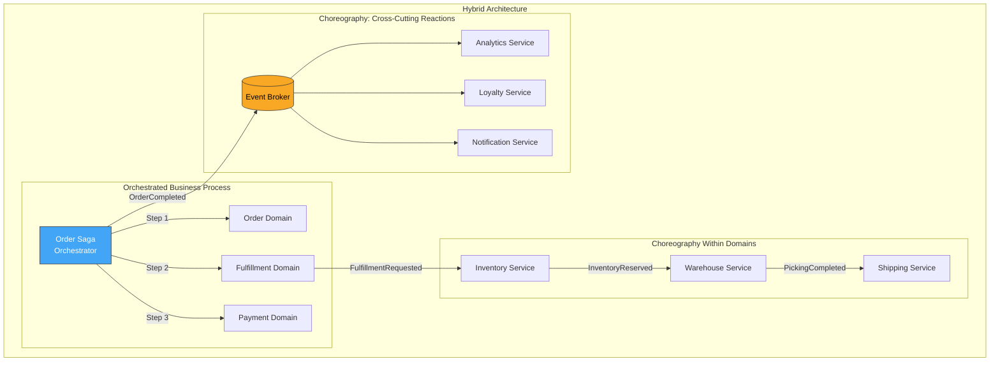
```mermaid
graph TD
    subgraph "Hybrid Architecture"
        subgraph "Orchestrated Business Process"
            ORCH[Order Saga<br/>Orchestrator] -->|Step 1| DOM1[Order Domain]
            ORCH -->|Step 2| DOM2[Fulfillment Domain]
            ORCH -->|Step 3| DOM3[Payment Domain]
        end

        subgraph "Choreography Within Domains"
            DOM2 -->|FulfillmentRequested| INV[Inventory Service]
            INV -->|InventoryReserved| WH[Warehouse Service]
            WH -->|PickingCompleted| SHIP[Shipping Service]
        end

        subgraph "Choreography: Cross-Cutting Reactions"
            BROKER[(Event Broker)]
            ORCH -->|OrderCompleted| BROKER
            BROKER --> ANALYTICS[Analytics Service]
            BROKER --> LOYALTY[Loyalty Service]
            BROKER --> NOTIF[Notification Service]
        end
    end

    style ORCH fill:#42a5f5,stroke:#333,color:#fff
    style BROKER fill:#f9a825,stroke:#333,color:#000
```

| Scope | Pattern | Why |
|---|---|---|
| **Cross-domain business process** (order → payment → shipping) | Orchestration | Complex, needs visibility, conditional logic, compensation |
| **Within a domain** (inventory → warehouse → picking) | Choreography | Tight team ownership, natural event flow, 2-3 steps |
| **Cross-cutting reactions** (notifications, analytics, audit) | Choreography | Fire-and-forget, no coordination needed, add consumers freely |

---

### Communication Styles

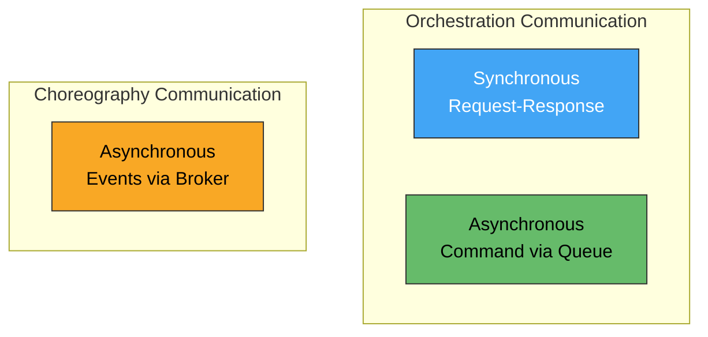
```mermaid
graph TD
    subgraph "Orchestration Communication"
        SYNC[Synchronous<br/>Request-Response]
        ASYNC_CMD[Asynchronous<br/>Command via Queue]
    end

    subgraph "Choreography Communication"
        ASYNC_EVT[Asynchronous<br/>Events via Broker]
    end

    style SYNC fill:#42a5f5,stroke:#333,color:#fff
    style ASYNC_CMD fill:#66bb6a,stroke:#333,color:#000
    style ASYNC_EVT fill:#f9a825,stroke:#333,color:#000
```

| Communication | Used In | Semantics | Coupling |
|---|---|---|---|
| **Sync request-response** (HTTP/gRPC) | Orchestration | "Do this now, tell me the result" | Temporal coupling (caller waits) |
| **Async command** (queue message) | Orchestration | "Do this when you can, send result to my callback queue" | Decoupled in time |
| **Async event** (topic/pub-sub) | Choreography | "This happened — anyone who cares, react" | Fully decoupled |

**Orchestration can be sync or async** — the orchestrator sends commands (either synchronously or via a queue) and waits for responses.

**Choreography is inherently async** — services publish events and have no expectation of who (if anyone) consumes them.

---

### Observability Challenges

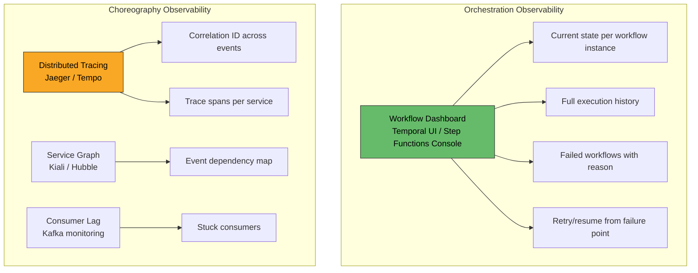
```mermaid
graph TD
    subgraph "Orchestration Observability"
        O_DASH[Workflow Dashboard<br/>Temporal UI / Step Functions Console]
        O_DASH --> O_STATE[Current state per workflow instance]
        O_DASH --> O_HIST[Full execution history]
        O_DASH --> O_FAIL[Failed workflows with reason]
        O_DASH --> O_RETRY[Retry/resume from failure point]
    end

    subgraph "Choreography Observability"
        C_TRACE[Distributed Tracing<br/>Jaeger / Tempo]
        C_TRACE --> C_COR[Correlation ID across events]
        C_TRACE --> C_SPAN[Trace spans per service]
        C_GRAPH[Service Graph<br/>Kiali / Hubble]
        C_GRAPH --> C_DEP[Event dependency map]
        C_LAG[Consumer Lag<br/>Kafka monitoring]
        C_LAG --> C_STUCK[Stuck consumers]
    end

    style O_DASH fill:#66bb6a,stroke:#333,color:#000
    style C_TRACE fill:#f9a825,stroke:#333,color:#000
```

| Observability Need | Orchestration | Choreography |
|---|---|---|
| "Where is order 12345 in the process?" | Query orchestrator: `GET /workflow/12345/state` | Correlate events by orderId across all services 😓 |
| "Why did order 12345 fail?" | Orchestrator log shows exact step + error | Trace correlation ID through Jaeger; check each service |
| "How long does the checkout process take?" | Workflow duration metric (built-in) | Sum trace spans across all services |
| "What's the flow for order processing?" | Read orchestrator code/BPMN diagram | Reconstruct from event subscriptions across all services |
| "Is the process stuck?" | Workflow timeout alerts | Monitor consumer lag + detect missing expected events |

---

### Error Handling Comparison

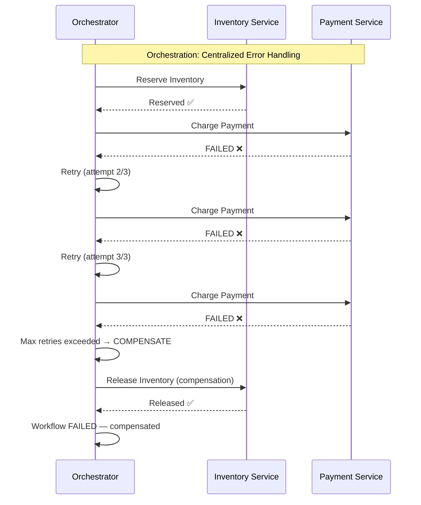
```mermaid
sequenceDiagram
    participant O as Orchestrator
    participant IS as Inventory Service
    participant PS as Payment Service

    Note over O,PS: Orchestration: Centralized Error Handling

    O->>IS: Reserve Inventory
    IS-->>O: Reserved ✅

    O->>PS: Charge Payment
    PS-->>O: FAILED ❌

    O->>O: Retry (attempt 2/3)
    O->>PS: Charge Payment
    PS-->>O: FAILED ❌

    O->>O: Retry (attempt 3/3)
    O->>PS: Charge Payment
    PS-->>O: FAILED ❌

    O->>O: Max retries exceeded → COMPENSATE
    O->>IS: Release Inventory (compensation)
    IS-->>O: Released ✅
    O->>O: Workflow FAILED — compensated
```

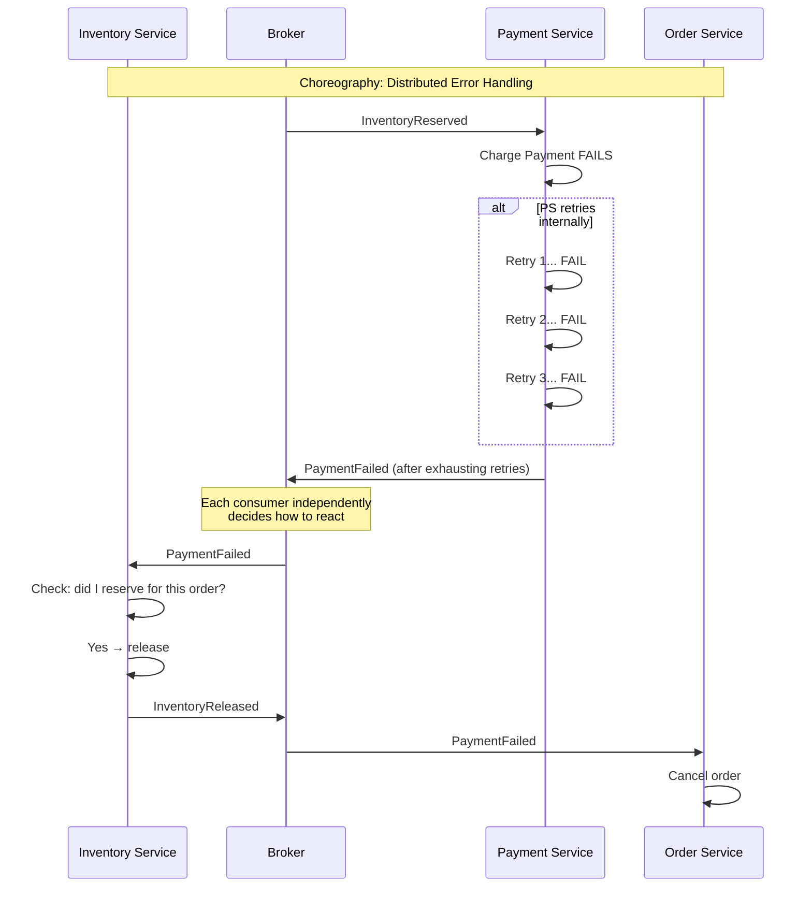
```mermaid
sequenceDiagram
    participant IS as Inventory Service
    participant B as Broker
    participant PS as Payment Service
    participant OS as Order Service

    Note over IS,OS: Choreography: Distributed Error Handling

    B->>PS: InventoryReserved
    PS->>PS: Charge Payment FAILS

    alt PS retries internally
        PS->>PS: Retry 1... FAIL
        PS->>PS: Retry 2... FAIL
        PS->>PS: Retry 3... FAIL
    end

    PS->>B: PaymentFailed (after exhausting retries)

    Note over B: Each consumer independently<br/>decides how to react

    B->>IS: PaymentFailed
    IS->>IS: Check: did I reserve for this order?
    IS->>IS: Yes → release
    IS->>B: InventoryReleased

    B->>OS: PaymentFailed
    OS->>OS: Cancel order
```

| Error Handling Aspect | Orchestration | Choreography |
|---|---|---|
| **Retry logic** | Centralized in orchestrator | Each service retries independently |
| **Compensation ordering** | Orchestrator executes in reverse order | Each service compensates when it sees failure event |
| **Timeout handling** | Orchestrator sets per-step timeouts | Each service must handle its own timeouts |
| **Dead letter handling** | Orchestrator marks workflow as failed → alerts | Per-service DLQ → each service monitors its own |
| **Partial completion visibility** | Orchestrator knows exactly which steps completed | Must reconstruct from event history |
| **Human intervention** | Pause workflow, fix, resume | No standard mechanism — ad hoc per service |

---

### Scaling & Performance

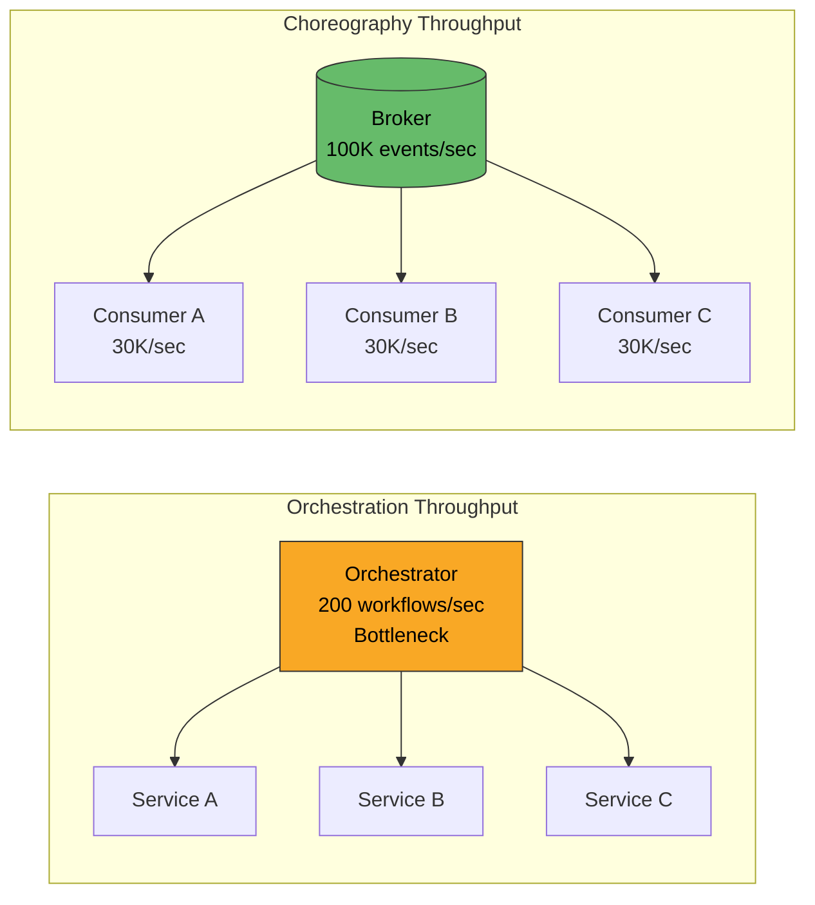
```mermaid
graph LR
    subgraph "Orchestration Throughput"
        O[Orchestrator<br/>200 workflows/sec<br/>Bottleneck] --> S1[Service A]
        O --> S2[Service B]
        O --> S3[Service C]
    end

    subgraph "Choreography Throughput"
        B[(Broker<br/>100K events/sec)] --> C1[Consumer A<br/>30K/sec]
        B --> C2[Consumer B<br/>30K/sec]
        B --> C3[Consumer C<br/>30K/sec]
    end

    style O fill:#f9a825,stroke:#333,color:#000
    style B fill:#66bb6a,stroke:#333,color:#000
```

| Aspect | Orchestration | Choreography |
|---|---|---|
| **Throughput ceiling** | Limited by orchestrator capacity | Limited by broker + consumer capacity |
| **Scaling the coordinator** | Scale orchestrator horizontally (Temporal does this well) | No coordinator to scale |
| **Latency per step** | Extra hop through orchestrator | Direct event → consumer |
| **Backpressure** | Orchestrator can throttle workflow start rate | Consumer lag signals backpressure |
| **Resource cost** | Orchestrator infrastructure (DB, workers) | Broker infrastructure (Kafka cluster) |

---

### Choreography Event Design Best Practices

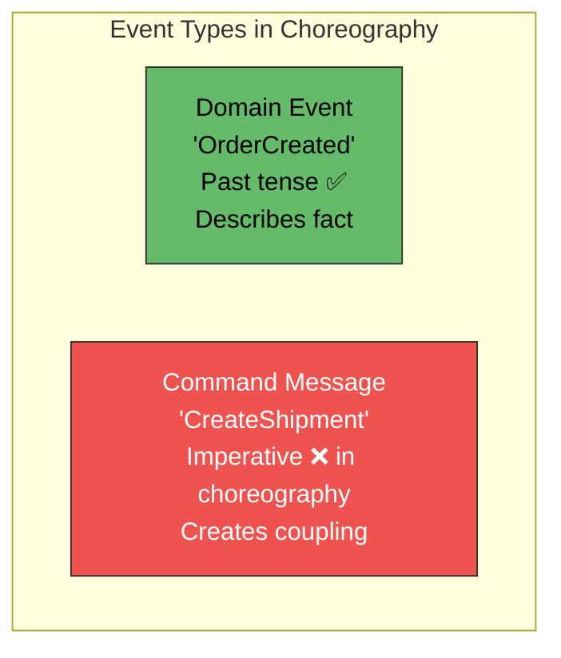
```mermaid
graph TD
    subgraph "Event Types in Choreography"
        DOMAIN[Domain Event<br/>'OrderCreated'<br/>Past tense ✅<br/>Describes fact]
        COMMAND[Command Message<br/>'CreateShipment'<br/>Imperative ❌ in choreography<br/>Creates coupling]
    end

    style DOMAIN fill:#66bb6a,stroke:#333,color:#000
    style COMMAND fill:#ef5350,stroke:#333,color:#fff
```

| Principle | Good (Choreography) | Bad (Hidden Orchestration) |
|---|---|---|
| **Event naming** | `OrderCreated` (fact, past tense) | `CreateShipment` (command, imperative) |
| **Event content** | What happened + relevant data | Instructions for the next service |
| **Producer knowledge** | "I created an order" | "Inventory service should reserve stock" |
| **Consumer responsibility** | "I see an order was created; I'll reserve stock" | "I was told to reserve stock" |

If your "events" are actually commands directed at specific services, you have **orchestration disguised as choreography** — getting the downsides of both.

---

### Anti-Patterns

| Anti-Pattern | Problem | Remedy |
|---|---|---|
| **Orchestrating everything** | Every 2-step interaction goes through a workflow engine | Use choreography for simple reactive flows (notifications, analytics) |
| **Choreographing everything** | 15-step business process with implicit join conditions scattered across services | Use orchestration for complex multi-step processes |
| **Command masquerading as event** | Events like `ProcessPayment` directed at a specific service | Events are facts (`OrderCreated`); commands are requests (`ChargePayment`) |
| **Orchestrator as god service** | Orchestrator contains business logic, validation, transformations | Orchestrator only coordinates; business logic stays in services |
| **Choreography without correlation ID** | Cannot trace a business process across events | Every event carries a `correlationId` from the initiating request |
| **No dead letter handling** | Failed events silently dropped; process stuck | DLQ per consumer (choreography) or workflow failure state (orchestration) |
| **Synchronous orchestration** | Orchestrator blocks on HTTP calls to each service | Use async commands via queues or durable workflow engine |
| **Circular event dependencies** | Service A reacts to Service B's event which reacts to Service A's event → infinite loop | Map event flow graph; break cycles with explicit termination conditions |
| **Choreography without event catalog** | Teams don't know what events exist or who consumes them | Maintain an event catalog: event name, schema, producer, consumers |
| **Ignoring idempotency** | Replayed or duplicated events cause double processing | Every handler is idempotent (dedup by event ID) |

---

### Decision Framework

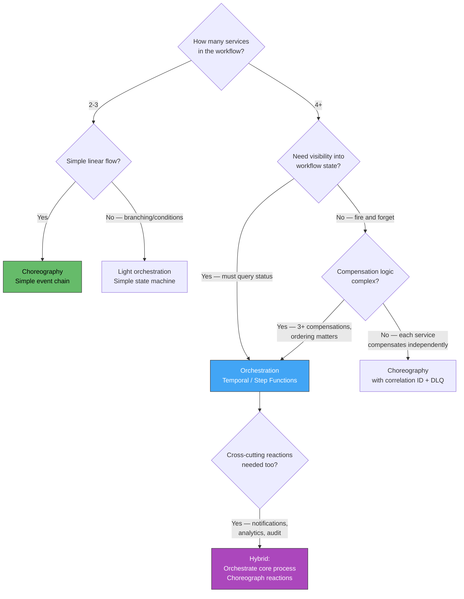
```mermaid
graph TD
    Q1{How many services<br/>in the workflow?} -->|2-3| Q2{Simple linear flow?}
    Q1 -->|4+| Q3{Need visibility into<br/>workflow state?}

    Q2 -->|Yes| CHOREO[Choreography<br/>Simple event chain]
    Q2 -->|No — branching/conditions| ORCH_LIGHT[Light orchestration<br/>Simple state machine]

    Q3 -->|Yes — must query status| ORCH[Orchestration<br/>Temporal / Step Functions]
    Q3 -->|No — fire and forget| Q4{Compensation logic<br/>complex?}

    Q4 -->|Yes — 3+ compensations,<br/>ordering matters| ORCH
    Q4 -->|No — each service<br/>compensates independently| CHOREO_ADV[Choreography<br/>with correlation ID + DLQ]

    ORCH --> Q5{Cross-cutting reactions<br/>needed too?}
    Q5 -->|Yes — notifications,<br/>analytics, audit| HYBRID[Hybrid:<br/>Orchestrate core process<br/>Choreograph reactions]

    style CHOREO fill:#66bb6a,stroke:#333,color:#000
    style ORCH fill:#42a5f5,stroke:#333,color:#fff
    style HYBRID fill:#ab47bc,stroke:#333,color:#fff
```

**Summary rules of thumb:**

| Scenario | Recommended Pattern |
|---|---|
| 2-3 step linear flow | Choreography |
| Fire-and-forget reactions (notifications, analytics) | Choreography |
| Adding consumers to existing events | Choreography |
| 4+ step business transaction with compensation | Orchestration |
| Need to query "where is my order?" | Orchestration |
| Conditional branching (if fraud → reject, else → continue) | Orchestration |
| Cross-domain saga (order → payment → shipping) | Orchestration |
| Within-domain reactions (inventory → warehouse → picking) | Choreography |
| Mix of the above | Hybrid |

---

### Practical Checklist

**Choreography:**
- [ ] Use **domain events** (past tense: `OrderCreated`) — never commands
- [ ] Every event carries a **correlation ID** for distributed tracing
- [ ] Every consumer is **idempotent** (deduplicate by event ID)
- [ ] Maintain an **event catalog** — name, schema, producer, consumers
- [ ] Configure **Dead Letter Queue** per consumer with alerting
- [ ] Map the **event flow graph** — visualize implicit workflows
- [ ] Monitor **consumer lag** — detect stuck processes
- [ ] Test compensation: inject failures and verify each service compensates correctly

**Orchestration:**
- [ ] Orchestrator contains **only coordination logic** — no business rules
- [ ] Persist workflow state after **every step transition**
- [ ] Define **compensations** for every forward step
- [ ] Set **timeouts** per step — prevent indefinitely stuck workflows
- [ ] Make step execution **idempotent** — orchestrator may retry
- [ ] Deploy orchestrator with **high availability** (it's the critical path)
- [ ] Use **async communication** (queues) between orchestrator and services when possible
- [ ] Monitor: workflow duration, step failure rate, stuck workflows, compensation rate

**Hybrid:**
- [ ] Orchestrate the **core business process** (critical path)
- [ ] Choreograph **cross-cutting reactions** (analytics, notifications, audit)
- [ ] Publish **workflow completion events** for choreographed consumers to react to
- [ ] Document which flows are orchestrated vs. choreographed

---

### Recommendation

**Use the hybrid approach for most production systems.** Orchestrate the **critical business process** (order placement, payment, fulfillment) using a durable workflow engine like **Temporal.io** — it gives you explicit flow definition, crash recovery, retry management, compensation, and query-able workflow state. For **cross-cutting concerns** (notifications, analytics, loyalty points, audit logging), use **choreography** — publish events from the orchestrator and let independent consumers react. Within a single bounded context where the team owns all services, **choreography** for 2-3 step flows is simpler and more decoupled. Never choreograph a 6+ step process with complex compensation — the implicit flow becomes unmaintainable. Never orchestrate simple fan-out reactions — that's what pub/sub events are for.

---

### Next Steps to Explore

1. **Temporal.io deep-dive** — writing durable workflows as code, activity patterns, versioning
2. **Event catalog / AsyncAPI** — documenting choreographed event flows as contracts
3. **Saga pattern** — orchestrated vs. choreographed sagas with compensation
4. **Process mining** — reconstructing and analyzing choreographed flows from event logs
5. **BPMN vs. code-based orchestration** — Camunda/Zeebe vs. Temporal trade-offs