## Common Challenges in Microservices Development

### Context & Assumptions

Microservices offer significant advantages — independent deployability, team autonomy, technology flexibility, and targeted scaling. But they trade **monolithic complexity** for **distributed systems complexity**. The challenges below are not theoretical — they are the recurring pain points encountered by teams across organizations of all sizes, from startups to enterprises. Understanding them upfront is the difference between a successful microservices adoption and an expensive distributed monolith.

---

### Challenge Map

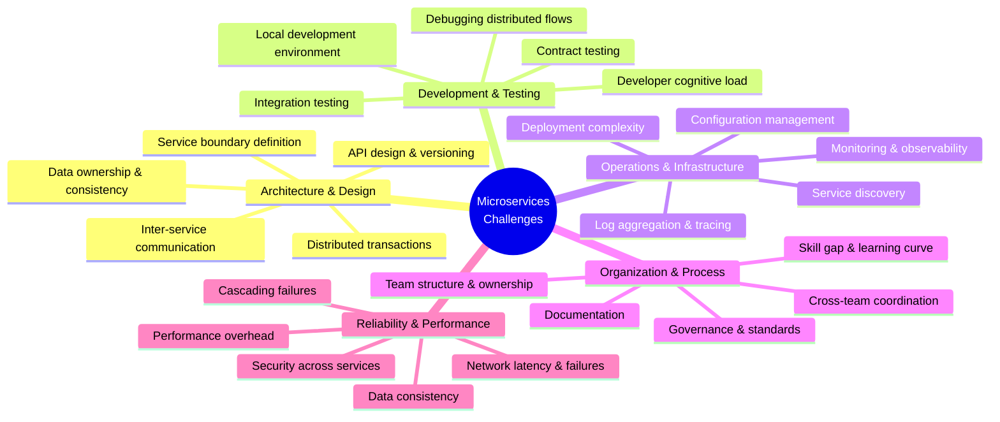

---

## 1. Service Boundary Definition

**The single hardest challenge** — getting boundaries wrong creates a distributed monolith.

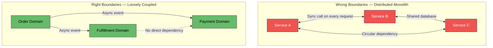

| Symptom | Root Cause | Remedy |
|---|---|---|
| Every feature requires changes in 3+ services | Boundaries cut through business capabilities | Realign to bounded contexts (DDD) |
| Services can't be deployed independently | Tight coupling via shared DB or sync chains | Database per service; async communication |
| Circular dependencies between services | Functionality wrongly split | Merge services or introduce an event-based decoupling layer |
| "Nano-services" — too many tiny services | Over-decomposition | Merge related services; one service per bounded context, not per entity |

**Mitigation:** Use **Domain-Driven Design** (DDD) — Event Storming workshops to discover bounded contexts before writing code. Start with a modular monolith and extract services only when boundaries are validated.

---

## 2. Data Management & Consistency

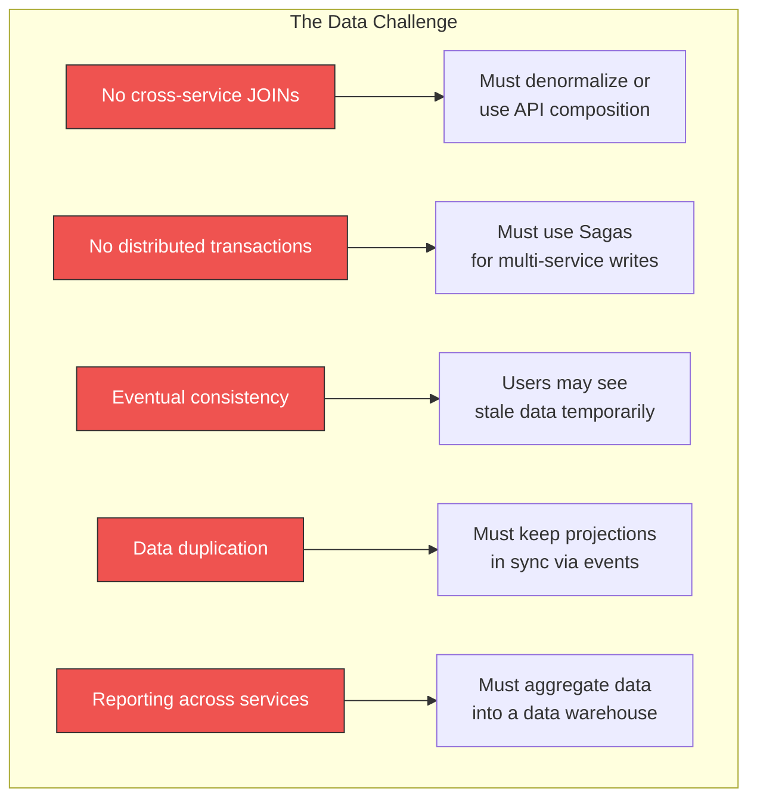

| Challenge | Impact | Pattern to Address |
|---|---|---|
| No cross-service joins | Cannot query across boundaries in one SQL statement | API Composition, CQRS read models |
| No ACID transactions across services | Cannot atomically update multiple services | Saga pattern (choreography or orchestration) |
| Eventual consistency | User writes data, reads stale value from replica | Read-your-writes consistency, UI optimistic updates |
| Data duplication across services | Same product info in Order, Search, and Recommendation services | Event-Carried State Transfer, Outbox pattern |
| Cross-service reporting | Business needs a report joining orders + users + products | Data warehouse / analytics pipeline (ETL/CDC) |

---

## 3. Local Development Environment

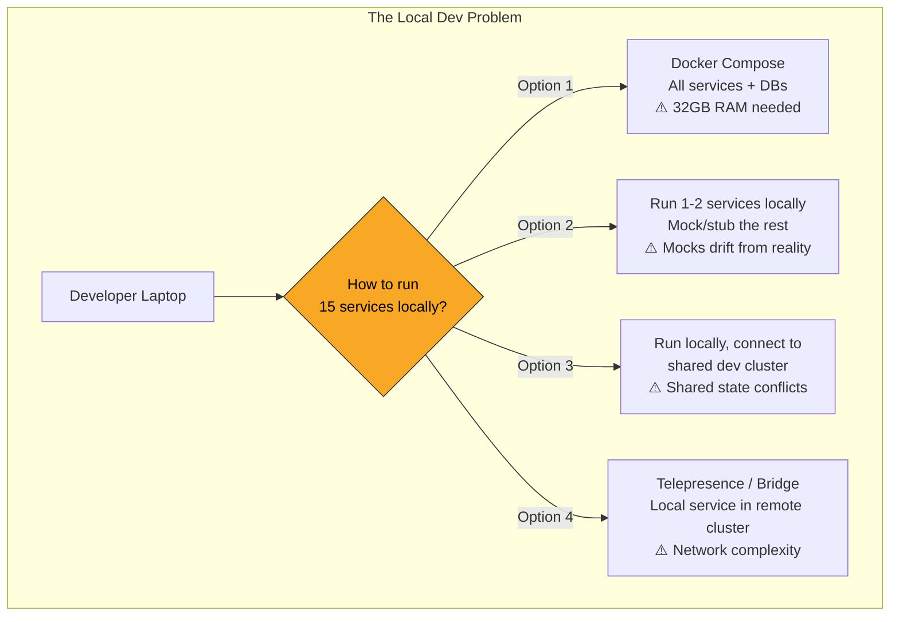

| Approach | Fidelity | Resource Cost | Isolation | Setup Complexity |
|---|---|---|---|---|
| **Full Docker Compose** | Highest | Very High (RAM/CPU) | Full | High (maintain compose files) |
| **Local + mocks/stubs** | Low-Medium | Low | Full | Medium (mocks drift) |
| **Local + shared dev cluster** | High | Low locally | Low (shared state) | Medium |
| **Telepresence / Bridge to K8s** | High | Low locally | Medium | High |
| **Dev containers (Codespaces/Gitpod)** | High | Cloud-hosted | Full | Medium |

**Practical advice:** Most teams use **local service + contract-tested mocks/stubs** for daily development, with **integration tests in CI** running against a full environment.

---

## 4. Testing Complexity

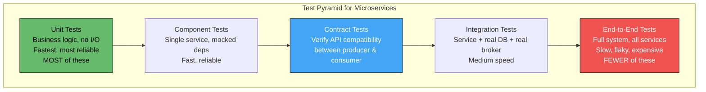

| Testing Challenge | Why It's Hard | Mitigation |
|---|---|---|
| **End-to-end tests are slow and flaky** | 15 services + DBs + brokers; network timeouts, test data management | Minimize E2E; invest in contract tests |
| **Contract drift** | Service A changes its API; Service B breaks in production | Pact / Spring Cloud Contract — consumer-driven contract testing |
| **Test data management** | Each service has its own DB; setting up test state across services | Fixture services, test data factories, database-per-test |
| **Non-deterministic failures** | Network latency, message ordering, race conditions | Retry logic in tests; deterministic test environments |
| **Testing async workflows** | Event-driven flows don't have synchronous assertion points | Await on expected events with timeout; Testcontainers for brokers |
| **Performance testing** | Must test the distributed system, not individual services | k6/Gatling hitting the API gateway; profile service-to-service calls |

---

## 5. Debugging & Observability

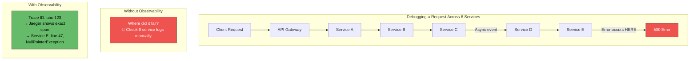

| Observability Pillar | Challenge | Required Tooling |
|---|---|---|
| **Distributed tracing** | Following a request across 6+ services | OpenTelemetry + Jaeger/Tempo |
| **Log aggregation** | Logs scattered across 50+ containers | Structured logging + Loki/ELK + correlation IDs |
| **Metrics** | Understanding which service is the bottleneck | Prometheus + Grafana, RED metrics per service |
| **Service dependency map** | Knowing who calls whom | Kiali, Hubble, or auto-generated from traces |
| **Alerting** | Knowing something is wrong before users report it | SLO-based alerts, error budget policies |

**Non-negotiable:** Every request must carry a **correlation ID / trace ID** propagated through all service-to-service calls and event messages. Without it, debugging distributed systems is nearly impossible.

---

## 6. Network Reliability & Latency

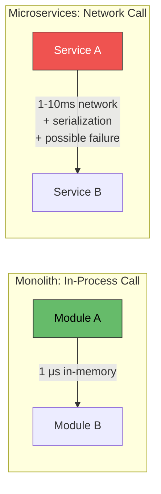

| Challenge | Impact | Mitigation |
|---|---|---|
| **Latency accumulation** | 5 sequential service calls × 10ms = 50ms overhead | Parallel calls, caching, self-containment pattern |
| **Network partitions** | Service A can't reach Service B | Circuit breaker, bulkhead, retry with backoff |
| **Serialization overhead** | JSON/Protobuf encoding/decoding per call | Protobuf/gRPC (binary, fast); avoid over-fetching |
| **DNS resolution lag** | Service discovery adds milliseconds | Cache DNS, use connection pooling |
| **Partial failures** | 1 of 5 downstream services fails — what should you return? | Graceful degradation; return partial response with degraded flag |

**The Fallacies of Distributed Computing** (Peter Deutsch) are real:
1. The network is NOT reliable
2. Latency is NOT zero
3. Bandwidth is NOT infinite
4. The network is NOT secure
5. Topology does NOT stay constant
6. There is NOT one administrator
7. Transport cost is NOT zero
8. The network is NOT homogeneous

---

## 7. Cascading Failures

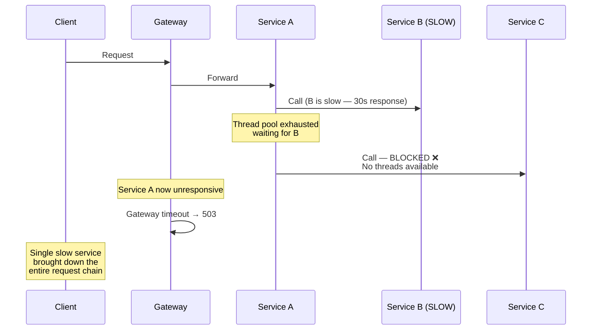

| Pattern | What It Prevents |
|---|---|
| **Circuit Breaker** | Stops calling a failing service; fails fast |
| **Bulkhead** | Isolates thread/connection pools per dependency |
| **Timeout** | Bounds how long any call can take |
| **Retry with backoff** | Retries transient failures without flooding |
| **Load shedding** | Rejects excess traffic to protect the service |
| **Graceful degradation** | Returns partial/cached response instead of error |

---

## 8. Deployment & CI/CD Complexity

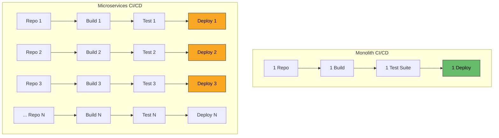

| Challenge | Impact | Mitigation |
|---|---|---|
| **N pipelines to maintain** | CI/CD templates diverge; inconsistent practices | Shared pipeline templates (reusable GitHub Actions / GitLab CI) |
| **Deployment ordering** | Service B needs Service A's new API first | Backward-compatible API changes; expand-contract deployment |
| **Environment sprawl** | Dev, staging, prod × N services × M config | GitOps (ArgoCD/Flux), External Configuration pattern |
| **Canary / Blue-Green per service** | Each service needs independent traffic shifting | Service mesh (Istio VirtualService) or feature flags |
| **Rollback complexity** | Rolling back one service may require rolling back others | Independent deployability; backward-compatible APIs |
| **Container image management** | Hundreds of images, tags, vulnerabilities to track | Image registry with scanning (Trivy, Snyk) |

---

## 9. Security

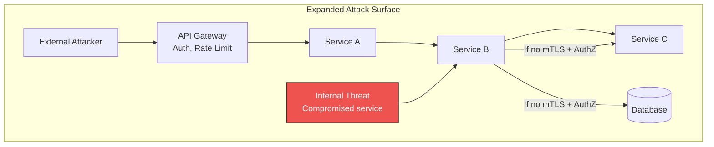

| Security Challenge | Why It's Harder | Mitigation |
|---|---|---|
| **Larger attack surface** | N services × M endpoints vs. 1 monolith | API Gateway + service mesh mTLS |
| **Service-to-service auth** | Must authenticate and authorize every internal call | mTLS (service mesh), JWT propagation, SPIFFE identity |
| **Secret management** | N services × M environments = many secrets | HashiCorp Vault, AWS Secrets Manager, sealed secrets |
| **Network segmentation** | All services on same network can reach each other | Kubernetes Network Policies, zero-trust (default deny) |
| **Vulnerability management** | N container images to scan and patch | Automated scanning in CI (Trivy), base image updates |
| **Data in transit** | Service-to-service calls may be unencrypted | mTLS everywhere (service mesh handles automatically) |
| **Dependency chain trust** | Compromised upstream service sends malicious data | Input validation at every service boundary |

---

## 10. Organizational & Team Challenges

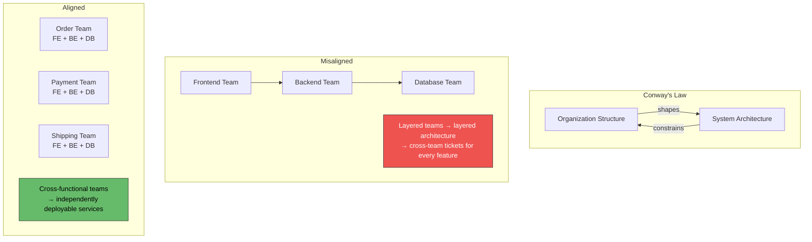

| Challenge | Impact | Mitigation |
|---|---|---|
| **Conway's Law misalignment** | Team structure doesn't match service boundaries → coordination overhead | Align teams to bounded contexts (Team Topologies) |
| **Cognitive load** | Developers must understand distributed systems, messaging, eventual consistency | Training, inner source, platform team abstracts complexity |
| **Cross-team coordination** | Feature spans 3 services owned by 3 teams → meetings, tickets, delays | API contracts + contract tests; async communication reduces coordination |
| **Ownership ambiguity** | "Who owns the service between Order and Payment?" | Clear service catalog with ownership; on-call per service |
| **Skill gaps** | Teams unfamiliar with Docker, Kubernetes, messaging, distributed tracing | Platform team provides golden paths; internal training programs |
| **Governance without bureaucracy** | Too few standards → chaos; too many → waterfall in disguise | Architecture Decision Records (ADRs); lightweight review boards |

---

## 11. Performance Overhead

| Source of Overhead | Monolith Cost | Microservices Cost |
|---|---|---|
| **Function call** | ~1 μs (in-memory) | ~1-10ms (network + serialization) |
| **Data join** | SQL JOIN (microseconds) | API composition (N+1 network calls) |
| **Transaction** | Single DB transaction | Saga (multiple steps, eventual consistency) |
| **Startup time** | One process | N processes (each with own startup) |
| **Memory** | Shared process memory | N × JVM/runtime overhead + sidecar proxies |
| **CPU** | No (de)serialization | JSON/Protobuf encoding per call |
| **Infrastructure** | 1 load balancer, 1 DB | N load balancers, N databases, message broker, service mesh |

**Mitigation:** gRPC (binary, streaming), local caching, self-containment pattern, async communication, connection pooling, payload optimization.

---

## 12. API Versioning & Backward Compatibility

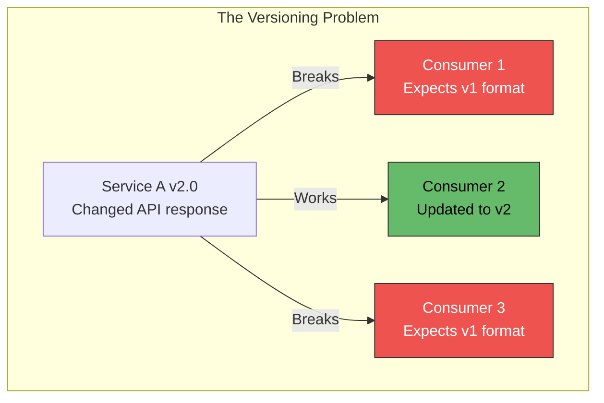

| Strategy | Approach | Trade-off |
|---|---|---|
| **URL versioning** | `/api/v1/orders`, `/api/v2/orders` | Explicit; multiple versions to maintain |
| **Header versioning** | `Accept: application/vnd.api.v2+json` | Cleaner URLs; harder to test in browser |
| **Expand-contract** | Add new fields (expand), deprecate old (contract) | No breaking change; consumers migrate gradually |
| **Consumer-driven contracts** | Pact tests verify each consumer's expectations | CI catches breaking changes before deploy |
| **Schema registry** | Avro/Protobuf with backward compatibility enforcement | Events versioned at schema level |

---

## Challenge Severity by Project Phase

```mermaid
gantt
    title Challenge Intensity Over Project Lifecycle
    dateFormat X
    axisFormat %s

    section Architecture
    Service boundaries       :crit, 0, 30
    Data ownership          :crit, 0, 25

    section Development
    Local dev environment    :active, 5, 35
    Testing complexity       :active, 10, 40
    Debugging               :active, 15, 40

    section Operations
    Deployment / CI/CD       :20, 40
    Monitoring / Observability :25, 40
    Security                :25, 40

    section Scale
    Performance tuning       :30, 40
    Cascading failures       :30, 40
    Data consistency         :crit, 10, 40

    section Organization
    Team alignment           :crit, 0, 40
    Governance              :15, 40
```

| Phase | Top 3 Challenges |
|---|---|
| **Starting out (0-3 months)** | Service boundaries, team alignment, local dev environment |
| **Building (3-12 months)** | Testing, data consistency, API versioning |
| **Operating (12+ months)** | Observability, cascading failures, performance, security |
| **Scaling (mature)** | Data partitioning, cost optimization, cross-team coordination |

---

### Mitigation Summary

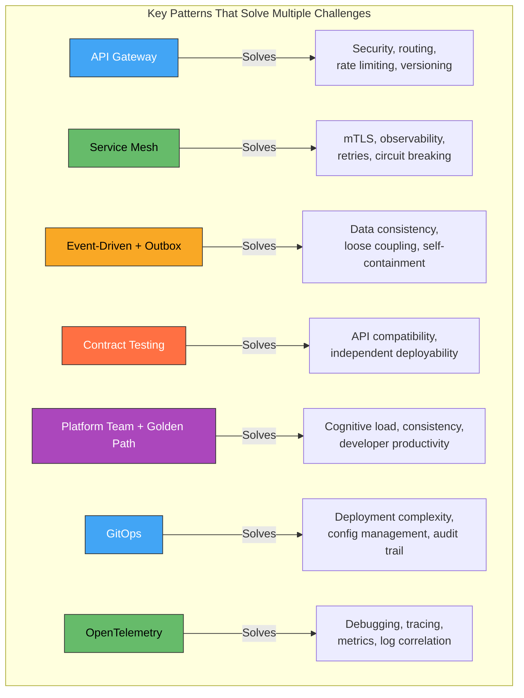

---

### Anti-Patterns That Create Challenges

| Anti-Pattern | Creates Challenge | What to Do Instead |
|---|---|---|
| **Microservices from day one** | All challenges at once, no validated boundaries | Start with modular monolith; extract when boundaries are proven |
| **Shared database** | Coupling, schema change coordination, no independent deploy | Database per service + event-driven data sharing |
| **Synchronous everything** | Cascading failures, latency accumulation, tight coupling | Async communication for cross-service; sync only when real-time needed |
| **No platform team** | Every team reinvents infrastructure, logging, CI/CD | Platform team provides templates, libraries, tooling |
| **Copy-paste infrastructure** | Drift between services, inconsistent operations | Shared Helm charts, CI templates, Terraform modules |
| **"We'll add observability later"** | First production incident is undebuggable | OpenTelemetry from day one — instrument before you deploy |
| **Ignoring Conway's Law** | Architecture doesn't match org → friction at every boundary | Align team topology to service boundaries |

---

### Practical Checklist: Addressing Challenges Upfront

**Before writing code:**
- [ ] Run **Event Storming** workshops to discover bounded contexts → service boundaries
- [ ] Align **team topology** to service boundaries (Conway's Law)
- [ ] Define **communication standards** — sync (gRPC) vs. async (Kafka) and when to use each
- [ ] Set up **observability from day one** — OpenTelemetry, structured logging, correlation IDs

**During development:**
- [ ] Establish **contract testing** (Pact) between producer and consumer services
- [ ] Provide a **local development solution** — Docker Compose or mocks with contract verification
- [ ] Build **shared CI/CD templates** — single source of truth for build/test/deploy
- [ ] Implement **resilience patterns** (circuit breaker, bulkhead, timeout) in every service

**For operations:**
- [ ] Deploy **API gateway** for north-south traffic management
- [ ] Deploy **service mesh** (or at least mTLS) for east-west security
- [ ] Implement **GitOps** for deployment and configuration management
- [ ] Set up **SLO-based alerting** — alert on user impact, not just resource metrics

**For the organization:**
- [ ] Create a **platform team** that provides golden paths and abstracts infrastructure complexity
- [ ] Maintain a **service catalog** — owner, SLA, API docs, dependencies
- [ ] Use **Architecture Decision Records** (ADRs) — document decisions, not just code
- [ ] Plan for **gradual adoption** — don't microservices everything at once

---

### Recommendation

The biggest lesson across failed microservices projects: **most challenges stem from adopting microservices before the organization is ready** — wrong boundaries, no observability, no platform team, no testing strategy. Start with a **modular monolith** where service boundaries are module boundaries. Extract into true microservices only when you have: (1) validated bounded contexts, (2) team topology aligned to those boundaries, (3) CI/CD and observability infrastructure in place, and (4) a platform team to absorb distributed systems complexity. The technical challenges (data consistency, testing, debugging) are solvable with established patterns — the organizational challenges (team alignment, cognitive load, governance) are where most projects fail.

---

### Next Steps to Explore

1. **Modular monolith as a starting point** — boundaries without distributed complexity
2. **Team Topologies** — aligning organization structure to microservice architecture
3. **Platform engineering** — building the internal developer platform that makes microservices manageable
4. **Architecture Decision Records (ADRs)** — lightweight governance that scales
5. **Migration readiness assessment** — evaluating whether your organization should adopt microservices