## Service Security & Encryption in Microservices

### Context & Assumptions

In a monolith, security is enforced at a single perimeter — one authentication boundary, one database connection, one network segment. In microservices, the **attack surface expands exponentially** — every service is a potential entry point, every service-to-service call traverses the network, and every database is an independent target. Security must shift from **perimeter-based** to **zero-trust** — every call is authenticated, authorized, and encrypted, regardless of whether it originates from inside or outside the cluster.

---

### Threat Model: Microservices Attack Surface

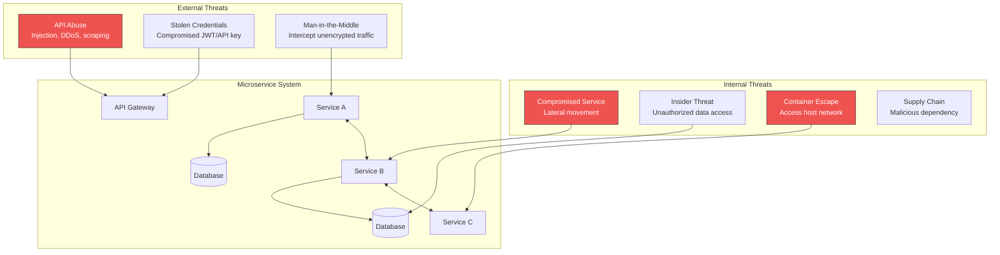

---

### Security Layers

```mermaid
graph TD
    subgraph "Defense in Depth"
        L1[Layer 1: Edge Security<br/>WAF, CDN, DDoS protection, rate limiting]
        L2[Layer 2: API Gateway<br/>Authentication, API key validation, throttling]
        L3[Layer 3: Transport Security<br/>mTLS between all services, encrypted in transit]
        L4[Layer 4: Service-Level AuthZ<br/>Authorization per endpoint, RBAC/ABAC]
        L5[Layer 5: Data Security<br/>Encryption at rest, field-level encryption, masking]
        L6[Layer 6: Runtime Security<br/>Container security, network policies, secret management]
        L7[Layer 7: Audit & Detection<br/>Logging, anomaly detection, SIEM]
    end

    L1 --> L2 --> L3 --> L4 --> L5 --> L6 --> L7

    style L1 fill:#ef5350,stroke:#333,color:#fff
    style L3 fill:#42a5f5,stroke:#333,color:#fff
    style L5 fill:#66bb6a,stroke:#333,color:#000
    style L7 fill:#ab47bc,stroke:#333,color:#fff
```

---

## Part 1: Authentication (Who Are You?)

### External Authentication (North-South)

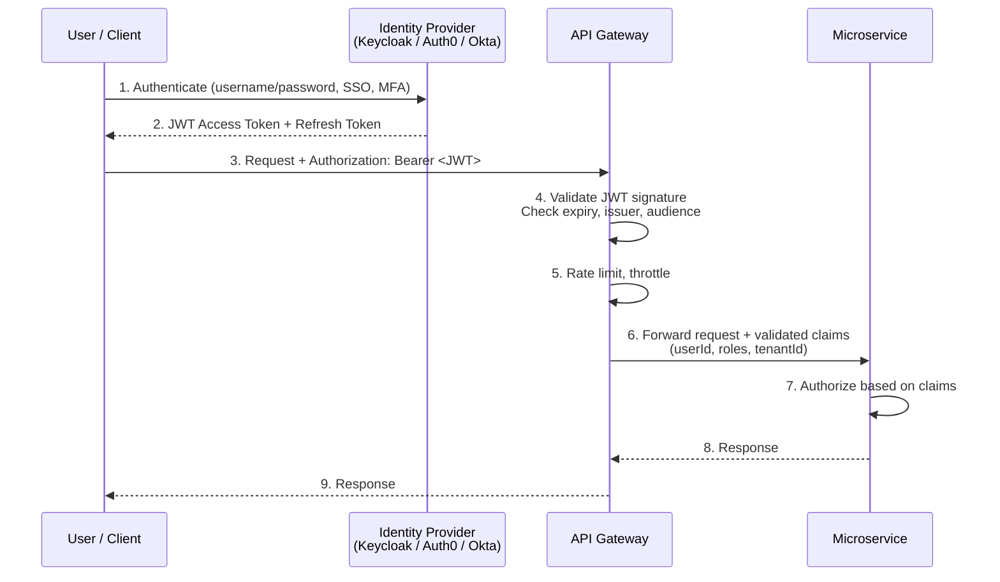

| Authentication Method | Use Case | Token Type | Best For |
|---|---|---|---|
| **OAuth 2.0 + OIDC** | User authentication, SSO | JWT (access + ID token) | Web/mobile apps, SPA |
| **API Key** | Machine-to-machine (partner APIs) | Opaque key | Third-party integrations |
| **Client Credentials (OAuth)** | Service-to-service (external) | JWT | Backend system integration |
| **mTLS Client Certificate** | High-security machine auth | X.509 cert | Financial, government, infrastructure |
| **SAML 2.0** | Enterprise SSO | XML assertion | Legacy enterprise IdP |

---

### JWT Structure & Validation

```mermaid
graph LR
    subgraph "JWT Token"
        HEADER["Header<br/>&#123;alg: RS256, typ: JWT&#125;"]
        PAYLOAD["Payload (Claims)<br/>{sub: user-123,<br/>roles: [admin],<br/>tenantId: acme,<br/>exp: 1713484800,<br/>iss: auth.example.com,<br/>aud: order-service}"]
        SIG["Signature<br/>RS256(header.payload, privateKey)"]
    end

    HEADER --> PAYLOAD --> SIG

    style HEADER fill:#42a5f5,stroke:#333,color:#fff
    style PAYLOAD fill:#66bb6a,stroke:#333,color:#000
    style SIG fill:#f9a825,stroke:#333,color:#000
```

**Validation checklist (every service or gateway must verify):**

| Check | What | Why |
|---|---|---|
| **Signature** | Verify with IdP's public key (JWKS) | Prevents token forgery |
| **Expiry (`exp`)** | Token not expired | Limits window of stolen token use |
| **Issuer (`iss`)** | Matches expected IdP URL | Prevents cross-IdP token injection |
| **Audience (`aud`)** | Matches this service or API | Prevents token reuse across services |
| **Not Before (`nbf`)** | Token is active | Prevents premature use |
| **Custom claims** | Roles, permissions, tenantId | Drives authorization decisions |

---

### Internal Authentication (East-West): mTLS

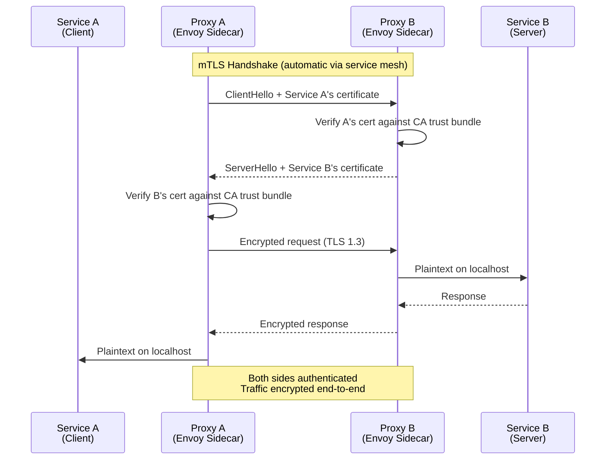

**mTLS vs. one-way TLS:**

| Aspect | One-Way TLS (HTTPS) | Mutual TLS (mTLS) |
|---|---|---|
| **Server authenticated** | ✅ Yes | ✅ Yes |
| **Client authenticated** | ❌ No (client anonymous) | ✅ Yes (client presents cert) |
| **Traffic encrypted** | ✅ Yes | ✅ Yes |
| **Identity verified** | Server only | Both client and server |
| **Use case** | Browser → server | Service → service |

---

### SPIFFE Identity Framework

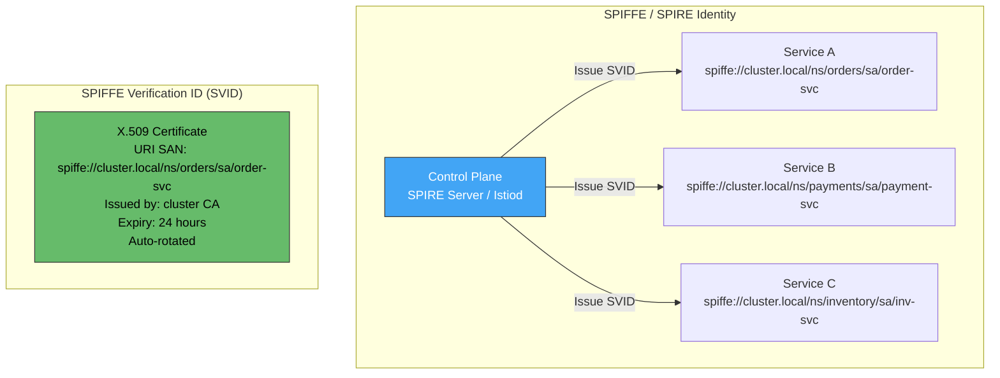

| SPIFFE Benefit | Description |
|---|---|
| **Workload identity** | Identity based on what the service IS, not where it runs |
| **No static credentials** | Certs are short-lived (hours), auto-rotated |
| **Platform-agnostic** | Works across Kubernetes, VMs, bare metal |
| **Attestation** | SPIRE verifies the workload is genuine before issuing identity |
| **Federation** | Trust between different clusters / organizations |

---

## Part 2: Authorization (What Can You Do?)

### Authorization Models

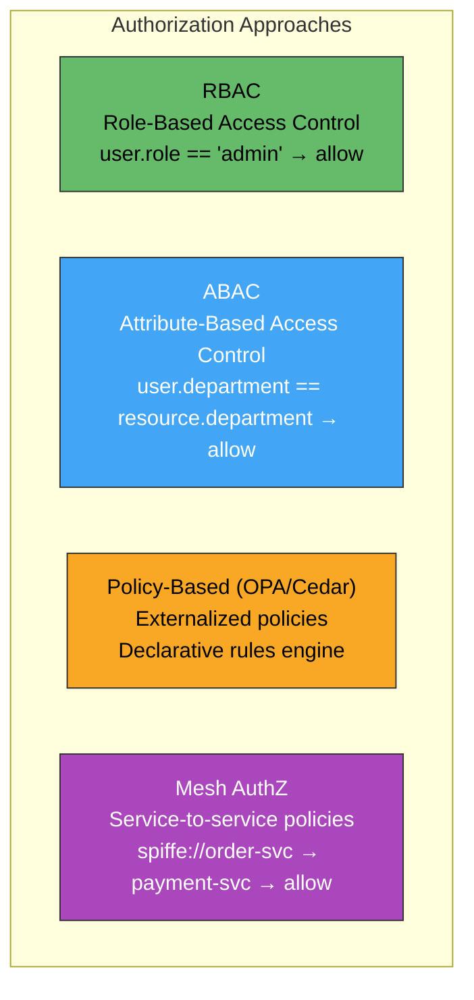

| Model | Granularity | Complexity | Best For |
|---|---|---|---|
| **RBAC** | Coarse (role → permissions) | Low | Simple systems, clear role hierarchy |
| **ABAC** | Fine (attributes of user + resource + context) | Medium | Multi-tenant, data-level access |
| **Policy-Based (OPA)** | Very fine (arbitrary logic) | High | Complex rules, regulatory compliance |
| **Mesh AuthZ** | Service-level (which service can call which) | Low | Zero-trust service-to-service |

---

### Authorization Enforcement Points

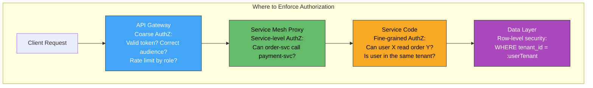

| Enforcement Point | Checks | Example |
|---|---|---|
| **API Gateway** | Token valid? Audience correct? Required scopes present? | Reject expired tokens before reaching any service |
| **Service Mesh** | Can this service identity call that service? | `order-svc` → `payment-svc` ✅; `analytics-svc` → `payment-svc` ❌ |
| **Application Code** | Can this user perform this action on this resource? | User 123 can read their own orders but not user 456's |
| **Data Layer** | Row/column filtering based on caller identity | PostgreSQL RLS: `WHERE tenant_id = current_setting('app.tenant')` |

---

### Open Policy Agent (OPA) — Externalized Authorization

```mermaid
graph TD
    subgraph "OPA Authorization Flow"
        SVC[Service] -->|"Is user X allowed to<br/>DELETE /orders/123?"| OPA[OPA Sidecar<br/>/ External Server]
        OPA -->|Evaluate Rego policy| POLICY[(Policy Bundle<br/>Rego rules)]
        OPA -->|Check data| DATA[(External Data<br/>User roles, resource ownership)]
        OPA -->>|"allow: true or false + reason"| SVC
    end

    subgraph "Policy Management"
        GIT[Policy Git Repo] -->|Bundle build + push| BUNDLE[OPA Bundle Server]
        BUNDLE -->|Pull policies| OPA
    end

    style OPA fill:#42a5f5,stroke:#333,color:#fff
    style POLICY fill:#66bb6a,stroke:#333,color:#000
```

| OPA Benefit | Description |
|---|---|
| **Decoupled from code** | Policy changes without redeploying services |
| **Uniform across languages** | Same policy engine for Go, Java, Node.js, Python |
| **Testable policies** | Rego policies have unit tests |
| **Audit trail** | Every decision logged with input + result |
| **Used at every layer** | API gateway (Kong), Kubernetes admission, service mesh (Envoy), application |

---

### Service Mesh Authorization (Istio Example)

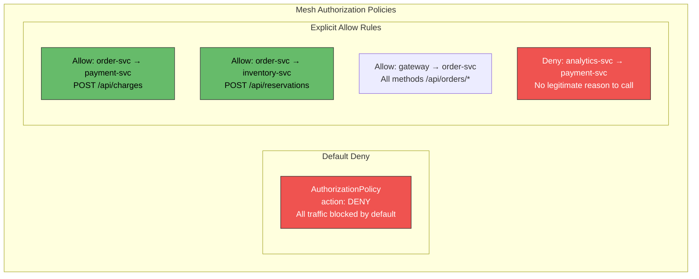

```yaml
# Istio AuthorizationPolicy — default deny all
apiVersion: security.istio.io/v1
kind: AuthorizationPolicy
metadata:
  name: deny-all
  namespace: production
spec:
  {}  # Empty spec = deny all traffic in namespace

---
# Allow order-service to call payment-service
apiVersion: security.istio.io/v1
kind: AuthorizationPolicy
metadata:
  name: allow-order-to-payment
  namespace: production
spec:
  selector:
    matchLabels:
      app: payment-service
  action: ALLOW
  rules:
  - from:
    - source:
        principals: ["cluster.local/ns/production/sa/order-service"]
    to:
    - operation:
        methods: ["POST"]
        paths: ["/api/charges/*"]
```

---

## Part 3: Encryption

### Encryption Scope

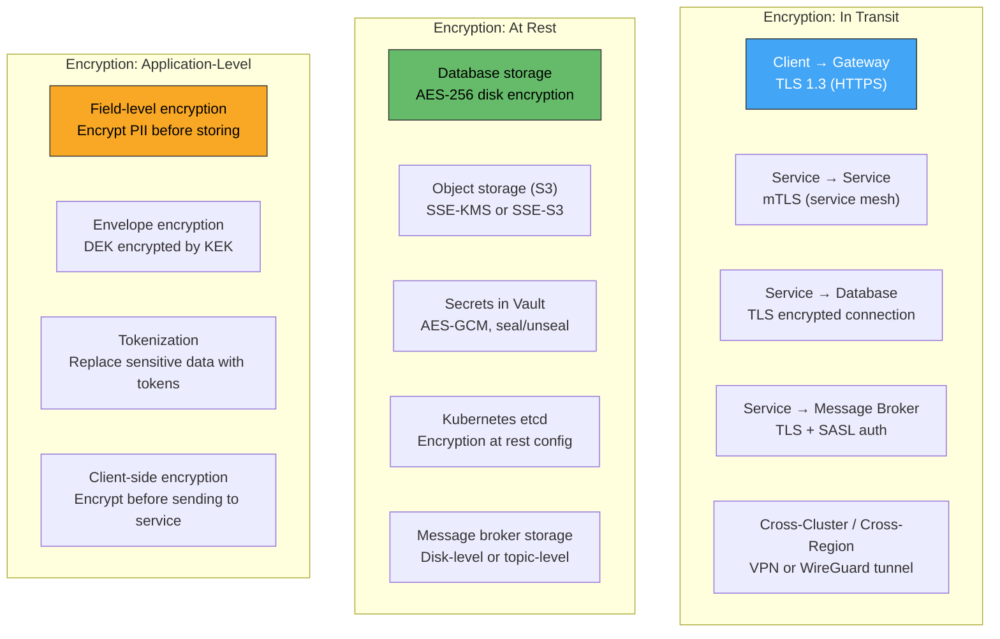

---

### In-Transit Encryption Architecture

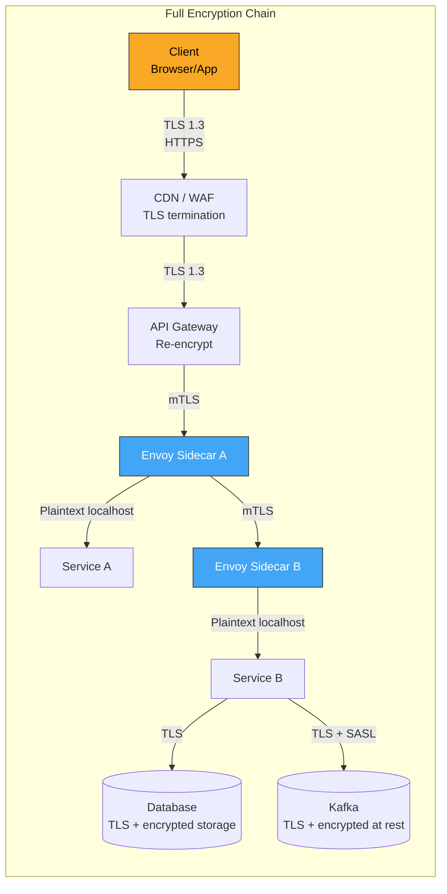

**No plaintext anywhere on the wire** — even between pods in the same Kubernetes node, traffic is encrypted via mTLS through the sidecar proxies.

---

### TLS Configuration Best Practices

| Setting | Recommended | Why |
|---|---|---|
| **Minimum TLS version** | TLS 1.3 (TLS 1.2 minimum) | TLS 1.0/1.1 have known vulnerabilities |
| **Cipher suites** | TLS_AES_256_GCM_SHA384, TLS_CHACHA20_POLY1305 | Strong AEAD ciphers only |
| **Certificate rotation** | Every 24h (mesh-managed) or 90 days (manual) | Short-lived certs reduce exposure window |
| **HSTS** | `Strict-Transport-Security: max-age=31536000` | Prevents TLS downgrade attacks |
| **Certificate pinning** | For mobile apps only (with rotation plan) | Prevents MiTM; risky if cert rotation is mishandled |
| **OCSP stapling** | Enable on public-facing endpoints | Faster cert validation without hitting CA |

---

### At-Rest Encryption

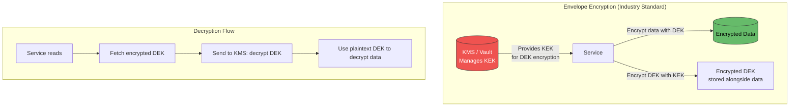

| Encryption Layer | Who Manages | Scope | Example |
|---|---|---|---|
| **Disk/Volume encryption** | Infrastructure / cloud | Entire disk | AWS EBS encryption, dm-crypt |
| **Database TDE** | Database engine | All data in DB | PostgreSQL TDE, SQL Server TDE |
| **Table/Column encryption** | Application | Specific sensitive fields | Encrypt SSN, credit card before INSERT |
| **Envelope encryption** | Application + KMS | Granular, key-per-record | AWS KMS + data key per customer |
| **Tokenization** | Token vault | Replace data with token | Credit card → token (PCI DSS compliance) |

---

### Field-Level Encryption for PII

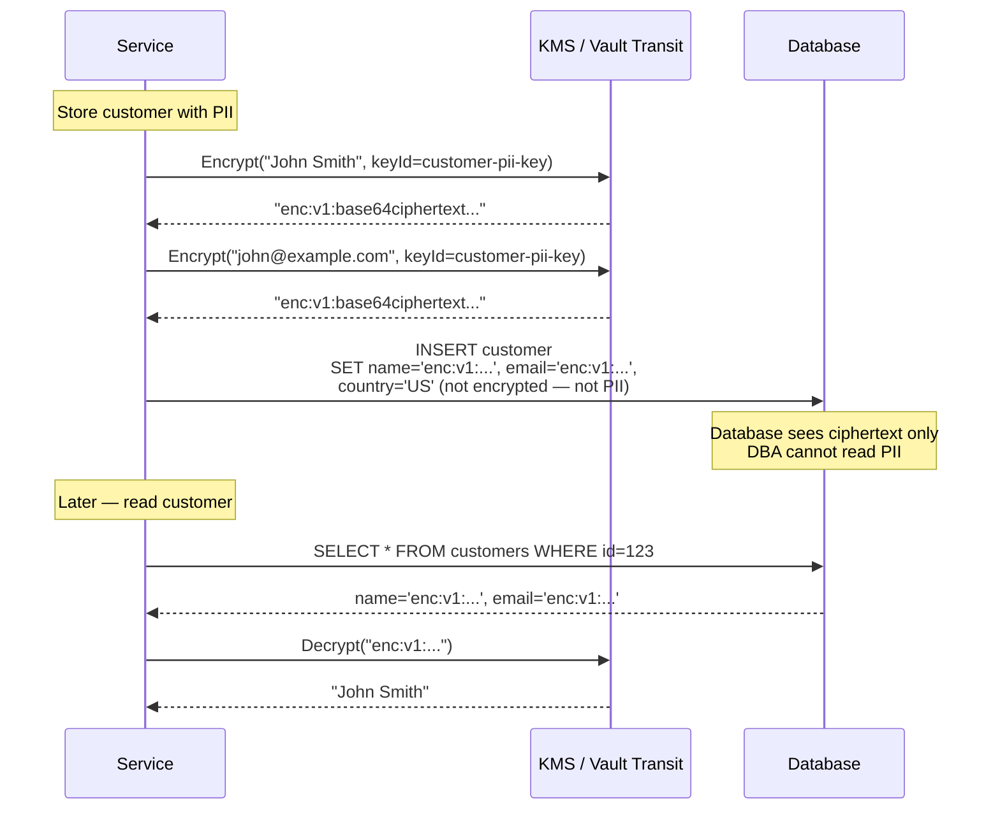

| Data Classification | Encryption Treatment | Example |
|---|---|---|
| **Public** | No encryption needed | Product name, category |
| **Internal** | Encrypt at rest (disk-level) | Order amounts, internal IDs |
| **Confidential (PII)** | Field-level encryption + access logging | Name, email, phone, address |
| **Restricted (sensitive PII)** | Field-level encryption + tokenization + strict access | SSN, credit card, health data |

---

## Part 4: Secret Management

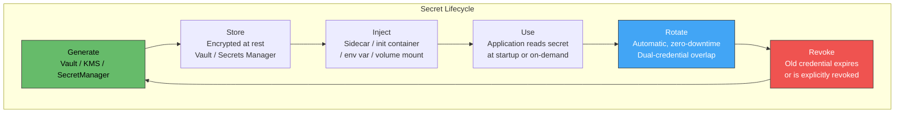

### Secret Injection Methods Comparison

| Method | Security | Convenience | Hot Reload | Best For |
|---|---|---|---|---|
| **Environment variables** | Medium (visible in /proc, crash dumps) | High | No (restart needed) | Simple config secrets |
| **Volume-mounted files** | High (file permissions, tmpfs) | Medium | Yes (kubelet refreshes) | Certificates, config files |
| **Vault Agent sidecar** | Highest (dynamic, short-lived) | Medium | Yes (agent renews) | Dynamic secrets, high-security |
| **External Secrets Operator** | High (syncs from Vault/AWS to K8s Secret) | High | Yes (reconcile loop) | Bridging cloud secrets to K8s |
| **CSI Secret Store Driver** | High (direct mount from Vault/KMS) | Medium | Yes | Direct integration, no K8s Secret object |

---

### Dynamic Secrets (Vault)

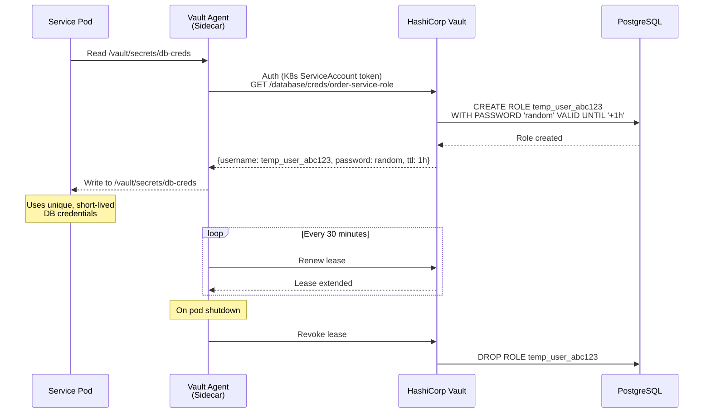

| Static Secrets | Dynamic Secrets (Vault) |
|---|---|
| Same password shared across all pods | Unique credentials per pod |
| Rotate manually (risky, coordinated) | Auto-expire; new creds on each deploy |
| Leaked credential = unlimited access | Leaked credential expires in hours |
| No revocation (must change password everywhere) | Revoke individual lease instantly |

---

## Part 5: Network Security

### Kubernetes Network Policies

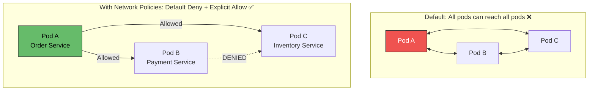

```yaml
# Default deny all ingress in namespace
apiVersion: networking.k8s.io/v1
kind: NetworkPolicy
metadata:
  name: default-deny
  namespace: production
spec:
  podSelector: {}
  policyTypes:
  - Ingress
  - Egress

---
# Allow order-service → payment-service on port 8080
apiVersion: networking.k8s.io/v1
kind: NetworkPolicy
metadata:
  name: allow-order-to-payment
  namespace: production
spec:
  podSelector:
    matchLabels:
      app: payment-service
  ingress:
  - from:
    - podSelector:
        matchLabels:
          app: order-service
    ports:
    - port: 8080
```

---

### Security Architecture: Complete Picture

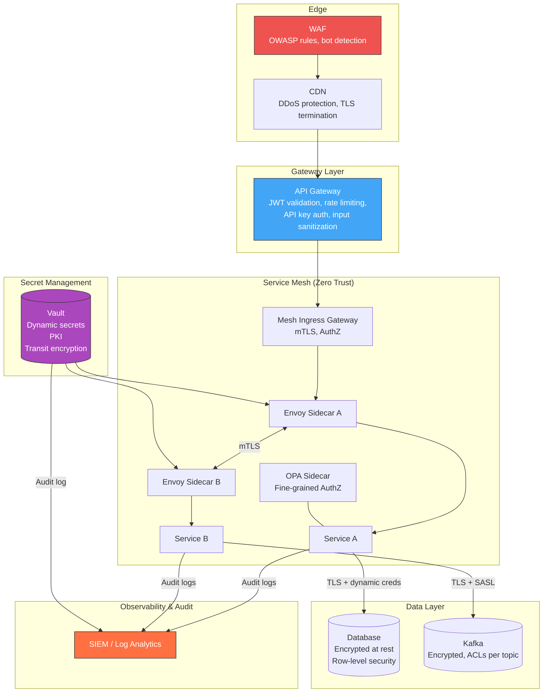

---

## Part 6: API Security

### Input Validation & Injection Prevention

| Attack Vector | Mitigation | Where to Enforce |
|---|---|---|
| **SQL Injection** | Parameterized queries / prepared statements; never string-concat SQL | Data access layer (ORM, repository) |
| **NoSQL Injection** | Validate input types; reject `$` operators in user input | Data access layer |
| **Command Injection** | Never pass user input to OS commands; use safe APIs | Application code |
| **XSS** | Output encoding; Content-Security-Policy headers | BFF / frontend |
| **SSRF** | Allowlist outbound URLs; block metadata endpoints | Service code + network policy |
| **Deserialization** | Use safe formats (JSON, Protobuf); no Java serialization | Service boundary |
| **Mass Assignment** | Explicit DTO mapping; never bind request directly to entity | API controller layer |
| **Broken Object-Level AuthZ** | Always verify the caller owns or is authorized for the specific resource | Service code (authorization check per resource) |

### Rate Limiting & Throttling

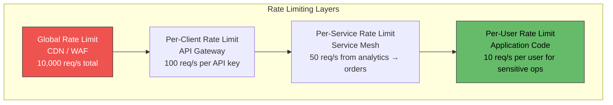

---

## Part 7: Supply Chain & Container Security

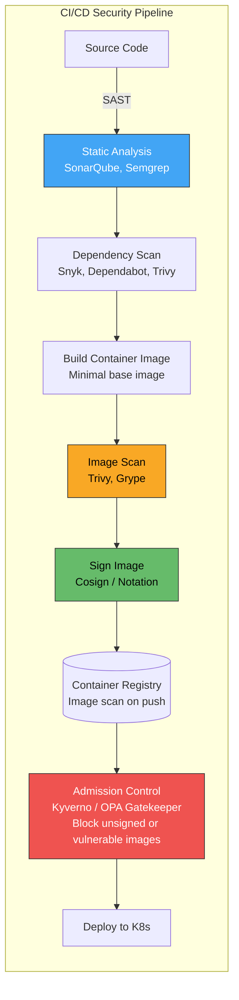

| Security Gate | What It Checks | Blocks Deployment If |
|---|---|---|
| **SAST** | Source code vulnerabilities, secrets in code | Critical/high findings |
| **Dependency scan** | Known CVEs in libraries | Critical CVE, no fix available |
| **Image scan** | OS and library CVEs in container image | Critical CVE in base image |
| **Image signing** | Image authenticity and integrity | Image unsigned or signature invalid |
| **Admission control** | Image registry, signature, vulnerability threshold | Image from untrusted registry or failing policy |
| **Runtime security** | Unexpected process execution, file access, network calls | Anomalous behavior (Falco, Tetragon) |

---

### Container Hardening

| Practice | Implementation |
|---|---|
| **Minimal base image** | `distroless`, `alpine`, or `scratch` — no shell, no package manager |
| **Non-root user** | `USER 1000` in Dockerfile; `runAsNonRoot: true` in SecurityContext |
| **Read-only filesystem** | `readOnlyRootFilesystem: true` in SecurityContext; tmpfs for /tmp |
| **No privilege escalation** | `allowPrivilegeEscalation: false` |
| **Drop all capabilities** | `capabilities: { drop: ["ALL"] }` |
| **Resource limits** | CPU/memory limits — prevent resource abuse |
| **No host namespaces** | `hostNetwork: false`, `hostPID: false`, `hostIPC: false` |
| **Seccomp profile** | `RuntimeDefault` or custom — restrict system calls |

---

### Anti-Patterns

| Anti-Pattern | Problem | Remedy |
|---|---|---|
| **Perimeter-only security** | Once inside the network, everything trusts everything | Zero-trust: mTLS + AuthZ on every call |
| **Hardcoded secrets** | Passwords in code, Docker images, environment variable definitions | Vault/Secrets Manager; dynamic secrets |
| **JWT without validation** | Service trusts any JWT without checking signature/expiry/audience | Validate signature, expiry, issuer, audience at every service |
| **Shared service accounts** | All services use same DB credentials | Per-service credentials; dynamic secrets with Vault |
| **No network segmentation** | All pods can reach all pods and all databases | Default-deny network policies; explicit allow rules |
| **Auth at gateway only** | Services behind gateway have no auth → compromised service = full access | Defense in depth: gateway + mesh AuthZ + app-level AuthZ |
| **Logging PII/secrets** | Sensitive data in log files accessible to operators | Structured logging with redaction; never log tokens, passwords, PII |
| **No image scanning** | Deploying containers with known CVEs | Scan in CI, block on critical CVEs, scan continuously in registry |
| **Long-lived credentials** | DB passwords that never change | Short-lived dynamic credentials; auto-rotation |
| **No audit trail** | Cannot determine who accessed what, when | Audit log every authentication, authorization decision, and data access |

---

### Practical Checklist

**Authentication:**
- [ ] OAuth 2.0 / OIDC for external user authentication
- [ ] mTLS for all service-to-service communication (service mesh)
- [ ] SPIFFE identities for workload authentication
- [ ] JWT validation at every service (signature, expiry, audience, issuer)
- [ ] Short-lived tokens (access: 15min, refresh: 24h)

**Authorization:**
- [ ] Default-deny at network level (Kubernetes NetworkPolicy)
- [ ] Default-deny at mesh level (Istio AuthorizationPolicy)
- [ ] Fine-grained AuthZ in application code (resource-level ownership checks)
- [ ] Externalized policies (OPA) for complex authorization rules
- [ ] RBAC for coarse access; ABAC/policy-based for fine-grained

**Encryption:**
- [ ] TLS 1.3 for all external connections
- [ ] mTLS for all internal service-to-service connections
- [ ] TLS for service-to-database and service-to-broker connections
- [ ] Encryption at rest for all databases and object storage
- [ ] Field-level encryption for PII (name, email, SSN, credit card)
- [ ] Envelope encryption with KMS-managed keys

**Secrets:**
- [ ] No secrets in source code, Docker images, or plain environment variables
- [ ] Use Vault / Secrets Manager with dynamic, short-lived credentials
- [ ] Auto-rotate secrets with zero-downtime dual-credential overlap
- [ ] Audit every secret access

**Supply Chain:**
- [ ] SAST + dependency scanning in CI pipeline
- [ ] Container image scanning on every build
- [ ] Image signing (Cosign) + admission control (Kyverno/Gatekeeper)
- [ ] Minimal base images, non-root, read-only filesystem, drop all capabilities
- [ ] Runtime security monitoring (Falco/Tetragon)

---

### Recommendation

**Adopt zero-trust from the start** — do not assume any call is safe because it comes from inside the cluster. Deploy a **service mesh** (Istio/Linkerd) for automatic mTLS and service-level authorization with zero application code changes. Use **Vault** for secret management — dynamic, short-lived credentials per pod are dramatically safer than static shared passwords. Enforce **default-deny** network policies in Kubernetes. Validate JWTs at **every service**, not just the gateway. For encryption at rest, use **cloud KMS** (AWS KMS, Azure Key Vault) with envelope encryption for PII fields. Build security into the **CI/CD pipeline** — scan code, dependencies, and container images; block deployment on critical vulnerabilities. These are not optional hardening steps — they are baseline requirements for any production microservices system.

---

### Next Steps to Explore

1. **Zero-trust networking deep-dive** — SPIFFE/SPIRE, identity-based segmentation
2. **OPA/Rego policy authoring** — writing and testing authorization policies
3. **Vault operations** — dynamic secrets, PKI engine, transit encryption engine
4. **OWASP API Security Top 10** — specific API vulnerability patterns and mitigations
5. **Runtime security** — Falco, Tetragon, detecting anomalous behavior in production