# Service Monitoring & Logging in Microservices

---

## 1. Why It Matters

In a monolith a single log file and a process-level health check suffice. In microservices, a single user request can fan out across dozens of services, each with its own process, network hop, and failure mode. Without a unified **observability** strategy—monitoring, logging, and tracing—you are blind.

The **three pillars of observability** work together:

| Pillar | Question It Answers | Signal Type |
|---|---|---|
| **Metrics** | "Is the system healthy *right now*?" | Numeric time-series (counters, gauges, histograms) |
| **Logs** | "What *exactly* happened inside a service?" | Structured event records |
| **Traces** | "What was the *path* of a request across services?" | Span trees with timing |

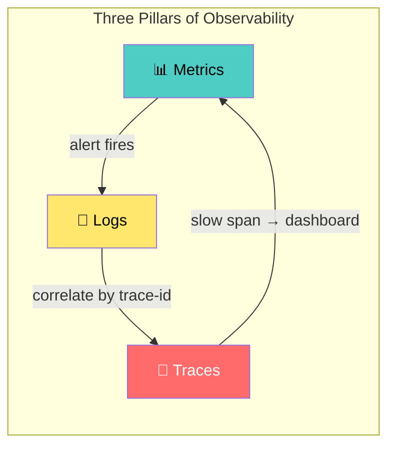

---

## 2. Architecture Overview

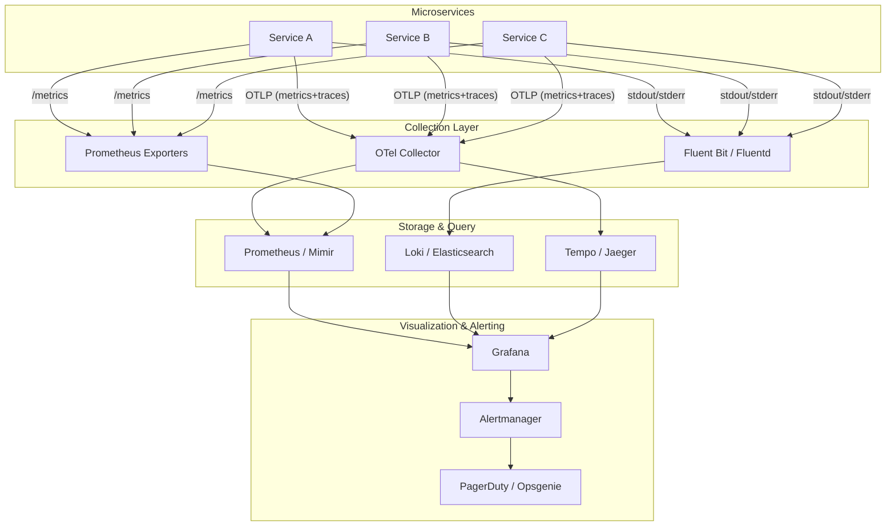

---

## 3. Service Monitoring

### 3.1 The Four Golden Signals (Google SRE)

Every service **must** expose these four metric families:

| Signal | What to Measure | Prometheus Metric Example |
|---|---|---|
| **Latency** | Duration of successful vs. failed requests | `http_request_duration_seconds` (histogram) |
| **Traffic** | Request rate / throughput | `http_requests_total` (counter) |
| **Errors** | Rate of failed requests (5xx, timeouts) | `http_requests_total{status=~"5.."}` |
| **Saturation** | How "full" the service is (CPU, memory, queue depth) | `container_cpu_usage_seconds_total`, `process_open_fds` |

### 3.2 RED & USE Methods

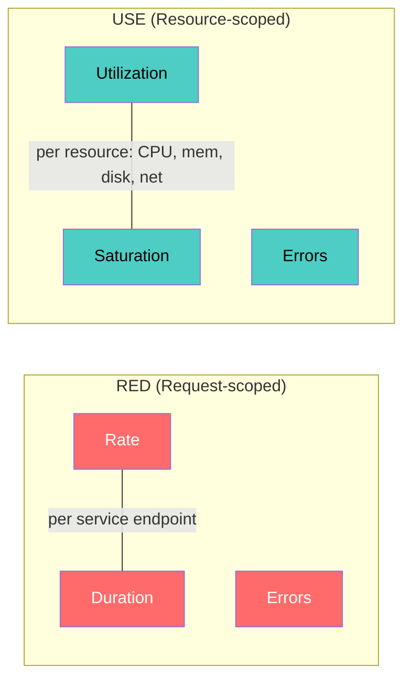

| Method | Scope | Best For |
|---|---|---|
| **RED** | Request-driven services (APIs, gateways) | Latency SLOs, error budgets |
| **USE** | Infrastructure resources (CPU, disk, network) | Capacity planning, saturation alerts |
| **Four Golden Signals** | Unified view | SRE on-call dashboards |

### 3.3 Metrics Collection Patterns

#### Pull-based (Prometheus model)

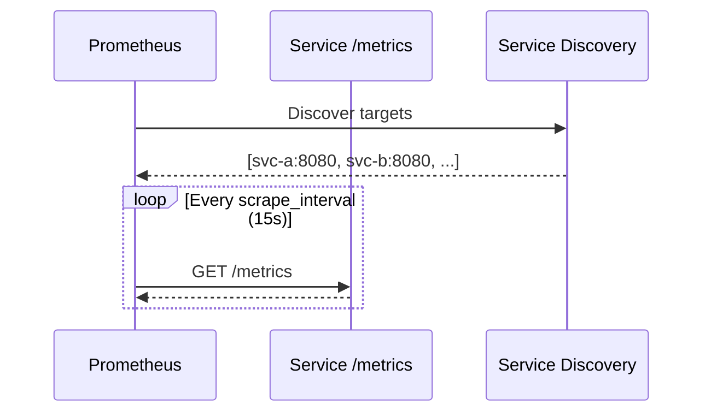

**Pros:** Simple, no push infrastructure, service owns its format.  
**Cons:** Doesn't work well for short-lived jobs (use Pushgateway), requires network reachability.

#### Push-based (OTLP / StatsD model)

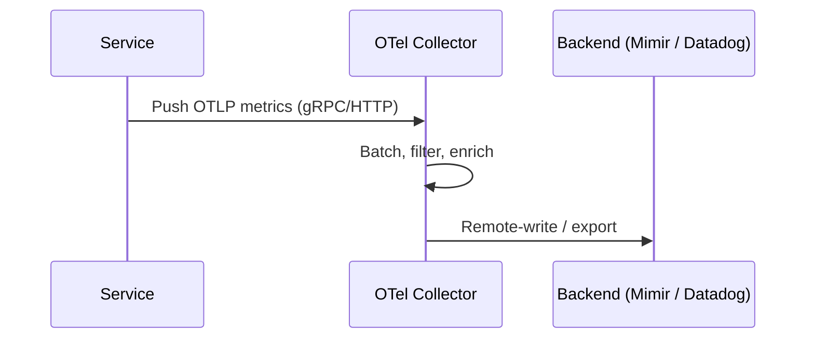

**Pros:** Works for serverless and short-lived processes, firewall-friendly (outbound only).  
**Cons:** Requires collector infrastructure, back-pressure handling.

### 3.4 Health Checks

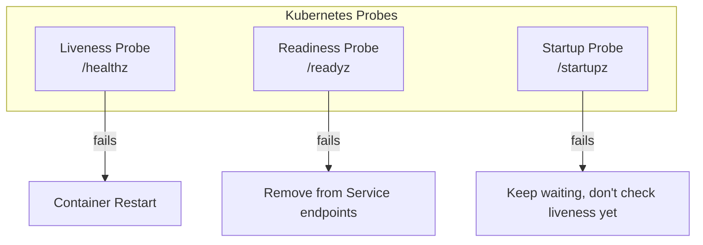

| Probe | Purpose | What to Check |
|---|---|---|
| **Liveness** | "Is the process stuck?" | Deadlock detection, basic process health |
| **Readiness** | "Can it serve traffic?" | DB connection pool, cache warmth, dependency health |
| **Startup** | "Has it finished initializing?" | Migration completion, config loaded |

**Critical rule:** Liveness probes must **never** check downstream dependencies. A cascading liveness failure = cascading restarts = cluster-wide outage.

### 3.5 Alerting Strategy

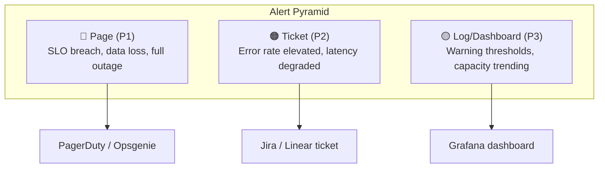

**SLO-based alerting** (recommended over threshold-based):

```
# Multi-window burn-rate alert (Google SRE)
# If we're burning through error budget 14.4x faster than allowed
# over a 1h window AND 5m window → page

- alert: HighErrorBudgetBurn
  expr: |
    (
      sum(rate(http_requests_total{status=~"5.."}[1h]))
      / sum(rate(http_requests_total[1h]))
    ) > (14.4 * (1 - 0.999))
    AND
    (
      sum(rate(http_requests_total{status=~"5.."}[5m]))
      / sum(rate(http_requests_total[5m]))
    ) > (14.4 * (1 - 0.999))
  labels:
    severity: page
```

---

## 4. Service Logging

### 4.1 Structured Logging

**Unstructured (bad):**
```
2026-04-18 10:23:45 INFO Processing order 12345 for user john@example.com
```

**Structured (good):**
```json
{
  "timestamp": "2026-04-18T10:23:45.123Z",
  "level": "info",
  "service": "order-service",
  "message": "Processing order",
  "order_id": "12345",
  "user_id": "u-abc-789",
  "trace_id": "4bf92f3577b34da6a3ce929d0e0e4736",
  "span_id": "00f067aa0ba902b7",
  "environment": "production",
  "version": "v2.3.1"
}
```

### 4.2 Log Levels & When to Use Them

| Level | When | Example |
|---|---|---|
| **FATAL** | Process cannot continue | `"Failed to bind port 8080"` |
| **ERROR** | Operation failed, needs attention | `"Payment gateway returned 503"` |
| **WARN** | Unexpected but handled | `"Cache miss, falling back to DB"` |
| **INFO** | Business-significant events | `"Order 12345 placed successfully"` |
| **DEBUG** | Developer troubleshooting details | `"SQL query took 23ms, 5 rows returned"` |
| **TRACE** | Very fine-grained (rarely in prod) | `"Entering validateAddress(), input={...}"` |

**Production default:** `INFO`. Enable `DEBUG` per-service dynamically via external config (feature flag, config map reload).

### 4.3 Log Aggregation Architecture

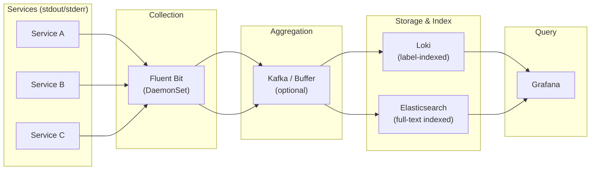

### 4.4 Loki vs. Elasticsearch

| Dimension | Grafana Loki | Elasticsearch (ELK/EFK) |
|---|---|---|
| **Indexing** | Labels only (like Prometheus) | Full-text inverted index |
| **Storage cost** | 10–50x cheaper (object storage) | Expensive (hot/warm/cold tiers) |
| **Query speed** | Fast for label + grep, slower for arbitrary text search | Fast for any field query |
| **Cardinality** | Must limit label cardinality | Handles high-cardinality fields |
| **Operations** | Lightweight (stateless queriers) | Heavy (JVM heap tuning, shard management) |
| **Best for** | Cost-sensitive, Kubernetes-native, Grafana shop | Full-text search, compliance, existing ELK investment |

### 4.5 Correlation: Connecting Logs to Traces

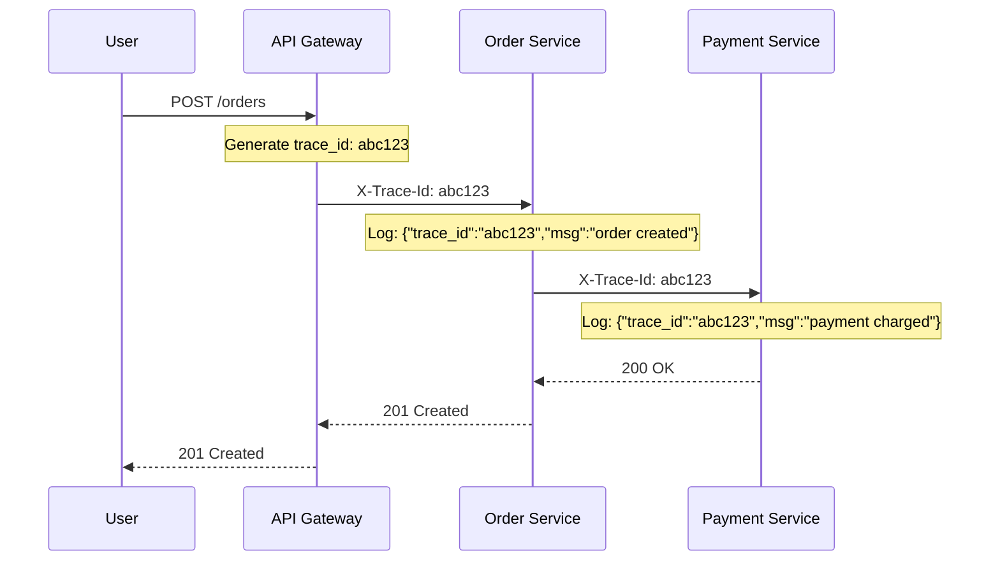

**Key fields for correlation:**

```json
{
  "trace_id": "4bf92f3577b34da6a3ce929d0e0e4736",
  "span_id": "00f067aa0ba902b7",
  "parent_span_id": "a3ce929d0e0e4736",
  "service": "payment-service",
  "request_id": "req-xyz-456"
}
```

In **Grafana**, clicking a `trace_id` in Loki opens the trace waterfall in Tempo — seamless pillar-to-pillar navigation.

---

## 5. Distributed Tracing

### 5.1 Trace Anatomy

```mermaid
gantt
    title Trace: POST /checkout (trace_id: abc123)
    dateFormat X
    axisFormat %L ms

    section API Gateway
    auth + route           :0, 15

    section Order Service
    validate order         :15, 35
    save to DB             :35, 70

    section Payment Service
    charge card            :70, 180
    fraud check            :80, 150

    section Notification
    send confirmation      :180, 210
```

- **Trace** = end-to-end request journey
- **Span** = one unit of work (one service call, one DB query)
- **Span context** = `(trace_id, span_id, trace_flags)` propagated via W3C `traceparent` header

### 5.2 Sampling Strategies

| Strategy | Description | When to Use |
|---|---|---|
| **Head-based** | Decide at ingress (e.g., sample 10%) | Simple, low overhead |
| **Tail-based** | Decide after trace completes (keep errors, slow traces) | Better signal, but needs collector buffering |
| **Adaptive / Dynamic** | Adjust rate based on traffic volume | High-traffic production |
| **Always-on** | 100% sampling | Low-traffic or critical paths |

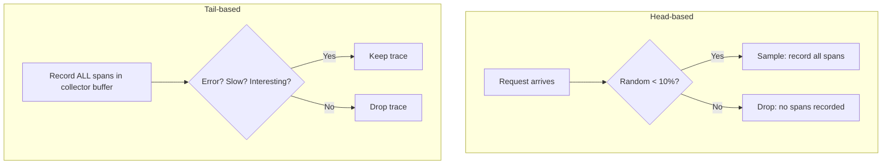

### 5.3 OpenTelemetry (OTel) — The Standard

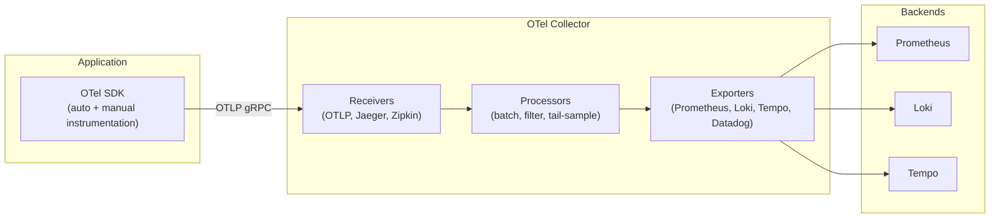

**OTel Collector deployment patterns:**

| Pattern | Description | Best For |
|---|---|---|
| **Sidecar** | One collector per pod | Fine-grained control, tenant isolation |
| **DaemonSet** | One collector per node | Node-level metrics, log collection |
| **Gateway** | Centralized collector pool | Cross-cluster aggregation, tail sampling |
| **Agent + Gateway** | DaemonSet → Gateway | Production: local buffering + central processing |

---

## 6. Unified Observability Platform

### 6.1 Grafana Stack (LGTM)

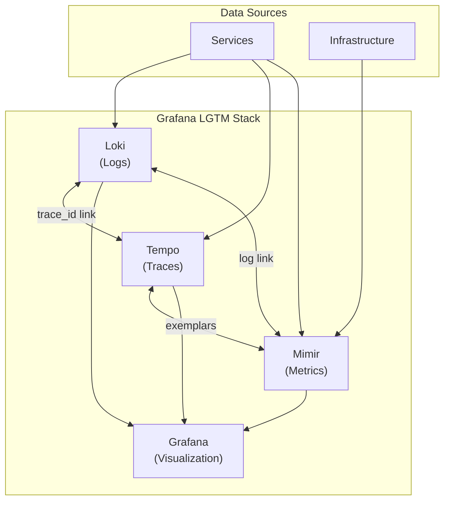

### 6.2 Exemplars: Bridging Metrics ↔ Traces

Exemplars attach a `trace_id` to individual metric data points:

```
http_request_duration_seconds_bucket{le="0.5"} 1234 # {trace_id="abc123"} 0.48
```

When a latency spike appears on a **dashboard** → click → jump directly to the **trace** that caused it → click a span → see the **logs** for that span. Full-circle observability.

---

## 7. Technology Comparison

| Capability | Open-Source Stack | Commercial / Managed |
|---|---|---|
| **Metrics** | Prometheus + Mimir | Datadog, New Relic, Dynatrace |
| **Logs** | Loki + Fluent Bit | Datadog Logs, Splunk, Elastic Cloud |
| **Traces** | Tempo + OTel | Datadog APM, Honeycomb, Lightstep |
| **Visualization** | Grafana | Datadog Dashboards, New Relic One |
| **Alerting** | Alertmanager | PagerDuty, Opsgenie (both work with either) |
| **Cost** | Infrastructure + ops effort | Per-host / per-GB pricing |
| **Vendor lock-in** | None (OTel standard) | Moderate to high |

### When to Choose What

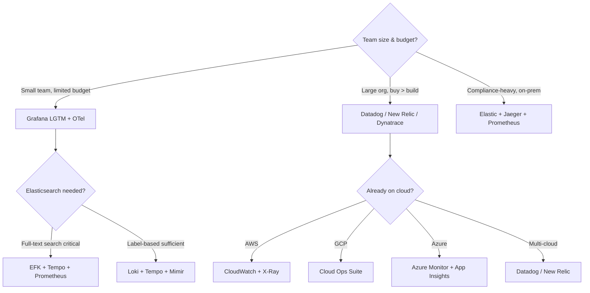

---

## 8. Implementation Patterns

### 8.1 Log-to-Metric Conversion

Derive metrics from log patterns (useful for legacy services that can't export Prometheus metrics):

```yaml
# Fluent Bit → Prometheus metric from log lines
[FILTER]
    Name    log_to_metrics
    Match   app.*
    Tag     metrics.app
    Metric  counter  http_requests_total  "HTTP requests"  status method
    Regex   status  ^(?P<status>\d{3})$
```

### 8.2 Canary & Synthetic Monitoring

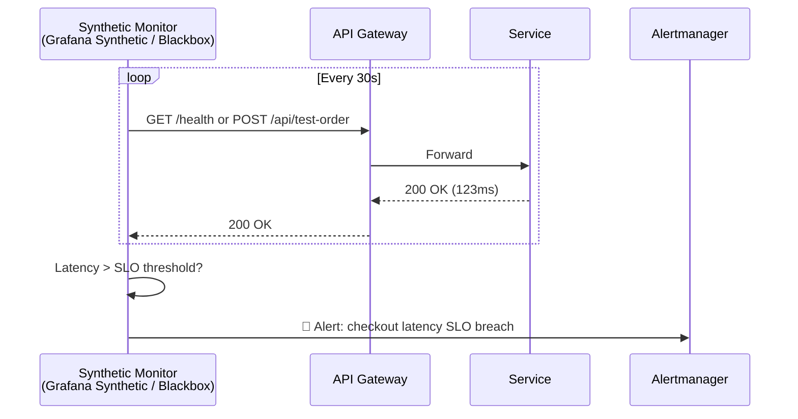

### 8.3 Context Propagation Pattern

```
┌─────────────────────────────────────────────────────┐
│  Baggage + TraceContext propagation                 │
│                                                     │
│  traceparent: 00-<trace_id>-<span_id>-01            │
│  baggage: user_id=u-123,region=eu-west-1            │
│                                                     │
│  → Every downstream service receives context        │
│  → Logs, metrics, traces are auto-correlated        │
│  → Baggage items available for routing/filtering    │
└─────────────────────────────────────────────────────┘
```

### 8.4 Dynamic Log Level Control

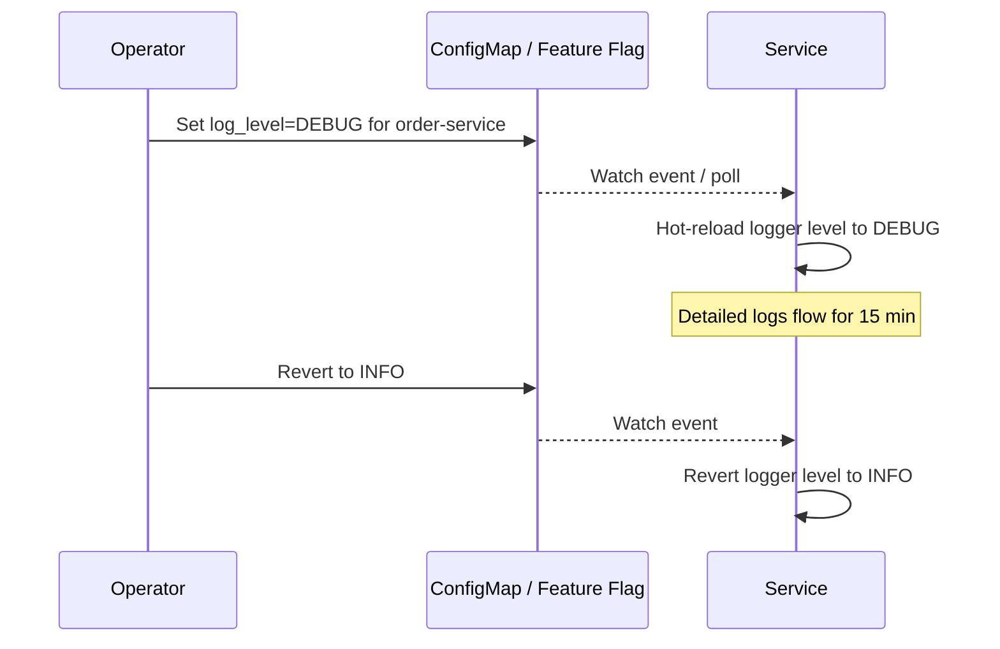

---

## 9. Anti-Patterns

| Anti-Pattern | Problem | Fix |
|---|---|---|
| **Log-and-throw** | Logging an exception then rethrowing → duplicate log entries | Log **or** throw, never both |
| **High-cardinality labels** | `user_id` as Prometheus label → millions of time-series → OOM | Use logs for high-cardinality; metrics for low-cardinality |
| **Alert on symptoms, not causes** | "CPU > 80%" alert → noisy, not actionable | Alert on SLOs: "error rate > budget burn" |
| **Logging PII** | User emails, SSNs in plaintext logs | Redact/mask at collection layer; structured logging with allow-lists |
| **Missing trace propagation** | Services don't forward `traceparent` header → broken traces | Use OTel auto-instrumentation + verify with integration tests |
| **Dashboard sprawl** | 200 dashboards, nobody looks at them | Curate per-team: 1 overview + 1 per-service |
| **Logging everything at DEBUG in prod** | Log volume explodes, costs skyrocket | Default `INFO`; use dynamic log level for targeted debugging |
| **Ignoring log retention** | Unbounded storage | Set TTL: hot (7d) → warm (30d) → cold/archive (1y) → delete |
| **Alerting on every metric** | Alert fatigue, pages ignored | Follow alert pyramid; only page on SLO breaches |
| **Monolith monitoring applied to microservices** | Single dashboard for 50 services | Per-service RED dashboard + cross-service trace view |

---

## 10. Checklist

### Monitoring
- [ ] Every service exposes `/metrics` endpoint (Prometheus format or OTLP)
- [ ] Four Golden Signals (latency, traffic, errors, saturation) are collected
- [ ] Kubernetes liveness, readiness, and startup probes configured
- [ ] Liveness probes do NOT check downstream dependencies
- [ ] SLOs defined per service (e.g., p99 latency < 500ms, availability > 99.9%)
- [ ] Alerts based on error-budget burn rate, not raw thresholds
- [ ] Alert routing: page for P1, ticket for P2, dashboard for P3
- [ ] Dashboards curated: 1 platform overview + 1 per-service
- [ ] Synthetic / canary checks for critical user journeys

### Logging
- [ ] All logs are **structured JSON** written to stdout/stderr
- [ ] Every log line includes `trace_id`, `span_id`, `service`, `version`
- [ ] PII is redacted or masked before storage
- [ ] Log levels follow convention; production defaults to INFO
- [ ] Dynamic log level change supported without restart
- [ ] Log aggregation pipeline deployed (Fluent Bit → Loki/Elasticsearch)
- [ ] Retention policies configured (hot / warm / cold / delete)
- [ ] Log-based metrics derived for legacy services

### Tracing
- [ ] OpenTelemetry SDK integrated (auto-instrumentation preferred)
- [ ] W3C `traceparent` header propagated across all service boundaries
- [ ] Sampling strategy chosen (tail-based for production recommended)
- [ ] OTel Collector deployed (DaemonSet + Gateway pattern)
- [ ] Trace-to-log and trace-to-metric links configured (exemplars)

### Correlation
- [ ] Grafana (or equivalent) links Metrics ↔ Logs ↔ Traces
- [ ] Clicking a metric spike → trace → logs is a smooth workflow
- [ ] `request_id` / `correlation_id` propagated for business-level tracing

---

## 11. Decision Framework

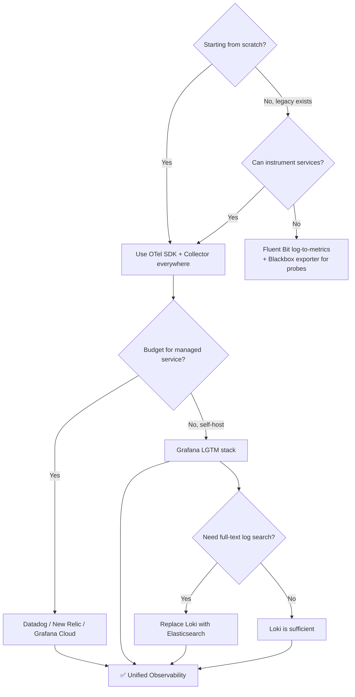

---

## 12. Recommendation

**Start here for a new microservices platform:**

1. **Instrument** with OpenTelemetry SDKs (auto-instrumentation for Java, Python, Node, .NET, Go)
2. **Collect** with OTel Collector in Agent (DaemonSet) + Gateway topology
3. **Store** in Grafana LGTM: Mimir (metrics), Loki (logs), Tempo (traces)
4. **Visualize** in Grafana with cross-pillar data links (metric → trace → log)
5. **Alert** on SLO burn-rate via Alertmanager → PagerDuty
6. **Log** structured JSON to stdout; let Fluent Bit DaemonSet ship to Loki
7. **Correlate** everything via `trace_id` injected by OTel into every log line

This gives you vendor-neutral, cost-effective, full-stack observability with a smooth operator experience — and you can swap any backend without changing application code.

---

**Next steps to explore:** SLO Engineering & Error Budgets, Chaos Engineering & Resilience Testing, Platform Engineering & Developer Experience.