# Service Tracing & Debugging in Microservices

---

## 1. The Debugging Problem in Microservices

In a monolith, debugging means attaching a debugger, setting breakpoints, and stepping through a single call stack. In microservices, a single user action triggers a cascade of network calls across independently deployed processes — each with its own language, runtime, and deployment schedule. The call stack is now **distributed**.

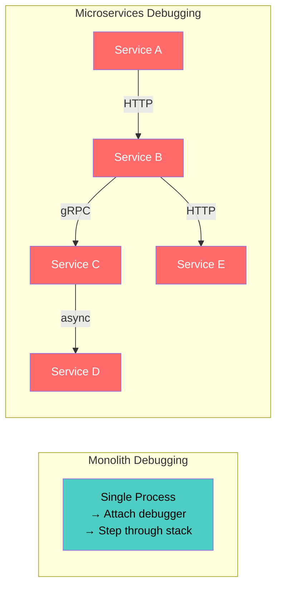

| Challenge | Why It's Hard |
|---|---|
| **No single stack trace** | Request spans multiple processes on multiple machines |
| **Non-deterministic failures** | Network latency, partial failures, race conditions |
| **Polyglot services** | Different languages/frameworks = different debugging tools |
| **Ephemeral infrastructure** | Containers restart, IPs change, logs vanish |
| **Asynchronous flows** | Message queues decouple cause from effect in time |
| **Blast radius ambiguity** | Failure in Service C surfaces as timeout in Service A |

---

## 2. Distributed Tracing — The Foundation

### 2.1 Core Concepts

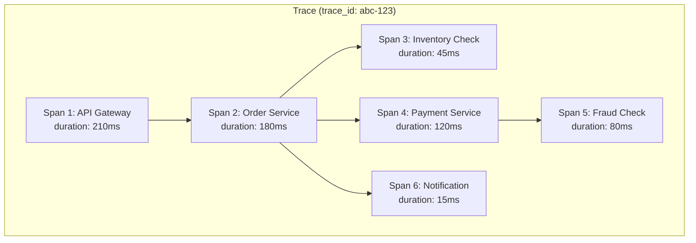

| Term | Definition |
|---|---|
| **Trace** | The full journey of a single request across all services. Identified by a globally unique `trace_id`. |
| **Span** | One unit of work within a trace (an HTTP call, a DB query, a queue publish). Has `span_id`, `parent_span_id`, start time, duration, status, and attributes. |
| **Span Context** | The propagated metadata: `(trace_id, span_id, trace_flags, trace_state)`. Carried in headers. |
| **Baggage** | Application-defined key-value pairs propagated alongside span context (e.g., `tenant_id`, `region`). |
| **Root Span** | The first span in a trace — usually created at the API gateway or edge service. |
| **Child Span** | A span whose `parent_span_id` points to another span in the same trace. |

### 2.2 W3C Trace Context Standard

```
traceparent: 00-4bf92f3577b34da6a3ce929d0e0e4736-00f067aa0ba902b7-01
             ──  ────────────────────────────────  ────────────────  ──
             ver          trace_id (128-bit)         span_id (64-bit)  flags
                                                                        01 = sampled

tracestate: vendor1=opaque_value,vendor2=other_value
baggage: user_id=u-123,region=eu-west-1
```

**Why W3C standard matters:** Before W3C Trace Context, every vendor (Zipkin B3, Jaeger, Datadog) had its own propagation format. Mixing vendors meant broken traces. W3C `traceparent` is the universal standard — OpenTelemetry implements it by default.

### 2.3 Context Propagation Mechanisms

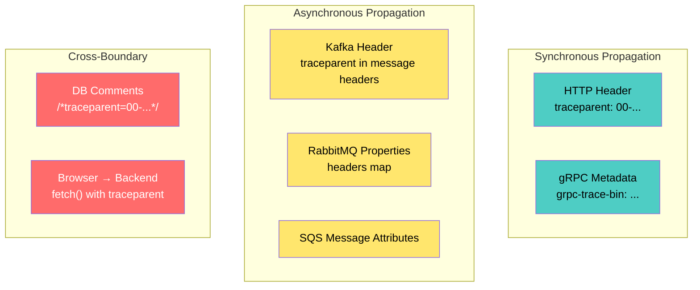

**The critical rule:** Every service boundary — HTTP, gRPC, message queue, even database queries — must extract incoming context and inject it into outgoing calls. A single break in the chain fragments the trace.

---

## 3. Tracing with OpenTelemetry

### 3.1 Instrumentation Layers

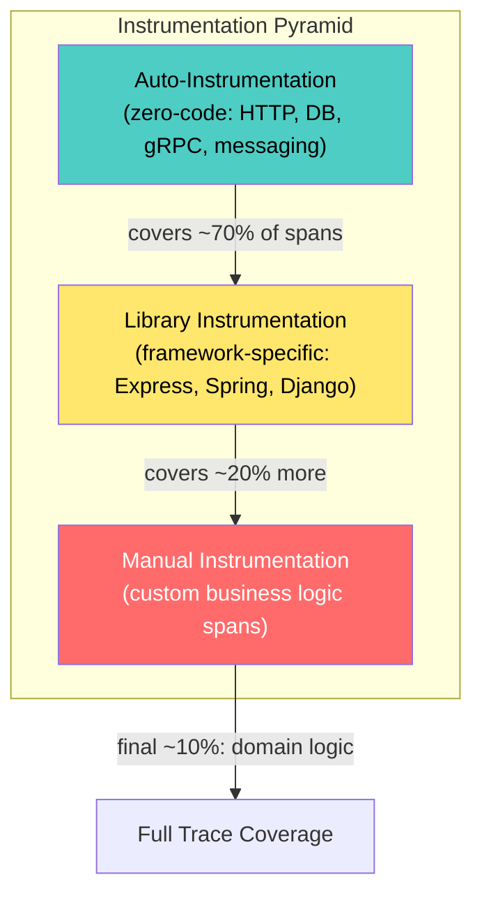

| Layer | Effort | What It Captures |
|---|---|---|
| **Auto-instrumentation** | Zero-code (agent/wrapper) | HTTP client/server, DB drivers, gRPC, common libraries |
| **Library instrumentation** | Import OTel plugin for framework | Framework-specific middleware, routes, handlers |
| **Manual instrumentation** | Developer writes span code | Business logic: "validate discount", "check inventory", "apply tax" |

### 3.2 Manual Span Example (Python)

```python
from opentelemetry import trace

tracer = trace.get_tracer("order-service")

def process_order(order):
    with tracer.start_as_current_span("process_order") as span:
        span.set_attribute("order.id", order.id)
        span.set_attribute("order.total", order.total)
        span.set_attribute("order.item_count", len(order.items))

        with tracer.start_as_current_span("validate_inventory"):
            check_inventory(order.items)  # child span

        with tracer.start_as_current_span("charge_payment") as pay_span:
            result = charge(order.payment_method, order.total)
            pay_span.set_attribute("payment.provider", result.provider)
            pay_span.set_attribute("payment.status", result.status)
            if result.failed:
                pay_span.set_status(trace.StatusCode.ERROR, result.error)
                pay_span.record_exception(result.exception)
                raise PaymentError(result.error)
```

### 3.3 Span Enrichment — What to Record

| Attribute Category | Examples | Purpose |
|---|---|---|
| **Identity** | `service.name`, `service.version`, `deployment.environment` | Where did this happen? |
| **Request** | `http.method`, `http.url`, `http.status_code`, `rpc.method` | What was called? |
| **Business** | `order.id`, `user.tier`, `payment.provider` | Domain context for debugging |
| **Infrastructure** | `k8s.pod.name`, `k8s.namespace`, `container.id` | Which instance? |
| **Error** | `exception.type`, `exception.message`, `exception.stacktrace` | What went wrong? |

### 3.4 Span Events and Links

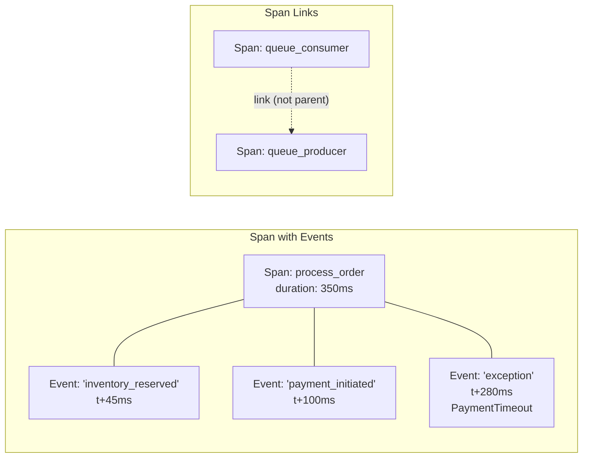

- **Span Events:** Timestamped annotations within a span (exceptions, milestones, retries).
- **Span Links:** Connect causally related spans that aren't in a parent-child relationship (e.g., a consumer span linking back to the producer span that enqueued the message).

---

## 4. Sampling Strategies (Deep Dive)

### 4.1 Head-Based Sampling

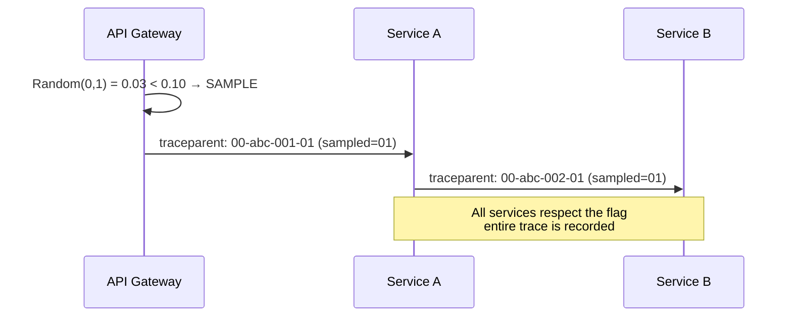

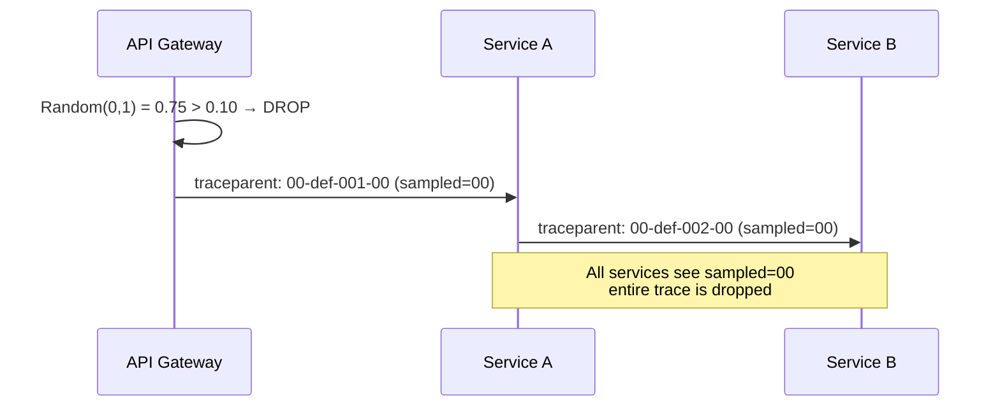

**Pros:** Simple, consistent, no buffering.  
**Cons:** Randomly drops interesting traces (errors, outliers).

### 4.2 Tail-Based Sampling

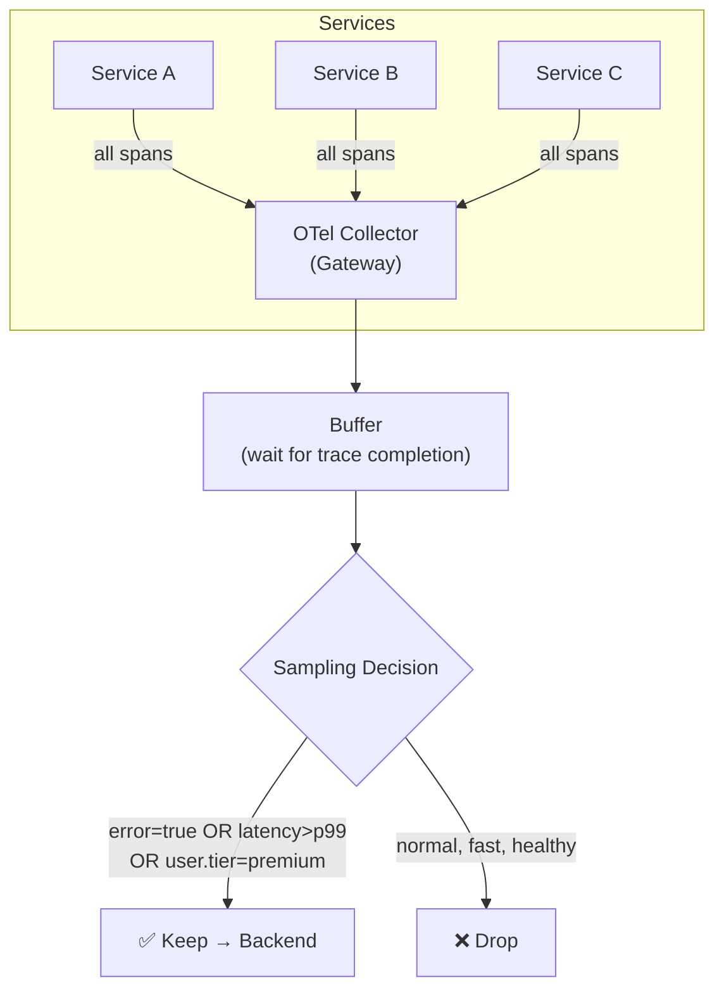

**Tail-based sampling policies (OTel Collector):**

```yaml
processors:
  tail_sampling:
    decision_wait: 30s          # buffer window
    num_traces: 100000          # max buffered traces
    policies:
      # Always keep errors
      - name: errors
        type: status_code
        status_code: {status_codes: [ERROR]}

      # Keep slow traces (latency > 2s)
      - name: slow-traces
        type: latency
        latency: {threshold_ms: 2000}

      # Keep 100% of premium-tier users
      - name: premium-users
        type: string_attribute
        string_attribute:
          key: user.tier
          values: [premium, enterprise]

      # Sample 5% of everything else
      - name: baseline
        type: probabilistic
        probabilistic: {sampling_percentage: 5}
```

### 4.3 Sampling Comparison

| Dimension | Head-Based | Tail-Based |
|---|---|---|
| **Decision point** | Ingress (first span) | After trace completes |
| **Error capture** | Random (may miss errors) | Policy-driven (keeps all errors) |
| **Infrastructure** | Minimal | Collector must buffer full traces |
| **Memory cost** | None | High (proportional to traffic × wait time) |
| **Consistency** | Perfect (flag propagates) | Requires trace-aware load balancing to collector |
| **Best for** | Simple setups, dev/staging | Production with SLO-driven debugging |

---

## 5. Debugging Strategies

### 5.1 The Debugging Workflow

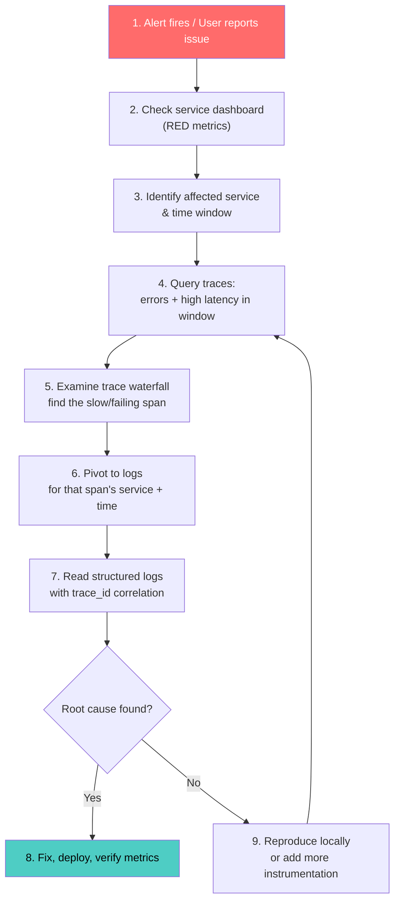

### 5.2 Trace-Driven Debugging

```mermaid
gantt
    title Trace Waterfall: POST /checkout — ERROR
    dateFormat X
    axisFormat %L ms

    section API Gateway
    route + auth              :done, 0, 12

    section Order Service
    validate cart             :done, 12, 30
    reserve inventory         :done, 30, 75

    section Payment Service
    tokenize card             :done, 75, 110
    charge                    :crit, 110, 3200
    Note: ⚠️ 3090ms — timeout

    section Notification
    (never reached)           :active, 3200, 3200
```

Reading this waterfall immediately reveals:
- **Where:** Payment Service, `charge` span
- **What:** 3090ms duration → timeout
- **Why:** Check span attributes: `payment.gateway=stripe`, `http.status_code=504`
- **Next:** Filter logs by `trace_id` in Payment Service → find the Stripe API call that hung

### 5.3 Debugging Async / Event-Driven Flows

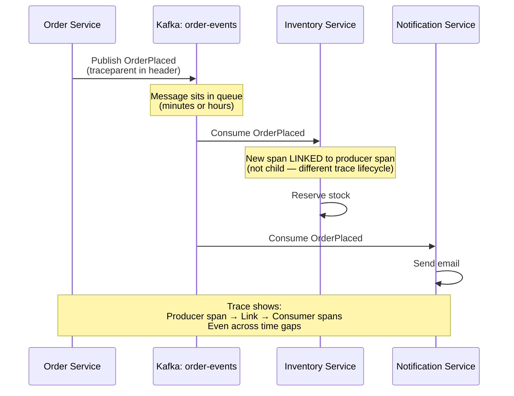

**Key difference from sync tracing:**
- Synchronous: child spans (parent-child hierarchy)
- Asynchronous: **span links** (causal relationship without parent-child)
- The `trace_id` can optionally be carried forward, or a new trace can be created with a **link** back to the producing trace

### 5.4 Debugging Techniques Matrix

| Technique | When to Use | Tool |
|---|---|---|
| **Trace waterfall analysis** | Request is slow or erroring | Tempo, Jaeger, Datadog APM |
| **Log correlation by trace_id** | Need details for a specific span | Loki, Elasticsearch (filter by `trace_id`) |
| **Metrics → Exemplar → Trace** | Latency spike on dashboard | Grafana (click metric point → trace) |
| **Comparison traces** | "It was fast yesterday, slow today" | Trace diff (compare two traces side-by-side) |
| **Service map / dependency graph** | Unknown failure propagation path | Tempo service graph, Jaeger dependencies |
| **Error grouping** | Recurring errors across traces | Sentry, Honeycomb, Datadog Error Tracking |
| **Local replay** | Cannot reproduce in prod | Capture request + headers, replay locally |
| **Traffic mirroring / shadowing** | Debug without affecting prod traffic | Istio mirror, Envoy tap |
| **Distributed profiling** | CPU/memory hotspots in prod | Pyroscope, Grafana Profiles (continuous profiling) |

---

## 6. Advanced Debugging Patterns

### 6.1 Service Dependency Map

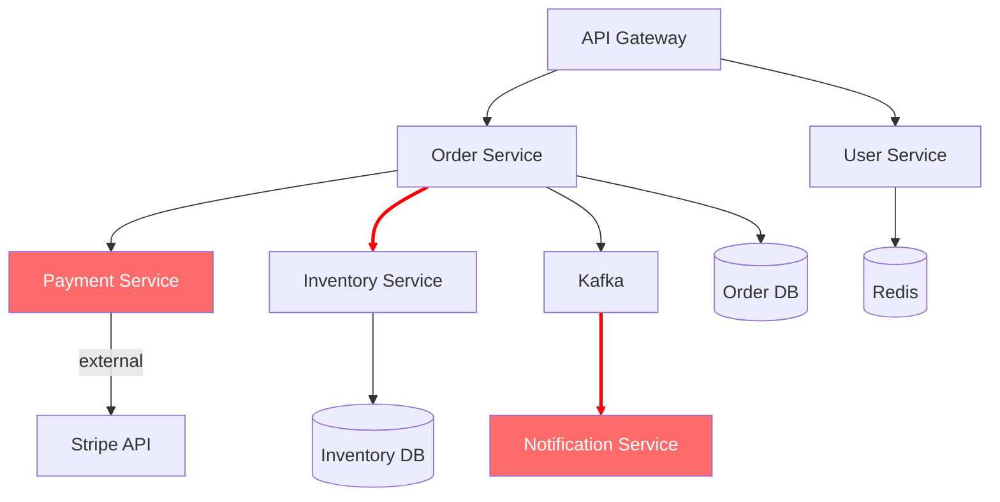

Auto-generated from trace data — red edges show error paths. This tells you which dependencies are unhealthy without manually tracing call chains.

### 6.2 Trace Comparison (Diff)

```
Trace A (fast, 120ms)              Trace B (slow, 3400ms)
─────────────────────              ──────────────────────
gateway     12ms                   gateway     14ms
  order     45ms                     order     52ms
    inventory 18ms                     inventory 18ms
    payment   40ms  ←── vs ──→       payment   3290ms  ⚠️
  notify    5ms                      notify    (timeout)
```

Compare a healthy trace against an unhealthy one — the delta pinpoints exactly which span diverged.

### 6.3 Traffic Mirroring for Debugging

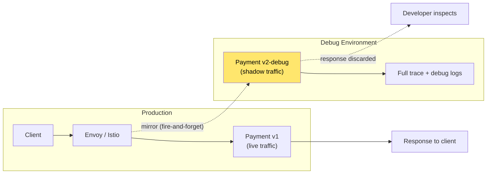

Mirror production traffic to a debug instance with verbose logging — zero risk to production, real data for debugging.

### 6.4 Continuous Profiling + Traces

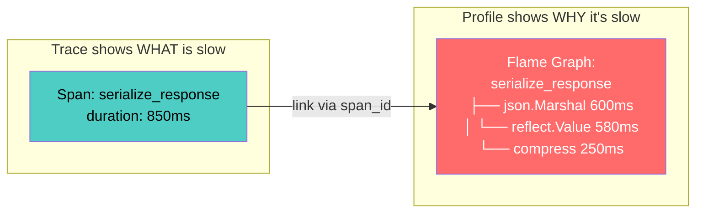

**Tracing** tells you *which* span is slow. **Profiling** tells you *which function/line of code* inside that span is consuming time. Tools like Grafana Pyroscope link profiles to trace spans.

### 6.5 Debug Propagation Headers

For targeted debugging in production without enabling verbose logging globally:

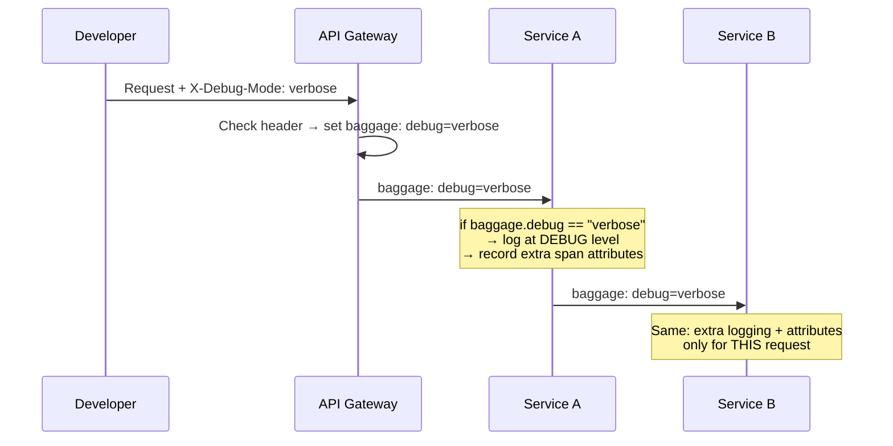

**Advantages:** Debug a single request in production at full verbosity while all other traffic stays at `INFO`. Requires baggage propagation and log-level switching logic in each service.

---

## 7. Debugging in Different Environments

### 7.1 Local Development

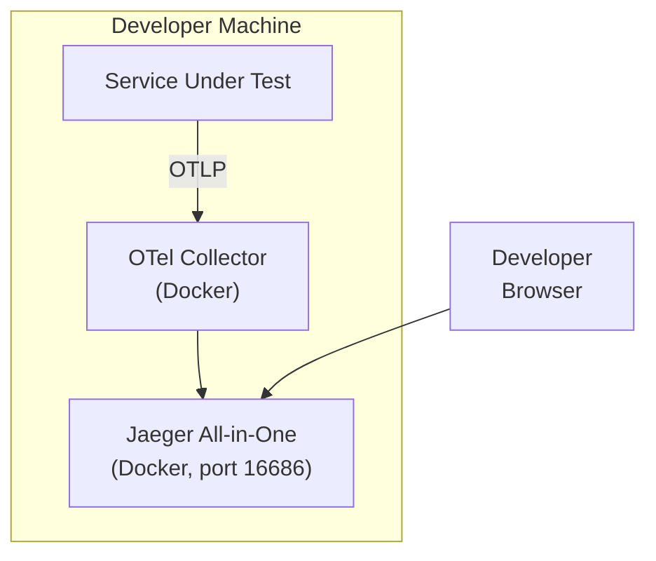

```yaml
# docker-compose.yaml (local observability stack)
services:
  jaeger:
    image: jaegertracing/all-in-one:latest
    ports:
      - "16686:16686"   # UI
      - "4318:4318"     # OTLP HTTP
    environment:
      - COLLECTOR_OTLP_ENABLED=true

  otel-collector:
    image: otel/opentelemetry-collector:latest
    command: ["--config=/etc/otel-config.yaml"]
    volumes:
      - ./otel-config.yaml:/etc/otel-config.yaml
```

### 7.2 Staging / Pre-Production

- **100% sampling** — capture every trace
- **Debug-level logging** enabled by default
- **Synthetic test traffic** with known trace IDs for validation
- **Trace assertions** in integration tests (verify expected span tree shape)

### 7.3 Production

- **Tail-based sampling** — keep errors, outliers, and premium-tier traces
- **Baggage-driven debug mode** — per-request verbose tracing
- **Traffic mirroring** to debug instances
- **Continuous profiling** linked to traces (Pyroscope)
- **SLO-driven alerts** → trace investigation → log correlation

---

## 8. Trace-Based Testing

### 8.1 Verifying Trace Structure in Integration Tests

```python
# Test: verify the trace shape of a checkout flow
def test_checkout_produces_correct_trace():
    # Trigger the checkout
    response = client.post("/checkout", json=order_payload)
    assert response.status_code == 201

    # Fetch the trace from Jaeger/Tempo API
    trace = fetch_trace(response.headers["X-Trace-Id"])

    # Assert trace structure
    root = trace.root_span
    assert root.operation_name == "POST /checkout"
    assert root.status == "OK"

    children = {s.operation_name for s in root.children}
    assert "validate_cart" in children
    assert "reserve_inventory" in children
    assert "charge_payment" in children
    assert "send_confirmation" in children

    # Assert latency budget
    payment_span = trace.find_span("charge_payment")
    assert payment_span.duration_ms < 500
```

### 8.2 Trace-Driven Contract Tests

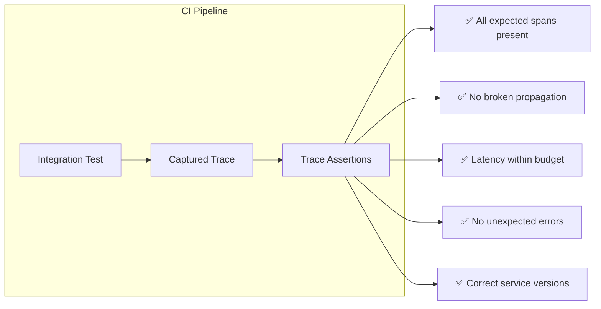

---

## 9. Technology Comparison

| Tool | Type | Strengths | Limitations |
|---|---|---|---|
| **Jaeger** | OSS, CNCF | Mature, good UI, adaptive sampling | Single-cluster focus, scaling needs effort |
| **Grafana Tempo** | OSS | Object-storage backend (cheap), integrates with Grafana LGTM | No indexing — relies on trace ID or service graph |
| **Zipkin** | OSS | Simple, battle-tested | Older, less active development |
| **Datadog APM** | Commercial | Full-stack, error tracking, profiling, logs in one UI | $$$ at scale, vendor lock-in |
| **Honeycomb** | Commercial | Best-in-class trace exploration (BubbleUp) | Expensive for high volume |
| **AWS X-Ray** | Cloud-native | Tight AWS integration | AWS-only, limited query flexibility |
| **Grafana Pyroscope** | OSS | Continuous profiling linked to traces | Separate from tracing (complementary) |
| **OpenTelemetry** | Standard | Vendor-neutral, all signals, huge ecosystem | Complexity; many configuration knobs |

---

## 10. Anti-Patterns

| Anti-Pattern | Problem | Fix |
|---|---|---|
| **Broken propagation chain** | One service doesn't forward `traceparent` → trace fragments into unrelated pieces | Use OTel auto-instrumentation; add integration tests asserting trace continuity |
| **Over-instrumentation** | 500 spans per trace → noise, high storage cost | Instrument at service boundaries + key business logic; skip trivial internal calls |
| **Under-instrumentation** | Only HTTP spans, no DB/cache/queue spans | Enable auto-instrumentation for all drivers; add manual spans for domain logic |
| **No span attributes** | Span says "DB query" with no context | Add `db.statement` (sanitized), `db.name`, table, row count |
| **Sampling everything at 100%** | Storage and cost explode in production | Use tail-based sampling; keep errors and outliers, sample baseline probabilistically |
| **Trace ID not in logs** | Cannot correlate log entries back to traces | Inject `trace_id`/`span_id` into structured log fields via OTel log bridge |
| **Ignoring async flows** | Queue consumers start new traces → no link to producer | Propagate context in message headers; use span links for async boundaries |
| **Debug logging in prod (always on)** | Log volume explodes, PII risk, cost | Use baggage-driven per-request debug mode; default to INFO |
| **Relying solely on logs** | Grep across 50 services is slow and error-prone | Invest in traces first; use logs for detail after trace identifies the service |
| **No trace in CI/CD** | Traces only exist in prod; can't catch propagation breaks before deploy | Run trace-based assertions in integration tests |

---

## 11. Decision Framework

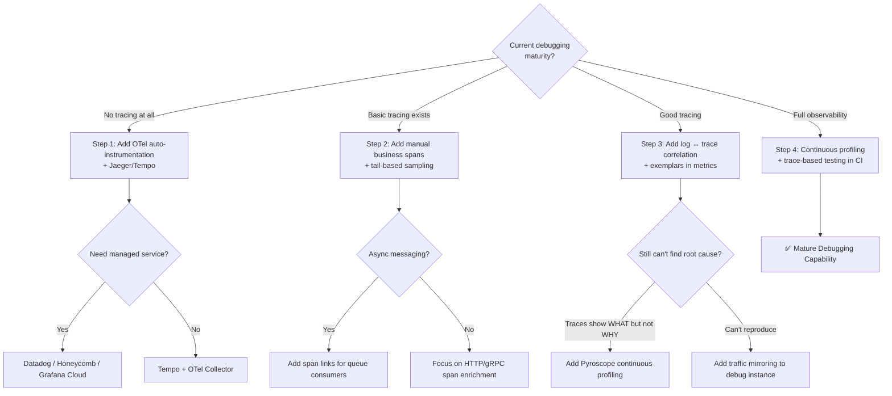

---

## 12. Checklist

### Tracing Setup
- [ ] OpenTelemetry SDK integrated in all services (auto-instrumentation first)
- [ ] W3C `traceparent` header propagated across HTTP, gRPC, and message queues
- [ ] Span links used for asynchronous / event-driven boundaries
- [ ] OTel Collector deployed (DaemonSet for agents, Gateway for sampling)
- [ ] Tail-based sampling configured: keep errors, slow traces, key users
- [ ] Trace backend deployed (Tempo / Jaeger) with appropriate retention

### Span Quality
- [ ] Every span has `service.name`, `service.version`, `deployment.environment`
- [ ] HTTP spans include `method`, `url`, `status_code`
- [ ] Database spans include `db.system`, `db.name`, `db.statement` (sanitized)
- [ ] Business-critical logic has manual spans with domain attributes
- [ ] Exceptions recorded via `span.record_exception()` with stack traces
- [ ] Span events mark key milestones within long operations

### Correlation
- [ ] `trace_id` and `span_id` injected into every structured log line
- [ ] Grafana (or equivalent) links Metrics → Traces → Logs seamlessly
- [ ] Exemplars attached to histogram metrics for metric → trace pivots
- [ ] `request_id` / `correlation_id` available for business-level tracing

### Debugging Workflow
- [ ] Service dependency graph auto-generated from trace data
- [ ] Trace comparison (healthy vs. unhealthy) workflow documented
- [ ] Per-request debug mode via baggage headers implemented
- [ ] Local dev has Jaeger/Tempo in docker-compose for trace inspection
- [ ] Integration tests assert trace structure (expected spans, propagation)
- [ ] Runbook links attached to alert definitions

### Advanced
- [ ] Continuous profiling (Pyroscope) linked to trace spans
- [ ] Traffic mirroring available for production debugging
- [ ] Dynamic log level control per-service without restart
- [ ] Trace data feeds service dependency SLO dashboards

---

## 13. Recommendation

**Adopt tracing and debugging incrementally:**

| Phase | Action | Outcome |
|---|---|---|
| **Phase 1** | Add OTel auto-instrumentation + Tempo/Jaeger | See request flow across services |
| **Phase 2** | Inject `trace_id` into logs + tail-based sampling | Correlate logs ↔ traces; keep interesting traces |
| **Phase 3** | Add manual business spans + exemplars | Debug domain logic; jump from dashboard → trace |
| **Phase 4** | Trace-based testing in CI + per-request debug mode | Catch propagation breaks before deploy; debug single requests in prod |
| **Phase 5** | Continuous profiling + traffic mirroring | Know *why* a span is slow, not just *that* it's slow |

The key insight: **traces are the backbone of microservices debugging**. Metrics tell you something is wrong, logs tell you the details, but only traces show you the *path* of the failure across service boundaries. Invest in tracing first, then build correlation to logs and metrics around it.

---

**Next steps to explore:** SLO Engineering & Error Budgets, Chaos Engineering & Fault Injection, Observability-Driven Development (ODD).