# Service Testing & Quality Assurance in Microservices

---

## 1. Why Microservices Testing Is Different

In a monolith, a single test suite exercises the entire application in one process. In microservices, every service is independently deployable — which means independently testable — but the **interactions between services** are where most production bugs hide.

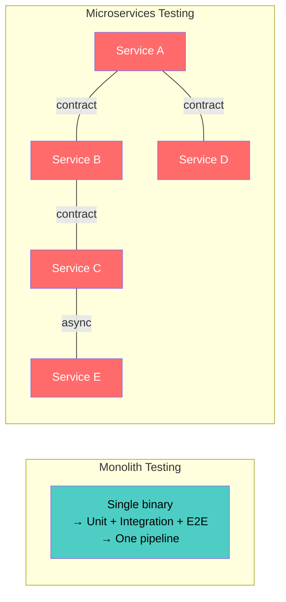

| Monolith | Microservices |
|---|---|
| One codebase, one test suite | N codebases, N test suites + cross-service tests |
| In-process function calls | Network calls (HTTP, gRPC, messaging) |
| Shared database — easy to set up test data | Each service owns its data — test data is distributed |
| Single deploy pipeline | Independent pipelines must coordinate |
| Bugs in logic | Bugs in logic **+ contracts + networks + timing** |

---

## 2. The Test Pyramid for Microservices

### 2.1 Classic vs. Microservices Test Pyramid

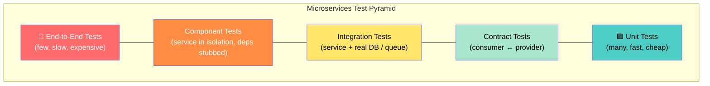

| Layer | Scope | Speed | Confidence In | Count |
|---|---|---|---|---|
| **Unit** | Single function/class, no I/O | < 10ms | Business logic correctness | Hundreds–thousands |
| **Contract** | API shape between consumer & provider | < 1s | Inter-service compatibility | Tens per service boundary |
| **Integration** | Service + real dependency (DB, cache, queue) | 1–10s | Data access, serialization, driver behavior | Tens |
| **Component** | Entire service, external deps stubbed/mocked | 5–30s | Service behavior end-to-end in isolation | Tens |
| **End-to-End** | Multiple real services in a test environment | 30s–minutes | Full user journey across system | Very few (5–15) |

### 2.2 The Testing Honeycomb (Alternative View)

Some teams prefer a **honeycomb** shape over a pyramid — emphasizing integration and contract tests over pure unit tests, since most microservices bugs are at boundaries:

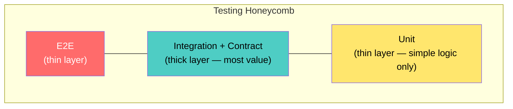

---

## 3. Test Types in Detail

### 3.1 Unit Tests

Test pure business logic in isolation — no network, no database, no file system.

```python
# order_service/domain/pricing.py
def calculate_discount(order_total: float, coupon_code: str) -> float:
    if coupon_code == "SAVE20" and order_total >= 100:
        return order_total * 0.20
    return 0.0

# tests/unit/test_pricing.py
def test_discount_applied_for_valid_coupon():
    assert calculate_discount(150.0, "SAVE20") == 30.0

def test_no_discount_below_minimum():
    assert calculate_discount(50.0, "SAVE20") == 0.0

def test_no_discount_for_invalid_coupon():
    assert calculate_discount(200.0, "INVALID") == 0.0
```

**What to unit test:**
- Domain logic, calculations, validation rules
- State machines, business rules
- Data transformations, serialization/deserialization
- Error handling paths

**What NOT to unit test:**
- Thin wrappers around DB calls (test those in integration)
- HTTP routing / controller glue (test in component tests)
- Third-party library behavior

### 3.2 Integration Tests

Test a service with its **real** infrastructure dependencies — database, cache, message broker — but without other services.

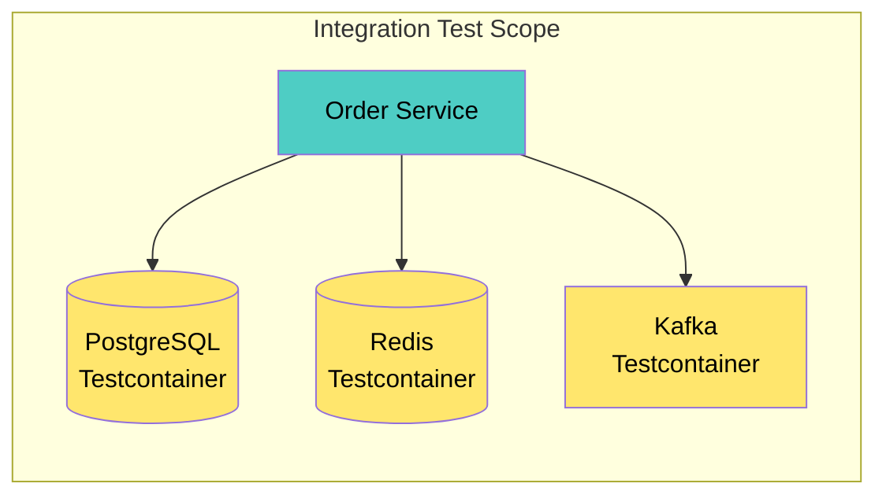

```python
# tests/integration/test_order_repository.py
import testcontainers.postgres

@pytest.fixture(scope="module")
def pg():
    with PostgresContainer("postgres:16") as pg:
        run_migrations(pg.get_connection_url())
        yield pg

def test_save_and_retrieve_order(pg):
    repo = OrderRepository(pg.get_connection_url())
    order = Order(id="ord-1", items=[Item("sku-a", 2)], total=49.99)

    repo.save(order)
    loaded = repo.find_by_id("ord-1")

    assert loaded.total == 49.99
    assert len(loaded.items) == 1
```

**Testcontainers** — spin up real databases, queues, and caches as ephemeral Docker containers per test suite. Eliminates "works on my machine" and mock-drift problems.

### 3.3 Contract Tests

Verify that the **API contract** between a consumer and a provider stays compatible — without running both services together.

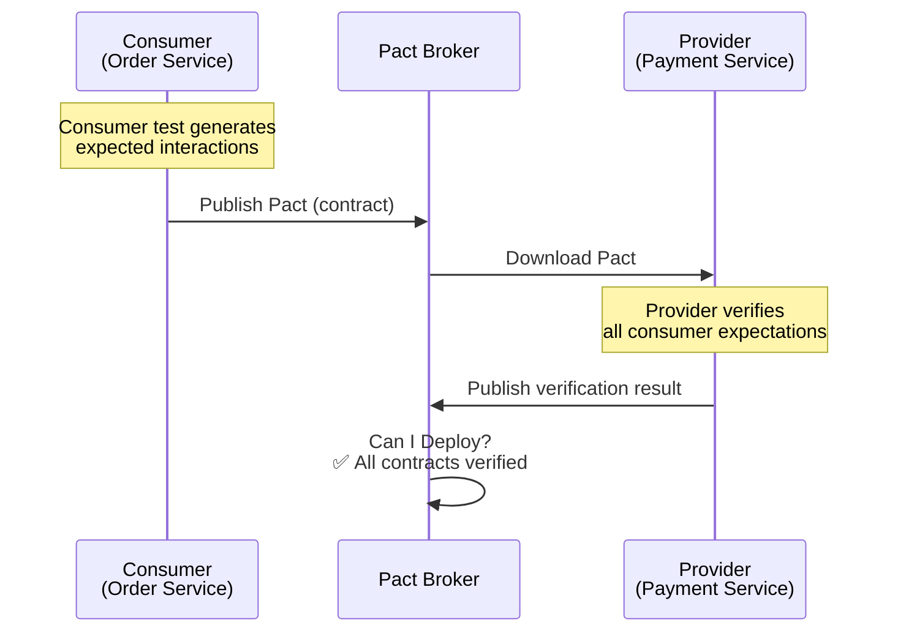

#### Consumer-Driven Contracts (Pact)

**Consumer side (Order Service):**
```python
# tests/contract/test_payment_consumer.py
from pact import Consumer, Provider

pact = Consumer("OrderService").has_pact_with(Provider("PaymentService"))

def test_charge_payment():
    expected = {"id": "pay-1", "status": "charged", "amount": 49.99}

    pact.given("a valid payment method exists")         \
        .upon_receiving("a charge request")              \
        .with_request("POST", "/payments/charge",
                      body={"method_id": "pm-1", "amount": 49.99}) \
        .will_respond_with(201, body=Like(expected))

    with pact:
        result = PaymentClient(pact.uri).charge("pm-1", 49.99)
        assert result.status == "charged"
```

**Provider side (Payment Service):**
```python
# tests/contract/test_payment_provider.py
def test_verify_pacts():
    verifier = Verifier(provider="PaymentService",
                        provider_base_url="http://localhost:8080")
    verifier.verify_with_broker(
        broker_url="https://pact-broker.internal",
        publish_verification_results=True
    )
```

#### Provider-Driven Contracts (Schemas)

For API-first teams, the provider publishes an **OpenAPI / Protobuf / AsyncAPI** schema, and consumers validate against it:

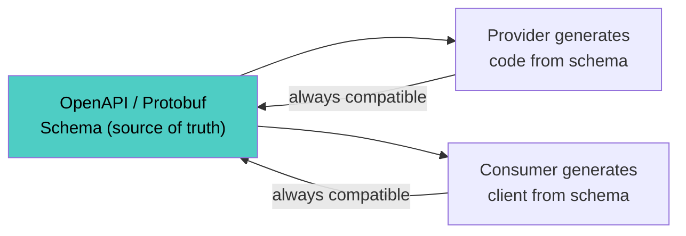

#### Contract Test Comparison

| Approach | Who Drives | Tool | Best For |
|---|---|---|---|
| **Consumer-Driven (Pact)** | Consumer defines expectations | Pact, Spring Cloud Contract | REST/HTTP APIs with known consumers |
| **Provider-Driven (Schema)** | Provider publishes schema | OpenAPI, Protobuf, AsyncAPI | API-first, many/unknown consumers |
| **Bi-Directional** | Both sides verify against schema | Pact + OpenAPI (Pactflow) | Hybrid: schema + consumer expectations |

### 3.4 Component Tests

Test the **entire service** as a black box — real application, real HTTP endpoints — but with external services stubbed or mocked.

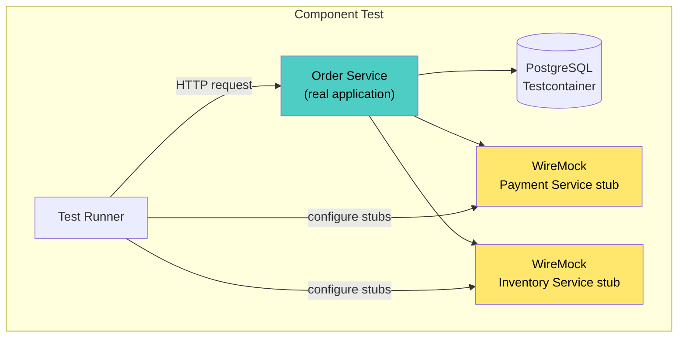

```python
# tests/component/test_checkout_flow.py

@pytest.fixture
def payment_stub(wiremock):
    wiremock.stub_for(
        post("/payments/charge")
        .will_return(json_response({"id": "pay-1", "status": "charged"}, 201))
    )

@pytest.fixture
def inventory_stub(wiremock):
    wiremock.stub_for(
        post("/inventory/reserve")
        .will_return(json_response({"reserved": True}, 200))
    )

def test_checkout_success(client, payment_stub, inventory_stub):
    response = client.post("/checkout", json={
        "cart_id": "cart-1",
        "payment_method": "pm-1"
    })

    assert response.status_code == 201
    assert response.json()["order_id"] is not None
    assert response.json()["status"] == "confirmed"
```

### 3.5 End-to-End (E2E) Tests

Test complete user journeys across **real services** in a shared test environment.

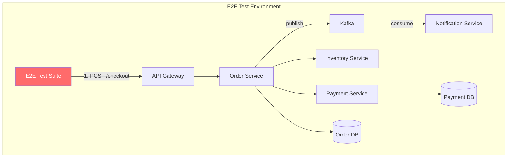

**Critical rules for E2E tests:**

| Rule | Reason |
|---|---|
| Keep count very low (5–15) | Slow, flaky, expensive to maintain |
| Test critical user journeys only | Checkout, signup, payment — not edge cases |
| Use unique test data per run | Avoid state pollution between runs |
| Set generous timeouts | Network + multiple services = inherent latency |
| Run in dedicated environment | Never share with manual testing |
| Accept some flakiness budget | Retry once; if flaky > 2%, fix or delete the test |

---

## 4. Testing Asynchronous Flows

### 4.1 The Challenge

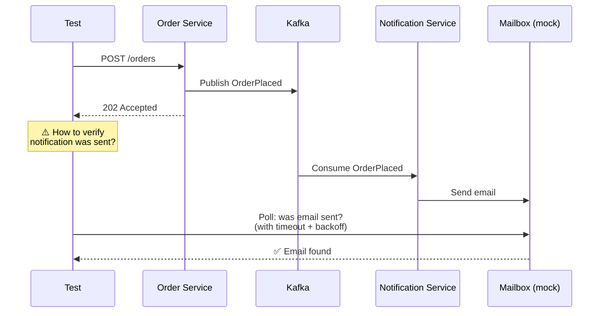

### 4.2 Patterns for Async Testing

| Pattern | Mechanism | When |
|---|---|---|
| **Polling with timeout** | Repeatedly check for expected state | Simple, most common |
| **Test consumer** | Attach a test Kafka consumer to the topic | Verify message content/format |
| **Callback endpoint** | Service calls a test webhook on completion | Webhook-based integrations |
| **Awaitility / Eventually** | DSL for "eventually this condition is true" | Readable async assertions |
| **Inbox/Outbox inspection** | Query the outbox table directly | Verify message was enqueued without waiting for consumer |

```python
# Polling with awaitility pattern
from tenacity import retry, stop_after_delay, wait_fixed

@retry(stop=stop_after_delay(10), wait=wait_fixed(0.5))
def assert_notification_sent(order_id):
    notifications = notification_api.get(f"/notifications?order_id={order_id}")
    assert len(notifications.json()) == 1
    assert notifications.json()[0]["type"] == "order_confirmation"

def test_order_triggers_notification(client):
    response = client.post("/orders", json=order_payload)
    assert response.status_code == 202

    assert_notification_sent(response.json()["order_id"])
```

---

## 5. Test Doubles Strategy

### 5.1 Types of Test Doubles

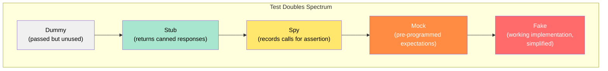

### 5.2 When to Use Which Double

| Layer | Preferred Double | Tool |
|---|---|---|
| **Unit tests** | Stubs / Mocks (in-process) | `unittest.mock`, Mockito, Moq |
| **Integration tests** | Real dependencies (Testcontainers) | Testcontainers, Docker Compose |
| **Component tests** | Service stubs (HTTP-level) | WireMock, MockServer, Hoverfly |
| **Contract tests** | Pact mock server (consumer), real service (provider) | Pact |
| **E2E tests** | Real services, mock external APIs only | WireMock for Stripe/Twilio stubs |

### 5.3 WireMock for Service Stubbing

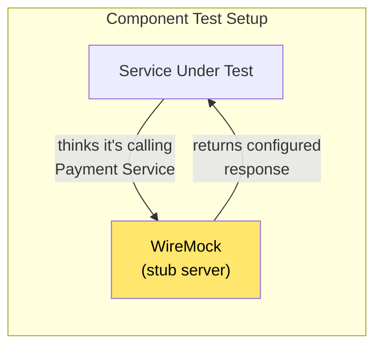

**Stateful WireMock scenarios** — simulate multi-step interactions:

```json
{
  "scenarioName": "Payment Retry",
  "requiredScenarioState": "Started",
  "newScenarioState": "First Call Failed",
  "request": { "method": "POST", "url": "/charge" },
  "response": { "status": 503, "body": "{\"error\":\"unavailable\"}" }
}
{
  "scenarioName": "Payment Retry",
  "requiredScenarioState": "First Call Failed",
  "request": { "method": "POST", "url": "/charge" },
  "response": { "status": 200, "body": "{\"status\":\"charged\"}" }
}
```

---

## 6. CI/CD Testing Pipeline

### 6.1 Pipeline Structure

```mermaid
graph LR
    subgraph "Per-Service Pipeline"
        LINT["Lint + Static Analysis"] --> UNIT["Unit Tests"]
        UNIT --> INT["Integration Tests<br/>(Testcontainers)"]
        INT --> CONTRACT["Contract Tests<br/>(publish Pact)"]
        CONTRACT --> COMP["Component Tests<br/>(WireMock)"]
        COMP --> BUILD["Build Image"]
        BUILD --> SEC["Security Scan<br/>(Trivy, Snyk)"]
        SEC --> PUBLISH["Publish Artifact"]
    end

    subgraph "Cross-Service Gate"
        PUBLISH --> CANIDEPLOY["Can I Deploy?<br/>(Pact Broker)"]
        CANIDEPLOY -->|"✅ all contracts pass"| DEPLOY["Deploy to Staging"]
        DEPLOY --> E2E["E2E Smoke Tests"]
        E2E --> PROD["Deploy to Production"]
        PROD --> SMOKE["Production Smoke Test"]
    end

    style CANIDEPLOY fill:#4ecdc4,color:#000
    style E2E fill:#ff6b6b,color:#fff
```

### 6.2 Pipeline Timing Budget

| Stage | Target Duration | Fail Action |
|---|---|---|
| Lint + Unit | < 2 min | Block merge |
| Integration (Testcontainers) | < 5 min | Block merge |
| Contract (Pact) | < 1 min | Block merge |
| Component (WireMock) | < 5 min | Block merge |
| Security scan | < 3 min | Block merge (critical/high), warn (medium) |
| **Total per-service pipeline** | **< 15 min** | — |
| E2E smoke (post-deploy) | < 10 min | Auto-rollback |
| Production smoke | < 2 min | Auto-rollback |

### 6.3 "Can I Deploy?" Gate

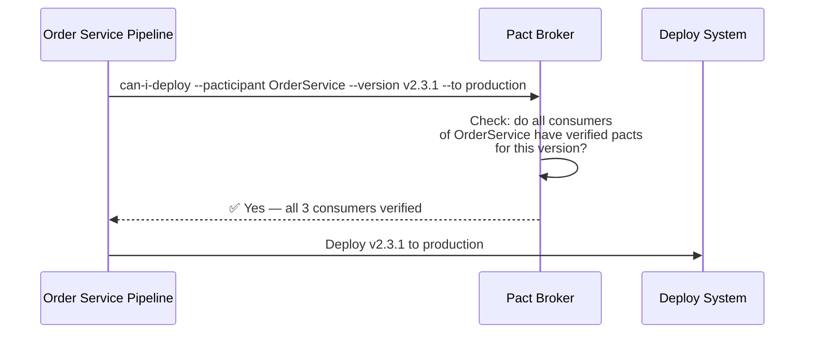

This prevents deploying a provider change that breaks any consumer — **without running E2E tests**.

---

## 7. Testing Strategies for Specific Patterns

### 7.1 Testing Saga Orchestrations

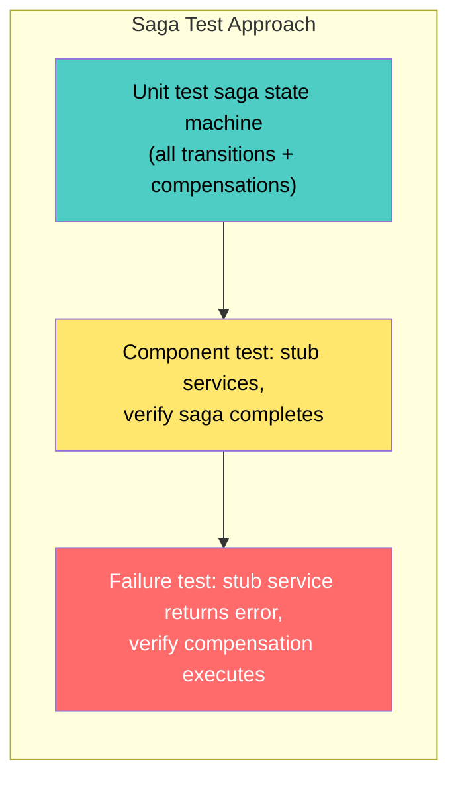

```python
# Unit test: saga state machine
def test_saga_compensates_on_payment_failure():
    saga = CheckoutSaga()
    saga.handle(InventoryReserved(order_id="o1"))
    saga.handle(PaymentFailed(order_id="o1", reason="insufficient_funds"))

    assert saga.state == SagaState.COMPENSATING
    assert saga.pending_commands == [ReleaseInventory(order_id="o1")]
```

### 7.2 Testing Event-Driven Systems

| What to Test | How |
|---|---|
| Event schema | Schema registry validation (Avro/Protobuf compatibility check) |
| Event publishing | Integration test: publish → consume from test consumer → assert payload |
| Event handling | Component test: inject event → assert service state change |
| Idempotency | Send same event twice → assert no duplicate side effects |
| Ordering | Send events out of order → assert correct handling or rejection |

### 7.3 Testing API Gateway / BFF

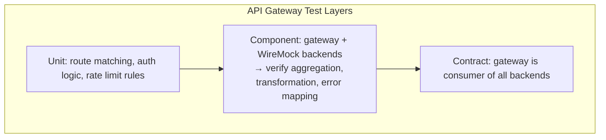

---

## 8. Quality Assurance Practices

### 8.1 Shift-Left Quality

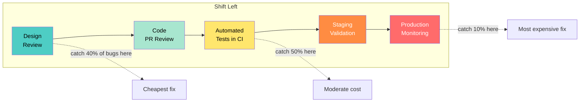

### 8.2 Quality Gates

| Gate | Check | Fail Criteria |
|---|---|---|
| **PR Review** | Code review, design alignment | < 1 approval |
| **Static Analysis** | SonarQube, CodeClimate, linters | New critical/blocker issues |
| **Test Coverage** | Line + branch coverage | Coverage drops below threshold (e.g., 80% for new code) |
| **Security** | Trivy (image), Snyk (dependencies), SAST | Critical or High CVE unaddressed |
| **Contract** | Pact "Can I Deploy?" | Any consumer contract broken |
| **Performance** | Baseline comparison (k6, Gatling) | p99 latency regresses > 20% |
| **Chaos** | Steady-state disrupted by injected failure | Service doesn't recover within SLO |

### 8.3 Observability as QA

In microservices, **production is the ultimate test environment**. Observability extends QA beyond pre-deploy:

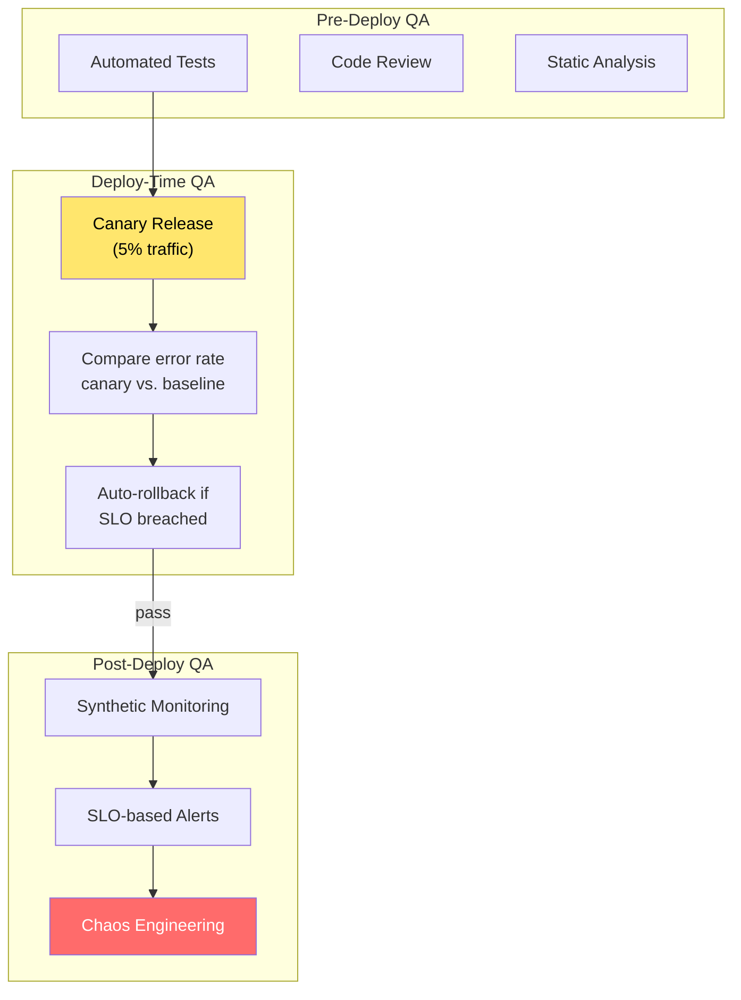

### 8.4 Canary Deployments as Quality Gate

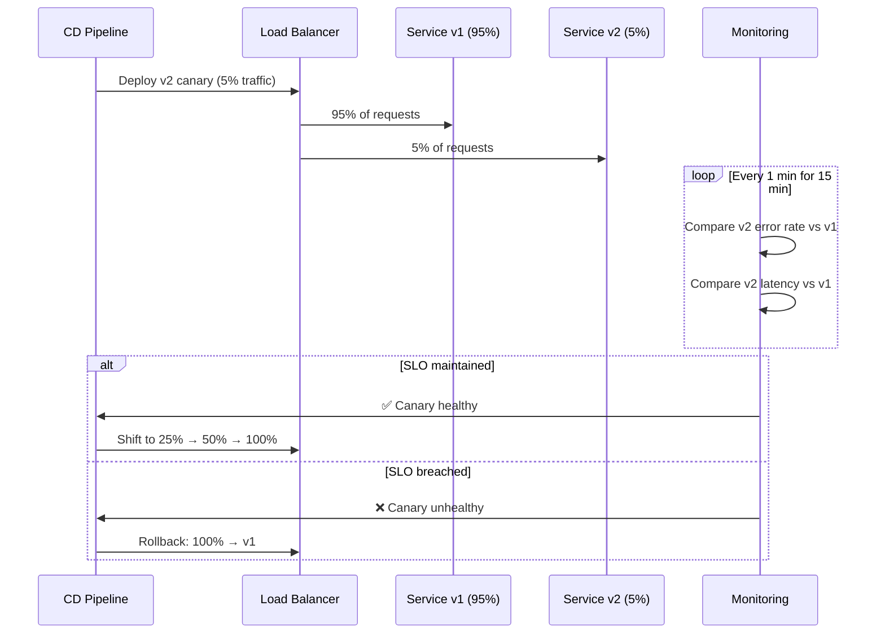

### 8.5 Chaos Engineering as QA

| Experiment | What You Learn |
|---|---|
| Kill a service instance | Does the load balancer route away? Does the circuit breaker trip? |
| Inject 500ms latency | Do upstream timeouts and retries work correctly? |
| Fill disk on database node | Does the service degrade gracefully? |
| Corrupt a Kafka message | Does the consumer dead-letter it without crashing? |
| Revoke a service's mTLS certificate | Does auth fail cleanly? Is the alert actionable? |

---

## 9. Test Data Management

### 9.1 The Problem

Each service owns its own database. Setting up test data for an E2E flow requires coordinating data across multiple services — and tearing it down afterward.

### 9.2 Strategies

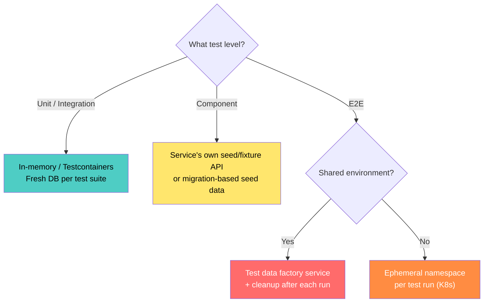

| Strategy | Mechanism | Best For |
|---|---|---|
| **Testcontainers** | Fresh database container per test suite | Integration, component tests |
| **Seed scripts** | SQL/migration that loads known state | Service-level component tests |
| **Test Data Factory** | API or service that creates valid cross-service data | E2E tests |
| **Ephemeral namespaces** | Spin up full stack in a K8s namespace, tear down after | PR-level preview environments |
| **Data masking / subsetting** | Copy production data with PII removed | Performance / load testing |
| **Self-contained test IDs** | Use unique prefixes (e.g., `test-xxx-*`) with TTL | Shared staging environments |

---

## 10. Performance & Load Testing

### 10.1 Where Performance Tests Fit

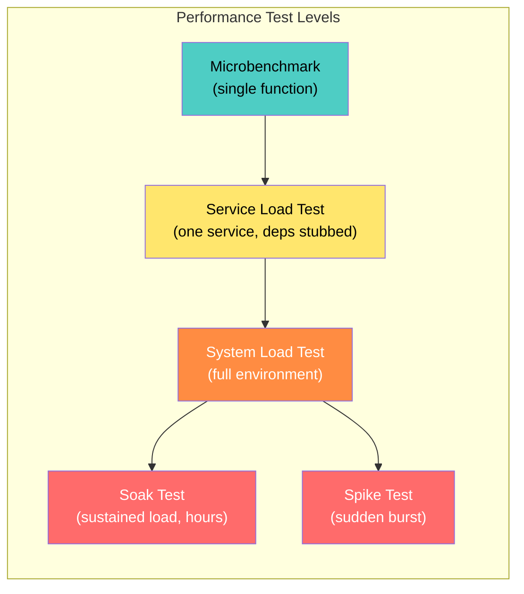

### 10.2 Load Testing in CI

```yaml
# k6 load test in CI — runs against staging
# threshold: p99 < 500ms, error rate < 1%
import http from 'k6/http';
import { check } from 'k6';

export const options = {
  stages: [
    { duration: '1m', target: 50 },   // ramp up
    { duration: '3m', target: 50 },   // sustained
    { duration: '1m', target: 0 },    // ramp down
  ],
  thresholds: {
    http_req_duration: ['p(99)<500'],
    http_req_failed: ['rate<0.01'],
  },
};

export default function () {
  const res = http.post(`${__ENV.BASE_URL}/checkout`, JSON.stringify({
    cart_id: `perf-${__ITER}`,
    payment_method: 'pm-test',
  }), { headers: { 'Content-Type': 'application/json' } });

  check(res, {
    'status is 201': (r) => r.status === 201,
    'has order_id': (r) => r.json('order_id') !== undefined,
  });
}
```

### 10.3 Performance Regression Detection

| Metric | Baseline | Current | Verdict |
|---|---|---|---|
| p50 latency | 45ms | 48ms | ✅ Within tolerance |
| p99 latency | 180ms | 420ms | ❌ **Regression > 20%** |
| Throughput | 1200 rps | 1180 rps | ✅ Within tolerance |
| Error rate | 0.1% | 0.3% | ⚠️ Warning |

Automate this comparison in CI — fail the pipeline if p99 regresses beyond threshold.

---

## 11. Flaky Test Management

### 11.1 Why Flakiness Is Worse in Microservices

- Network timeouts between services
- Container startup time variance
- Race conditions in async flows
- Shared test environment state pollution
- DNS resolution delays in Kubernetes

### 11.2 Flaky Test Strategy

```mermaid
graph TD
    A["Test fails"] --> B{"Same test, rerun"}
    B -->|"passes on retry"| C["Flag as FLAKY"]
    B -->|"fails again"| D["Real failure → fix"]

    C --> E["Quarantine: move to<br/>non-blocking suite"]
    E --> F["Track flakiness rate"]
    F -->|"> 5% flaky rate"| G["Fix or delete"]
    F -->|"< 5%"| H["Acceptable"]

    style C fill:#ffe66d,color:#000
    style E fill:#ff8c42,color:#fff
    style G fill:#ff6b6b,color:#fff
```

| Practice | Implementation |
|---|---|
| **Auto-retry** | CI retries failed tests once before declaring failure |
| **Quarantine** | Flaky tests moved to non-blocking suite; tracked in dashboard |
| **Flakiness budget** | Team goal: < 2% of tests flagged flaky |
| **Timeout discipline** | Use explicit, generous timeouts for async assertions |
| **Test isolation** | Each test creates its own data; no shared mutable state |
| **Delete over tolerate** | A permanently flaky test provides negative value — delete it |

---

## 12. Anti-Patterns

| Anti-Pattern | Problem | Fix |
|---|---|---|
| **Ice-cream cone** | More E2E than unit tests → slow, flaky, expensive | Invert: most tests at unit/contract level |
| **Shared test database** | Tests pollute each other's state | Testcontainers or ephemeral DBs per suite |
| **Mocking everything** | Tests pass but mocks drift from real service behavior | Contract tests + integration tests with real deps |
| **No contract tests** | Provider changes break consumers at deploy time | Add Pact or schema-based contracts |
| **E2E tests as the only safety net** | 45-minute pipeline, constant flakiness | Replace 80% of E2E with component + contract tests |
| **Testing implementation details** | Tests break on refactor even when behavior is unchanged | Test behavior (input → output), not internals |
| **Ignoring async testing** | "We only test the HTTP API" → message consumers untested | Add event-driven test patterns (polling, test consumers) |
| **No performance baseline** | Performance regressions discovered in production | Run k6/Gatling in CI with threshold gates |
| **Manual QA as the primary gate** | Slow releases, bottleneck on QA team | Automate: shift-left with contract + component tests |
| **Testing in production with no safety net** | Canary deploys without automated rollback | Combine canary with metric-based auto-rollback |

---

## 13. Decision Framework

```mermaid
graph TD
    START{"Starting testing<br/>strategy?"} -->|"No tests yet"| S1["Step 1: Unit + Integration<br/>(Testcontainers) in CI"]
    START -->|"Unit + Integration done"| S2["Step 2: Add contract tests<br/>(Pact or schema-based)"]
    START -->|"Contracts in place"| S3["Step 3: Component tests<br/>(WireMock) + security scans"]
    START -->|"Good test coverage"| S4["Step 4: Performance tests<br/>+ canary deploys + chaos"]

    S1 --> Q1{"How many services<br/>interact?"}
    Q1 -->|"> 3 synchronous deps"| CONTRACT_PACT["Consumer-driven contracts (Pact)"]
    Q1 -->|"API-first, many consumers"| CONTRACT_SCHEMA["Schema-based contracts (OpenAPI/Proto)"]
    Q1 -->|"Event-driven"| CONTRACT_ASYNC["AsyncAPI + schema registry"]

    S3 --> Q2{"E2E test count?"}
    Q2 -->|"> 20 E2E tests"| REDUCE["Reduce: replace with<br/>component + contract tests"]
    Q2 -->|"5-15 E2E tests"| KEEP["✅ Healthy — keep for critical paths"]

    S4 --> Q3{"Production confidence?"}
    Q3 -->|"Still finding bugs in prod"| ADD_CHAOS["Add chaos engineering"]
    Q3 -->|"Confident"| MATURE["✅ Mature QA"]
```

---

## 14. Checklist

### Test Infrastructure
- [ ] CI pipeline runs all test layers (unit → integration → contract → component)
- [ ] Testcontainers used for real database/cache/queue in integration tests
- [ ] WireMock or equivalent for stubbing external services in component tests
- [ ] Test pipeline completes in < 15 minutes per service
- [ ] Ephemeral test environments available (per-PR namespaces or Docker Compose)

### Test Coverage
- [ ] Unit tests cover domain logic, validation, calculations
- [ ] Integration tests cover all data access code (repositories, queries)
- [ ] Contract tests exist for every consumer-provider service boundary
- [ ] Component tests verify full service behavior as a black box
- [ ] E2E tests limited to 5–15 critical user journeys
- [ ] Async flows tested (event publishing, consumption, idempotency)

### Quality Gates
- [ ] "Can I Deploy?" contract check blocks incompatible deploys
- [ ] Static analysis (SonarQube/CodeClimate) in PR pipeline
- [ ] Security scanning (dependency + container image) blocks critical CVEs
- [ ] Performance baseline comparison in CI (k6/Gatling)
- [ ] Test coverage threshold enforced for new code

### Production QA
- [ ] Canary deployments with automated metric-based rollback
- [ ] Synthetic monitoring for critical user journeys
- [ ] SLO-based alerting (not threshold-based)
- [ ] Chaos experiments scheduled regularly
- [ ] Flaky test quarantine process with tracking dashboard

### Test Data
- [ ] Test isolation: no shared mutable state between tests
- [ ] Unique test data generated per run (no hard-coded IDs in shared environments)
- [ ] Test data cleanup automated (TTL or ephemeral namespaces)
- [ ] Production data subsets masked for PII before use in perf tests

---

## 15. Recommendation

**Build testing maturity in layers:**

| Phase | Focus | Key Outcome |
|---|---|---|
| **Phase 1** | Unit + Integration tests (Testcontainers) | Fast feedback on logic + data access |
| **Phase 2** | Contract tests (Pact or schema) | Safe independent deployability |
| **Phase 3** | Component tests + security scans | Full service verification in isolation |
| **Phase 4** | Performance baselines in CI | Catch regressions before production |
| **Phase 5** | Canary deploys + chaos engineering | Production is continuously validated |

The fundamental insight: **contract tests are the most important testing innovation for microservices**. They solve the core problem — "can I deploy Service A without breaking Service B?" — without the cost and flakiness of E2E tests. Start there after basic unit and integration coverage.

---

**Next steps to explore:** Consumer-Driven Contract Testing Deep Dive, Chaos Engineering & Fault Injection, CI/CD Pipeline Patterns for Microservices.