# Service Deployment & Rollback in Microservices

---

## 1. Why Deployment Is Harder in Microservices

In a monolith, deployment is one artifact to one target. In microservices, you deploy **dozens of services independently**, each with its own version, database schema, API contract, and configuration — all while the system continues serving traffic.

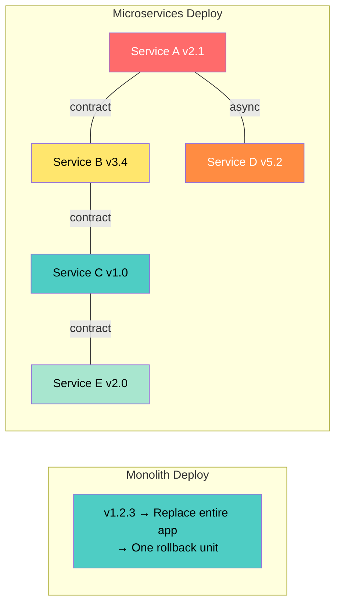
```mermaid
graph LR
    subgraph "Monolith Deploy"
        M["v1.2.3 → Replace entire app<br/>→ One rollback unit"]
    end

    subgraph "Microservices Deploy"
        A["Service A v2.1"] 
        B["Service B v3.4"]
        C["Service C v1.0"]
        D["Service D v5.2"]
        E["Service E v2.0"]
    end

    A ---|"contract"| B
    B ---|"contract"| C
    A ---|"async"| D
    C ---|"contract"| E

    style M fill:#4ecdc4,color:#000
    style A fill:#ff6b6b,color:#fff
    style B fill:#ffe66d,color:#000
    style C fill:#4ecdc4,color:#000
    style D fill:#ff8c42,color:#fff
    style E fill:#a8e6cf,color:#000
```

| Challenge | Why It's Hard |
|---|---|
| **Independent timelines** | Service A deploys v3 while Service B still expects v2 API |
| **Distributed state** | Database migrations must be backward-compatible |
| **Partial failures** | Service C deploy fails but A and B already updated |
| **Zero-downtime requirement** | Users don't tolerate "maintenance windows" |
| **Rollback scope** | Rolling back Service A may require rolling back its schema migration too |
| **Configuration drift** | New version needs new config keys, feature flags, secrets |

---

## 2. Deployment Strategies

### 2.1 Strategy Overview

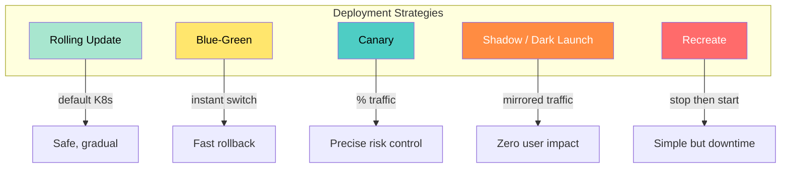
```mermaid
graph TB
    subgraph "Deployment Strategies"
        RR["Rolling Update"]
        BG["Blue-Green"]
        CAN["Canary"]
        SHADOW["Shadow / Dark Launch"]
        REC["Recreate"]
    end

    RR -->|"default K8s"| SAFE["Safe, gradual"]
    BG -->|"instant switch"| FAST["Fast rollback"]
    CAN -->|"% traffic"| PRECISE["Precise risk control"]
    SHADOW -->|"mirrored traffic"| ZERO["Zero user impact"]
    REC -->|"stop then start"| SIMPLE["Simple but downtime"]

    style CAN fill:#4ecdc4,color:#000
    style BG fill:#ffe66d,color:#000
    style RR fill:#a8e6cf,color:#000
    style SHADOW fill:#ff8c42,color:#fff
    style REC fill:#ff6b6b,color:#fff
```

### 2.2 Rolling Update

The **default** Kubernetes deployment strategy. Gradually replaces old pods with new ones.

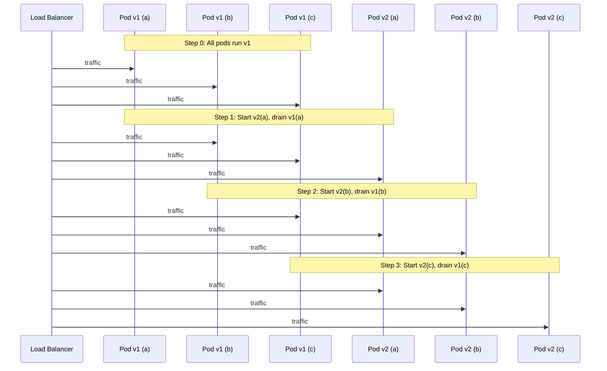
```mermaid
sequenceDiagram
    participant LB as Load Balancer
    participant V1a as Pod v1 (a)
    participant V1b as Pod v1 (b)
    participant V1c as Pod v1 (c)
    participant V2a as Pod v2 (a)
    participant V2b as Pod v2 (b)
    participant V2c as Pod v2 (c)

    Note over V1a,V1c: Step 0: All pods run v1
    LB->>V1a: traffic
    LB->>V1b: traffic
    LB->>V1c: traffic

    Note over V1a,V2a: Step 1: Start v2(a), drain v1(a)
    LB->>V1b: traffic
    LB->>V1c: traffic
    LB->>V2a: traffic

    Note over V1b,V2b: Step 2: Start v2(b), drain v1(b)
    LB->>V1c: traffic
    LB->>V2a: traffic
    LB->>V2b: traffic

    Note over V1c,V2c: Step 3: Start v2(c), drain v1(c)
    LB->>V2a: traffic
    LB->>V2b: traffic
    LB->>V2c: traffic
```

```yaml
# Kubernetes Deployment — Rolling Update
apiVersion: apps/v1
kind: Deployment
metadata:
  name: order-service
spec:
  replicas: 3
  strategy:
    type: RollingUpdate
    rollingUpdate:
      maxUnavailable: 1    # at most 1 pod down during update
      maxSurge: 1           # at most 1 extra pod during update
  template:
    spec:
      containers:
        - name: order-service
          image: order-service:v2.1.0
          readinessProbe:
            httpGet:
              path: /readyz
              port: 8080
            initialDelaySeconds: 5
            periodSeconds: 5
          livenessProbe:
            httpGet:
              path: /healthz
              port: 8080
            initialDelaySeconds: 15
            periodSeconds: 10
```

| Pros | Cons |
|---|---|
| Zero downtime | v1 and v2 run simultaneously (must be compatible) |
| Built into Kubernetes | Rollback is another rolling update (not instant) |
| Simple configuration | No traffic control granularity |

### 2.3 Blue-Green Deployment

Maintain two identical production environments. Route 100% of traffic from blue (current) to green (new) in one switch.

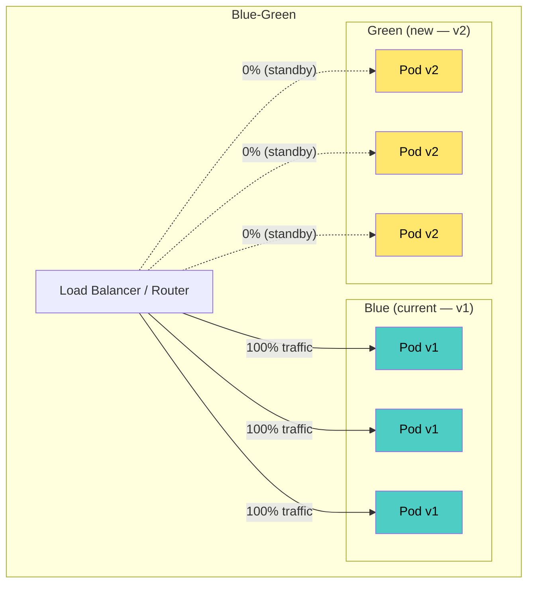
```mermaid
graph TB
    subgraph "Blue-Green"
        LB["Load Balancer / Router"]
        subgraph "Blue (current — v1)"
            B1["Pod v1"]
            B2["Pod v1"]
            B3["Pod v1"]
        end
        subgraph "Green (new — v2)"
            G1["Pod v2"]
            G2["Pod v2"]
            G3["Pod v2"]
        end
    end

    LB -->|"100% traffic"| B1
    LB -->|"100% traffic"| B2
    LB -->|"100% traffic"| B3
    LB -.->|"0% (standby)"| G1
    LB -.->|"0% (standby)"| G2
    LB -.->|"0% (standby)"| G3

    style B1 fill:#4ecdc4,color:#000
    style B2 fill:#4ecdc4,color:#000
    style B3 fill:#4ecdc4,color:#000
    style G1 fill:#ffe66d,color:#000
    style G2 fill:#ffe66d,color:#000
    style G3 fill:#ffe66d,color:#000
```

**After verification:**

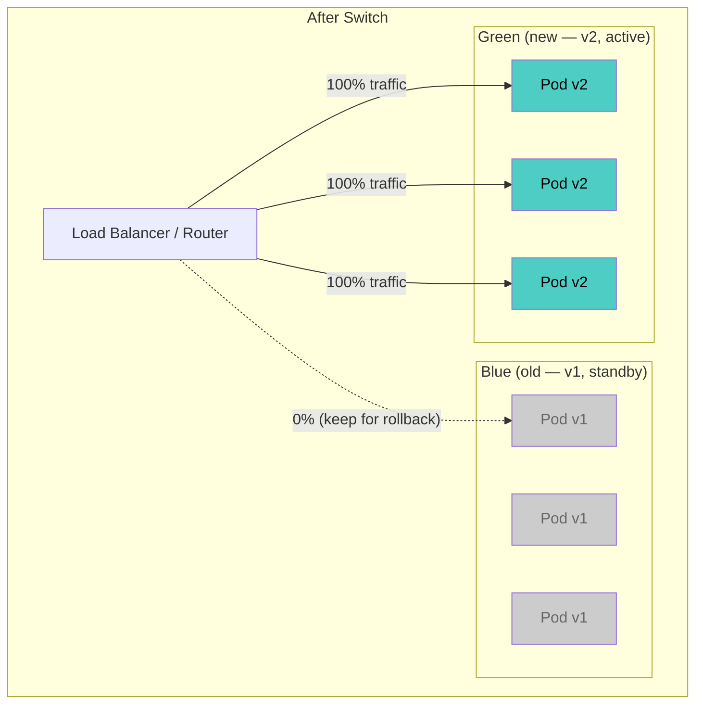
```mermaid
graph TB
    subgraph "After Switch"
        LB2["Load Balancer / Router"]
        subgraph "Blue (old — v1, standby)"
            B4["Pod v1"]
            B5["Pod v1"]
            B6["Pod v1"]
        end
        subgraph "Green (new — v2, active)"
            G4["Pod v2"]
            G5["Pod v2"]
            G6["Pod v2"]
        end
    end

    LB2 -.->|"0% (keep for rollback)"| B4
    LB2 -->|"100% traffic"| G4
    LB2 -->|"100% traffic"| G5
    LB2 -->|"100% traffic"| G6

    style B4 fill:#ccc,color:#666
    style B5 fill:#ccc,color:#666
    style B6 fill:#ccc,color:#666
    style G4 fill:#4ecdc4,color:#000
    style G5 fill:#4ecdc4,color:#000
    style G6 fill:#4ecdc4,color:#000
```

| Pros | Cons |
|---|---|
| Instant rollback (switch back to blue) | Double infrastructure cost during deployment |
| Full environment tested before routing traffic | Database schema changes complicate the switch |
| No mixed-version traffic | Requires sophisticated routing layer |

**Implementation with Kubernetes Services:**

```yaml
# Route traffic by switching service selector
apiVersion: v1
kind: Service
metadata:
  name: order-service
spec:
  selector:
    app: order-service
    version: green      # ← flip to "blue" for rollback
  ports:
    - port: 80
      targetPort: 8080
```

### 2.4 Canary Deployment

Route a small percentage of production traffic to the new version. Gradually increase if metrics are healthy.

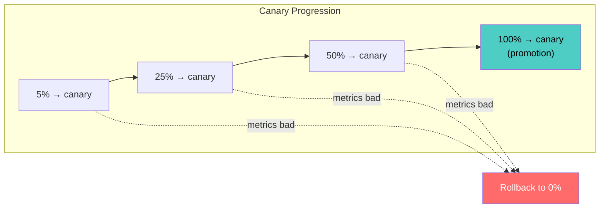
```mermaid
graph LR
    subgraph "Canary Progression"
        S1["5% → canary"] --> S2["25% → canary"]
        S2 --> S3["50% → canary"]
        S3 --> S4["100% → canary<br/>(promotion)"]
    end

    S1 -.->|"metrics bad"| RB["Rollback to 0%"]
    S2 -.->|"metrics bad"| RB
    S3 -.->|"metrics bad"| RB

    style S4 fill:#4ecdc4,color:#000
    style RB fill:#ff6b6b,color:#fff
```

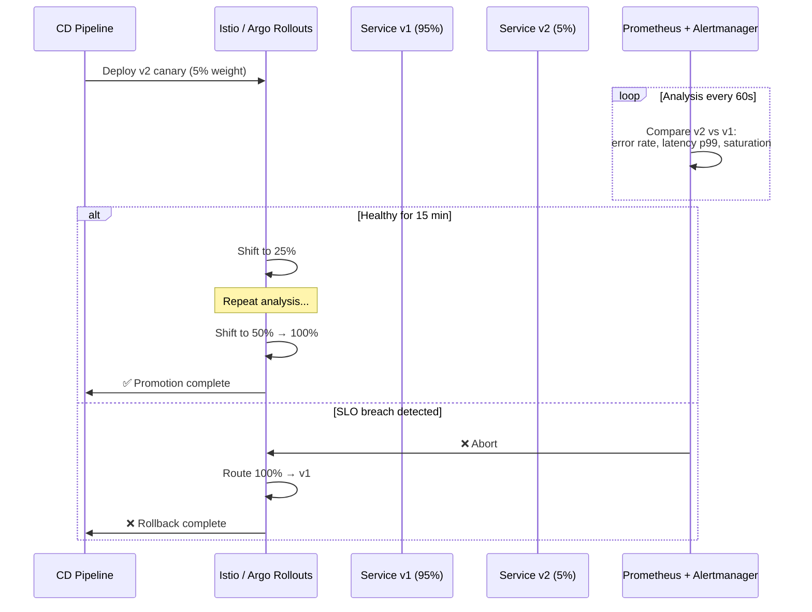
```mermaid
sequenceDiagram
    participant CD as CD Pipeline
    participant MESH as Istio / Argo Rollouts
    participant V1 as Service v1 (95%)
    participant V2 as Service v2 (5%)
    participant MON as Prometheus + Alertmanager

    CD->>MESH: Deploy v2 canary (5% weight)
    
    loop Analysis every 60s
        MON->>MON: Compare v2 vs v1:<br/>error rate, latency p99, saturation
    end

    alt Healthy for 15 min
        MESH->>MESH: Shift to 25%
        Note over MESH: Repeat analysis...
        MESH->>MESH: Shift to 50% → 100%
        MESH->>CD: ✅ Promotion complete
    else SLO breach detected
        MON->>MESH: ❌ Abort
        MESH->>MESH: Route 100% → v1
        MESH->>CD: ❌ Rollback complete
    end
```

**Argo Rollouts canary definition:**

```yaml
apiVersion: argoproj.io/v1alpha1
kind: Rollout
metadata:
  name: order-service
spec:
  strategy:
    canary:
      steps:
        - setWeight: 5
        - pause: { duration: 5m }
        - analysis:
            templates:
              - templateName: success-rate
            args:
              - name: service-name
                value: order-service
        - setWeight: 25
        - pause: { duration: 10m }
        - analysis:
            templates:
              - templateName: success-rate
        - setWeight: 50
        - pause: { duration: 10m }
        - setWeight: 100
      rollbackWindow:
        revisions: 2
```

**Canary analysis template:**

```yaml
apiVersion: argoproj.io/v1alpha1
kind: AnalysisTemplate
metadata:
  name: success-rate
spec:
  metrics:
    - name: success-rate
      interval: 60s
      failureLimit: 3
      successCondition: result[0] >= 0.99
      provider:
        prometheus:
          address: http://prometheus:9090
          query: |
            sum(rate(http_requests_total{
              app="{{args.service-name}}",
              status!~"5.."
            }[5m]))
            /
            sum(rate(http_requests_total{
              app="{{args.service-name}}"
            }[5m]))
```

| Pros | Cons |
|---|---|
| Real production traffic validates the release | Requires traffic splitting (mesh / ingress) |
| Automated metric-based promotion/rollback | Canary analysis needs well-defined SLOs |
| Minimal blast radius (5% traffic) | Stateful services need careful handling |

### 2.5 Shadow (Dark Launch) Deployment

Mirror production traffic to the new version — but discard responses. No user impact.

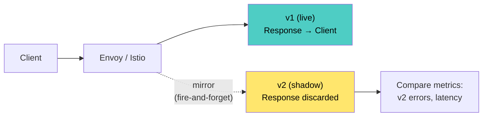
```mermaid
graph LR
    CLIENT["Client"] --> PROXY["Envoy / Istio"]
    PROXY --> PROD["v1 (live)<br/>Response → Client"]
    PROXY -.->|"mirror<br/>(fire-and-forget)"| SHADOW["v2 (shadow)<br/>Response discarded"]

    SHADOW --> METRICS["Compare metrics:<br/>v2 errors, latency"]

    style PROD fill:#4ecdc4,color:#000
    style SHADOW fill:#ffe66d,color:#000
```

| Pros | Cons |
|---|---|
| Zero risk — no user sees v2 responses | Double the backend load |
| Test with real traffic patterns | Side effects (DB writes, API calls) must be suppressed |
| Catch performance regressions before exposure | Complex to set up correctly |

### 2.6 Strategy Comparison

| Dimension | Rolling Update | Blue-Green | Canary | Shadow |
|---|---|---|---|---|
| **Downtime** | Zero | Zero | Zero | Zero |
| **Rollback speed** | Minutes (new rolling update) | Seconds (switch route) | Seconds (shift weight) | N/A (no exposure) |
| **Infrastructure cost** | 1x + surge | 2x during deploy | 1x + small canary set | 2x during test |
| **Traffic control** | None (all-or-nothing per pod) | All-or-nothing (entire env) | Fine-grained (% weight) | Mirrored |
| **Risk** | Medium (mixed versions) | Low (instant rollback) | Very low (small blast radius) | None |
| **Complexity** | Low | Medium | High | High |
| **Best for** | Default / simple services | Databases, stateful services | Critical user-facing services | Major refactors, new backends |

---

## 3. Rollback Strategies

### 3.1 Rollback Decision Tree

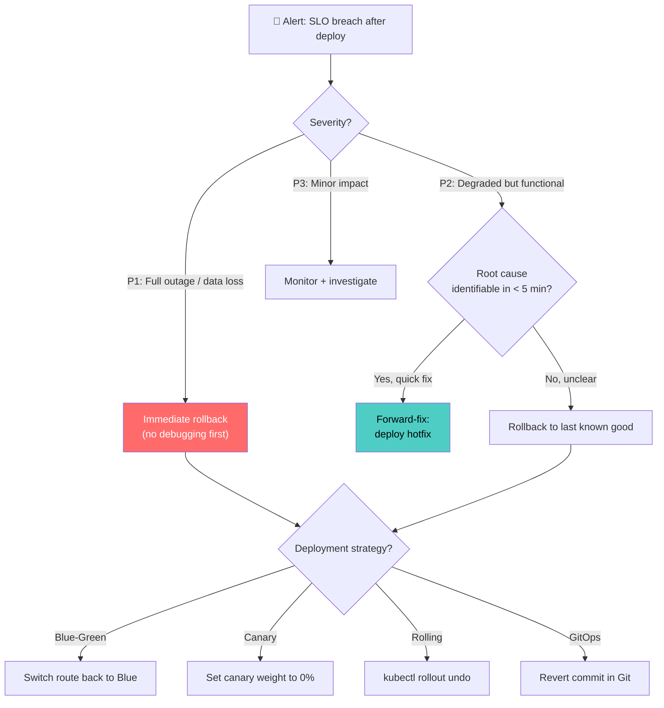
```mermaid
graph TD
    ALERT["🔴 Alert: SLO breach after deploy"] --> ASSESS{"Severity?"}
    
    ASSESS -->|"P1: Full outage / data loss"| IMMEDIATE["Immediate rollback<br/>(no debugging first)"]
    ASSESS -->|"P2: Degraded but functional"| INVESTIGATE{"Root cause<br/>identifiable in < 5 min?"}
    ASSESS -->|"P3: Minor impact"| MONITOR["Monitor + investigate"]

    INVESTIGATE -->|"Yes, quick fix"| FORWARD["Forward-fix:<br/>deploy hotfix"]
    INVESTIGATE -->|"No, unclear"| ROLLBACK["Rollback to last known good"]

    IMMEDIATE --> HOW{"Deployment strategy?"}
    ROLLBACK --> HOW

    HOW -->|"Blue-Green"| BG_RB["Switch route back to Blue"]
    HOW -->|"Canary"| CAN_RB["Set canary weight to 0%"]
    HOW -->|"Rolling"| ROLL_RB["kubectl rollout undo"]
    HOW -->|"GitOps"| GIT_RB["Revert commit in Git"]

    style IMMEDIATE fill:#ff6b6b,color:#fff
    style FORWARD fill:#4ecdc4,color:#000
```

### 3.2 Rollback Mechanisms

#### Kubernetes Native Rollback

```bash
# Rollback to previous revision
kubectl rollout undo deployment/order-service

# Rollback to specific revision
kubectl rollout undo deployment/order-service --to-revision=3

# Check rollout history
kubectl rollout history deployment/order-service

# Pause a problematic rollout mid-way
kubectl rollout pause deployment/order-service

# Resume after fixing
kubectl rollout resume deployment/order-service
```

#### GitOps Rollback (Argo CD / Flux)

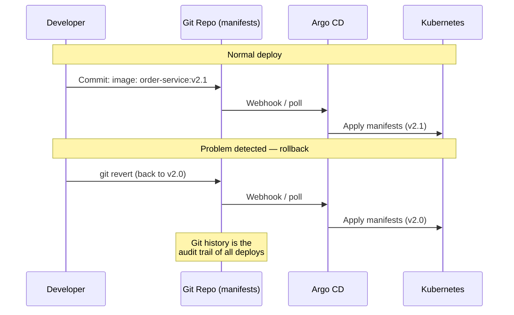
```mermaid
sequenceDiagram
    participant DEV as Developer
    participant GIT as Git Repo (manifests)
    participant ARGO as Argo CD
    participant K8S as Kubernetes

    Note over DEV,K8S: Normal deploy
    DEV->>GIT: Commit: image: order-service:v2.1
    GIT->>ARGO: Webhook / poll
    ARGO->>K8S: Apply manifests (v2.1)
    
    Note over DEV,K8S: Problem detected — rollback
    DEV->>GIT: git revert (back to v2.0)
    GIT->>ARGO: Webhook / poll
    ARGO->>K8S: Apply manifests (v2.0)
    
    Note over GIT: Git history is the<br/>audit trail of all deploys
```

**GitOps rollback is a `git revert`** — not a `kubectl` command. The Git repo is the source of truth.

#### Argo Rollouts Automated Rollback

```yaml
# Automatic rollback on analysis failure
spec:
  strategy:
    canary:
      steps:
        - setWeight: 10
        - analysis:
            templates:
              - templateName: success-rate
        - setWeight: 50
        - analysis:
            templates:
              - templateName: success-rate
        - setWeight: 100
      # If any analysis fails → automatic rollback
      abortScaleDownDelaySeconds: 30
      rollbackWindow:
        revisions: 3    # keep 3 revisions for rollback
```

### 3.3 Rollback vs. Roll-Forward

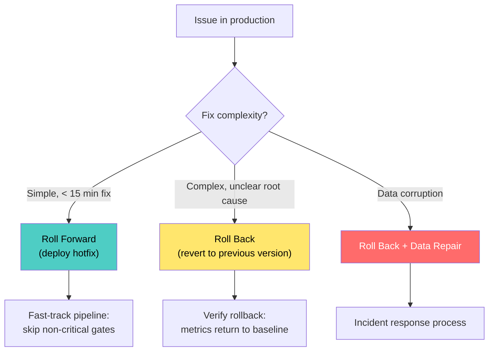
```mermaid
graph TD
    ISSUE["Issue in production"] --> DECIDE{"Fix complexity?"}
    
    DECIDE -->|"Simple, < 15 min fix"| FORWARD["Roll Forward<br/>(deploy hotfix)"]
    DECIDE -->|"Complex, unclear root cause"| BACK["Roll Back<br/>(revert to previous version)"]
    DECIDE -->|"Data corruption"| BOTH["Roll Back + Data Repair"]
    
    FORWARD --> FDEPLOY["Fast-track pipeline:<br/>skip non-critical gates"]
    BACK --> BVERIFY["Verify rollback:<br/>metrics return to baseline"]
    BOTH --> INCIDENT["Incident response process"]

    style FORWARD fill:#4ecdc4,color:#000
    style BACK fill:#ffe66d,color:#000
    style BOTH fill:#ff6b6b,color:#fff
```

| Approach | When | Advantage | Risk |
|---|---|---|---|
| **Roll back** | Unknown root cause, data risk, severe impact | Fast (seconds with blue-green/canary) | May lose new features/data |
| **Roll forward** | Simple bug, known fix, low severity | No revert complexity | Fix might introduce new bugs |
| **Emergency hotfix** | Critical but well-understood bug | Targeted, minimal change | Skips full test pipeline |

---

## 4. Database Migration & Deployment

### 4.1 The Fundamental Problem

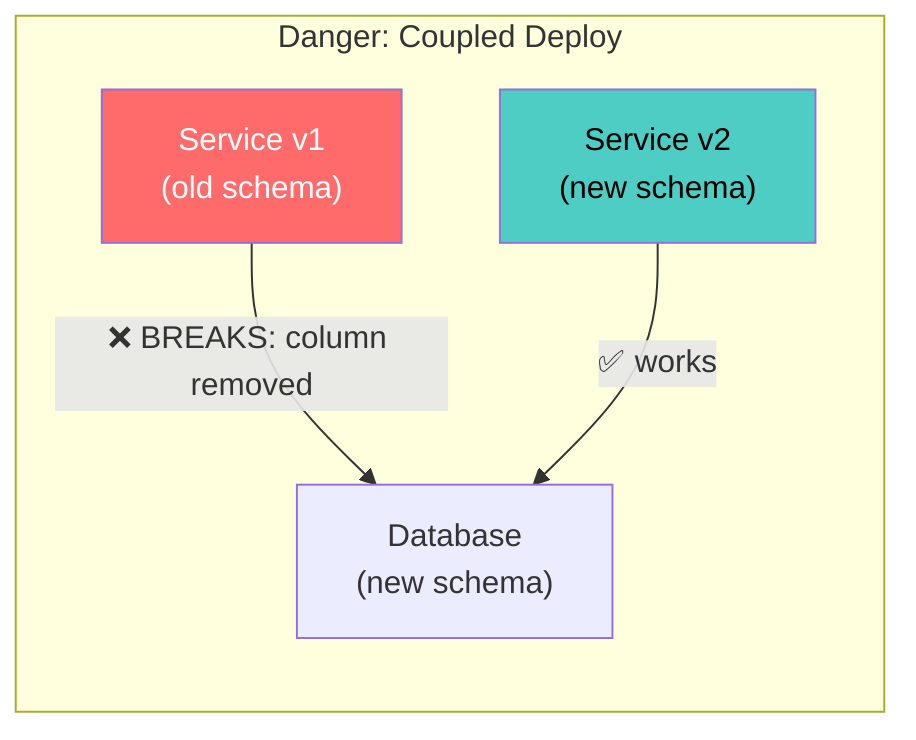
```mermaid
graph LR
    subgraph "Danger: Coupled Deploy"
        V1["Service v1<br/>(old schema)"]
        DB["Database<br/>(new schema)"]
        V2["Service v2<br/>(new schema)"]
    end

    V1 -->|"❌ BREAKS: column removed"| DB
    V2 -->|"✅ works"| DB

    style V1 fill:#ff6b6b,color:#fff
    style V2 fill:#4ecdc4,color:#000
```

During a rolling update, **v1 and v2 pods run simultaneously**. If the migration removes a column that v1 needs → crash.

### 4.2 Expand-Contract (Parallel Change) Pattern

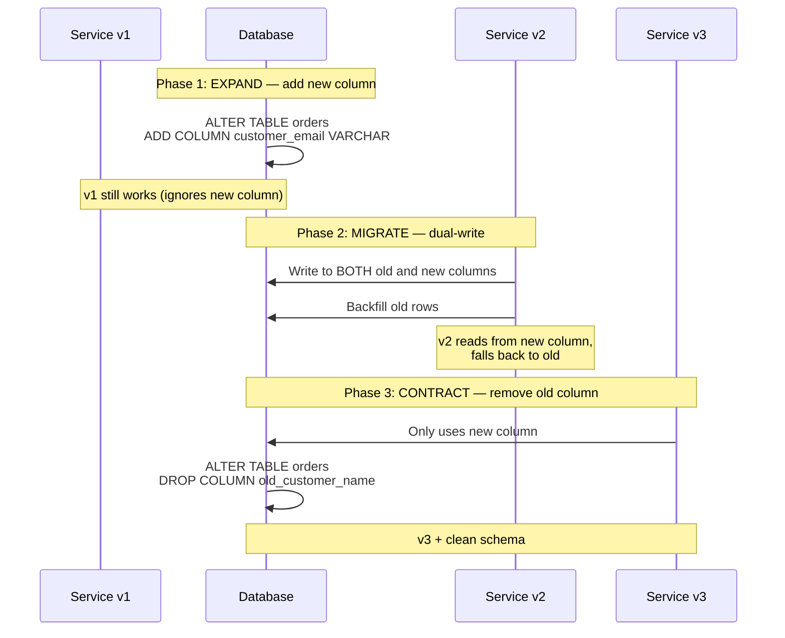
```mermaid
sequenceDiagram
    participant V1 as Service v1
    participant DB as Database
    participant V2 as Service v2
    participant V3 as Service v3

    Note over DB: Phase 1: EXPAND — add new column
    DB->>DB: ALTER TABLE orders<br/>ADD COLUMN customer_email VARCHAR
    Note over V1,DB: v1 still works (ignores new column)

    Note over V2,DB: Phase 2: MIGRATE — dual-write
    V2->>DB: Write to BOTH old and new columns
    V2->>DB: Backfill old rows
    Note over V2: v2 reads from new column,<br/>falls back to old

    Note over V3,DB: Phase 3: CONTRACT — remove old column
    V3->>DB: Only uses new column
    DB->>DB: ALTER TABLE orders<br/>DROP COLUMN old_customer_name
    Note over V3,DB: v3 + clean schema
```

### 4.3 Safe Migration Rules

| Rule | Example |
|---|---|
| **Never remove a column until no running version uses it** | Drop `old_col` only after v1 is fully decommissioned |
| **Never rename — add new + migrate + drop old** | `customer_name` → add `customer_email` → backfill → drop `customer_name` |
| **Never add NOT NULL without default** | `ADD COLUMN status VARCHAR NOT NULL DEFAULT 'active'` |
| **Migrations must be backward-compatible** | v1 and v2 must both work with the migrated schema |
| **Separate deploy from migrate** | Run migration *before* deploying the new version |
| **Make migrations idempotent** | Re-running the same migration is a no-op |

### 4.4 Migration Deployment Sequence

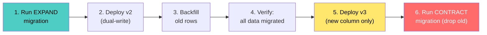
```mermaid
graph LR
    M1["1. Run EXPAND<br/>migration"] --> D1["2. Deploy v2<br/>(dual-write)"]
    D1 --> BF["3. Backfill<br/>old rows"]
    BF --> VERIFY["4. Verify:<br/>all data migrated"]
    VERIFY --> D2["5. Deploy v3<br/>(new column only)"]
    D2 --> M2["6. Run CONTRACT<br/>migration (drop old)"]

    style M1 fill:#4ecdc4,color:#000
    style D2 fill:#ffe66d,color:#000
    style M2 fill:#ff6b6b,color:#fff
```

**Each step is independently deployable and rollback-safe.** If v2 fails → rollback v2, the expanded schema is harmless. If v3 fails → rollback v3, v2 still works with the expanded schema.

---

## 5. Feature Flags & Progressive Delivery

### 5.1 Decouple Deploy from Release

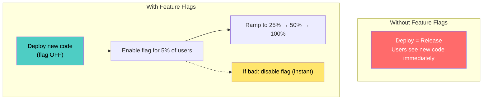
```mermaid
graph TD
    subgraph "Without Feature Flags"
        DEPLOY1["Deploy = Release<br/>Users see new code immediately"]
    end

    subgraph "With Feature Flags"
        DEPLOY2["Deploy new code<br/>(flag OFF)"]
        ENABLE["Enable flag for 5% of users"]
        RAMP["Ramp to 25% → 50% → 100%"]
        KILL["If bad: disable flag (instant)"]
    end

    DEPLOY2 --> ENABLE --> RAMP
    ENABLE -.-> KILL

    style DEPLOY1 fill:#ff6b6b,color:#fff
    style DEPLOY2 fill:#4ecdc4,color:#000
    style KILL fill:#ffe66d,color:#000
```

```python
# Feature flag check in code
from flagsmith import Flagsmith  # or LaunchDarkly, Unleash, etc.

def checkout(cart, user):
    if feature_flags.is_enabled("new-payment-flow", user_id=user.id):
        return new_payment_flow(cart, user)
    else:
        return legacy_payment_flow(cart, user)
```

### 5.2 Feature Flags + Canary = Progressive Delivery

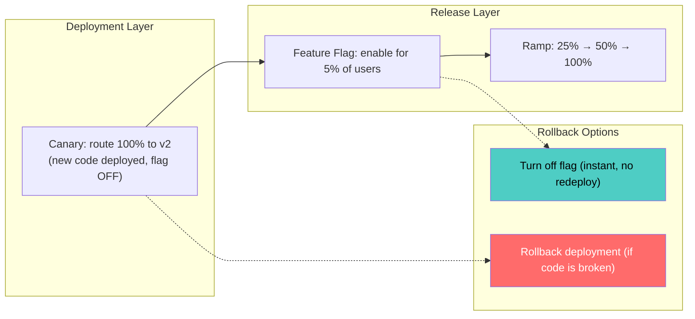
```mermaid
graph LR
    subgraph "Deployment Layer"
        CAN["Canary: route 100% to v2<br/>(new code deployed, flag OFF)"]
    end

    subgraph "Release Layer"
        FF["Feature Flag: enable for 5% of users"]
        RAMP2["Ramp: 25% → 50% → 100%"]
    end

    subgraph "Rollback Options"
        RB_FLAG["Turn off flag (instant, no redeploy)"]
        RB_CANARY["Rollback deployment (if code is broken)"]
    end

    CAN --> FF --> RAMP2
    FF -.-> RB_FLAG
    CAN -.-> RB_CANARY

    style RB_FLAG fill:#4ecdc4,color:#000
    style RB_CANARY fill:#ff6b6b,color:#fff
```

| Concern | Canary Handles | Feature Flag Handles |
|---|---|---|
| Code crashes, memory leaks | ✅ | ❌ |
| New feature UX is bad | ❌ | ✅ |
| Performance regression | ✅ | Partially |
| Business logic bug | ❌ | ✅ (disable feature) |
| Infrastructure compatibility | ✅ | ❌ |

**Best practice:** Use both. Canary validates the *deployment is healthy*. Feature flags control *which users see new behavior*.

---

## 6. CI/CD Pipeline Architecture

### 6.1 Per-Service Pipeline

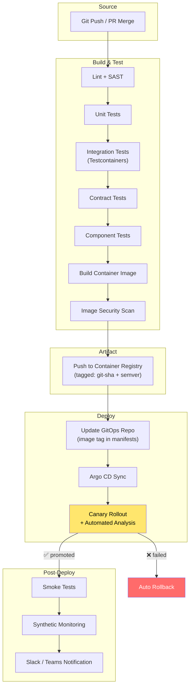
```mermaid
graph TB
    subgraph "Source"
        GIT["Git Push / PR Merge"]
    end

    subgraph "Build & Test"
        LINT["Lint + SAST"]
        UNIT["Unit Tests"]
        INT["Integration Tests<br/>(Testcontainers)"]
        CONTRACT["Contract Tests"]
        COMP["Component Tests"]
        BUILD["Build Container Image"]
        SCAN["Image Security Scan"]
    end

    subgraph "Artifact"
        REG["Push to Container Registry<br/>(tagged: git-sha + semver)"]
    end

    subgraph "Deploy"
        UPDATE["Update GitOps Repo<br/>(image tag in manifests)"]
        ARGO["Argo CD Sync"]
        CANARY["Canary Rollout<br/>+ Automated Analysis"]
    end

    subgraph "Post-Deploy"
        SMOKE["Smoke Tests"]
        SYNTH["Synthetic Monitoring"]
        NOTIFY["Slack / Teams Notification"]
    end

    GIT --> LINT --> UNIT --> INT --> CONTRACT --> COMP --> BUILD --> SCAN --> REG
    REG --> UPDATE --> ARGO --> CANARY
    CANARY -->|"✅ promoted"| SMOKE --> SYNTH --> NOTIFY
    CANARY -->|"❌ failed"| ROLLBACK["Auto Rollback"]

    style CANARY fill:#ffe66d,color:#000
    style ROLLBACK fill:#ff6b6b,color:#fff
```

### 6.2 GitOps Model

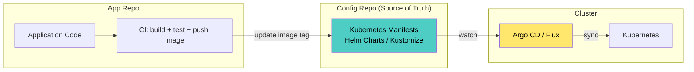
```mermaid
graph LR
    subgraph "App Repo"
        CODE["Application Code"]
        CI["CI: build + test + push image"]
    end

    subgraph "Config Repo (Source of Truth)"
        MANIFESTS["Kubernetes Manifests<br/>Helm Charts / Kustomize"]
    end

    subgraph "Cluster"
        ARGOCD["Argo CD / Flux"]
        K8S["Kubernetes"]
    end

    CODE --> CI -->|"update image tag"| MANIFESTS
    MANIFESTS -->|"watch"| ARGOCD -->|"sync"| K8S

    style MANIFESTS fill:#4ecdc4,color:#000
    style ARGOCD fill:#ffe66d,color:#000
```

**Key GitOps principles:**

| Principle | Meaning |
|---|---|
| **Declarative** | Desired state in Git, not imperative scripts |
| **Versioned** | Git history = deployment history = audit log |
| **Automated** | Argo CD / Flux reconciles cluster to match Git |
| **Self-healing** | Manual `kubectl` changes get reverted to match Git |

### 6.3 Image Tagging Strategy

| Strategy | Tag Format | Pros | Cons |
|---|---|---|---|
| **Git SHA** | `order-service:a1b2c3d` | Immutable, traceable to commit | Not human-readable |
| **Semver** | `order-service:v2.1.3` | Clear versioning | Must manage tag bumps |
| **Semver + SHA** | `order-service:v2.1.3-a1b2c3d` | Both readable and traceable | Longer tag |
| **`latest`** | `order-service:latest` | ❌ Never in production | Mutable, non-reproducible |

**Rule: Never use `:latest` or mutable tags in production manifests.** Every deploy must point to an immutable, traceable image.

---

## 7. Zero-Downtime Deployment Mechanics

### 7.1 Graceful Shutdown

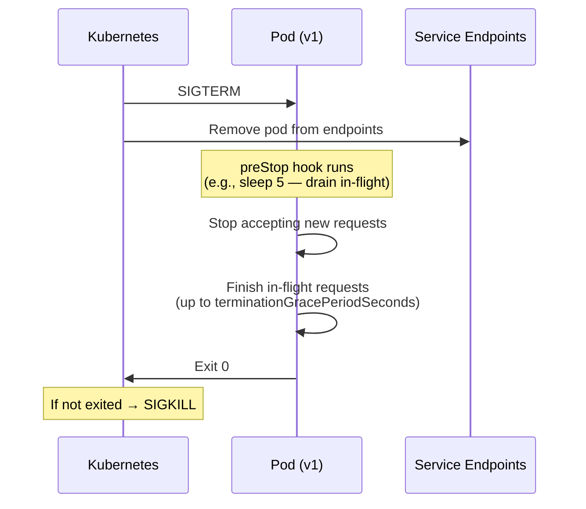
```mermaid
sequenceDiagram
    participant K8S as Kubernetes
    participant POD as Pod (v1)
    participant LB as Service Endpoints

    K8S->>POD: SIGTERM
    K8S->>LB: Remove pod from endpoints
    Note over POD: preStop hook runs<br/>(e.g., sleep 5 — drain in-flight)
    POD->>POD: Stop accepting new requests
    POD->>POD: Finish in-flight requests<br/>(up to terminationGracePeriodSeconds)
    POD->>K8S: Exit 0
    Note over K8S: If not exited → SIGKILL
```

```yaml
spec:
  terminationGracePeriodSeconds: 60
  containers:
    - name: order-service
      lifecycle:
        preStop:
          exec:
            command: ["sh", "-c", "sleep 5"]  # allow LB to drain
```

### 7.2 Readiness Gates

The new pod must pass its **readiness probe** before Kubernetes routes traffic to it. This prevents sending requests to a pod that hasn't finished starting.

```yaml
readinessProbe:
  httpGet:
    path: /readyz
    port: 8080
  initialDelaySeconds: 5
  periodSeconds: 3
  failureThreshold: 3

# Pod is only added to Service endpoints
# AFTER readiness probe passes
```

### 7.3 Pod Disruption Budgets

Prevent Kubernetes from killing too many pods at once during node drains or cluster upgrades:

```yaml
apiVersion: policy/v1
kind: PodDisruptionBudget
metadata:
  name: order-service-pdb
spec:
  minAvailable: 2       # always keep at least 2 pods running
  # OR: maxUnavailable: 1
  selector:
    matchLabels:
      app: order-service
```

### 7.4 Connection Draining Sequence

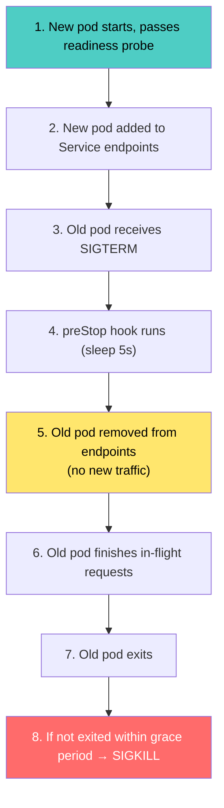
```mermaid
graph TD
    A["1. New pod starts, passes readiness probe"] --> B["2. New pod added to Service endpoints"]
    B --> C["3. Old pod receives SIGTERM"]
    C --> D["4. preStop hook runs (sleep 5s)"]
    D --> E["5. Old pod removed from endpoints<br/>(no new traffic)"]
    E --> F["6. Old pod finishes in-flight requests"]
    F --> G["7. Old pod exits"]
    G --> H["8. If not exited within grace period → SIGKILL"]

    style A fill:#4ecdc4,color:#000
    style E fill:#ffe66d,color:#000
    style H fill:#ff6b6b,color:#fff
```

---

## 8. Multi-Service Deployment Coordination

### 8.1 Independent Deployability (The Goal)

```mermaid
graph TD
    GOAL["Each service deploys independently<br/>at any time without coordinating"] --> HOW{"How?"}

    HOW --> C1["API versioning<br/>(backward-compatible changes)"]
    HOW --> C2["Contract tests<br/>(Pact 'Can I Deploy?')"]
    HOW --> C3["Feature flags<br/>(decouple deploy from release)"]
    HOW --> C4["Expand-contract migrations<br/>(schema compatibility)"]

    style GOAL fill:#4ecdc4,color:#000
```

### 8.2 When Coordination Is Needed

Despite the goal of independence, some changes require coordination:

| Scenario | Coordination Pattern |
|---|---|
| Breaking API change | Consumer-first: deploy consumers that handle both old+new, then deploy provider |
| Shared schema change (event) | Schema registry with compatibility mode (backward, forward, full) |
| Infrastructure migration (e.g., new message broker) | Dual-write to both old and new broker, then cut over consumers |
| Multi-service feature launch | Feature flag: deploy all services with flag OFF, then enable atomically |

### 8.3 Deployment Ordering for Breaking Changes

```mermaid
sequenceDiagram
    participant C as Consumer (Order Service)
    participant P as Provider (Payment Service)
    participant FF as Feature Flag

    Note over C,P: Step 1: Deploy consumer that handles BOTH v1 and v2 API
    C->>C: Deploy v2: handles PaymentResponse v1 + v2
    
    Note over P: Step 2: Deploy provider with new API
    P->>P: Deploy v2: returns PaymentResponse v2
    
    Note over C: Step 3: Clean up consumer
    C->>C: Deploy v3: remove v1 handling code

    Note over C,P: Alternative: use feature flag
    C->>FF: Check flag → use v1 or v2 client
    P->>FF: Check flag → return v1 or v2 response
    FF->>FF: Enable v2 for all → flag cleanup
```

---

## 9. Rollback Complications & Solutions

### 9.1 Rollback Scenarios

```mermaid
graph TD
    subgraph "Easy Rollback"
        E1["Code-only change<br/>(no schema migration)"]
        E2["Feature flag change<br/>(toggle off)"]
        E3["Blue-green<br/>(switch route)"]
    end

    subgraph "Hard Rollback"
        H1["Schema migration applied<br/>(column added/renamed)"]
        H2["Data format changed<br/>(events in queue)"]
        H3["External API contract<br/>already consumed by partners"]
    end

    subgraph "Very Hard Rollback"
        V1["Data corruption<br/>(invalid writes)"]
        V2["Multi-service<br/>coordinated deploy"]
        V3["Financial transactions<br/>already processed"]
    end

    style E1 fill:#4ecdc4,color:#000
    style E2 fill:#4ecdc4,color:#000
    style E3 fill:#4ecdc4,color:#000
    style H1 fill:#ffe66d,color:#000
    style H2 fill:#ffe66d,color:#000
    style H3 fill:#ffe66d,color:#000
    style V1 fill:#ff6b6b,color:#fff
    style V2 fill:#ff6b6b,color:#fff
    style V3 fill:#ff6b6b,color:#fff
```

### 9.2 Schema Rollback

If you followed expand-contract, schema rollback is safe:

```
State after EXPAND migration:
  Table has BOTH old and new columns
  v1 uses old columns (ignores new)
  v2 uses new columns (writes both)

Rollback v2 → v1:
  v1 still works (old columns intact) ✅
  New column exists but is unused — harmless ✅

Cleanup later:
  DROP the unused new column
```

**If you did NOT follow expand-contract** (e.g., dropped a column):
- Rollback requires a *reverse migration* — adding the column back and restoring data
- This is why backward-compatible migrations are non-negotiable

### 9.3 Message Format Rollback

```mermaid
graph TD
    subgraph "Problem"
        V2P["Service v2 published<br/>events in NEW format"]
        Q["Queue has MIXED<br/>v1 + v2 events"]
        V1C["Rolling back to v1<br/>can't read v2 events"]
    end

    subgraph "Solution"
        S1["Schema registry with<br/>backward compatibility"]
        S2["Consumer always handles<br/>both old and new format"]
        S3["Dead-letter queue for<br/>unprocessable events"]
    end

    V2P --> Q --> V1C
    V1C --> S1
    V1C --> S2
    V1C --> S3

    style V1C fill:#ff6b6b,color:#fff
    style S1 fill:#4ecdc4,color:#000
```

### 9.4 Rollback Checklist Per Deploy

| Check | Action |
|---|---|
| **Can I roll back the code?** | Is the previous image still in the registry? |
| **Can I roll back the schema?** | Was the migration backward-compatible? |
| **Can I roll back config?** | Is the previous ConfigMap/Secret in Git history? |
| **Can I roll back events?** | Can consumers handle both old and new message formats? |
| **Can I roll back feature flags?** | Is the flag toggle instant and safe? |
| **Will rollback break other services?** | Did any consumer already adopt the new API? |

---

## 10. Deployment Environments

### 10.1 Environment Promotion Pipeline

```mermaid
graph LR
    DEV["Dev<br/>(per-developer)"] --> STAGING["Staging<br/>(shared, production-like)"]
    STAGING --> CANARY_ENV["Production Canary<br/>(5% real traffic)"]
    CANARY_ENV --> PROD["Production<br/>(100% traffic)"]

    style DEV fill:#a8e6cf,color:#000
    style STAGING fill:#ffe66d,color:#000
    style CANARY_ENV fill:#ff8c42,color:#fff
    style PROD fill:#ff6b6b,color:#fff
```

### 10.2 Ephemeral Preview Environments

```mermaid
graph TB
    PR["Pull Request Created"] --> NS["Create K8s Namespace<br/>pr-1234"]
    NS --> DEPLOY["Deploy PR branch<br/>+ dependencies"]
    DEPLOY --> URL["Preview URL:<br/>pr-1234.preview.internal"]
    URL --> TEST["Run automated tests<br/>+ manual review"]
    TEST --> MERGE["PR Merged"]
    MERGE --> CLEANUP["Delete namespace<br/>pr-1234"]

    style NS fill:#4ecdc4,color:#000
    style CLEANUP fill:#ffe66d,color:#000
```

**Benefits:** Each PR gets its own isolated environment. No shared staging contention. Automatically cleaned up.

---

## 11. Anti-Patterns

| Anti-Pattern | Problem | Fix |
|---|---|---|
| **Big-bang deploy** | Deploy all services at once on Friday evening | Independent deploys, feature flags, canary |
| **Manual deployments** | SSH into server, run scripts | GitOps: every deploy is a Git commit |
| **`:latest` tag in production** | Non-reproducible, can't rollback to exact version | Immutable tags: semver + git SHA |
| **Deploy and pray** | No automated validation after deploy | Canary analysis + smoke tests + synthetic monitoring |
| **Coupled migrations** | Schema change deployed with code change atomically | Expand-contract: migrate first, deploy second |
| **No rollback plan** | "We'll fix forward" without a plan B | Pre-deploy checklist: verify rollback path for every change |
| **Skipping staging** | Deploy directly to production | At minimum: canary with automated analysis |
| **Long-lived feature branches** | Merge conflicts, integration pain, big deploys | Trunk-based development + feature flags |
| **Shared mutable staging** | Teams block each other | Ephemeral preview environments per PR |
| **No deploy frequency metric** | Don't know if pipeline is getting slower | Track DORA metrics: deploy frequency, lead time, MTTR, change failure rate |
| **Ignoring graceful shutdown** | In-flight requests dropped during deploy | preStop hook + terminationGracePeriodSeconds + readiness probe |

---

## 12. DORA Metrics — Measuring Deployment Effectiveness

```mermaid
graph TB
    subgraph "DORA Four Key Metrics"
        DF["Deployment Frequency<br/>How often do you deploy?"]
        LT["Lead Time for Changes<br/>Commit → production?"]
        CFR["Change Failure Rate<br/>% of deploys causing incidents"]
        MTTR["Mean Time to Restore<br/>How fast do you recover?"]
    end

    DF --> ELITE["Elite: multiple times/day"]
    LT --> ELITE2["Elite: < 1 hour"]
    CFR --> ELITE3["Elite: < 5%"]
    MTTR --> ELITE4["Elite: < 1 hour"]

    style ELITE fill:#4ecdc4,color:#000
    style ELITE2 fill:#4ecdc4,color:#000
    style ELITE3 fill:#4ecdc4,color:#000
    style ELITE4 fill:#4ecdc4,color:#000
```

| Metric | Low Performer | Elite Performer |
|---|---|---|
| **Deploy Frequency** | Monthly or less | Multiple times per day |
| **Lead Time** | 1–6 months | < 1 hour |
| **Change Failure Rate** | 46–60% | 0–5% |
| **Mean Time to Restore** | 1 week – 1 month | < 1 hour |

---

## 13. Decision Framework

```mermaid
graph TD
    START{"What are you deploying?"} -->|"Stateless service, no schema change"| SIMPLE["Rolling Update<br/>(Kubernetes default)"]
    START -->|"Critical user-facing service"| CANARY["Canary + Automated Analysis"]
    START -->|"Database-backed service with migration"| SCHEMA["Expand-Contract + Canary"]
    START -->|"Major refactor / rewrite"| SHADOW_THEN["Shadow Deploy → Canary"]
    START -->|"Stateful service (DB, cache)"| BLUEGREEN["Blue-Green"]

    CANARY --> Q1{"Have service mesh / Argo Rollouts?"}
    Q1 -->|Yes| USE_ARGO["Use Argo Rollouts<br/>with Prometheus analysis"]
    Q1 -->|No| ADD_ARGO["Add Argo Rollouts or Flagger"]

    SCHEMA --> Q2{"Migration backward-compatible?"}
    Q2 -->|Yes| SAFE_MIGRATE["Migrate first → Deploy second"]
    Q2 -->|No| FIX_MIGRATE["Rewrite as expand-contract"]

    style CANARY fill:#4ecdc4,color:#000
    style FIX_MIGRATE fill:#ff6b6b,color:#fff
```

---

## 14. Checklist

### Deployment Pipeline
- [ ] CI pipeline: lint → unit → integration → contract → component → build → scan
- [ ] Immutable image tags (semver + git SHA); `:latest` never used in production
- [ ] GitOps: all manifests in version control; deploys are Git commits
- [ ] Argo CD / Flux reconciles cluster state to Git
- [ ] Pipeline completes in < 15 minutes per service
- [ ] Contract "Can I Deploy?" gate before production deploy

### Deployment Strategy
- [ ] Rolling update configured with proper `maxUnavailable` / `maxSurge`
- [ ] Canary deployment with automated metric analysis for critical services
- [ ] Canary analysis uses SLO-based success criteria (error rate, p99 latency)
- [ ] Automated rollback triggered on analysis failure
- [ ] Blue-green available for stateful services or instant-rollback needs

### Zero-Downtime
- [ ] Readiness probe configured (service only receives traffic when ready)
- [ ] Liveness probe configured (does NOT check downstream dependencies)
- [ ] Startup probe for slow-starting services
- [ ] `preStop` hook with sleep for connection draining
- [ ] `terminationGracePeriodSeconds` set appropriately (default 30s often too short)
- [ ] PodDisruptionBudget defined for critical services

### Database Migrations
- [ ] All migrations are backward-compatible (expand-contract pattern)
- [ ] Migrations run *before* code deployment, not coupled with it
- [ ] Migrations are idempotent (safe to re-run)
- [ ] Rollback path verified: old code works with migrated schema

### Rollback
- [ ] Previous image version retained in container registry
- [ ] GitOps rollback is a `git revert` (documented and practiced)
- [ ] Rollback tested regularly (not just in incidents)
- [ ] Feature flags available for instant behavior rollback without redeploy
- [ ] Message format changes are backward-compatible (schema registry)

### Observability & Metrics
- [ ] Post-deploy smoke tests run automatically
- [ ] Synthetic monitoring validates critical paths after deploy
- [ ] DORA metrics tracked: deploy frequency, lead time, CFR, MTTR
- [ ] Deploy events annotated on Grafana dashboards

---

## 15. Recommendation

**Build deployment maturity progressively:**

| Phase | Focus | Key Outcome |
|---|---|---|
| **Phase 1** | GitOps + Rolling Update + Readiness Probes | Repeatable, zero-downtime deploys |
| **Phase 2** | Canary with automated analysis (Argo Rollouts) | Metric-validated releases, auto-rollback |
| **Phase 3** | Expand-contract migrations + contract gates | Safe schema changes, independent deployability |
| **Phase 4** | Feature flags + progressive delivery | Decouple deploy from release; instant behavior rollback |
| **Phase 5** | DORA metrics + ephemeral environments | Measure and optimize the full delivery pipeline |

The core principle: **make deployments boring**. Small, frequent, automated, validated, and trivially reversible. Every deployment should be a non-event — and when it isn't, automated analysis catches it in seconds, not hours.

---

**Next steps to explore:** GitOps Deep Dive (Argo CD / Flux), Platform Engineering & Developer Experience, SLO Engineering & Error Budgets.