# Service Governance & Lifecycle Management in Microservices

---

## 1. Why Governance Matters in Microservices

Microservices grant teams autonomy — each team owns its service, chooses its stack, and deploys independently. But autonomy without governance leads to chaos: incompatible APIs, abandoned services, duplicated functionality, security gaps, and operational blind spots.

**Governance** is the set of standards, policies, and processes that keep autonomy productive instead of destructive.

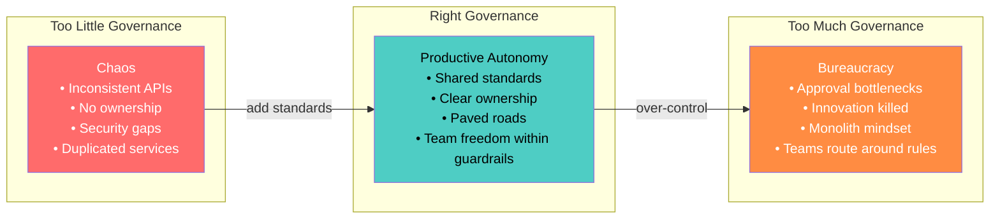

| Without Governance | With Governance |
|---|---|
| 5 different logging formats | Structured JSON, shared schema |
| Nobody knows who owns `user-service` | Ownership in service catalog |
| Deprecated APIs still called in production | Lifecycle states enforced, sunset timelines |
| Security reviews happen (sometimes) | Automated policy checks in CI |
| 3 services do the same thing | Service catalog prevents duplication |
| Incidents → "not my service" | On-call tied to ownership |

---

## 2. Governance Model

### 2.1 Governance Layers

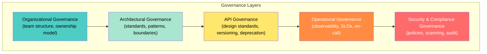

### 2.2 Centralized vs. Federated vs. Automated Governance

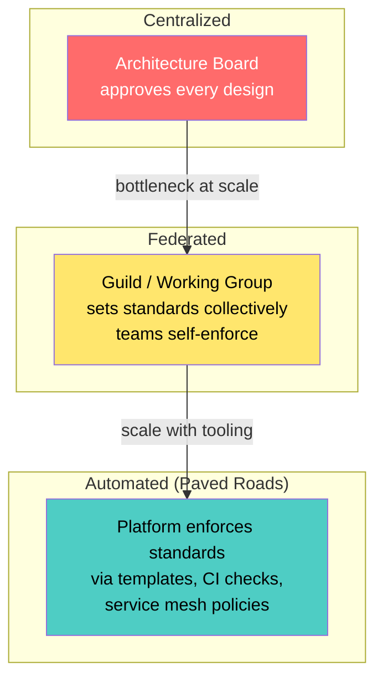

| Model | Mechanism | Best For |
|---|---|---|
| **Centralized** | Architecture review board approves changes | Small org (< 5 teams), regulated industries |
| **Federated** | Guilds/chapters define standards; teams adopt voluntarily | Medium org (5–20 teams) |
| **Automated** | Platform templates, CI policy-as-code, mesh policies | Large org (20+ teams); standards at scale |

**Recommendation:** Start federated, then encode decisions into automation. The goal is **governance by default** — teams follow standards because the platform makes it the easiest path.

---

## 3. Service Ownership

### 3.1 "You Build It, You Run It"

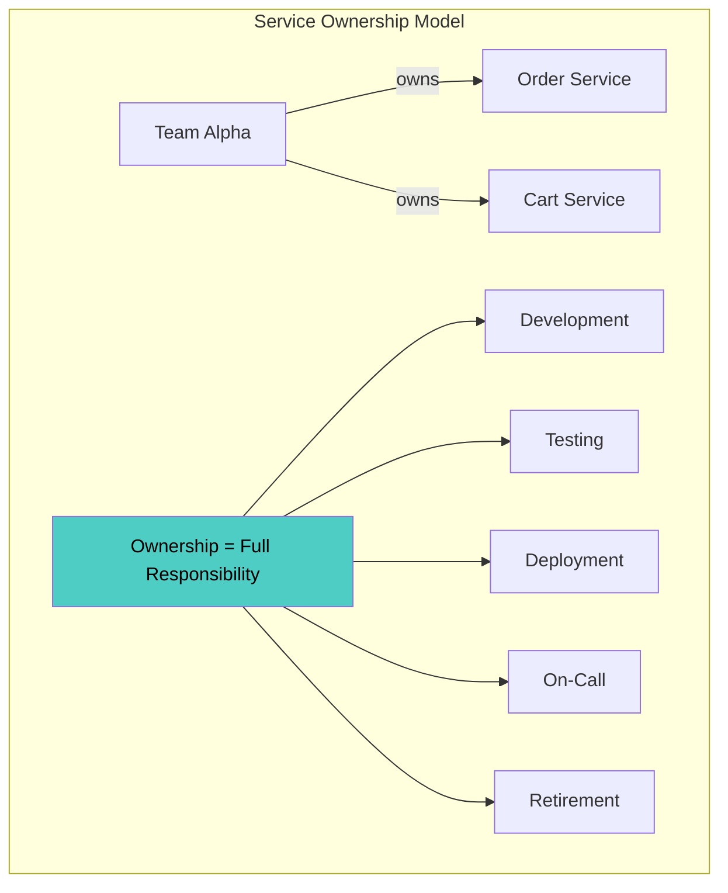

### 3.2 Ownership Metadata

Every service must have machine-readable ownership metadata:

```yaml
# service-catalog/order-service/service.yaml
apiVersion: backstage.io/v1alpha1
kind: Component
metadata:
  name: order-service
  description: Manages order lifecycle from creation to fulfillment
  annotations:
    pagerduty.com/service-id: P123ABC
    grafana.com/dashboard-url: https://grafana.internal/d/order-svc
    github.com/project-slug: myorg/order-service
  tags:
    - domain:commerce
    - tier:critical
    - lifecycle:production
spec:
  type: service
  owner: team-alpha
  lifecycle: production
  system: commerce-platform
  providesApis:
    - order-api
  consumesApis:
    - payment-api
    - inventory-api
  dependsOn:
    - resource:order-db
    - resource:order-cache
```

### 3.3 Ownership Anti-Patterns

| Anti-Pattern | Symptom | Fix |
|---|---|---|
| **Orphan service** | No team owns it; nobody updates or on-calls | Service catalog with mandatory ownership; alert on unowned services |
| **Shared ownership** | "Everyone owns it" = nobody owns it | Single team owns each service; use RACI for shared concerns |
| **Knowledge silos** | One person built it, only they understand it | Runbooks, documentation, pair rotations |
| **Ops team owns everything** | Dev teams throw code over the wall | "You build it, you run it" — teams own production |

---

## 4. Service Catalog

### 4.1 The Central Registry

A service catalog is the **single source of truth** for all services, their owners, APIs, dependencies, health, and lifecycle state.

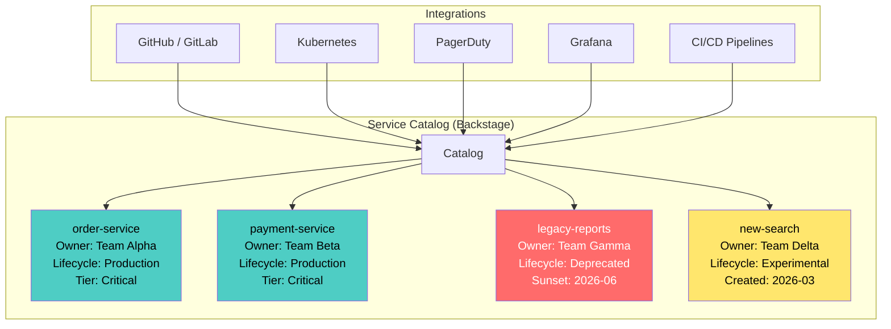

### 4.2 What the Catalog Should Track

| Dimension | Fields |
|---|---|
| **Identity** | Name, description, domain, system, tags |
| **Ownership** | Team, tech lead, on-call rotation |
| **Lifecycle** | State (experimental → production → deprecated → retired) |
| **APIs** | Provides (OpenAPI/AsyncAPI specs), consumes |
| **Dependencies** | Upstream services, databases, caches, queues |
| **Health** | SLO status, last deploy, open incidents |
| **Documentation** | Runbook link, architecture decision records, onboarding guide |
| **Compliance** | Data classification, last security review date, audit status |

### 4.3 Backstage (Spotify) — Industry Standard

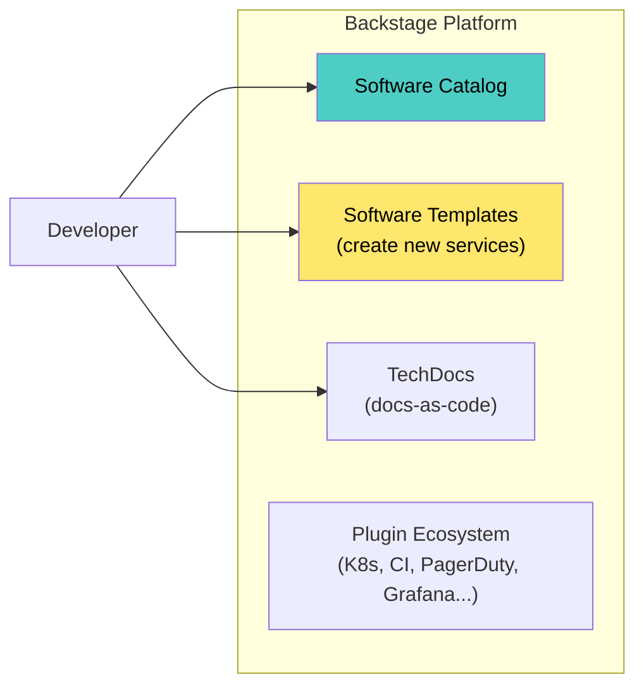

---

## 5. Service Lifecycle

### 5.1 Lifecycle States

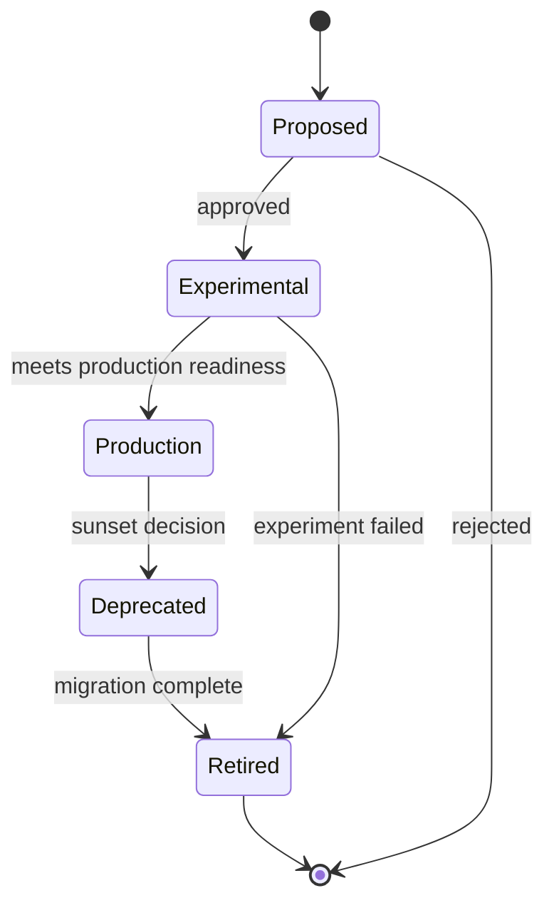

| State | Description | Rules |
|---|---|---|
| **Proposed** | Idea documented, seeking approval | Must have: business justification, domain boundary, no duplication check |
| **Experimental** | In development, not production traffic | May skip SLOs, limited on-call; time-boxed (e.g., 3 months) |
| **Production** | Serving real traffic, fully supported | Must pass production readiness review; SLOs, on-call, monitoring required |
| **Deprecated** | Marked for removal, no new consumers | Sunset date published; existing consumers given migration path |
| **Retired** | Decommissioned, resources cleaned up | DNS removed, data archived or deleted, entry kept in catalog for history |

### 5.2 Lifecycle Transitions

```mermaid
graph TB
    subgraph "Proposed → Experimental"
        P1["Business case documented"]
        P2["Domain boundary validated<br/>(no duplication)"]
        P3["Service created from<br/>platform template"]
        P1 --> P2 --> P3
    end

    subgraph "Experimental → Production"
        E1["Production Readiness<br/>Review (PRR)"]
        E2["SLOs defined"]
        E3["On-call rotation set"]
        E4["Observability complete"]
        E5["Security review passed"]
        E1 --> E2 --> E3 --> E4 --> E5
    end

    subgraph "Production → Deprecated"
        D1["Sunset decision documented"]
        D2["All consumers notified"]
        D3["Migration guide published"]
        D4["Sunset date set<br/>(e.g., +6 months)"]
        D1 --> D2 --> D3 --> D4
    end

    subgraph "Deprecated → Retired"
        R1["All consumers migrated"]
        R2["Traffic verified at zero"]
        R3["Data archived / deleted"]
        R4["Infrastructure deprovisioned"]
        R5["DNS / routes removed"]
        R1 --> R2 --> R3 --> R4 --> R5
    end

    style E1 fill:#4ecdc4,color:#000
    style D4 fill:#ffe66d,color:#000
    style R4 fill:#ff6b6b,color:#fff
```

---

## 6. Production Readiness Review (PRR)

### 6.1 What Is a PRR?

A checklist-driven review that a service must pass before serving production traffic. It ensures minimum operational quality.

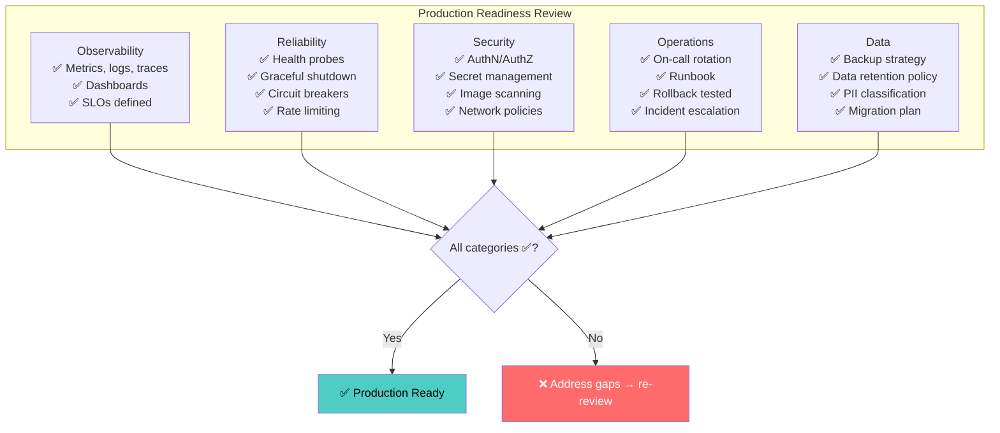

### 6.2 PRR Scorecard

| Category | Requirement | Level 1 (Minimum) | Level 2 (Standard) | Level 3 (Exemplary) |
|---|---|---|---|---|
| **Observability** | Metrics | RED metrics exported | Custom business metrics | SLO burn-rate alerts |
| | Logging | Structured JSON to stdout | Trace-ID correlated | Dynamic log level control |
| | Tracing | OTel auto-instrumentation | Manual business spans | Trace-based testing in CI |
| **Reliability** | Probes | Readiness + liveness | Startup probe | PDB defined |
| | Resilience | Timeouts configured | Circuit breaker | Chaos tested |
| | Deployment | Rolling update | Canary with analysis | Progressive delivery + feature flags |
| **Security** | AuthN/AuthZ | mTLS + JWT validation | RBAC per endpoint | OPA policy enforcement |
| | Supply chain | Image scan in CI | SBOM generated | Signed images (Cosign) |
| **Operations** | On-call | Rotation defined | Runbook exists | Gameday exercises |
| | Documentation | README + API spec | Architecture Decision Records | Onboarding guide |

### 6.3 Automating PRR

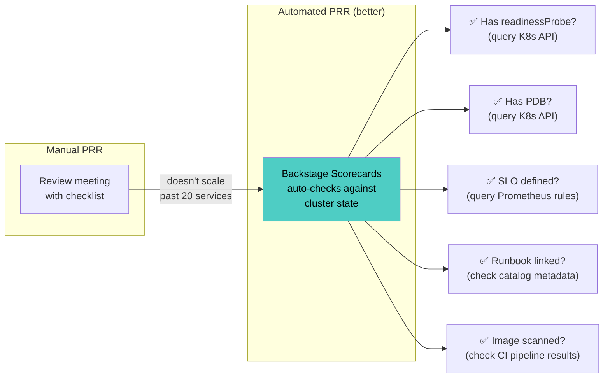

**Backstage Tech Insights** or **OPA/Kyverno policies** can enforce PRR requirements automatically — failing deployments that don't meet standards.

---

## 7. API Governance

### 7.1 API Design Standards

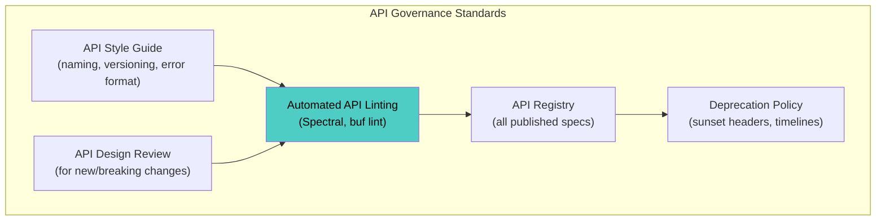

### 7.2 API Style Guide (Essentials)

| Area | Standard | Example |
|---|---|---|
| **Naming** | Plural nouns, kebab-case | `/orders`, `/payment-methods` |
| **Versioning** | URL path prefix | `/v1/orders`, `/v2/orders` |
| **Error format** | RFC 7807 Problem Details | `{"type":"...","title":"Not Found","status":404,"detail":"..."}` |
| **Pagination** | Cursor-based | `?cursor=abc123&limit=50` |
| **Filtering** | Query parameters | `?status=active&created_after=2026-01-01` |
| **Date format** | ISO 8601 / RFC 3339 | `2026-04-18T10:30:00Z` |
| **ID format** | UUID or prefixed ID | `ord_a1b2c3d4`, `usr_x9y8z7` |
| **Auth** | Bearer JWT in Authorization header | `Authorization: Bearer eyJ...` |

### 7.3 API Linting in CI

```yaml
# .spectral.yaml — API linting rules
extends: ["spectral:oas"]
rules:
  operation-operationId: error
  operation-description: warn
  oas3-api-servers: error
  
  # Custom rules
  paths-kebab-case:
    message: "Paths must use kebab-case"
    given: "$.paths[*]~"
    then:
      function: pattern
      functionOptions:
        match: "^(/[a-z][a-z0-9-]*(/{[a-zA-Z]+})?)+$"

  error-response-format:
    message: "Error responses must use RFC 7807"
    given: "$.paths.*.*.responses[?(@property >= '400')].content.application/json"
    then:
      field: schema.$ref
      function: pattern
      functionOptions:
        match: "#/components/schemas/ProblemDetail"
```

### 7.4 API Versioning & Deprecation

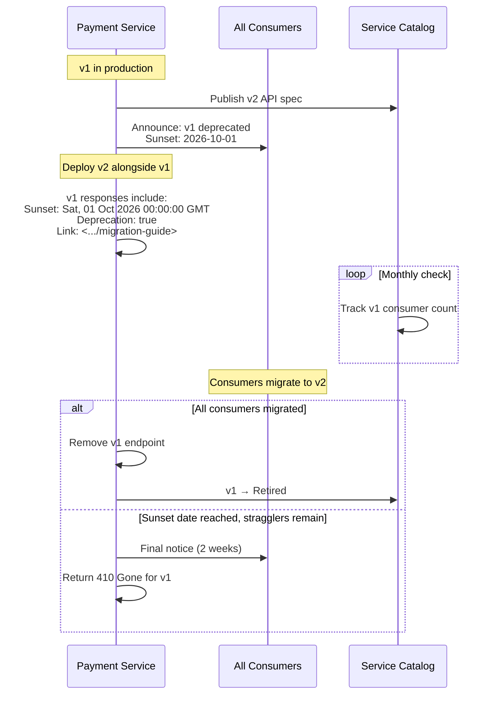

**Deprecation HTTP headers (RFC 8594 + draft-ietf-httpapi-deprecation-header):**

```http
HTTP/1.1 200 OK
Deprecation: true
Sunset: Sat, 01 Oct 2026 00:00:00 GMT
Link: <https://docs.internal/payment-api/migration-v1-to-v2>; rel="deprecation"
```

---

## 8. Architectural Standards & Guardrails

### 8.1 Paved Roads

Instead of prohibiting bad practices (which teams route around), **make the right way the easy way**:

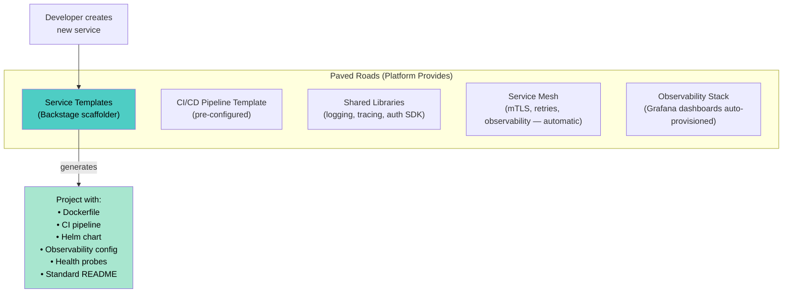

### 8.2 Policy-as-Code

Enforce architectural standards automatically — not through review meetings.

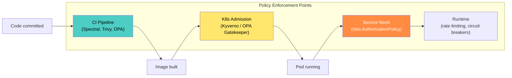

**Kyverno policy example — enforce resource limits:**

```yaml
apiVersion: kyverno.io/v1
kind: ClusterPolicy
metadata:
  name: require-resource-limits
spec:
  validationFailureAction: Enforce
  rules:
    - name: check-limits
      match:
        resources:
          kinds: ["Pod"]
      validate:
        message: "CPU and memory limits are required"
        pattern:
          spec:
            containers:
              - resources:
                  limits:
                    memory: "?*"
                    cpu: "?*"
```

**Kyverno policy — require ownership labels:**

```yaml
apiVersion: kyverno.io/v1
kind: ClusterPolicy
metadata:
  name: require-ownership
spec:
  validationFailureAction: Enforce
  rules:
    - name: check-owner-label
      match:
        resources:
          kinds: ["Deployment"]
      validate:
        message: "Deployment must have 'team' and 'lifecycle' labels"
        pattern:
          metadata:
            labels:
              team: "?*"
              lifecycle: "production|experimental|deprecated"
```

### 8.3 Architecture Decision Records (ADRs)

```markdown
# ADR-0042: Use gRPC for internal service-to-service communication

## Status: Accepted

## Context
We have 30+ internal services communicating via REST. 
Serialization overhead and lack of schema enforcement 
cause integration bugs.

## Decision
All new internal service-to-service APIs will use gRPC 
with Protocol Buffers. REST remains for external/public APIs.

## Consequences
- Positive: Strongly typed contracts, efficient serialization, 
  code generation
- Negative: gRPC learning curve, browser support requires 
  gRPC-Web proxy
- Migration: Existing REST APIs grandfathered; migrate 
  opportunistically
```

ADRs are **versioned in Git**, linked from the service catalog, and searchable. They capture *why* a decision was made — not just what.

---

## 9. Service Deprecation & Retirement

### 9.1 Deprecation Process

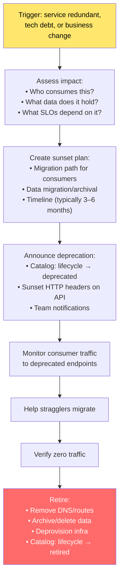

### 9.2 Consumer Discovery

Before deprecating, find all consumers:

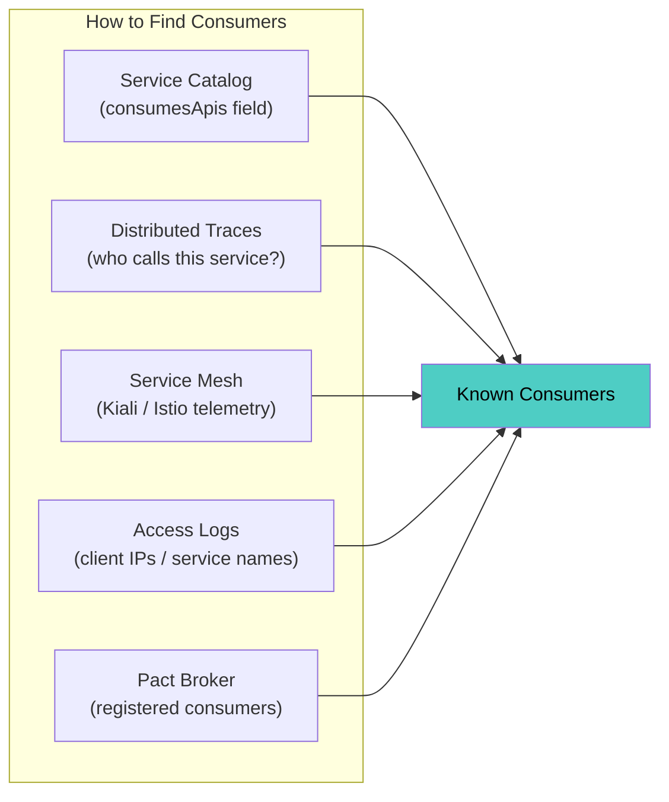

### 9.3 Sunset Enforcement

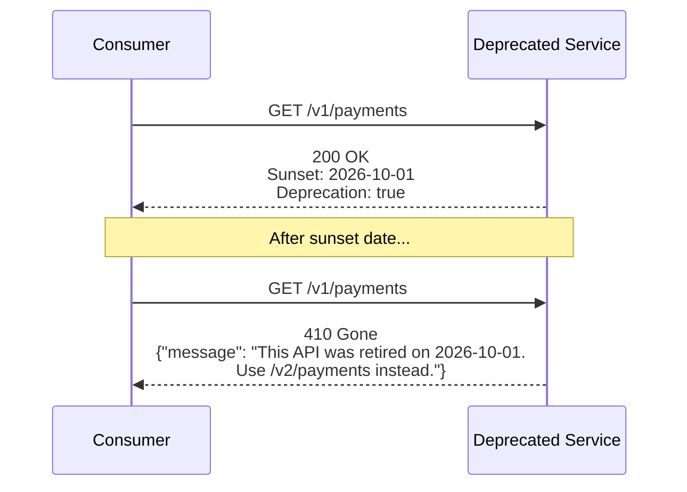

---

## 10. Service Scoring & Health

### 10.1 Service Scorecards

Automatically grade every service against governance standards:

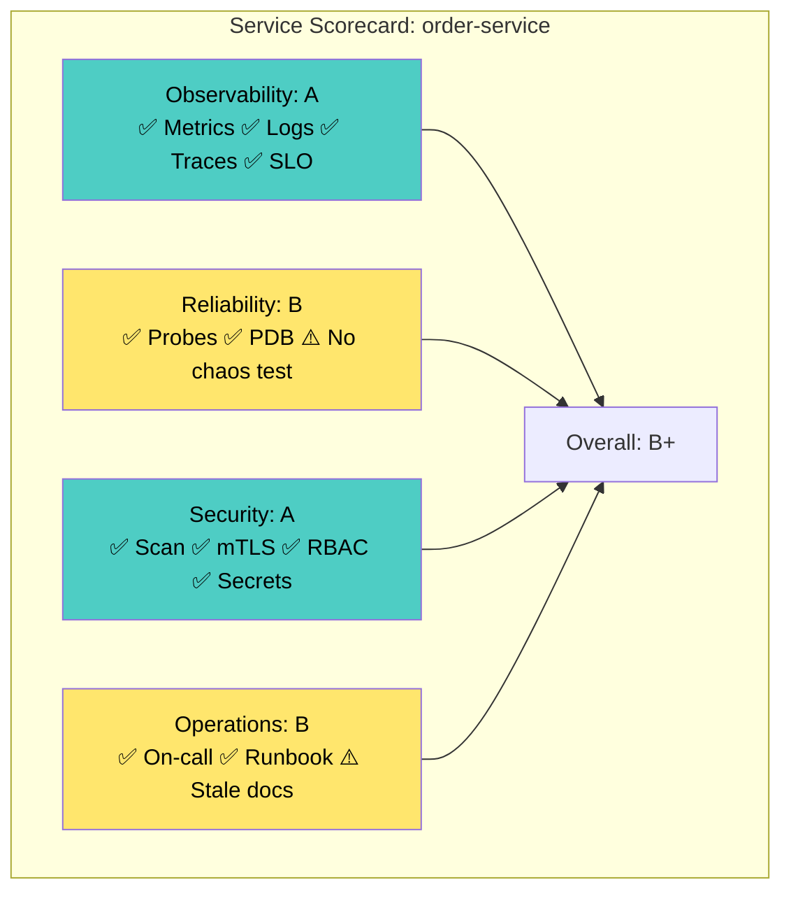

### 10.2 Automated Scoring Inputs

| Check | Source | Scoring |
|---|---|---|
| Has readiness probe? | Kubernetes API | +10 pts |
| Has PDB? | Kubernetes API | +5 pts |
| SLO defined? | Prometheus rules / Sloth | +15 pts |
| Last deploy < 30 days? | CI/CD metadata | +5 pts |
| Image CVEs (critical)? | Trivy / Snyk | −20 pts per CVE |
| On-call rotation set? | PagerDuty API | +10 pts |
| Runbook exists + recent? | Service catalog | +10 pts |
| Test coverage > 80%? | SonarQube / CI | +10 pts |
| API spec published? | Backstage API registry | +10 pts |
| Dependencies up-to-date? | Dependabot / Renovate | +5 pts |

### 10.3 Scorecard Dashboard

```
┌────────────────────┬───────┬───────┬───────┬───────┬─────────┐
│ Service            │ Obs.  │ Rel.  │ Sec.  │ Ops.  │ Overall │
├────────────────────┼───────┼───────┼───────┼───────┼─────────┤
│ order-service      │  A    │  B    │  A    │  B    │   B+    │
│ payment-service    │  A    │  A    │  A    │  A    │   A     │
│ legacy-reports     │  D    │  C    │  F    │  D    │   D     │ ← action needed
│ notification-svc   │  B    │  B    │  A    │  C    │   B     │
│ search-service     │  A    │  A    │  B    │  A    │   A-    │
└────────────────────┴───────┴───────┴───────┴───────┴─────────┘
```

Services below a threshold (e.g., `C` overall) trigger automated tickets for the owning team.

---

## 11. Service Creation Governance

### 11.1 New Service Decision Framework

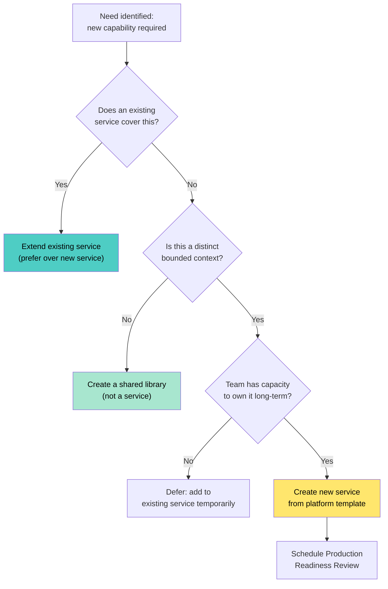

### 11.2 Service Template (Golden Path)

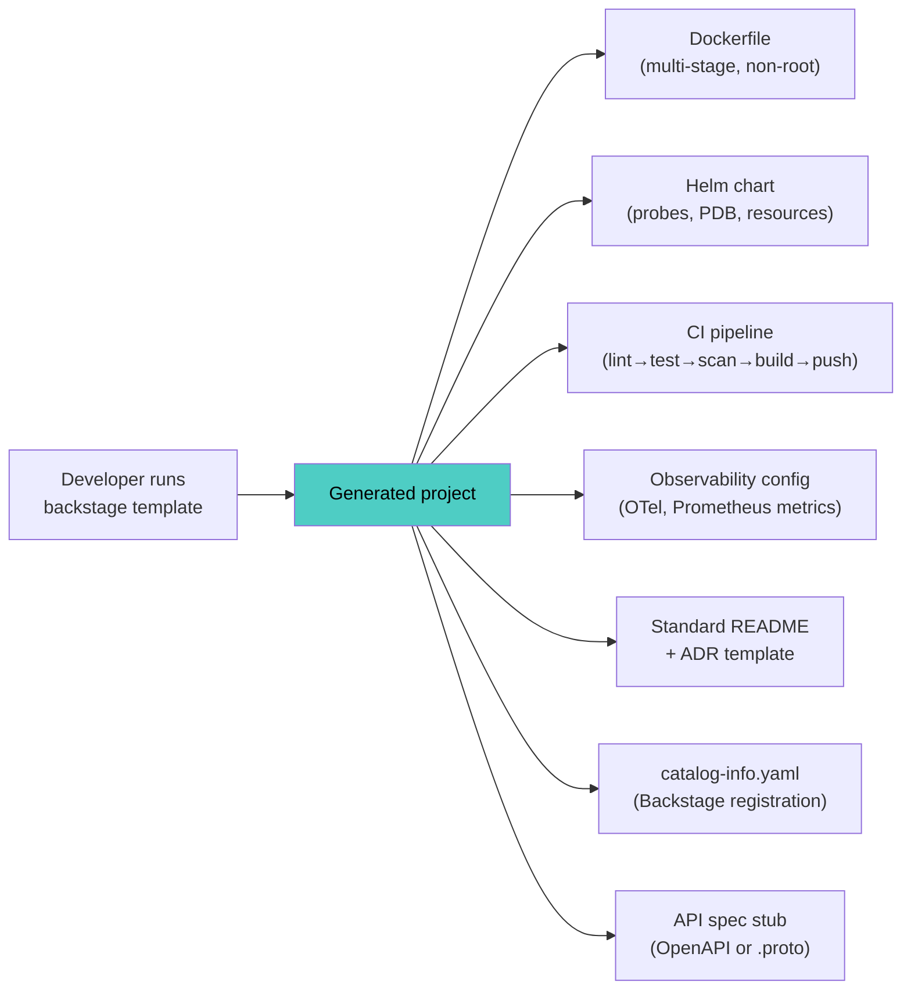

The template **embeds** governance standards — teams start compliant by default.

---

## 12. Compliance & Audit

### 12.1 Automated Compliance

```mermaid
graph TB
    subgraph "Compliance Automation"
        GIT_AUDIT["Git history<br/>= change audit trail"]
        GITOPS["GitOps deploys<br/>= deployment audit trail"]
        SCAN_AUDIT["Image scans<br/>= vulnerability audit"]
        POLICY_AUDIT["OPA/Kyverno<br/>= policy enforcement audit"]
        ACCESS["RBAC + audit logs<br/>= access audit"]
    end

    AUDITOR["Auditor"] --> GIT_AUDIT
    AUDITOR --> GITOPS
    AUDITOR --> SCAN_AUDIT
    AUDITOR --> POLICY_AUDIT
    AUDITOR --> ACCESS

    style GIT_AUDIT fill:#4ecdc4,color:#000
    style GITOPS fill:#4ecdc4,color:#000
```

### 12.2 Compliance-as-Code

| Compliance Requirement | Automated Implementation |
|---|---|
| "All changes must be approved" | Branch protection: PR requires ≥ 1 approval |
| "No deployment without testing" | CI gate: block deploy if tests fail |
| "All containers scanned for vulnerabilities" | Trivy in CI + admission webhook blocks unscanned images |
| "Data encrypted at rest" | Kyverno policy: all PVCs must use encrypted storage class |
| "Access logged" | Service mesh audit logs + K8s audit policy |
| "Disaster recovery tested" | Scheduled chaos experiments with reports |

---

## 13. Governance Tools Landscape

| Category | Open-Source | Commercial |
|---|---|---|
| **Service Catalog** | Backstage, Port | Cortex, OpsLevel, Datadog Service Catalog |
| **API Registry** | Backstage API tab, Apicurio | Kong Konnect, Postman, SwaggerHub |
| **API Linting** | Spectral, buf lint | Optic |
| **Policy-as-Code** | OPA/Gatekeeper, Kyverno | Styra DAS |
| **Scorecards** | Backstage Tech Insights | Cortex Scorecards, OpsLevel Checks |
| **Secret Management** | Vault, Sealed Secrets | AWS Secrets Manager, Azure Key Vault |
| **Dependency Management** | Renovate, Dependabot | Snyk |
| **ADRs** | Markdown in Git, adr-tools | Backstage ADR plugin |

---

## 14. Anti-Patterns

| Anti-Pattern | Problem | Fix |
|---|---|---|
| **No service catalog** | "Who owns this service?" → shrug | Deploy Backstage; make catalog registration mandatory |
| **Governance by committee** | Architecture board reviews every change → bottleneck | Federated guilds + automated policy enforcement |
| **Standards doc nobody reads** | 50-page PDF on Confluence, last updated 2023 | Encode standards in templates, linters, and admission policies |
| **Orphan services** | Service has no owner after team reorg | Alert on unowned services in catalog; block deploys for unowned services |
| **Zombie services** | Deprecated but never retired | Automated sunset enforcement: 410 Gone after deadline |
| **No deprecation process** | Old APIs live forever; maintenance burden grows | Formal deprecation lifecycle with sunset headers and timelines |
| **"Just spin up a new service"** | Microservice sprawl; 200 services for 50 developers | New-service decision framework; prefer extending existing services |
| **Manual PRR** | Doesn't scale past 20 services; checklist fatigue | Automated scorecards from cluster/CI state |
| **Governance without tooling** | Rules exist but nobody follows them | Paved roads: make compliance the default path |
| **One team governs everything** | Central team becomes bottleneck and resented | Distribute governance: each team owns their compliance; platform provides guardrails |

---

## 15. Decision Framework

```mermaid
graph TD
    START{"Governance maturity?"} -->|"No governance"| S1["Step 1: Service catalog + ownership<br/>(who owns what)"]
    START -->|"Catalog exists"| S2["Step 2: Service templates + PRR<br/>(quality baseline)"]
    START -->|"Templates + PRR"| S3["Step 3: Policy-as-code + API governance<br/>(automated guardrails)"]
    START -->|"Automated"| S4["Step 4: Scorecards + lifecycle management<br/>(continuous improvement)"]

    S1 --> Q1{"Scale?"}
    Q1 -->|"< 10 services"| SPREADSHEET["Spreadsheet + Markdown PRR<br/>(minimal viable governance)"]
    Q1 -->|"10–50 services"| BACKSTAGE["Deploy Backstage<br/>+ basic templates"]
    Q1 -->|"50+ services"| FULL["Backstage + Kyverno +<br/>Spectral + automated scorecards"]

    S3 --> Q2{"Regulated industry?"}
    Q2 -->|"Yes"| COMPLIANCE["Add compliance-as-code<br/>+ audit trail automation"]
    Q2 -->|"No"| LIGHT["Lighter touch:<br/>focus on paved roads"]

    style S1 fill:#4ecdc4,color:#000
    style FULL fill:#ff8c42,color:#fff
```

---

## 16. Checklist

### Ownership
- [ ] Every service has a single owning team in the service catalog
- [ ] Ownership includes: development, testing, deployment, and on-call
- [ ] Alert on unowned or orphaned services
- [ ] Ownership transfers follow a documented handoff process

### Service Catalog
- [ ] Central catalog deployed (Backstage or equivalent)
- [ ] Every service registered with metadata: owner, lifecycle, APIs, dependencies
- [ ] Catalog integrates with: Git, Kubernetes, PagerDuty, Grafana, CI/CD
- [ ] New services created from platform templates (golden path)
- [ ] Service catalog is the starting point for incident response

### Lifecycle Management
- [ ] Lifecycle states defined: Proposed → Experimental → Production → Deprecated → Retired
- [ ] Production Readiness Review (PRR) required before serving traffic
- [ ] PRR automated via scorecards (not just a meeting)
- [ ] Deprecation policy: sunset headers, consumer notification, timeline
- [ ] Retired services fully decommissioned (DNS, data, infra)

### API Governance
- [ ] API style guide published and enforced by linter in CI
- [ ] API specs (OpenAPI / Protobuf / AsyncAPI) published to registry
- [ ] API versioning strategy defined and followed
- [ ] Breaking changes require deprecation period (e.g., 6 months)
- [ ] Deprecation HTTP headers added to sunset APIs

### Standards & Guardrails
- [ ] Architecture Decision Records (ADRs) maintained in Git
- [ ] Policy-as-code enforced at admission (Kyverno / OPA)
- [ ] Service templates embed standards (probes, observability, security)
- [ ] Shared libraries provided for cross-cutting concerns (logging, auth, tracing)
- [ ] Standards encoded in automation, not just documentation

### Compliance
- [ ] GitOps provides deployment audit trail
- [ ] Image scanning enforced in CI and at admission
- [ ] Branch protection requires PR review
- [ ] Compliance controls mapped to automated checks
- [ ] Regular audit reports generated automatically

---

## 17. Recommendation

**Build governance incrementally — tooling before policy:**

| Phase | Focus | Key Outcome |
|---|---|---|
| **Phase 1** | Service catalog + ownership registry | Know what exists and who owns it |
| **Phase 2** | Service templates + Production Readiness Review | New services start compliant; quality baseline |
| **Phase 3** | API governance (linting + registry + deprecation) | Consistent APIs; safe evolution |
| **Phase 4** | Policy-as-code (Kyverno/OPA) + automated scorecards | Standards enforced automatically; continuous visibility |
| **Phase 5** | Lifecycle management + compliance automation | Full lifecycle from proposal to retirement; audit-ready |

The golden rule of microservices governance: **make the right thing the easy thing**. If developers have to fight the platform to follow standards, they won't. If the platform template gives them compliance for free, they will. Invest in paved roads — not gatekeepers.

---

**Next steps to explore:** Platform Engineering & Internal Developer Platform, Domain-Driven Design & Team Topologies, SLO Engineering & Error Budgets.