# Service Migration & Modernization in Microservices

---

## 1. Why Migrate and Modernize?

Most organizations don't start with microservices. They start with a monolith that served them well — until it didn't. Migration is the disciplined process of moving from a legacy system to a modern architecture **without stopping the business**.

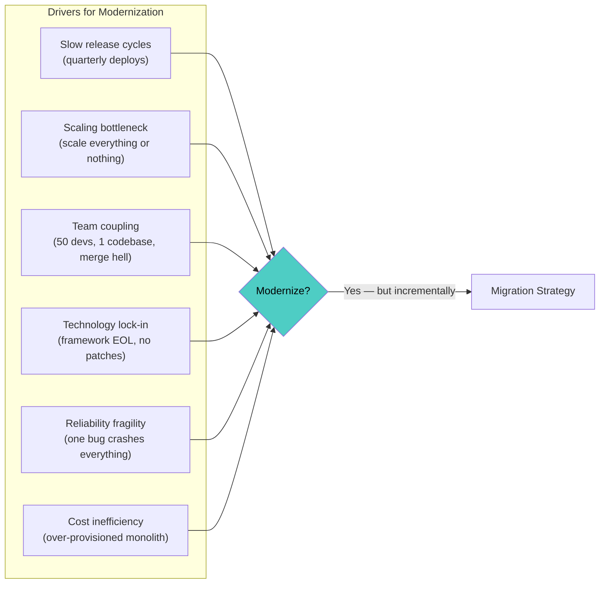

**Critical principle: Migration is not a rewrite.** Full rewrites ("Big Bang") have a ~70% failure rate. Incremental, risk-managed migration is the only approach that reliably works.

| Approach | Success Rate | Risk | Duration |
|---|---|---|---|
| **Big Bang rewrite** | Low (~30%) | Extreme — years of parallel development, feature parity gap | 2–5 years |
| **Incremental migration** | High (~75%+) | Controlled — small pieces, validated continuously | 6 months – 3 years |
| **Lift and shift** | Medium | Low migration risk, but no modernization benefit | 1–3 months |
| **Do nothing** | N/A | Growing tech debt, increasing incident rate | ∞ |

---

## 2. Migration Strategies Overview

### 2.1 The Strategy Spectrum

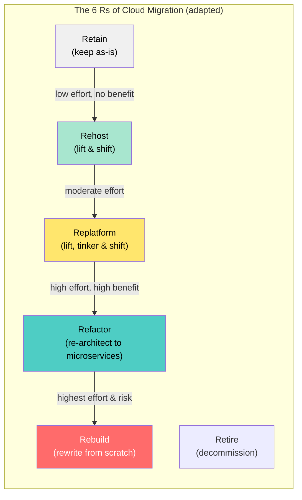

| Strategy | What It Means | When to Use |
|---|---|---|
| **Retain** | Leave the component in the monolith | Stable, low-change area; not worth extracting |
| **Retire** | Delete the functionality entirely | Dead code, unused features |
| **Rehost** | Move to containers/cloud, no code changes | Quick cloud migration, buy time |
| **Replatform** | Minor changes (containerize, managed DB) | Modernize infra without touching business logic |
| **Refactor / Re-architect** | Extract into microservices | Core business domains that need independent scaling/deployment |
| **Rebuild** | Rewrite from scratch | Only when legacy code is truly unmaintainable AND domain is well-understood |

### 2.2 Decision Framework: Which Strategy for Which Component?

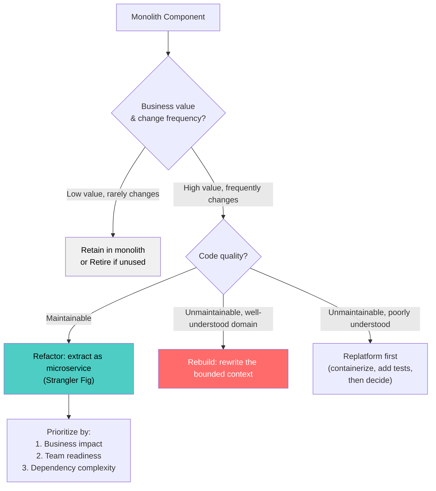

---

## 3. The Strangler Fig Pattern (Primary Migration Pattern)

### 3.1 Core Concept

Named after strangler fig trees that grow around a host tree, eventually replacing it. New microservices grow around the monolith, gradually taking over functionality until the monolith can be removed.

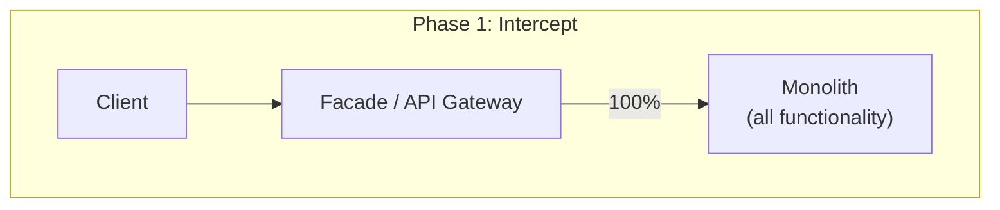

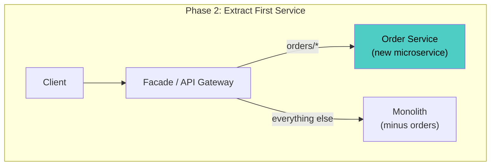

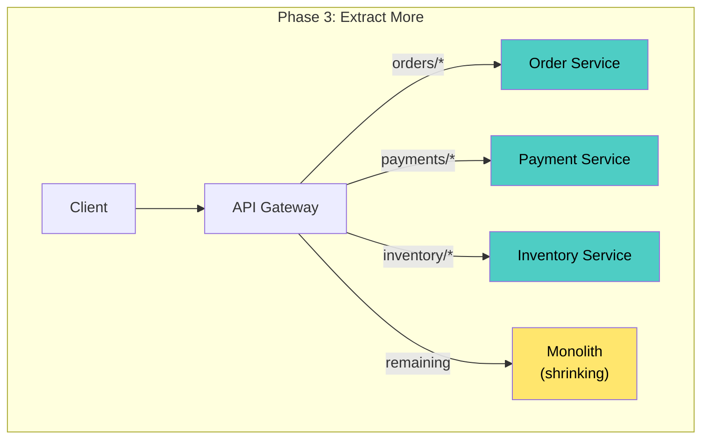

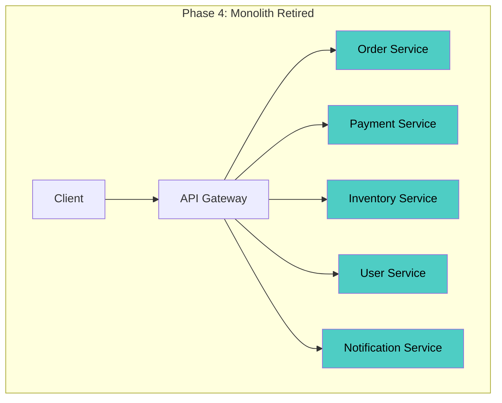

### 3.2 Strangler Fig Implementation Steps

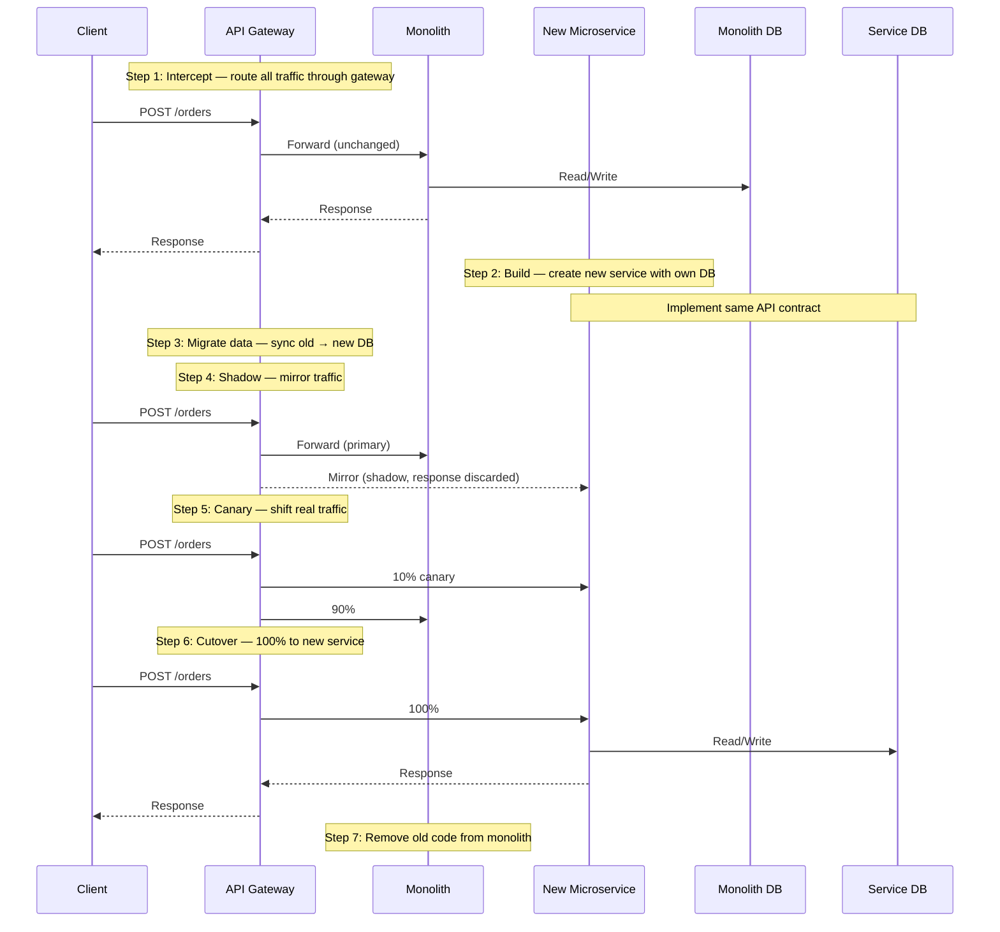

### 3.3 Routing Strategies for Strangler Fig

| Strategy | Mechanism | Best For |
|---|---|---|
| **URL-path routing** | `/api/v2/orders/*` → new service | Clean URL separation |
| **Header-based routing** | `X-Route-To: new-order-service` | A/B testing during migration |
| **Feature-flag routing** | Flag determines old vs. new path | Per-user or per-tenant rollout |
| **Content-based routing** | Route by request body field | Migrate specific entity types first |

---

## 4. Data Migration

### 4.1 The Hardest Part

Data migration is the most challenging aspect of monolith decomposition. The monolith's shared database must be split into per-service databases — while the system continues running.

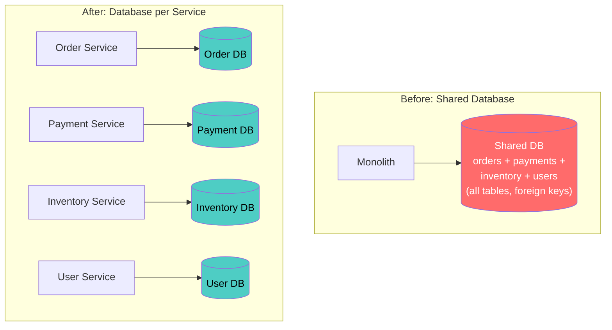

### 4.2 Data Migration Patterns

#### Pattern 1: Shared Database (Transitional)

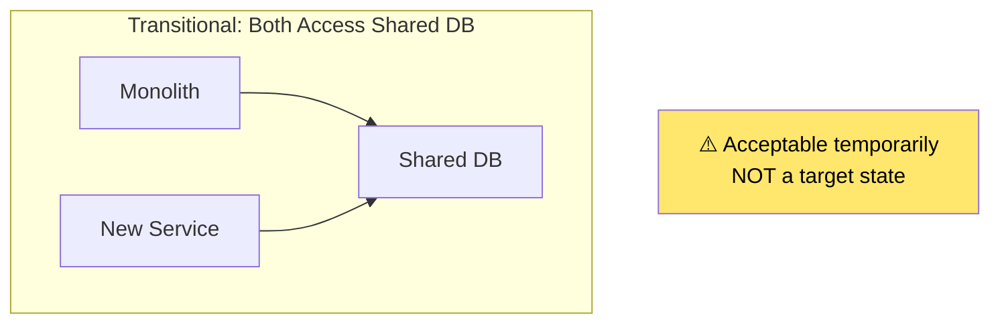

Use this as a **stepping stone** — extract the service code first, share the DB temporarily, then split the DB.

#### Pattern 2: Database View / API Wrapping

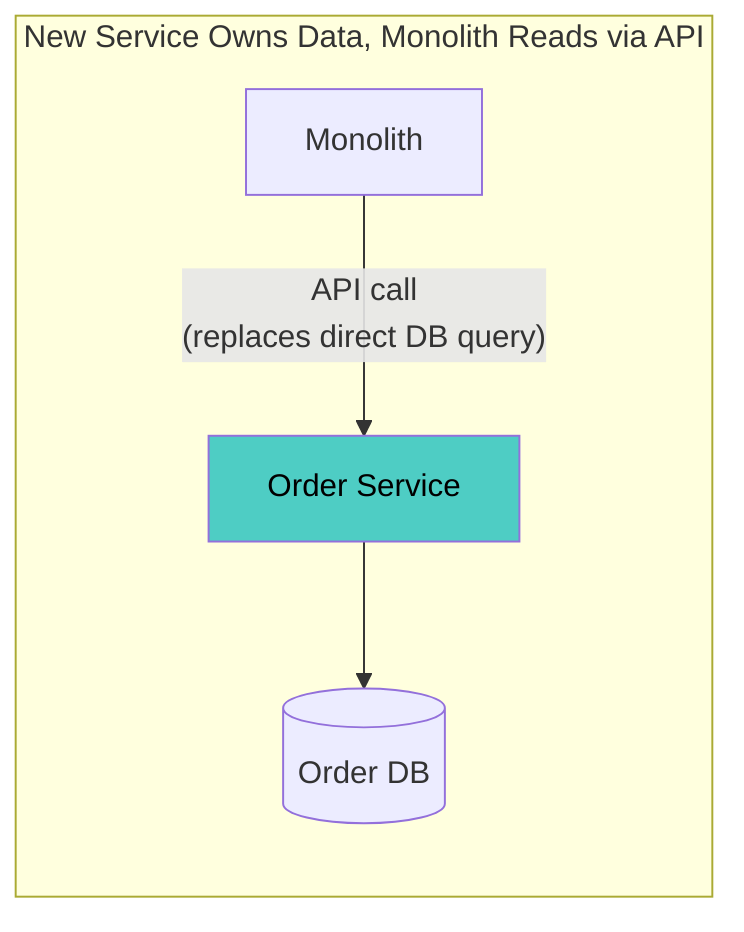

#### Pattern 3: Change Data Capture (CDC)

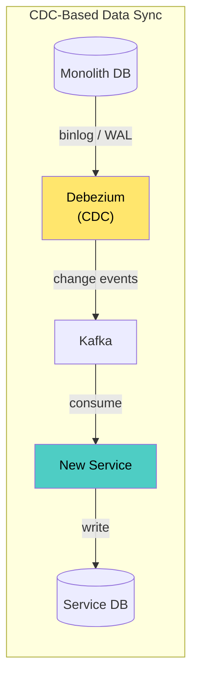

**CDC is the safest pattern for data migration** — it keeps the new service's database in sync with the monolith in near-real-time, without modifying the monolith's code.

#### Pattern 4: Dual-Write (During Cutover)

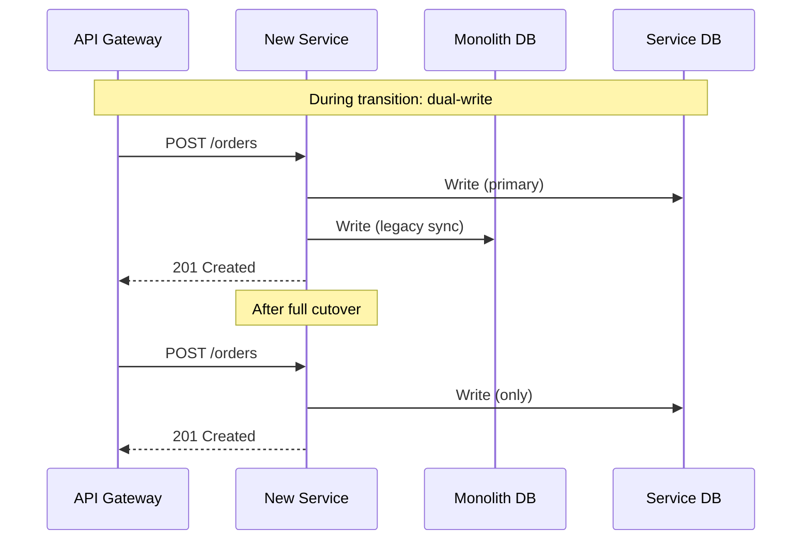

**Warning:** Dual-write without a transactional outbox risks inconsistency. Prefer CDC or outbox pattern.

### 4.3 Data Migration Sequence

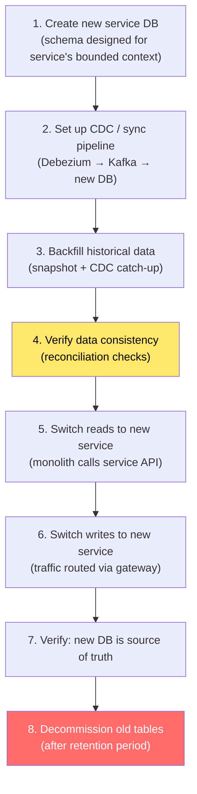

### 4.4 Breaking Foreign Keys

The monolith's shared database uses foreign keys across what will become service boundaries. These must be replaced:

| Before (Monolith) | After (Microservices) |
|---|---|
| `orders.user_id REFERENCES users.id` | Order Service stores `user_id` as opaque ID; calls User Service API when user data needed |
| `JOIN orders ON payments.order_id` | Payment Service calls Order Service API; or uses event-driven eventual consistency |
| Database enforces referential integrity | Application-level consistency via sagas / events |

---

## 5. Incremental Migration Approach

### 5.1 Domain-Driven Decomposition

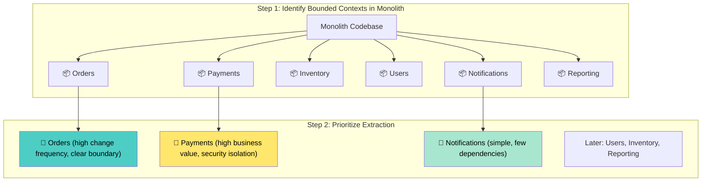

### 5.2 Extraction Prioritization Matrix

| Factor | Weight | Order | Payment | Notification | Inventory |
|---|---|---|---|---|---|
| **Change frequency** | 30% | High (9) | Medium (6) | Low (3) | Medium (6) |
| **Business value of independence** | 25% | High (9) | High (9) | Low (3) | Medium (6) |
| **Coupling to monolith** | 20% (inverse) | Medium (5) | Low (8) | Low (8) | High (3) |
| **Team readiness** | 15% | High (9) | Medium (6) | High (9) | Medium (6) |
| **Risk if it fails** | 10% (inverse) | Medium (5) | High (3) | Low (9) | Medium (5) |
| **Weighted Score** | | **7.5** | **6.6** | **5.1** | **5.4** |

**Extract in order of score: Orders first, then Payments, then Inventory, then Notifications.**

### 5.3 The Migration Roadmap

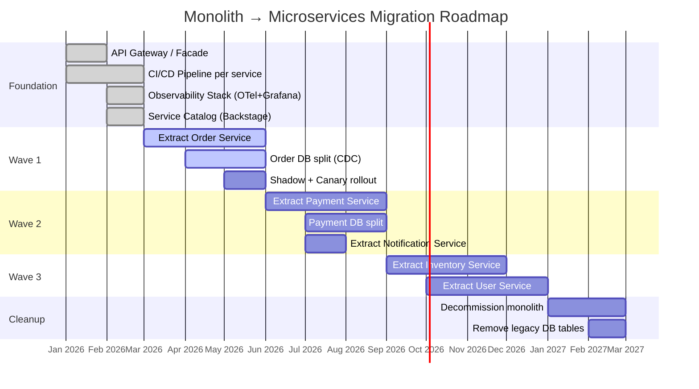

---

## 6. Anti-Corruption Layer (ACL)

### 6.1 Concept

When the new microservice must communicate with the legacy monolith, an **Anti-Corruption Layer** translates between the legacy model and the new service's domain model — preventing legacy concepts from leaking into clean new code.

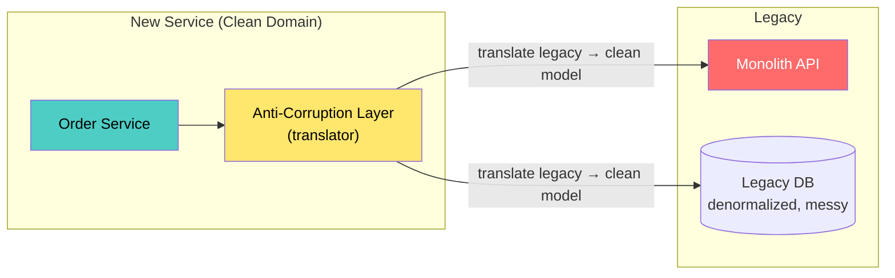

### 6.2 ACL Implementation

```python
# Anti-Corruption Layer: translate legacy payment response to clean model

# Legacy monolith returns:
# {"PAY_ID": "00123", "PAY_STAT": "OK", "AMT_CENTS": 4999, 
#  "CUST_REF": "C-789", "TS": "20260418102345"}

class PaymentACL:
    """Translates legacy payment system responses to clean domain model."""

    def to_payment_result(self, legacy_response: dict) -> PaymentResult:
        return PaymentResult(
            payment_id=f"pay_{legacy_response['PAY_ID'].lstrip('0')}",
            status=self._map_status(legacy_response["PAY_STAT"]),
            amount=Decimal(legacy_response["AMT_CENTS"]) / 100,
            customer_id=legacy_response["CUST_REF"],
            timestamp=datetime.strptime(
                legacy_response["TS"], "%Y%m%d%H%M%S"
            ),
        )

    def _map_status(self, legacy_status: str) -> PaymentStatus:
        mapping = {
            "OK": PaymentStatus.CHARGED,
            "FAIL": PaymentStatus.FAILED,
            "PEND": PaymentStatus.PENDING,
            "REF": PaymentStatus.REFUNDED,
        }
        return mapping.get(legacy_status, PaymentStatus.UNKNOWN)
```

**The ACL is temporary** — it exists during migration and is removed when the legacy system is decommissioned.

---

## 7. Feature Parity & Verification

### 7.1 Ensuring the New Service Matches the Old

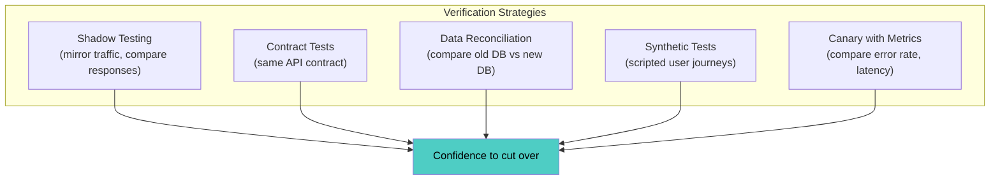

### 7.2 Shadow Testing (Diff Testing)

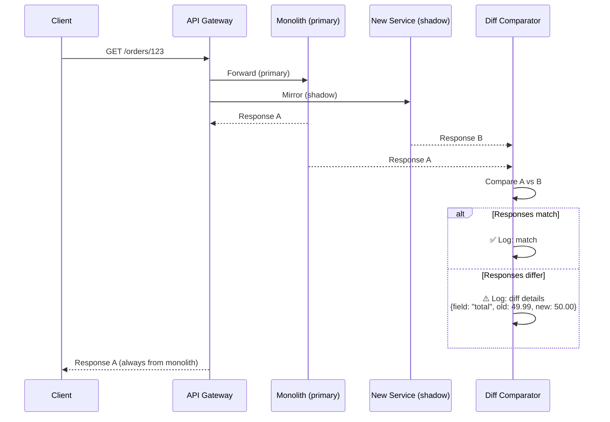

**Shadow testing runs for weeks before cutover** — building confidence that the new service produces identical results. Only the monolith's response is returned to the client.

### 7.3 Data Reconciliation

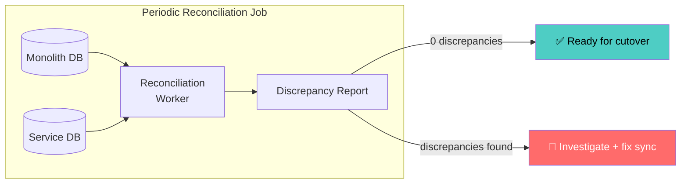

---

## 8. Organizational Migration

### 8.1 Conway's Law in Migration

> "Organizations design systems that mirror their communication structures."

Migrating architecture **without** migrating the team structure fails. If a monolith team still owns all microservices, you get a "distributed monolith."

```mermaid
graph TB
    subgraph "Before: Feature Teams on Monolith"
        FT1["Team 1: Feature X"]
        FT2["Team 2: Feature Y"]
        FT3["Team 3: Feature Z"]
        MONO7["Monolith"]
        
        FT1 --> MONO7
        FT2 --> MONO7
        FT3 --> MONO7
    end

    subgraph "After: Stream-Aligned Teams on Services"
        ST1["Team Orders<br/>(owns Order Service)"]
        ST2["Team Payments<br/>(owns Payment Service)"]
        ST3["Team Catalog<br/>(owns Inventory + Search)"]
        PT["Platform Team<br/>(owns infra, CI/CD, mesh)"]
    end

    ST1 -->|owns| SVC_O["Order Service"]
    ST2 -->|owns| SVC_P["Payment Service"]
    ST3 -->|owns| SVC_I["Inventory Service"]
    PT -->|enables| ST1
    PT -->|enables| ST2
    PT -->|enables| ST3

    style ST1 fill:#4ecdc4,color:#000
    style ST2 fill:#4ecdc4,color:#000
    style ST3 fill:#4ecdc4,color:#000
    style PT fill:#ffe66d,color:#000
```

### 8.2 Team Topology During Migration

| Phase | Team Structure | Focus |
|---|---|---|
| **Phase 0** | Existing monolith teams | Business as usual |
| **Phase 1** | Small "pioneer" team (2–3 people) | Extract first service, build platform foundations |
| **Phase 2** | Pioneer team becomes platform team; first stream-aligned team formed | First service in production, patterns established |
| **Phase 3** | More stream-aligned teams spun up | Parallel extraction of multiple bounded contexts |
| **Phase 4** | Full stream-aligned + platform + enabling teams | Monolith decommissioned |

### 8.3 Skill Migration

| Skill Gap | Training / Hiring |
|---|---|
| Containerization (Docker, K8s) | Hands-on workshops + platform team support |
| Distributed systems thinking | Book clubs (Designing Data-Intensive Applications), chaos engineering exercises |
| Observability (OTel, Grafana) | Guided setup of first service's dashboards |
| CI/CD automation | Platform team provides golden-path templates |
| Domain-Driven Design | DDD workshops to identify bounded contexts |

---

## 9. Modernization Patterns Beyond Strangler Fig

### 9.1 Branch by Abstraction

When you can't route at the network level (internal monolith logic), use code-level abstraction:

```mermaid
graph TD
    subgraph "Step 1: Identify Component to Replace"
        CLIENT3["Calling Code"]
        OLD_IMPL["Old Implementation<br/>(tightly coupled)"]
        CLIENT3 --> OLD_IMPL
    end

    subgraph "Step 2: Introduce Abstraction"
        CLIENT4["Calling Code"]
        IFACE["Interface / Abstraction"]
        OLD_IMPL2["Old Implementation"]
        CLIENT4 --> IFACE
        IFACE --> OLD_IMPL2
    end

    subgraph "Step 3: Add New Implementation"
        CLIENT5["Calling Code"]
        IFACE2["Interface"]
        OLD_IMPL3["Old Implementation"]
        NEW_IMPL["New Implementation<br/>(calls microservice)"]
        FLAG["Feature Flag"]
        CLIENT5 --> IFACE2
        IFACE2 --> FLAG
        FLAG -->|off| OLD_IMPL3
        FLAG -->|on| NEW_IMPL
    end

    subgraph "Step 4: Remove Old"
        CLIENT6["Calling Code"]
        IFACE3["Interface"]
        NEW_IMPL2["New Implementation<br/>(only path)"]
        CLIENT6 --> IFACE3 --> NEW_IMPL2
    end

    style NEW_IMPL fill:#4ecdc4,color:#000
    style NEW_IMPL2 fill:#4ecdc4,color:#000
    style FLAG fill:#ffe66d,color:#000
```

### 9.2 Parallel Run

Run both old and new implementations simultaneously, compare results, only return the old implementation's result to the user:

```python
# Parallel run pattern (using GitHub Scientist-style library)
from scientist import Experiment

def get_order_total(order_id):
    experiment = Experiment("order-total-migration")
    
    # Control: monolith calculation (always returned)
    experiment.use(lambda: monolith_order_service.get_total(order_id))
    
    # Candidate: new microservice (compared, never returned)
    experiment.try(lambda: new_order_service.get_total(order_id))
    
    # Compare results
    experiment.compare(lambda control, candidate: 
        abs(control - candidate) < 0.01)  # tolerate rounding
    
    # Run: returns control result, logs mismatches
    return experiment.run()
```

### 9.3 Event Interception

Intercept events/messages from the monolith to build new read models or trigger new service logic:

```mermaid
graph LR
    MONO8["Monolith"] -->|"publishes events<br/>(add CDC if needed)"| KAFKA2["Kafka"]
    KAFKA2 --> NEW6["New Search Service<br/>(builds own index)"]
    KAFKA2 --> NEW7["New Analytics Service<br/>(builds own projections)"]

    MONO8 -->|"still handles writes"| DB5[("Monolith DB")]

    style NEW6 fill:#4ecdc4,color:#000
    style NEW7 fill:#4ecdc4,color:#000
```

### 9.4 UI Composition (Micro-Frontends)

```mermaid
graph TB
    subgraph "Monolith UI Migration"
        SHELL["App Shell / Container"]
        LEGACY_UI["Legacy Monolith UI<br/>(iframe or bundled)"]
        NEW_UI1["Order Widget<br/>(React micro-frontend)"]
        NEW_UI2["Payment Widget<br/>(React micro-frontend)"]
    end

    SHELL --> LEGACY_UI
    SHELL --> NEW_UI1
    SHELL --> NEW_UI2

    NEW_UI1 -->|API| SVC_O2["Order Service"]
    NEW_UI2 -->|API| SVC_P2["Payment Service"]
    LEGACY_UI -->|API| MONO9["Monolith"]

    style NEW_UI1 fill:#4ecdc4,color:#000
    style NEW_UI2 fill:#4ecdc4,color:#000
    style LEGACY_UI fill:#ff6b6b,color:#fff
```

---

## 10. Migration Risks & Mitigation

### 10.1 Risk Registry

| Risk | Impact | Likelihood | Mitigation |
|---|---|---|---|
| **Data loss during migration** | Critical | Medium | CDC with reconciliation; never delete source data until verified |
| **Feature parity gap** | High | High | Shadow testing + comprehensive contract tests |
| **Performance regression** | High | Medium | Load test new service before cutover; canary with latency analysis |
| **Team burnout** | High | Medium | Time-box migration waves; celebrate milestones |
| **Distributed monolith** | High | High | Enforce bounded contexts; no shared databases in target state |
| **Migration stalls** | Medium | High | Deliver business value each wave; avoid "infrastructure only" phases |
| **Dual maintenance** | Medium | High | Minimize overlap period; feature-freeze monolith areas being extracted |

### 10.2 Migration Rollback Strategy

```mermaid
graph TD
    CUTOVER["Service cutover:<br/>100% traffic to new service"] --> MONITOR2["Monitor for 1–2 weeks"]
    
    MONITOR2 --> OK{"Issues?"}
    OK -->|"None"| DECOM["Decommission old code path"]
    OK -->|"Minor"| FIX2["Fix forward in new service"]
    OK -->|"Major"| REVERT["Revert: route traffic<br/>back to monolith"]
    
    REVERT --> INVESTIGATE["Investigate + fix"]
    INVESTIGATE --> CUTOVER

    NOTE2["⚠️ Keep monolith code path<br/>functional for 2–4 weeks<br/>after cutover"]

    style REVERT fill:#ff6b6b,color:#fff
    style DECOM fill:#4ecdc4,color:#000
    style NOTE2 fill:#ffe66d,color:#000
```

**Never decommission the old path immediately after cutover.** Keep the monolith's code runnable (even if no traffic flows to it) as a safety net for 2–4 weeks.

---

## 11. Measuring Migration Progress

### 11.1 Migration Metrics

```mermaid
graph TB
    subgraph "Migration Health Dashboard"
        M1["% of traffic served by<br/>microservices vs monolith"]
        M2["# of bounded contexts<br/>extracted / remaining"]
        M3["Monolith deploy frequency<br/>(should decrease)"]
        M4["New services deploy frequency<br/>(should increase)"]
        M5["Monolith LOC<br/>(should shrink)"]
        M6["Incident rate: monolith<br/>vs microservices"]
    end

    style M1 fill:#4ecdc4,color:#000
    style M2 fill:#ffe66d,color:#000
```

### 11.2 Progress Visualization

```
Migration Progress (April 2026)

Bounded Contexts:
  ████████████░░░░░░░░  60% extracted (6/10)
  
Traffic Distribution:
  Monolith:       ██████░░░░░░░░░░░░░░  30%
  Microservices:  ██████████████░░░░░░  70%

Monolith Size:
  Jan 2026: ████████████████████  250K LOC
  Apr 2026: ████████████░░░░░░░░  145K LOC
  Target:   ░░░░░░░░░░░░░░░░░░░░  0 LOC (Q1 2027)

Deploy Frequency:
  Monolith:       2x / month
  Microservices:  8x / day (average across all services)
```

---

## 12. Anti-Patterns

| Anti-Pattern | Problem | Fix |
|---|---|---|
| **Big Bang rewrite** | 2-year rewrite, feature parity never reached, project canceled | Strangler Fig: incremental extraction |
| **Distributed monolith** | Extracted services but they share a database and deploy together | True bounded contexts; database-per-service; independent pipelines |
| **Migration without business value** | "We're modernizing infrastructure" — 6 months, no user-visible improvement | Each wave must deliver measurable business value |
| **Premature optimization** | Extracting services that rarely change | Prioritize by change frequency × business value |
| **No data migration plan** | "We'll figure out the database later" | Data migration is the hardest part — plan it first |
| **Ignoring the ACL** | Legacy data model leaks into new service | Anti-Corruption Layer translates at the boundary |
| **Feature freeze during migration** | "Stop all features until migration is done" | Unacceptable to business; migrate incrementally alongside feature work |
| **Ignoring Conway's Law** | New architecture, same team structure | Align teams to bounded contexts; form stream-aligned teams |
| **No rollback plan** | Cut over to new service, decommission monolith immediately | Keep monolith runnable for 2–4 weeks post-cutover |
| **Migrating everything** | Every module must become a microservice | Some things should stay in the monolith (low change, low value) |
| **No verification** | "It works in staging, ship it" | Shadow testing + data reconciliation + canary analysis |

---

## 13. Decision Framework

```mermaid
graph TD
    START{"What are you<br/>modernizing?"} -->|"Monolith → Microservices"| Q1{"How big is the monolith?"}

    Q1 -->|"< 50K LOC, < 5 devs"| MODULAR["Consider modular monolith first<br/>(cheaper, less risk)"]
    Q1 -->|"50K–500K LOC"| STRANGLER["Strangler Fig<br/>+ CDC for data"]
    Q1 -->|"> 500K LOC"| STRANGLER_PLUS["Strangler Fig<br/>+ dedicated migration team<br/>+ platform team"]

    STRANGLER --> Q2{"Where to start?"}
    STRANGLER_PLUS --> Q2

    Q2 --> ASSESS2["Score bounded contexts:<br/>change frequency × business value<br/>÷ coupling complexity"]
    ASSESS2 --> FIRST["Extract highest-scoring<br/>bounded context first"]

    FIRST --> Q3{"Data migration approach?"}
    Q3 -->|"Tables are isolated"| SIMPLE_SPLIT["Direct split +<br/>one-time migration"]
    Q3 -->|"Heavy cross-table joins"| CDC_APPROACH["CDC (Debezium) +<br/>reconciliation"]
    Q3 -->|"Complex shared state"| SHARED_TEMP["Shared DB temporarily →<br/>split after code extraction"]

    MODULAR --> Q4{"Scaling/deploy independence<br/>truly needed later?"}
    Q4 -->|"Yes"| STRANGLER
    Q4 -->|"No"| STAY_MODULAR["Stay modular monolith<br/>✅"]

    style STRANGLER fill:#4ecdc4,color:#000
    style MODULAR fill:#ffe66d,color:#000
    style CDC_APPROACH fill:#4ecdc4,color:#000
```

---

## 14. Checklist

### Assessment
- [ ] Business case for migration documented (not just "microservices are modern")
- [ ] Bounded contexts identified via Domain-Driven Design workshops
- [ ] Each bounded context scored: change frequency, business value, coupling
- [ ] Extraction order prioritized and time-boxed into waves
- [ ] "Do nothing" / "modular monolith" alternatives considered and dismissed with rationale

### Foundation
- [ ] API Gateway / Facade deployed in front of monolith (intercept point)
- [ ] CI/CD pipeline templates ready for new services
- [ ] Observability stack deployed (metrics, logs, traces — for both monolith and new services)
- [ ] Service catalog (Backstage) set up with both monolith and new services registered
- [ ] Platform team formed (or platform responsibilities assigned)

### Extraction
- [ ] Anti-Corruption Layer built between new service and legacy
- [ ] New service has its own database (or shared DB with documented transition plan)
- [ ] Data migration via CDC (Debezium) with reconciliation checks
- [ ] Shadow testing validates feature parity (diff old vs. new responses)
- [ ] Contract tests ensure API compatibility
- [ ] Canary deployment with automated analysis for cutover
- [ ] Monolith code path kept runnable for 2–4 weeks post-cutover

### Data
- [ ] Foreign keys across bounded contexts replaced with API calls or events
- [ ] Data reconciliation job runs continuously during migration
- [ ] Historical data backfilled and verified
- [ ] Rollback plan: can route traffic back to monolith if needed

### Organization
- [ ] Teams aligned to bounded contexts (stream-aligned teams)
- [ ] Platform team supports service infrastructure
- [ ] Training provided: containers, DDD, observability, distributed systems
- [ ] Each migration wave delivers measurable business value

### Verification
- [ ] Shadow testing covers > 95% of API endpoints
- [ ] Data reconciliation shows zero discrepancies for 1+ week
- [ ] Performance load-tested: new service meets or exceeds monolith latency
- [ ] Rollback tested: traffic can be switched back to monolith within seconds

### Cleanup
- [ ] Old code removed from monolith after successful cutover + bake period
- [ ] Old database tables archived then dropped
- [ ] Legacy CI/CD pipelines decommissioned
- [ ] Service catalog updated: old component → Retired

---

## 15. Recommendation

**Migrate in waves, not all at once:**

| Phase | Focus | Key Outcome |
|---|---|---|
| **Phase 0** | Foundation: gateway, CI/CD, observability, catalog | Infrastructure ready for extraction |
| **Phase 1** | Extract 1 bounded context (highest-value, lowest-coupling) | Prove the pattern works; build team confidence |
| **Phase 2** | Extract 2–3 more bounded contexts in parallel | Accelerate with proven patterns and platform support |
| **Phase 3** | Remaining high-value extractions | Most traffic served by microservices |
| **Phase 4** | Decommission monolith; clean up residual | Migration complete |

The golden rule: **every migration wave must deliver business value, not just architectural purity**. If wave 1 extracts the Order Service, the business should see faster order-feature delivery, better order-page performance, or higher order-system reliability — something tangible. Architecture migration without visible business improvement loses executive support and dies on the vine.

---

**Next steps to explore:** Domain-Driven Design for Bounded Context Discovery, Modular Monolith as Migration Stepping Stone, Platform Engineering for Migration Support.