# Service Integration & API Management in Microservices

---

## 1. Why Integration & API Management Matter

Each microservice exposes an API — that API is its **contract** with the rest of the system. Without disciplined integration and API management, you get: incompatible contracts, undiscoverable services, version conflicts, security gaps, and cascading failures. API management is the connective tissue that makes independent services work as a coherent system.

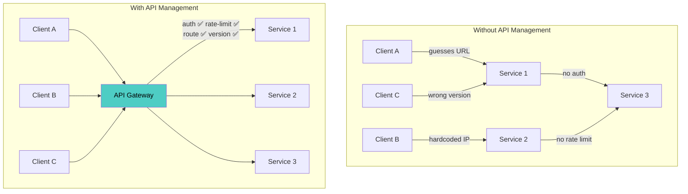

| Without API Management | With API Management |
|---|---|
| Consumers hardcode service URLs | Discovery and routing via gateway |
| No consistent auth across services | Centralized authentication + per-service authorization |
| API changes break consumers silently | Versioning + deprecation + contract tests |
| No visibility into API usage | Analytics, rate limiting, quotas |
| Security applied inconsistently | Uniform policy enforcement |
| No developer documentation | Auto-generated portal from specs |

---

## 2. Integration Patterns

### 2.1 Synchronous vs. Asynchronous Integration

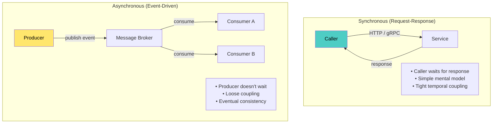

### 2.2 Integration Styles Comparison

| Dimension | REST (HTTP) | gRPC | GraphQL | Async Messaging | Webhooks |
|---|---|---|---|---|---|
| **Coupling** | Medium | Medium | Low (client picks fields) | Very Low | Low |
| **Latency** | Medium | Low (binary, HTTP/2) | Medium | High (eventual) | Variable |
| **Schema** | OpenAPI (optional) | Protobuf (mandatory) | SDL (mandatory) | AsyncAPI / Avro / Protobuf | Loose |
| **Streaming** | Limited (SSE, chunked) | Bidirectional native | Subscriptions | Native | One-way |
| **Browser support** | Native | Requires gRPC-Web | Native | Requires WebSocket bridge | Callback URLs |
| **Best for** | External/public APIs | Internal service-to-service | Frontend aggregation | Decoupled workflows | Third-party notifications |

### 2.3 When to Use Which

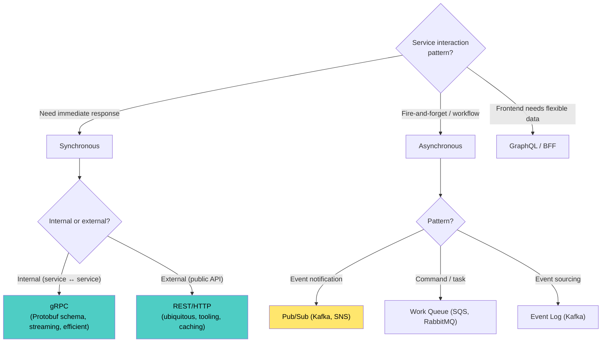

---

## 3. API Gateway

### 3.1 What the Gateway Does

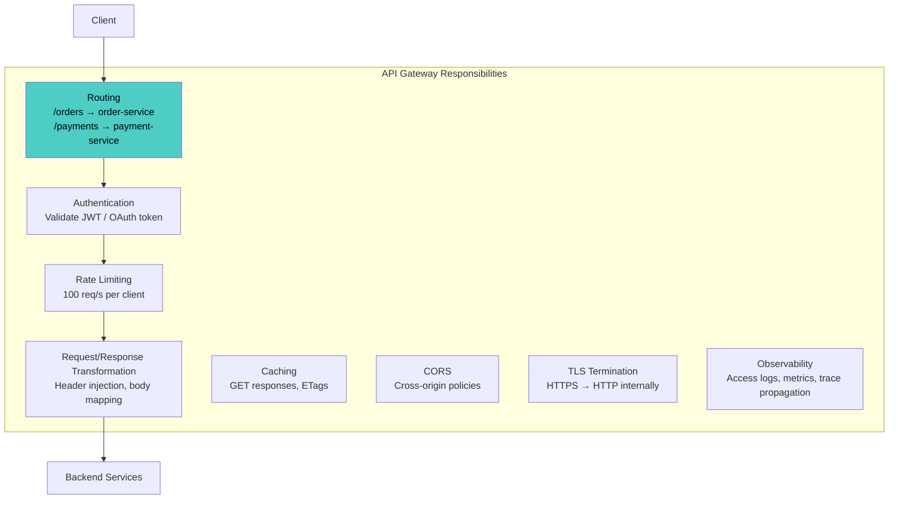

### 3.2 Gateway Topology

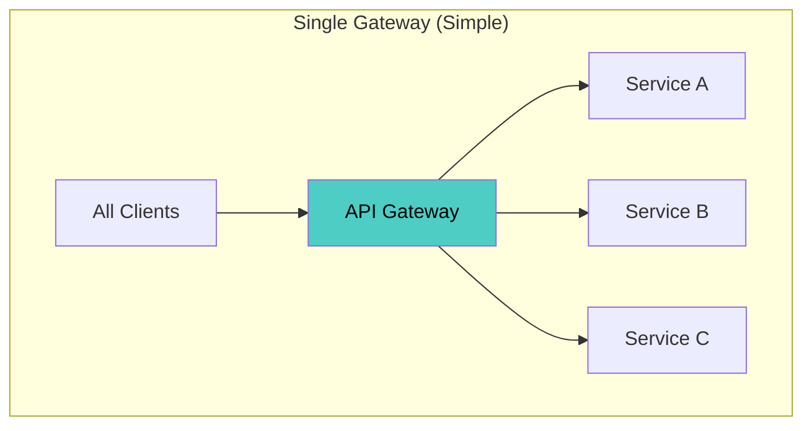

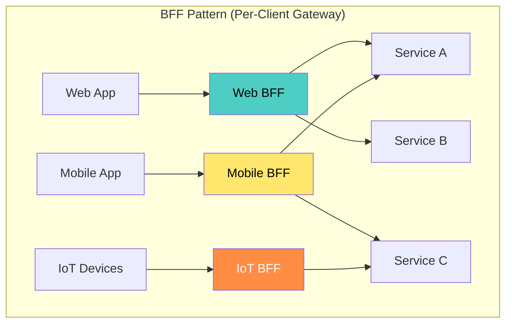

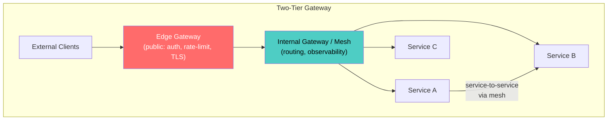

### 3.3 Gateway Technology Comparison

| Gateway | Type | Strengths | Weaknesses |
|---|---|---|---|
| **Kong** | OSS + Enterprise | Plugin ecosystem, Lua extensibility, K8s ingress | Complex config for advanced use |
| **APISIX** | OSS (Apache) | High performance, dynamic routing, dashboard | Smaller community than Kong |
| **Envoy** | OSS (CNCF) | Core of service meshes (Istio), L4/L7, xDS API | Not a traditional API gateway (no portal) |
| **AWS API Gateway** | Managed | Serverless integration, zero ops | AWS lock-in, cold starts, cost at scale |
| **Apigee (Google)** | Managed | Full lifecycle management, analytics, portal | Expensive, complex |
| **Traefik** | OSS | Auto-discovery (K8s, Docker), simple config | Less feature-rich for enterprise API management |
| **Spring Cloud Gateway** | OSS | Java ecosystem integration | JVM-only |

### 3.4 Gateway vs. Service Mesh

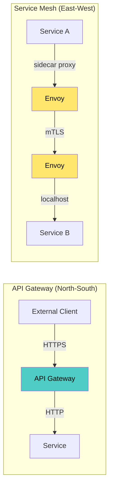

| Concern | API Gateway | Service Mesh |
|---|---|---|
| **Traffic direction** | North-South (client → system) | East-West (service → service) |
| **Auth** | External auth (OAuth, API keys) | mTLS between services |
| **Rate limiting** | Per-client / per-API quotas | Per-service traffic policies |
| **Routing** | Path/header-based to backend services | Canary, circuit breaking, retries |
| **Developer portal** | Yes (API docs, key management) | No |
| **Observability** | Access logs, API analytics | Full mesh telemetry (latency, errors per hop) |

**Use both:** API Gateway for external traffic + Service Mesh for internal traffic.

---

## 4. API Design Standards

### 4.1 REST API Design

```mermaid
graph TB
    subgraph "REST Resource Design"
        RESOURCE["Resource: /orders"]
        GET_ALL["GET /orders<br/>→ List orders (paginated)"]
        GET_ONE["GET /orders/&#123;id&#125;<br/>→ Get single order"]
        POST["POST /orders<br/>→ Create order"]
        PUT["PUT /orders/&#123;id&#125;<br/>→ Replace order"]
        PATCH["PATCH /orders/&#123;id&#125;<br/>→ Partial update"]
        DELETE["DELETE /orders/&#123;id&#125;<br/>→ Delete order"]
    end

    RESOURCE --> GET_ALL
    RESOURCE --> GET_ONE
    RESOURCE --> POST
    RESOURCE --> PUT
    RESOURCE --> PATCH
    RESOURCE --> DELETE

    subgraph "Sub-Resources"
        ITEMS["GET /orders/&#123;id&#125;/items<br/>→ List order items"]
        ADD_ITEM["POST /orders/&#123;id&#125;/items<br/>→ Add item to order"]
    end

    style RESOURCE fill:#4ecdc4,color:#000
```

### 4.2 Consistent Response Envelope

```json
// Success
{
  "data": {
    "id": "ord_a1b2c3",
    "status": "confirmed",
    "total": 149.99,
    "items": [...]
  },
  "meta": {
    "request_id": "req_xyz789",
    "timestamp": "2026-04-18T10:30:00Z"
  }
}

// Paginated List
{
  "data": [...],
  "pagination": {
    "cursor": "eyJpZCI6MTAwfQ==",
    "has_more": true,
    "limit": 50
  }
}

// Error (RFC 7807)
{
  "type": "https://api.example.com/errors/insufficient-funds",
  "title": "Insufficient Funds",
  "status": 402,
  "detail": "Account balance $23.50 is below the required $49.99",
  "instance": "/orders/ord_a1b2c3/payment",
  "trace_id": "4bf92f3577b34da6a3ce929d0e0e4736"
}
```

### 4.3 gRPC API Design

```protobuf
syntax = "proto3";
package commerce.orders.v1;

service OrderService {
  // Unary
  rpc CreateOrder(CreateOrderRequest) returns (Order);
  rpc GetOrder(GetOrderRequest) returns (Order);
  
  // Server streaming
  rpc ListOrders(ListOrdersRequest) returns (stream Order);
  
  // Bidirectional streaming
  rpc OrderUpdates(stream OrderUpdateRequest) returns (stream OrderEvent);
}

message CreateOrderRequest {
  string customer_id = 1;
  repeated OrderItem items = 2;
  string idempotency_key = 3;  // prevent duplicate orders
}

message Order {
  string id = 1;
  string customer_id = 2;
  OrderStatus status = 3;
  google.protobuf.Timestamp created_at = 4;
  repeated OrderItem items = 5;
  Money total = 6;
}

enum OrderStatus {
  ORDER_STATUS_UNSPECIFIED = 0;
  ORDER_STATUS_PENDING = 1;
  ORDER_STATUS_CONFIRMED = 2;
  ORDER_STATUS_SHIPPED = 3;
  ORDER_STATUS_CANCELLED = 4;
}
```

### 4.4 AsyncAPI for Event-Driven APIs

```yaml
asyncapi: 2.6.0
info:
  title: Order Events API
  version: 1.0.0
channels:
  order.placed:
    publish:
      operationId: onOrderPlaced
      message:
        $ref: '#/components/messages/OrderPlaced'
  order.cancelled:
    publish:
      operationId: onOrderCancelled
      message:
        $ref: '#/components/messages/OrderCancelled'

components:
  messages:
    OrderPlaced:
      payload:
        type: object
        properties:
          order_id:
            type: string
          customer_id:
            type: string
          total:
            type: number
          placed_at:
            type: string
            format: date-time
```

---

## 5. API Versioning

### 5.1 Versioning Strategies

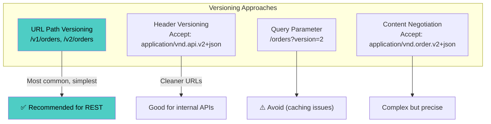

### 5.2 Versioning Comparison

| Approach | Example | Pros | Cons |
|---|---|---|---|
| **URL path** | `/v1/orders` | Simple, visible, cacheable | URL pollution, not RESTful purists' choice |
| **Header** | `Api-Version: 2` | Clean URLs | Hidden, harder to test in browser |
| **Content-Type** | `Accept: application/vnd.myapi.v2+json` | Precise per-resource | Complex, tooling support varies |
| **No versioning (evolution)** | Add fields, never remove | Simplest if disciplined | Requires strict backward compatibility |

**For gRPC:** Use package versioning (`commerce.orders.v1`, `commerce.orders.v2`) and Protobuf's built-in backward compatibility rules.

### 5.3 Backward-Compatible Changes (Safe)

| Change Type | Example | Safe? |
|---|---|---|
| Add optional field | Add `discount_code` to response | ✅ Yes |
| Add new endpoint | Add `GET /orders/{id}/tracking` | ✅ Yes |
| Add enum value | Add `ORDER_STATUS_REFUNDED` | ✅ Yes (if consumers handle unknown) |
| Widen input validation | Accept 100-char names instead of 50 | ✅ Yes |
| Add optional query parameter | `?include=items` | ✅ Yes |

### 5.4 Breaking Changes (Require New Version)

| Change Type | Example | Why Breaking |
|---|---|---|
| Remove field | Remove `customer_name` from response | Consumers may depend on it |
| Rename field | `customer_name` → `buyer_name` | Same as remove + add |
| Change field type | `price: string` → `price: number` | Deserialization breaks |
| Change URL structure | `/orders/{id}` → `/orders/{order_id}` | Client URLs break |
| Add required field | Request now requires `currency` | Old clients don't send it |
| Narrow validation | Max 50 chars instead of 100 | Previously valid input rejected |

### 5.5 API Evolution Strategy

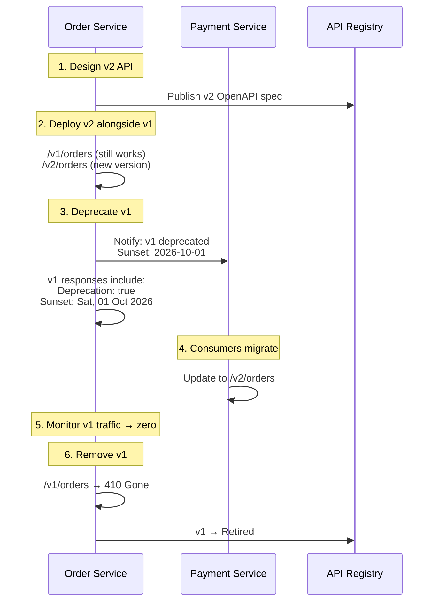

---

## 6. API Security

### 6.1 Security Layers

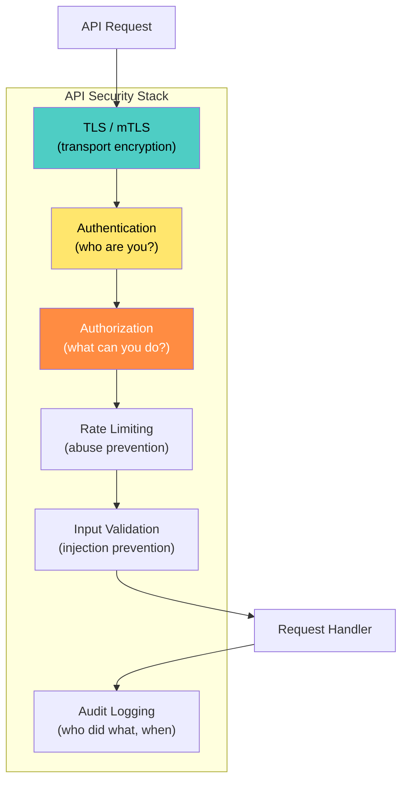

### 6.2 Authentication Patterns

| Pattern | Mechanism | Best For |
|---|---|---|
| **API Key** | `X-API-Key: abc123` | Simple machine-to-machine, public APIs (low security) |
| **OAuth 2.0 + JWT** | `Authorization: Bearer eyJ...` | User-facing APIs, delegation, scoped access |
| **mTLS** | Client certificate | Service-to-service (mesh), zero-trust |
| **API Key + OAuth** | API key for identification, OAuth for authorization | External developer APIs |

### 6.3 External vs. Internal API Security

```mermaid
graph TB
    subgraph "External API Security"
        EXT2["External Client"]
        EXT_GW["API Gateway"]
        
        EXT2 -->|"HTTPS + OAuth JWT"| EXT_GW
        EXT_GW -->|"validate token<br/>rate limit<br/>WAF"| INT_SVC["Internal Service"]
    end

    subgraph "Internal API Security (Service Mesh)"
        SVC_A["Service A"]
        PROXY_C["Envoy Sidecar"]
        PROXY_D["Envoy Sidecar"]
        SVC_B2["Service B"]
        
        SVC_A --> PROXY_C
        PROXY_C -->|"mTLS + SPIFFE ID"| PROXY_D
        PROXY_D -->|"AuthorizationPolicy:<br/>allow only Service A"| SVC_B2
    end

    style EXT_GW fill:#ff6b6b,color:#fff
    style PROXY_C fill:#4ecdc4,color:#000
    style PROXY_D fill:#4ecdc4,color:#000
```

---

## 7. Service Integration Patterns

### 7.1 Request-Response Patterns

#### Direct Call

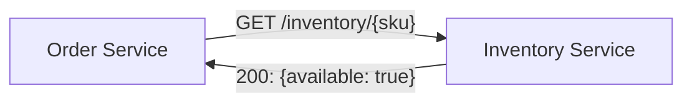

Simple but creates coupling — Order Service fails if Inventory Service is down.

#### API Composition / Aggregation

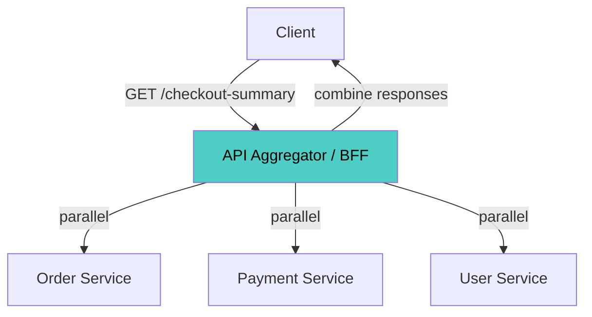

```python
# API composition in BFF / aggregator
import asyncio
import httpx

async def get_checkout_summary(user_id: str, order_id: str):
    async with httpx.AsyncClient() as client:
        # Parallel calls
        order_task = client.get(f"{ORDER_URL}/orders/{order_id}")
        user_task = client.get(f"{USER_URL}/users/{user_id}")
        payment_task = client.get(f"{PAYMENT_URL}/methods?user={user_id}")

        order_resp, user_resp, payment_resp = await asyncio.gather(
            order_task, user_task, payment_task
        )

    return {
        "order": order_resp.json(),
        "user": user_resp.json(),
        "payment_methods": payment_resp.json(),
    }
```

#### Service Mesh Resilience

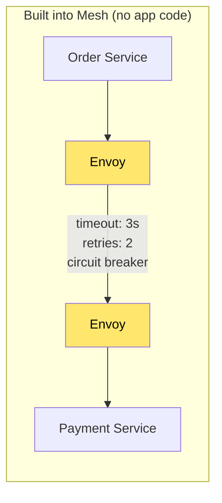

### 7.2 Asynchronous Integration Patterns

#### Event Notification

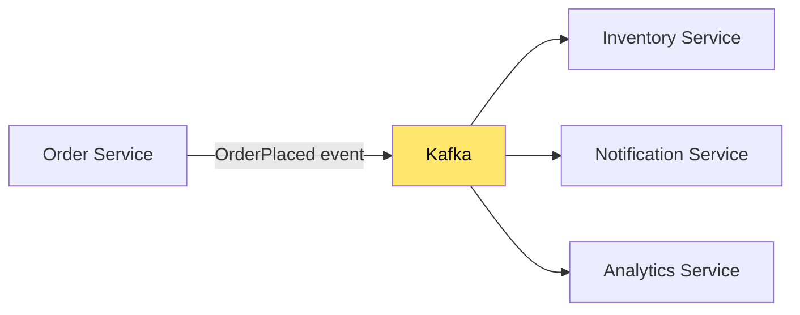

#### Command Queue (Task Distribution)

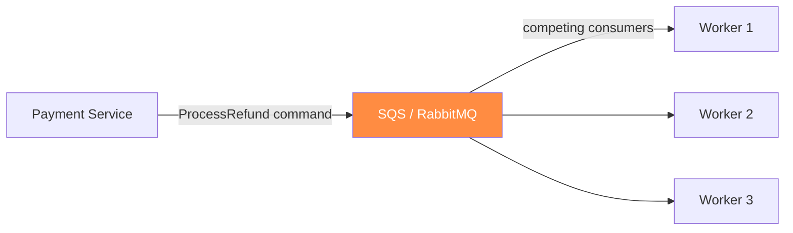

#### Event-Carried State Transfer

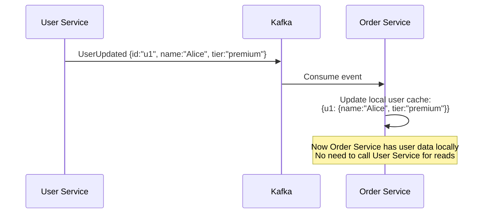

This pattern reduces synchronous coupling — each service maintains a **local read-only copy** of data it needs from other services.

### 7.3 Integration Pattern Decision Matrix

| Pattern | Coupling | Latency | Complexity | Data Consistency | Best For |
|---|---|---|---|---|---|
| **Direct call** | High | Low | Low | Strong | Simple queries, low-traffic |
| **API composition** | Medium | Medium | Medium | Strong (if all succeed) | BFF aggregation |
| **Event notification** | Very Low | High (eventual) | Medium | Eventual | Workflows, side effects |
| **Command queue** | Low | High | Medium | Eventual | Background processing |
| **Event-carried state** | Very Low | None (local read) | High | Eventual | High-read, low-write data |
| **Request-reply via queue** | Low | Medium | High | Strong (per request) | Async with response needed |

---

## 8. API Registry & Developer Portal

### 8.1 API Registry Architecture

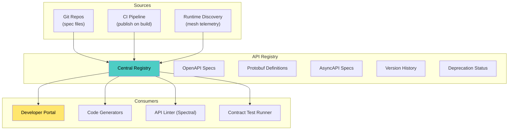

### 8.2 Developer Portal Features

| Feature | Purpose |
|---|---|
| **API Catalog** | Searchable list of all APIs with versions, owners, lifecycle state |
| **Interactive Docs** | "Try it" functionality (Swagger UI / Redoc) |
| **Code Samples** | Auto-generated examples in multiple languages |
| **SDK Generation** | Client SDKs generated from OpenAPI/Protobuf |
| **API Key Management** | Self-service key provisioning and rotation |
| **Usage Analytics** | Which APIs are popular, which are unused |
| **Changelog** | Version diffs showing what changed between API versions |
| **Status Page** | Real-time health and latency of each API |

### 8.3 API Lifecycle in the Registry

```mermaid
stateDiagram-v2
    [*] --> Draft: spec created
    Draft --> Published: approved + deployed
    Published --> Deprecated: sunset decision
    Deprecated --> Retired: consumers migrated
    Retired --> [*]
    
    Published --> Published: minor version (compatible)
    Published --> Published: new major version
```

---

## 9. Schema Management & Compatibility

### 9.1 Schema Registry (for Events)

```mermaid
graph LR
    PRODUCER2["Producer"] -->|"serialize with schema"| SR["Schema Registry<br/>(Confluent, Apicurio)"]
    SR -->|"schema ID in message"| KAFKA3["Kafka"]
    KAFKA3 --> CONSUMER4["Consumer"]
    CONSUMER4 -->|"fetch schema by ID"| SR

    style SR fill:#4ecdc4,color:#000
```

### 9.2 Compatibility Modes

| Mode | Rule | Use Case |
|---|---|---|
| **Backward** | New schema can read data written by old schema | Consumers upgrade first |
| **Forward** | Old schema can read data written by new schema | Producers upgrade first |
| **Full** | Both backward and forward compatible | Safest — no coordination needed |
| **None** | No compatibility check | Development only — never production |

### 9.3 Schema Evolution Rules

```mermaid
graph TD
    subgraph "Safe Schema Changes"
        ADD_OPT["Add optional field<br/>(with default)"]
        ADD_ALIAS["Add field alias"]
        WIDEN["Widen type<br/>(int → long)"]
    end

    subgraph "Breaking Schema Changes"
        REMOVE["Remove field"]
        RENAME["Rename field"]
        CHANGE_TYPE["Change type<br/>(string → int)"]
        ADD_REQ["Add required field<br/>(without default)"]
    end

    style ADD_OPT fill:#4ecdc4,color:#000
    style REMOVE fill:#ff6b6b,color:#fff
    style CHANGE_TYPE fill:#ff6b6b,color:#fff
```

---

## 10. API Rate Limiting & Throttling

### 10.1 Rate Limiting Patterns

```mermaid
graph TB
    subgraph "Rate Limiting Tiers"
        GLOBAL["Global Rate Limit<br/>10,000 req/s total"]
        PER_CLIENT["Per-Client Limit<br/>100 req/s per API key"]
        PER_ENDPOINT["Per-Endpoint Limit<br/>/search: 50 req/s<br/>/orders: 200 req/s"]
        PER_USER["Per-User Limit<br/>10 req/s per user"]
    end

    REQUEST2["Request"] --> GLOBAL --> PER_CLIENT --> PER_ENDPOINT --> PER_USER --> HANDLER2["Handler"]

    style GLOBAL fill:#ff6b6b,color:#fff
    style PER_CLIENT fill:#ff8c42,color:#fff
    style PER_ENDPOINT fill:#ffe66d,color:#000
    style PER_USER fill:#4ecdc4,color:#000
```

### 10.2 Rate Limit Response

```http
HTTP/1.1 429 Too Many Requests
Retry-After: 30
X-RateLimit-Limit: 100
X-RateLimit-Remaining: 0
X-RateLimit-Reset: 1713438630

{
  "type": "https://api.example.com/errors/rate-limited",
  "title": "Rate Limit Exceeded",
  "status": 429,
  "detail": "You have exceeded 100 requests per minute. Retry after 30 seconds."
}
```

### 10.3 Algorithms

| Algorithm | Behavior | Pros | Cons |
|---|---|---|---|
| **Fixed Window** | Count per time window (e.g., 100/min) | Simple | Burst at window edges |
| **Sliding Window** | Rolling window average | Smoother than fixed | More memory |
| **Token Bucket** | Tokens added at fixed rate, consumed per request | Allows controlled bursts | Slightly complex |
| **Leaky Bucket** | Requests processed at constant rate, excess queued | Smooth output rate | No bursting allowed |

---

## 11. Service Discovery & Routing

### 11.1 Discovery Patterns

```mermaid
graph TB
    subgraph "Client-Side Discovery"
        CLIENT3["Client"]
        SR2["Service Registry<br/>(Consul, Eureka)"]
        INST1["Instance 1"]
        INST2["Instance 2"]
        INST3["Instance 3"]

        CLIENT3 -->|"1. query registry"| SR2
        SR2 -->|"2. return instances"| CLIENT3
        CLIENT3 -->|"3. load-balance + call"| INST2
    end

    style SR2 fill:#ffe66d,color:#000
```

```mermaid
graph TB
    subgraph "Server-Side Discovery (Kubernetes)"
        CLIENT4["Client"]
        KSVC["K8s Service<br/>(kube-dns: order-service.default.svc)"]
        POD1["Pod 1"]
        POD2["Pod 2"]
        POD3["Pod 3"]

        CLIENT4 -->|"1. DNS resolve"| KSVC
        KSVC -->|"2. route to healthy pod"| POD2
    end

    style KSVC fill:#4ecdc4,color:#000
```

```mermaid
graph TB
    subgraph "Mesh-Based Discovery (Istio/Envoy)"
        CLIENT5["Service A"]
        PROXY_G["Envoy Sidecar"]
        CP["Istiod<br/>(Control Plane)"]
        TARGET["Service B Pods"]

        CLIENT5 -->|"localhost:port"| PROXY_G
        CP -->|"push service endpoints"| PROXY_G
        PROXY_G -->|"intelligent routing<br/>(weighted, canary, retry)"| TARGET
    end

    style PROXY_G fill:#ffe66d,color:#000
    style CP fill:#4ecdc4,color:#000
```

### 11.2 Discovery Comparison

| Pattern | Mechanism | Pros | Cons |
|---|---|---|---|
| **DNS (K8s Service)** | kube-dns resolves service name | Zero config, built-in | No advanced routing, stale cache |
| **Client-side (Consul/Eureka)** | Client queries registry, picks instance | Fine-grained control | Client complexity, library per language |
| **Server-side (K8s + LB)** | Platform routes to healthy pod | Transparent to client | Less control per-client |
| **Service Mesh (Istio/Envoy)** | Sidecar proxy handles all routing | Advanced traffic management, zero app code | Infrastructure complexity |

---

## 12. API Testing Strategy

### 12.1 API Test Layers

```mermaid
graph TB
    subgraph "API Testing Pyramid"
        E2E3["E2E API Tests<br/>(full environment)"]
        CONTRACT3["Contract Tests<br/>(Pact / schema validation)"]
        COMPONENT3["Component Tests<br/>(service + stubs)"]
        UNIT3["Unit Tests<br/>(handler logic, serialization)"]
    end

    E2E3 --- CONTRACT3 --- COMPONENT3 --- UNIT3

    style E2E3 fill:#ff6b6b,color:#fff
    style CONTRACT3 fill:#4ecdc4,color:#000
    style COMPONENT3 fill:#ffe66d,color:#000
    style UNIT3 fill:#a8e6cf,color:#000
```

### 12.2 Contract Testing for API Compatibility

```mermaid
sequenceDiagram
    participant CONSUMER5 as Consumer (Order Service)
    participant BROKER2 as Pact Broker
    participant PROVIDER2 as Provider (Payment Service)

    CONSUMER5->>CONSUMER5: Consumer test generates<br/>expected request/response pairs
    CONSUMER5->>BROKER2: Publish Pact
    
    PROVIDER2->>BROKER2: Fetch Pact
    PROVIDER2->>PROVIDER2: Replay requests against real service
    PROVIDER2->>BROKER2: Publish verification ✅

    Note over BROKER2: "Can I Deploy?" gate<br/>blocks incompatible deploys
```

### 12.3 API Linting in CI

```yaml
# Spectral API linting in CI
name: API Lint
on: pull_request
jobs:
  lint:
    runs-on: ubuntu-latest
    steps:
      - uses: actions/checkout@v4
      - name: Lint OpenAPI spec
        uses: stoplightio/spectral-action@v0.8.0
        with:
          file_glob: 'api/openapi.yaml'
          spectral_ruleset: '.spectral.yaml'
```

---

## 13. API Analytics & Observability

### 13.1 What to Measure

```mermaid
graph TB
    subgraph "API Metrics"
        TRAFFIC["Traffic<br/>req/s per endpoint, per consumer"]
        LATENCY2["Latency<br/>p50, p95, p99 per endpoint"]
        ERRORS2["Errors<br/>4xx, 5xx rate per endpoint"]
        USAGE["Usage<br/>which endpoints, which versions, which consumers"]
        QUOTA["Quota<br/>% of rate limit consumed per client"]
    end

    TRAFFIC --> DASHBOARD["Grafana Dashboard"]
    LATENCY2 --> DASHBOARD
    ERRORS2 --> DASHBOARD
    USAGE --> DASHBOARD
    QUOTA --> DASHBOARD

    USAGE --> DEPREC2["Identify unused APIs<br/>for deprecation"]

    style DASHBOARD fill:#4ecdc4,color:#000
    style DEPREC2 fill:#ffe66d,color:#000
```

### 13.2 API Health Dashboard

```
┌─────────────────────────────┬──────────┬────────┬────────┬───────────────┐
│ Endpoint                    │ Traffic  │ p99    │ Errors │ Status        │
├─────────────────────────────┼──────────┼────────┼────────┼───────────────┤
│ GET  /v1/orders             │ 1.2K rps │ 45ms   │ 0.1%   │ ✅ OK         │
│ POST /v1/orders             │ 200 rps  │ 120ms  │ 0.3%   │ ✅ OK         │
│ POST /v1/payments           │ 180 rps  │ 350ms  │ 1.2%   │ ⚠️ WARN       │
│ GET  /v1/inventory          │ 3.5K rps │ 12ms   │ 0.0%   │ ✅ OK         │
│ GET  /v1/users (deprecated) │ 5 rps    │ 80ms   │ 0.0%   │ 🔴 DEPRECATED │
└─────────────────────────────┴──────────┴────────┴────────┴───────────────┘
```

---

## 14. Anti-Patterns

| Anti-Pattern | Problem | Fix |
|---|---|---|
| **API Gateway as monolith** | All business logic in the gateway | Gateway handles cross-cutting only (auth, routing, rate limit); business logic in services |
| **God API** | One service exposes hundreds of endpoints | Split by bounded context; one API per service |
| **No versioning** | Breaking changes deployed → consumers crash | URL-path versioning + deprecation headers |
| **Internal APIs exposed externally** | Internal service details leak to public consumers | Separate internal and external APIs; use BFF for external |
| **Chatty integration** | 20 API calls to render one page | API composition / BFF aggregates; event-carried state transfer |
| **No schema** | API contract exists only in code | OpenAPI / Protobuf / AsyncAPI specs committed to Git, published to registry |
| **Hardcoded URLs** | `http://10.0.1.23:8080/orders` in config | Service discovery (K8s DNS, mesh) |
| **No rate limiting** | One misbehaving client saturates a service | Per-client rate limits at gateway + per-service limits |
| **Shared client libraries** | Provider ships a "client SDK" that couples consumer to implementation | Consumers generate their own clients from published specs |
| **Contract-less integration** | No contract tests; provider changes break consumers in production | Pact / schema-based contract tests in CI |
| **API versioning via feature flags** | Mixing deployment versioning with API versioning | Separate concerns: feature flags for behavior, URL versioning for API shape |

---

## 15. Decision Framework

```mermaid
graph TD
    START{"API management<br/>maturity?"} -->|"No gateway, no standards"| S1["Step 1: API Gateway<br/>+ REST style guide"]
    START -->|"Gateway exists"| S2["Step 2: API versioning<br/>+ OpenAPI specs in registry"]
    START -->|"Specs + versioning"| S3["Step 3: Contract tests<br/>+ schema registry + developer portal"]
    START -->|"Full API management"| S4["Step 4: Analytics, deprecation<br/>automation, API-as-product"]

    S1 --> Q1{"Internal or external APIs?"}
    Q1 -->|"Internal only"| MESH_FIRST["Service mesh + gRPC<br/>(skip traditional gateway)"]
    Q1 -->|"External APIs"| GW_FIRST["API Gateway (Kong/APISIX)<br/>+ OAuth + rate limiting"]
    Q1 -->|"Both"| BOTH["Edge gateway (external)<br/>+ mesh (internal)"]

    S2 --> Q2{"Sync or async?"}
    Q2 -->|"Mostly sync"| OPENAPI["OpenAPI + Spectral linting"]
    Q2 -->|"Mostly async"| ASYNCAPI["AsyncAPI + Schema Registry"]
    Q2 -->|"Both"| BOTH_SPECS["OpenAPI + AsyncAPI +<br/>Protobuf for gRPC"]

    S3 --> Q3{"Many consumers?"}
    Q3 -->|"Known internal consumers"| PACT["Consumer-driven contracts (Pact)"]
    Q3 -->|"Unknown / external consumers"| PROVIDER_SCHEMA["Provider-driven (schema-first)"]

    style S1 fill:#4ecdc4,color:#000
    style BOTH fill:#ffe66d,color:#000
```

---

## 16. Checklist

### API Design
- [ ] API style guide documented (naming, errors, pagination, versioning)
- [ ] All APIs have machine-readable specs (OpenAPI / Protobuf / AsyncAPI)
- [ ] API specs committed to Git and published to registry
- [ ] Spectral / buf lint runs in CI on every PR
- [ ] RFC 7807 Problem Details format for all error responses
- [ ] Idempotency keys for non-idempotent operations (POST)

### API Gateway
- [ ] Gateway deployed for external traffic (Kong, APISIX, cloud-native)
- [ ] Authentication enforced at gateway (OAuth/JWT for external, mTLS for internal)
- [ ] Rate limiting configured per-client and per-endpoint
- [ ] CORS policies defined
- [ ] Request/response logging with trace propagation

### Versioning & Lifecycle
- [ ] URL-path versioning strategy for REST; package versioning for gRPC
- [ ] Backward-compatible changes preferred over new versions
- [ ] Deprecation policy: sunset headers, consumer notification, timeline
- [ ] API registry tracks lifecycle state (draft → published → deprecated → retired)
- [ ] "Can I Deploy?" contract gate in CI/CD pipeline

### Integration
- [ ] Synchronous integration uses timeouts, retries, and circuit breakers
- [ ] Asynchronous integration uses schema registry with compatibility mode
- [ ] Event-driven APIs documented with AsyncAPI
- [ ] Service discovery via K8s DNS or service mesh (no hardcoded URLs)
- [ ] API composition / BFF for frontend aggregation

### Security
- [ ] External APIs: OAuth 2.0 + JWT at gateway
- [ ] Internal APIs: mTLS via service mesh
- [ ] Input validation at every service boundary
- [ ] API keys rotatable without downtime
- [ ] WAF / DDoS protection at edge

### Observability & Analytics
- [ ] API metrics: traffic, latency (p50/p95/p99), error rate per endpoint
- [ ] API usage analytics: identify unused endpoints for deprecation
- [ ] Rate limit consumption visible per client
- [ ] Developer portal with interactive docs, code samples, SDK generation

---

## 17. Recommendation

**Build API management in layers:**

| Phase | Focus | Key Outcome |
|---|---|---|
| **Phase 1** | API Gateway + REST style guide + OpenAPI specs | Consistent, secure, documented APIs |
| **Phase 2** | API versioning + contract tests + linting in CI | Safe API evolution, no breaking surprises |
| **Phase 3** | Schema registry + AsyncAPI + developer portal | Full API catalog; self-service for consumers |
| **Phase 4** | API analytics + deprecation automation + API-as-product | Data-driven API lifecycle management |

The core insight: **APIs are products, not just endpoints**. Each API has consumers (internal or external) who depend on its reliability, performance, and backward compatibility. Treating APIs with the same discipline as user-facing products — versioning, documentation, deprecation lifecycle, usage analytics — is what separates a well-integrated microservices system from a fragile collection of HTTP endpoints.

---

**Next steps to explore:** GraphQL Federation for API Composition, gRPC & Protobuf Deep Dive, Event-Driven Architecture Patterns.