# Service Performance & Optimization in Microservices

---

## 1. Why Performance Is Different in Microservices

A monolith's performance bottleneck is typically one slow function or one slow query. In microservices, **latency compounds across the call chain** — a request that traverses 5 services, each adding 50ms, delivers 250ms+ to the user before any individual service looks "slow."

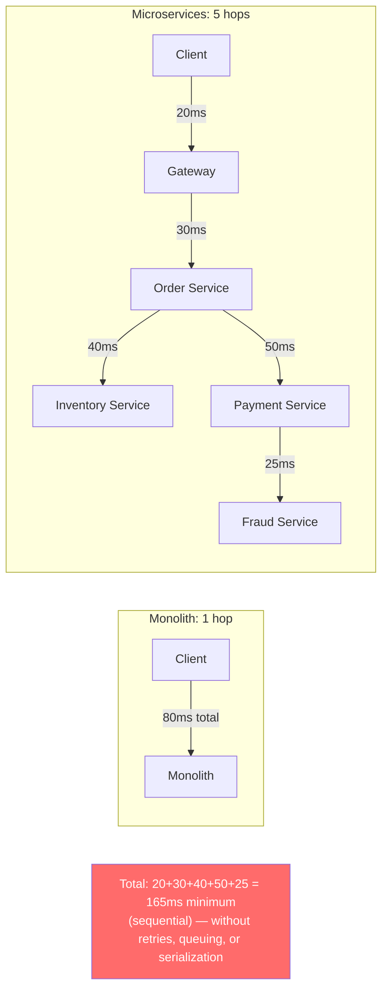

| Monolith Performance | Microservices Performance |
|---|---|
| In-process function calls (~µs) | Network calls (~ms per hop) |
| Shared memory | Serialization/deserialization per boundary |
| Single database connection pool | Distributed data: N databases, N connection pools |
| One GC, one heap | N runtimes, N GCs, N resource limits |
| Profile one process | Profile across distributed traces |
| Optimize one deploy | Each service has its own scaling and resource profile |

---

## 2. Performance Taxonomy

### 2.1 Where Latency Hides

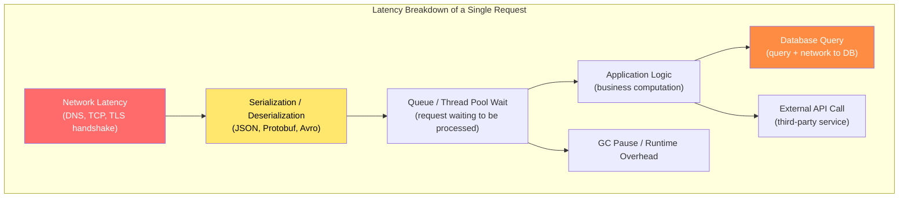

### 2.2 The Four Performance Dimensions

| Dimension | Metric | Target (typical SLO) |
|---|---|---|
| **Latency** | Response time (p50, p95, p99) | p99 < 500ms for user-facing APIs |
| **Throughput** | Requests per second (RPS) | Matches peak traffic + 2x headroom |
| **Resource Efficiency** | CPU/memory utilization per request | < 70% utilization at peak |
| **Scalability** | Throughput increase per added instance | Linear or near-linear |

---

## 3. Identifying Performance Bottlenecks

### 3.1 The Observability-First Approach

**Never optimize without data.** Use the three pillars to find the real bottleneck:

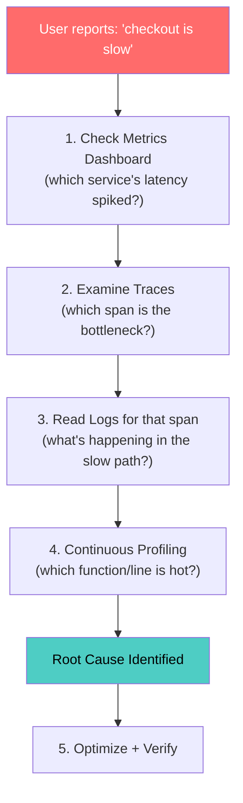

### 3.2 Trace-Driven Performance Analysis

```mermaid
gantt
    title Trace: POST /checkout — 1,850ms (SLO: 500ms)
    dateFormat X
    axisFormat %L ms

    section API Gateway
    route + auth            :done, 0, 25

    section Order Service
    validate cart           :done, 25, 60
    check inventory (sync)  :crit, 60, 450
    calculate tax (sync)    :done, 450, 520

    section Inventory Service
    query DB               :crit, 60, 380
    reserve stock          :done, 380, 450

    section Payment Service
    tokenize card          :done, 520, 600
    charge gateway         :crit, 600, 1750
    fraud check (inline)   :crit, 600, 1200

    section Notification
    send email (sync!)     :crit, 1750, 1850
```

Reading this trace reveals **four optimization targets**:
1. **Inventory DB query** (320ms) — slow query, needs index or cache
2. **Fraud check** (600ms) — should be async or have a timeout
3. **Payment gateway** (1150ms) — external latency; add timeout + circuit breaker
4. **Email notification** (100ms) — should be async (fire-and-forget)

### 3.3 Continuous Profiling

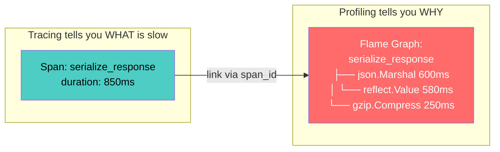

**Tools:** Grafana Pyroscope, Datadog Continuous Profiler, async-profiler (Java), py-spy (Python), pprof (Go).

---

## 4. Network-Level Optimization

### 4.1 Reducing Network Hops

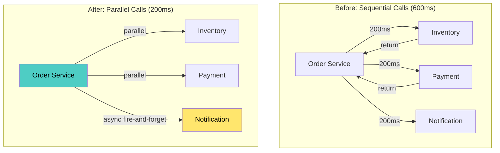

| Technique | How | Latency Savings |
|---|---|---|
| **Parallelize independent calls** | `asyncio.gather()`, `CompletableFuture.allOf()` | Reduces from sum to max of call latencies |
| **Async fire-and-forget** | Publish to message queue instead of sync call | Removes non-critical calls from request path |
| **API composition / BFF** | Aggregate in one layer, not cascading calls | Reduces client round-trips |
| **Event-carried state transfer** | Cache other services' data locally | Eliminates remote calls for reads |

### 4.2 Connection Pooling & Reuse

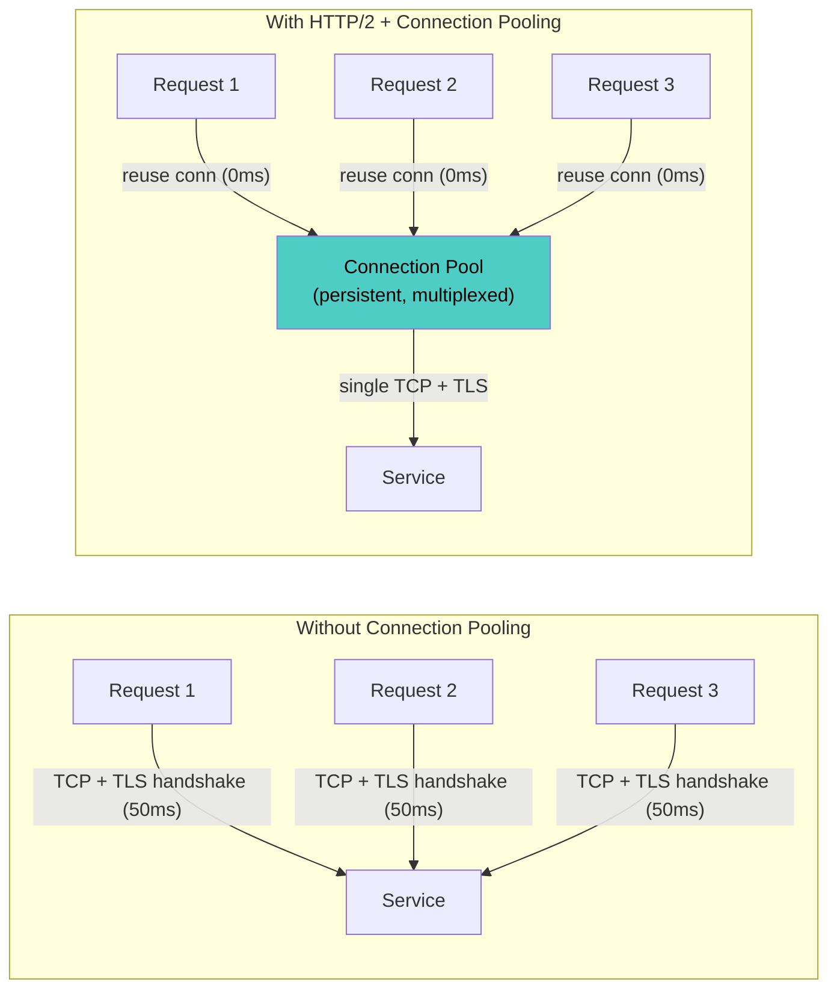

| Optimization | Impact |
|---|---|
| **HTTP/2** | Multiplexed streams over single connection; eliminates head-of-line blocking |
| **gRPC (HTTP/2 + Protobuf)** | Binary serialization + multiplexing = 2–10x faster than REST/JSON |
| **Connection pooling** | Avoid per-request TCP/TLS handshake overhead |
| **Keep-alive** | Reuse connections across requests |
| **DNS caching** | Avoid DNS lookup per request (respect TTL) |

### 4.3 Serialization Optimization

| Format | Encode Speed | Decode Speed | Size | Human Readable | Schema |
|---|---|---|---|---|---|
| **JSON** | Slow | Slow | Large | ✅ | Optional (OpenAPI) |
| **Protobuf** | Fast | Fast | Small (3–10x smaller) | ❌ | Mandatory (.proto) |
| **Avro** | Fast | Fast | Small | ❌ | Mandatory (.avsc) |
| **MessagePack** | Fast | Fast | Medium | ❌ | Optional |
| **FlatBuffers** | Zero-copy | Zero-copy | Small | ❌ | Mandatory |

**Rule of thumb:** JSON for external/public APIs (ubiquitous tooling), Protobuf/gRPC for internal service-to-service (performance + schema enforcement).

---

## 5. Caching Strategies

### 5.1 Cache Layers

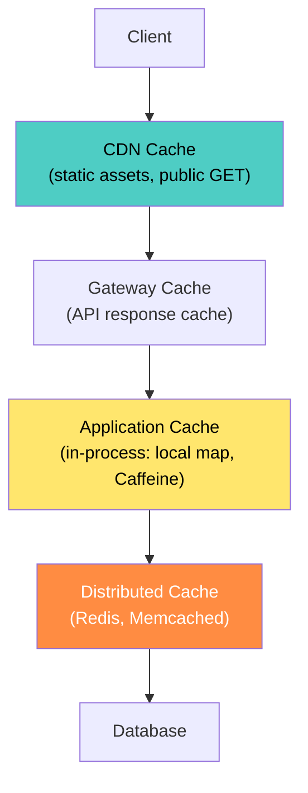

### 5.2 Cache Patterns

| Pattern | How It Works | Pros | Cons |
|---|---|---|---|
| **Cache-Aside (Lazy)** | App checks cache → miss → read DB → populate cache | Simple, only caches what's needed | Cache miss = slow first request |
| **Read-Through** | Cache itself fetches from DB on miss | Transparent to app | Requires cache-layer support |
| **Write-Through** | Write to cache + DB synchronously | Strong consistency | Write latency increased |
| **Write-Behind (Write-Back)** | Write to cache, async flush to DB | Fast writes | Data loss risk on cache failure |
| **Refresh-Ahead** | Proactively refresh entries before expiry | No cache-miss latency | Wasted refreshes for cold data |

### 5.3 Cache-Aside Implementation

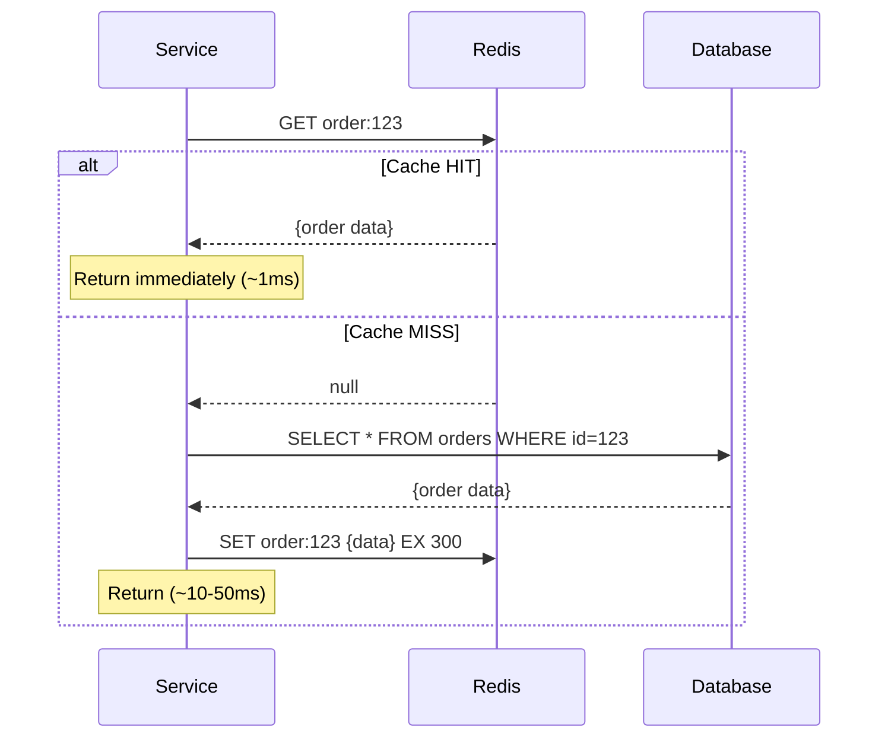

### 5.4 Cache Invalidation Strategies

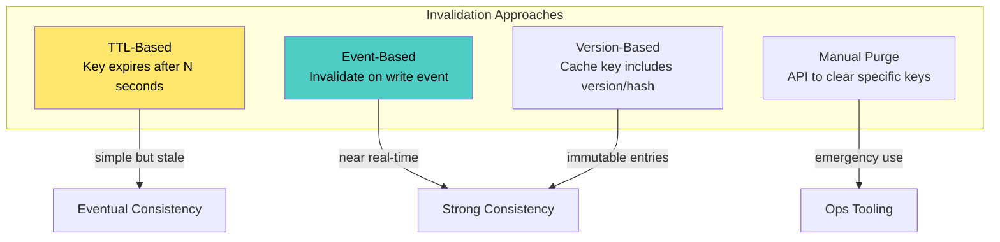

**Event-driven invalidation (recommended for microservices):**

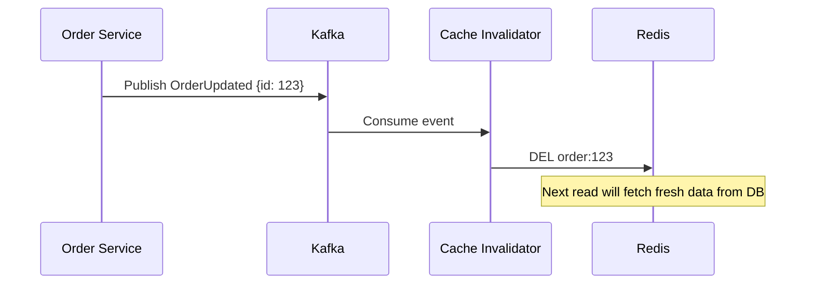

### 5.5 What to Cache (and What Not To)

| Cache ✅ | Don't Cache ❌ |
|---|---|
| Frequently read, rarely changed data | Highly personalized, per-request data |
| Reference data (product catalog, config) | Data that must be real-time consistent |
| Expensive query results | Sensitive data (PII, tokens) without encryption |
| External API responses (with appropriate TTL) | Write-heavy, rapidly changing data |
| Session data (Redis) | Unbounded result sets |

---

## 6. Database Performance

### 6.1 Query Optimization

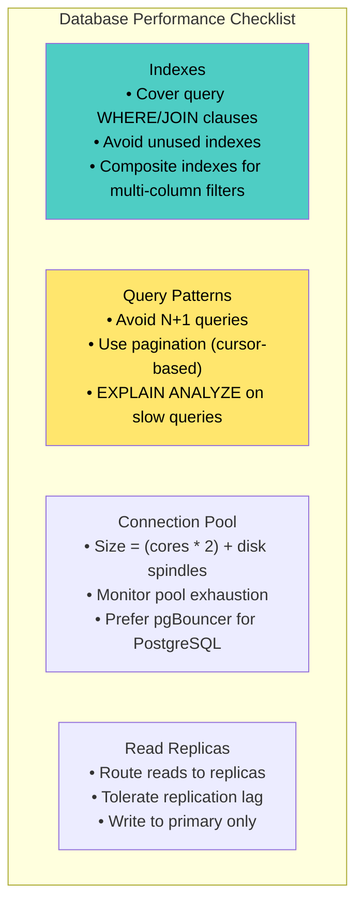

### 6.2 N+1 Query Problem

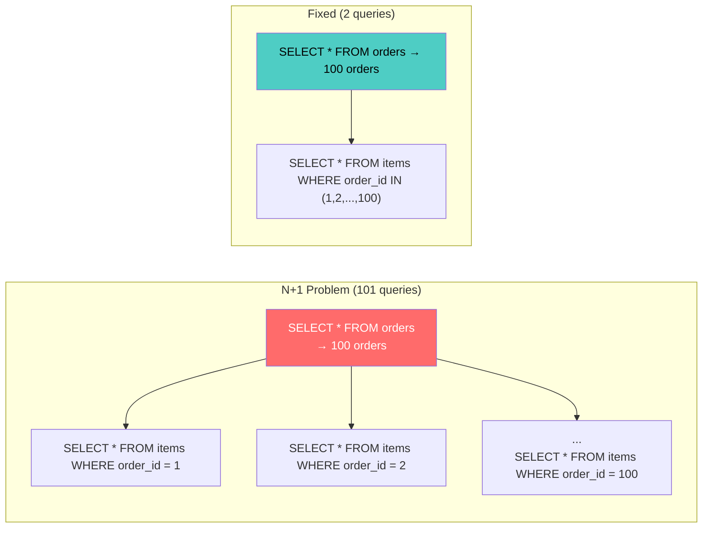

### 6.3 CQRS for Read/Write Optimization

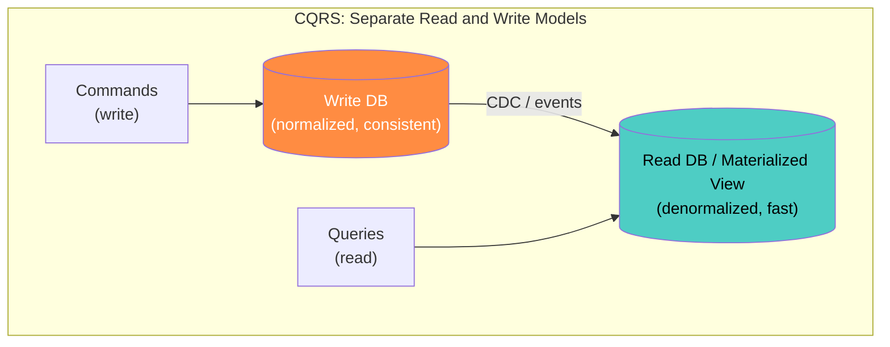

| Concern | Write Side | Read Side |
|---|---|---|
| **Schema** | Normalized (3NF) | Denormalized (pre-joined) |
| **Optimized for** | Integrity, consistency | Query speed, specific views |
| **Database** | PostgreSQL, MySQL | Elasticsearch, Redis, materialized views |
| **Scale** | Vertical (single primary) | Horizontal (read replicas, caches) |

---

## 7. Application-Level Optimization

### 7.1 Asynchronous Processing

```mermaid
graph TD
    subgraph "Before: Everything Synchronous (1200ms)"
        REQ["POST /checkout"]
        V["Validate (30ms)"]
        PAY["Charge (200ms)"]
        INV["Reserve Inventory (150ms)"]
        EMAIL["Send Email (300ms)"]
        RECEIPT["Generate Receipt PDF (400ms)"]
        AUDIT["Write Audit Log (120ms)"]
        
        REQ --> V --> PAY --> INV --> EMAIL --> RECEIPT --> AUDIT
    end

    subgraph "After: Critical Path Only (380ms)"
        REQ2["POST /checkout"]
        V2["Validate (30ms)"]
        PAY2["Charge (200ms)"]
        INV2["Reserve Inventory (150ms)"]
        RESP["Return 202 Accepted"]
        
        Q["Message Queue"]
        EMAIL2["Send Email (async)"]
        RECEIPT2["Generate Receipt (async)"]
        AUDIT2["Write Audit (async)"]
        
        REQ2 --> V2 --> PAY2 --> INV2 --> RESP
        INV2 -->|"publish"| Q
        Q --> EMAIL2
        Q --> RECEIPT2
        Q --> AUDIT2
    end

    style REQ fill:#ff6b6b,color:#fff
    style REQ2 fill:#4ecdc4,color:#000
    style RESP fill:#4ecdc4,color:#000
    style Q fill:#ffe66d,color:#000
```

**Critical path latency: 1200ms → 380ms (68% reduction)** by moving non-critical work to async.

### 7.2 Batching & Buffering

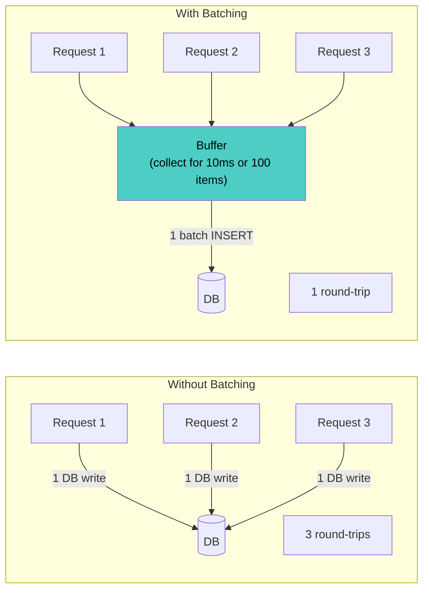

| Technique | Mechanism | Use Case |
|---|---|---|
| **Request batching** | Collect N requests, execute as one batch | Bulk DB inserts, bulk API calls |
| **DataLoader pattern** | Batch + deduplicate within a single request cycle | GraphQL resolvers, N+1 prevention |
| **Write buffering** | Buffer writes, flush periodically | Audit logs, analytics events |
| **Read batching** | Combine multiple cache reads into MGET | Reduce Redis round-trips |

### 7.3 Pagination

| Pattern | Mechanism | Pros | Cons |
|---|---|---|---|
| **Offset-based** | `?offset=100&limit=50` | Simple | Slow for large offsets (DB scans) |
| **Cursor-based** | `?cursor=eyJ...&limit=50` | Consistent, fast regardless of page depth | Cannot jump to arbitrary page |
| **Keyset** | `?after_id=abc&limit=50` | Fast (indexed seek), stable | Requires unique sortable key |

**Always use cursor/keyset pagination** for service-to-service APIs and large datasets. Offset pagination degrades at scale.

### 7.4 Compression

| Layer | Compression | Impact |
|---|---|---|
| **HTTP response** | `Content-Encoding: gzip` or `br` (Brotli) | 60–80% size reduction for JSON |
| **gRPC** | Protobuf (already compact) + optional gzip | 3–10x smaller than JSON natively |
| **Message queue** | Compress message payloads (Snappy, LZ4, zstd) | Reduce broker storage + network |
| **Database** | Column compression, TOAST (PostgreSQL) | Reduce I/O for wide rows |

---

## 8. Resource Optimization

### 8.1 Right-Sizing Containers

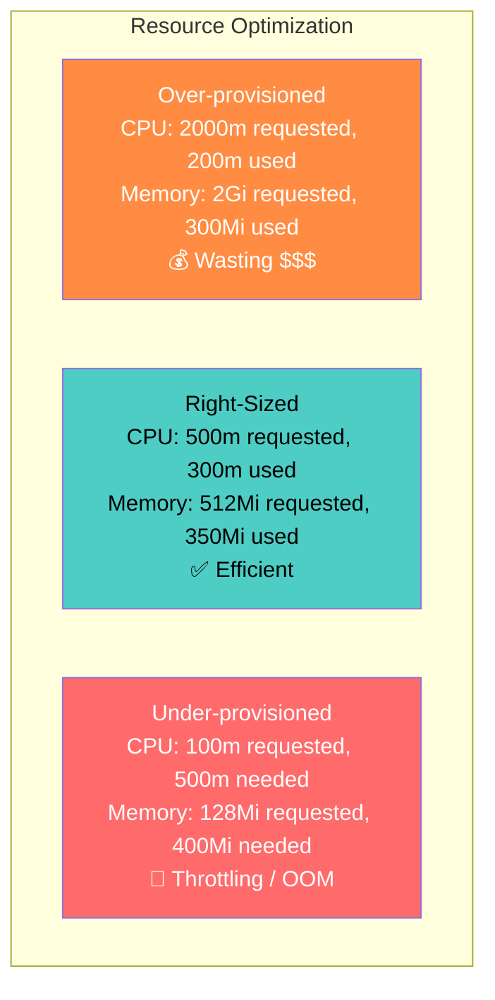

**Process for right-sizing:**

1. **Observe** actual usage for 2+ weeks (Prometheus: `container_cpu_usage_seconds_total`, `container_memory_working_set_bytes`)
2. **Set requests** to p95 of actual usage
3. **Set limits** to 2x requests (headroom for spikes)
4. **Use VPA recommendations** (Kubernetes Vertical Pod Autoscaler in recommend mode)

### 8.2 Autoscaling

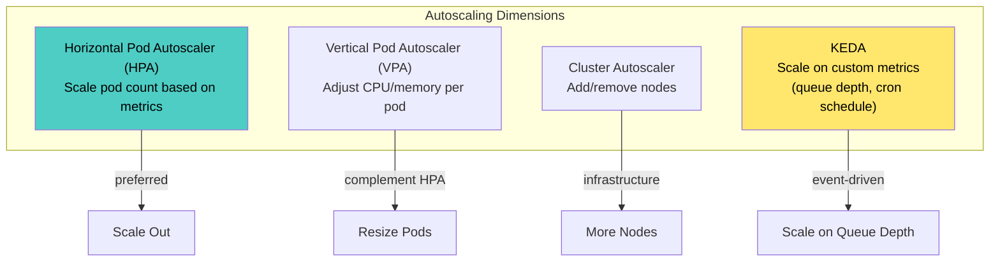

```yaml
# HPA: scale on CPU + custom metric (requests per second)
apiVersion: autoscaling/v2
kind: HorizontalPodAutoscaler
metadata:
  name: order-service
spec:
  scaleTargetRef:
    apiVersion: apps/v1
    kind: Deployment
    name: order-service
  minReplicas: 3
  maxReplicas: 20
  metrics:
    - type: Resource
      resource:
        name: cpu
        target:
          type: Utilization
          averageUtilization: 70
    - type: Pods
      pods:
        metric:
          name: http_requests_per_second
        target:
          type: AverageValue
          averageValue: "100"
  behavior:
    scaleUp:
      stabilizationWindowSeconds: 60
      policies:
        - type: Percent
          value: 50        # scale up by at most 50% at a time
          periodSeconds: 60
    scaleDown:
      stabilizationWindowSeconds: 300  # wait 5 min before scaling down
      policies:
        - type: Percent
          value: 25
          periodSeconds: 120
```

### 8.3 Cold Start Optimization

| Optimization | Technique | Impact |
|---|---|---|
| **JVM warm-up** | CDS (Class Data Sharing), GraalVM native image | Startup: 30s → 1s |
| **Dependency pre-loading** | Lazy-init non-critical deps; eager-init critical ones | Faster readiness |
| **Container image size** | Distroless / Alpine base, multi-stage build | Faster pull: 500MB → 50MB |
| **Startup probe** | Allow slow startup without liveness kills | Avoid restart loops |
| **Pod topology** | Pod anti-affinity across zones | Avoid all replicas on cold nodes |

---

## 9. Resilience as Performance

### 9.1 Timeouts, Retries, Circuit Breakers

Resilience patterns directly impact **tail latency** (p99). Without timeouts, a single slow dependency makes every request slow.

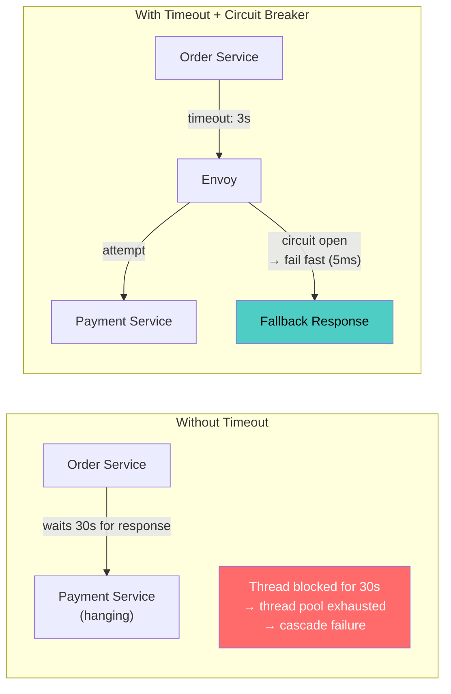

### 9.2 Timeout Budget

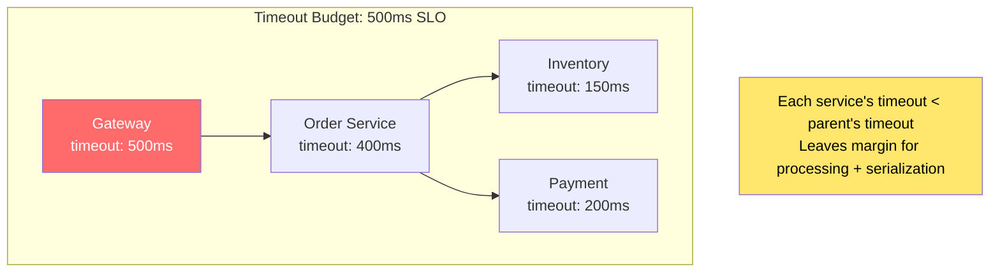

**Rule:** Each downstream timeout must be strictly less than the caller's timeout. The gateway's timeout is the user-facing SLO.

### 9.3 Retry with Backoff

```python
# Exponential backoff with jitter
import random
import time

def retry_with_backoff(func, max_retries=3, base_delay=0.1):
    for attempt in range(max_retries):
        try:
            return func()
        except TransientError:
            if attempt == max_retries - 1:
                raise
            delay = base_delay * (2 ** attempt) + random.uniform(0, 0.1)
            time.sleep(delay)
            # Delays: ~0.1s, ~0.3s, ~0.5s (with jitter)
```

**Jitter prevents thundering herd:** Without jitter, all retries fire at the same time, amplifying the load spike on the failing service.

---

## 10. Load Testing & Benchmarking

### 10.1 Load Testing Strategy

```mermaid
graph TB
    subgraph "Load Test Types"
        BASELINE["Baseline Test<br/>Normal traffic for 10 min<br/>→ establish baseline metrics"]
        LOAD["Load Test<br/>Ramp to expected peak<br/>→ verify SLOs under load"]
        STRESS["Stress Test<br/>Ramp beyond peak until failure<br/>→ find breaking point"]
        SOAK["Soak Test<br/>Sustained load for hours<br/>→ find memory leaks, GC issues"]
        SPIKE["Spike Test<br/>Sudden 10x burst<br/>→ test autoscaler response"]
    end

    BASELINE --> LOAD --> STRESS
    LOAD --> SOAK
    LOAD --> SPIKE

    style BASELINE fill:#4ecdc4,color:#000
    style STRESS fill:#ff6b6b,color:#fff
```

### 10.2 Load Test in CI

```javascript
// k6 load test — checkout flow
import http from 'k6/http';
import { check, sleep } from 'k6';

export const options = {
  stages: [
    { duration: '2m', target: 100 },   // ramp up
    { duration: '5m', target: 100 },   // sustained
    { duration: '2m', target: 300 },   // push to peak
    { duration: '5m', target: 300 },   // sustained peak
    { duration: '2m', target: 0 },     // ramp down
  ],
  thresholds: {
    http_req_duration: ['p(95)<300', 'p(99)<500'],
    http_req_failed: ['rate<0.01'],
    http_reqs: ['rate>500'],
  },
};

export default function () {
  const res = http.post(`${__ENV.BASE_URL}/v1/checkout`,
    JSON.stringify({ cart_id: `perf-${__VU}-${__ITER}` }),
    { headers: { 'Content-Type': 'application/json' } }
  );

  check(res, {
    'status 201': (r) => r.status === 201,
    'latency < 500ms': (r) => r.timings.duration < 500,
  });

  sleep(1); // think time
}
```

### 10.3 Performance Regression Detection

```mermaid
graph LR
    subgraph "CI Pipeline Performance Gate"
        TEST2["k6 Load Test<br/>(against staging)"]
        COMPARE["Compare vs Baseline"]
        GATE{"p99 regressed > 20%?"}
    end

    TEST2 --> COMPARE --> GATE
    GATE -->|"No"| PASS["✅ Pass"]
    GATE -->|"Yes"| FAIL["❌ Block Deploy"]

    style PASS fill:#4ecdc4,color:#000
    style FAIL fill:#ff6b6b,color:#fff
```

---

## 11. Optimization Techniques Matrix

### 11.1 Quick Wins (High Impact, Low Effort)

| Technique | Impact | Effort | Where |
|---|---|---|---|
| Add database indexes for slow queries | High | Low | Database |
| Enable HTTP response compression (gzip/br) | Medium | Low | Gateway/Service |
| Add Redis cache for hot read paths | High | Low | Application |
| Set proper timeouts on all outgoing calls | High | Low | Application/Mesh |
| Switch from JSON to Protobuf (internal APIs) | Medium | Medium | Inter-service |
| Enable connection pooling / HTTP/2 | Medium | Low | Network |
| Move non-critical work to async (queue) | High | Medium | Architecture |

### 11.2 Medium Effort Optimizations

| Technique | Impact | Effort | Where |
|---|---|---|---|
| CQRS: separate read/write models | High | Medium | Architecture |
| Event-carried state transfer (local read cache) | High | Medium | Architecture |
| Parallelize independent service calls | High | Medium | Application |
| Implement cursor-based pagination | Medium | Medium | API |
| Right-size container resources (VPA) | Medium | Low | Infrastructure |
| Configure HPA with custom metrics | Medium | Medium | Infrastructure |

### 11.3 Strategic Optimizations (High Effort)

| Technique | Impact | Effort | Where |
|---|---|---|---|
| Database sharding | Very High | High | Database |
| CDN for API responses (public GET) | High | Medium | Edge |
| Read replicas with query routing | High | High | Database |
| Service mesh with locality-aware routing | Medium | High | Infrastructure |
| GraalVM native images (JVM services) | Medium | High | Runtime |
| Edge computing / regional deployment | High | Very High | Architecture |

---

## 12. Performance SLOs & Budgets

### 12.1 Defining Performance SLOs

```mermaid
graph TB
    subgraph "Performance SLO Framework"
        SLI["SLI: p99 latency of /checkout endpoint"]
        SLO["SLO: p99 < 500ms, measured over 28-day window"]
        EB["Error Budget: 0.1% of requests can exceed 500ms"]
        SLA["SLA: p99 < 1000ms (external commitment)"]
    end

    SLI --> SLO --> EB --> SLA

    NOTE7["Internal SLO (500ms) is tighter than<br/>external SLA (1000ms) — margin for safety"]

    style SLO fill:#4ecdc4,color:#000
    style SLA fill:#ff6b6b,color:#fff
```

### 12.2 Latency Budget Allocation

```
Total latency budget: 500ms (p99)

┌─────────────────────────────────────────────────┐
│ Gateway overhead          │  20ms  (4%)          │
│ Order Service logic       │  50ms  (10%)         │
│ Database queries          │ 100ms  (20%)         │
│ Inventory Service call    │ 100ms  (20%)         │
│ Payment Service call      │ 150ms  (30%)         │
│ Serialization overhead    │  30ms  (6%)          │
│ Network (5 hops × 10ms)  │  50ms  (10%)         │
│ ─────────────────────────────────────────────── │
│ TOTAL                     │ 500ms  (100%)        │
└─────────────────────────────────────────────────┘
```

Each team owns their portion of the latency budget. If Payment Service exceeds 150ms p99, **that team** is responsible for optimization.

---

## 13. Anti-Patterns

| Anti-Pattern | Problem | Fix |
|---|---|---|
| **Premature optimization** | Optimizing code that isn't on the critical path | Profile first; optimize the real bottleneck |
| **Synchronous everything** | All inter-service calls are blocking request-response | Move non-critical work to async (queues/events) |
| **N+1 queries** | Loop of individual queries instead of batch | Batch queries, DataLoader pattern, eager loading |
| **No timeouts** | One slow service blocks all callers indefinitely | Set timeouts at every outgoing call; use timeout budgets |
| **Cache everything** | Caching write-heavy or low-read data; high invalidation cost | Cache selectively: high-read, low-write, expensive-to-compute |
| **Offset pagination at scale** | `OFFSET 100000` scans and discards 100K rows | Cursor/keyset pagination |
| **Over-provisioned containers** | 2 CPU / 4GB requested, 0.2 CPU / 400MB used | Monitor actual usage; use VPA recommendations |
| **No performance testing in CI** | Regressions found in production | k6/Gatling in pipeline with threshold gates |
| **Ignoring tail latency (p99)** | "Average is 50ms" but p99 is 5 seconds | Optimize p99, not average; set SLOs on p99 |
| **Chatty APIs** | 20 requests to render one page | BFF aggregation; GraphQL; API composition |
| **String concatenation in hot paths** | O(n²) string building in serialization | Use builders, pre-allocated buffers |
| **Retry storms** | All callers retry simultaneously on failure | Exponential backoff with jitter; circuit breaker |

---

## 14. Decision Framework

```mermaid
graph TD
    START{"Performance problem?"} -->|"Latency too high"| TRACE["Examine distributed traces<br/>→ find slow span"]
    START -->|"Throughput too low"| METRICS2["Check saturation metrics<br/>→ CPU? Memory? Pool exhaustion?"]
    START -->|"Resource cost too high"| RIGHT["Right-size containers<br/>→ VPA recommendations"]
    START -->|"Intermittent spikes"| TAIL["Check p99 vs p50<br/>→ GC pauses? Cold cache? Retry storms?"]

    TRACE --> SPAN{"What's the slow span?"}
    SPAN -->|"DB query"| DB_OPT["Add index / optimize query / add cache"]
    SPAN -->|"External API"| EXT_OPT["Add timeout + circuit breaker + cache response"]
    SPAN -->|"Application logic"| PROFILE2["Continuous profiling → flame graph"]
    SPAN -->|"Network / serialization"| NET_OPT["Switch to gRPC / enable compression"]
    SPAN -->|"Non-critical work"| ASYNC_OPT["Move to async queue"]

    METRICS2 --> SAT{"Saturated resource?"}
    SAT -->|"CPU"| SCALE_H["Scale horizontally (HPA) or optimize hot code"]
    SAT -->|"Memory"| LEAK["Check for leaks; reduce cache size; increase limits"]
    SAT -->|"Connection pool"| POOL_OPT["Increase pool size; add connection reuse"]
    SAT -->|"Disk I/O"| DISK_OPT["SSD; reduce logging; compress data"]

    style TRACE fill:#4ecdc4,color:#000
    style ASYNC_OPT fill:#ffe66d,color:#000
```

---

## 15. Checklist

### Measurement
- [ ] Performance SLOs defined per service (p50, p95, p99 latency; throughput)
- [ ] Latency budget allocated across the call chain
- [ ] Distributed tracing enabled with span-level latency visibility
- [ ] Continuous profiling linked to traces (Pyroscope / equivalent)
- [ ] Load tests run in CI with regression thresholds

### Network
- [ ] HTTP/2 or gRPC for internal service-to-service calls
- [ ] Connection pooling enabled for all outgoing connections
- [ ] Timeouts set on every outgoing call (tighter than caller's timeout)
- [ ] Retries use exponential backoff with jitter
- [ ] Circuit breakers configured for external dependencies
- [ ] Response compression enabled (gzip/Brotli)

### Caching
- [ ] Cache-aside pattern for hot read paths (Redis/Memcached)
- [ ] Cache invalidation strategy defined (TTL + event-based)
- [ ] Cache hit rate monitored; alarm on sudden drop
- [ ] No PII in cache without encryption
- [ ] CDN configured for public static and cacheable API responses

### Database
- [ ] Slow query log enabled; queries above threshold auto-alerted
- [ ] Indexes cover all frequent query patterns
- [ ] N+1 queries eliminated (batch/eager loading)
- [ ] Connection pool sized appropriately and monitored
- [ ] Cursor-based pagination for all list endpoints

### Application
- [ ] Non-critical work moved to async (queues/events)
- [ ] Independent service calls parallelized
- [ ] Protobuf/binary serialization for internal APIs
- [ ] Cold start optimized (small images, eager init, startup probes)
- [ ] No unbounded collections in memory

### Infrastructure
- [ ] Container resources right-sized (based on observed usage)
- [ ] HPA configured with appropriate metrics and scaling behavior
- [ ] Scale-down stabilization window set (avoid flapping)
- [ ] Pod Disruption Budgets defined
- [ ] Autoscaler verified under spike test conditions

---

## 16. Recommendation

**Optimize in this order — measure first, optimize second:**

| Phase | Focus | Key Outcome |
|---|---|---|
| **Phase 1** | Define SLOs + enable tracing + profiling | Know *where* time is spent |
| **Phase 2** | Quick wins: indexes, timeouts, async non-critical work | 50–70% latency reduction typical |
| **Phase 3** | Caching hot paths + connection/serialization optimization | Further latency + cost reduction |
| **Phase 4** | Load testing in CI + autoscaling tuning | Prevent regressions; handle traffic spikes |
| **Phase 5** | Strategic: CQRS, sharding, edge deployment | Scale for the next order of magnitude |

The fundamental insight: **most microservices performance problems are not in application code — they are in the spaces between services.** Network hops, serialization, unnecessary synchronous calls, missing caches, and lack of timeouts account for the vast majority of latency. Optimize the boundaries first, the code second.

---

**Next steps to explore:** CQRS & Event Sourcing Deep Dive, Database Sharding Strategies, Edge Computing & CDN Patterns.