# Service Isolation & Resource Protection in Shared Hosts

---

## 1. The Noisy Neighbor Problem

When multiple microservices share a host (physical machine, VM, or Kubernetes node), one misbehaving service can starve others of CPU, memory, network, or disk — causing cascading failures across unrelated services.

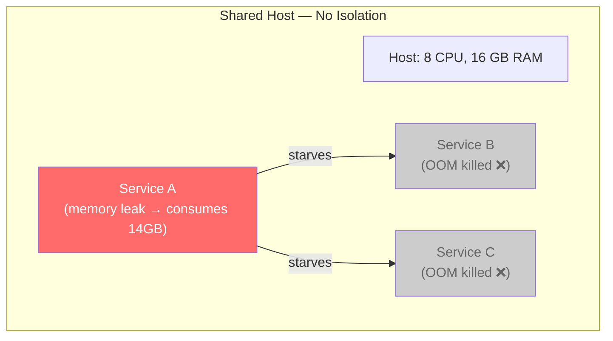

| Resource | How One Service Hurts Others |
|---|---|
| **CPU** | Spin loops, unthrottled batch jobs → other services get no CPU time |
| **Memory** | Memory leak or excessive caching → OOM killer terminates random pods |
| **Disk I/O** | Verbose logging, large temp files → disk throughput saturated |
| **Network** | Unbounded outgoing connections, broadcast storms → bandwidth starved |
| **Disk space** | Unbounded logs fill the volume → all pods on node fail to write |
| **File descriptors / PIDs** | Fork bombs, connection leaks → kernel limit hit, node unstable |

---

## 2. Isolation Mechanisms

### 2.1 The Defense-in-Depth Stack

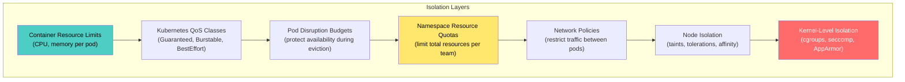

---

## 3. Container Resource Limits (First Line of Defense)

### 3.1 Requests vs. Limits

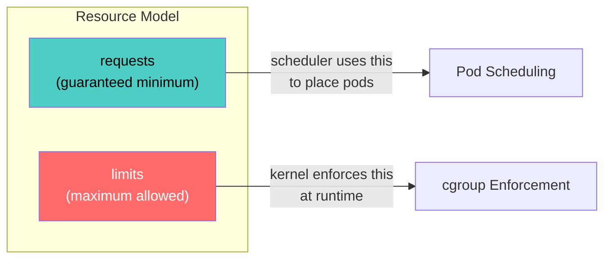

```yaml
apiVersion: apps/v1
kind: Deployment
metadata:
  name: order-service
spec:
  template:
    spec:
      containers:
        - name: order-service
          image: order-service:v2.1.0
          resources:
            requests:
              cpu: "250m"        # guaranteed 0.25 CPU cores
              memory: "256Mi"    # guaranteed 256 MB
            limits:
              cpu: "1000m"       # max 1 CPU core
              memory: "512Mi"    # max 512 MB — OOM killed if exceeded
```

### 3.2 What Happens When Limits Are Hit

| Resource | Behavior When Limit Exceeded |
|---|---|
| **CPU limit** | Process is **throttled** (not killed) — gets fewer CPU cycles |
| **Memory limit** | Process is **OOM killed** — container restarts |
| **No limits set** | Process can consume **entire node** — starves other pods |

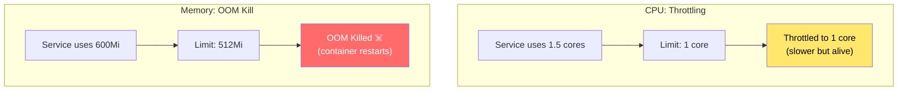

### 3.3 Kubernetes QoS Classes

Kubernetes assigns QoS classes based on how you set requests and limits. This determines **eviction priority** when a node is under pressure:

| QoS Class | Condition | Eviction Priority |
|---|---|---|
| **Guaranteed** | `requests == limits` for all containers | Last to be evicted (highest protection) |
| **Burstable** | `requests < limits` (or only requests set) | Evicted after BestEffort |
| **BestEffort** | No requests or limits set | First to be evicted (no protection) |

```yaml
# Guaranteed QoS — critical services
resources:
  requests:
    cpu: "500m"
    memory: "512Mi"
  limits:
    cpu: "500m"       # same as requests
    memory: "512Mi"   # same as requests

# Burstable QoS — most services
resources:
  requests:
    cpu: "250m"
    memory: "256Mi"
  limits:
    cpu: "1000m"      # can burst up to 1 core
    memory: "512Mi"
```

**Critical services (payment, auth) should use Guaranteed QoS** — they are the last to be evicted under memory pressure.

---

## 4. Namespace Resource Quotas

Prevent one team's services from consuming all cluster resources:

```yaml
apiVersion: v1
kind: ResourceQuota
metadata:
  name: team-alpha-quota
  namespace: team-alpha
spec:
  hard:
    requests.cpu: "8"           # total CPU requests across all pods
    requests.memory: "16Gi"
    limits.cpu: "16"
    limits.memory: "32Gi"
    pods: "50"                  # max 50 pods in namespace
    persistentvolumeclaims: "10"
```

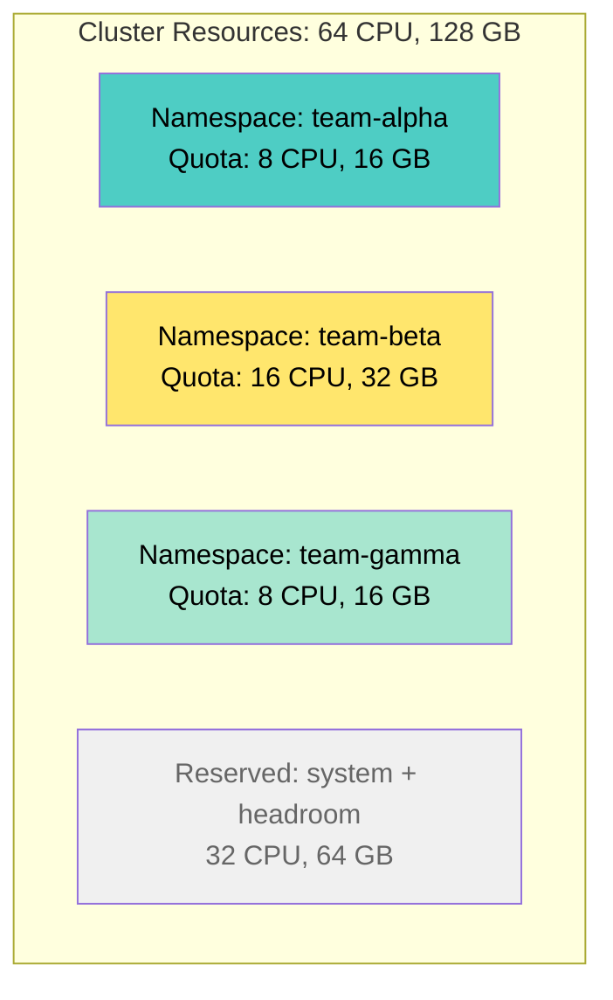

**LimitRange** enforces defaults and bounds per container — so developers can't deploy pods without resource specs:

```yaml
apiVersion: v1
kind: LimitRange
metadata:
  name: default-limits
  namespace: team-alpha
spec:
  limits:
    - type: Container
      default:              # applied if no limits specified
        cpu: "500m"
        memory: "256Mi"
      defaultRequest:       # applied if no requests specified
        cpu: "100m"
        memory: "128Mi"
      max:                  # no container can exceed this
        cpu: "4"
        memory: "4Gi"
      min:                  # no container can request less than this
        cpu: "50m"
        memory: "64Mi"
```

---

## 5. Network Isolation

### 5.1 Network Policies

By default, all pods in a Kubernetes cluster can communicate with all other pods. Network policies restrict this:

```yaml
# Only allow traffic from API gateway to order-service
apiVersion: networking.k8s.io/v1
kind: NetworkPolicy
metadata:
  name: order-service-ingress
  namespace: team-alpha
spec:
  podSelector:
    matchLabels:
      app: order-service
  policyTypes:
    - Ingress
    - Egress
  ingress:
    - from:
        - namespaceSelector:
            matchLabels:
              name: gateway
          podSelector:
            matchLabels:
              app: api-gateway
      ports:
        - port: 8080
  egress:
    - to:
        - podSelector:
            matchLabels:
              app: order-db
      ports:
        - port: 5432
    - to:   # allow DNS
        - namespaceSelector: {}
          podSelector:
            matchLabels:
              k8s-app: kube-dns
      ports:
        - port: 53
          protocol: UDP
```

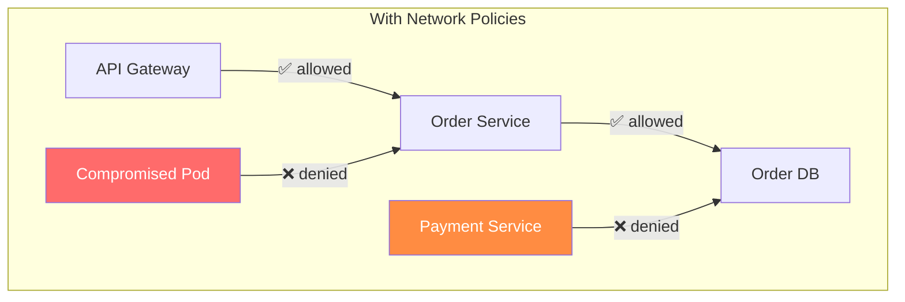

### 5.2 Service Mesh Traffic Policies

```yaml
# Istio: Rate limit between services
apiVersion: networking.istio.io/v1alpha3
kind: EnvoyFilter
metadata:
  name: order-service-rate-limit
spec:
  workloadSelector:
    labels:
      app: order-service
  configPatches:
    - applyTo: HTTP_FILTER
      match:
        context: SIDECAR_INBOUND
      patch:
        operation: INSERT_BEFORE
        value:
          name: envoy.filters.http.local_ratelimit
          typed_config:
            "@type": type.googleapis.com/envoy.extensions.filters.http.local_ratelimit.v3.LocalRateLimit
            stat_prefix: http_local_rate_limiter
            token_bucket:
              max_tokens: 1000
              tokens_per_fill: 1000
              fill_interval: 1s
```

---

## 6. Node-Level Isolation

### 6.1 Taints and Tolerations

Reserve specific nodes for specific workloads:

```yaml
# Taint a node: only critical services can run here
# kubectl taint nodes node-1 tier=critical:NoSchedule

# Pod tolerates the taint
apiVersion: apps/v1
kind: Deployment
metadata:
  name: payment-service
spec:
  template:
    spec:
      tolerations:
        - key: "tier"
          operator: "Equal"
          value: "critical"
          effect: "NoSchedule"
      nodeSelector:
        tier: critical
```

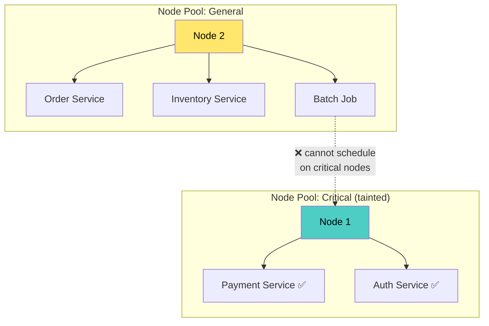

### 6.2 Pod Anti-Affinity

Spread replicas across nodes to avoid single-node failure:

```yaml
spec:
  affinity:
    podAntiAffinity:
      requiredDuringSchedulingIgnoredDuringExecution:
        - labelSelector:
            matchLabels:
              app: order-service
          topologyKey: kubernetes.io/hostname
```

### 6.3 Priority Classes

Ensure critical services survive node pressure by preempting less important pods:

```yaml
apiVersion: scheduling.k8s.io/v1
kind: PriorityClass
metadata:
  name: critical-service
value: 1000000
globalDefault: false
description: "For payment, auth, and other critical services"

---
apiVersion: scheduling.k8s.io/v1
kind: PriorityClass
metadata:
  name: batch-job
value: 100
description: "For batch processing, analytics jobs"
```

```yaml
# Payment service uses critical priority
spec:
  priorityClassName: critical-service
```

Under resource pressure, Kubernetes **preempts** lower-priority pods to make room for higher-priority ones.

---

## 7. Kernel-Level Isolation

### 7.1 cgroups (Enforced by Container Runtime)

Container limits are enforced by Linux cgroups:

| cgroup Controller | What It Limits |
|---|---|
| **cpu** | CPU time shares and throttling |
| **memory** | Memory usage + OOM kill |
| **blkio** | Block I/O bandwidth |
| **pids** | Maximum number of processes |
| **net_cls / net_prio** | Network traffic classification |

### 7.2 Process Limits

Prevent fork bombs and runaway process creation:

```yaml
# Limit PIDs per pod
apiVersion: v1
kind: Pod
spec:
  containers:
    - name: app
      resources:
        limits:
          # Kubernetes 1.20+ supports PID limits via kubelet
          # --pod-max-pids=200 (kubelet flag)
```

### 7.3 Security Contexts

Restrict container capabilities to minimize blast radius:

```yaml
spec:
  containers:
    - name: order-service
      securityContext:
        runAsNonRoot: true
        runAsUser: 1000
        readOnlyRootFilesystem: true
        allowPrivilegeEscalation: false
        capabilities:
          drop: ["ALL"]
        seccompProfile:
          type: RuntimeDefault
```

| Setting | What It Prevents |
|---|---|
| `runAsNonRoot` | Container running as root (host escape risk) |
| `readOnlyRootFilesystem` | Writing to container filesystem (temp file abuse, disk fill) |
| `drop: ["ALL"]` | Linux capabilities (mount, raw sockets, etc.) |
| `seccompProfile` | Dangerous syscalls (ptrace, kernel module loading) |

---

## 8. Disk & I/O Isolation

### 8.1 Ephemeral Storage Limits

```yaml
resources:
  requests:
    ephemeral-storage: "256Mi"
  limits:
    ephemeral-storage: "1Gi"  # evicted if container writes > 1Gi
```

### 8.2 Separate Volumes for Logs

```yaml
# Don't write logs to the node's root filesystem
volumes:
  - name: log-volume
    emptyDir:
      sizeLimit: 500Mi   # capped — won't fill node disk
containers:
  - name: app
    volumeMounts:
      - name: log-volume
        mountPath: /var/log/app
```

### 8.3 Log Rotation

```yaml
# Container runtime log rotation (containerd config)
# /etc/containerd/config.toml
[plugins."io.containerd.grpc.v1.cri"]
  max_container_log_line_size = 16384
  [plugins."io.containerd.grpc.v1.cri".containerd]
    [plugins."io.containerd.grpc.v1.cri".containerd.runtimes]
```

**Kubelet-level log rotation:**
```
--container-log-max-files=5
--container-log-max-size=50Mi
```

---

## 9. Application-Level Isolation

### 9.1 Bulkhead Pattern

Isolate resources within a service so a failure in one area doesn't exhaust the whole service:

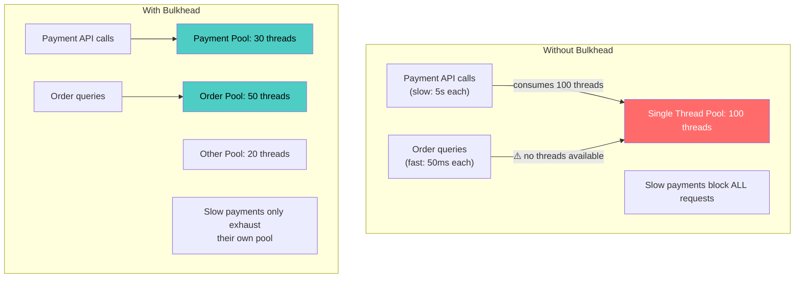

### 9.2 Circuit Breaker

Prevent a failing dependency from consuming caller resources:

```mermaid
stateDiagram-v2
    [*] --> Closed
    Closed --> Open: failure_count > threshold
    Open --> HalfOpen: timeout expires
    HalfOpen --> Closed: probe succeeds
    HalfOpen --> Open: probe fails
    
    note right of Closed: Normal: all requests pass through
    note right of Open: Fast fail: requests rejected immediately (5ms)
    note right of HalfOpen: Test: allow 1 request through
```

### 9.3 Graceful Degradation

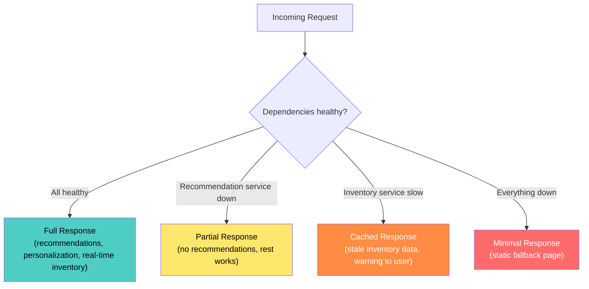

---

## 10. Monitoring Isolation Health

### 10.1 Key Metrics to Watch

| Metric | What It Shows | Alert Threshold |
|---|---|---|
| `container_cpu_cfs_throttled_seconds_total` | CPU throttling (limit hit) | Sustained throttling > 25% |
| `container_memory_working_set_bytes` | Actual memory usage | > 80% of limit |
| `container_oom_events_total` | OOM kills | Any occurrence |
| `kube_pod_status_phase{phase="Evicted"}` | Pod evictions | Any occurrence |
| `node_filesystem_avail_bytes` | Node disk space | < 15% free |
| `kubelet_running_pods` | Pods per node | Approaching max-pods |
| `container_network_transmit_bytes_total` | Network egress per container | Sudden spike > 3x baseline |

### 10.2 Node Pressure Monitoring

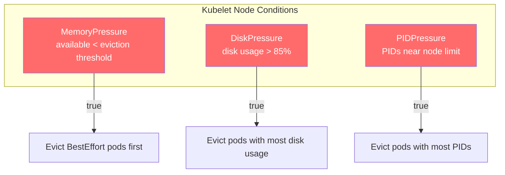

---

## 11. Complete Isolation Architecture

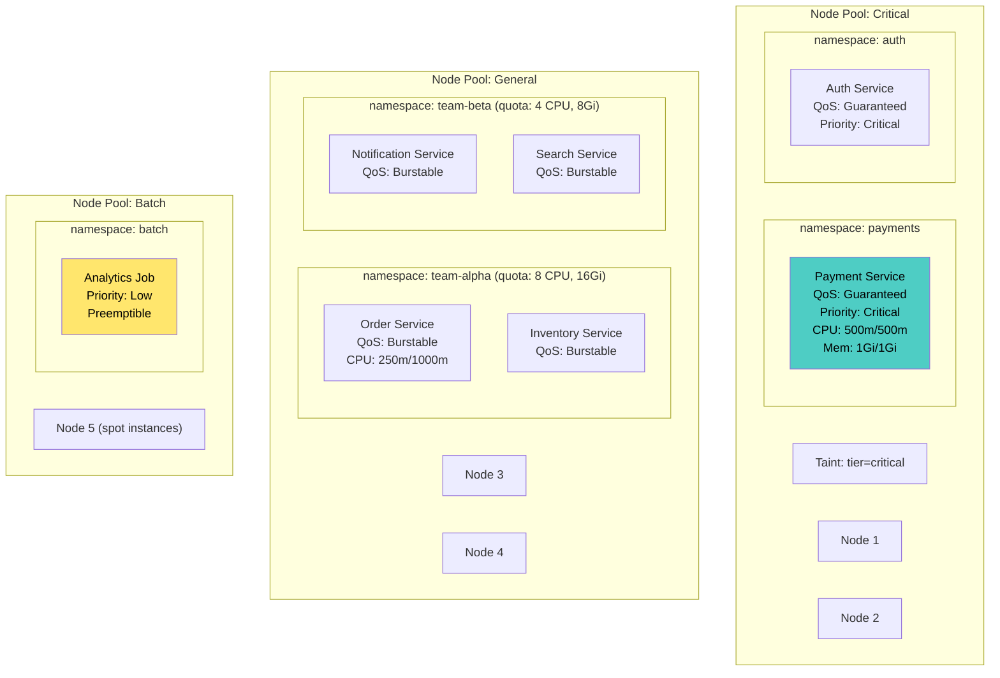

---

## 12. Anti-Patterns

| Anti-Pattern | Problem | Fix |
|---|---|---|
| **No resource limits** | One pod consumes entire node | Always set requests and limits |
| **No memory limit** | Memory leak takes down the node | Set memory limits; accept OOM kill as safety valve |
| **BestEffort QoS for critical services** | First evicted under pressure | Critical services: Guaranteed QoS + high PriorityClass |
| **All pods on one node** | Node failure = total outage | Pod anti-affinity + PDB |
| **Default-allow network policies** | Any pod can reach any pod | Default-deny + explicit allow rules |
| **Unbounded logging to node disk** | Disk fills → node becomes NotReady | Ephemeral storage limits + log rotation + sizeLimit on emptyDir |
| **Running as root** | Container escape → host compromise | `runAsNonRoot: true` + `drop: ["ALL"]` capabilities |
| **No namespace quotas** | One team's runaway deployment exhausts cluster | ResourceQuota per namespace |
| **No LimitRange** | Developers deploy pods without any resource specs | LimitRange enforces defaults and maximums |
| **CPU limits too tight** | Constant throttling → high tail latency | Set CPU limits to 2–4x requests; monitor throttling |

---

## 13. Checklist

### Container Resources
- [ ] Every container has CPU and memory `requests` set
- [ ] Every container has memory `limits` set (CPU limits optional but recommended)
- [ ] Critical services use Guaranteed QoS (`requests == limits`)
- [ ] LimitRange enforces defaults in every namespace
- [ ] CPU throttling monitored and alerted on sustained occurrence

### Namespace Isolation
- [ ] ResourceQuota set for every team namespace
- [ ] Pod count limits prevent runaway deployments
- [ ] PersistentVolumeClaim limits prevent storage exhaustion

### Network Isolation
- [ ] Default-deny NetworkPolicy in every namespace
- [ ] Explicit ingress/egress rules per service
- [ ] Service mesh mTLS for service-to-service auth (optional but recommended)

### Node Isolation
- [ ] Critical workloads on dedicated node pools (taints/tolerations)
- [ ] Batch/non-critical workloads on separate (potentially spot) nodes
- [ ] PriorityClasses defined: critical > standard > batch
- [ ] Pod anti-affinity spreads replicas across nodes/zones
- [ ] Pod Disruption Budgets protect service availability

### Disk & I/O
- [ ] Ephemeral storage limits set per container
- [ ] Log volumes use emptyDir with sizeLimit
- [ ] Kubelet log rotation configured
- [ ] readOnlyRootFilesystem enabled where possible

### Security
- [ ] Containers run as non-root user
- [ ] All capabilities dropped (`drop: ["ALL"]`)
- [ ] `allowPrivilegeEscalation: false` set
- [ ] Seccomp profile enabled (RuntimeDefault minimum)

### Monitoring
- [ ] OOM kill events alerted
- [ ] CPU throttling monitored per service
- [ ] Node pressure conditions (memory, disk, PID) alerted
- [ ] Pod eviction events tracked

---

## 14. Recommendation

**Layer your isolation defenses:**

| Layer | What It Protects | Effort |
|---|---|---|
| **1. Resource limits** (every pod) | Prevents any single container from starving the node | Low — just set in manifests |
| **2. LimitRange + ResourceQuota** (every namespace) | Prevents any team from exhausting the cluster | Low — platform team configures once |
| **3. Network Policies** | Prevents lateral movement and unauthorized access | Medium — requires mapping service dependencies |
| **4. Node pools + PriorityClasses** | Guarantees resources for critical services | Medium — infrastructure planning |
| **5. Security contexts** | Minimizes blast radius of compromised containers | Low — template defaults |
| **6. Application bulkheads + circuit breakers** | Isolates failures within a service | Medium — code changes |

The core principle: **defense in depth**. No single mechanism is sufficient. Resource limits prevent CPU/memory starvation. Network policies prevent unauthorized communication. Node isolation prevents noisy-neighbor effects for critical services. Security contexts prevent host escape. Together, they ensure that a misbehaving service can only hurt itself — never its neighbors.