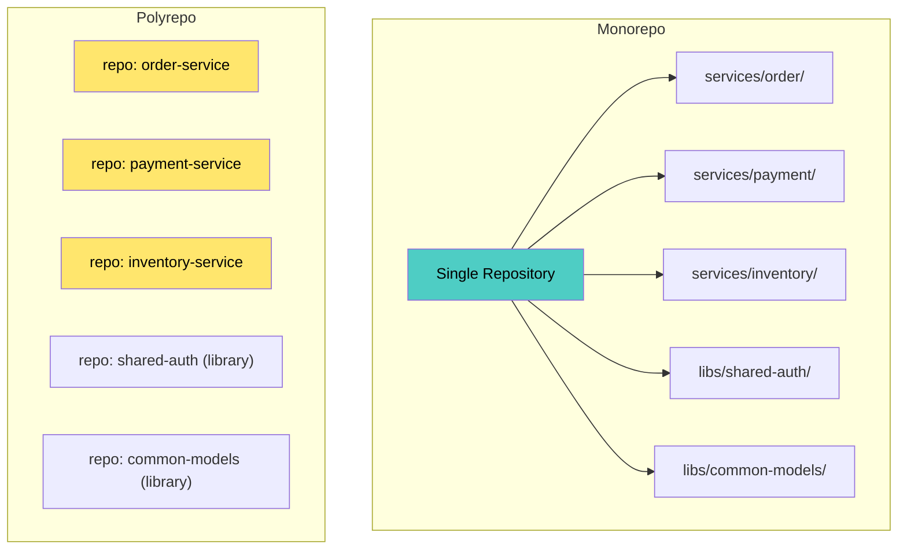
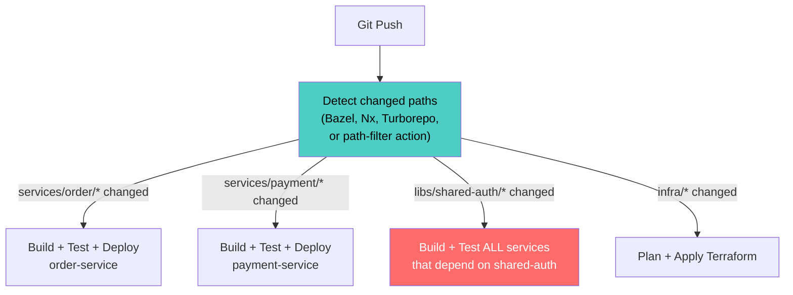
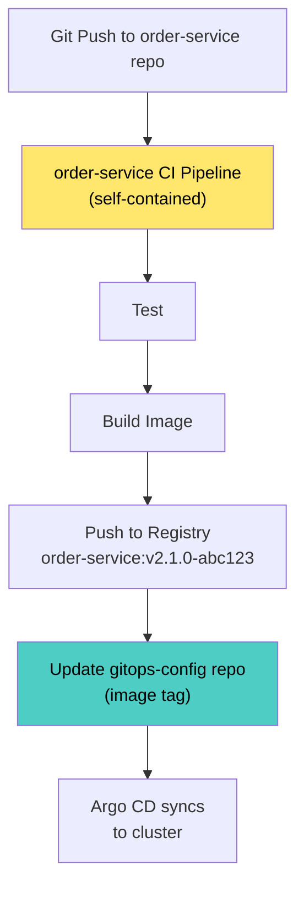
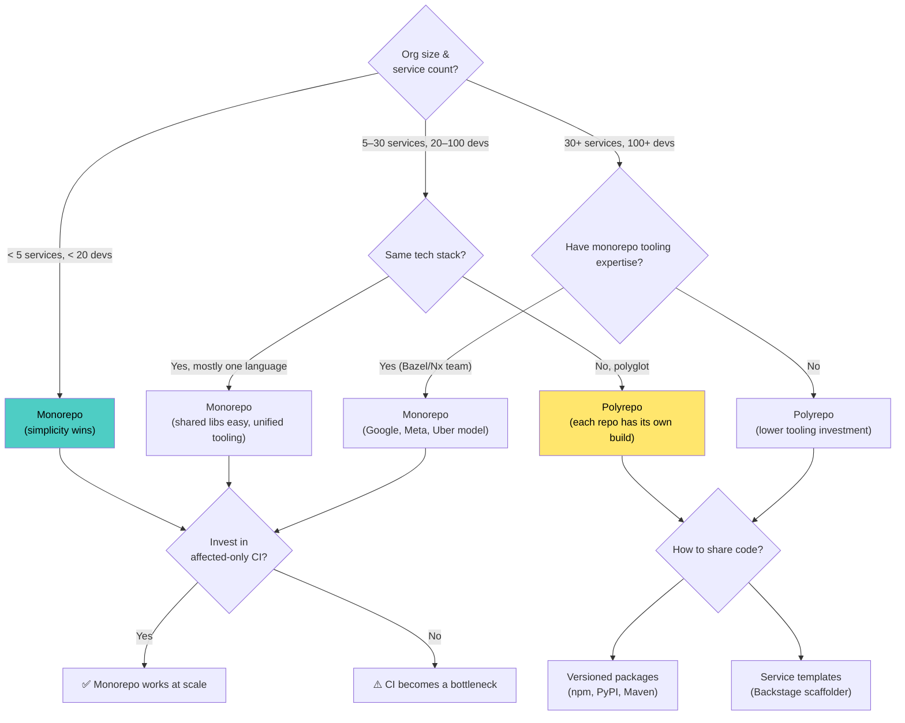
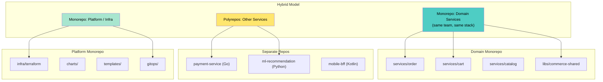
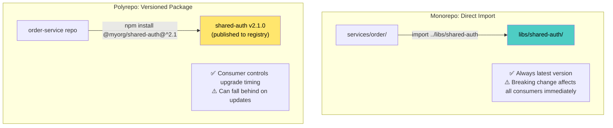
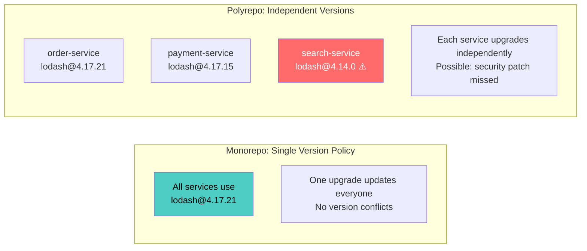

# Monorepo vs. Polyrepo for Microservices

---

## 1. The Core Question

When you have N microservices, do you put them in **one repository** (monorepo) or **N repositories** (polyrepo)? This is not just a Git decision — it shapes your CI/CD, code sharing, team boundaries, dependency management, and developer experience.



---

## 2. Monorepo

### 2.1 Structure

```
myorg/
├── services/
│   ├── order-service/
│   │   ├── src/
│   │   ├── tests/
│   │   ├── Dockerfile
│   │   └── BUILD (or package.json, go.mod, etc.)
│   ├── payment-service/
│   │   ├── src/
│   │   ├── tests/
│   │   └── Dockerfile
│   └── inventory-service/
│       └── ...
├── libs/
│   ├── shared-auth/
│   ├── common-models/
│   └── observability/
├── infra/
│   ├── terraform/
│   └── k8s-manifests/
├── tools/
│   └── scripts/
├── .github/workflows/
├── CODEOWNERS
└── BUILD.workspace (Bazel, Nx, Turborepo)
```

### 2.2 How CI/CD Works in a Monorepo



**Affected-only builds** are critical — without them, every commit triggers builds for all services, negating the benefit.

### 2.3 Monorepo Tooling

| Tool | Language / Ecosystem | What It Does |
|---|---|---|
| **Bazel** | Polyglot | Hermetic builds, dependency graph, remote cache, affected-target detection |
| **Nx** | JS/TS (extensible) | Workspace dependency graph, affected commands, computation caching |
| **Turborepo** | JS/TS | Pipeline orchestration, remote caching, affected detection |
| **Pants** | Python, Go, Java | Like Bazel but simpler; good for Python monorepos |
| **Rush** | JS/TS | PNPM workspaces, per-project builds, changelogs |
| **Lerna** (legacy) | JS/TS | Package management (largely replaced by Nx/Turborepo) |

---

## 3. Polyrepo

### 3.1 Structure

```
github.com/myorg/
├── order-service/          (repo)
│   ├── src/
│   ├── tests/
│   ├── Dockerfile
│   ├── helm/
│   └── .github/workflows/ci.yaml
├── payment-service/        (repo)
│   ├── src/
│   ├── tests/
│   ├── Dockerfile
│   └── .github/workflows/ci.yaml
├── inventory-service/      (repo)
│   └── ...
├── shared-auth/            (repo — published as package)
│   ├── src/
│   └── .github/workflows/publish.yaml
├── platform-templates/     (repo)
│   ├── service-template/
│   └── ci-template/
└── gitops-config/          (repo — K8s manifests)
    ├── order-service/
    ├── payment-service/
    └── inventory-service/
```

### 3.2 How CI/CD Works in Polyrepo



Each repo has its **own pipeline, own tests, own deployment**. Shared libraries are consumed as **versioned packages** (npm, PyPI, Maven, Go modules).

---

## 4. Comparison

| Dimension | Monorepo | Polyrepo |
|---|---|---|
| **Code visibility** | Everyone sees everything | Teams see only their repos (can be restricted) |
| **Code sharing** | Direct import from `libs/` | Versioned packages (npm, pip, Maven) |
| **Dependency management** | Single version of every dependency (unified) | Each repo manages its own versions |
| **Atomic cross-service changes** | One PR changes multiple services + shared lib | Multiple PRs across repos; coordinated merges |
| **CI/CD complexity** | Needs affected-only detection (Bazel/Nx) | Simple per-repo pipelines |
| **Build times** | Can be slow without smart tooling; fast with remote cache | Naturally scoped; each repo builds only itself |
| **Ownership boundaries** | CODEOWNERS file per directory | Repo-level access control (simple) |
| **Onboarding** | Clone one repo, see everything | Discover and clone multiple repos |
| **IDE performance** | Can slow down with very large repos | Fast (small repo) |
| **Git performance** | Degrades at scale (needs sparse checkout, VFS) | Always fast |
| **Refactoring** | Easy: one PR renames across services | Hard: rename in lib → publish → update N consumers |
| **Independent deployability** | Possible but requires discipline | Natural — separate repo, separate pipeline |
| **Tooling investment** | High (Bazel, Nx, custom CI) | Low (standard CI per repo) |

---

## 5. Decision Framework



### 5.1 When Monorepo Wins

- **Small-to-medium org** with shared tech stack
- **Tight coupling** between services during early development
- Team frequently makes **cross-service changes**
- Willing to invest in **build tooling** (Bazel, Nx, Turborepo)
- Want **unified dependency versions** (no "works on my service" version conflicts)
- **Google, Meta, Uber, Twitter** model

### 5.2 When Polyrepo Wins

- **Large org** with many autonomous teams
- **Polyglot** services (Go, Java, Python, Rust — different build systems)
- Strong **team ownership** boundaries (each team fully owns their repo)
- Want **simple, standard CI** per service (no Bazel/Nx investment)
- Services are **loosely coupled** with well-defined APIs
- **Netflix, Amazon, Spotify** model

---

## 6. The Hybrid Approach

Most real organizations don't choose pure monorepo or pure polyrepo — they use a **hybrid**:



| Repo | Contains | Rationale |
|---|---|---|
| **Domain monorepo** | Services in the same bounded context, same stack | Tight collaboration, shared models, atomic changes |
| **Separate repos** | Services in different stacks or owned by different orgs | Independent lifecycle, different build systems |
| **Platform monorepo** | Terraform, Helm charts, GitOps config, templates | Unified infrastructure management |

---

## 7. Solving Key Challenges

### 7.1 Code Sharing



### 7.2 Cross-Service Changes

| Scenario | Monorepo | Polyrepo |
|---|---|---|
| Rename a shared model field | 1 PR: update lib + all consumers | 1 PR: publish new lib version; N PRs: update each consumer |
| Add a new API endpoint + consumer | 1 PR (or 2 for safety) | 2 PRs: provider repo + consumer repo, coordinated merge |
| Security patch in shared library | 1 commit: all services updated atomically | Publish patch; wait for N repos to upgrade (Renovate/Dependabot helps) |

### 7.3 Dependency Version Management



### 7.4 CODEOWNERS (Monorepo Ownership)

```
# CODEOWNERS
/services/order/         @team-alpha
/services/payment/       @team-beta
/services/inventory/     @team-gamma
/libs/shared-auth/       @platform-team
/libs/common-models/     @team-alpha @team-beta  # joint ownership
/infra/                  @platform-team
```

Each team **approves PRs only for their directories** — ownership in a monorepo matches polyrepo ownership via CODEOWNERS.

---

## 8. CI/CD Patterns

### 8.1 Monorepo CI with Affected Detection

```yaml
# GitHub Actions — monorepo with path filters
name: CI
on:
  push:
    branches: [main]

jobs:
  detect-changes:
    runs-on: ubuntu-latest
    outputs:
      order: ${{ steps.filter.outputs.order }}
      payment: ${{ steps.filter.outputs.payment }}
      shared-auth: ${{ steps.filter.outputs.shared-auth }}
    steps:
      - uses: dorny/paths-filter@v3
        id: filter
        with:
          filters: |
            order:
              - 'services/order/**'
              - 'libs/shared-auth/**'
            payment:
              - 'services/payment/**'
              - 'libs/shared-auth/**'
            shared-auth:
              - 'libs/shared-auth/**'

  build-order:
    needs: detect-changes
    if: needs.detect-changes.outputs.order == 'true'
    runs-on: ubuntu-latest
    steps:
      - run: echo "Build and test order-service"

  build-payment:
    needs: detect-changes
    if: needs.detect-changes.outputs.payment == 'true'
    runs-on: ubuntu-latest
    steps:
      - run: echo "Build and test payment-service"
```

### 8.2 Polyrepo CI — Simple and Self-Contained

```yaml
# order-service/.github/workflows/ci.yaml
name: CI
on:
  push:
    branches: [main]
  pull_request:

jobs:
  build:
    runs-on: ubuntu-latest
    steps:
      - uses: actions/checkout@v4
      - run: make test
      - run: make build
      - run: docker build -t order-service:${{ github.sha }} .
      - run: docker push order-service:${{ github.sha }}
```

No path detection needed — the entire repo is one service.

### 8.3 Polyrepo: Automated Dependency Updates

```yaml
# Renovate config in each service repo
# renovate.json
{
  "extends": ["config:base"],
  "packageRules": [
    {
      "matchPackagePatterns": ["@myorg/*"],
      "automerge": true,
      "automergeType": "pr",
      "schedule": ["before 9am on Monday"]
    }
  ]
}
```

Renovate/Dependabot opens PRs automatically when shared libraries publish new versions — reducing the lag in polyrepo updates.

---

## 9. Git Performance at Scale

### 9.1 Monorepo Scaling Challenges

| Problem | At What Scale | Solution |
|---|---|---|
| `git clone` is slow | > 1 GB repo | Shallow clone (`--depth 1`), partial clone (`--filter=blob:none`) |
| `git status` is slow | > 100K files | `git sparse-checkout` (only check out relevant dirs) |
| `git log` is slow | > 1M commits | `--no-walk`, limit scope to path |
| IDE indexing is slow | > 500K files | Sparse checkout + IDE path exclusions |
| CI clones full repo | Every build | Shallow clone + path filters |

```bash
# Sparse checkout: developer only works on order-service
git clone --filter=blob:none --sparse https://github.com/myorg/monorepo.git
cd monorepo
git sparse-checkout set services/order libs/shared-auth
# Only these directories are on disk
```

### 9.2 Monorepo at Extreme Scale

| Company | Repo Size | Tooling |
|---|---|---|
| **Google** | 86 TB, 2B LOC | Custom VFS (Piper), Bazel, CitC |
| **Meta** | ~hundreds of GB | Custom Mercurial (Sapling), Buck2 |
| **Microsoft** | Windows repo: 300 GB | VFS for Git (GVFS), now Scalar |
| **Uber** | Large monorepo | Bazel, custom tooling |

These companies invested **years of tooling effort** to make monorepos work at scale. Without similar investment, Git-based monorepos start struggling around **10–50 GB / 100K+ files**.

---

## 10. Anti-Patterns

| Anti-Pattern | Problem | Fix |
|---|---|---|
| **Monorepo without affected-only CI** | Every commit builds all services → 2-hour CI | Invest in Bazel/Nx/Turborepo or path-filter detection |
| **Polyrepo with tight coupling** | Services can't be deployed independently despite separate repos | Fix architecture first; separate repos don't fix coupling |
| **Shared lib as a monorepo shortcut** | Giant "commons" library couples everything | Small, focused libraries with clear APIs |
| **Copy-paste across polyrepos** | Same boilerplate in 30 repos, drifts over time | Service templates (Backstage) + shared CI workflows |
| **No CODEOWNERS in monorepo** | Anyone merges anywhere → accidental breakage | CODEOWNERS + required reviews per directory |
| **Polyrepo with no dependency automation** | Shared library updates require manual PRs in 30 repos | Renovate/Dependabot with automerge for internal packages |
| **Monorepo for polyglot services** | Go, Python, Java, Rust with different build systems in one repo | Hybrid: monorepo per language/stack; polyrepo across stacks |
| **"Let's use a monorepo like Google"** | Without Google's tooling investment (Bazel, custom VFS, remote cache) | Be realistic about tooling investment or choose polyrepo |

---

## 11. Checklist

### Monorepo
- [ ] Affected-only CI detection implemented (Bazel, Nx, Turborepo, or path filters)
- [ ] Remote build cache enabled (avoid rebuilding unchanged targets)
- [ ] CODEOWNERS file maps directories to teams
- [ ] Branch protection requires team-specific approvals
- [ ] Sparse checkout documented for developers working on subset
- [ ] Shared libraries in `libs/` with clear dependency boundaries
- [ ] CI runs in < 15 minutes for single-service changes

### Polyrepo
- [ ] Service template (Backstage scaffolder) for consistent new service setup
- [ ] Shared CI workflow templates (reusable GitHub Actions / GitLab CI includes)
- [ ] Shared libraries published to internal package registry (npm, PyPI, Maven)
- [ ] Renovate/Dependabot configured for automated dependency updates
- [ ] GitOps config repo aggregates all service manifests
- [ ] Service catalog (Backstage) provides discoverability across repos

### Both
- [ ] Each service independently buildable, testable, and deployable
- [ ] Immutable image tags (git-sha or semver, never `:latest`)
- [ ] Contract tests validate cross-service compatibility
- [ ] No shared database across services (regardless of repo structure)
- [ ] "Can I Deploy?" gate before production deployment

---

## 12. Recommendation

| Situation | Recommendation |
|---|---|
| **Startup / small team (< 20 devs, < 10 services)** | **Monorepo** — simplicity, atomic changes, easy code sharing. Use Nx/Turborepo for JS/TS or Pants for Python. |
| **Medium org (20–100 devs), single stack** | **Monorepo** with Bazel/Nx + CODEOWNERS. Invest in affected-only CI. |
| **Medium org, polyglot** | **Hybrid** — monorepo per domain/stack, polyrepo across stacks. |
| **Large org (100+ devs), strong team autonomy** | **Polyrepo** — each team owns their repo and pipeline. Invest in templates, shared CI, and Renovate. |
| **Enterprise, extreme scale** | **Monorepo with heavy tooling** (Bazel + remote cache + custom VFS) *or* **Polyrepo with strong platform** (Backstage + shared CI + package registry). |

The key insight: **the repo strategy should follow your team structure, not the other way around**. If teams are tightly collaborative and share a tech stack, a monorepo reduces friction. If teams are autonomous with different stacks, polyrepo matches their independence. Neither is universally better — choose based on your org's size, stack diversity, and willingness to invest in tooling.

---

**Next steps to explore:** Bazel / Nx Build System Deep Dive, Inner Source & InnerSource Practices, Platform Engineering & Developer Experience.