# Database-per-Service vs. Shared Database in Microservices

---

## 1. The Core Trade-Off

This is one of the most consequential architectural decisions in microservices. It determines how tightly or loosely your services are coupled at the data layer.

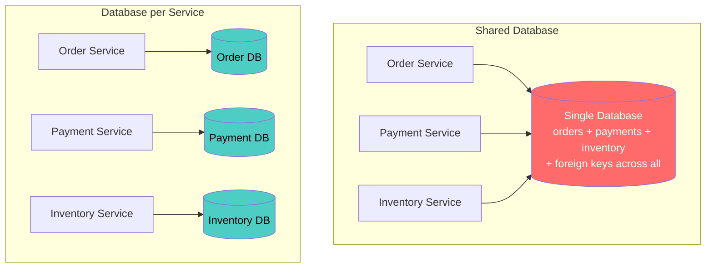

**Short answer: Database-per-service is the recommended pattern for microservices.** A shared database negates the core benefits of the architecture. But the real answer has nuance — here's why, when, and how.

---

## 2. Why Shared Database Is Problematic

### 2.1 Coupling at the Data Layer

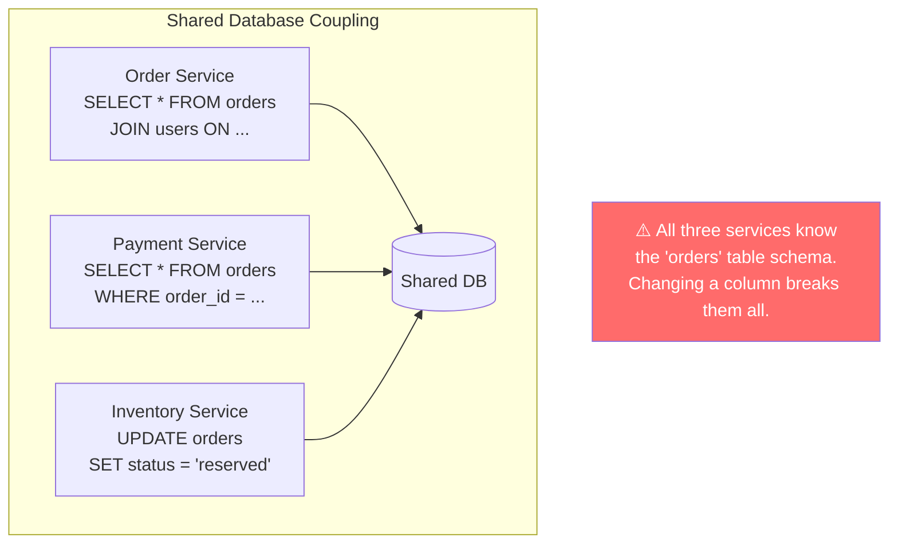

| Problem | What Happens |
|---|---|
| **Schema coupling** | Changing a column in `orders` requires coordinating changes across Order, Payment, and Inventory services simultaneously |
| **No independent deployment** | Can't deploy Order Service v2 (new schema) without deploying all other services that read `orders` |
| **No independent scaling** | Can't scale the database for one service's read load without affecting others |
| **Ownership ambiguity** | Who owns the `orders` table — Order Service or everyone? |
| **Testing complexity** | Every service's tests need the full shared schema |
| **Technology lock-in** | All services must use the same database engine |

### 2.2 The Independence Test

> **If you can't deploy Service A without coordinating with Service B, they are not independent microservices — they are a distributed monolith.**

A shared database fails this test. Every schema change requires cross-team coordination.

---

## 3. Why Database-per-Service Is Recommended

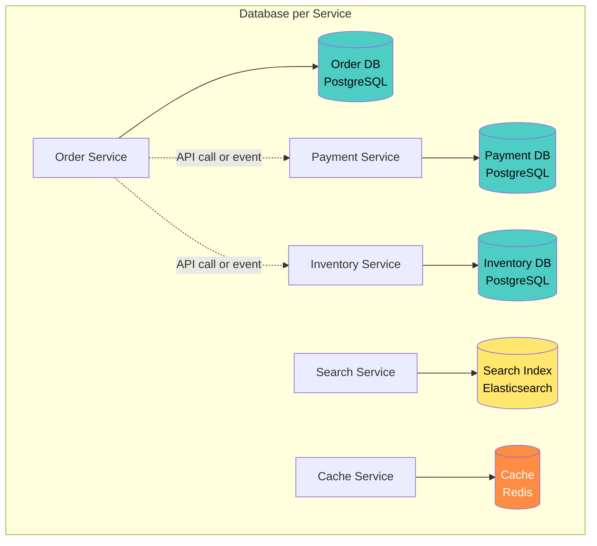

| Benefit | How |
|---|---|
| **Independent deployment** | Change Order DB schema without touching Payment Service |
| **Independent scaling** | Scale Inventory DB reads separately from Order DB writes |
| **Technology freedom** | PostgreSQL for orders, Elasticsearch for search, Redis for cache |
| **Clear ownership** | Team Alpha owns Order Service *and* its database |
| **Fault isolation** | Inventory DB crash doesn't take down Payments |
| **Schema evolution** | Expand-contract migrations within one team, no cross-team coordination |

---

## 4. Comparison

| Dimension | Shared Database | Database per Service |
|---|---|---|
| **Data consistency** | Strong (ACID transactions, foreign keys) | Eventual (sagas, events) |
| **Query flexibility** | Easy JOINs across all data | No cross-service JOINs |
| **Schema changes** | Coordinate across all consuming services | Team-local change |
| **Independent deploy** | ❌ No — schema couples all services | ✅ Yes |
| **Independent scale** | ❌ No — one DB for all load | ✅ Yes — per-service scaling |
| **Polyglot persistence** | ❌ No — one engine for all | ✅ Yes — best tool per use case |
| **Operational complexity** | Low (one DB to manage) | Higher (N databases to manage) |
| **Infrastructure cost** | Lower (one instance) | Higher (N instances — mitigated by managed services) |
| **Data duplication** | None | Some (event-carried state, read models) |
| **Debugging** | Easy (single DB, SQL JOINs) | Harder (distributed traces, multiple data stores) |

---

## 5. How to Handle Cross-Service Data Needs

The main objection to database-per-service: "But I need to JOIN data from multiple services!" Here are the patterns:

### 5.1 API Composition

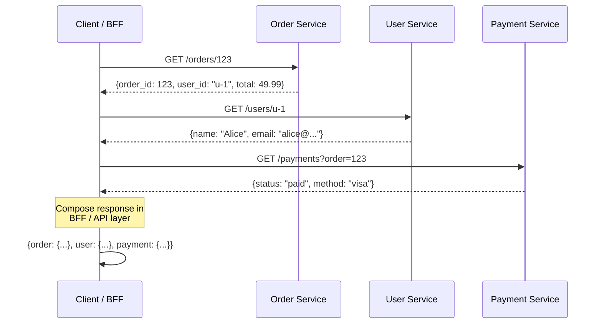

**When:** Real-time data needed, low fan-out (2–3 services).

### 5.2 Event-Carried State Transfer

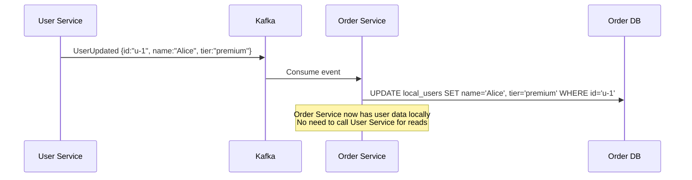

**When:** High-read, low-write data that other services need frequently. Trades consistency (eventual) for performance (no network call).

### 5.3 CQRS — Separate Read Model

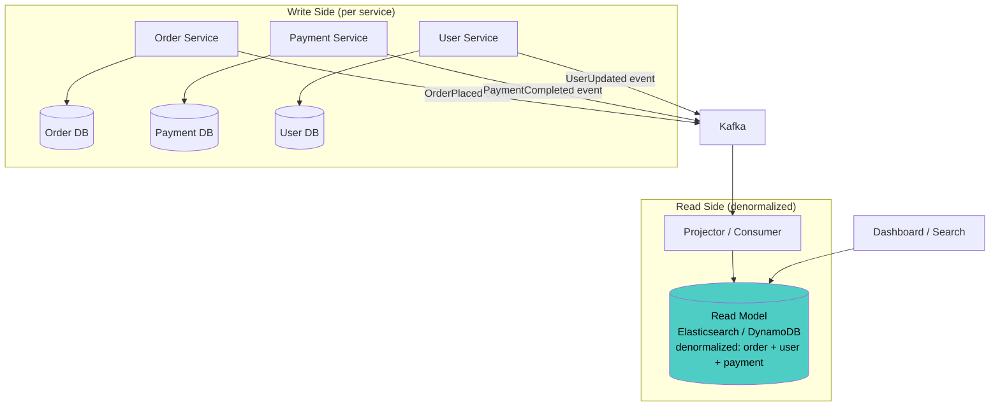

**When:** Complex queries across multiple domains (dashboards, search, reporting). Build a **denormalized read model** from events — optimized for the specific query pattern.

### 5.4 Saga for Distributed Transactions

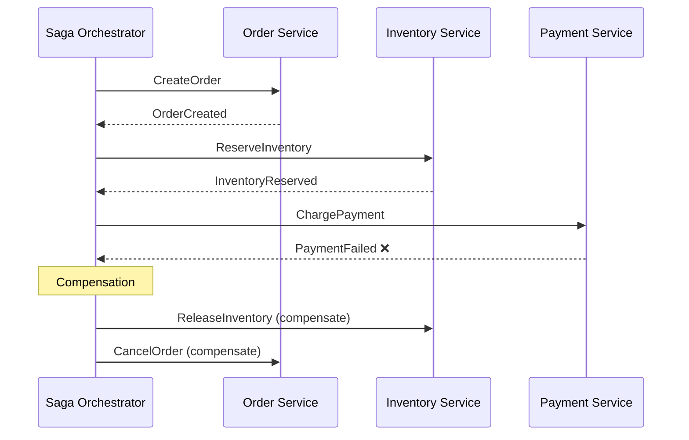

**When:** Multi-service write operations that must be atomic (all-or-nothing). Replaces distributed transactions (2PC) with compensating actions.

### 5.5 Pattern Selection Guide

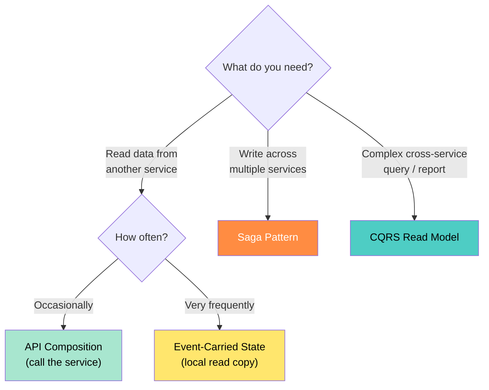

---

## 6. Database-per-Service Doesn't Mean One Database Server per Service

A common misconception: "database per service = buy N database servers." In practice:

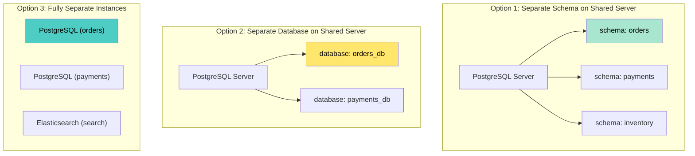

| Isolation Level | Mechanism | Cost | Isolation Strength |
|---|---|---|---|
| **Separate schema** (same server) | Different schema/namespace, same DB server | Lowest | Logical only — shared CPU, memory, connections |
| **Separate database** (same server) | Different databases, same server process | Low | Better — separate connection pools, but shared resources |
| **Separate instance** | Different DB servers (or managed instances) | Highest | Full — independent scaling, failure isolation |

**Start with separate schemas; graduate to separate instances** as services grow and need independent scaling or different database engines.

---

## 7. Polyglot Persistence

Database-per-service enables choosing the **best database for each service's access pattern**:

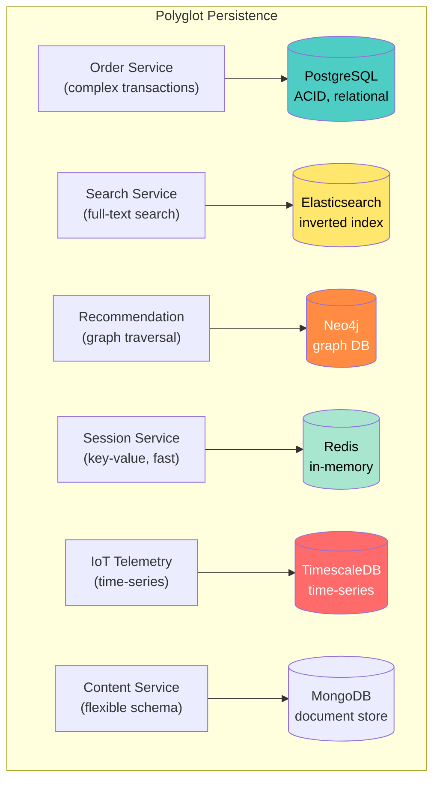

| Access Pattern | Best Fit Database |
|---|---|
| Complex transactions, relations | PostgreSQL, MySQL |
| Full-text search, filtering | Elasticsearch, OpenSearch |
| Key-value, caching, sessions | Redis, Memcached |
| Document store, flexible schema | MongoDB, DynamoDB |
| Time-series data | TimescaleDB, InfluxDB |
| Graph relationships | Neo4j, Amazon Neptune |
| Wide-column, high write throughput | Cassandra, ScyllaDB |
| Event log, streaming | Kafka (as storage) |

---

## 8. When a Shared Database Might Be Acceptable

Despite the recommendation, there are scenarios where sharing is pragmatic:

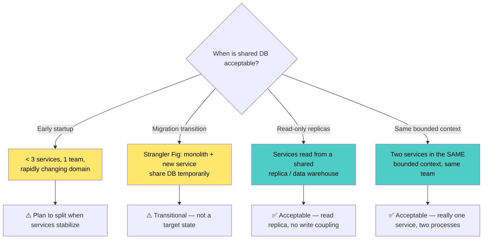

| Scenario | Shared DB OK? | Condition |
|---|---|---|
| **Startup with 2–3 services, 1 team** | Temporarily yes | Plan the split; use separate schemas at minimum |
| **During monolith → microservices migration** | Temporarily yes | Strangler Fig transitional phase |
| **Shared read replica / data warehouse** | Yes | Read-only; no write coupling |
| **Two processes in same bounded context** | Yes | Same team, same domain, same deploy — arguably one service |
| **Stable production microservices** | No | Violates independent deployability |

---

## 9. Operational Considerations

### 9.1 Managing N Databases

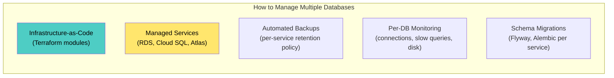

| Concern | Solution |
|---|---|
| **Provisioning N databases** | Terraform modules; service template auto-provisions DB |
| **Backup and recovery** | Managed service handles it (RDS snapshots, Cloud SQL backups) |
| **Monitoring** | Per-service dashboards: connection pool, query latency, disk |
| **Schema migrations** | Each service runs its own migrations (Flyway, Alembic, Liquibase) |
| **Cost** | Start with shared server + separate schemas; separate instances only for high-traffic services |
| **Connection pool management** | PgBouncer / ProxySQL for connection pooling at scale |

### 9.2 Migration Path from Shared to Separate

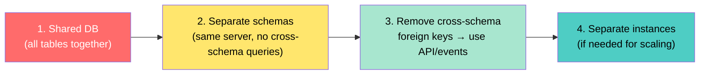

---

## 10. Data Consistency Patterns Summary

| Pattern | Consistency | Complexity | Use Case |
|---|---|---|---|
| **Single DB transaction** | Strong (ACID) | Low | Only within one service's database |
| **Saga (orchestration)** | Eventual (compensating) | Medium | Multi-service writes with defined steps |
| **Saga (choreography)** | Eventual (event-driven) | Medium | Decoupled workflows |
| **Outbox pattern** | At-least-once delivery | Medium | Reliable event publishing from DB writes |
| **Event sourcing** | Eventual | High | Full audit trail, temporal queries |
| **Two-phase commit (2PC)** | Strong | High | ❌ Avoid in microservices (blocks, doesn't scale) |

---

## 11. Anti-Patterns

| Anti-Pattern | Problem | Fix |
|---|---|---|
| **Shared database as the integration layer** | Services coupled at schema level; can't deploy independently | Database per service + API/event integration |
| **Cross-service JOINs via shared DB** | Tight data coupling; schema change breaks consumers | API composition or CQRS read model |
| **Direct table access by other services** | No encapsulation; any service can read/write any table | Each service's DB is private; expose data via API |
| **Distributed transactions (2PC)** | Locks, latency, partial failures, doesn't scale | Saga pattern with compensating actions |
| **"Just add a foreign key"** | Cross-service FK creates schema coupling | Store IDs as opaque references; validate via API |
| **One giant read model** | Central data warehouse becomes a bottleneck | Purpose-built read models per consumer |
| **Premature polyglot** | Using 5 different databases for 5 services when PostgreSQL works for all | Start with one engine; diversify when access patterns demand it |
| **No data ownership** | "The `orders` table belongs to everyone" | One service owns each table; others access via API |

---

## 12. Decision Framework

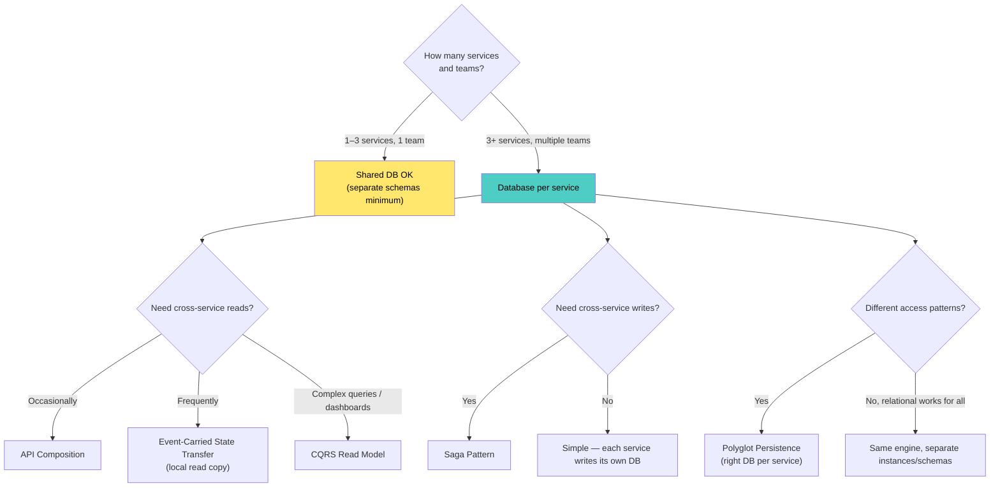

---

## 13. Checklist

### Data Ownership
- [ ] Each service owns its database exclusively (no shared write access)
- [ ] Other services access data only via the owning service's API or events
- [ ] No cross-service foreign keys in any database
- [ ] Data ownership documented in service catalog

### Data Access
- [ ] Cross-service reads use API composition or event-carried state
- [ ] Cross-service queries use CQRS read models (not shared DB JOINs)
- [ ] Multi-service writes use saga pattern (not distributed transactions)
- [ ] Outbox pattern used for reliable event publishing

### Operations
- [ ] Each service manages its own schema migrations
- [ ] Databases provisioned via IaC (Terraform / Pulumi)
- [ ] Per-service database monitoring (connections, queries, disk)
- [ ] Backup and recovery tested per service
- [ ] Connection pooling configured appropriately

### Evolution
- [ ] Migration path from shared schema → separate schema → separate instance documented
- [ ] Polyglot persistence considered where access patterns diverge
- [ ] Data consistency requirements explicitly documented per interaction (strong vs. eventual)

---

## 14. Recommendation

**Database-per-service is the correct default for microservices.**

| Phase | Approach |
|---|---|
| **Starting out (< 3 services, 1 team)** | Shared server, separate schemas — low cost, logical isolation |
| **Growing (3–10 services)** | Separate schemas, eliminate cross-schema queries, add event-driven data sharing |
| **Mature (10+ services)** | Separate instances for high-traffic services; polyglot persistence where needed |
| **At scale** | Managed databases, CQRS read models, event-carried state, automated provisioning via platform |

The core principle: **a service's database is a private implementation detail, just like its code.** No other service should know or care what tables exist, what engine is used, or how data is stored. The only contract is the service's API. This is what makes independent deployment, independent scaling, and independent evolution possible.

---

**Next steps to explore:** Saga Pattern Deep Dive, CQRS & Event Sourcing, Data Mesh for Microservices.