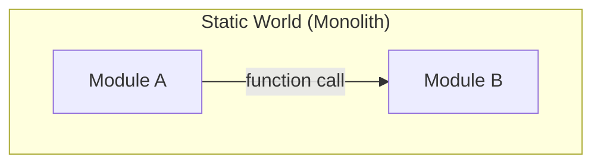
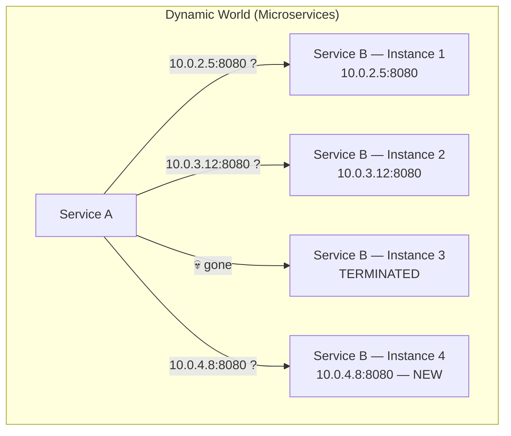
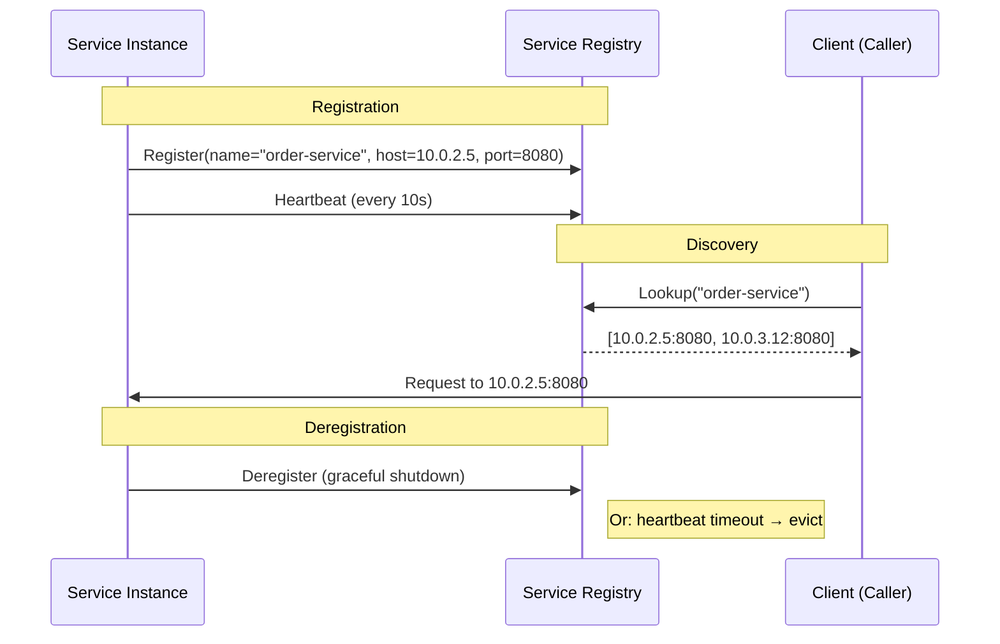
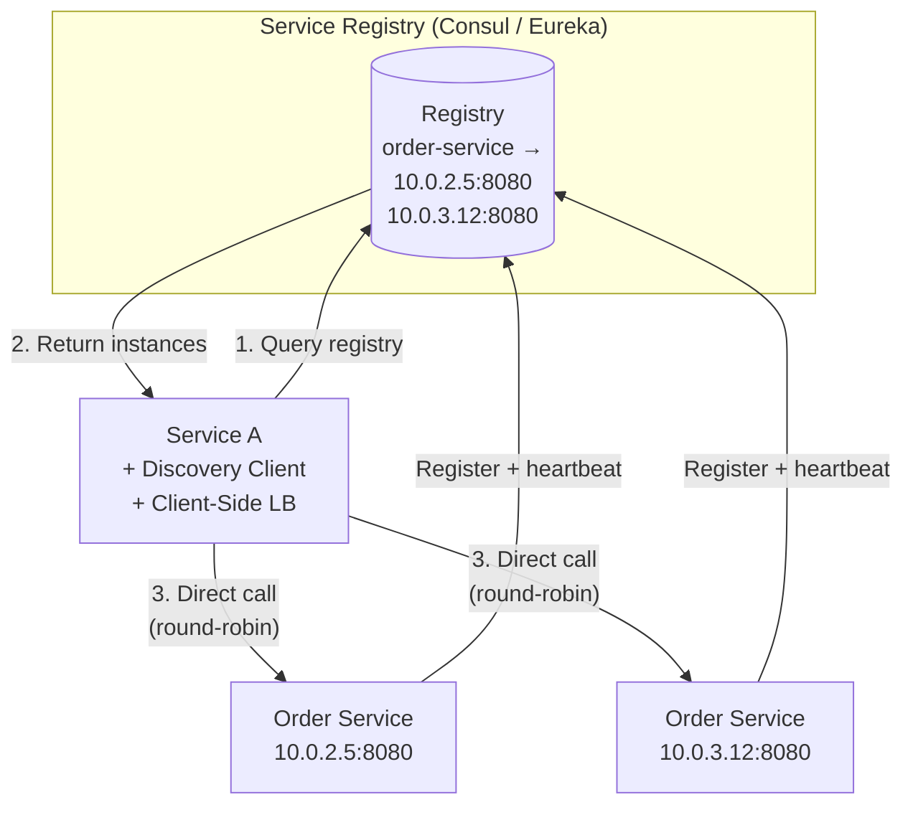
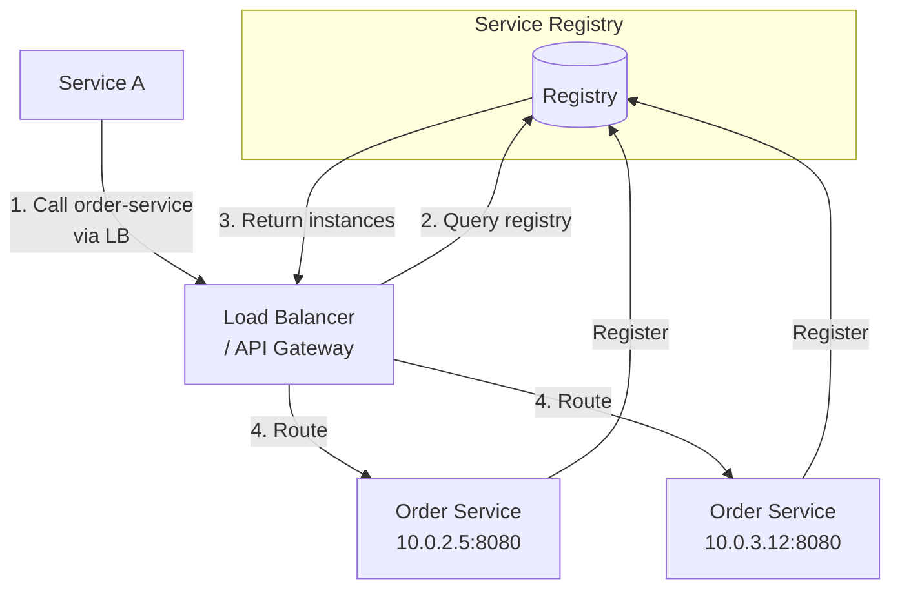
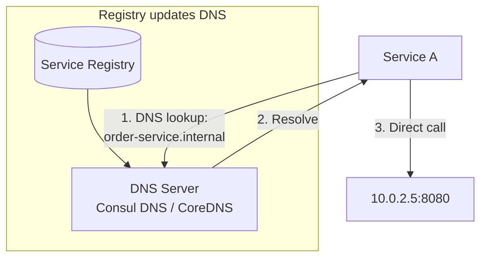
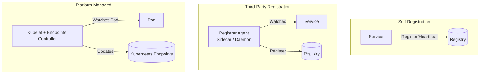
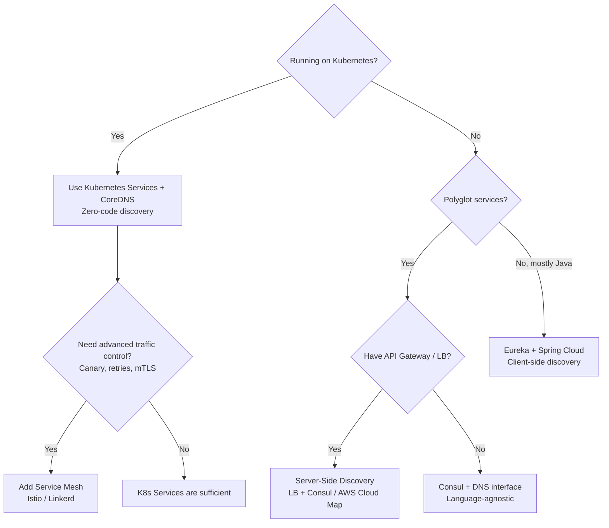
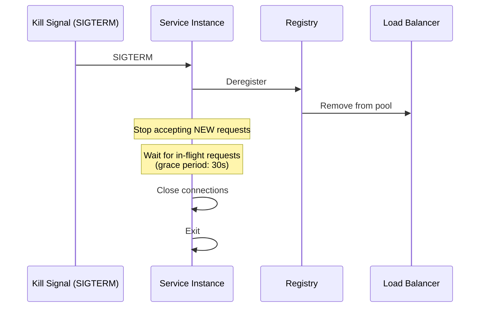

# How to handle service discovery and registration in a Microservices architecture?

In a monolith, components call each other via in-process function calls — the "address" is a method signature. In microservices, services are **ephemeral processes on dynamic IPs and ports** — instances spin up, die, scale, and migrate. Service discovery answers the fundamental question: **"Where is Service B right now?"**

Without it, you're hardcoding URLs — and the first autoscaling event or container restart breaks everything.

---

## 1. The Problem





| Challenge | Why It's Hard |
|-----------|--------------|
| **Dynamic IPs** | Containers get new IPs on every restart/reschedule |
| **Scaling events** | New instances appear; old instances disappear |
| **Rolling deployments** | Old and new versions coexist temporarily |
| **Multi-environment** | Same service name resolves differently in dev/staging/prod |
| **Health** | A registered instance may be alive but not healthy |

---

## 2. Core Concepts



| Concept | Definition |
|---------|-----------|
| **Service Registry** | A database of available service instances and their network locations |
| **Registration** | A service instance announces itself to the registry on startup |
| **Discovery** | A client queries the registry to find instances of a target service |
| **Health checking** | Registry or load balancer verifies instances are alive and ready |
| **Deregistration** | Instance removed on shutdown or after missed heartbeats |

---

## 3. Options Analysis

### Option A: Client-Side Discovery

The client queries the registry directly and chooses an instance (client-side load balancing).



| Criterion | Assessment |
|-----------|-----------|
| **Load balancing** | Client controls the algorithm (round-robin, weighted, least-connections) |
| **Coupling** | High — every client embeds discovery + LB logic |
| **Polyglot support** | Poor — need a discovery SDK per language |
| **Latency** | Low — direct service-to-service call, no proxy hop |
| **Failure mode** | Stale cache may route to dead instances; needs TTL + retry |
| **Examples** | Netflix Eureka + Ribbon (Java), Spring Cloud Discovery |

### Option B: Server-Side Discovery (Load Balancer)

A dedicated load balancer / reverse proxy queries the registry and routes requests.



| Criterion | Assessment |
|-----------|-----------|
| **Load balancing** | Centralized — LB handles it; consistent across all callers |
| **Coupling** | Low — clients just know the LB address; discovery logic is centralized |
| **Polyglot support** | Excellent — clients are plain HTTP callers |
| **Latency** | Extra hop through the LB (+1-2ms) |
| **Failure mode** | LB is a potential single point of failure — needs HA setup |
| **Examples** | AWS ALB + ECS, Nginx + Consul Template, HAProxy |

### Option C: DNS-Based Discovery

Use DNS SRV or A records that update dynamically as instances change.



| Criterion | Assessment |
|-----------|-----------|
| **Coupling** | Very low — standard DNS; no SDK needed |
| **TTL problem** | DNS caching (OS, JVM, library) can serve stale records for seconds to minutes |
| **Health-aware** | Only if DNS provider integrates health checks (Consul does) |
| **Load balancing** | DNS round-robin only — no weighted, no least-connections |
| **Examples** | Consul DNS interface, CoreDNS (Kubernetes), AWS Cloud Map |

### Option D: Platform-Native Discovery (Kubernetes / Service Mesh)

The orchestration platform provides discovery as a built-in feature.

```mermaid
graph TB
    subgraph "Kubernetes Cluster"
        SA[Pod: Service A] -- "order-service:8080<br/>(Kubernetes Service DNS)" --> KS[Kubernetes Service<br/>(Virtual IP: ClusterIP)]
        KS -- "kube-proxy / iptables" --> OB1[Pod: Order Service 1]
        KS -- "kube-proxy / iptables" --> OB2[Pod: Order Service 2]
        KS -- "kube-proxy / iptables" --> OB3[Pod: Order Service 3]
    end

    subgraph "With Service Mesh (Istio)"
        SA2[Pod: Service A] --> EP[Envoy Sidecar Proxy]
        EP -- "Discovers endpoints<br/>via control plane" --> OB4[Pod: Order Service]
        CP[Istio Control Plane] -.-> EP
    end
```

| Criterion | Assessment |
|-----------|-----------|
| **Coupling** | Zero — services just use DNS names; platform handles everything |
| **Health-aware** | Yes — readiness probes remove unhealthy pods from endpoints |
| **Load balancing** | Basic (kube-proxy: random/round-robin) or advanced (Istio: weighted, locality-aware) |
| **Polyglot** | Perfect — transparent to application code |
| **Complexity** | Low (K8s native) or medium-high (with service mesh) |
| **Lock-in** | Tied to Kubernetes platform |
| **Examples** | Kubernetes Services + CoreDNS, Istio, Linkerd |

---

## 4. Comparison

| Criterion | Client-Side | Server-Side (LB) | DNS-Based | Platform-Native (K8s) |
|-----------|------------|-------------------|-----------|----------------------|
| **Coupling** | High (SDK per language) | Low | Very Low | Zero |
| **Latency** | Lowest (direct) | +1-2ms (proxy hop) | Low (direct after resolve) | Low (kube-proxy) / +1ms (mesh) |
| **Load balancing** | Rich (client-controlled) | Rich (LB-controlled) | Basic (DNS round-robin) | Basic (K8s) / Rich (mesh) |
| **Health awareness** | Client must handle stale cache | LB health checks | TTL lag | Readiness probes (real-time) |
| **Polyglot** | Poor | Excellent | Excellent | Excellent |
| **Operational cost** | Low infra, high dev | Medium (HA LB) | Low | Low (K8s) / Medium (mesh) |
| **Stale routing risk** | Medium (cache TTL) | Low (LB checks actively) | High (DNS TTL) | Low (endpoint updates are fast) |

---

## 5. Registration Patterns

| Pattern | How It Works | Pros | Cons |
|---------|-------------|------|------|
| **Self-registration** | Service registers itself on startup, sends heartbeats, deregisters on shutdown | Simple; service controls its own lifecycle | Every service needs registration logic; language-dependent |
| **Third-party registration** | A sidecar or platform agent registers the service | Service is unaware of registry; polyglot-friendly | Extra component to operate (registrar) |
| **Platform-managed** | K8s Endpoints controller, ECS service discovery | Zero application code | Platform lock-in |



---

## 6. Recommendation: Decision Tree



| Environment | Recommendation |
|------------|---------------|
| **Kubernetes** | Use K8s Services (ClusterIP + DNS). Add Istio/Linkerd only if you need canary deployments, mTLS, or advanced routing. |
| **AWS ECS / Fargate** | AWS Cloud Map (native integration) + ALB for server-side discovery |
| **Spring Boot ecosystem (Java)** | Eureka + Spring Cloud LoadBalancer for client-side discovery |
| **Polyglot, non-K8s** | Consul (supports DNS + HTTP API + health checks) + server-side LB |
| **VM-based legacy** | Consul or etcd + Nginx/HAProxy with template-based config reload |

---

## 7. Key Implementation Concerns

| Concern | What to Do |
|---------|-----------|
| **Graceful shutdown** | Deregister from registry *before* closing connections; allow in-flight requests to complete |
| **Startup readiness** | Don't register until the service is ready (DB connections established, caches warmed) |
| **Health check granularity** | Liveness ≠ Readiness. A service can be alive (process running) but not ready (DB connection lost) |
| **DNS TTL in JVM** | Java caches DNS forever by default (`networkaddress.cache.ttl`). Set to 30-60s for dynamic environments |
| **Stale instance routing** | Use retries + circuit breakers to handle the window between instance death and registry update |
| **Cross-cluster / multi-region** | Need global service discovery — Consul federation, Istio multi-cluster, or AWS Cloud Map |

### Graceful Shutdown Sequence



---

## 8. Anti-Patterns

| Anti-Pattern | Consequence |
|--------------|------------|
| **Hardcoded IPs/ports in config** | Breaks on every scale event, deployment, or restart |
| **DNS with long TTL + no retry** | Routes to dead instances for minutes after they terminate |
| **No health checks in registry** | Zombie instances stay registered; callers get connection refused errors |
| **Registering before ready** | Traffic hits the service before it can handle it → errors during startup |
| **No graceful shutdown** | In-flight requests dropped; load balancer sends traffic to dying instance |
| **Using service discovery for config** | Consul KV != service registry. Mix them and you get operational confusion |
| **Client-side discovery in polyglot** | Maintaining discovery SDKs in Java, .NET, Go, Python — quadrupled effort |

---

## 9. Next Steps

1. **What's your deployment platform?** — Kubernetes, ECS, VMs, bare metal?
2. **How many services and languages?** — Drives the polyglot support requirement.
3. **Do you already have a load balancer or API gateway?** — Can be extended for server-side discovery.
4. **Multi-region?** — Adds global discovery requirements.
5. **What's your current approach?** — Hardcoded URLs? Environment variables? Already using a registry?
